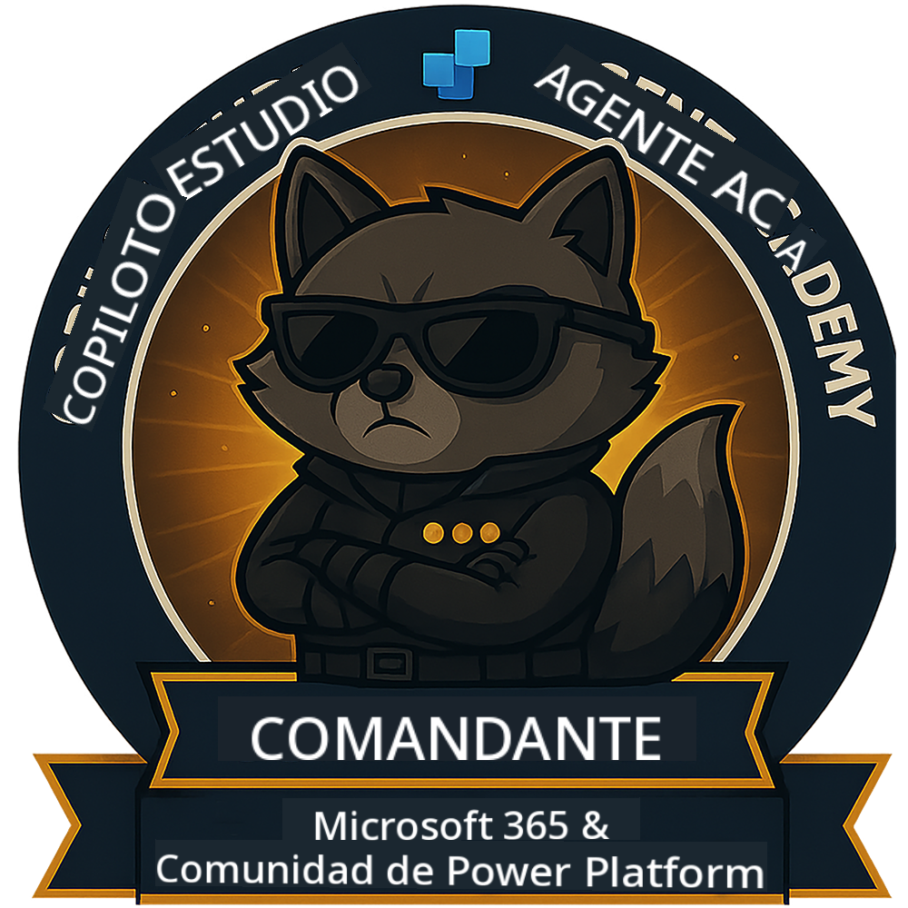

<!--
CO_OP_TRANSLATOR_METADATA:
{
  "original_hash": "8fb14b79c8616d9533f641ac2d555e8c",
  "translation_date": "2025-10-17T19:35:33+00:00",
  "source_file": "docs/commander/README.md",
  "language_code": "es"
}
-->
---
ocultar:
- navegación
---

# Comandante (Próximamente)

Este curso es aún muy secreto. ¡Se desbloqueará en el futuro! 🔓

{ width="300" }

<!-- markdownlint-disable-next-line MD033 -->

---

**Descargo de responsabilidad**:  
Este documento ha sido traducido utilizando el servicio de traducción automática [Co-op Translator](https://github.com/Azure/co-op-translator). Aunque nos esforzamos por lograr precisión, tenga en cuenta que las traducciones automáticas pueden contener errores o imprecisiones. El documento original en su idioma nativo debe considerarse como la fuente autorizada. Para información crítica, se recomienda una traducción profesional realizada por humanos. No nos hacemos responsables de malentendidos o interpretaciones erróneas que surjan del uso de esta traducción.