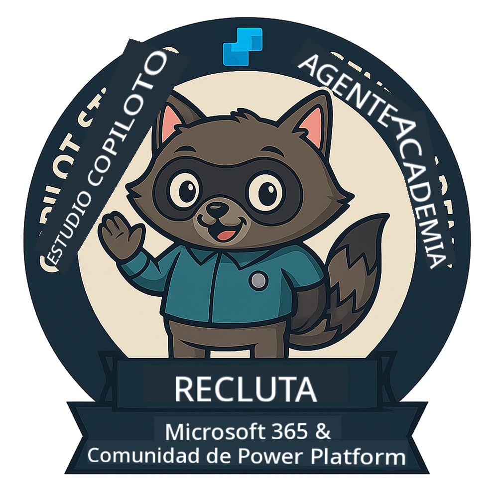
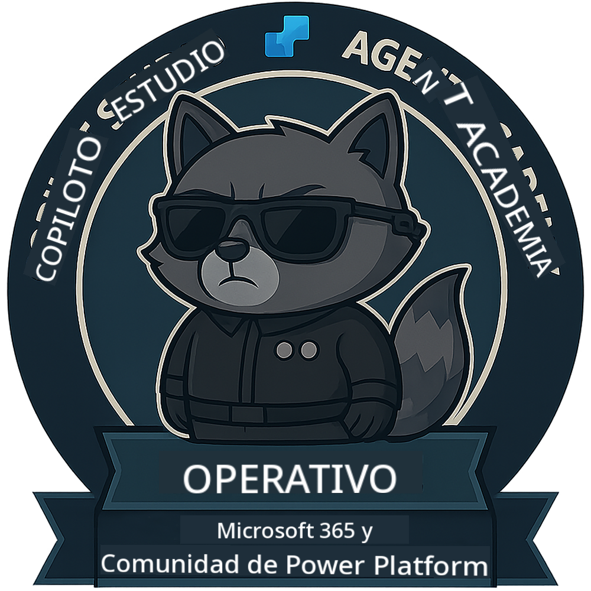

<!--
CO_OP_TRANSLATOR_METADATA:
{
  "original_hash": "15e57e059ce7689d602d7853187235cd",
  "translation_date": "2025-10-17T18:52:25+00:00",
  "source_file": "docs/index.md",
  "language_code": "es"
}
-->
---
hide:
- navigation
---

# Academia de Agentes de Copilot Studio

**Bienvenido a la Academia de Agentes de Copilot Studio.**  

Tu misión, si decides aceptarla, es dominar el arte de construir agentes utilizando **Microsoft Copilot Studio**.

Este entrenamiento práctico es tu punto de entrada al **mundo de los agentes**: desde prompts fundamentados hasta Adaptive Cards y flujos de agentes, aprenderás cómo construir, escalar y desplegar agentes inteligentes utilizando herramientas y casos de uso reales.

---

## 🏅 Progresión de Rango

La **Academia de Agentes de Copilot Studio** es un programa de entrenamiento en varias fases diseñado para desarrollar tus habilidades a través de tres rangos de agente. Cada nivel incluye una insignia y responsabilidades crecientes:

| Rango            | Nivel | Visual |
|------------------|:-----:|--------|
| 🟢 **Recluta**  [🚀 Comenzar](https://aka.ms/agent-academy-recruit){ .md-button .md-button--primary }     | •     | { width="300" }     |
| 🔵 **Operativo** (Próximamente)   | ••    | { width="300" } |
| 🟡 **Comandante** (Próximamente)    | •••   | { width="300" } |

Cada nivel se construye sobre el anterior. Completa tu misión de Recluta y mantente atento para avanzar en tus credenciales de agente.

---

## 🎒 Otros Cursos

Explora estos otros cursos para seguir aprendiendo sobre IA y Agentes:

- [Microsoft Copilot Studio <3 MCP Lab](https://aka.ms/mcsmcplab)
- [Campamento de Desarrolladores de Copilot](https://microsoft.github.io/copilot-camp/)
- [Agentes de IA para Principiantes](https://microsoft.github.io/ai-agents-for-beginners/)
- [Protocolo de Contexto de Modelos (MCP) para Principiantes](https://github.com/microsoft/mcp-for-beginners)

---

## 🚑 Problemas

¡Agradecemos mucho tus comentarios! Por favor, utiliza la [lista de problemas](https://github.com/microsoft/agent-academy/issues) para compartir tus comentarios e inconvenientes. ¡Gracias!

---

## 📜 Código de Conducta

Este proyecto ha adoptado el [Código de Conducta de Código Abierto de Microsoft](https://opensource.microsoft.com/codeofconduct/).

!!! info "Recursos:"

    - [Código de Conducta de Código Abierto de Microsoft](https://opensource.microsoft.com/codeofconduct/)
    - [Preguntas Frecuentes sobre el Código de Conducta de Microsoft](https://opensource.microsoft.com/codeofconduct/faq/)
    - Contacta a [opencode@microsoft.com](mailto:opencode@microsoft.com) para preguntas o inquietudes

---

[⭐️ Dale una estrella a nuestro repositorio](https://github.com/microsoft/agent-academy){ .md-button .md-button--primary }

<!-- markdownlint-disable-next-line MD033 -->

---

**Descargo de responsabilidad**:  
Este documento ha sido traducido utilizando el servicio de traducción automática [Co-op Translator](https://github.com/Azure/co-op-translator). Aunque nos esforzamos por lograr precisión, tenga en cuenta que las traducciones automáticas pueden contener errores o imprecisiones. El documento original en su idioma nativo debe considerarse la fuente autorizada. Para información crítica, se recomienda una traducción profesional realizada por humanos. No nos hacemos responsables de malentendidos o interpretaciones erróneas que surjan del uso de esta traducción.