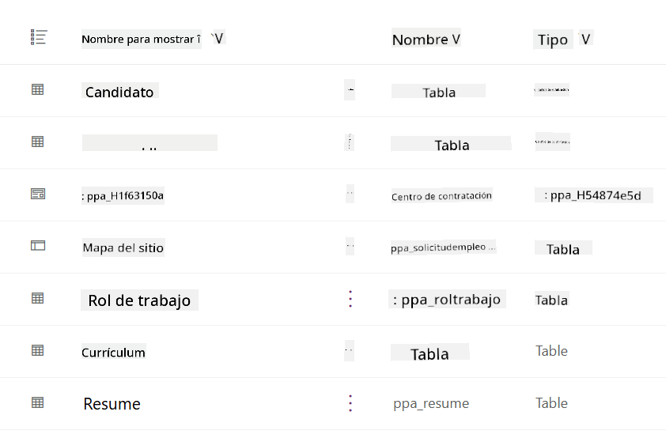
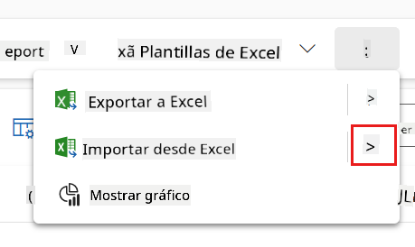
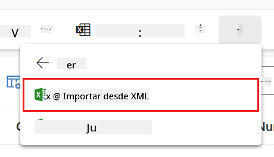
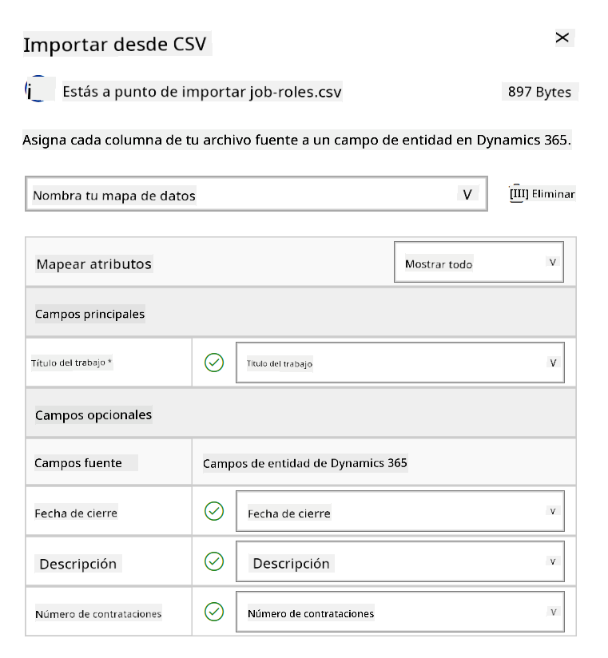
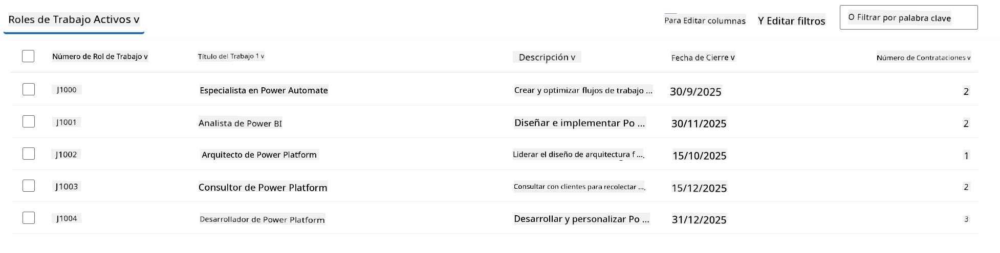
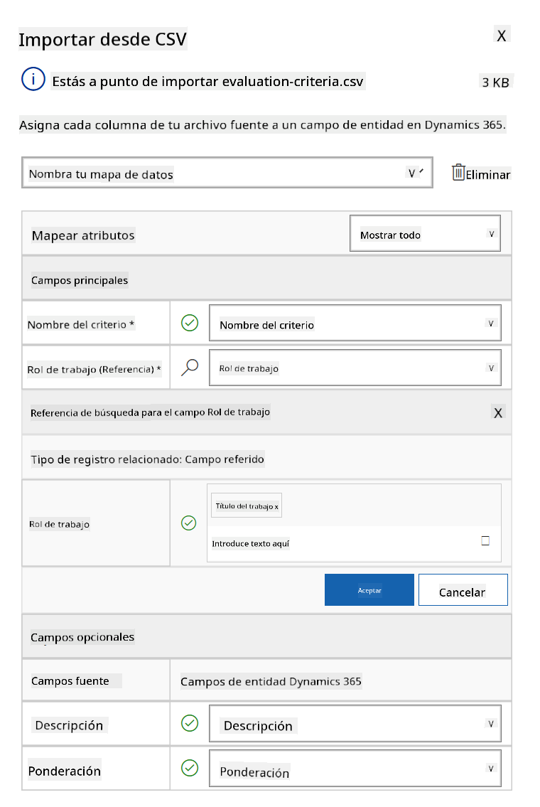
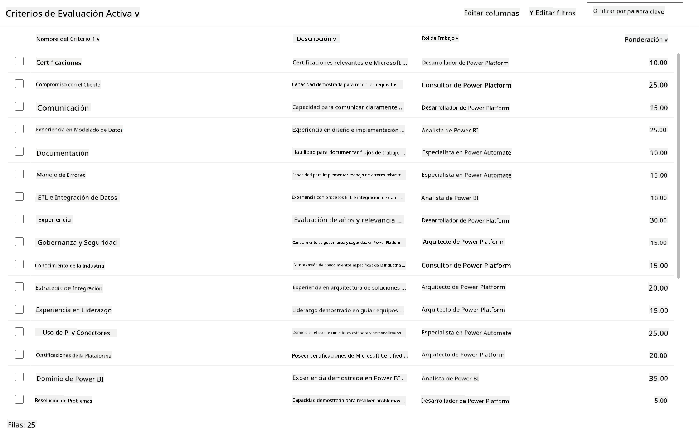

<!--
CO_OP_TRANSLATOR_METADATA:
{
  "original_hash": "2620cf9eaf09a3fc6be7fa31a3a62956",
  "translation_date": "2025-10-17T19:22:41+00:00",
  "source_file": "docs/operative-preview/01-get-started/README.md",
  "language_code": "es"
}
-->
# 🚨 Misión 01: Comienza con el Agente de Contratación

--8<-- "disclaimer.md"

## 🕵️‍♂️ NOMBRE CLAVE: `OPERACIÓN CAZA TALENTOS`

> **⏱️ Ventana de Tiempo de la Operación:** `~45 minutos`

## 🎯 Resumen de la Misión

Bienvenido, Agente. Tu primera asignación es **Operación Caza Talentos**: establecer la infraestructura básica para un sistema de contratación impulsado por IA que transformará la forma en que las organizaciones identifican y contratan a los mejores talentos.

Tu misión, si decides aceptarla, es implementar y configurar un sistema integral de gestión de contratación utilizando Microsoft Copilot Studio. Importarás una solución preconstruida que contiene todas las estructuras de datos necesarias y luego crearás tu primer agente de IA: el **Agente de Contratación**, que será el coordinador central de todas las futuras operaciones de reclutamiento.

Este despliegue inicial establece el centro de mando que mejorarás a lo largo del programa de Operativos de la Academia de Agentes. Considera esto como tu base de operaciones: el fundamento sobre el cual construirás toda una red de agentes especializados en misiones posteriores.

---

## 🔎 Objetivos

Al completar esta misión, lograrás:

- **Comprensión del Escenario**: Adquirir conocimiento integral sobre los desafíos y soluciones de automatización de contratación.
- **Despliegue de la Solución**: Importar y configurar con éxito los fundamentos de un sistema de gestión de contratación.
- **Creación de Agentes**: Construir un agente de contratación que será el inicio del escenario que desarrollarás como Operativo de la Academia de Agentes.

---

## 🔍 Requisitos Previos

Antes de embarcarte en esta misión, asegúrate de tener:

- Licencia de Copilot Studio
- Acceso a un entorno de Microsoft Power Platform
- Permisos administrativos para crear soluciones y agentes

---

## 🏢 Comprendiendo el Escenario de Automatización de Contratación

Este escenario demuestra cómo una empresa puede usar Microsoft Copilot Studio para mejorar y automatizar su proceso de contratación. Introduce un sistema de agentes que trabajan juntos para manejar tareas como revisar currículums, recomendar roles laborales, preparar materiales para entrevistas y evaluar candidatos.

### Valor Empresarial

La solución ayuda a los equipos de recursos humanos a ahorrar tiempo y tomar mejores decisiones al:

- Procesar automáticamente los currículums recibidos por correo electrónico.
- Sugerir roles laborales adecuados basados en los perfiles de los candidatos.
- Crear solicitudes de empleo y guías de entrevistas personalizadas para cada candidato.
- Garantizar prácticas de contratación justas y cumplidoras mediante características de seguridad y moderación integradas.
- Recopilar comentarios para mejorar la solución.

### Cómo Funciona

- Un **Agente de Contratación** central coordina el proceso y almacena datos en Microsoft Dataverse.
- Un **Agente de Recepción de Solicitudes** lee currículums y crea solicitudes de empleo.
- Un **Agente de Preparación de Entrevistas** genera preguntas y documentos de entrevista basados en el historial del candidato.
- El sistema puede publicarse en un sitio web de demostración, permitiendo que las partes interesadas interactúen con él.

Este escenario es ideal para organizaciones que buscan modernizar sus flujos de trabajo de contratación utilizando automatización impulsada por IA, mientras mantienen transparencia, equidad y eficiencia.

---

## 🧪 Laboratorio: Configura el Agente de Contratación

En este laboratorio práctico, establecerás la base para tu sistema de automatización de contratación. Comenzarás importando una solución preconfigurada que contiene todas las tablas de Dataverse necesarias y la estructura de datos para gestionar candidatos, puestos de trabajo y flujos de trabajo de contratación. Luego, llenarás estas tablas con datos de muestra que apoyarán tu aprendizaje a lo largo de este módulo y proporcionarán escenarios realistas para pruebas. Finalmente, crearás el Agente de Contratación en Copilot Studio, configurando la interfaz conversacional básica que será la piedra angular de todas las demás características que agregarás en futuras misiones.

### 🧪 Laboratorio 1.1: Importar solución

1. Ve a **[Copilot Studio](https://copilotstudio.microsoft.com)**
1. Selecciona el **...** en la navegación izquierda y selecciona **Soluciones**
1. Selecciona el botón **Importar Solución** en la parte superior
1. **[Descarga](https://raw.githubusercontent.com/microsoft/agent-academy/refs/heads/main/docs/operative-preview/01-get-started/assets/Operative_1_0_0_0.zip)** la solución preparada
1. Selecciona **Examinar** y elige la solución descargada en el paso anterior
1. Selecciona **Siguiente**
1. Selecciona **Importar**

!!! success
    Al éxito, verás una barra de notificación verde con el siguiente mensaje cuando se complete:  
    "Solución "Operative" importada exitosamente."

Cuando la solución se haya importado, revisa lo que has importado seleccionando el nombre de la solución (`Operative`).



Los siguientes componentes se importan:

| Nombre para Mostrar | Tipo | Descripción |
|---------------------|------|-------------|
| Candidato | Tabla | Información del candidato |
| Criterios de Evaluación | Tabla | Criterios de evaluación para el puesto |
| Centro de Contratación | Aplicación Model-Driven | Aplicación para gestionar el proceso de contratación |
| Centro de Contratación | Mapa del Sitio | Estructura de navegación para la aplicación Centro de Contratación |
| Solicitud de Empleo | Tabla | Solicitudes de empleo |
| Rol Laboral | Tabla | Roles laborales |
| Currículum | Tabla | Currículums de los candidatos |

Como última tarea de este laboratorio, selecciona el botón **Publicar todas las personalizaciones** en la parte superior de la página.

### 🧪 Laboratorio 1.2: Importar datos de muestra

En este laboratorio, agregarás datos de muestra a algunas de las tablas que importaste en el laboratorio 1.1.

#### Descarga los archivos para importar

1. **[Descarga](https://raw.githubusercontent.com/microsoft/agent-academy/refs/heads/main/docs/operative-preview/01-get-started/assets/evaluation-criteria.csv)** el archivo CSV con los criterios de evaluación
1. **[Descarga](https://raw.githubusercontent.com/microsoft/agent-academy/refs/heads/main/docs/operative-preview/01-get-started/assets/job-roles.csv)** el archivo CSV con los roles laborales

#### Importar los datos de muestra de Roles Laborales

1. Regresa a la solución que acabas de importar en el último laboratorio
1. Selecciona la aplicación Model-Driven **Centro de Contratación** marcando la casilla frente a la fila
1. Selecciona el botón **Reproducir** en la parte superior

    !!! warning
        Es posible que se te solicite iniciar sesión nuevamente. Asegúrate de hacerlo. Después de eso, deberías ver la aplicación Centro de Contratación.

1. Selecciona **Roles Laborales** en la navegación izquierda
1. Selecciona el ícono **Más** (tres puntos uno debajo del otro) en la barra de comandos
1. Selecciona la **flecha derecha** junto a *Importar desde Excel*

    

1. Selecciona **Importar desde CSV**

    

1. Selecciona el botón **Elegir Archivo**, selecciona el archivo **job-roles.csv** que acabas de descargar y luego selecciona **Abrir**
1. Selecciona **Siguiente**
1. Deja el siguiente paso como está y selecciona **Revisar Mapeo**

    

1. Asegúrate de que el mapeo sea correcto y selecciona **Finalizar Importación**

    !!! info
        Esto iniciará una importación y podrás seguir el progreso o finalizar el proceso inmediatamente seleccionando **Hecho**

1. Selecciona **Hecho**

Esto puede tardar un poco, pero puedes presionar el botón **Actualizar** para ver si la importación se ha completado.



#### Importar los datos de muestra de Criterios de Evaluación

1. Selecciona **Criterios de Evaluación** en la navegación izquierda
1. Selecciona el ícono **Más** (tres puntos uno debajo del otro) en la barra de comandos
1. Selecciona la **flecha derecha** junto a *Importar desde Excel*

    

1. Selecciona **Importar desde CSV**

    

1. Selecciona el botón **Elegir Archivo**, selecciona el archivo **evaluation-criteria.csv** que acabas de descargar y luego selecciona **Abrir**
1. Selecciona **Siguiente**
1. Deja el siguiente paso como está y selecciona **Revisar Mapeo**

    

1. Ahora tenemos que hacer un poco más de trabajo para el mapeo. Selecciona la lupa (ícono 🔎) junto al campo Rol Laboral
1. Asegúrate de que **Título del Puesto** esté seleccionado aquí, y si no, agrégalo
1. Selecciona **Aceptar**
1. Asegúrate de que el resto del mapeo también sea correcto y selecciona **Finalizar Importación**

    !!! info
        Esto iniciará otra importación y podrás seguir el progreso o finalizar el proceso inmediatamente seleccionando **Hecho**

1. Selecciona **Hecho**

Esto puede tardar un poco, pero puedes presionar el botón **Actualizar** para ver si la importación se ha completado.



### 🧪 Laboratorio 1.3: Crear el agente de contratación

Ahora que has terminado con la configuración de los requisitos previos, ¡es hora de trabajar! ¡Primero agreguemos nuestro Agente de Contratación!

1. Ve a **[Copilot Studio](https://copilotstudio.microsoft.com)** y asegúrate de estar en el mismo entorno donde importaste la solución y los datos
1. Selecciona **Agentes** en la navegación izquierda
1. Selecciona **Nuevo Agente**
1. Selecciona **Configurar**
1. Para **Nombre**, ingresa:

    ```text
    Hiring Agent
    ```

1. Para **Descripción**, ingresa:

    ```text
    Central orchestrator for all hiring activities
    ```

1. Selecciona el **...** junto al botón *Crear* en la esquina superior derecha
1. Selecciona **Actualizar configuración avanzada**
1. Como **Solución**, selecciona `Operative`
1. Selecciona **Actualizar**
1. Selecciona **Crear** en la esquina superior derecha

Esto creará el Agente de Contratación para ti, que usarás a lo largo de este curso de Operativos.

---

## 🎉 Misión Completa

¡La Misión 01 está completada! Ahora has dominado las siguientes habilidades:

✅ **Comprensión del Escenario**: Conocimiento integral sobre los desafíos y soluciones de automatización de contratación  
✅ **Despliegue de la Solución**: Importaste y configuraste con éxito los fundamentos de un sistema de gestión de contratación  
✅ **Creación de Agentes**: Construiste un agente de contratación que es el inicio del escenario que desarrollarás como Operativo de la Academia de Agentes  

A continuación, [Misión 02](../02-multi-agent/README.md): Prepara tu agente para ser multiagente con agentes conectados.

---

## 📚 Recursos Tácticos

📖 [Microsoft Copilot Studio - Crear un agente](https://learn.microsoft.com/microsoft-copilot-studio/authoring-first-bot)  
📖 [Documentación de Microsoft Dataverse](https://learn.microsoft.com/power-apps/maker/data-platform)

---

**Descargo de responsabilidad**:  
Este documento ha sido traducido utilizando el servicio de traducción automática [Co-op Translator](https://github.com/Azure/co-op-translator). Aunque nos esforzamos por garantizar la precisión, tenga en cuenta que las traducciones automáticas pueden contener errores o imprecisiones. El documento original en su idioma nativo debe considerarse como la fuente autorizada. Para información crítica, se recomienda una traducción profesional realizada por humanos. No nos hacemos responsables de malentendidos o interpretaciones erróneas que puedan surgir del uso de esta traducción.