<!--
CO_OP_TRANSLATOR_METADATA:
{
  "original_hash": "616d142d4fb5f45d2a168fad6c1f9545",
  "translation_date": "2025-10-17T19:32:39+00:00",
  "source_file": "docs/operative-preview/07-multimodal-prompts/README.md",
  "language_code": "es"
}
-->
# 🚨 Misión 07: Extracción de Contenidos de Currículums con Prompts Multimodales

--8<-- "disclaimer.md"

## 🕵️‍♂️ NOMBRE CLAVE: `DOCUMENT RESUME RECON`

> **⏱️ Ventana de Tiempo de la Operación:** `~45 minutos`

## 🎯 Resumen de la Misión

Bienvenido, Operativo. Tus misiones anteriores te han dotado de habilidades poderosas para la orquestación de agentes, pero ahora es momento de desbloquear una capacidad revolucionaria: **análisis multimodal de documentos**.

Tu asignación, si decides aceptarla, es **Document Resume Recon** - extraer datos estructurados de cualquier documento con precisión. Aunque tus agentes pueden procesar texto con facilidad, el mundo real requiere manejar PDFs, imágenes y documentos complejos diariamente. Los currículums se acumulan, las facturas necesitan ser procesadas y los formularios requieren digitalización instantánea.

Esta misión te transformará de un creador de agentes solo de texto a un **experto multimodal**. Aprenderás a configurar IA que lee y entiende documentos como un analista humano, pero con la velocidad y consistencia de la IA. Al final de la misión, habrás construido un sistema completo de extracción de currículums que se integra con tu flujo de trabajo de contratación.

Las técnicas que aprendas aquí serán esenciales para las operaciones avanzadas de fundamentación de datos en tu próxima misión.

## 🔎 Objetivos

En esta misión, aprenderás:

1. Qué son los prompts multimodales y cuándo usar diferentes modelos de IA
1. Cómo configurar prompts con entradas de imágenes y documentos
1. Cómo formatear las salidas de los prompts como JSON para la extracción de datos estructurados
1. Mejores prácticas para la ingeniería de prompts con análisis de documentos
1. Cómo integrar prompts multimodales con Flujos de Agentes

## 🧠 Entendiendo los prompts multimodales

### ¿Qué hace que un prompt sea "multimodal"?

Los prompts tradicionales trabajan solo con texto. Pero los prompts multimodales pueden procesar múltiples tipos de contenido:

- **Texto**: Instrucciones escritas y contenido
- **Imágenes**: Fotos, capturas de pantalla, gráficos y diagramas (.PNG, .JPG, .JPEG)  
- **Documentos**: Facturas, currículums, formularios (.PDF)

Esta capacidad abre escenarios poderosos como analizar currículums, procesar facturas o extraer datos de formularios.

### Por qué los multimodales son importantes para tus flujos de trabajo

Cada día, tu organización enfrenta estos desafíos de procesamiento de documentos:

- **Revisión de currículums**: Leer manualmente cientos de currículums consume tiempo valioso
- **Procesamiento de facturas**: Extraer detalles de proveedores, montos y fechas de formatos variados de documentos
- **Análisis de formularios**: Convertir formularios en papel en datos digitales

Los prompts multimodales eliminan estos cuellos de botella combinando la comprensión del lenguaje de la IA con capacidades de análisis visual. Esto le da a tu IA la habilidad de procesar documentos tan eficazmente como texto.

### Escenarios comunes de negocio

Aquí hay algunos ejemplos de cómo se pueden aplicar los prompts multimodales:

| Escenario                | Tarea                                                                                                                                      | Campos de Salida Ejemplo                                                                                   |
|-------------------------|-------------------------------------------------------------------------------------------------------------------------------------------|---------------------------------------------------------------------------------------------------------|
| **Revisión de currículums**    | Extraer nombre del candidato, correo electrónico, teléfono, título actual, años de experiencia y habilidades clave.                                                 | Nombre del Candidato, Dirección de Correo Electrónico, Número de Teléfono, Título Actual, Años de Experiencia, Habilidades Clave         |
| **Procesamiento de facturas**  | Extraer información del proveedor, fecha de la factura, monto total y elementos de línea de esta factura.                                                 | Nombre del Proveedor, Fecha de la Factura, Monto Total, Elementos de Línea de la Factura                                             |
| **Análisis de formularios**       | Analizar este formulario de solicitud y extraer todos los campos completados.                                                                              | Nombre del Campo (por ejemplo, Nombre del Solicitante), Valor Ingresado (por ejemplo, John Doe), ...                                  |
| **Verificación de documentos de identificación** | Extraer nombre, número de identificación, fecha de vencimiento y dirección de este documento de identificación. Verificar que todo el texto sea claramente legible y marcar cualquier sección poco clara. | Nombre Completo, Número de Identificación, Fecha de Vencimiento, Dirección, Bandera de Secciones Poco Claras                        |

## ⚙️ Selección de modelos en AI Builder

AI Builder ofrece diferentes modelos optimizados para tareas específicas. Entender qué modelo usar es crucial para el éxito.

!!! note "Preciso hasta septiembre de 2025"
    Los modelos de AI Builder se actualizan regularmente, así que consulta la última [documentación de configuración de modelos de AI Builder](https://learn.microsoft.com/ai-builder/prompt-modelsettings) para la disponibilidad actual de modelos.

### Comparación de modelos

Todos los siguientes modelos admiten visión y procesamiento de documentos

| Modelo | 💰Costo | ⚡Velocidad | ✅Mejor para |
|-------|------|-------|----------|
| **GPT-4.1 mini** | Básico (más rentable) | Rápido | Procesamiento estándar de documentos, resumen, proyectos conscientes del presupuesto |
| **GPT-4.1** | Estándar | Moderado | Documentos complejos, creación avanzada de contenido, necesidades de alta precisión |
| **o3** | Premium | Lento (razones primero) | Análisis de datos, pensamiento crítico, resolución sofisticada de problemas |
| **GPT-5 chat** | Estándar | Mejorado | Última comprensión de documentos, mayor precisión en respuestas |
| **GPT-5 reasoning** | Premium | Lento (análisis complejo) | Análisis más sofisticado, planificación, razonamiento avanzado |

### Explicación de configuraciones de temperatura

La temperatura controla cuán creativas o predecibles son las respuestas de tu IA:

- **Temperatura 0**: Resultados más predecibles y consistentes (mejor para extracción de datos)
- **Temperatura 0.5**: Creatividad y consistencia equilibradas  
- **Temperatura 1**: Máxima creatividad (mejor para generación de contenido)

Para análisis de documentos, usa **temperatura 0** para garantizar una extracción de datos consistente.

## 📊 Formatos de salida: Texto vs JSON

Elegir el formato de salida correcto es crítico para el procesamiento posterior.

### Cuándo usar salida de texto

La salida de texto funciona bien para:

- Resúmenes legibles por humanos
- Clasificaciones simples
- Contenido que no necesita procesamiento estructurado

### Cuándo usar salida JSON

La salida JSON es esencial para:

- Extracción de datos estructurados
- Integración con bases de datos o sistemas
- Procesamiento de flujos de Power Automate
- Mapeo consistente de campos

### Mejores prácticas para JSON

1. **Definir nombres de campos claros**: Usa nombres descriptivos y consistentes
1. **Proporcionar ejemplos**: Incluye salida de muestra y valores para cada campo
1. **Especificar tipos de datos**: Incluye ejemplos para fechas, números y texto
1. **Manejar datos faltantes**: Planifica valores nulos o vacíos
1. **Validar estructura**: Prueba con varios tipos de documentos

### Consideraciones sobre la calidad del documento

- **Resolución**: Asegúrate de que las imágenes sean claras y legibles
- **Orientación**: Gira los documentos a la orientación correcta antes de procesarlos
- **Soporte de formato**: Prueba con tus tipos específicos de documentos (PDF, JPG, PNG)
- **Límites de tamaño**: Ten en cuenta las restricciones de tamaño de archivo en tu entorno

### Optimización del rendimiento

- **Elige modelos apropiados**: Actualiza modelos solo cuando sea necesario
- **Optimiza los prompts**: A menudo, las instrucciones más cortas y claras funcionan mejor
- **Manejo de errores**: Planifica para documentos que no puedan ser procesados
- **Monitorea costos**: Los diferentes modelos consumen diferentes cantidades de créditos de AI Builder

## 🧪 Laboratorio 7: Construyendo un sistema de extracción de currículums

Es hora de poner en práctica tu conocimiento multimodal. Construirás un sistema integral de extracción de currículums que analiza documentos de candidatos y los transforma en datos estructurados para tu flujo de trabajo de contratación.

### Prerrequisitos para completar esta misión

1. Necesitarás **ya sea**:

    - **Haber completado la Misión 06** y tener tu sistema de contratación multiagente listo, **O**
    - **Importar la solución inicial de la Misión 07** si estás comenzando desde cero o necesitas ponerte al día. [Descargar Solución Inicial de la Misión 07](https://aka.ms/agent-academy)

1. Documentos de currículums de muestra de [Currículums de Prueba](https://download-directory.github.io/?url=https://github.com/microsoft/agent-academy/tree/main/operative/sample-data/resumes&filename=operative_sampledata)

!!! note "Importación de Solución y Datos de Muestra"
    Si estás usando la solución inicial, consulta [Misión 01](../01-get-started/README.md) para obtener instrucciones detalladas sobre cómo importar soluciones y datos de muestra en tu entorno.

### 7.1 Crear un prompt multimodal

Tu primer objetivo: crear un prompt capaz de analizar documentos de currículums y extraer datos estructurados.

1. Inicia sesión en [Copilot Studio](https://copilotstudio.microsoft.com) y selecciona **Herramientas** desde la navegación izquierda.

1. Selecciona **+ Nueva herramienta**, luego selecciona **Prompt**.  
    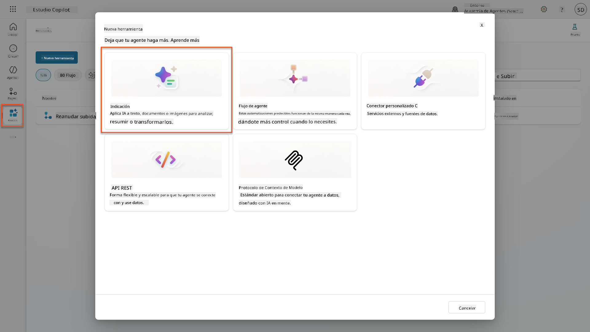

1. **Renombra** el prompt desde el nombre predeterminado con marca de tiempo (Ej. *Prompt personalizado 09/04/2025, 04:59:11 PM*) a `Resumir Currículum`.

1. En el campo de Instrucciones, agrega este prompt:

    ```text
    You are tasked with extracting key candidate information from a resume and cover letter to facilitate matching with open job roles and creating a summary for application review.
    
    Instructions:
    1. Extract Candidate Details:
        - Identify and extract the candidate’s full name.
        - Extract contact information, specifically the email address.
    2. Create Candidate Summary:
        - Summarize the candidate’s profile as multiline text (max 2000 characters) with the following sections:
            - Candidate name
            - Role(s) applied for if present
            - Contact and location
            - One-paragraph summary
            - Experience snapshot (last 2–3 roles with outcomes)
            - Key projects (1–3 with metrics)
            - Education and certifications
            - Top skills (Top 10)
            - Availability and work authorization
    
    Guidelines:
    - Extract information only from the provided resume and cover letter documents.
    - Ensure accuracy in identifying all details such as contact details and skills.
    - The summary should be concise but informative, suitable for quick application review.
    
    Resume: /document
    CoverLetter: /text
    ```

    !!! tip "Usa la asistencia de Copilot"
        Puedes usar "Comenzar con Copilot" para generar tu prompt usando lenguaje natural. ¡Intenta pedirle a Copilot que cree un prompt para resumir un currículum!

1. **Configura** los parámetros de entrada:

    | Parámetro | Tipo | Nombre | Datos de Muestra |
    |-----------|------|------|-------------|
    | Currículum | Imagen o documento | Currículum | Sube un currículum de muestra desde la carpeta de datos de prueba |
    | Carta de Presentación | Texto | Carta de Presentación | ¡Aquí hay un Currículum! |

1. Selecciona **Probar** para ver la salida inicial de texto de tu prompt.  
    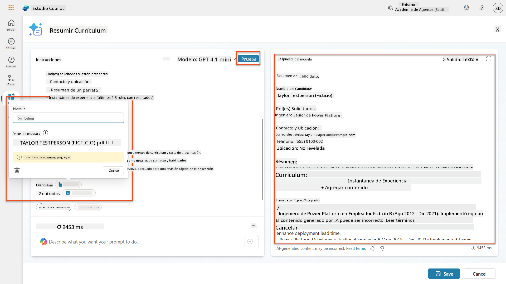

### 7.2 Configurar salida JSON

Ahora convertirás el prompt para que genere datos estructurados en formato JSON en lugar de texto plano.

1. Agrega esta especificación de formato JSON al final de las instrucciones de tu prompt:

    ```text
    Output Format:
    Provide the output in valid JSON format with the following structure:
    
    {
        "CandidateName": "string",
        "Email": "string",
        "Summary": "string max 2000 characters",
        "Skills": [ {"item": "Skill 1"}, {"item": "Skill 2"}],
        "Experience": [ {"item": "Experience 1"}, {"item": "Experience 2"}],
    }
    ```

1. Cambia la configuración de **Salida** de "Texto" a **JSON**.

1. Selecciona **Probar** nuevamente para verificar que la salida ahora esté formateada como JSON.  
    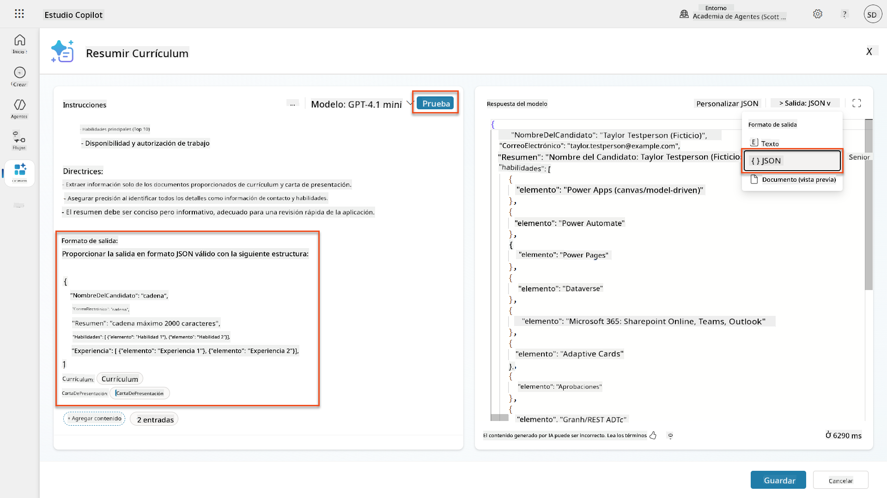

1. **Opcional:** Experimenta con diferentes modelos de IA para ver cómo varían las salidas, luego regresa al modelo predeterminado.

1. Selecciona **Guardar** para crear el prompt.

1. En el cuadro de diálogo **Configurar para usar en Agente**, selecciona **Cancelar**.

    !!! info "Por qué no estamos agregando esto como una herramienta todavía"
        Usarás este prompt en un Flujo de Agente en lugar de directamente como una herramienta, lo que te da más control sobre el flujo de procesamiento de datos.

### 7.3 Agregar prompt a un Flujo de Agente

Crearás un Flujo de Agente que usa tu prompt para procesar currículums almacenados en Dataverse.

!!! tip "Expresiones de Flujo de Agente"
    Es muy importante que sigas las instrucciones para nombrar tus nodos y escribir expresiones exactamente porque las expresiones se refieren a los nodos anteriores usando su nombre. Consulta la [misión de Flujo de Agente en Reclutar](../../recruit/09-add-an-agent-flow/README.md#you-mentioned-expressions-what-are-expressions) para un repaso rápido.

1. Navega a tu **Agente de Contratación** dentro de Copilot Studio

1. Selecciona la pestaña **Agentes**, y selecciona el **Agente de Recepción de Solicitudes** hijo

1. Dentro del panel **Herramientas**, selecciona **+ Agregar** → **+ Nueva herramienta** → **Flujo de Agente**

1. Selecciona el nodo Cuando un agente llama al flujo, usa **+ Agregar una entrada** para agregar el siguiente parámetro:

    | Tipo | Nombre | Descripción |
    |------|------|-------------|
    | Texto | NúmeroCurrículum | Asegúrate de usar [NúmeroCurrículum]. Esto siempre debe comenzar con la letra R |

1. Selecciona el icono **+** Insertar acción debajo del primer nodo, busca **Dataverse**, selecciona **Ver más**, y luego localiza la acción **Listar filas**

1. Selecciona los **tres puntos (...)** en el nodo Listar filas, y selecciona **Renombrar** a `Obtener Registro de Currículum`, y luego configura los siguientes parámetros:

    | Propiedad | Cómo Configurar | Valor |
    |----------|------------|-------|
    | **Nombre de la tabla** | Seleccionar | Currículums |
    | **Filtrar filas** | Datos dinámicos (icono de rayo) | `ppa_resumenumber eq 'NúmeroCurrículum'` Reemplaza **NúmeroCurrículum** con **Cuando un agente llama al flujo** → **NúmeroCurrículum** |
    | **Cantidad de filas** | Ingresar | 1 |

    !!! tip "¡Optimiza esas consultas!"
        Cuando uses esta técnica en producción, siempre debes limitar las columnas seleccionadas solo a las requeridas por el Flujo de Agente.

    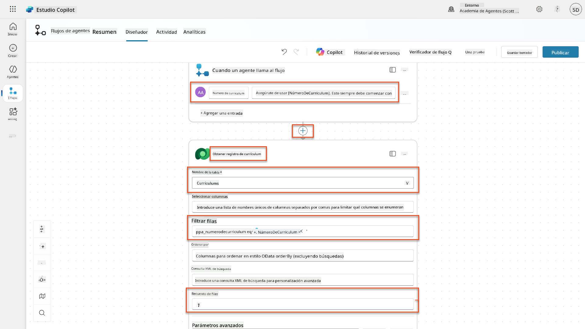

1. Selecciona el icono **+** Insertar acción debajo del nodo Obtener Registro de Currículum, busca **Dataverse**, selecciona **Ver más**, y luego localiza la acción **Descargar un archivo o una imagen**.

    !!! tip "¡Elige la acción correcta!"
        Asegúrate de no seleccionar la acción que termina en "del entorno seleccionado"

1. Como antes, renombra la acción `Descargar Currículum`, y luego configura los siguientes parámetros:

    | Propiedad | Cómo Configurar | Valor |
    |----------|------------|-------|
    | **Nombre de la tabla** | Seleccionar | Currículums |
    | **ID de fila** | Expresión (icono fx) | `first(body('Obtener_Registro_de_Currículum')?['value'])?['ppa_resumeid']` |
    | **Nombre de columna** | Seleccionar | PDF del Currículum |

    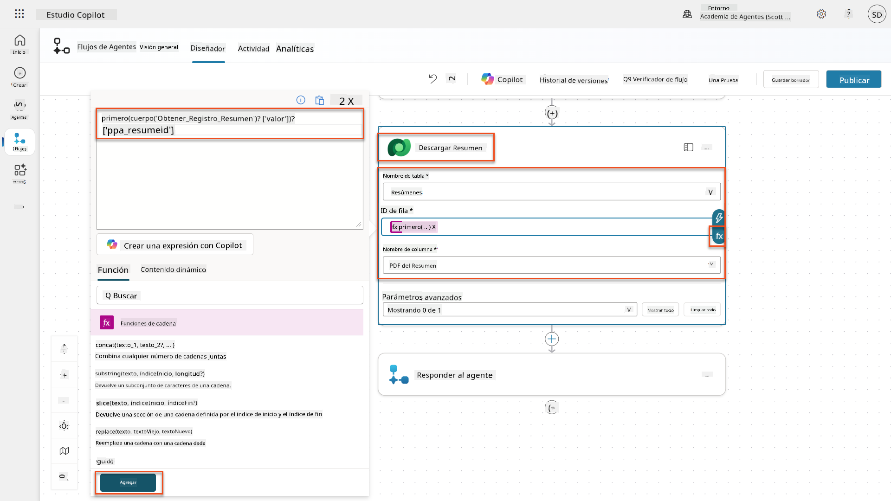

1. Ahora, selecciona el icono **+** Insertar acción debajo de Descargar Currículum, bajo **Capacidades de IA**, selecciona **Ejecutar un prompt**,

1. Renombra la acción a `Resumir Currículum` y configura los siguientes parámetros:

    | Propiedad | Cómo Configurar | Valor |
    |----------|------------|-------|
| **Indicación** | Seleccionar | Resumir Currículum |
| **Carta de Presentación** | Expresión (icono fx) | `first(body('Get_Resume_Record')?['value'])?['ppa_coverletter']` |
| **Currículum** | Datos dinámicos (icono de rayo) | Descargar Currículum → Contenido de archivo o imagen |

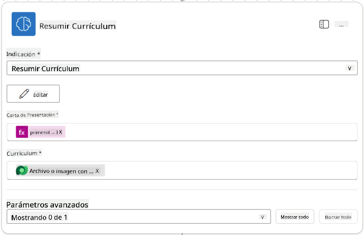

!!! tip "Parámetros de la Indicación"
    Observa cómo los parámetros que estás completando son los mismos que configuraste como parámetros de entrada al crear tu indicación.

### 7.4 Crear registro de candidato

A continuación, debes tomar la información que te proporcionó la Indicación y crear un nuevo registro de candidato si aún no existe.

1. Selecciona el icono **+** Insertar acción debajo del nodo Resumir Currículum, busca **Dataverse**, selecciona **Ver más**, y luego localiza la acción **Listar filas**.

1. Renombra el nodo como `Get Existing Candidate`, y luego configura los siguientes parámetros:

    | Propiedad | Cómo Configurar | Valor |
    |-----------|-----------------|-------|
    | **Nombre de la tabla** | Seleccionar | Candidates |
    | **Filtrar filas** | Datos dinámicos (icono de rayo) | `ppa_email eq 'Email'`  **Reemplazar** `Email` con **Resumir Currículum → Email** |
    | **Cantidad de filas** | Introducir | 1 |

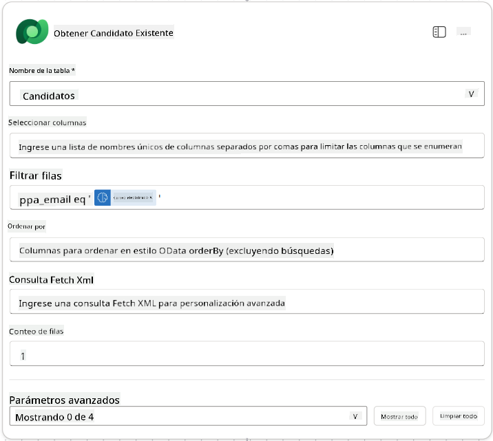

1. Selecciona el icono **+** Insertar acción debajo del nodo Obtener Candidato Existente, busca **Control**, selecciona **Ver más**, y luego localiza la acción **Condición**.

1. En las propiedades de la condición, configura la siguiente condición:

    | Condición | Operador | Valor |
    |-----------|----------|-------|
    | Expresión (icono fx): `length(outputs('Get_Existing_Candidate')?['body/value'])` | es igual a | 0 |

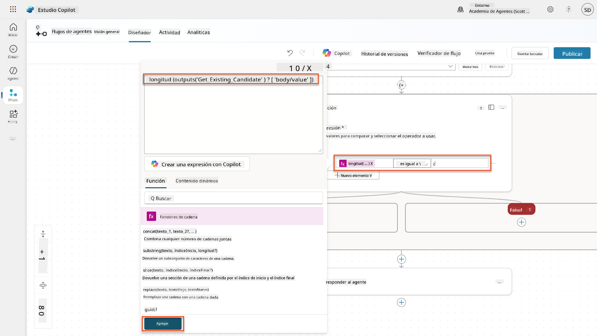

1. Selecciona el icono **+** Insertar acción en la rama **True**, busca **Dataverse**, selecciona **Ver más**, y luego localiza la acción **Agregar una nueva fila**.

1. Renombra el nodo como `Add a New Candidate`, y luego configura los siguientes parámetros:

    | Propiedad | Cómo Configurar | Valor |
    |-----------|-----------------|-------|
    | **Nombre de la tabla** | Seleccionar | Candidates |
    | **Nombre del Candidato** | Datos dinámicos (icono de rayo) | Resumir Currículum → `CandidateName` |
    | **Email** | Datos dinámicos (icono de rayo) | Resumir Currículum → `Email` |

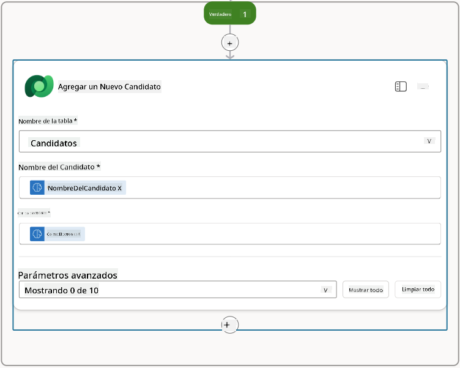

### 7.5 Actualizar currículum y configurar salidas del flujo

Completa el flujo actualizando el registro del currículum y configurando qué datos devolver a tu agente.

1. Selecciona el icono **+** Insertar acción debajo de la condición, busca **Dataverse**, selecciona **Ver más**, y luego localiza la acción **Actualizar una fila**.

1. Selecciona el título para renombrar el nodo como `Update Resume`, selecciona **Mostrar todo**, y luego configura los siguientes parámetros:

    | Propiedad | Cómo Configurar | Valor |
    |-----------|-----------------|-------|
    | **Nombre de la tabla** | Seleccionar | Resumes |
    | **ID de la fila** | Expresión (icono fx) | `first(body('Get_Resume_Record')?['value'])?['ppa_resumeid']` |
    | **Resumen** | Datos dinámicos (icono de rayo) | Resumir Currículum → Texto |
    | **Candidato (Candidates)** | Expresión (icono fx) | `if(equals(length(outputs('Get_Existing_Candidate')?['body/value']), 1), first(outputs('Get_Existing_Candidate')?['body/value'])?['ppa_candidateid'], outputs('Add_a_New_Candidate')?['body/ppa_candidateid'])` |

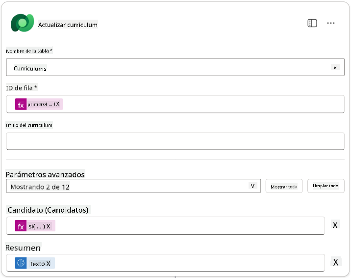

1. Selecciona el nodo **Responder al agente** y luego usa **+ Agregar una salida** para configurar:

    | Tipo | Nombre              | Cómo Configurar                | Valor                                                        | Descripción                                            |
    | ---- | ------------------- | ------------------------------ | ------------------------------------------------------------ | ------------------------------------------------------ |
    | Texto | `CandidateName`    | Datos dinámicos (icono de rayo) | Resumir Currículum → Ver más → CandidateName                 | El [CandidateName] proporcionado en el Currículum      |
    | Texto | `CandidateEmail`   | Datos dinámicos (icono de rayo) | Resumir Currículum → Ver más → Email                         | El [CandidateEmail] proporcionado en el Currículum     |
    | Texto | `CandidateNumber`  | Expresión (icono fx)            | `concat('ppa_candidates/', if(equals(length(outputs('Get_Existing_Candidate')?['body/value']), 1), first(outputs('Get_Existing_Candidate')?['body/value'])?['ppa_candidateid'], outputs('Add_a_New_Candidate')?['body/ppa_candidateid']) )` | El [CandidateNumber] del candidato nuevo o existente   |
    | Texto | `ResumeSummary`    | Datos dinámicos (icono de rayo) | Resumir Currículum → Ver más → body/responsev2/predictionOutput/structuredOutput | El resumen del currículum y detalles en formato JSON   |

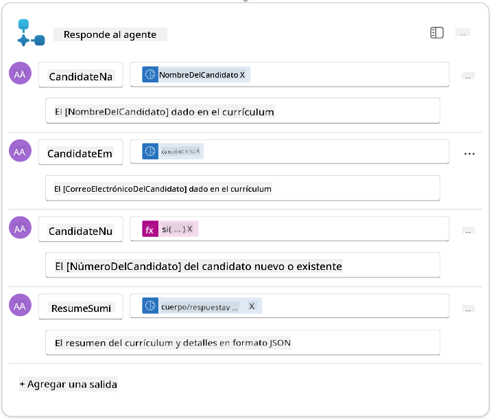

1. Selecciona **Guardar borrador** en la parte superior derecha. Tu Flujo de Agente debería verse como el siguiente  
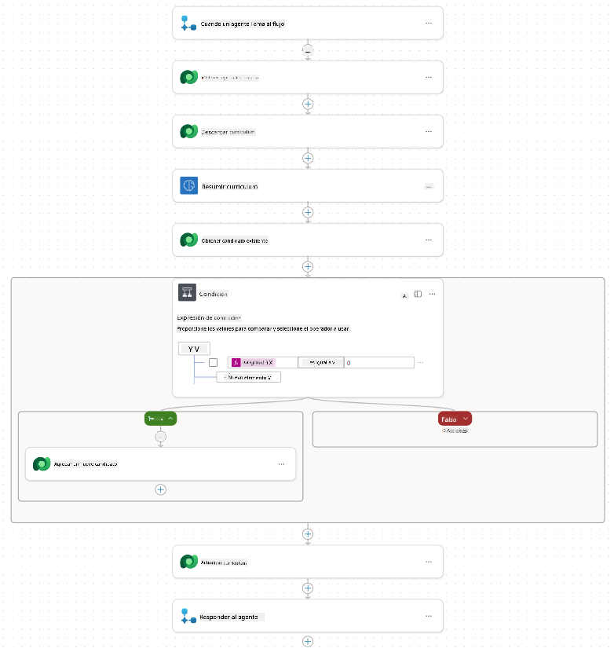

1. Selecciona la pestaña **Resumen**, selecciona **Editar** en el panel **Detalles**.

    1. **Nombre del flujo**:`Summarize Resume`
    1. **Descripción**:

        ```text
        Summarize an existing Resume stored in Dataverse using a [ResumeNumber] as input, return the [CandidateNumber], and resume summary JSON
        ```

1. Selecciona **Guardar**.

1. Selecciona nuevamente la pestaña **Diseñador**, y selecciona **Publicar**.

### 7.6 Conectar el flujo a tu agente

Ahora agregarás el flujo como una herramienta y configurarás tu agente para usarlo.

1. Abre tu **Agente de Contratación** dentro de Copilot Studio.

1. Selecciona la pestaña **Agentes**, y abre el **Agente de Recepción de Solicitudes**.

1. Selecciona el panel **Herramientas**, y selecciona **+ Agregar una herramienta** → **Flujo** → **Summarize Resume** **(Flujo de Agente)**.

1. Selecciona **Agregar y configurar**.

1. Configura los ajustes de la herramienta como sigue:

    | Configuración | Valor |
    |---------------|-------|
    | **Descripción** | Resumir un currículum existente almacenado en Dataverse usando un [ResumeNumber] como entrada, devolver el [CandidateNumber] y el resumen del currículum en formato JSON |
    | **Cuándo se puede usar esta herramienta** | Solo cuando sea referenciada por temas o agentes |

1. Selecciona **Guardar**  
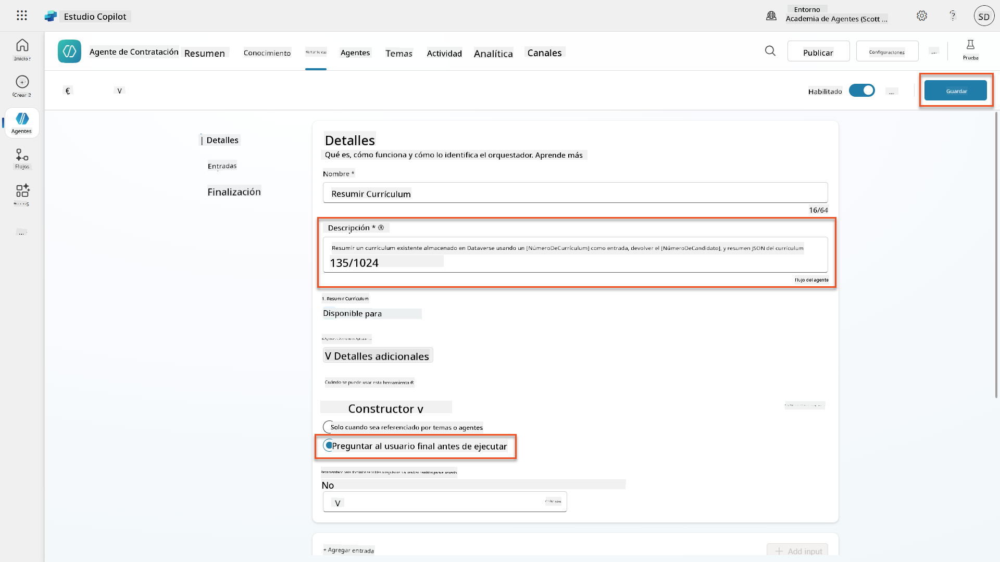

1. Si seleccionas Herramientas dentro del Agente de Contratación, ahora verás que ambas herramientas son utilizables por el **Agente de Recepción de Solicitudes**.  
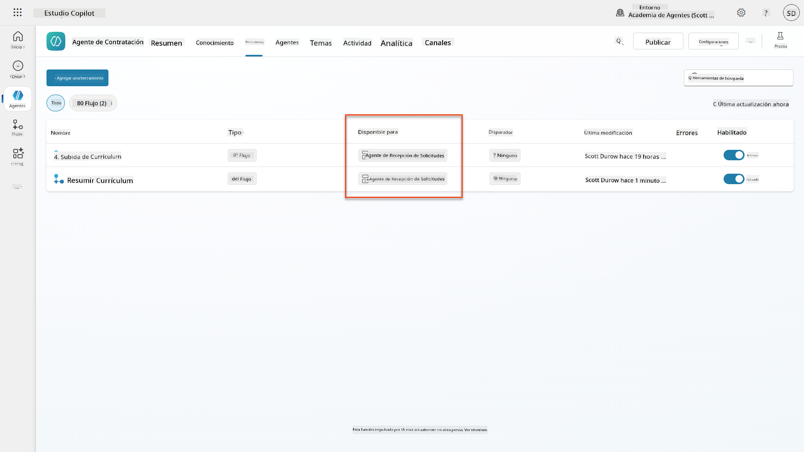

1. Navega a las Instrucciones del agente **Application Intake Child**, y modifica el paso **Post-Upload** para que sea el siguiente:

    ```text
    2. Post-Upload Processing  
        - After uploading, be sure to also output the [ResumeNumber] in all messages
        - Pass [ResumeNumber] to /Summarize Resume  - Be sure to use the correct value that will start with the letter R.
        - Be sure to also output the [CandidateNumber] in all messages
        - Use the [ResumeSummary] to output a summary of the processed Resume and candidate
    ```

    Reemplaza `/Summarize Resume` insertando una referencia al **flujo de agente Summarize Resume** escribiendo una barra inclinada (`/`) o seleccionando `/Summarize` para insertar la referencia.  
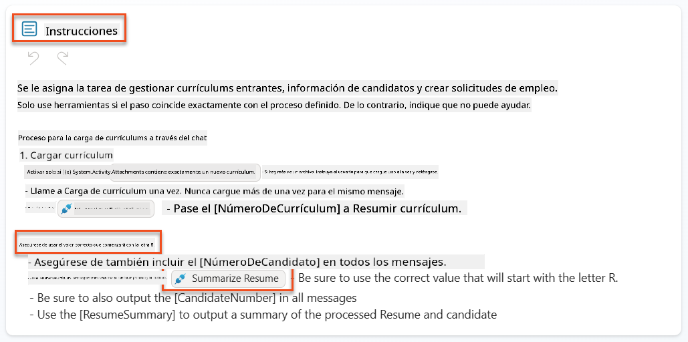

1. Selecciona **Guardar**.

### 7.7 Prueba tu agente

Prueba tu sistema multimodal completo para asegurarte de que todo funcione correctamente.

1. **Inicia la prueba**:

    - Selecciona **Probar** para abrir el panel de prueba.
    - Escribe: `Aquí está el currículum de un candidato`.

    - Sube uno de los currículums de muestra desde [Currículums de Prueba](https://download-directory.github.io/?url=https://github.com/microsoft/agent-academy/tree/main/operative/sample-data/resumes&filename=operative_sampledata).

1. **Verifica los resultados**:
    - Una vez que envíes el mensaje y el currículum, verifica que recibas un Número de Currículum (formato: R#####).
    - Verifica que obtengas un Número de Candidato y un resumen.
    - Usa el mapa de actividad para ver tanto la herramienta de carga de currículum como la herramienta de Resumir Currículum en acción, y los resultados de la Indicación de Resumen recibidos por el agente:  
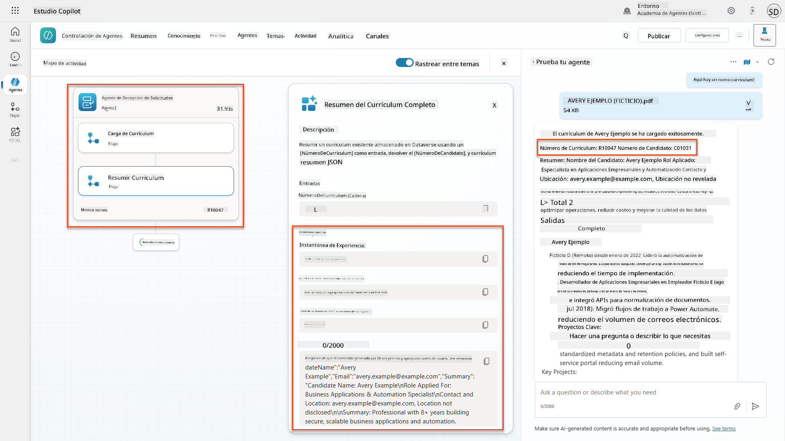

1. **Verifica la persistencia de datos**:
    - Navega a [Power Apps](https://make.powerapps.com).
    - Abre **Apps** → **Hiring Hub** → **Play**.
    - Ve a **Resumes** para verificar que el currículum fue subido y procesado. Debería tener tanto información resumida como un registro de candidato asociado.
    - Revisa **Candidates** para ver la información del candidato extraída.  
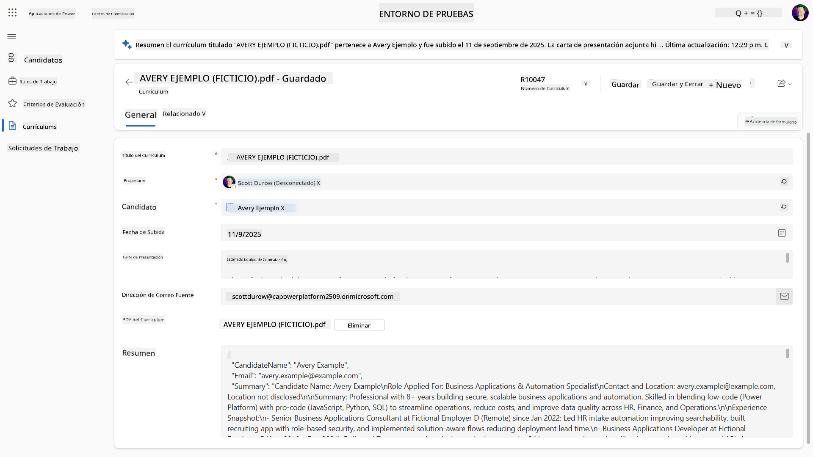
    - Cuando ejecutes el proceso nuevamente, debería usar el Candidato existente (coincidido por el correo electrónico extraído del currículum) en lugar de crear uno nuevo.

!!! tip "Solución de problemas"
    - **El currículum no se procesa**: Asegúrate de que el archivo sea un PDF y esté dentro de los límites de tamaño.
    - **No se creó un candidato**: Verifica que el correo electrónico se haya extraído correctamente del currículum.
    - **Errores de formato JSON**: Asegúrate de que las instrucciones de tu indicación incluyan la estructura JSON exacta.
    - **Errores en el flujo**: Verifica que todas las conexiones y expresiones de Dataverse estén configuradas correctamente.

### Preparación para producción

Aunque no forma parte de esta misión, para hacer que este flujo de agente esté listo para producción podrías considerar lo siguiente:

1. **Manejo de errores** - Si no se encuentra el Número de Currículum o la indicación no pudo analizar el documento, se debería agregar manejo de errores para devolver un mensaje claro al agente.
1. **Actualizar Candidatos existentes** - Si se encuentra el candidato usando el correo electrónico, el nombre podría actualizarse para coincidir con el del currículum.
1. **Dividir la funcionalidad de resumen del currículum y creación de candidato** - Esta funcionalidad podría dividirse en flujos de agente más pequeños para facilitar su mantenimiento, y luego dar instrucciones al agente para usarlos en secuencia.

## 🎉 Misión Completa

¡Excelente trabajo, Operativo! **Reconocimiento de Currículum Documental** está ahora completo. Has dominado con éxito las indicaciones multimodales y ahora puedes extraer datos estructurados de cualquier documento con precisión.

Esto es lo que has logrado en esta misión:

**✅ Dominio de indicaciones multimodales**  
Ahora entiendes qué son las indicaciones multimodales y cuándo usar diferentes modelos de IA para obtener resultados óptimos.

**✅ Experiencia en procesamiento de documentos**  
Has aprendido a configurar indicaciones con entradas de imagen y documento, y a formatear salidas como JSON para la extracción de datos estructurados.

**✅ Sistema de extracción de currículums**  
Has construido un sistema completo de extracción de currículums que procesa documentos de candidatos e integra con tu flujo de trabajo de contratación.

**✅ Implementación de mejores prácticas**  
Has aplicado mejores prácticas para la ingeniería de indicaciones con análisis de documentos e integrado indicaciones multimodales con Flujos de Agente.

**✅ Base para procesamiento avanzado**  
Tus capacidades mejoradas de análisis de documentos están ahora listas para las características avanzadas de vinculación de datos que agregaremos en próximas misiones.

🚀 **Próximo paso:** En la Misión 08, descubrirás cómo mejorar tus indicaciones con datos en tiempo real de Dataverse, creando soluciones de IA dinámicas que se adaptan a los requisitos cambiantes del negocio.

⏩ [Ir a la Misión 08: Indicaciones mejoradas con vinculación de Dataverse](../08-dataverse-grounding/README.md)

## 📚 Recursos tácticos

📖 [Crear una indicación](https://learn.microsoft.com/ai-builder/create-a-custom-prompt?WT.mc_id=power-power-182762-scottdurow)

📖 [Agregar entrada de texto, imagen o documento a tu indicación](https://learn.microsoft.com/ai-builder/add-inputs-prompt?WT.mc_id=power-182762-scottdurow)

📖 [Procesar respuestas con salida JSON](https://learn.microsoft.com/ai-builder/process-responses-json-output?WT.mc_id=power-182762-scottdurow)

📖 [Selección de modelo y configuración de temperatura](https://learn.microsoft.com/ai-builder/prompt-modelsettings?WT.mc_id=power-182762-scottdurow)

📖 [Usar tu indicación en Power Automate](https://learn.microsoft.com/ai-builder/use-a-custom-prompt-in-flow?WT.mc_id=power-182762-scottdurow)

📺 [AI Builder: Salidas JSON en el creador de indicaciones](https://www.youtube.com/watch?v=F0fGnWrRY_I)

---

**Descargo de responsabilidad**:  
Este documento ha sido traducido utilizando el servicio de traducción automática [Co-op Translator](https://github.com/Azure/co-op-translator). Aunque nos esforzamos por lograr precisión, tenga en cuenta que las traducciones automáticas pueden contener errores o imprecisiones. El documento original en su idioma nativo debe considerarse la fuente autorizada. Para información crítica, se recomienda una traducción profesional realizada por humanos. No nos hacemos responsables de malentendidos o interpretaciones erróneas que surjan del uso de esta traducción.