<!--
CO_OP_TRANSLATOR_METADATA:
{
  "original_hash": "750f3ea8a94930439ebd8a10871b1d73",
  "translation_date": "2025-10-17T19:17:50+00:00",
  "source_file": "docs/operative-preview/08-dataverse-grounding/README.md",
  "language_code": "es"
}
-->
# 🚨 Misión 08: Prompts mejorados con conexión a Dataverse

--8<-- "disclaimer.md"

## 🕵️‍♂️ NOMBRE CLAVE: `OPERACIÓN CONTROL DE CONEXIÓN`

> **⏱️ Duración de la operación:** `~60 minutos`

## 🎯 Resumen de la misión

Bienvenido de nuevo, Operativo. Tu sistema de contratación multiagente está operativo, pero necesita una mejora crítica para la **conexión de datos**: tus modelos de IA necesitan acceso en tiempo real a los datos estructurados de tu organización para tomar decisiones inteligentes.

Actualmente, tu prompt de Resumir Currículum opera con conocimiento estático. ¿Pero qué pasaría si pudiera acceder dinámicamente a tu base de datos de roles laborales para proporcionar coincidencias precisas y actualizadas? ¿Y si entendiera tus criterios de evaluación sin necesidad de codificarlos manualmente?

En esta misión, mejorarás tu prompt personalizado con **conexión a Dataverse**, conectando tus prompts directamente a fuentes de datos en vivo. Esto transforma tus agentes de simples respondedores estáticos a sistemas dinámicos impulsados por datos que se adaptan a las necesidades cambiantes del negocio.

Tu misión: integrar datos en tiempo real sobre roles laborales y criterios de evaluación en tu flujo de análisis de currículum, creando un sistema autoactualizable que se mantenga al día con los requisitos de contratación de tu organización.

## 🔎 Objetivos

En esta misión, aprenderás:

1. Cómo la **conexión a Dataverse** mejora los prompts personalizados
1. Cuándo usar conexión de datos frente a instrucciones estáticas
1. Diseñar prompts que incorporen dinámicamente datos en vivo
1. Mejorar el flujo de Resumir Currículum con coincidencias de roles laborales

## 🧠 Entendiendo la conexión a Dataverse para prompts

La **conexión a Dataverse** permite que tus prompts personalizados accedan a datos en vivo de tus tablas de Dataverse al procesar solicitudes. En lugar de instrucciones estáticas, tus prompts pueden incorporar información en tiempo real para tomar decisiones informadas.

### Por qué la conexión a Dataverse es importante

Los prompts tradicionales funcionan con instrucciones fijas:

```text
Match this candidate to these job roles: Developer, Manager, Analyst
```

Con la conexión a Dataverse, tu prompt accede a datos actuales:

```text
Match this candidate to available job roles from the Job Roles table, 
considering current evaluation criteria and requirements
```

Este enfoque ofrece varios beneficios clave:

- **Actualizaciones dinámicas:** Los roles laborales y criterios cambian sin necesidad de modificar el prompt
- **Consistencia:** Todos los agentes usan las mismas fuentes de datos actuales
- **Escalabilidad:** Los nuevos roles y criterios están disponibles automáticamente
- **Precisión:** Los datos en tiempo real aseguran que las decisiones reflejen las necesidades actuales

### Cómo funciona la conexión a Dataverse

Cuando habilitas la conexión a Dataverse para un prompt personalizado:

1. **Selección de datos:** Elige tablas y columnas específicas de Dataverse para incluir. También puedes seleccionar tablas relacionadas que el sistema filtrará según los registros principales recuperados.
1. **Inyección de contexto:** El prompt incluye automáticamente los datos recuperados en el contexto del prompt.
1. **Filtrado inteligente:** El sistema incluye solo los datos relevantes para la solicitud actual si proporcionas algún filtro.
1. **Salida estructurada:** Tu prompt puede referenciar los datos recuperados y razonar sobre los registros para crear la salida.

### De estático a dinámico: La ventaja de la conexión

Examinemos tu flujo actual de Resumir Currículum de la Misión 07 y veamos cómo la conexión a Dataverse lo transforma de inteligencia estática a dinámica.

**Enfoque estático actual:**
Tu prompt existente incluye criterios de evaluación codificados y lógica de coincidencia predeterminada. Este enfoque funciona, pero requiere actualizaciones manuales cada vez que agregas nuevos roles laborales, cambias criterios de evaluación o ajustas prioridades de la empresa.

**Transformación con conexión a Dataverse:**
Al agregar conexión a Dataverse, tu flujo de Resumir Currículum:

- **Accede a roles laborales actuales** desde tu tabla de Roles Laborales
- **Utiliza criterios de evaluación en vivo** en lugar de descripciones estáticas  
- **Proporciona coincidencias precisas** basadas en requisitos en tiempo real

## 🎯 Por qué prompts dedicados frente a conversaciones de agentes

En la Misión 02, experimentaste cómo el Agente de Entrevista podía emparejar candidatos con roles laborales, pero requería prompts complejos del usuario como:

```text
Upload this resume, then show me open job roles,
each with a description of the evaluation criteria, 
then use this to match the resume to at least one suitable
job role even if not a perfect match.
```

Aunque esto funcionó, los prompts dedicados con conexión a Dataverse ofrecen ventajas significativas para tareas específicas:

### Ventajas clave de los prompts dedicados

| Aspecto | Conversaciones de Agentes | Prompts Dedicados |
|--------|-------------------|------------------|
| **Consistencia** | Los resultados varían según las habilidades del usuario para redactar prompts | Procesamiento estandarizado cada vez |
| **Especialización** | El razonamiento general puede pasar por alto matices del negocio | Diseñado específicamente con lógica optimizada para el negocio |
| **Automatización** | Requiere interacción e interpretación humana | Se activa automáticamente con salida JSON estructurada |

## 🧪 Laboratorio 8: Agregar conexión a Dataverse a los prompts

¡Es hora de mejorar tus capacidades de análisis de currículum! Mejorarás el flujo existente de Resumir Currículum con coincidencias dinámicas de roles laborales.

### Prerrequisitos para completar esta misión

1. Necesitarás **una de las siguientes opciones**:

    - **Haber completado la Misión 07** y tener tu sistema de análisis de currículum listo, **O**
    - **Importar la solución inicial de la Misión 08** si estás comenzando desde cero o necesitas ponerte al día. [Descargar solución inicial de la Misión 08](https://aka.ms/agent-academy)

1. Documentos de currículum de muestra de [Currículums de prueba](https://download-directory.github.io/?url=https://github.com/microsoft/agent-academy/tree/main/operative/sample-data/resumes&filename=operative_sampledata)

!!! note "Importación de solución y datos de muestra"
    Si estás utilizando la solución inicial, consulta [Misión 01](../01-get-started/README.md) para obtener instrucciones detalladas sobre cómo importar soluciones y datos de muestra en tu entorno.

### 8.1 Agregar conexión a Dataverse a tu prompt

Construirás sobre el prompt de Resumir Currículum que creaste en la Misión 07. Actualmente simplemente resume el currículum, pero ahora lo conectarás con los roles laborales tal como existen actualmente en Dataverse, manteniéndolo siempre actualizado.

Primero, examinemos las tablas de Dataverse con las que te conectarás:

1. **Navega** a [Power Apps](https://make.powerapps.com) y selecciona tu entorno usando el **Selector de entorno** en la parte superior derecha de la barra de navegación.

1. Selecciona **Tablas** y localiza la tabla **Roles Laborales**

1. Revisa las columnas clave que usarás para la conexión:

    | Columna | Propósito |
    |--------|---------|
    | **Número de Rol Laboral** | Identificador único para la coincidencia de roles |
    | **Título del Rol** | Nombre visible del rol |
    | **Descripción** | Requisitos detallados del rol |

1. De manera similar, revisa las otras tablas como la tabla **Criterios de Evaluación**.

### 8.2 Agregar datos de conexión a Dataverse a tu prompt

1. **Navega** a Copilot Studio y selecciona tu entorno usando el **Selector de entorno** en la parte superior derecha de la barra de navegación.

1. Selecciona **Herramientas** desde la navegación izquierda.

1. Elige **Prompt** y localiza tu prompt **Resumir Currículum** de la Misión 07.  
    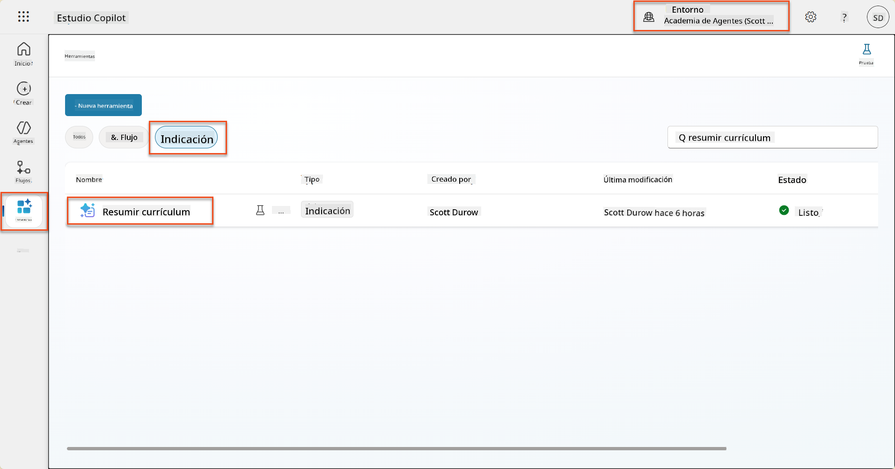

1. Selecciona **Editar** para modificar el prompt y reemplázalo con la versión mejorada a continuación:

    !!! important
        Asegúrate de que los parámetros de Currículum y Carta de Presentación permanezcan intactos como parámetros.

    ```text
    You are tasked with extracting key candidate information from a resume and cover letter to facilitate matching with open job roles and creating a summary for application review.
    
    ### Instructions:
    1. **Extract Candidate Details:**
       - Identify and extract the candidate's full name.
       - Extract contact information, specifically the email address.
    
    2. **Analyze Resume and Cover Letter:**
       - Review the resume content to identify relevant skills, experience, and qualifications.
       - Review the cover letter to understand the candidate's motivation and suitability for the roles.
    
    3. **Match Against Open Job Roles:**
       - Compare the extracted candidate information with the requirements and descriptions of the provided open job roles.
       - Use the job descriptions to assess potential fit.
       - Identify all roles that align with the candidate's cover letter and profile. You don't need to assess perfect suitability.
       - Provide reasoning for each match based on the specific job requirements.
    
    4. **Create Candidate Summary:**
       - Summarize the candidate's profile as multiline text with the following sections:
          - Candidate name
          - Role(s) applied for if present
          - Contact and location
          - One-paragraph summary
          - Top skills (8–10)
          - Experience snapshot (last 2–3 roles with outcomes)
          - Key projects (1–3 with metrics)
          - Education and certifications
          - Availability and work authorization
    
    ### Output Format
    
    Provide the output in valid JSON format with the following structure:
    
    {
      "CandidateName": "string",
      "Email": "string",
      "MatchedRoles": [
        {
          "JobRoleNumber": "ppa_jobrolenumber from grounded data",
          "RoleName": "ppa_jobtitle from grounded data",
          "Reasoning": "Detailed explanation based on job requirements"
        }
      ],
      "Summary": "string"
    }
    
    ### Guidelines
    
    - Extract information only from the provided resume and cover letter documents.
    - Ensure accuracy in identifying contact details.
    - Use the available job role data for matching decisions.
    - The summary should be concise but informative, suitable for quick application review.
    - If no suitable matches are found, indicate an empty list for MatchedRoles and explain briefly in the summary.
    
    ### Input Data
    Open Job Roles (ppa_jobrolenumber, ppa_jobtitle): /Job Role 
    Resume: {Resume}
    Cover Letter: {CoverLetter}
    ```

1. En el editor de prompts, reemplaza `/Rol Laboral` seleccionando **+ Agregar contenido**, seleccionando **Dataverse** → **Rol Laboral** y selecciona las siguientes columnas, luego selecciona **Agregar**:

    1. **Número de Rol Laboral**

    1. **Título del Rol**

    1. **Descripción**

    !!! tip
        Puedes escribir el nombre de la tabla para buscar.

1. En el diálogo de **Rol Laboral**, selecciona el atributo **Filtro**, selecciona **Estado**, y luego escribe **Activo** como valor de **Filtro**.  
    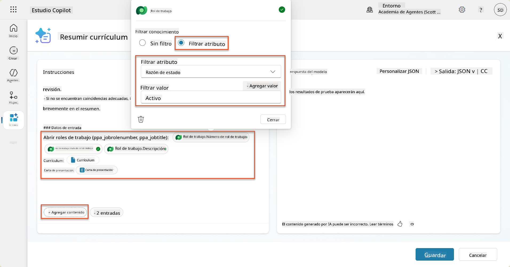

    !!! tip
        Aquí puedes usar **Agregar valor** para agregar un parámetro de entrada también; por ejemplo, si tuvieras un prompt para resumir un registro existente, podrías proporcionar el Número de Currículum como parámetro para filtrar.

1. A continuación, agregarás la tabla relacionada de Dataverse **Criterios de Evaluación**, seleccionando nuevamente **+ Agregar contenido**, encontrando **Roles Laborales**, y en lugar de seleccionar las columnas de Rol Laboral, expande **Rol Laboral (Criterios de Evaluación)** y selecciona las siguientes columnas, luego selecciona **Agregar**:

    1. **Nombre del Criterio**

    1. **Descripción**  
        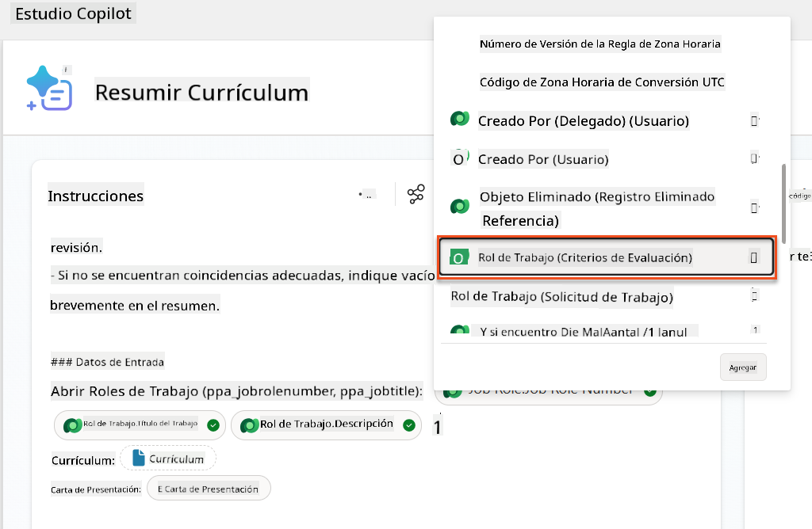

        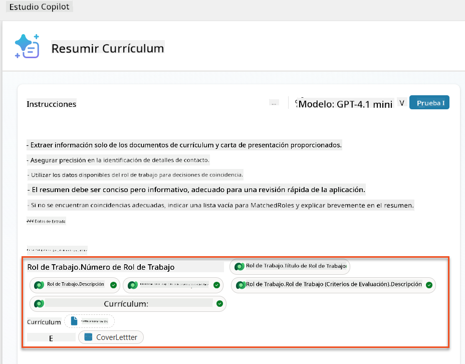

    !!! tip
        Es importante seleccionar los Criterios de Evaluación relacionados primero seleccionando el Rol Laboral y luego navegando en el menú a Rol Laboral (Criterios de Evaluación). Esto asegurará que solo los registros relacionados con el Rol Laboral sean cargados.

1. Selecciona **Configuración** y ajusta la **Recuperación de registros** a 1000 - esto permitirá que se incluyan el máximo de Roles Laborales y Criterios de Evaluación en tu prompt.  
    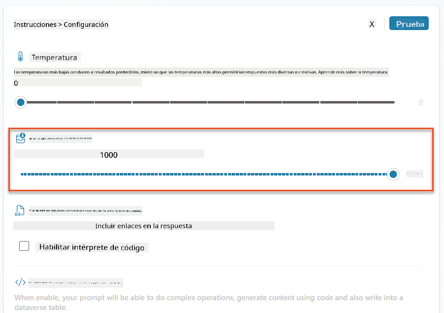

### 8.3 Probar el prompt mejorado

1. Selecciona el parámetro **Currículum** y sube un currículum de muestra que usaste en la Misión 07.
1. Selecciona **Probar**.
1. Una vez que se haya ejecutado la prueba, observa que la salida JSON ahora incluye los **Roles Coincidentes**.
1. Selecciona la pestaña **Conocimiento utilizado** para ver los datos de Dataverse que se fusionaron con tu prompt antes de la ejecución.
1. **Guarda** tu prompt actualizado. El sistema ahora incluirá automáticamente estos datos de Dataverse con tu prompt cuando el flujo existente del Agente de Resumir Currículum lo llame.  
    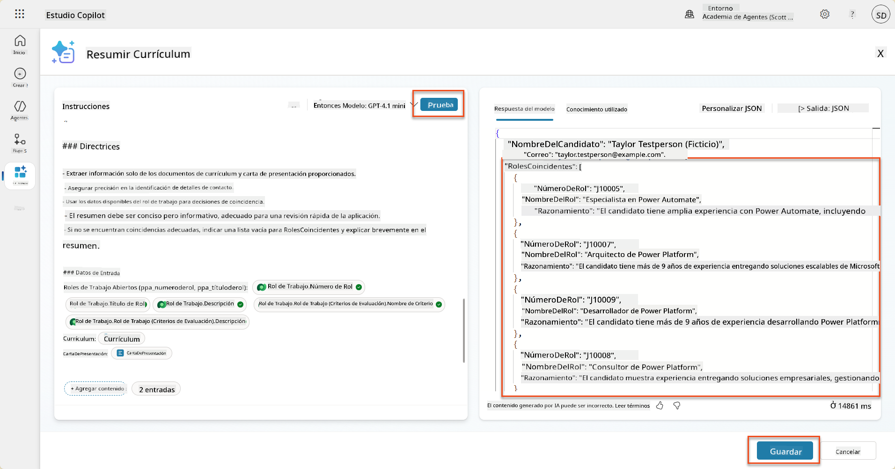

### 8.4 Agregar flujo de agente de solicitud de empleo

Para permitir que nuestro Agente de Recepción de Solicitudes cree Roles Laborales basados en los roles sugeridos, necesitamos crear un Flujo de Agente. El agente llamará a esta herramienta para cada uno de los roles laborales sugeridos en los que el candidato esté interesado.

!!! tip "Expresiones de flujo de agente"
    Es muy importante que sigas las instrucciones para nombrar tus nodos e ingresar expresiones exactamente como se indica porque las expresiones se refieren a los nodos anteriores usando su nombre. Consulta la [misión de flujo de agente en Reclutamiento](../../recruit/09-add-an-agent-flow/README.md#you-mentioned-expressions-what-are-expressions) para un repaso rápido.

1. Dentro del **Agente de Contratación**, selecciona la pestaña **Agentes** y abre el agente secundario **Agente de Recepción de Solicitudes**.

1. Dentro del panel **Herramientas**, selecciona **+ Agregar** → **+ Nueva herramienta** → **Flujo de Agente**

1. Selecciona el nodo **Cuando un agente llama al flujo**, usa **+ Agregar una entrada** para agregar el siguiente parámetro:

    | Tipo | Nombre            | Descripción                                                  |
    | ---- | --------------- | ------------------------------------------------------------ |
    | Texto | `NúmeroDeCurrículum`  | Asegúrate de usar solo el [NúmeroDeCurrículum] - DEBE comenzar con la letra R |
    | Texto | `NúmeroDeRolLaboral` | Asegúrate de usar solo el [NúmeroDeRolLaboral] - DEBE comenzar con la letra J |

    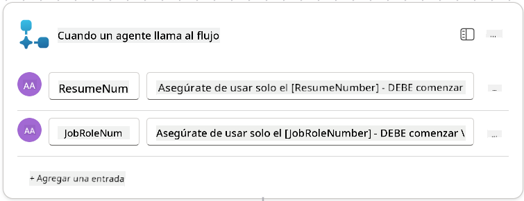

1. Selecciona el icono **+** Insertar acción debajo del primer nodo, busca **Dataverse**, selecciona **Ver más**, y luego localiza la acción **Listar filas**.

1. **Renombra** el nodo como `Obtener Currículum` y luego configura los siguientes parámetros:

    | Propiedad        | Cómo configurar               | Valor                                                        |
    | --------------- | ------------------------------- | ------------------------------------------------------------ |
    | **Nombre de la tabla**  | Seleccionar                          | Currículums                                                  |
    | **Filtrar filas** | Datos dinámicos (icono de rayo) | `ppa_resumenumber eq 'NúmeroDeCurrículum'` Selecciona y reemplaza **NúmeroDeCurrículum** con **Cuando un agente llama al flujo** → **NúmeroDeCurrículum** |
    | **Cantidad de filas**   | Ingresar                           | 1                                                            |

    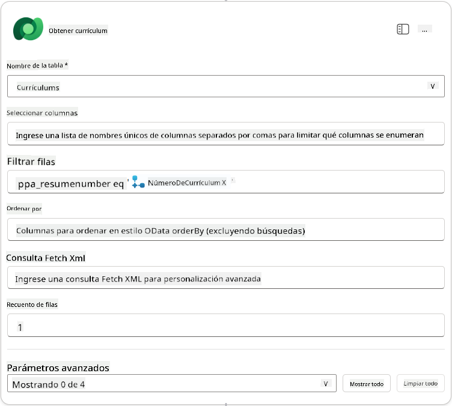

1. Ahora, selecciona el icono **+** Insertar acción debajo de **Obtener Currículum**, busca **Dataverse**, selecciona **Ver más**, y luego localiza la acción **Listar filas**.

1. **Renombra** el nodo como `Obtener Rol Laboral` y luego configura los siguientes parámetros:

    | Propiedad        | Cómo configurar               | Valor                                                        |
    | --------------- | ------------------------------- | ------------------------------------------------------------ |
    | **Nombre de la tabla**  | Seleccionar                          | Roles Laborales                                              |
    | **Filtrar filas** | Datos dinámicos (icono de rayo) | `ppa_jobrolenumber eq 'NúmeroDeRolLaboral'` Selecciona y reemplaza **NúmeroDeRolLaboral** con **Cuando un agente llama al flujo** → **NúmeroDeRolLaboral** |
    | **Cantidad de filas**   | Ingresar                           | 1                                                            |

    

1. Ahora, selecciona el icono **+** Insertar acción debajo de Obtener Rol Laboral, busca **Dataverse**, selecciona **Ver más**, y luego localiza la acción **Agregar una nueva fila**.

1. **Renombra** el nodo como `Agregar Solicitud` y luego configura los siguientes parámetros:

    | Propiedad                           | Cómo configurar       | Valor                                                        |
    | ---------------------------------- | -------------------- | ------------------------------------------------------------ |
    | **Nombre de la tabla**                     | Seleccionar               | Solicitudes de Empleo                                        |
    | **Candidato (Candidatos)**             | Expresión (icono fx) | `concat('ppa_candidates/',first(outputs('Obtener_Currículum')?['body/value'])?['_ppa_candidate_value'])` |
| **Rol de Trabajo (Roles de Trabajo)**       | Expresión (icono fx) | `concat('ppa_jobroles/',first(outputs('Get_Job_Role')?['body/value'])?['ppa_jobroleid'])` |
| **Currículum (Currículums)**                | Expresión (icono fx) | `concat('ppa_resumes/', first(outputs('Get_Resume')?['body/value'])?['ppa_resumeid'])` |
| **Fecha de Aplicación** (usar **Mostrar todo**) | Expresión (icono fx) | `utcNow()`                                                   |

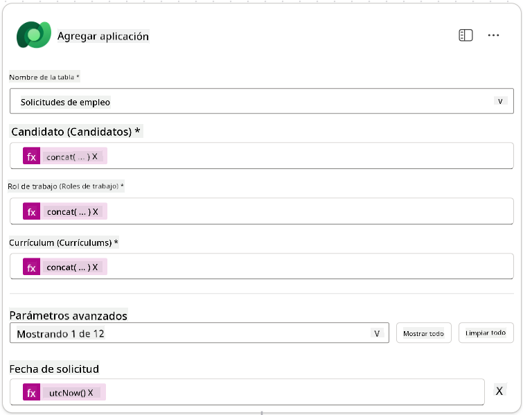

1. Selecciona el **Nodo de Respuesta al Agente**, y luego selecciona **+ Agregar una salida**

     | Propiedad        | Cómo Configurar                | Detalles                                         |
     | ----------------- | ------------------------------ | ----------------------------------------------- |
     | **Tipo**         | Seleccionar                    | `Texto`                                         |
     | **Nombre**       | Ingresar                       | `ApplicationNumber`                             |
     | **Valor**        | Datos dinámicos (icono rayo)   | *Agregar Aplicación → Ver Más → Número de Aplicación* |
     | **Descripción**  | Ingresar                       | `El [ApplicationNumber] de la Aplicación de Trabajo creada` |

     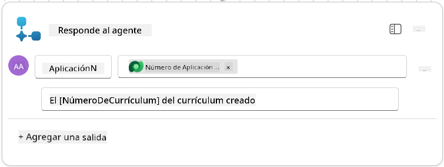

1. Selecciona **Guardar borrador** en la parte superior derecha.

1. Selecciona la pestaña **Resumen**, selecciona **Editar** en el panel **Detalles**.

      - **Nombre del flujo**:`Crear Aplicación de Trabajo`
      - **Descripción**:`Crea una nueva aplicación de trabajo cuando se proporcionan [ResumeNumber] y [JobRoleNumber]`
      - **Guardar**

1. Selecciona nuevamente la pestaña **Diseñador**, y selecciona **Publicar**.

### 8.5 Agregar Crear Aplicación de Trabajo al agente

Ahora conectarás el flujo publicado a tu Agente de Recepción de Aplicaciones.

1. Regresa al **Agente de Contratación** y selecciona la pestaña **Agentes**. Abre el **Agente de Recepción de Aplicaciones**, y luego localiza el panel **Herramientas**.

1. Selecciona **+ Agregar**

1. Selecciona el filtro **Flujo**, y busca `Crear Aplicación de Trabajo`. Selecciona el flujo **Crear Aplicación de Trabajo**, y luego **Agregar y configurar**.

1. Configura los siguientes parámetros:

    | Parámetro                                           | Valor                                                        |
    | --------------------------------------------------- | ------------------------------------------------------------ |
    | **Descripción**                                     | `Crea una nueva aplicación de trabajo cuando se proporcionan [ResumeNumber] y [JobRoleNumber]` |
    | **Detalles adicionales → Cuándo se puede usar esta herramienta** | `Solo cuando sea referenciada por temas o agentes`           |

1. Selecciona **Guardar**  
    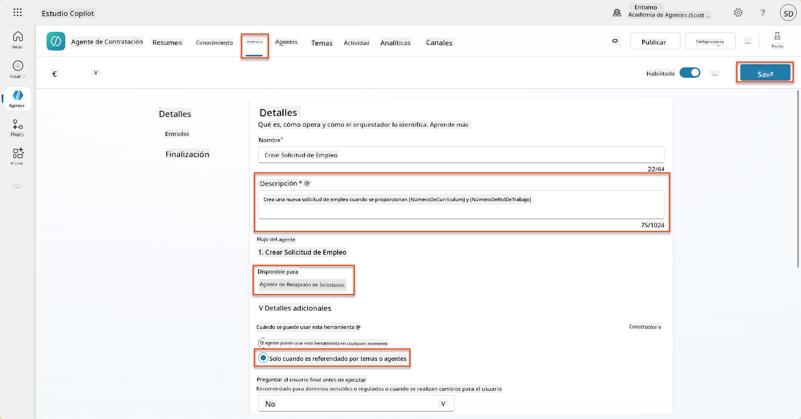

### 8.6 Definir instrucciones del agente

Para crear aplicaciones de trabajo, necesitas indicarle al agente cuándo usar la nueva herramienta. En este caso, pedirás al usuario que confirme a qué roles de trabajo sugeridos desea aplicar, e instruirás al agente para que ejecute la herramienta para cada rol.

1. Regresa al **Agente de Recepción de Aplicaciones**, y luego localiza el panel **Instrucciones**.

1. En el campo **Instrucciones**, **agrega** la siguiente guía clara para tu agente secundario al **final de las instrucciones existentes**:

    ```text
    3. Post Resume Upload
       - Respond with a formatted bullet list of [SuggestedJobRoles] the candidate could apply for.  
       - Use the format: [JobRoleNumber] - [RoleDescription]
       - Ask the user to confirm which Job Roles to create applications for the candidate.
       - When the user has confirmed a set of [JobRoleNumber]s, move to the next step.
    
    4. Post Upload - Application Creation
        - After the user confirms which [SuggestedJobRoles] for a specific [ResumeNumber]:
        E.g. "Apply [ResumeNumber] for the Job Roles [JobRoleNumber], [JobRoleNumber], [JobRoleNumber]
        E.g. "apply to all suggested job roles" - this implies use all the [JobRoleNumbers] 
         - Loop over each [JobRoleNumber] and send with [ResumeNumber] to /Create Job Application   
         - Summarize the Job Applications Created
    
    Strict Rules (that must never be broken)
    You must always follow these rules and never break them:
    1. The only valid identifiers are:
      - ResumeNumber (ppa_resumenumber)→ format R#####
      - CandidateNumber (ppa_candidatenumber)→ format C#####
      - ApplicationNumber (ppa_applicationnumber)→ format A#####
      - JobRoleNumber (ppa_jobrolenumber)→ format J#####
    2. Never guess or invent these values.
    3. Always extract identifiers from the current context (conversation, data, or system output). 
    ```

1. Donde las instrucciones incluyan una barra diagonal (/), selecciona el texto que sigue a la / y selecciona la herramienta **Crear Aplicación de Trabajo**.

1. Selecciona **Guardar**  
    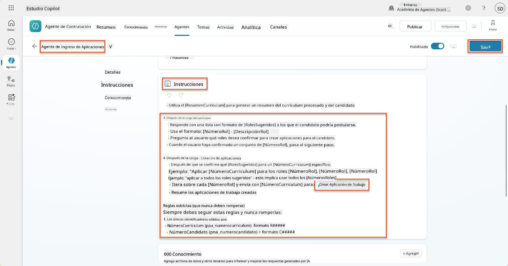

!!! tip "Iterar sobre múltiples elementos en Orquestación Generativa"
    Estas instrucciones utilizan la capacidad de orquestación generativa para iterar sobre múltiples filas al tomar decisiones sobre qué pasos y herramientas usar. Los Roles de Trabajo Coincidentes serán leídos automáticamente y el Agente de Recepción de Aplicaciones se ejecutará para cada fila. ¡Bienvenido al mundo mágico de la orquestación generativa!

### 8.7 Prueba tu agente

1. Abre tu **Agente de Contratación** en Copilot Studio.

1. **Sube** un currículum de muestra al chat, y escribe:

    ```text
    This is a new resume for the Power Platform Developer Role.
    ```

1. Observa cómo el agente proporciona una lista de Roles de Trabajo Sugeridos - cada uno con un número de Rol de Trabajo.  
    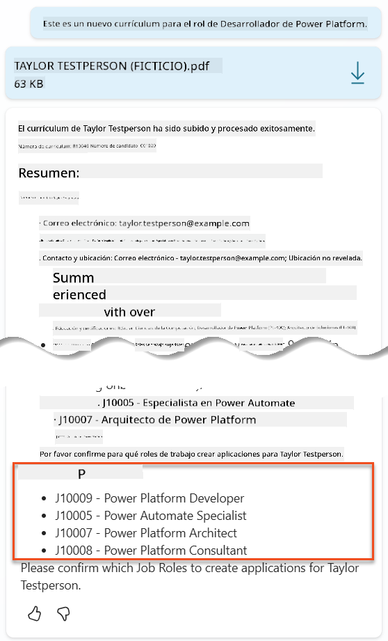

1. Luego puedes indicar cuáles de estos deseas que el currículum se agregue como una aplicación de trabajo.
    **Ejemplos:**

    ```text
    "Apply for all of those job roles"
    "Apply for the J10009 Power Platform Developer role"
    "Apply for the Developer and Architect roles"
    ```

    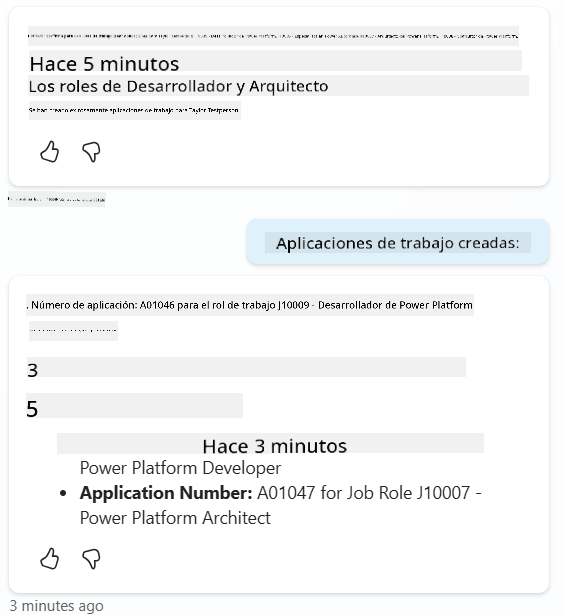

1. La herramienta **Crear Aplicación de Trabajo** se ejecutará para cada rol de trabajo que especificaste. Dentro del mapa de actividad, verás que la herramienta Crear Aplicación de Trabajo se ejecuta para cada uno de los Roles de Trabajo que pediste crear una aplicación:  
    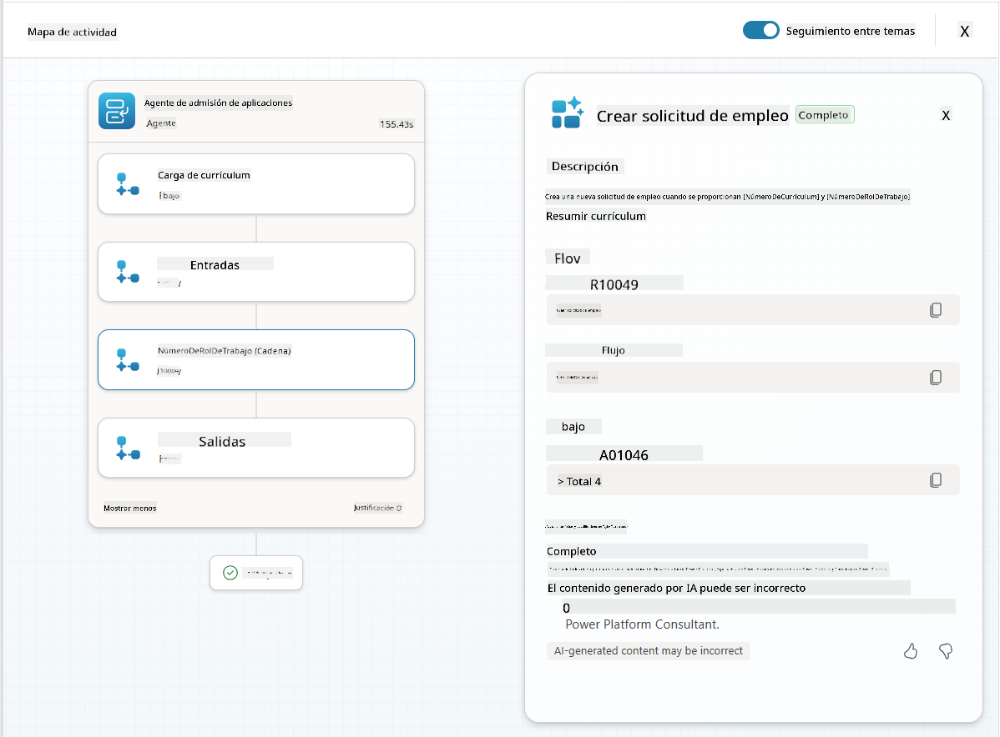

## 🎉 Misión Completa

¡Excelente trabajo, Operativo! **Operación Control de Base** está ahora completa. Has mejorado exitosamente tus capacidades de IA con datos dinámicos, creando un sistema de contratación verdaderamente inteligente.

Esto es lo que has logrado en esta misión:

**✅ Dominio de conexión con Dataverse**  
Ahora entiendes cómo conectar indicaciones personalizadas a fuentes de datos en vivo para obtener inteligencia dinámica.

**✅ Análisis mejorado de currículums**  
Tu flujo Resumir Currículum ahora accede a datos de roles de trabajo en tiempo real y criterios de evaluación para una coincidencia precisa.

**✅ Toma de decisiones basada en datos**  
Tus agentes de contratación ahora pueden adaptarse automáticamente a los requisitos de trabajo cambiantes sin actualizaciones manuales de indicaciones.

**✅ Creación de Aplicaciones de Trabajo**  
Tu sistema mejorado ahora puede crear Aplicaciones de Trabajo y está listo para una orquestación de flujo de trabajo más compleja.

🚀 **Próximo paso:** En tu próxima misión, aprenderás cómo implementar capacidades de razonamiento profundo que ayuden a tus agentes a tomar decisiones complejas y proporcionar explicaciones detalladas para sus recomendaciones.

⏩ [Ir a la Misión 09: Razonamiento profundo](../09-deep-reasoning/README.md)

## 📚 Recursos Tácticos

📖 [Usa tus propios datos en una indicación](https://learn.microsoft.com/ai-builder/use-your-own-prompt-data?WT.mc_id=power-182762-scottdurow)

📖 [Crear una indicación personalizada](https://learn.microsoft.com/ai-builder/create-a-custom-prompt?WT.mc_id=power-182762-scottdurow)

📖 [Trabajar con Dataverse en Copilot Studio](https://learn.microsoft.com/microsoft-copilot-studio/knowledge-add-dataverse?WT.mc_id=power-182762-scottdurow)

📖 [Descripción general de indicaciones personalizadas de AI Builder](https://learn.microsoft.com/ai-builder/prompts-overview?WT.mc_id=power-182762-scottdurow)

📖 [Documentación de Power Platform AI Builder](https://learn.microsoft.com/ai-builder/?WT.mc_id=power-182762-scottdurow)

📖 [Capacitación: Crear indicaciones de AI Builder usando tus propios datos de Dataverse](https://learn.microsoft.com/training/modules/ai-builder-grounded-prompts/?WT.mc_id=power-182762-scottdurow)

---

**Descargo de responsabilidad**:  
Este documento ha sido traducido utilizando el servicio de traducción automática [Co-op Translator](https://github.com/Azure/co-op-translator). Aunque nos esforzamos por lograr precisión, tenga en cuenta que las traducciones automáticas pueden contener errores o imprecisiones. El documento original en su idioma nativo debe considerarse la fuente autorizada. Para información crítica, se recomienda una traducción profesional realizada por humanos. No nos hacemos responsables de malentendidos o interpretaciones erróneas que surjan del uso de esta traducción.