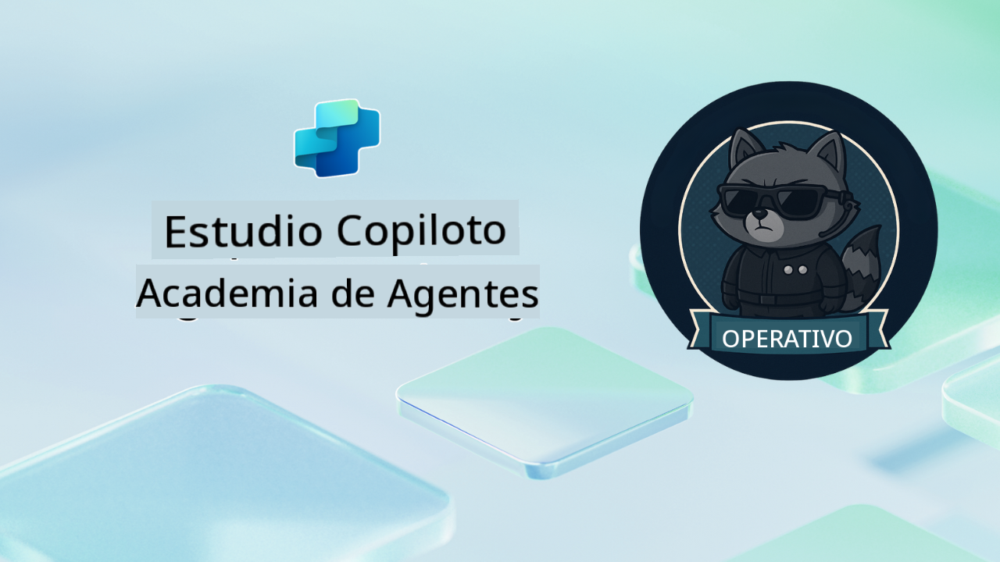

<!--
CO_OP_TRANSLATOR_METADATA:
{
  "original_hash": "24fcbe9a57d3439e05f8866e550c0a84",
  "translation_date": "2025-10-17T19:17:01+00:00",
  "source_file": "docs/operative-preview/README.md",
  "language_code": "es"
}
-->
# Bienvenido Operativo

**Bienvenido, Operativo.**  
Tu misión avanzada—si decides aceptarla—es dominar el arte de construir **sistemas multiagente de nivel empresarial** utilizando **Microsoft Copilot Studio**.

Este entrenamiento intensivo te llevará más allá de la creación básica de agentes hacia el sofisticado mundo de la **orquestación multiagente**: desde automatización de contratación hasta seguridad en IA, aprenderás a construir, coordinar y desplegar ecosistemas inteligentes de agentes utilizando escenarios empresariales reales.

--8<-- "disclaimer.md"

---

## 🎯 Objetivo de la Misión

Al completar el programa de Operativo de la Agent Academy, serás capaz de:

- Diseñar e implementar **sistemas multiagente** para escenarios empresariales complejos
- Dominar patrones de **orquestación y colaboración entre agentes**
- Implementar **seguridad en IA y moderación de contenido** en sistemas de producción
- Crear **prompts multimodales** para procesamiento y análisis de documentos
- Desplegar **agentes listos para empresas** con gobernanza y pruebas adecuadas

---

## 🧪 Requisitos Previos

Para completar todas las misiones, necesitarás:

- Haber completado el entrenamiento de **Agent Academy Recruit**
- Un entorno de Microsoft Power Platform con licencia de **Copilot Studio**
- Acceso a **Microsoft Dataverse**
- Permisos administrativos para crear soluciones y agentes

---

## 🧬 ¿Para Quién Es Este Curso?

Este curso avanzado es ideal para:

- **Arquitectos de soluciones** que diseñan sistemas de IA empresariales
- **Desarrolladores** que construyen soluciones de agentes listas para producción
- **Profesionales de TI** que implementan gobernanza y seguridad en IA
- **Analistas de negocios** que crean flujos de trabajo de automatización complejos
- Cualquiera que esté listo para **subir de nivel** desde agentes básicos a sistemas empresariales

---

## 🧭 Resumen del Currículo

Esta academia está estructurada como una serie progresiva de operaciones de campo—cada misión se basa en la anterior para crear un sistema integral de automatización de contratación.

| Misión | Título | Resumen de la Operación |
|--------|--------|-------------------------|
| `01` | 🚨 [Comienza con el Agente de Contratación](./01-get-started/README.md) | Despliega infraestructura básica y crea tu agente orquestador central |
| `02` | 🎭 [Haz que tu agente esté listo para múltiples agentes con agentes conectados](./02-multi-agent/README.md) | Transforma un agente único en un sistema coordinado de múltiples agentes |
| `03` | ⚡ [Automatiza tu agente con Triggers](./03-automate-triggers/README.md) | Implementa comportamientos autónomos de agentes con triggers basados en eventos |
| `04` | 📝 [Creación de Instrucciones para Agentes](./04-agent-instructions/README.md) | Domina la comunicación precisa y el control de comportamiento de los agentes |
| `05` | 💬 [Personalización de Respuestas de Agentes](./05-agent-responses/README.md) | Personaliza las respuestas de los agentes para lograr el máximo impacto y compromiso |
| `06` | 🛡️ [Moderación de Contenido y Esenciales de Seguridad en IA](./06-ai-safety/README.md) | Implementa medidas de seguridad y cumplimiento de nivel empresarial |
| `07` | 🎨 [Extracción de Contenido de Currículums con Prompts Multimodales](./07-multimodal-prompts/README.md) | Procesa documentos e imágenes con capacidades avanzadas de IA |
| `08` | 🗄️ [Prompts - Fundamentación en Dataverse](./08-dataverse-grounding/README.md) | Fundamenta agentes en datos empresariales para respuestas precisas |
| `09` | 🧠 [Aplicación de Razonamiento Profundo para Evaluar la Idoneidad de Candidatos y Preparación de Entrevistas](./09-deep-reasoning/README.md) | Implementa razonamiento sofisticado de IA para decisiones complejas |
| `10` | 📄 [Genera Documentos de Entrevista Específicos para Candidatos con Prompts](./10-generate-documents/README.md) | Crea documentos dinámicos basados en el análisis del agente |
| `11` | 📊 [Obtén Retroalimentación de Usuarios con Tarjetas Adaptativas](./11-obtain-user-feedback/README.md) | Recopila y procesa retroalimentación de usuarios para mejora continua |
| `12` | 🌐 [Publica tus Agentes en un Sitio Web de Demostración para Pruebas de Stakeholders](./12-demo-website/README.md) | Despliega la solución completa para demostración y pruebas de stakeholders |

!!! note
    ✅ Completar este currículo te otorga la insignia de **Operativo**.  
    🔓 **Comandante** se desbloqueará en fases futuras.

<!-- markdownlint-disable-next-line MD033 -->

---

**Descargo de responsabilidad**:  
Este documento ha sido traducido utilizando el servicio de traducción automática [Co-op Translator](https://github.com/Azure/co-op-translator). Aunque nos esforzamos por lograr precisión, tenga en cuenta que las traducciones automáticas pueden contener errores o imprecisiones. El documento original en su idioma nativo debe considerarse la fuente autorizada. Para información crítica, se recomienda una traducción profesional realizada por humanos. No nos hacemos responsables de malentendidos o interpretaciones erróneas que surjan del uso de esta traducción.