<!--
CO_OP_TRANSLATOR_METADATA:
{
  "original_hash": "d9cd8cd1a4fbd8915171a2ed972cc322",
  "translation_date": "2025-10-17T18:59:46+00:00",
  "source_file": "docs/recruit/00-course-setup/README.md",
  "language_code": "es"
}
-->
# 🚨 Misión 00: Configuración del Curso

## 🕵️‍♂️ NOMBRE CLAVE: `OPERACIÓN LISTOS PARA EL DESPLIEGUE`

> **⏱️ Ventana de Tiempo de la Operación:** `~30 minutos`  

## 🎯 Resumen de la Misión

Bienvenido a la primera misión de tu entrenamiento como Agente de Copilot Studio.  
Antes de que puedas comenzar a construir tu primer agente de IA, necesitas establecer tu **entorno de desarrollo listo para el campo**.

Este informe detalla los sistemas, credenciales de acceso y pasos de configuración necesarios para operar con éxito en el ecosistema de Microsoft 365.

## 🔎 Objetivos

Tu misión incluye:

1. Obtener una cuenta de Microsoft 365  
1. Acceder a Microsoft Copilot Studio  
1. (Opcional) Asegurar una licencia de Microsoft 365 Copilot para publicación en producción  
1. Crear un entorno de desarrollo como tu entorno de Copilot Studio para trabajar  
1. Crear un sitio de SharePoint que servirá como fuente de datos en misiones posteriores  

---

## 🔍 Requisitos Previos

Antes de comenzar, asegúrate de tener:

1. Una **dirección de correo electrónico de trabajo o escuela** (no se admiten cuentas personales como @outlook.com, @gmail.com, etc.).  
1. Acceso a internet y un navegador moderno (se recomienda Edge, Chrome o Firefox).  
1. Familiaridad básica con Microsoft 365 (por ejemplo, iniciar sesión en aplicaciones de Office o Teams).  
1. (Opcional) Una tarjeta de crédito o método de pago si planeas adquirir licencias de pago.  

---

## Paso 1: Obtener una cuenta de Microsoft 365

Copilot Studio se encuentra dentro de Microsoft 365, por lo que necesitas una cuenta de Microsoft 365 para acceder. Puedes usar una cuenta existente si ya tienes una o seguir estos pasos para obtener una licencia adecuada:

1. **Adquirir una Suscripción de Negocios de Microsoft 365**  
   1. Ve a la [Página de Planes y Precios de Microsoft 365 Business](https://www.microsoft.com/microsoft-365/business/microsoft-365-plans-and-pricing)  
   1. La opción más económica para comenzar es el plan Microsoft 365 Business Basic. Selecciona `Probar gratis` y sigue el formulario guiado para completar los detalles de tu suscripción, cuenta e información de pago.  
   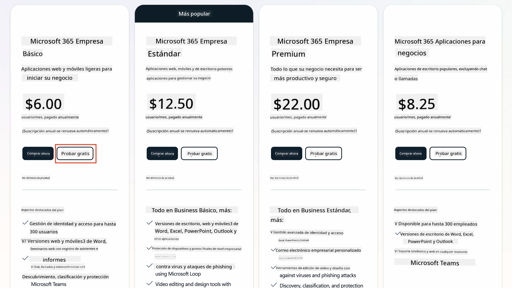  
   1. Una vez que tengas tu nueva cuenta, inicia sesión.  

    !!! Tip
        Si planeas publicar agentes en Microsoft 365 Copilot Chat o conectarte a datos organizacionales (SharePoint, OneDrive, Dataverse), se requiere una licencia de Microsoft 365 Copilot. Esta es una licencia adicional que puedes conocer más en [el sitio de licencias](https://www.microsoft.com/microsoft-365/copilot#plans).

---

## Paso 2: Iniciar una Prueba de Copilot Studio

Una vez que tengas tu Tenant de Microsoft 365, necesitas obtener acceso a Copilot Studio. Puedes obtener una prueba gratuita de 30 días siguiendo estos pasos:

1. Navega a [aka.ms/TryCopilotStudio](https://aka.ms/TryCopilotStudio).  
1. Ingresa la dirección de correo electrónico de la nueva cuenta que configuraste en el paso anterior y selecciona `Siguiente`.  
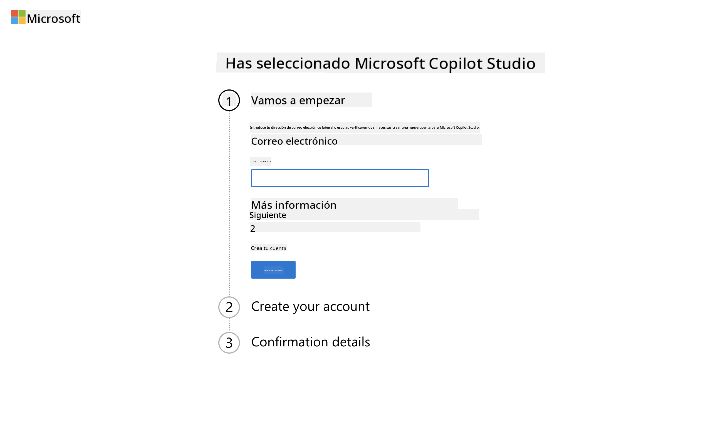  
1. Debería reconocer tu cuenta. Selecciona `Iniciar sesión`.  
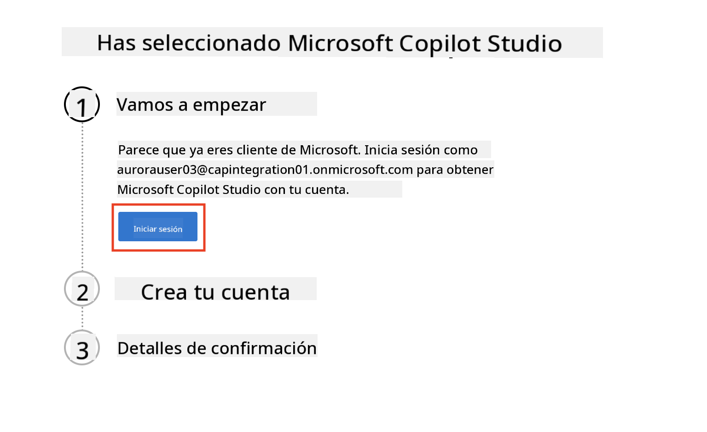  
1. Selecciona `Iniciar prueba gratuita`.  
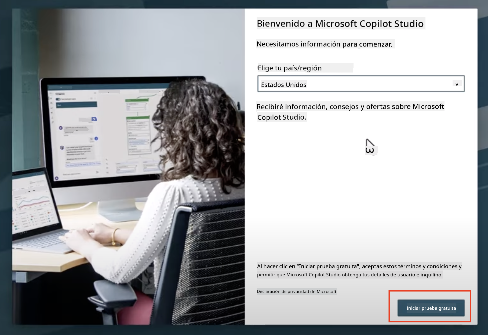  

!!! info "Notas de la Prueba"  
     1. La prueba gratuita proporciona **todas las capacidades de Copilot Studio**.  
     1. Recibirás notificaciones por correo electrónico sobre la expiración de tu prueba. Puedes extender la prueba en incrementos de 30 días (hasta 90 días de tiempo de ejecución del agente).  
     1. Si el administrador de tu tenant desactivó el registro de autoservicio, verás un error. Contacta a tu administrador de Microsoft 365 para reactivarlo.  

---

## Paso 3: Crear un nuevo entorno de desarrollo

### Registrarse en el Plan de Desarrollador de Power Apps

Usando el mismo tenant de Microsoft 365 del Paso 1, regístrate en el Plan de Desarrollador de Power Apps para crear un entorno de desarrollo gratuito y probar con Copilot Studio.

1. Regístrate en el [sitio web del Plan de Desarrollador de Power Apps](https://aka.ms/PowerAppsDevPlan).  

    - Ingresa tu dirección de correo electrónico  
    - Marca la casilla  
    - Selecciona **Comenzar gratis**  

    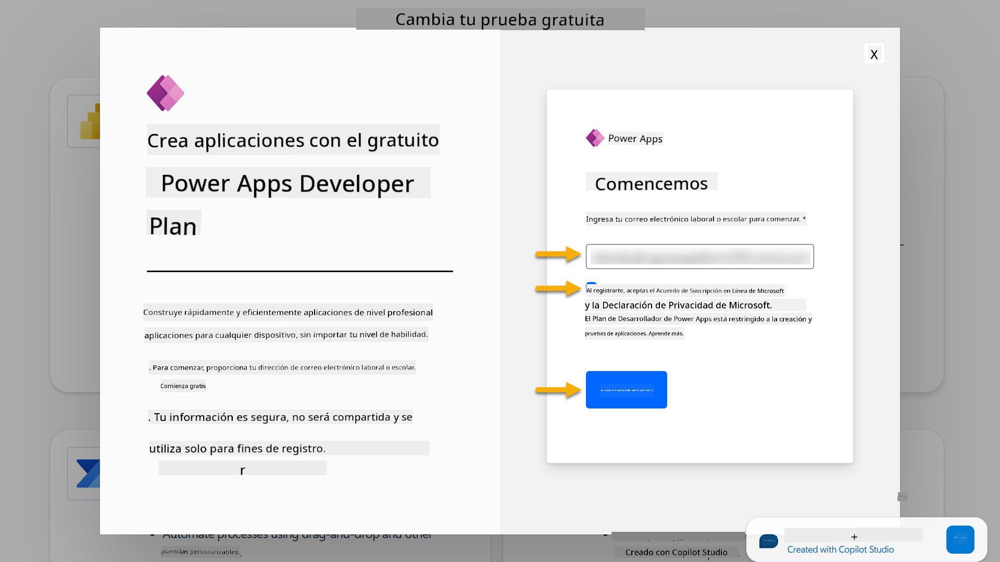  

1. Después de registrarte en el Plan de Desarrollador, serás redirigido a [Power Apps](https://make.powerapps.com/). El entorno usa tu nombre, por ejemplo **Entorno de Adele Vance**. Si ya existe un entorno con ese nombre, el nuevo entorno de desarrollador se llamará **Entorno de Adele Vance (1)**.  

    Usa este entorno de desarrollador en Copilot Studio al completar los laboratorios.  

!!! Note
    Si estás utilizando una cuenta existente de Microsoft 365 y no creaste una en el Paso 1, por ejemplo, usando tu propia cuenta en tu organización laboral, tu administrador de TI (o el equipo equivalente) que gestiona tu tenant/entornos podría haber desactivado el proceso de registro. En este caso, por favor contacta a tu administrador o crea un tenant de prueba como se indica en el Paso 1.  

---

## Paso 4: Crear un nuevo sitio de SharePoint

Se necesita crear un nuevo sitio de SharePoint que será utilizado en [Lección 06 - Crear un agente personalizado usando la experiencia de creación conversacional con Copilot y fundamentándolo con tus datos](../06-create-agent-from-conversation/README.md#62-add-an-internal-knowledge-source-using-a-sharepoint-site).  

1. Selecciona el ícono de waffle en la esquina superior izquierda de Microsoft Copilot Studio para ver el menú. Selecciona SharePoint en el menú.  

    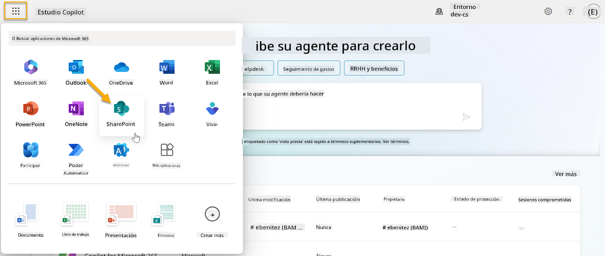  

1. SharePoint se cargará. Selecciona **+ Crear sitio** para crear un nuevo sitio de SharePoint.  

    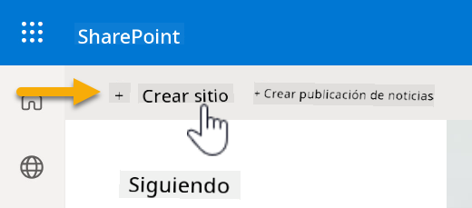  

1. Aparecerá un cuadro de diálogo para guiarte en la creación de un nuevo sitio de SharePoint. Selecciona **Sitio de equipo**.  

      

1. En el siguiente paso, se cargará una lista de plantillas de Microsoft por defecto. Desplázate hacia abajo y selecciona la plantilla **Mesa de ayuda de TI**.  

    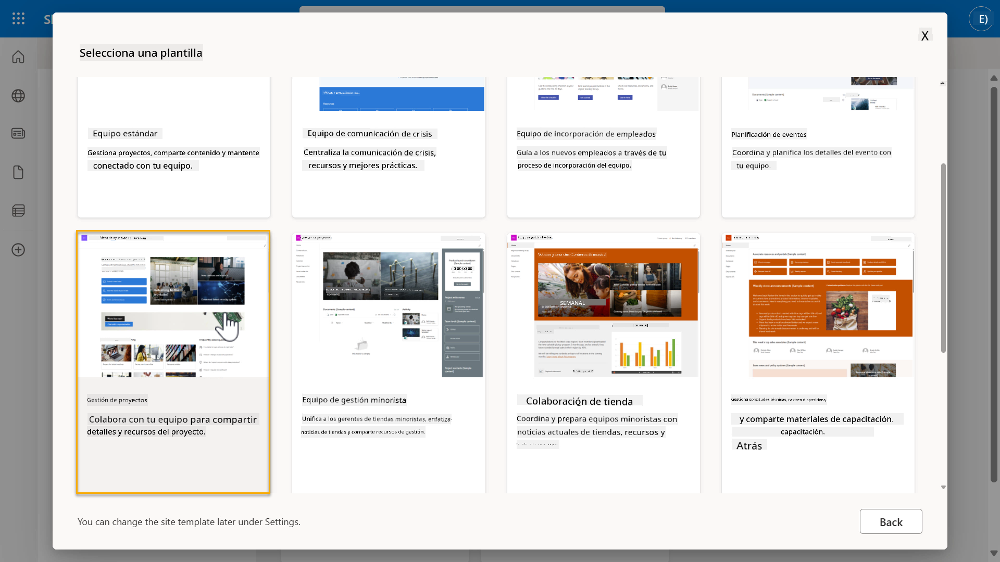  

1. Selecciona **Usar plantilla** para crear un nuevo sitio de SharePoint usando la plantilla de mesa de ayuda de TI.  

    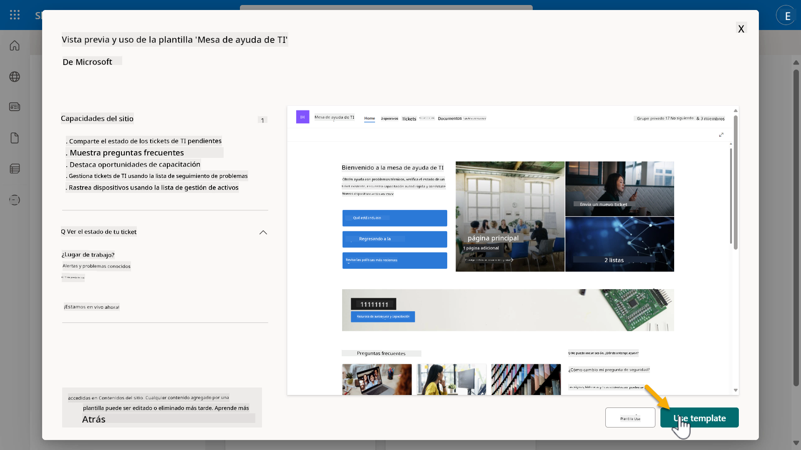  

1. Ingresa información para tu sitio. El siguiente es un ejemplo:  

    | Campo | Valor |
    | --- | --- |
    | Nombre del sitio | Contoso IT |
    | Descripción del sitio | Copilot Studio para Principiantes |
    | Dirección del sitio | ContosoIT |

    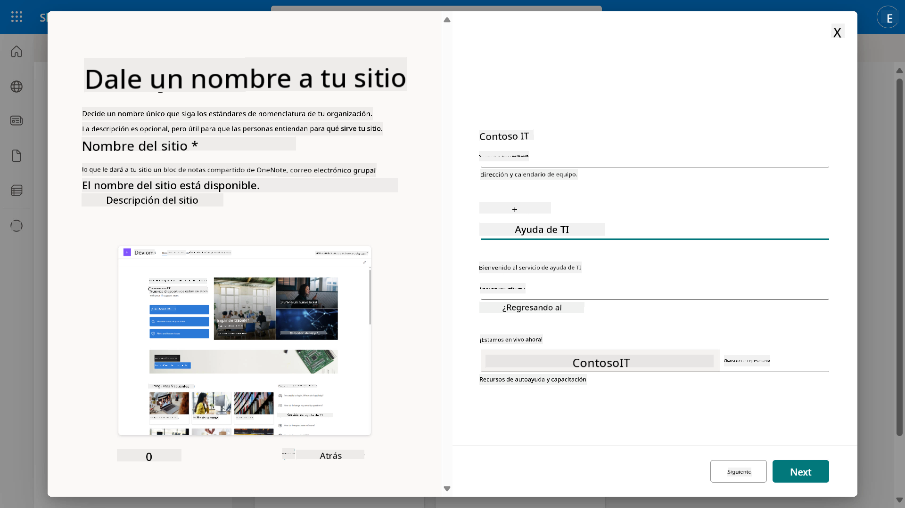  

1. En el paso final, se puede seleccionar un idioma para el sitio de SharePoint. Por defecto será **Inglés**. Deja el idioma como **Inglés** y selecciona **Crear sitio**.  

    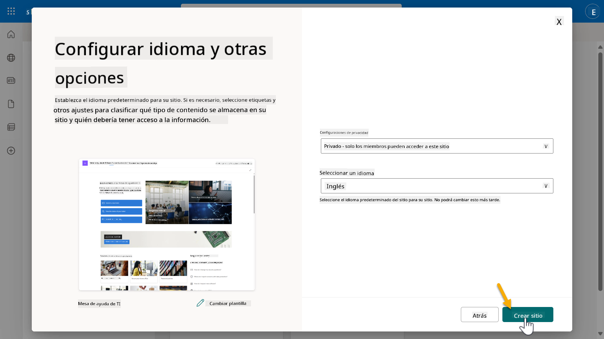  

1. El sitio de SharePoint se aprovisionará en los próximos segundos. Mientras tanto, puedes optar por agregar otros usuarios a tu sitio ingresando su dirección de correo electrónico en el campo **Agregar miembros**. Cuando termines, selecciona **Finalizar**.  

    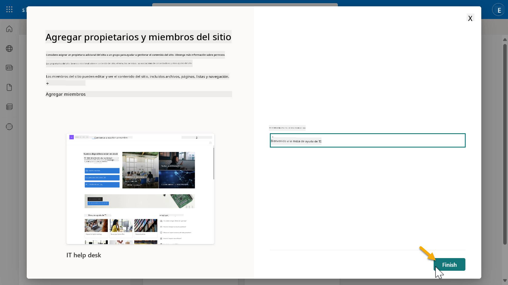  

1. La página de inicio del sitio de SharePoint se cargará a continuación. **Copia** la URL del sitio de SharePoint.  

1. Esta plantilla proporciona páginas con datos de muestra sobre varias políticas de TI y dos listas de muestra (Tickets y Dispositivos).  

### Usar la lista de SharePoint de Dispositivos

Usaremos la lista **Dispositivos** en [Misión 07 - Agregar nuevo tema con disparador y nodos](../07-add-new-topic-with-trigger/README.md#73-add-a-tool-using-a-connector).  

### Agregar nueva columna

Desplázate hacia la derecha en la lista y selecciona el botón **+ Agregar columna**. Elige el tipo **hipervínculo**, ingresa **Imagen** como nombre de la columna y selecciona agregar.  

### Crear datos de muestra en la lista de SharePoint de Dispositivos

Asegúrate de llenar esta lista con al menos 4 elementos de datos de muestra y agregar una columna adicional a esta lista.  

Al agregar datos de muestra, asegúrate de que los siguientes campos estén completos:  

- Foto del dispositivo - usa las imágenes de la [carpeta de imágenes de dispositivos](https://github.com/microsoft/agent-academy/tree/main/docs/recruit/00-course-setup/images/device-images)  
- Título  
- Estado  
- Fabricante  
- Modelo  
- Tipo de activo  
- Color  
- Número de serie  
- Fecha de compra  
- Precio de compra  
- Número de pedido  
- Imagen - usa los siguientes enlaces  

|Dispositivo  |URL  |
|---------|---------|
|Surface Laptop 13     | [https://raw.githubusercontent.com/microsoft/agent-academy/refs/heads/main/docs/recruit/00-course-setup/images/device-images/Surface-Laptop-13.png](https://raw.githubusercontent.com/microsoft/agent-academy/refs/heads/main/docs/recruit/00-course-setup/images/device-images/Surface-Laptop-13.png)        |
|Surface Laptop 15     | [https://raw.githubusercontent.com/microsoft/agent-academy/refs/heads/main/docs/recruit/00-course-setup/images/device-images/Surface-Laptop-15.png](https://raw.githubusercontent.com/microsoft/agent-academy/refs/heads/main/docs/recruit/00-course-setup/images/device-images/Surface-Laptop-15.png)        |
|Surface Pro    | [https://raw.githubusercontent.com/microsoft/agent-academy/refs/heads/main/docs/recruit/00-course-setup/images/device-images/Surface-Pro-12.png](https://raw.githubusercontent.com/microsoft/agent-academy/refs/heads/main/docs/recruit/00-course-setup/images/device-images/Surface-Pro-12.png)        |
|Surface Studio    | [https://raw.githubusercontent.com/microsoft/agent-academy/refs/heads/main/docs/recruit/00-course-setup/images/device-images/Surface-Studio.png](https://raw.githubusercontent.com/microsoft/agent-academy/refs/heads/main/docs/recruit/00-course-setup/images/device-images/Surface-Studio.png)        |

---

## ✅ Misión Completa

Has logrado:

- Configurar un entorno de desarrollo de Microsoft 365  
- Activar tu prueba de Copilot Studio  
- Crear un sitio de SharePoint para fundamentar agentes  
- Rellenar la lista de Dispositivos para usar en futuras misiones  

Estás oficialmente listo para comenzar tu **entrenamiento de agente nivel Recluta** en [Lección 01](../01-introduction-to-agents/README.md).  

<!-- markdownlint-disable-next-line MD033 -->

---

**Descargo de responsabilidad**:  
Este documento ha sido traducido utilizando el servicio de traducción automática [Co-op Translator](https://github.com/Azure/co-op-translator). Aunque nos esforzamos por lograr precisión, tenga en cuenta que las traducciones automáticas pueden contener errores o imprecisiones. El documento original en su idioma nativo debe considerarse la fuente autorizada. Para información crítica, se recomienda una traducción profesional realizada por humanos. No nos hacemos responsables de malentendidos o interpretaciones erróneas que surjan del uso de esta traducción.