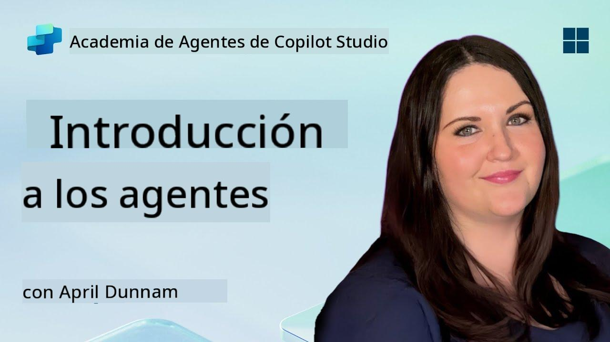

<!--
CO_OP_TRANSLATOR_METADATA:
{
  "original_hash": "d6706e107678264168d77b2e107710b1",
  "translation_date": "2025-10-17T19:13:13+00:00",
  "source_file": "docs/recruit/01-introduction-to-agents/README.md",
  "language_code": "es"
}
-->
# 🚨 Misión 01: Introducción a los Agentes

## 🕵️‍♂️ NOMBRE CLAVE: `OPERACIÓN DESCIFRAR AGENTE AI`

> **⏱️ Ventana de Tiempo de la Operación:** `~30 minutos – solo información, no se requiere trabajo de campo`

🎥 **Mira el Tutorial**

## 🎯 Resumen de la Misión

Bienvenido, Recluta. Antes de sumergirnos en la creación de agentes, necesitas comprender los conceptos de IA que los impulsan. Esta misión te proporcionará conocimientos fundamentales sobre IA conversacional, modelos de lenguaje extensos (LLMs), generación aumentada por recuperación (RAG) y los tipos de agentes que puedes crear en Copilot Studio.

## 🔎 Objetivos

En esta misión, aprenderás:

1. Qué es la IA conversacional y por qué es importante  
1. Cómo los Modelos de Lenguaje Extensos (LLMs) impulsan las experiencias de chat  
1. Qué aporta la Generación Aumentada por Recuperación (RAG)  
1. La diferencia entre agentes conversacionales y agentes autónomos  
1. Cómo los agentes en Copilot Studio aprovechan estos conceptos  

¡Vamos a comenzar!

---

## ¿Qué es la IA Conversacional?

La IA conversacional se refiere a cualquier sistema que pueda entender, procesar y responder al lenguaje humano – ya sea texto o voz – de una manera que se sienta natural. Piensa en chatbots en mesas de ayuda o asistentes personales virtuales en tus aplicaciones favoritas. En su núcleo, la mayoría de las IA conversacionales modernas dependen de Modelos de Lenguaje Extensos (LLMs), que cubriremos a continuación.

### Por qué es importante

- **Experiencia del Usuario:** Las interfaces conversacionales suelen ser más intuitivas que navegar por menús.  
- **Escalabilidad:** Un agente puede manejar decenas o cientos de conversaciones simultáneas.  
- **Eficiencia:** En lugar de construir scripts personalizados basados en reglas, los agentes impulsados por LLM se adaptan sobre la marcha a la entrada del usuario.  
- **Extensibilidad:** Con el diseño adecuado, los agentes pueden acceder a bases de conocimiento, conectarse a APIs o actuar como “compañeros digitales” dentro de flujos de trabajo empresariales.

---

## Modelos de Lenguaje Extensos (LLMs) 101

En el núcleo de la mayoría de los sistemas de IA conversacional están los **Modelos de Lenguaje Extensos** – redes neuronales entrenadas con enormes cantidades de texto. Aprenden patrones estadísticos del lenguaje para generar oraciones coherentes, responder preguntas o incluso proponer ideas. Puntos clave para entender:

1. **Datos de Entrenamiento:** Los LLMs procesan terabytes de texto (páginas web, libros, artículos). Este “conocimiento del mundo” les permite responder sobre muchos temas.  
1. **Tokenización:** El texto se divide en unidades más pequeñas llamadas tokens (palabras, subpalabras o caracteres). El modelo predice un token a la vez.  
1. **Ventana de Contexto:** Cada LLM tiene un límite en la cantidad de tokens que puede “ver” a la vez. Más allá de ese límite, los tokens anteriores se truncan.  
1. **Prompts:** Interactúas con un LLM enviándole un prompt. Cuanto mejor sea tu prompt, más enfocada y relevante será la respuesta.  
1. **Zero-shot vs. Fine-tuning:** Zero-shot significa usar un LLM tal cual (solo pesos en bruto). Fine-tuning significa ajustar el modelo con datos específicos del dominio para que responda con mayor precisión a tus necesidades.

!!! Tip "Consejo Profesional"
    Una analogía común es que un LLM es como un “autocompletado súper inteligente.” No comprende realmente el significado como un cerebro humano, pero es extremadamente bueno prediciendo la siguiente mejor palabra (o frase) en una secuencia.

---

## Generación Aumentada por Recuperación (RAG)

Cuando los LLMs dependen únicamente de datos de entrenamiento estáticos, pueden alucinar o quedar desactualizados. RAG aborda esto permitiendo que el modelo “busque” información actualizada antes de componer una respuesta. A grandes rasgos, RAG funciona así:

1. **Consulta del Usuario:** Un usuario hace una pregunta (por ejemplo, “¿Cuál es la última información sobre las ganancias trimestrales de Contoso?”).  
1. **Paso de Recuperación:** El sistema consulta una fuente de conocimiento (documentos, bases de datos internas, bibliotecas de SharePoint, etc.) para encontrar pasajes relevantes.  
1. **Aumentación:** Los pasajes recuperados se añaden o se colocan antes del prompt del LLM.  
1. **Generación:** El LLM procesa tanto la pregunta del usuario como el contexto recuperado, y genera una respuesta basada en datos actualizados.  

Con RAG, tu agente puede consultar wikis internos de la empresa, APIs de complementos o buscar en una base de conocimiento de preguntas frecuentes, y devolver respuestas que no están limitadas a parámetros de modelo publicados estáticamente.

---

## Agentes Conversacionales vs. Autónomos

En el contexto de Copilot Studio, el término **agente** puede referirse a múltiples tipos de asistentes de IA. Es útil trazar una línea entre:

**Agentes Conversacionales:**

- Se centran principalmente en el diálogo bidireccional.  
- Mantienen el contexto a lo largo de múltiples turnos de conversación.  
- Generalmente se orquestan mediante flujos o disparadores predefinidos (por ejemplo, “Si el usuario dice X, responde con Y”).  
- Ideales para soporte al cliente, preguntas frecuentes, interacciones guiadas, programación o preguntas y respuestas simples.  
  - Ejemplos:  
    - Un chatbot de Teams que responde preguntas sobre políticas de recursos humanos.  
    - Un bot de Power Virtual Agents en una página de SharePoint que guía a los usuarios a través de un formulario.  

**Agentes Autónomos:**

- Van más allá del chat; pueden **realizar acciones** en nombre del usuario.  
- Utilizan bucles de razonamiento de LLM (piensa en “planificar → actuar → observar → replanificar”) para completar tareas.  
- Se conectan a herramientas externas o APIs (por ejemplo, ejecutar un flujo de Power Automate, enviar invitaciones de calendario, manipular datos en Dataverse).  
- Operan sin necesidad de constantes indicaciones humanas; una vez activados, pueden manejar procesos de múltiples pasos de forma autónoma.  
  - Ejemplos:  
    - Un agente que genera un itinerario de viaje, reserva vuelos y envía confirmaciones por correo electrónico.  
    - Un agente “Resumidor de Reuniones” que se une a una llamada de Teams, la transcribe en tiempo real y escribe un resumen ejecutivo en OneNote.  

!!! Info "Diferencia Clave"
    Los agentes conversacionales esperan la entrada del usuario y se limitan al diálogo. Los agentes autónomos planifican y ejecutan una secuencia de pasos utilizando un acceso más amplio a herramientas.

---

## Agentes en Copilot Studio

**Copilot Studio** unifica tanto escenarios conversacionales como autónomos bajo un marco único. Así es como Copilot Studio te ayuda a construir agentes:

1. **Diseñador Visual de Agentes:** Un lienzo de bajo código para definir prompts, memoria y herramientas para flujos de chat y acción.  
1. **Configuraciones de LLM:** Selecciona entre varios modelos de OpenAI o GPT empresarial de Microsoft para ajustar tus necesidades de rendimiento y costo.  
1. **Conectores de Recuperación:** Integraciones predefinidas para SharePoint, OneDrive, Azure Cognitive Search y Dataverse, habilitando RAG de manera predeterminada.  
1. **Herramientas y Funciones Personalizadas:** Define acciones HTTP personalizadas o flujos de Power Automate que tu agente puede invocar de forma autónoma.  
1. **Soporte Multimodal:** Más allá del texto, los agentes de Copilot Studio pueden procesar imágenes, archivos o datos estructurados para enriquecer el contexto.  
1. **Publicación y Distribución:** Una vez que tu agente esté listo, puedes publicarlo en Microsoft 365 Copilot (para que los usuarios lo invoquen en Teams, SharePoint, Outlook, etc.) o incrustarlo como un widget de chat independiente en una página web.

---

## 🎉 Misión Completa

Ahora has completado tu introducción a los agentes y conceptos fundamentales de IA. Entiendes:

1. **LLMs = El “Cerebro” de Tu Agente**  
   - Responsable de la comprensión y generación del lenguaje.  
   - Más tokens = contexto más rico, pero también mayor costo por llamada.  

1. **RAG = Integración de Conocimiento en Tiempo Real**  
   - Cierra la brecha entre un LLM estático y fuentes de datos en constante cambio.  
   - Recupera e inyecta documentos o registros relevantes en el prompt del LLM.  

1. **Conversacional vs. Autónomo**  
   - **Conversacional:** Se centran en el flujo de diálogo y en preservar el contexto (por ejemplo, “Memoria de Sesión”).  
   - **Autónomo:** Añaden “Bloques de Acción” que permiten al agente conectarse a herramientas o servicios externos.

---
A continuación, explorarás los [fundamentos de Copilot Studio](../02-copilot-studio-fundamentals/README.md)!

Mantente alerta, Recluta - tu viaje en IA apenas comienza.

## 📚 Recursos Tácticos

🔗 [Página Principal de Documentación de Copilot Studio](https://learn.microsoft.com/microsoft-copilot-studio/)

---

<!-- markdownlint-disable-next-line MD033 -->

---

**Descargo de responsabilidad**:  
Este documento ha sido traducido utilizando el servicio de traducción automática [Co-op Translator](https://github.com/Azure/co-op-translator). Aunque nos esforzamos por lograr precisión, tenga en cuenta que las traducciones automáticas pueden contener errores o imprecisiones. El documento original en su idioma nativo debe considerarse la fuente autorizada. Para información crítica, se recomienda una traducción profesional realizada por humanos. No nos hacemos responsables de malentendidos o interpretaciones erróneas que surjan del uso de esta traducción.