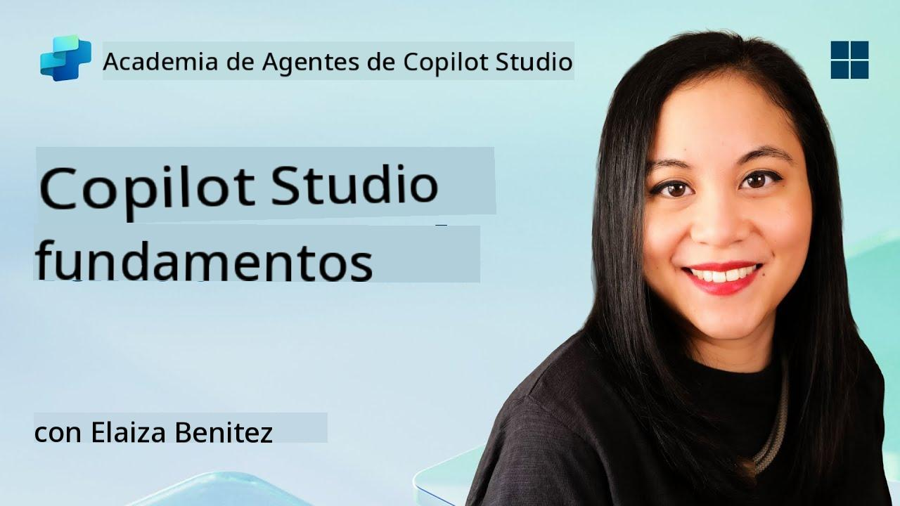
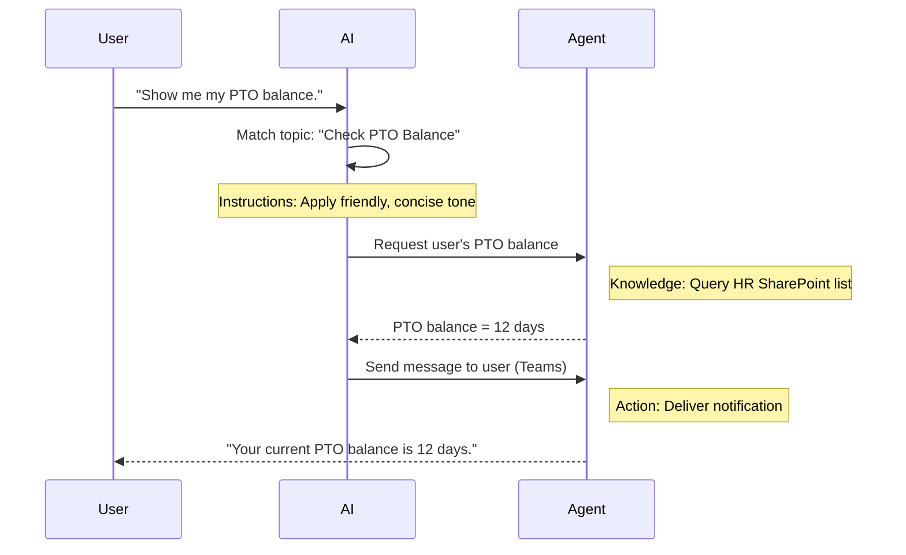

<!--
CO_OP_TRANSLATOR_METADATA:
{
  "original_hash": "90a3c5122f5687bbc8cc819990f175d4",
  "translation_date": "2025-10-17T19:14:07+00:00",
  "source_file": "docs/recruit/02-copilot-studio-fundamentals/README.md",
  "language_code": "es"
}
-->
# 🚨 Misión 02: Fundamentos de Copilot Studio

## 🕵️‍♂️ NOMBRE CLAVE: `OPERACIÓN PROTOCOLO CENTRAL`

> **⏱️ Ventana de tiempo de la operación:** `~30 minutos – solo información, no se requiere trabajo de campo`  

🎥 **Mira la guía paso a paso**

[](https://www.youtube.com/watch?v=x4OCwDRGeLE "Mira la guía en YouTube")

## 🎯 Resumen de la misión

Bienvenido, recluta. Esta misión te proporcionará información fundamental para entender cómo funciona Copilot Studio y cómo construir agentes inteligentes que generen un valor real para el negocio.

Antes de construir tu primer agente, necesitas comprender los cuatro componentes clave que forman cada agente de IA personalizado: Conocimiento, Herramientas, Temas e Instrucciones. También aprenderás cómo estos elementos trabajan juntos en el orquestador de Copilot Studio.

## 🔎 Objetivos

En esta misión, aprenderás:

- **Qué es Copilot Studio**
- **Cuándo y por qué usar agentes**
- **Explorar los cuatro bloques de construcción de los agentes**
      - **Conocimiento**
      - **Herramientas**
      - **Temas**
      - **Instrucciones**
- **Entender cómo estos componentes trabajan juntos** para crear un agente inteligente y automatizado

---

## ¿Qué son los agentes en Copilot Studio?

Un **agente** es un asistente de IA especializado que diseñas para manejar tareas o consultas específicas. A diferencia de un chatbot de propósito general, tu agente:

- **Conoce datos específicos de la empresa** (políticas, documentos, bases de datos)  
- **Realiza tareas del mundo real** (enviar mensajes, crear eventos en el calendario, actualizar registros)  
- **Mantiene el contexto conversacional** para poder dar seguimiento a preguntas anteriores  

Dado que Copilot Studio es de bajo código, puedes arrastrar y soltar componentes preconstruidos—no se requieren habilidades avanzadas de programación. Una vez que tu agente esté construido, las personas pueden usarlo dentro de Teams, Slack o incluso en una página web personalizada para obtener respuestas o activar flujos de trabajo automáticamente.

---

## Cuándo y por qué usar Copilot Studio

Mientras que Microsoft 365 Copilot proporciona asistencia general de IA en las aplicaciones de Office, querrás un agente personalizado cuando:

### Necesitas conocimiento específico del dominio

- Copilot estándar podría no conocer los procedimientos internos o datos de tu empresa. Un agente puede consultar tus sitios de SharePoint, bases de datos o fuentes personalizadas para proporcionar respuestas precisas y actualizadas.  

### Quieres automatizar flujos de trabajo de varios pasos

- Por ejemplo: "Cuando alguien envíe un gasto, envíalo para aprobación, actualiza el rastreador financiero y notifica al gerente." Un agente personalizado puede manejar cada paso, activado por un solo comando o evento.  

### Necesitas una experiencia contextual dentro de la herramienta  

- Imagina un agente de Onboarding para nuevos empleados en Teams que guíe al personal de RRHH a través de cada política, envíe los formularios necesarios y programe reuniones de orientación—todo dentro de tu plataforma de colaboración existente.  

---

## Cuatro bloques de construcción de un agente

Cada agente de Copilot Studio se construye a partir de cuatro componentes principales:

1. **Conocimiento**  
1. **Herramientas (Acciones)**  
1. **Temas**  
1. **Instrucciones**

A continuación, definiremos cada bloque de construcción y mostraremos cómo trabajan juntos para crear un agente efectivo.

### 1. Conocimiento

**Conocimiento** es la información y el contexto que tu agente utiliza para responder preguntas con precisión. Tiene dos partes:

#### Instrucciones personalizadas y contexto

- Escribes una breve descripción del propósito y tono del agente. Por ejemplo:  

    ```text
    You are an IT support agent. You help employees troubleshoot common software issues, provide troubleshooting steps, and escalate urgent tickets.
    ```

- Durante una conversación, el agente recuerda turnos anteriores para poder referirse a lo que ya se discutió (por ejemplo, si el usuario primero dice: "Mi impresora está desconectada," y luego pregunta: "¿Revisaste el nivel de tinta?" el agente recuerda el contexto de la impresora).

#### Fuentes de conocimiento (Datos de referencia)

- Conectas tu agente a múltiples fuentes de datos—bibliotecas de SharePoint, sitios de documentación, wikis u otras bases de datos.  
- Cuando un usuario hace una pregunta, el agente extrae fragmentos relevantes de esas fuentes para que las respuestas estén **basadas** en las políticas, manuales de productos o cualquier información propietaria de tu organización.  
- Incluso puedes obligar al agente a responder solo con información de esas fuentes, evitando que adivine o "alucine" respuestas.

!!! example
    Un agente "Asistente de Políticas" podría conectarse al sitio de SharePoint de RRHH. Si un usuario pregunta: "¿Cuál es nuestra tasa de acumulación de PTO?" el agente recupera el texto exacto del documento de políticas de RRHH en lugar de confiar en una respuesta genérica de IA.

---

### 2. Herramientas (Acciones)

**Herramientas (Acciones)** definen lo que el agente puede hacer además de conversar. Cada acción es una tarea que el agente ejecuta de manera programada, como:

- Enviar un correo electrónico o mensaje de Teams  
- Crear o actualizar un evento en el calendario  
- Agregar o editar un registro en una base de datos (por ejemplo, una lista de SharePoint o una tabla de Dataverse)  
- Llamar a un flujo de Power Automate o una API REST  

#### Cómo funcionan las acciones

- **Definir entradas y salidas**  
      - Por ejemplo, una acción de Enviar Correo Electrónico podría requerir:  
        - `RecipientEmailAddress`  
        - `SubjectLine`  
        - `EmailBody`  

- **Combinar acciones en flujos de trabajo**  
      - A menudo, cumplir con una solicitud del usuario implica múltiples pasos.  
      - Puedes secuenciar acciones para que:  
             1. El agente recupere datos de una lista de SharePoint.  
             2. Genere un resumen usando el LLM.  
             3. Envíe un mensaje de Teams con ese resumen.  

- **Conectar con sistemas externos**  
      - Si necesitas actualizar un CRM o llamar a una API interna, crea una acción personalizada para manejar eso.  
      - Copilot Studio puede integrarse con la Power Platform o cualquier punto final basado en HTTP.

!!! example "Un agente "Asistente de Gastos" podría:"  
    1. Escuchar una solicitud de "Enviar Gasto".  
    2. Obtener los detalles del gasto del usuario desde un formulario.  
    3. Usar una acción "Agregar a la lista de SharePoint" para almacenar los datos.  
    4. Activar una acción "Enviar Correo Electrónico" para notificar al aprobador.  

---

### 3. Temas

**Temas** definen los disparadores conversacionales o puntos de entrada para tu agente. Cada tema corresponde a una funcionalidad o categoría de pregunta.

#### Disparadores conversacionales  

- Un tema podría ser "Enviar ticket de TI," "Consultar saldo de vacaciones," o "Crear informe de ventas."  
- En el fondo, Copilot Studio utiliza **orquestación generativa**: en lugar de depender de palabras clave exactas, la IA interpreta la intención del usuario y elige el tema correcto basado en una breve descripción que proporciones.  

#### Descripciones de temas  

- En cada tema, escribes una descripción clara y concisa de lo que cubre ese tema.

!!! example "Ejemplo de descripción de tema"
    Este tema ayuda a los usuarios a enviar un ticket de soporte de TI recopilando los detalles del problema, la prioridad y la información de contacto.

- La IA utiliza esa descripción para decidir cuándo activar este tema, incluso si la forma de expresarse del usuario no coincide exactamente.

#### Asignación de temas a acciones  

- Cada tema está conectado a una o más acciones o pasos de recuperación de datos.  
- Cuando la IA elige un tema, guía la conversación a través de la secuencia que definiste (hacer preguntas de seguimiento, llamar acciones, devolver resultados).

!!! example
    Si un usuario dice: "Necesito ayuda configurando mi nueva laptop," la IA podría asociar esa intención con el tema "Enviar ticket de TI." El agente luego solicita el modelo de la laptop, los detalles del usuario y envía automáticamente un ticket al sistema de soporte técnico.

---

### 4. Instrucciones

**Instrucciones** (a veces llamadas "Prompts" o "Mensajes del sistema") guían el tono, estilo y límites del LLM. Configuran cómo responde el agente en cualquier situación.

#### Rol y personalidad  

- Le dices a la IA quién es (por ejemplo, "Eres un agente de servicio al cliente para Contoso Retail").  
- Esto establece el tono—amigable, conciso, formal o casual—dependiendo de tu caso de uso.

#### Directrices de respuesta  

- Especifica las reglas que el agente debe seguir, como:  
      - "Siempre resume la información de políticas en viñetas."  
      - "Si no sabes la respuesta, di ‘Lo siento, no tengo esa información.’"  
      - "Nunca incluyas datos confidenciales fuera de contexto."

#### Reglas de memoria y contexto

- Puedes instruir al agente sobre cuántos turnos de conversación debe recordar.  
- Por ejemplo: "Recuerda detalles de las solicitudes de este usuario hasta tres preguntas de seguimiento."

!!! example "En un agente "Asesor de Beneficios," podrías incluir:"
    "Siempre referencia el manual más reciente de RRHH al responder preguntas. Si te preguntan sobre fechas límite de inscripción, proporciona las fechas específicas de la política. Mantén las respuestas por debajo de 150 palabras."

---

## Cómo trabajan juntos los cuatro bloques de construcción

Cuando ensamblas **Conocimiento**, **Herramientas**, **Temas** e **Instrucciones**, el orquestador de IA de Copilot Studio crea un agente que:

1. **Escucha un Tema relevante** (guiado por tus descripciones de temas).  
1. **Aplica Instrucciones** para establecer su tono, decidir cuándo hacer preguntas de seguimiento y aplicar reglas.  
1. **Utiliza Fuentes de Conocimiento** para fundamentar sus respuestas en los datos de tu organización.  
1. **Llama a Herramientas (Acciones)** según sea necesario para realizar tareas—enviar mensajes, actualizar registros o invocar APIs.  

En el fondo, el orquestador utiliza un enfoque de **planificación generativa**: decide qué pasos tomar, en qué orden, para cumplir con una solicitud del usuario. Si una acción falla (por ejemplo, no se puede enviar un correo electrónico), el agente sigue tus pautas de manejo de excepciones (hacer una pregunta aclaratoria o informar el error). Dado que el LLM se adapta al contexto de la conversación, el agente puede mantener la memoria durante varios turnos e incorporar nueva información a medida que la conversación avanza.

**Ejemplo de flujo visual:**  
<!--
1. **Usuario:** "Muéstrame mi saldo de PTO."
1. **IA (Temas):** Asocia con el tema "Consultar saldo de PTO."  
1. **IA (Instrucciones):** Usa un tono amigable y conciso.  
1. **Agente (Conocimiento):** Consulta la lista de SharePoint de RRHH para el saldo del usuario.  
1. **Agente (Acciones):** Recupera el valor y envía un mensaje de Teams:  
   > "Tu saldo actual de PTO es de 12 días."  
-->



---

## 🎉 Misión completada

Has completado con éxito tu sesión de fundamentos. Ahora has aprendido los cuatro bloques esenciales de cualquier agente en Copilot Studio:

1. **Conocimiento** – Dónde el agente busca información factual y mantiene la memoria de la conversación.  
1. **Herramientas** – Las tareas que el agente puede realizar para automatizar procesos.  
1. **Temas** – Cómo el agente reconoce la intención del usuario y decide qué flujo ejecutar.  
1. **Instrucciones** – Las reglas, tono y límites que guían cada respuesta.

Con estos componentes en su lugar, puedes construir un agente básico que responda preguntas y ejecute flujos de trabajo simples. En la próxima lección, realizaremos un tutorial paso a paso para crear un agente de "Mesa de Servicio"—desde conectar tu primera fuente de conocimiento hasta definir un tema y configurar una acción.

A continuación: Construirás tu [primer agente declarativo para M365 Copilot](../03-create-a-declarative-agent-for-M365Copilot/README.md).

<!-- markdownlint-disable-next-line MD033 -->


---

**Descargo de responsabilidad**:  
Este documento ha sido traducido utilizando el servicio de traducción automática [Co-op Translator](https://github.com/Azure/co-op-translator). Aunque nos esforzamos por lograr precisión, tenga en cuenta que las traducciones automáticas pueden contener errores o imprecisiones. El documento original en su idioma nativo debe considerarse la fuente autorizada. Para información crítica, se recomienda una traducción profesional realizada por humanos. No nos hacemos responsables de malentendidos o interpretaciones erróneas que surjan del uso de esta traducción.