<!--
CO_OP_TRANSLATOR_METADATA:
{
  "original_hash": "0c51aabca81d6256990caf4c015e6195",
  "translation_date": "2025-10-17T19:06:30+00:00",
  "source_file": "docs/recruit/04-creating-a-solution/README.md",
  "language_code": "es"
}
-->
# 🚨 Misión 04: Crear una Solución para tu Agente

## 🕵️‍♂️ NOMBRE CLAVE: `OPERACIÓN CTRL-ALT-PAQUETE`

> **⏱️ Ventana de Tiempo de la Operación:** `~45 minutos`

🎥 **Mira la Guía**

[](https://www.youtube.com/watch?v=1iATbkgfcpU "Mira la guía en YouTube")

## 🎯 Resumen de la Misión

Creador de Agentes, bienvenido a tu próxima operación táctica. En esta misión, aprenderás a ensamblar una Solución: el vehículo oficial de implementación para tu Agente de Mesa de Ayuda de TI creado con Microsoft Copilot Studio. Piensa en esto como crear un maletín digital que contiene tu agente y sus artefactos.

Todo agente necesita un hogar bien estructurado. Eso es lo que proporciona una solución de Power Platform: orden, portabilidad y preparación para producción.

¡Vamos a empacar!

## 🔎 Objetivos

En esta misión, aprenderás:

1. Comprender qué son las soluciones de Power Platform y su papel en el desarrollo de agentes.
1. Aprender los beneficios de usar soluciones para organizar e implementar agentes.
1. Explorar los publicadores de soluciones y su importancia en la gestión de componentes.
1. Comprender el ciclo de vida de las soluciones de Power Platform desde el desarrollo hasta la producción.
1. Crear tu propio publicador de soluciones y una solución personalizada para tu Agente de Mesa de Ayuda de TI.

## 🕵🏻‍♀️ ¿Solución? ¿Qué es eso?

En Microsoft Power Platform, las soluciones son como contenedores o paquetes que contienen todas las partes de tus aplicaciones o agentes: estas pueden ser tablas, formularios, flujos y lógica personalizada. Las soluciones son esenciales para la Gestión del Ciclo de Vida de Aplicaciones (ALM), ya que te permiten gestionar tu aplicación y agentes desde la idea hasta el desarrollo, pruebas, implementación y actualizaciones.

En Copilot Studio, cada agente que creas se almacena en una solución de Power Platform. Por defecto, los agentes se crean en la solución predeterminada, a menos que crees una nueva solución personalizada para crear tu agente. Esto es lo que aprenderemos 🤓 en esta lección y en el laboratorio práctico.

Tradicionalmente, las soluciones se han creado en el **portal de creación de Power Apps**: una interfaz web donde puedes construir y personalizar aplicaciones, Dataverse, flujos, explorar componentes de IA y más.

   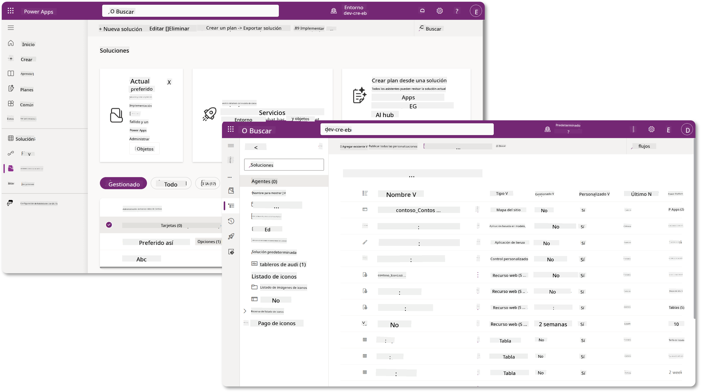

En Copilot Studio, ahora existe el **Explorador de Soluciones**, donde puedes gestionar tus soluciones directamente. Ya no necesitas cambiar al portal de creación de Power Apps para gestionar tus soluciones, ahora puedes hacerlo directamente dentro de Copilot Studio 🪄

Esto significa que puedes realizar las tareas habituales relacionadas con soluciones:

- **Crear una solución**: las soluciones personalizadas permiten que los agentes se exporten e importen entre entornos.
- **Establecer tu solución preferida**: elige la solución en la que se crearán por defecto los agentes, aplicaciones, etc.
- **Agregar o eliminar componentes**: tu agente podría estar haciendo referencia a otros componentes como variables de entorno o flujos en la nube. Por lo tanto, estos componentes deben incluirse en la solución.
- **Exportar soluciones**: para mover soluciones a otro entorno objetivo.
- **Importar soluciones**: importar soluciones creadas en otro lugar, incluyendo actualizaciones o mejoras de soluciones.
- **Crear y gestionar pipelines de soluciones**: automatizar la implementación de soluciones entre entornos.
- **Integración con Git**: permite a los desarrolladores conectar soluciones con repositorios Git para control de versiones, colaboración y ALM. Está destinado a ser utilizado solo en entornos de desarrollo.

   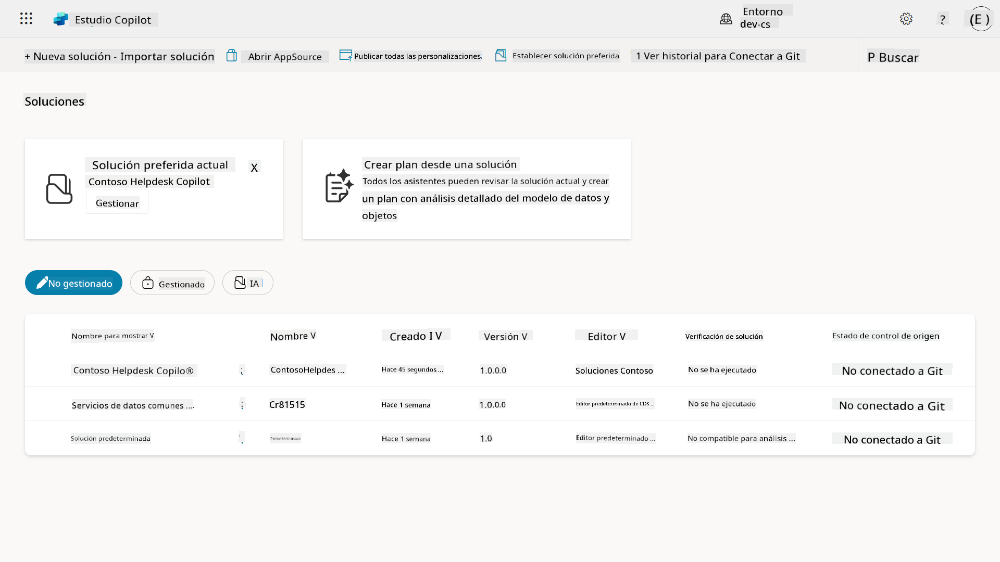

Hay dos tipos de soluciones:

- **Soluciones no gestionadas**: utilizadas durante el desarrollo. Puedes editarlas y personalizarlas libremente según sea necesario.
- **Soluciones gestionadas**: utilizadas cuando estás listo para implementar tu aplicación en pruebas o producción. Estas están bloqueadas para evitar cambios accidentales.

## 🤔 ¿Por qué _debería_ usar una Solución para mi agente?

Piensa en las Soluciones como una _caja de herramientas_. Cuando necesitas arreglar o construir algo (un agente) en una ubicación diferente (entorno), reúnes todas las herramientas necesarias (componentes) y las colocas en tu caja de herramientas (Solución). Luego puedes llevar esta caja de herramientas a la nueva ubicación (entorno) y usar las herramientas (componentes) para completar tu trabajo, o agregar nuevas herramientas (componentes) para personalizar tu agente o proyecto que estás construyendo.

!!! quote "Elaiza, tu amigable defensora de la nube entrando aquí 🙋🏻‍♀️ para compartir algunas palabras:"
    Tenemos un dicho en Nueva Zelanda, "¡Sé un Kiwi ordenado!" que es un llamado a la acción para los neozelandeses 🥝 para que se responsabilicen de su entorno desechando la basura adecuadamente y manteniendo los espacios públicos limpios. Podemos usar el mismo contexto para los agentes manteniendo todo lo relacionado con tu agente organizado y portátil, y te ayudará a mantener un entorno ordenado.

Es una buena práctica crear un agente en una solución dedicada en tu entorno fuente (desarrollador). Aquí está el porqué las soluciones son valiosas:

🧩 **Desarrollo organizado**

- Mantienes tu agente separado de la solución predeterminada que contiene todo en el entorno. Todos los componentes de tu agente están en un solo lugar 🎯

- Todo lo que necesitas para tu agente está en una solución, lo que facilita exportarlo e importarlo a un entorno objetivo 👉🏻 esto es un hábito saludable de ALM.

🧩 **Implementación segura**

- Puedes exportar tu aplicación o agente como una solución gestionada e implementarla en otros entornos objetivo (como pruebas o producción) sin riesgo de ediciones accidentales.

🧩 **Control de versiones**

- Puedes crear parches (correcciones específicas), actualizaciones (un cambio más completo) o mejoras (reemplazar una solución, generalmente cambios importantes e introducción de nuevas características).

- Te ayuda a implementar cambios de manera controlada.

🧩 **Gestión de dependencias**

- Las soluciones rastrean qué partes dependen de otras. Esto evita que rompas cosas cuando haces cambios.

🧩 **Colaboración en equipo**

- Los desarrolladores y creadores pueden trabajar juntos usando soluciones no gestionadas en desarrollo, y luego entregar una solución gestionada para la implementación.

## 🪪 Comprender los Publicadores de Soluciones

Un Publicador de Soluciones en Power Platform es como una etiqueta o marca que identifica quién creó o posee una solución. Es una parte pequeña pero importante de la gestión de tus aplicaciones, agentes y personalizaciones de flujos, especialmente cuando trabajas en equipos o entre entornos.

Cuando creas una solución, debes elegir un publicador. Este publicador define:

- Un prefijo que se agrega a todos los componentes personalizados (piensa en tablas, campos y flujos).

- Un nombre e información de contacto para la organización o persona que posee la solución.

### 🤔 ¿Por qué es importante?

1. **Identificación fácil**: el prefijo (Ejemplo - `new_` o `abc_`) te ayuda a identificar rápidamente qué componentes pertenecen a qué solución o equipo.

1. **Evita conflictos**: si dos equipos crean una columna llamada estado, sus prefijos (`teamA_status`, `teamB_status`) evitan colisiones de nombres.

1. **Apoya ALM**: al mover soluciones entre entornos (Desarrollo → Pruebas → Producción), el publicador ayuda a rastrear la propiedad y mantener la consistencia.

### ✨ Ejemplo

Supongamos que creas un publicador llamado Contoso Solutions con el prefijo `cts_`.

Si agregas una columna personalizada llamada _Prioridad_, se almacenará como `cts_Prioridad` en la solución.

Cualquiera que encuentre la columna a nivel de solución, independientemente del entorno en el que se encuentre, podrá identificar fácilmente que es una columna asociada a Contoso Solutions.

## 🧭 Ciclo de vida de la Solución en Power Platform

Ahora que entiendes el propósito de una Solución, aprendamos sobre el ciclo de vida.

**1. Crear Solución en el entorno de Desarrollo**: comienza creando una nueva solución en tu entorno de Desarrollo.

**2. Agregar Componentes**: agrega aplicaciones, flujos, tablas y otros elementos a tu solución.

**3. Exportar como solución Gestionada**: empaqueta tu solución para la implementación exportándola como una solución Gestionada.

**4. Importar al entorno de Pruebas**: prueba tu solución en un entorno de Pruebas separado para asegurarte de que todo funcione como se espera.

**5. Importar al entorno de Producción**: implementa la solución probada en tu entorno de Producción en vivo.

**6. Aplicar Parches, Actualizaciones o Mejoras**: realiza mejoras o correcciones usando parches, actualizaciones o mejoras. 🔁 ¡Repite el ciclo!

### ✨ Ejemplo

Imagina que estás construyendo un agente de mesa de ayuda de TI para ayudar a los empleados con problemas como problemas de dispositivos, solución de problemas de red, configuración de impresoras y más.

- Comienzas en un entorno de Desarrollo usando una solución no gestionada.

- Una vez que esté listo, lo exportas como una solución gestionada y lo importas a un entorno objetivo como un entorno de Pruebas del Sistema o Pruebas de Aceptación de Usuario (UAT).

- Después de las pruebas, lo mueves al entorno de Producción, todo sin tocar la versión original de desarrollo.

## 🧪 Laboratorio 04: Crear una nueva Solución

Ahora vamos a aprender:

- [4.1 Cómo crear un Publicador de Soluciones](../../../../../docs/recruit/04-creating-a-solution)
- [4.2 Cómo crear una Solución](../../../../../docs/recruit/04-creating-a-solution)

Vamos a seguir con el ejemplo anterior, donde vamos a crear una solución en el entorno dedicado de Copilot Studio para construir nuestro agente de mesa de ayuda de TI.

¡Comencemos!

### Prerrequisitos

#### Rol de seguridad

En Copilot Studio, lo que _puedes hacer_ en el explorador de soluciones depende de tu rol de seguridad de usuario.
Si no tienes permiso para gestionar soluciones en el centro de administración de Power Apps, tampoco podrás realizar esas tareas en Copilot Studio.

Para asegurarte de que todo funcione sin problemas, verifica que tengas los roles de seguridad y permisos adecuados. O si no gestionas entornos en tu organización, pregunta a tu administrador de TI (o el equipo equivalente) que gestiona tu tenant/entornos.

Los siguientes son los roles de seguridad que permiten a los usuarios crear una solución en su entorno.

| Rol de seguridad    | Descripción |
| ---------- | ---------- |
| Creador de Entorno | Proporciona los permisos necesarios para crear, personalizar y gestionar recursos dentro de un entorno específico, incluidas las soluciones  |
| Personalizador del Sistema  | Permisos más amplios que el Creador de Entorno, incluyendo la capacidad de personalizar el entorno y gestionar roles de seguridad |
| Administrador del Sistema   | Nivel más alto de permisos y puede gestionar todos los aspectos del entorno, incluyendo la creación y asignación de roles de seguridad     |

#### Entorno de desarrollo

Asegúrate de cambiar a tu entorno de desarrollo dedicado, consulta [Lección 00 - Configuración del Curso - Paso 3: Crear nuevo desarrollador](../00-course-setup/README.md#step-3-create-new-developer-environment).

1. En la parte superior derecha, selecciona el icono **Rueda dentada** y cambia del entorno predeterminado a tu entorno, por ejemplo, **Entorno de Adele Vance**.

    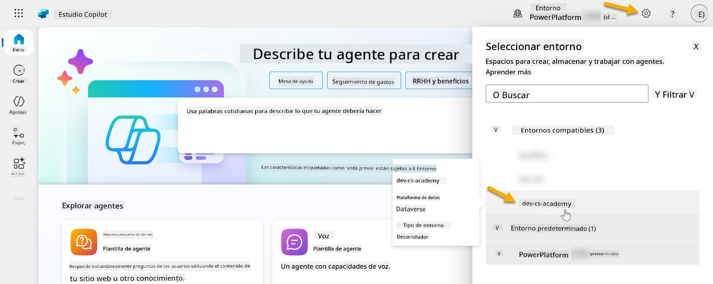

### 4.1 Crear un Publicador de Soluciones

1. Usando el mismo entorno de Copilot Studio utilizado en la lección anterior, selecciona el **icono de elipsis (. . .)** en el menú lateral izquierdo en Copilot Studio. Selecciona **Soluciones** bajo el encabezado **Explorar**.

    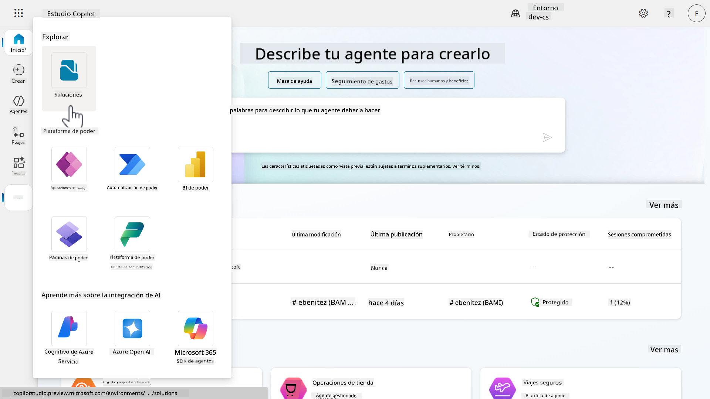

1. Se cargará el **Explorador de Soluciones** en Copilot Studio. Selecciona **+ Nueva solución**

    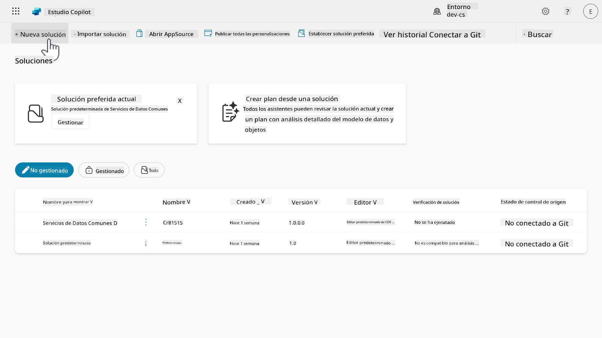

1. Aparecerá el panel **Nueva solución**, donde podemos definir los detalles de nuestra solución. Primero, necesitamos crear un nuevo publicador. Selecciona **+ Nuevo publicador**.

    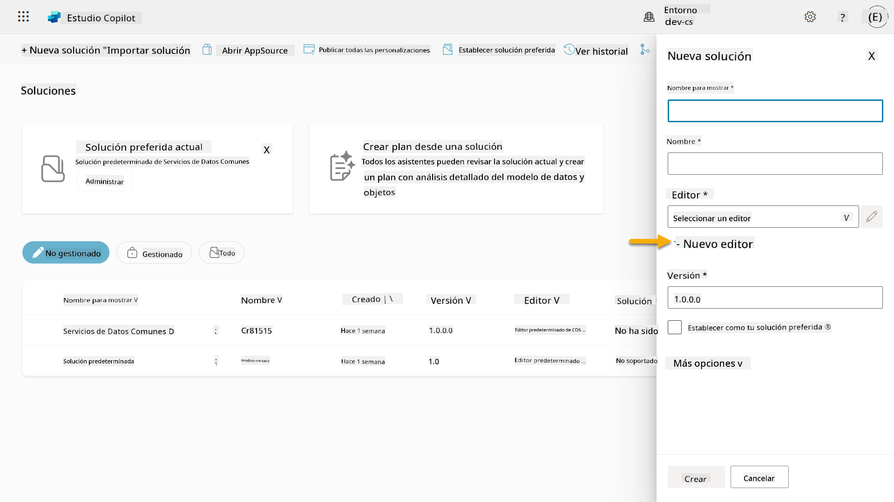  

1. Aparecerá la pestaña **Propiedades** del panel **Nuevo publicador** con campos obligatorios y no obligatorios para ser completados en la pestaña **Propiedades**. Aquí es donde podemos detallar los datos del publicador que se utilizarán como la etiqueta o marca que identifica quién creó o posee la solución.

    | Propiedad    | Descripción | Obligatorio |
    | ---------- | ---------- | :----------: |
    | Nombre para mostrar | Nombre para mostrar del publicador | Sí   |
    | Nombre  | El nombre único y el nombre de esquema para el publicador  | Sí    |
    | Descripción   | Describe el propósito de la solución    | No     |
    | Prefijo    | Prefijo del publicador que se aplicará a los componentes recién creados   | Sí      |
    | Prefijo de valor de elección   | Genera un número basado en el prefijo del publicador. Este número se utiliza cuando agregas opciones a elecciones y proporciona un indicador de qué solución se utilizó para agregar la opción.   | Sí      |

    Copia y pega lo siguiente como el **Nombre para mostrar**,

    ```text
    Contoso Solutions
    ```

    Copia y pega lo siguiente como el **Nombre**,

    ```text
    ContosoSolutions
    ```

    Copia y pega lo siguiente como la **Descripción**,

    ```text
    Copilot Studio Agent Academy
    ```

    Copia y pega lo siguiente para el **Prefijo**,

    ```text
    cts
    ```

    Por defecto, el prefijo de **Valor de elección** mostrará un valor entero. Actualiza este valor entero al millar más cercano. Por ejemplo, en mi captura de pantalla a continuación, inicialmente era `77074`. Actualízalo de `77074` a `77000`.

    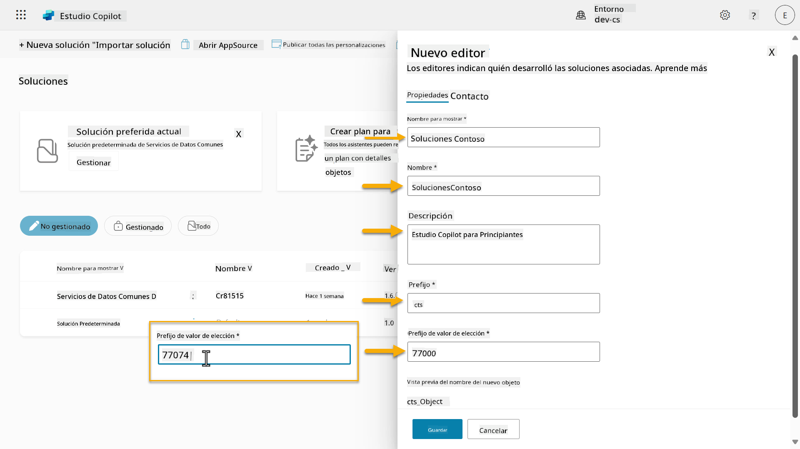  

1. Si deseas proporcionar los datos de contacto para la Solución, selecciona la pestaña **Contacto** y completa las columnas mostradas.

    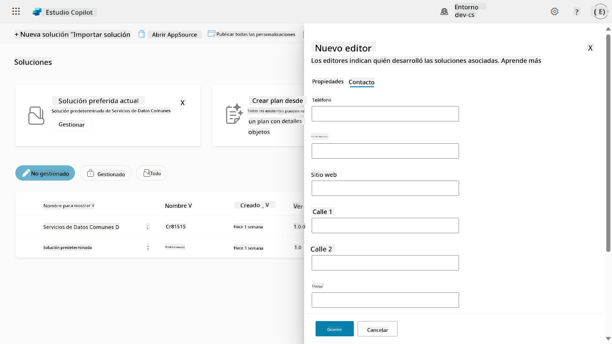

1. Selecciona la pestaña **Propiedades** y selecciona **Guardar** para crear el Publicador.

    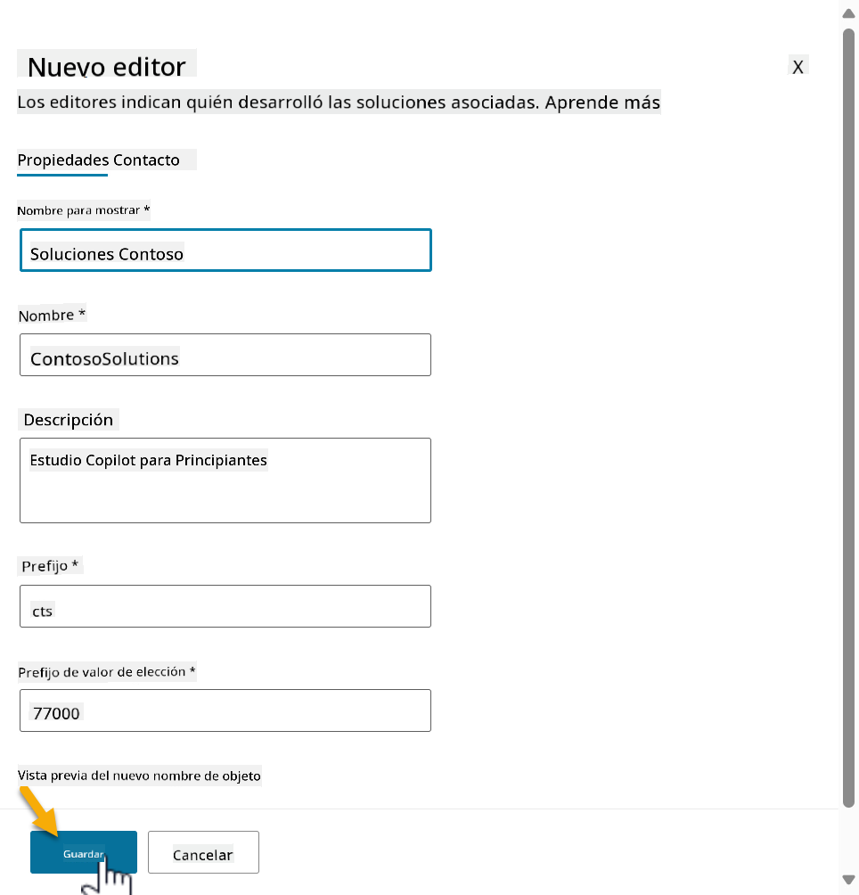
1. El panel de Nuevo editor se cerrará y regresarás al panel de **Nueva solución** con el Editor recién creado seleccionado.

    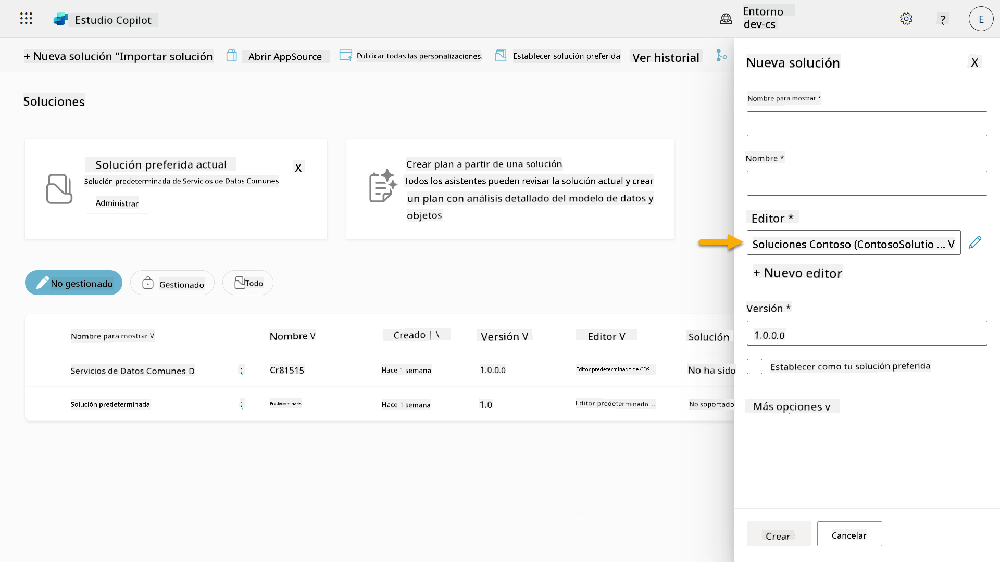  

¡Choca esos cinco, ahora has creado un Editor de Soluciones! 🙌🏻 A continuación, aprenderemos cómo crear una nueva solución personalizada.

### 4.2 Crear una nueva solución

1. Ahora que hemos creado nuestros editores, podemos completar el resto del formulario en el panel de **Nueva solución**.

    Copia y pega lo siguiente como **Nombre para mostrar**,

    ```text
    Contoso Helpdesk Agent
    ```

    Copia y pega lo siguiente como **Nombre**,

    ```text
    ContosoHelpdeskAgent
    ```

    Como estamos creando una nueva solución, el [número de **Versión**](https://learn.microsoft.com/power-apps/maker/data-platform/update-solutions#understanding-version-numbers-for-updates/?WT.mc_id=power-172615-ebenitez) por defecto será `1.0.0.0`.

    Marca la casilla **Establecer como tu solución preferida**.

      

1. Expande las **Más opciones** para ver detalles adicionales que se pueden proporcionar en una solución.

    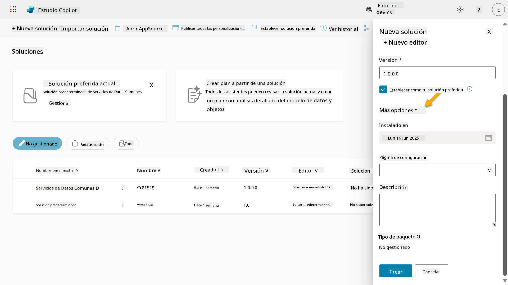

1. Verás lo siguiente:

    - **Instalado en** - la fecha en que se instaló la solución.

    - **Página de configuración** - los desarrolladores configuran un recurso web HTML para ayudar a los usuarios a interactuar con su aplicación, agente o herramienta, donde aparecerá como una página web en la sección de Información con instrucciones o botones. Se utiliza principalmente por empresas o desarrolladores que crean y comparten soluciones con otros.

    - **Descripción** - describe la solución o una descripción general de la página de configuración.

    Dejaremos estos campos en blanco para este laboratorio.

    Selecciona **Crear**.

    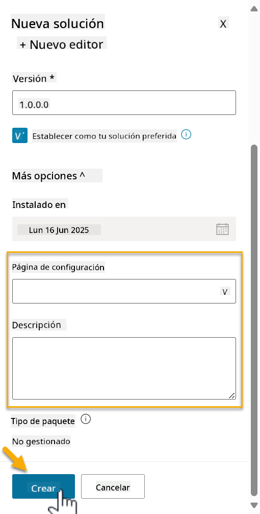

1. La solución para Contoso Helpdesk Agent ahora ha sido creada. No habrá componentes hasta que creemos un agente en Copilot Studio.

    Selecciona el ícono de **flecha hacia atrás** para regresar al Explorador de Soluciones.

    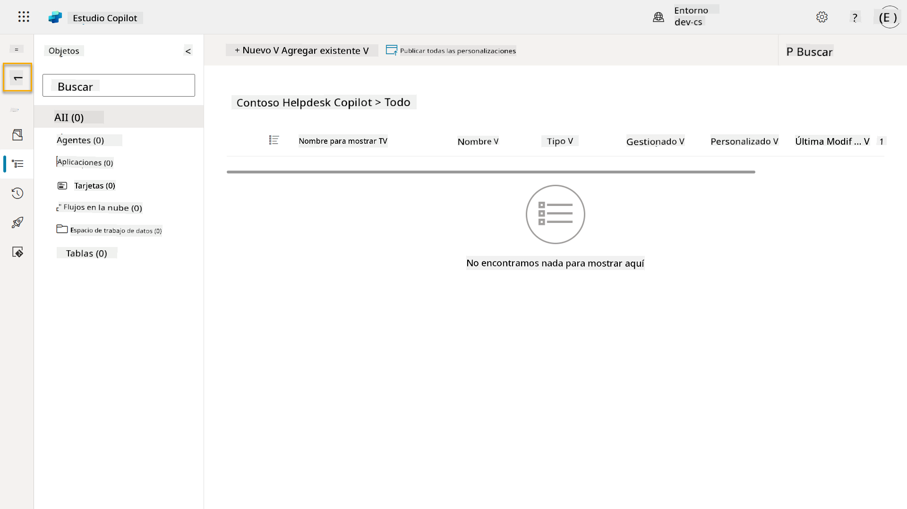

1. Observa cómo Contoso Helpdesk Agent ahora se muestra como la **Solución preferida actual** ya que marcamos la casilla **Establecer como tu solución preferida** anteriormente.

    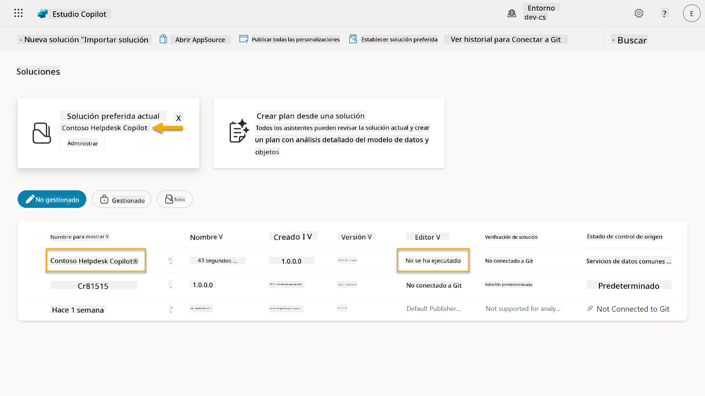

## ✅ Misión Completa

¡Felicidades! 👏🏻 Has creado un Editor y lo has utilizado en tu nueva solución para construir tu agente.

Bien hecho, creador de agentes. Una huella digital ordenada es el primer paso hacia la operabilidad a escala. Ahora tienes las herramientas y la mentalidad para un desarrollo de agentes sostenible y listo para empresas.

Este es el final de **Laboratorio 04 - Creando una solución**, selecciona el enlace a continuación para pasar a la siguiente lección. La solución creada en este laboratorio se utilizará en el laboratorio de la próxima lección.

⏭️ [Ir a la lección **Comienza rápidamente con agentes preconstruidos**](../05-using-prebuilt-agents/README.md)

## 📚 Recursos Tácticos

🔗 [Crear una solución](https://learn.microsoft.com/power-apps/maker/data-platform/create-solution/?WT.mc_id=power-172615-ebenitez)

🔗 [Crear y gestionar soluciones en Copilot Studio](https://learn.microsoft.com/microsoft-copilot-studio/authoring-solutions-overview/?WT.mc_id=power-172615-ebenitez)

🔗 [Compartir agentes con otros usuarios](https://learn.microsoft.com/microsoft-copilot-studio/admin-share-bots/?WT.mc_id=power-172615-ebenitez)

🔗 [Resumen de recursos disponibles para roles de seguridad predefinidos](https://learn.microsoft.com/power-platform/admin/database-security#summary-of-resources-available-to-predefined-security-roles/?WT.mc_id=power-172615-ebenitez)

🔗 [Actualizar o mejorar una solución](https://learn.microsoft.com/power-apps/maker/data-platform/update-solutions/?WT.mc_id=power-172615-ebenitez)

🔗 [Descripción general de los pipelines en Power Platform](https://learn.microsoft.com/power-platform/alm/pipelines/?WT.mc_id=power-172615-ebenitez)

🔗 [Descripción general de la integración de Git en Power Platform](https://learn.microsoft.com/power-platform/alm/git-integration/overview/?WT.mc_id=power-172615-ebenitez)

<!-- markdownlint-disable-next-line MD033 -->


---

**Descargo de responsabilidad**:  
Este documento ha sido traducido utilizando el servicio de traducción automática [Co-op Translator](https://github.com/Azure/co-op-translator). Aunque nos esforzamos por lograr precisión, tenga en cuenta que las traducciones automáticas pueden contener errores o imprecisiones. El documento original en su idioma nativo debe considerarse la fuente autorizada. Para información crítica, se recomienda una traducción profesional realizada por humanos. No nos hacemos responsables de malentendidos o interpretaciones erróneas que surjan del uso de esta traducción.