<!--
CO_OP_TRANSLATOR_METADATA:
{
  "original_hash": "8e2c64a7f9303e58329ec8bb468c80b4",
  "translation_date": "2025-10-17T18:53:24+00:00",
  "source_file": "docs/recruit/05-using-prebuilt-agents/README.md",
  "language_code": "es"
}
-->
# 🧰 Misión 05: Usando un Agente Preconstruido  

## 🕵️‍♂️ NOMBRE CLAVE: `OPERACIÓN VIAJES SEGUROS`

> **⏱️ Duración de la Operación:** `~30 minutos`

🎥 **Mira la Guía**

## 🎯 Resumen de la Misión

Bienvenido a tu próxima misión en la Academia de Agentes de Copilot Studio. Estás a punto de explorar el mundo de los **agentes preconstruidos**: agentes inteligentes y con propósito creados por Microsoft para acelerar tu implementación y reducir el tiempo necesario para obtener resultados.

En lugar de construir desde cero, los agentes preconstruidos (también llamados **plantillas de agentes**) te dan una ventaja inicial al proporcionar escenarios listos para usar que puedes personalizar e implementar en minutos.

En esta misión, desplegarás el agente **Viajes Seguros**—un agente que ayuda a tus usuarios a prepararse para viajes de negocios, entender las políticas de la empresa y simplificar la planificación.

---

## 🧭 Objetivos

Tus metas para esta misión son:

1. Entender qué son los agentes preconstruidos y por qué son importantes  
1. Desplegar la plantilla del agente **Viajes Seguros**  
1. Personalizar las respuestas y el contenido del agente  
1. Probar y publicar el agente  

---

## 🧠 ¿Qué son los Agentes Preconstruidos?

Los agentes preconstruidos son agentes de inteligencia artificial listos para usar creados por Microsoft que:

- Abordan necesidades comunes de negocios (como viajes, recursos humanos, soporte técnico)
- Incluyen temas completamente funcionales, frases de activación, instrucciones y conocimiento de muestra.
- Pueden ser editados, ampliados y adaptados con tus propios datos

Estos agentes son perfectos para comenzar rápidamente o aprender cómo están estructurados los agentes.

---

## 🧪 Laboratorio 05: Comienza rápidamente con un agente preconstruido

Ahora aprenderemos cómo seleccionar un agente preconstruido y personalizarlo.

- [5.1 Iniciar Copilot Studio](../../../../../docs/recruit/05-using-prebuilt-agents)
- [5.2 Elegir la Plantilla del Agente Viajes Seguros](../../../../../docs/recruit/05-using-prebuilt-agents)
- [5.3 Personalizar el Agente](../../../../../docs/recruit/05-using-prebuilt-agents)
- [5.4 Probar y Publicar](../../../../../docs/recruit/05-using-prebuilt-agents)

Seguiremos con el ejemplo anterior, donde crearemos una solución en el entorno dedicado de Copilot Studio para construir nuestro agente de soporte técnico.

¡Comencemos!

### 5.1 Iniciar Copilot Studio

1. Navega a [https://copilotstudio.microsoft.com](https://copilotstudio.microsoft.com)

1. Inicia sesión con tu cuenta de trabajo o escuela de Microsoft 365

!!! warning
    Debes estar en un tenant donde Copilot Studio esté habilitado. Si no ves Copilot Studio, revisa [Misión 00](../00-course-setup/README.md) para completar tu configuración.

### 5.2 Elegir la Plantilla del Agente Viajes Seguros

1. Desde la página principal de Copilot Studio, haz clic en **+ Crear**
    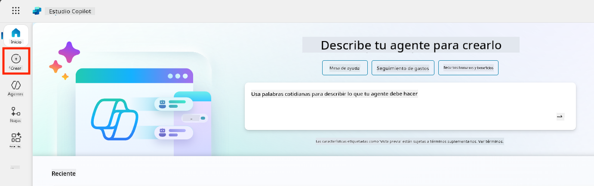

1. Desplázate hacia abajo hasta la sección **Comenzar con una plantilla de agente**

1. Encuentra y selecciona **Viajes Seguros**

    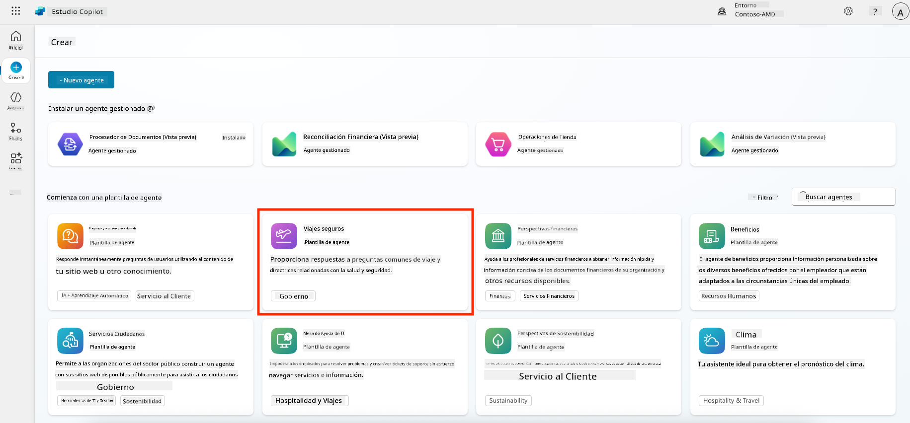

1. Observa que la plantilla viene precargada con una descripción, instrucciones y conocimiento.

    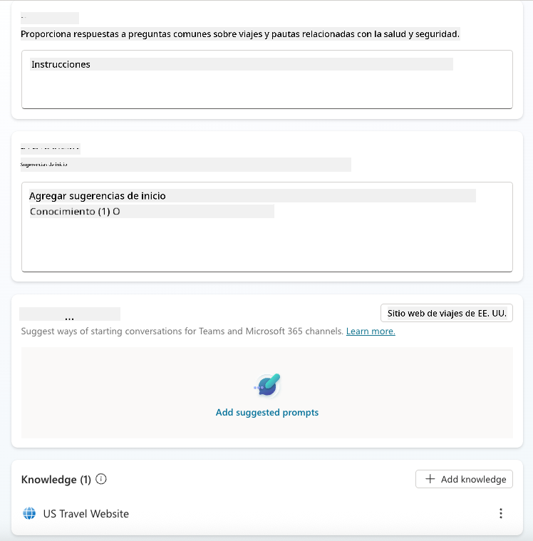

1. Haz clic en **Crear**

    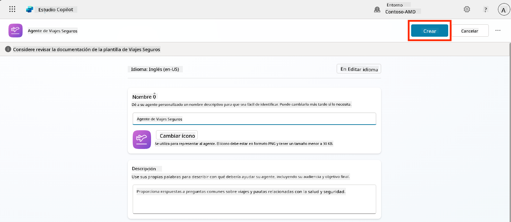

Esto creará un nuevo agente en tu entorno basado en la configuración de Viajes Seguros.

### 5.3 Personalizar el Agente

Ahora que el agente está creado, vamos a adaptarlo a tu organización:

1. Selecciona **Habilitar IA generativa** para activar la función de IA generativa y que pueda usar las instrucciones proporcionadas en la plantilla.

    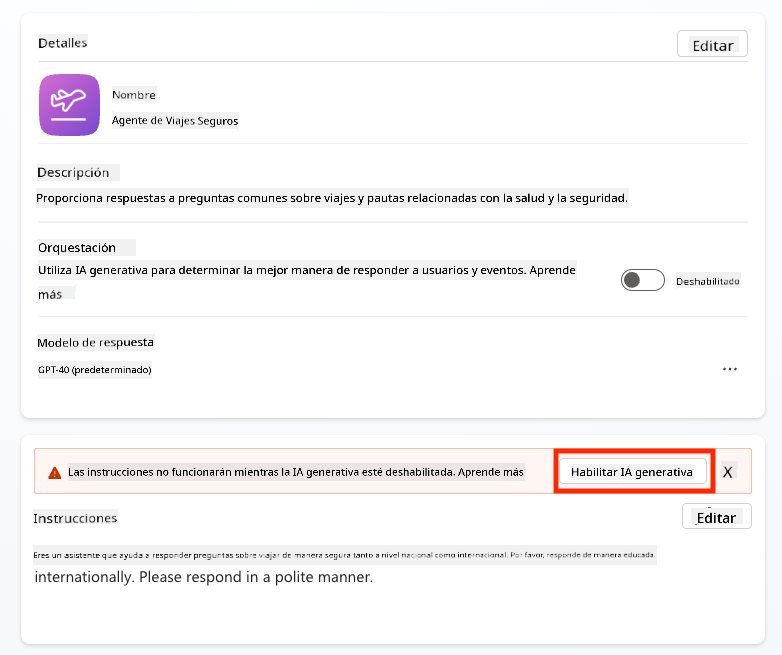

1. Ahora equiparemos al agente con una fuente de conocimiento adicional para que pueda responder preguntas sobre viajes en Europa. Para hacerlo, desplázate hacia abajo hasta la sección **conocimiento** y selecciona **Agregar conocimiento**

    

1. Selecciona **Sitios web públicos**

    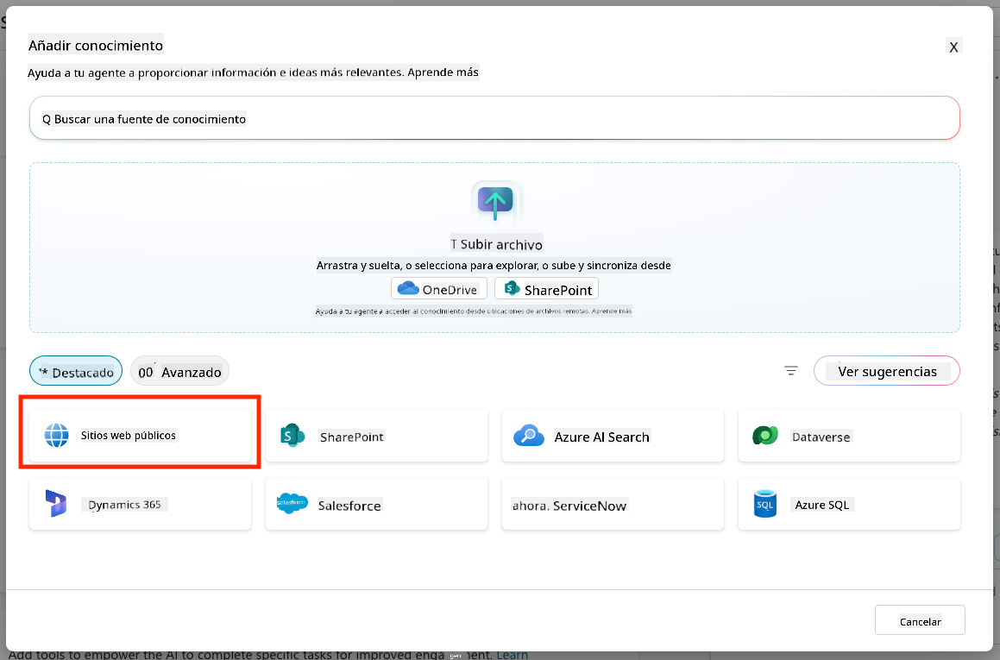

1. En el campo de texto, pega **<https://european-union.europa.eu/>** y selecciona **Agregar**

    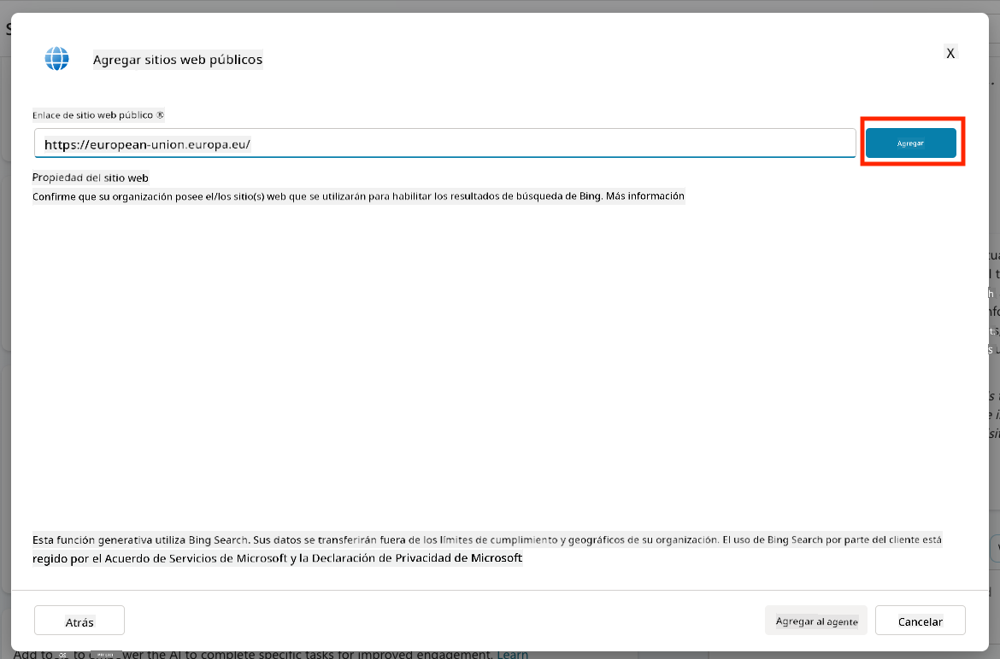

1. Selecciona **Agregar al agente**

    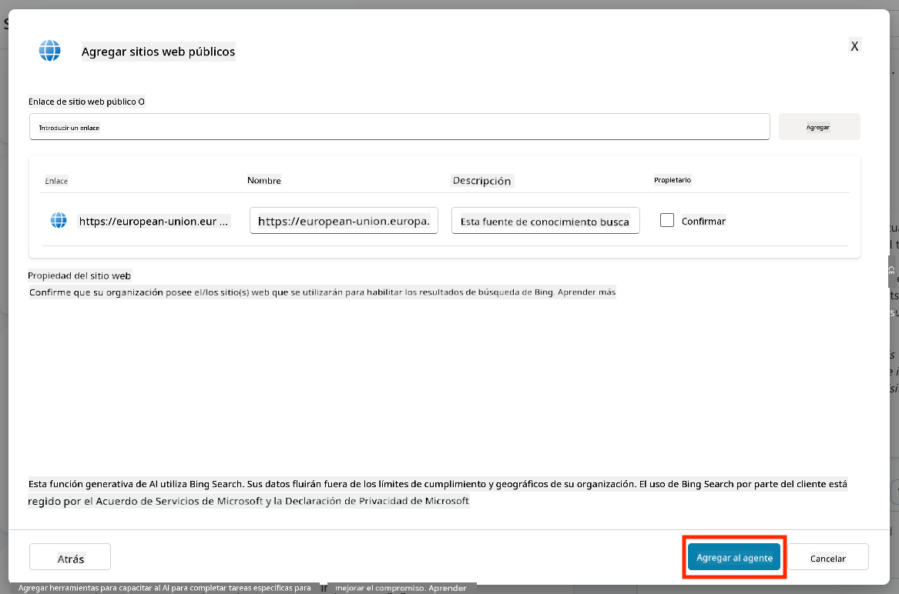

### 5.4 Probar y Publicar

1. Haz clic en **Probar** en la esquina superior derecha para abrir la ventana de prueba  

1. Prueba frases como:

    - `“¿Necesito una visa para viajar de EE.UU. a Ámsterdam?”`
    - `“¿Cuánto tiempo tarda en obtenerse un pasaporte estadounidense?”`
    - `“¿Dónde está la embajada de EE.UU. más cercana en Valencia, España?”`

1. Confirma que el agente responde con información precisa y útil, y observa el Mapa de Actividad para ver de dónde obtuvo la información.

    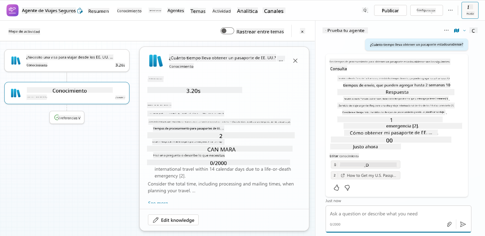

1. Cuando estés listo, haz clic en **Publicar**

    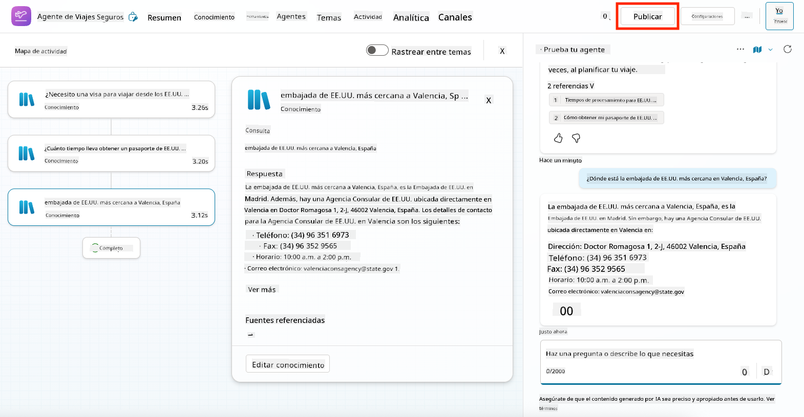

1. Selecciona **Publicar** nuevamente en el cuadro de diálogo
    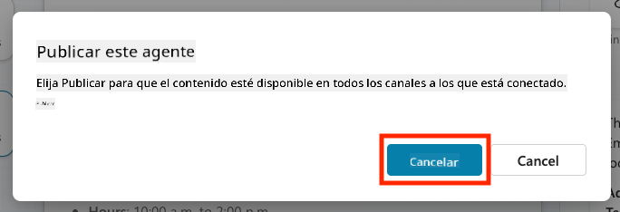

1. Opcionalmente, agrega el agente a Microsoft Teams usando la función integrada de **Canales**.

!!! note "🧳 Objetivo Adicional"
    Intenta conectar el agente Viajes Seguros con un sitio de SharePoint o un archivo de preguntas frecuentes para hacerlo más relevante a las políticas de viaje de tu empresa.

## ✅ Misión Completa

Ahora has logrado:

- Desplegar un agente preconstruido de Microsoft  
- Personalizar el agente  
- Probar y publicar tu propia versión de la plantilla del agente **Viajes Seguros**

⏭️ [Avanza a la lección **Crear un agente personalizado desde cero**](../06-create-agent-from-conversation/README.md).

<!-- markdownlint-disable-next-line MD033 -->

---

**Descargo de responsabilidad**:  
Este documento ha sido traducido utilizando el servicio de traducción automática [Co-op Translator](https://github.com/Azure/co-op-translator). Aunque nos esforzamos por lograr precisión, tenga en cuenta que las traducciones automáticas pueden contener errores o imprecisiones. El documento original en su idioma nativo debe considerarse la fuente autorizada. Para información crítica, se recomienda una traducción profesional realizada por humanos. No nos hacemos responsables de malentendidos o interpretaciones erróneas que surjan del uso de esta traducción.