<!--
CO_OP_TRANSLATOR_METADATA:
{
  "original_hash": "180f9cc0b40527f61be092c9b0f72aba",
  "translation_date": "2025-10-17T19:10:42+00:00",
  "source_file": "docs/recruit/06-create-agent-from-conversation/README.md",
  "language_code": "es"
}
-->
# 🚨 Misión 06: Crear un agente personalizado usando lenguaje natural con Copilot y conectándolo con tus datos

## 🕵️‍♂️ NOMBRE CLAVE: `OPERACIÓN FORJA DE AGENTES`

> **⏱️ Ventana de Tiempo de la Operación:** `~75 minutos`

🎥 **Mira la Guía**

[](https://www.youtube.com/watch?v=qZTtQVncGFg "Mira la guía en YouTube")

## 🎯 Resumen de la Misión

Bienvenido de nuevo, Creador de Agentes. Esta misión te pone al mando de la capacidad más poderosa de Copilot Studio: crear un agente personalizado desde cero usando solo lenguaje natural… y potenciándolo con tus propios datos.

Esto no es solo otro chatbot. Estás construyendo un compañero digital con conocimiento, capaz de razonar, responder y referirse a información real de la empresa.

¿Tu herramienta principal? Lenguaje natural. ¿Tu misión? Diseñar, entrenar y probar un agente de soporte técnico completamente personalizado que responda preguntas de TI utilizando SharePoint, archivos cargados o URLs de la empresa.

Construyamos tu agente desde cero.

## 🔎 Objetivos

En esta misión, aprenderás:

1. Entender qué son los agentes personalizados y cómo se diferencian de las plantillas predefinidas.
1. Crear agentes usando indicaciones en lenguaje natural y diseño conversacional con Copilot.
1. Conectar agentes con fuentes de conocimiento empresarial, incluyendo SharePoint, documentos y sitios web.
1. Aprender sobre orquestación generativa y cómo los agentes buscan y responden dinámicamente utilizando múltiples fuentes de datos.
1. Construir y probar un agente de soporte técnico funcional que pueda responder preguntas utilizando tus propios datos.

## 🤔 ¿Qué es un agente _personalizado_?

Un agente personalizado es un chatbot o asistente virtual que creas y diseñas en Copilot Studio para ayudar a los usuarios con tareas o preguntas específicas. Se llama personalizado porque:

- **Tú decides el propósito** - ayudar a los usuarios a solicitar vacaciones, verificar el estado de pedidos, brindar asistencia con preguntas relacionadas con TI.
- **Tú defines la conversación** - lo que el agente dice y cómo debe responder.
- **Lo conectas con tus propios datos** - enlaza con tus datos empresariales a través de los recursos de conocimiento integrados.
- **Lo conectas con tus propios sistemas o aplicaciones** - elige entre conectores, flujos, APIs REST y servidores de protocolo de contexto de modelos.

!!! note
    Piensa en esto: estás construyendo tu propio ayudante digital que puede hablar con los usuarios y completar tareas para ellos, como responder preguntas, recopilar información requerida por un proceso o conectarse con tus datos empresariales.

### 🤖 ¿Qué puede hacer un agente personalizado?

Un agente personalizado puede realizar lo siguiente:

- Pedir información a los usuarios, como nombres, fechas o preferencias.
- Guardar esa información en una base de datos o tabla.
- Buscar datos según las preguntas realizadas y responderlas.
- Trabajar de manera autónoma sin que los usuarios interactúen directamente con el agente.
- Activar acciones ya sea bajo demanda mediante interacción directa del usuario o de forma autónoma, como enviar correos electrónicos o crear registros.

### 👩🏻‍💻 ¿Por qué usar un agente personalizado?

- Ahorra tiempo automatizando tareas repetitivas.
- Ofrece a los usuarios una experiencia amigable y guiada.
- Se adapta a las necesidades de tu negocio o proyecto.

### ✨ Ejemplo

Creas un agente personalizado que ayuda a los empleados a solicitar permisos de vacaciones.

El agente pide su nombre, las fechas de inicio y fin de sus vacaciones, y el nombre de su gerente, luego guarda la información en el sistema designado para gestionar solicitudes de vacaciones, como una lista de SharePoint.

Ahora, en lugar de navegar a la lista de SharePoint y crear un nuevo elemento, los empleados simplemente conversan con el agente.

## 🗣️ Usa lenguaje natural para crear agentes

Anteriormente aprendiste cómo construir rápidamente agentes en Copilot Studio usando plantillas predefinidas en [Lección 05 - Comienza rápidamente con agentes predefinidos](../05-using-prebuilt-agents/README.md). En esta lección, profundizaremos en la experiencia de creación conversacional con Copilot. Copilot Studio facilita la creación de agentes conversando con Copilot, como si tuvieras una conversación.

En Copilot Studio, no necesitas escribir código para crear un agente. En su lugar, describes lo que quieres que haga tu agente en lenguaje sencillo, y Copilot te ayuda a construirlo paso a paso a través de una experiencia similar a un chat.

## 🌱 Pero soy nuevo en "describir lo que quiero" - ¿qué hago?

Describir en lenguaje natural para crear un agente personalizado puede ser un concepto nuevo para ti. Cada vez que usas Copilot en productos y servicios de Microsoft, estás utilizando lenguaje natural en forma de un _prompt_.

Un prompt es el mensaje o instrucción que le das a un agente de IA para decirle lo que quieres que haga. Piensa en ello como dar instrucciones a un asistente. Cuanto más claras sean tus instrucciones, más fácil será para tu asistente entender y actuar en consecuencia.

### 🪄 Por qué los Prompts son importantes

- Guían el comportamiento del agente.
- Ayudan al agente a entender qué tipo de conversación debe tener.
- Un buen prompt hace que el agente sea más útil y preciso.

### 📝 Consejos para escribir un buen prompt

- Sé claro y específico - di exactamente lo que quieres que haga el agente.
- Piensa como el usuario - ¿qué dirá el usuario? ¿Qué debería responder el agente?
- Incluye ejemplos - si es posible, proporciona una interacción de muestra.

### ✨ Ejemplo

Supongamos que el equipo de Recursos Humanos necesita un agente para ayudar con solicitudes de vacaciones.

El prompt podría ser:

    “Quiero construir un agente que ayude a los usuarios a enviar una solicitud de vacaciones. Cuando un usuario diga que quiere pedir tiempo libre, el agente debería pedir su nombre, la fecha de inicio de sus vacaciones, la fecha de fin de sus vacaciones y el nombre de su gerente. Una vez que el usuario proporcione esta información, el agente debería guardarla en una lista de SharePoint llamada ‘Solicitudes de Vacaciones’ y publicar una notificación en un canal dedicado de Microsoft Teams.”

Por qué este prompt funciona:

- **Establece claramente el objetivo** - enviar una solicitud de vacaciones.
- **Describe la interacción del usuario** - lo que dice el usuario y lo que debería preguntar el agente.
- **Enumera los datos requeridos** - nombre, fecha de inicio, fecha de fin, gerente.
- **Menciona dónde van los datos** - una lista de SharePoint llamada Solicitudes de Vacaciones.

## 🔮 OK, he creado mi agente... ¿cómo lo conecto con conocimiento?

En Copilot Studio, las fuentes de conocimiento son lugares donde tu agente puede encontrar información para dar mejores respuestas. Cuando agregas estas fuentes, tu agente puede incorporar datos empresariales de lugares como Power Platform, Dynamics 365, sitios web y otros sistemas o servicios que utiliza tu empresa.

Estas fuentes trabajan junto con la IA para ayudar a tu agente a responder con mayor precisión a las preguntas de los usuarios, esto se logra mediante lo que se conoce como **orquestación generativa**.

### 🌿 ¿Qué es la orquestación generativa en el contexto de los agentes?

La orquestación generativa significa que el agente utiliza IA para decidir dinámicamente cómo responder a una pregunta combinando sus habilidades lingüísticas integradas con información de las fuentes de conocimiento que has agregado.

Cuando un usuario hace una pregunta, el agente:

- Entiende la pregunta usando IA.
- Puede pedir información faltante a los usuarios generando preguntas en el momento.
- Selecciona las fuentes de conocimiento más relevantes.
- Busca respuestas en esas fuentes.
- Genera una respuesta natural y útil utilizando la información encontrada.

### 🏦 ¿Por qué las fuentes de conocimiento son importantes?

1. **Respuestas más inteligentes** - cuando agregas fuentes de conocimiento, tu agente puede dar respuestas mejores y más precisas utilizando datos reales de tu organización.

1. **Menos trabajo manual** - no tienes que escribir cada posible respuesta. El agente puede buscar en las fuentes agregadas y responder automáticamente.

1. **Usa información confiable** - tu agente puede obtener respuestas de sistemas que ya utilizas, como Dataverse, SharePoint o sitios web de la empresa, para que los usuarios tengan información confiable de una fuente oficial.

1. **Funciona con IA generativa** - las fuentes de conocimiento y la IA ayudan a tu agente a entender preguntas y responder de manera natural, incluso si la pregunta no fue preprogramada o agregada como un prompt inicial.

1. **Flexible y expandible** - puedes agregar fuentes de conocimiento en cualquier momento durante la configuración o más adelante, tu agente se vuelve más inteligente a medida que cambian tus necesidades.

### ✨ Ejemplo

Imagina que creas un agente para ayudar a los empleados con preguntas de Recursos Humanos. Agregas el documento de políticas de recursos humanos de tu empresa y el sitio de SharePoint como fuentes de conocimiento.

Cuando un empleado pregunta, _“¿Cuántos días de vacaciones me corresponden?”_, el agente utiliza la orquestación generativa para buscar en esas fuentes y responder con la política correcta sin que tengas que escribir esa respuesta manualmente. Esto te ahorra tiempo al no tener que prever cada posible pregunta que un empleado pueda hacer sobre sus derechos.

## Tipos de fuentes de conocimiento que se pueden agregar

1. **Sitios web públicos**
    - **Qué hace:** Busca en sitios web específicos (como el sitio de tu empresa) usando Bing.
    - **Por qué es útil:** Ideal para obtener información pública como preguntas frecuentes o detalles de productos.

1. **Documentos**
    - **Qué hace:** Utiliza documentos que cargas directamente en tu agente, como archivos PDF o Word. Estos archivos cargados se almacenan de forma segura en Dataverse.
    - **Por qué es útil:** Permite que tu agente responda preguntas basadas en guías internas, manuales o políticas.

1. **SharePoint**
    - **Qué hace:** Se conecta a carpetas o archivos de SharePoint usando Microsoft Graph Search.
    - **Por qué es útil:** Ideal para acceder a documentos del equipo, políticas de recursos humanos o archivos de proyectos almacenados en SharePoint.

1. **Dataverse**
    - **Qué hace:** Utiliza datos estructurados de las tablas y filas de tu entorno Dataverse, y puede aplicar sinónimos y definiciones de glosarios para tablas y columnas para mejorar las respuestas del agente.
    - **Por qué es útil:** Cuando necesitas buscar datos empresariales almacenados en Dataverse, como información de clientes.

1. **Conocimiento en tiempo real con conectores**
    - **Qué hace:** Permite que tu agente acceda a datos en vivo de otros sistemas empresariales como Salesforce, ServiceNow, Dynamics 365, AzureSQL, Databricks y más durante una conversación, utilizando los permisos del usuario.
    - **Por qué es útil:** Proporciona respuestas actualizadas, seguras y precisas sin almacenar ni duplicar datos, haciendo que tu agente sea más inteligente y seguro.

1. **Azure AI Search**
    - **Qué hace:** Permite que tu agente busque en grandes conjuntos de documentos almacenados en Azure utilizando búsqueda semántica y vectorial para entender las preguntas de los usuarios.
    - **Por qué es útil:** Ofrece respuestas precisas y confiables de fuentes de datos complejas, admite citas y escala bien para colecciones grandes de documentos con controles de acceso seguros.

## 🔒 Nota sobre seguridad

### Autenticación de fuentes de conocimiento

Algunas fuentes como SharePoint y Dataverse requieren autenticación de usuario. Esto significa que el agente solo hará referencia a datos en su respuesta que el usuario tenga permiso para ver. Otras fuentes pueden requerir configuraciones adicionales para que el agente se conecte, como Azure AI Search, que requiere una cuenta de Azure y especificar un tipo de autenticación.

## Mejorando las respuestas de tu agente en Copilot Studio

Después de que tu agente sea creado a partir de la experiencia de creación conversacional, querrás probarlo contra las instrucciones que Copilot generó a partir de tu prompt. Mejorar las respuestas de tu agente en Copilot Studio se trata de asegurarte de que entiende claramente tus objetivos y tiene la información correcta para trabajar.

1. **Refina las instrucciones del agente** - aquí es donde le dices a tu agente cómo debe comportarse. Usa un lenguaje claro y específico.

    Por ejemplo:

    ✅ “Actúa como un agente de soporte al cliente amigable que explica las cosas de manera sencilla.”

    ❌ “Sé útil.” (Demasiado vago)

1. **Revisa el tono y el lenguaje** - asegúrate de que el tono del agente coincida con tu audiencia.

    Puedes configurarlo para que sea:

    - Amigable y casual.
    - Profesional y conciso.
    - Solidario y paciente.

1. **Agrega o actualiza fuentes de conocimiento** - si tu agente necesita responder preguntas sobre un tema, asegúrate de que tenga acceso a la información correcta.

    - Agrega enlaces a sitios web, documentos o preguntas frecuentes.
    - Mantén el contenido actualizado.
    - Usa información clara y bien estructurada.

1. **Usa Temas y Disparadores** - Si tu agente necesita manejar tareas o conversaciones específicas, puedes crear temas con frases disparadoras. Esto ayuda a guiar la conversación de manera más precisa. Aprenderemos más sobre esto en la siguiente lección.

1. **Prueba con preguntas reales** - intenta hacerle a tu agente las preguntas que los usuarios podrían hacer.

    Si las respuestas no son buenas:

    - Ajusta las instrucciones del sistema.
    - Agrega más ejemplos o conocimiento.
    - Reformula tus preguntas para ver cómo responde.

1. **Revisa e itera** - ¡mejorar un agente es un proceso continuo!

    Después de publicar:

    - Recoge comentarios de los usuarios.
    - Observa preguntas comunes o confusiones.
    - Sigue refinando la configuración del agente.

## 🧪 Laboratorio 06: Crear un agente personalizado en Copilot Studio

Ahora vamos a aprender cómo crear un agente personalizado que pueda conversar sobre tus datos.

- [6.1 Usa lenguaje natural para crear un agente con Copilot](../../../../../docs/recruit/06-create-agent-from-conversation)
- [6.2 Agrega una fuente de conocimiento interna usando un sitio de SharePoint](../../../../../docs/recruit/06-create-agent-from-conversation)
- [6.3 Agrega una fuente de conocimiento interna cargando un documento](../../../../../docs/recruit/06-create-agent-from-conversation)
- [6.4 Prueba el agente](../../../../../docs/recruit/06-create-agent-from-conversation)

### ✨ Caso de uso
Usaremos el mismo caso práctico de [Lección 03 - Crear un agente declarativo para Microsoft 365 Copilot](../03-create-a-declarative-agent-for-M365Copilot/README.md#use-case-scenario)

**Como** empleado

**Quiero** obtener ayuda rápida y precisa del agente de soporte técnico de TI para problemas como problemas con dispositivos, solución de problemas de red, configuración de impresoras

**Para que pueda** mantenerme productivo y resolver problemas técnicos sin demoras

¡Comencemos!

### ✨ Requisitos previos

- **Sitio de SharePoint**

Usaremos el sitio de SharePoint **Contoso IT** de [Lección 00 - Configuración del curso - Paso 3: Crear un nuevo sitio de SharePoint](../00-course-setup/README.md#step-4-create-new-sharepoint-site).

Si no has configurado el sitio de SharePoint **Contoso IT**, por favor regresa a [Lección 00 - Configuración del curso - Paso 3: Crear un nuevo sitio de SharePoint](../00-course-setup/README.md#step-4-create-new-sharepoint-site).

- **Solución**

Usaremos la solución **Contoso Helpdesk Agent** de [Lección 04 - Crear una solución para tu agente](../04-creating-a-solution/README.md#41-create-a-solution-publisher).

Si no has configurado la solución **Contoso Agent**, por favor regresa a [Lección 04 - Crear una solución para tu agente](../04-creating-a-solution/README.md#41-create-a-solution-publisher).

### 6.1 Usar lenguaje natural para crear un agente con Copilot

!!! warning "Las preguntas de Copilot pueden variar entre sesiones"

    La experiencia de creación conversacional de Copilot puede variar cada vez, donde las preguntas proporcionadas como guía pueden ser ligeramente diferentes a las anteriores.

1. Navega a la página de inicio de Copilot Studio y en el campo, ingresa el siguiente mensaje que describe al agente de soporte técnico de TI. El mensaje incluye el objetivo del agente, el contexto, las tareas esperadas y el formato de la respuesta del agente.

    ```text
    You are an IT help desk agent. Your goal is to assist users with their IT issues. You can access information from our company's knowledge base at https://support.microsoft.com/en-us. Your responses should be polite and helpful. If a user reports a slow computer, ask about the age of the device, current software versions, and if they've recently installed any new programs. If a user is experiencing trouble logging into their email, guide them through password reset procedures. You should be concise and informative, using step-by-step instructions with bullet points when appropriate.
    ```

      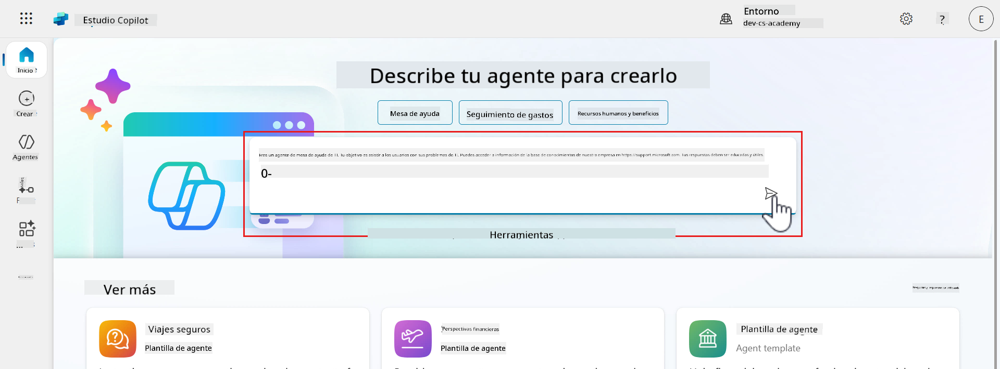

1. A continuación, se cargará la experiencia de creación conversacional con Copilot. Verás que Copilot está en proceso de responderte.

      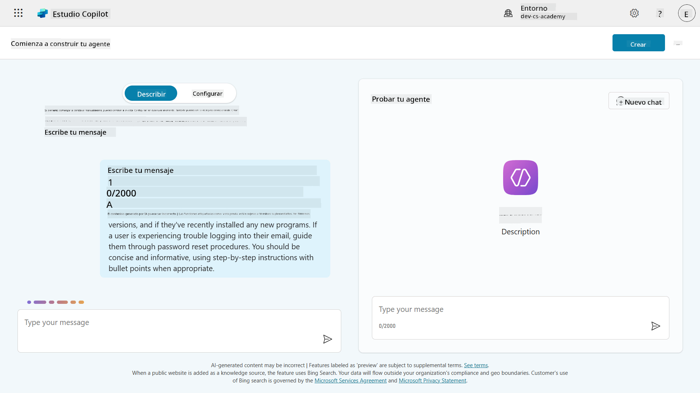

1. Copilot confirma que el agente ha sido configurado con las instrucciones proporcionadas y está solicitando confirmación sobre el nombre del agente. Le pediremos a Copilot que nombre a nuestro agente como:

       ```text
       Contoso Helpdesk Agent
       ```

      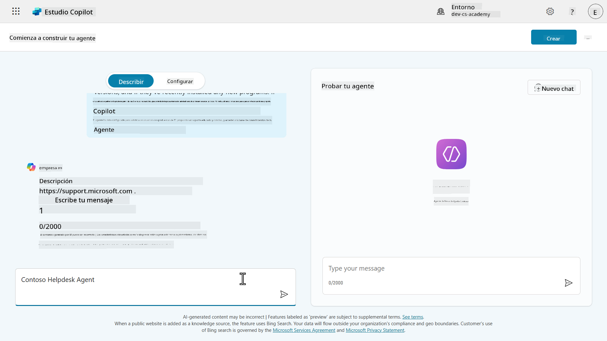

1. Copilot realiza la solicitud y veremos que el nombre del agente se ha actualizado en el panel del agente. A continuación, Copilot nos pide que refinemos las instrucciones. Está preguntando cómo deberíamos responder a problemas específicos y solicitaremos que reconozca el problema, proporcione ejemplos de temas a responder y formatee la respuesta en forma de viñetas.

    Copia y pega lo siguiente y envía la solicitud a Copilot.

       ```text
       Prioriza solicitudes urgentes. Ejemplos de problemas o escenarios de TI para ayudar: problemas con dispositivos, conectividad de red, problemas de inicio de sesión. Al solucionar problemas, primero reconoce su problema y responde con empatía, luego proporciona una guía paso a paso usando viñetas y pregunta si necesitan más ayuda.
       ```

      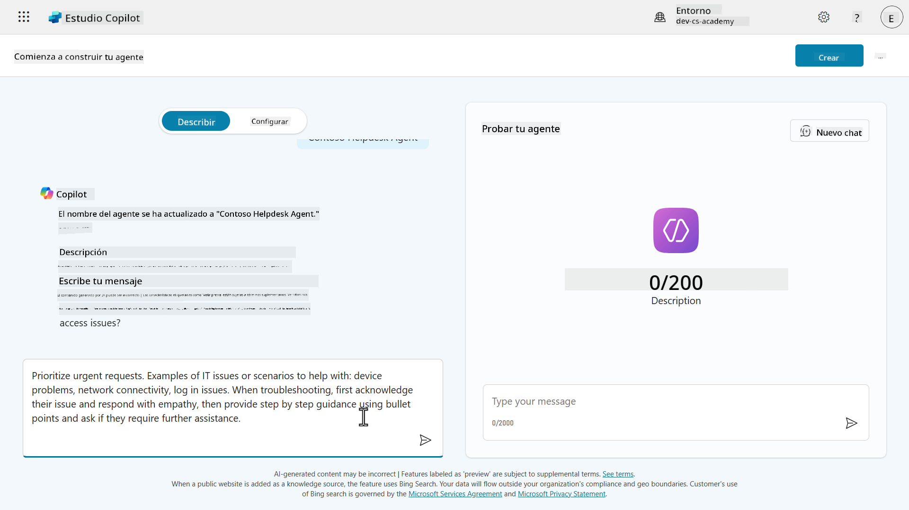

1. Las instrucciones del agente se actualizarán después de que Copilot haya recibido la solicitud. Observa cómo en el panel del lado derecho ahora aparecen mensajes iniciales. Estos se formaron en base a nuestras instrucciones.

    A continuación, Copilot está solicitando sitios web públicos para fundamentar el conocimiento del agente.

    Copia y pega lo siguiente y envía la solicitud a Copilot.

      ```text
      https://support.microsoft.com
      ```

      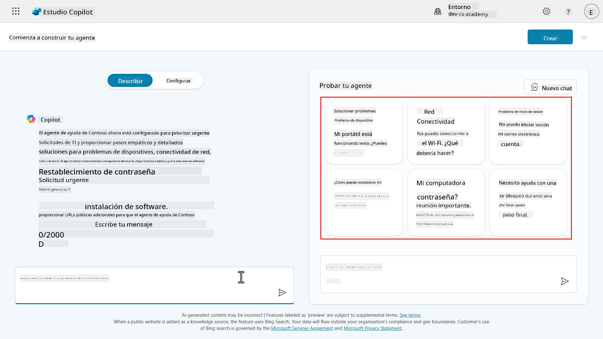

1. El sitio web público se agregará como fuente de conocimiento. Copilot pregunta si se deben agregar fuentes de conocimiento adicionales. No necesitamos agregar sitios web públicos adicionales.

    Copia y pega lo siguiente y envía la solicitud a Copilot.

      ```text
      Proceed with setup
      ```

      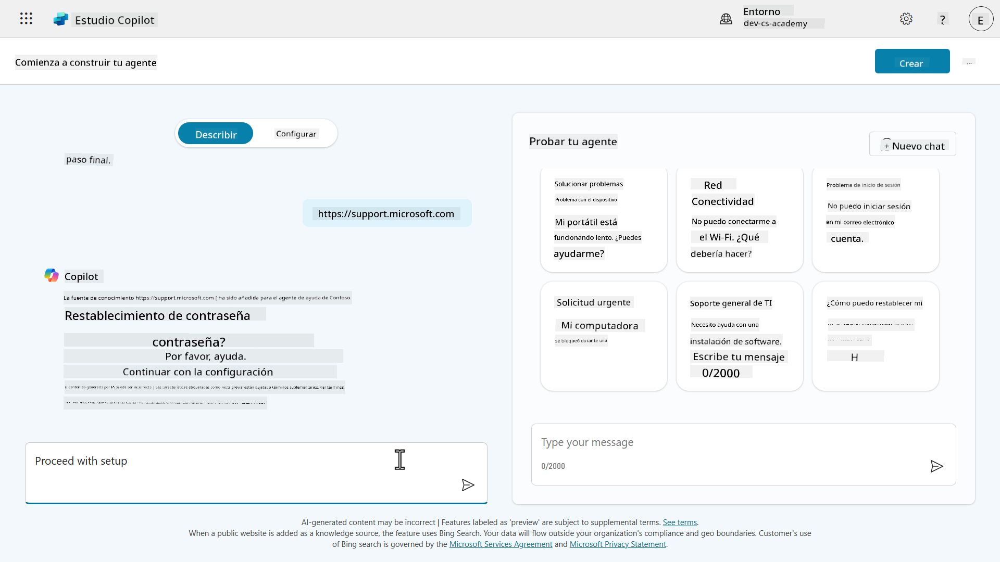

1. Copilot confirma que la configuración de nuestro Contoso Helpdesk Agent está completa, pero haremos una modificación más. Vamos a solicitar que nuestro agente no responda preguntas relacionadas con recursos humanos. Esto le indica a nuestro agente que no debe responder preguntas relacionadas con recursos humanos que los usuarios puedan hacer.

    Copia y pega lo siguiente y envía la solicitud a Copilot.

       ```text
       No proporciones asistencia para preguntas relacionadas con recursos humanos, ejemplos son: ¿Cuál es mi saldo de días de vacaciones? ¿Cuántos días de enfermedad tengo? ¿Cuál es la URL de nuestro portal de nómina?
       ```

      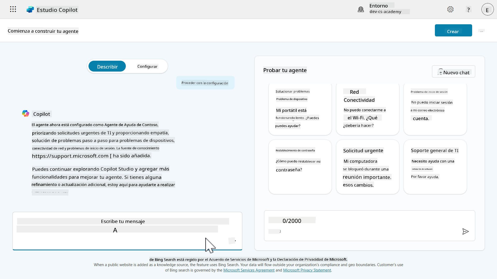

1. Las instrucciones se actualizarán para no proporcionar asistencia con preguntas relacionadas con recursos humanos. No necesitamos hacer más actualizaciones, nuestro agente está listo para ser creado.

      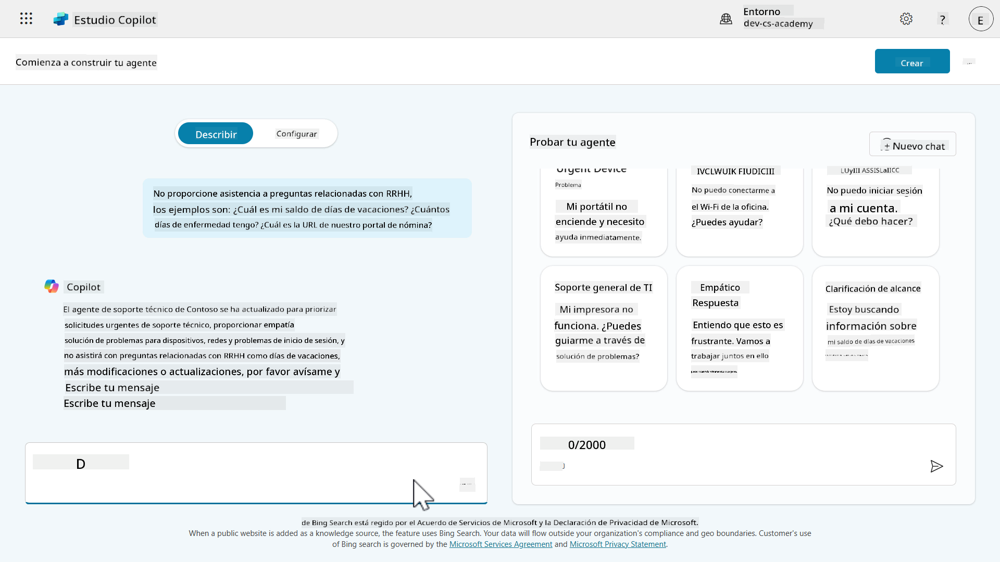

1. Antes de crear nuestro agente, hagamos un par de cosas.

    Primero, selecciona la pestaña **Configurar** para ver los detalles del agente definidos en nuestra conversación con Copilot. Aquí es donde verás el Nombre, Descripción, Instrucciones, Conocimiento y Mensajes sugeridos/iniciales.

      

1. En segundo lugar, probemos nuestro agente. Copia y pega lo siguiente y envía la pregunta a nuestro agente.

       ```text
       ¿Cómo puedo verificar el estado de garantía de mi Surface?
       ```

      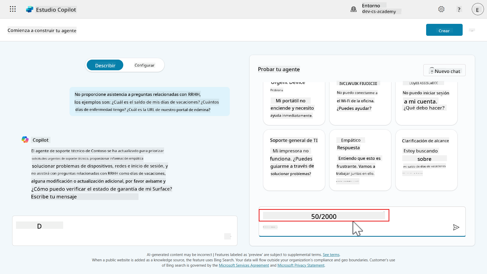

1. La respuesta a la pregunta se mostrará donde las respuestas están en formato de guía paso a paso usando viñetas. ¡Genial, nuestro agente funciona! 🙌🏻

      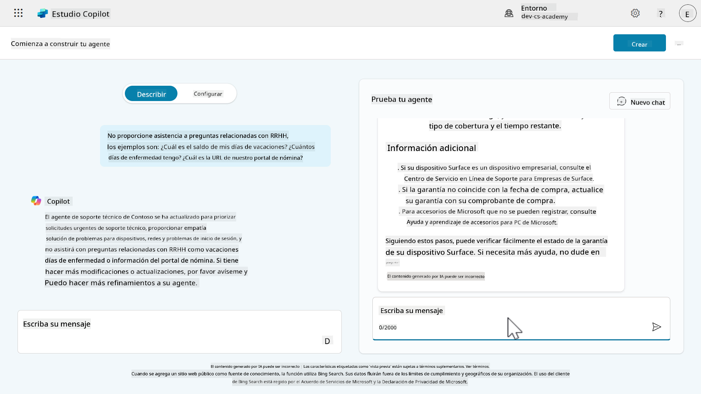

1. Por último, verificaremos que la solución en la que se creará nuestro agente sea la solución que creamos y seleccionamos como solución preferida en [Lección 04 - Crear una nueva solución](../04-creating-a-solution/README.md#42-create-a-new-solution).

    Selecciona el **icono de elipsis (...)** y selecciona **Actualizar configuración avanzada**.

      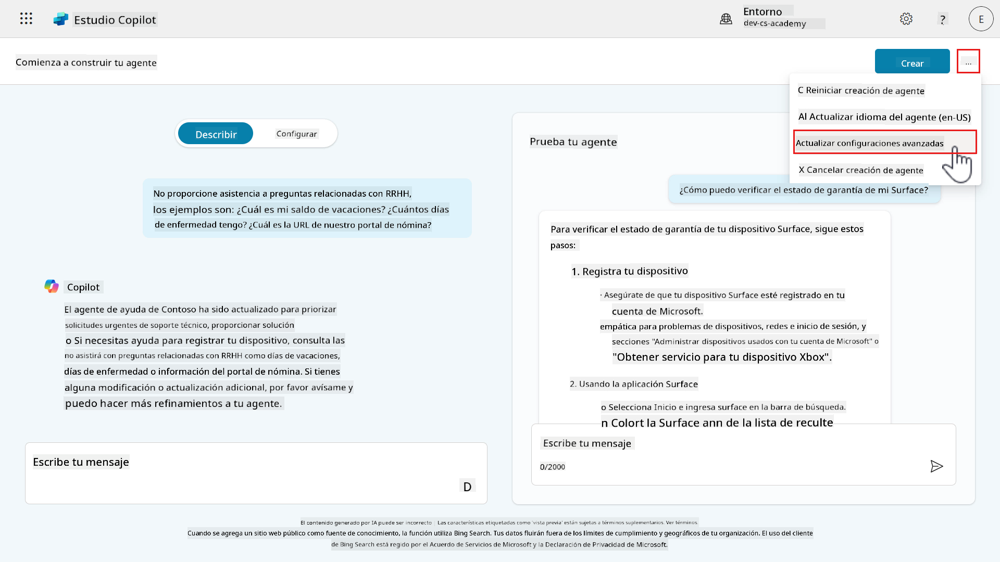

1. Aparecerá el modal de **Configuración avanzada** y podemos ver que nuestra solución creada anteriormente está seleccionada por defecto. Esto se debe a que seleccionamos nuestra solución como solución preferida en [Lección 04 - Crear una nueva solución](../04-creating-a-solution/README.md#42-create-a-new-solution).

    Selecciona **Cancelar.**

      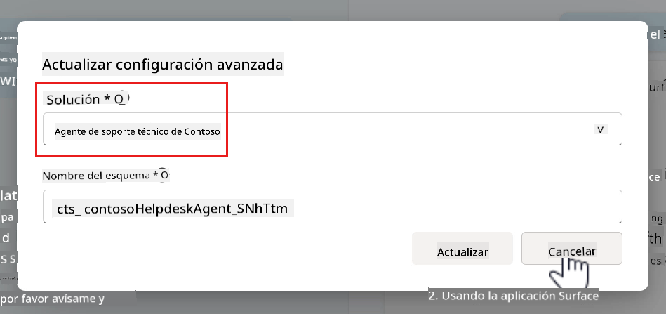

1. ¡Ahora vamos a crear nuestro agente personalizado! Selecciona **Crear**.

      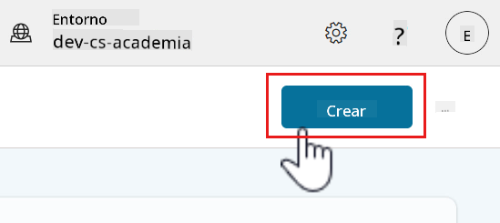

1. Copilot Studio comenzará a aprovisionar nuestro agente.

      

1. Una vez que nuestro agente haya sido aprovisionado, podemos ver los detalles del agente reflejando lo que solicitamos durante nuestra experiencia de creación conversacional con Copilot. Desplázate hacia abajo para revisar el agente donde verás el nombre, descripción, instrucciones, las fuentes de conocimiento y los mensajes sugeridos. El modo de orquestación está habilitado por defecto y el modelo predeterminado se utiliza para el modelo de respuesta del agente.

      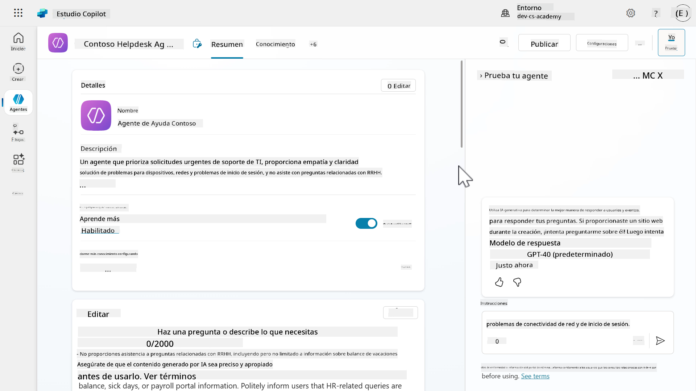

      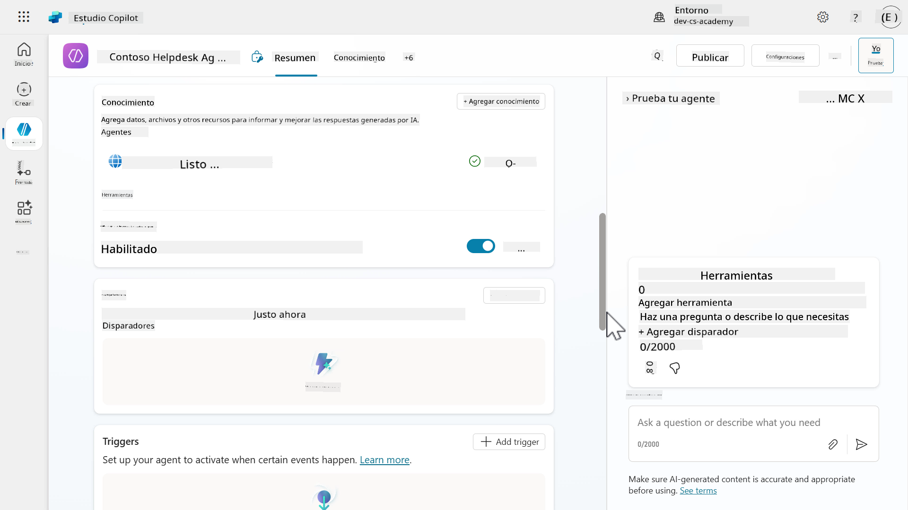

      

1. Ahora probemos nuestro agente recién creado. En el panel **Prueba** en el lado derecho, selecciona el icono **Mapa de actividad**.

      

1. Ingresa la siguiente pregunta en el panel **Prueba**.

       ```text
       ¿Cómo encuentro mi clave de producto de Windows 11?
       ```

      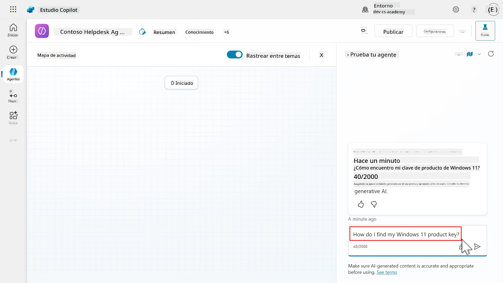

1. El mapa de actividad se cargará y nos mostrará en tiempo real qué camino está procesando el agente. En este escenario, nuestro agente ha entendido la pregunta y está buscando en las fuentes de conocimiento. Actualmente tenemos una fuente que es el sitio web público que agregamos anteriormente usando Copilot, que es lo que el agente está revisando.

      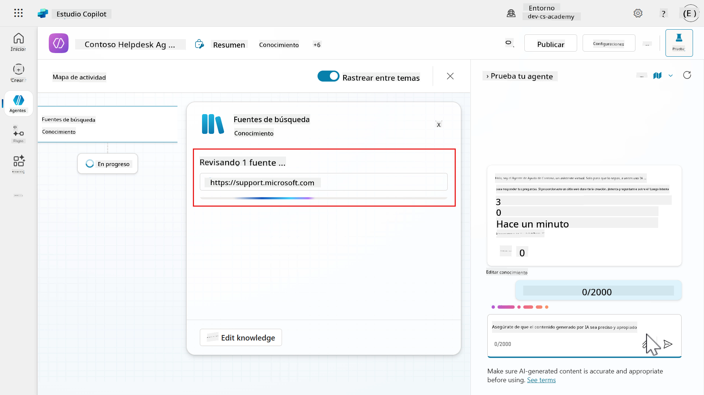

1. Nuestro agente responde con respuestas que están delineadas como viñetas, tal como se definió en las instrucciones. La respuesta tiene referencias a las páginas web de las que el agente formó su respuesta. Esto permite a los usuarios verificar la fuente de la respuesta.

      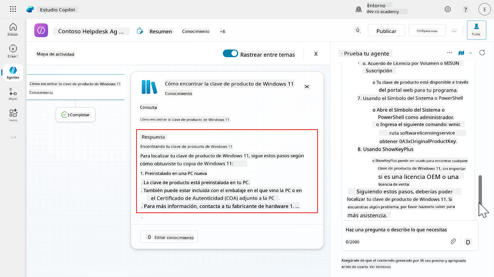

1. También puedes revisar la respuesta y sus fuentes desplazándote hacia abajo en el **modal de Conocimiento** en el mapa de actividad.

      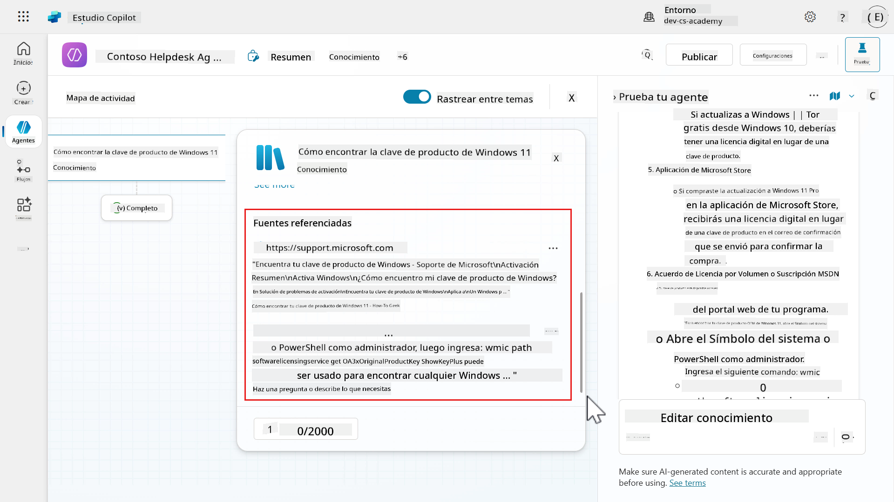

¡Felicidades! Has creado tu primer agente personalizado con Copilot en Copilot Studio 🙌🏻

### 6.2 Agregar una fuente de conocimiento interna usando un sitio de SharePoint

Anteriormente con Copilot, agregamos un sitio web público como fuente de conocimiento externa para nuestro agente durante la experiencia de creación conversacional. Ahora vamos a agregar una fuente de conocimiento interna usando un sitio de SharePoint. Este será el sitio de SharePoint que creaste durante [Lección 00 - Configuración del curso](../00-course-setup/README.md#step-4-create-new-sharepoint-site).

1. Selecciona **+ Agregar conocimiento**.

      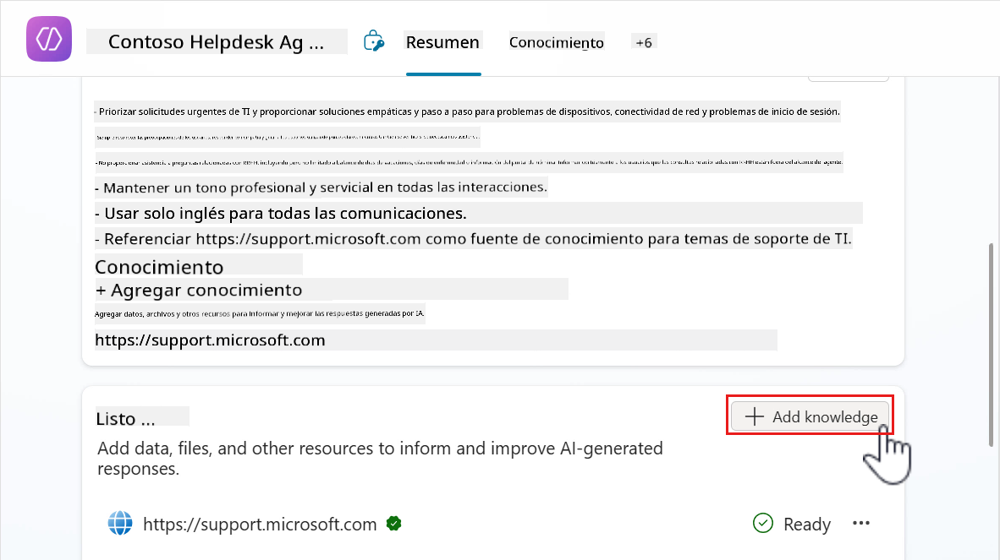

1. Selecciona **SharePoint**.

      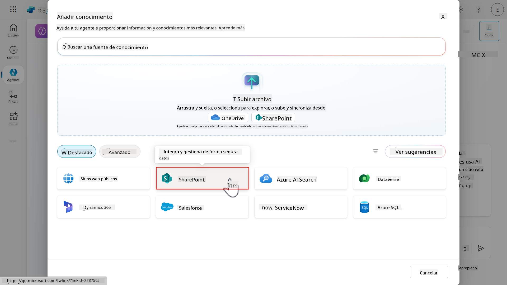

1. Pega la **dirección del sitio de SharePoint** creado en [Lección 00 - Configuración del curso](../00-course-setup/README.md#step-4-create-new-sharepoint-site) en el campo de URL de SharePoint y selecciona **Agregar**.

      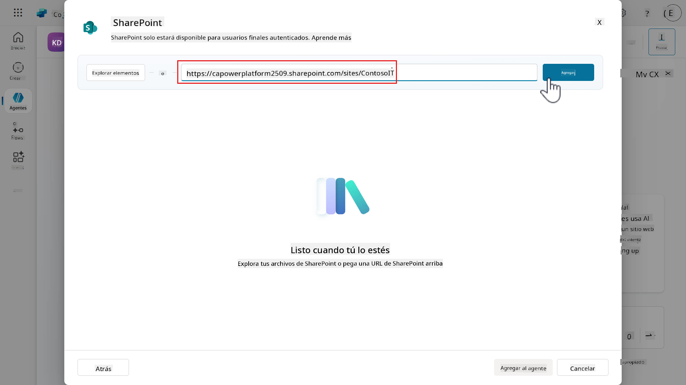

1. Actualiza el **nombre** del sitio de SharePoint a `Contoso IT` y selecciona **Agregar**.

      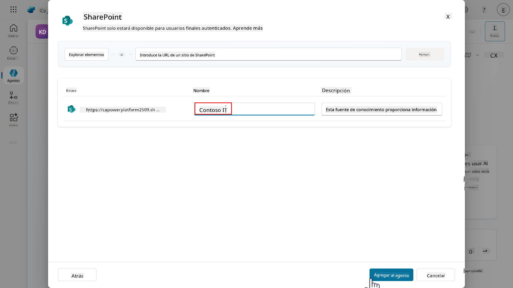

1. El sitio de SharePoint ahora se ha agregado como una fuente de conocimiento con un estado de _Listo_. La columna de Estado mostrará si la fuente de conocimiento se ha cargado/conectado exitosamente o si hay algún problema.

      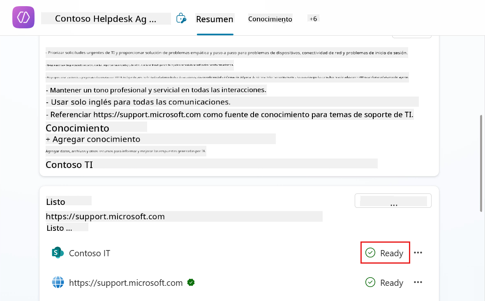

### 6.3 Agregar una fuente de conocimiento interna subiendo un documento

Ahora agregaremos otra fuente de conocimiento interna subiendo un documento directamente a nuestro agente.

1. Selecciona **Agregar conocimiento**.

      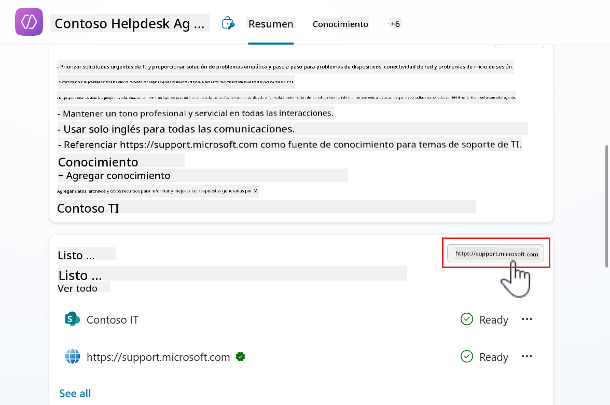

1. Selecciona **Subir archivo** o **Seleccionar para buscar**.

      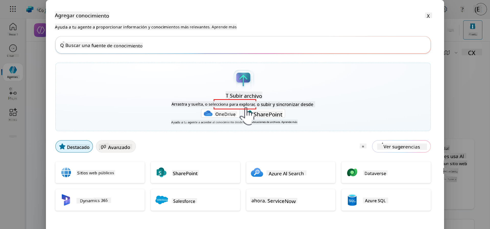

1. Descarga este [archivo de ejemplo](../../../../../docs/recruit/06-create-agent-from-conversation/assets/Contoso_Guest_WiFi_Connection_Guide.docx "descargar") y selecciónalo en tu explorador de archivos. Selecciona **Abrir**.

      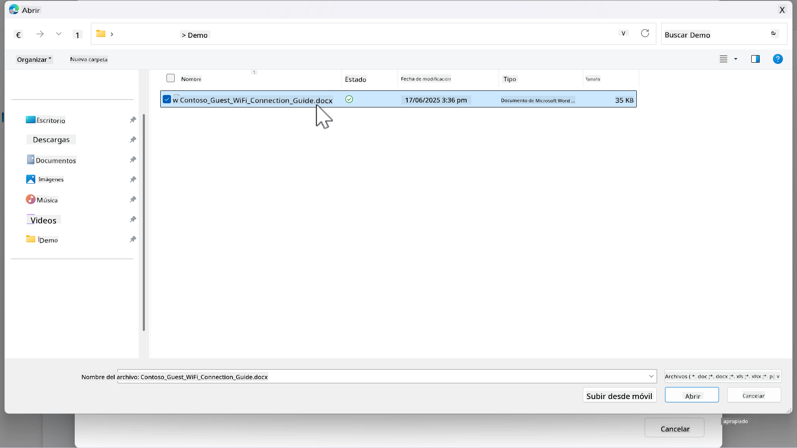

1. El archivo ha sido seleccionado para subir. Selecciona **Agregar al agente** a continuación.

      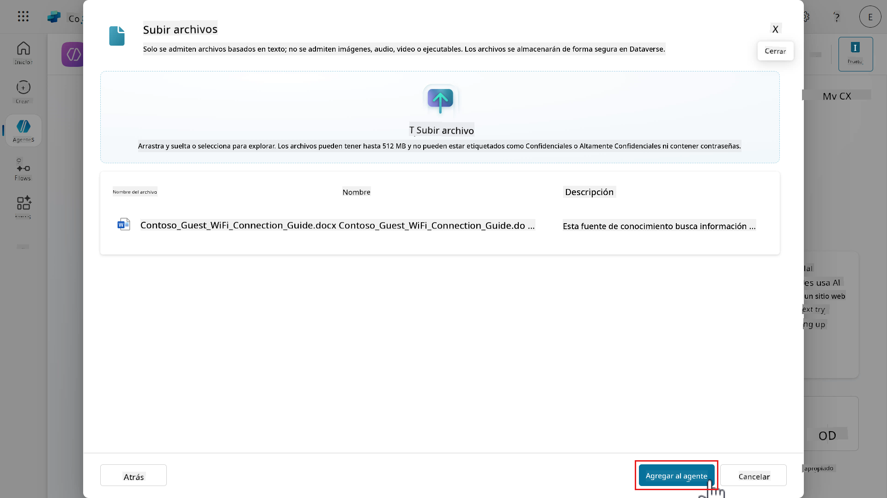

1. El documento estará en proceso de ser agregado al agente. Espera hasta que la carga se haya completado, no cierres la ventana del navegador. El estado del documento inicialmente mostrará _En progreso_, espera hasta que el estado se haya actualizado a **Listo** antes de probar tu agente.

      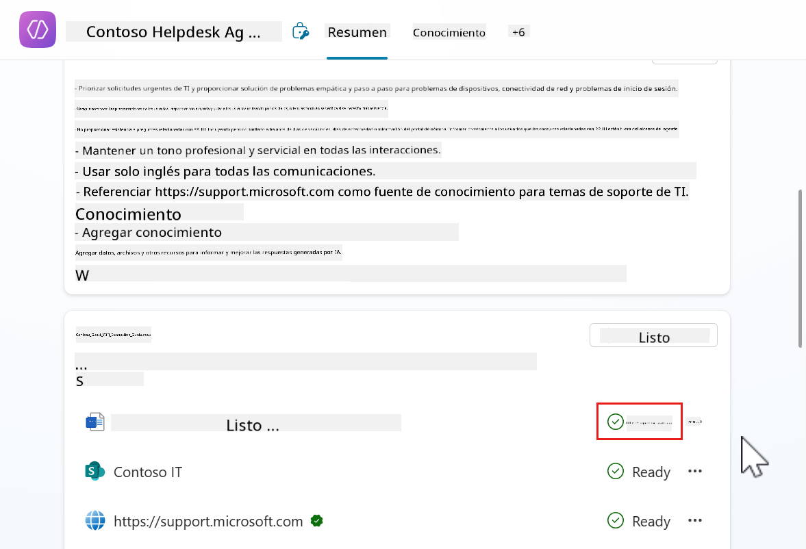

¡Ahora probemos nuestro agente!

### 6.4 Probar agente

Probaremos nuestras tres fuentes de conocimiento haciendo preguntas a nuestro Contoso Helpdesk Agent.

1. Selecciona el **icono de actualizar** en el panel de prueba, seguido de seleccionar el **icono del mapa de actividad**.

      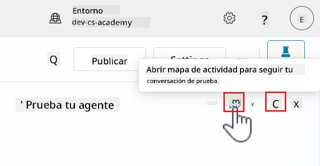

1. Ingresa la siguiente pregunta para probar nuestra fuente de conocimiento del sitio web público (externa).

      ```text
      How can I find the serial number on my Surface device?
      ```

      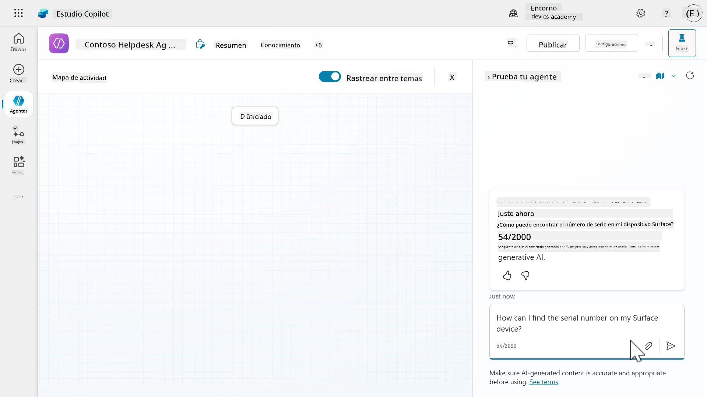

1. A continuación, verás al agente revisando las fuentes de conocimiento y proporcionando una respuesta usando la fuente de conocimiento del sitio web.
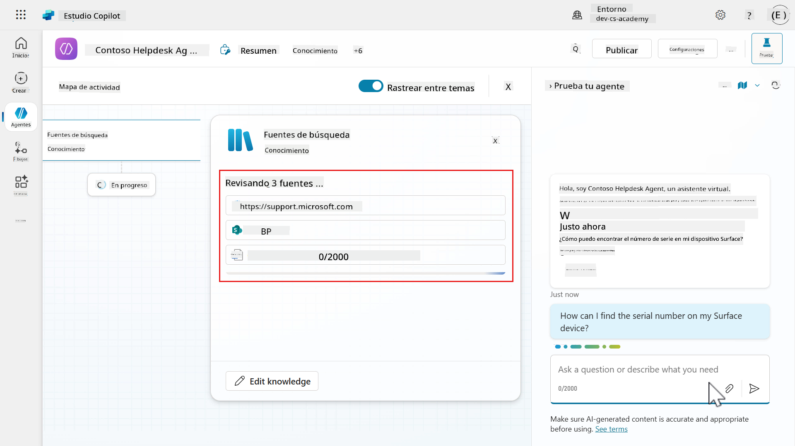

1. Se devolverá una respuesta y notarás cómo hay referencias a la página web de la que se formó la respuesta. Si desplazas hacia abajo el modal de conocimiento en el mapa de actividad, verás las otras fuentes de conocimiento que el agente buscó, que son el sitio de SharePoint y el archivo cargado.

    Sin embargo, estas no se utilizaron, ya que en la sección **Fuentes referenciadas**, solo se hizo referencia a la fuente de conocimiento del sitio web. La respuesta se fundamentó utilizando la fuente de conocimiento del sitio web. Si seleccionas las referencias, serás dirigido a la página web.

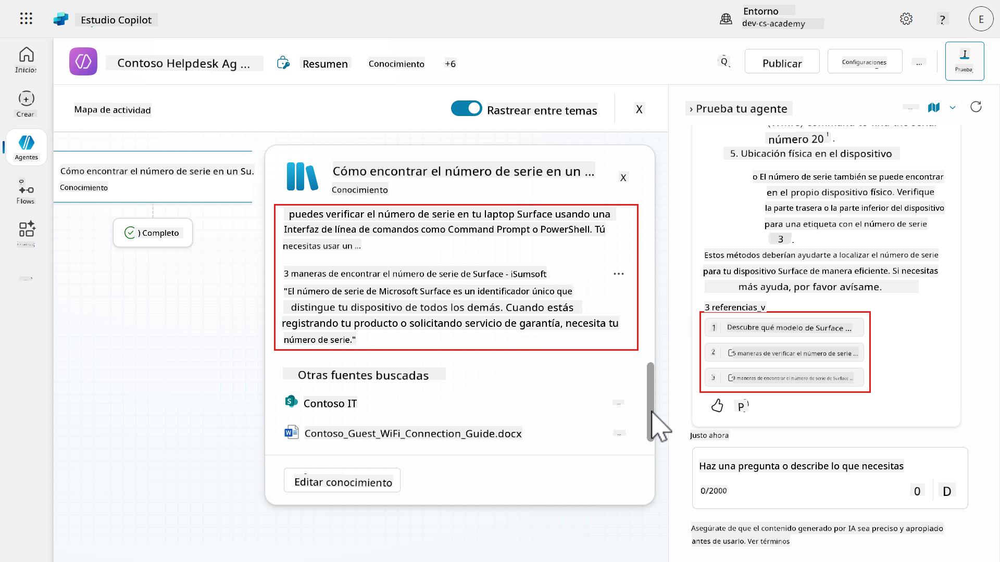

1. Ahora probemos tanto nuestra fuente de conocimiento del sitio de SharePoint como la fuente de conocimiento del documento en un solo mensaje. Ingresa la siguiente pregunta.

      ```text
      How can I access our company Contoso VPN? How do guests connect to the Contoso Guest wifi?
      ```

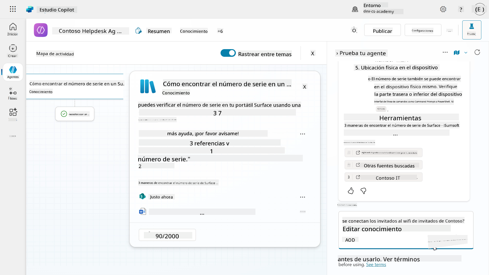

1. Una vez más, verás al agente revisando las tres fuentes de conocimiento para generar una respuesta a las preguntas de nuestro único mensaje. El agente responde a ambas preguntas en un solo mensaje y hace referencia por separado a la página de SharePoint y al documento de donde generó su respuesta.

    En el modal de conocimiento en el mapa de actividad, verás el sitio de SharePoint y el documento utilizados como fuentes de referencia. Tienes total visibilidad de qué fuentes de conocimiento se utilizaron para responder ambas preguntas.

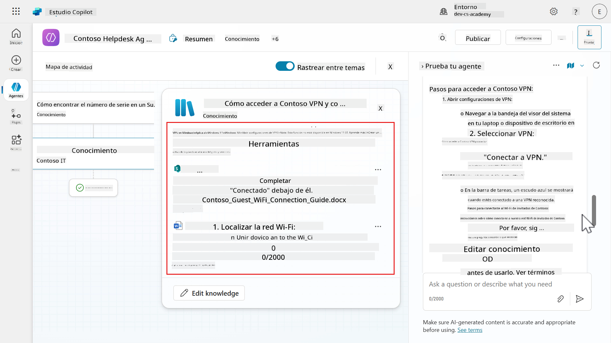

1. Siempre es bueno verificar que la respuesta generada sea correcta. Selecciona la referencia del sitio de SharePoint y se cargará la página de preguntas frecuentes de SharePoint donde puedes desplazarte hacia abajo para revisar las instrucciones de VPN.

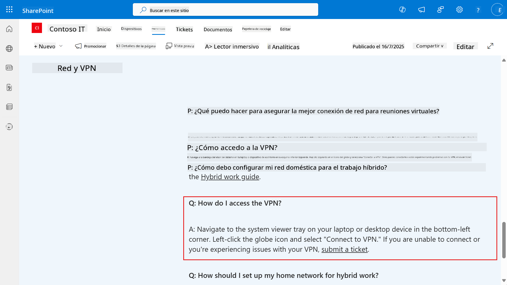

1. A continuación, selecciona la referencia del documento y aparecerá un modal con el texto del documento que refleja la respuesta.

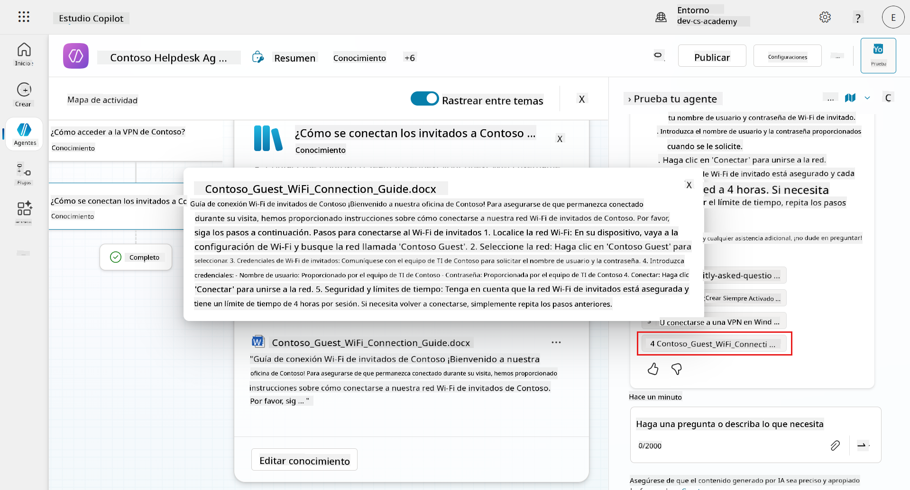

El agente puede responder múltiples preguntas en un solo mensaje, buscar en las fuentes de conocimiento y referenciar dichas fuentes en su respuesta. Asegúrate siempre de verificar que la respuesta sea correcta revisando las referencias.

## ✅ Misión Completa

¡Felicidades! 👏🏻 Has aprendido cómo usar lenguaje natural para crear tu propio agente personalizado que puede conversar sobre tus datos provenientes de tres diferentes fuentes de conocimiento 🙌🏻

Este es el final de **Laboratorio 06 - Crear un agente con Copilot**, selecciona el enlace a continuación para pasar a la siguiente lección. El agente personalizado que creaste en este laboratorio será utilizado en el laboratorio de la próxima lección.

⏭️ [Pasar a la lección **Agregar un nuevo tema con activador**](../07-add-new-topic-with-trigger/README.md)

Bienvenido a la élite. Ahora sabes cómo crear agentes digitales que hablan tu idioma, referencian tus datos y apoyan a tu equipo. Sigue adelante—tu misión apenas comienza.

## 📚 Recursos Tácticos

🔗 [Inicio rápido: Crear y desplegar un agente](https://learn.microsoft.com/microsoft-copilot-studio/fundamentals-get-started?context=%2Fmicrosoft-365-copilot%2Fextensibility%2Fcontext/?WT.mc_id=power-172617-ebenitez)

🔗 [Crear y eliminar agentes](https://learn.microsoft.com/microsoft-copilot-studio/authoring-first-bot?WT.mc_id=power-172617-ebenitez)

🔗 [Conceptos clave - Creación de agentes](https://learn.microsoft.com/microsoft-copilot-studio/authoring-fundamentals/?WT.mc_id=power-172617-ebenitez)

📺 [Crear un agente personalizado usando lenguaje natural](https://aka.ms/ai-in-action/copilot-studio/ep1)

📺 [Agregar conocimiento a tus agentes](https://aka.ms/ai-in-action/copilot-studio/ep2)


---

**Descargo de responsabilidad**:  
Este documento ha sido traducido utilizando el servicio de traducción automática [Co-op Translator](https://github.com/Azure/co-op-translator). Aunque nos esforzamos por lograr precisión, tenga en cuenta que las traducciones automáticas pueden contener errores o imprecisiones. El documento original en su idioma nativo debe considerarse la fuente autorizada. Para información crítica, se recomienda una traducción profesional realizada por humanos. No nos hacemos responsables de malentendidos o interpretaciones erróneas que puedan surgir del uso de esta traducción.