<!--
CO_OP_TRANSLATOR_METADATA:
{
  "original_hash": "c04b3587170139bc23e3b5cfc24c89ac",
  "translation_date": "2025-10-17T18:56:46+00:00",
  "source_file": "docs/recruit/07-add-new-topic-with-trigger/README.md",
  "language_code": "es"
}
-->
# 🚨 Misión 07: Agregar nuevo tema con activador y nodos

## 🕵️‍♂️ NOMBRE CLAVE: `OPERACIÓN MANTENTE EN EL TEMA`

> **⏱️ Ventana de tiempo de la operación:** `~60 minutos`

🎥 **Mira la guía paso a paso**

[](https://www.youtube.com/watch?v=7iPAZaA8nJs "Mira la guía paso a paso en YouTube")

## 🎯 Resumen de la misión

Has creado un agente. Escucha, aprende y responde preguntas, pero ahora es momento de ser más táctico. En esta misión, profundizarás en su funcionamiento y enseñarás a tu agente cómo responder a indicaciones específicas con precisión.

Con Temas y Activadores, tu agente puede:

- Reconocer intenciones

- Dirigir conversaciones con lógica

- Recopilar y almacenar variables

- Activar flujos y tomar acción

No solo estás construyendo un diálogo, estás conectando su núcleo de toma de decisiones. Bienvenido al Nexus Neural.

## 🔎 Objetivos

En esta misión, aprenderás:

1. Comprender qué son los temas y su papel en la creación de conversaciones estructuradas para tu agente.
1. Aprender la anatomía de los temas, incluyendo frases activadoras y nodos de conversación.
1. Explorar diferentes tipos de nodos de conversación y cómo usar Power Fx para lógica dinámica.
1. Crear temas personalizados desde cero para manejar solicitudes y tareas específicas de los usuarios.
1. Construir un tema funcional que se conecte a datos de SharePoint usando conectores y herramientas.

## 🤔 ¿Qué es un tema?

Un tema es una conversación estructurada que ayuda a tu agente a responder preguntas o tareas específicas de los usuarios. Piensa en un tema como una mini-conversación o tarea que tu agente puede manejar. Cada tema está diseñado para responder a una pregunta o solicitud específica del usuario.

### 🌌 Propósito de un tema

Hay tres propósitos comunes para los temas según lo que los usuarios necesiten:

**Informativo** - responde preguntas como las siguientes:

- `¿Qué es …?`
- `¿Cuándo será …?`
- `¿Por qué …?`
- `¿Puedes decirme …?`

**Cumplimiento de tareas** - ayuda a los usuarios a _hacer_ algo:

- `"Quiero …"`
- `"¿Cómo hago …?"`
- `"Necesito …?"`

**Resolución de problemas** - soluciona problemas:

- `Algo no está funcionando …`
- `Estoy encontrando un mensaje de error …`
- `Estoy viendo algo inesperado …?`

También puedes crear temas para preguntas ambiguas como `Necesito ayuda`, que piden más detalles a los usuarios antes de continuar.

## 🐦 ¿Por qué son útiles los temas?

Los temas te ayudan a:

- Organizar el conocimiento de tu agente.

- Hacer que las conversaciones se sientan naturales.

- Resolver problemas de los usuarios de manera efectiva.

## 🪺 Tipos de temas

1. **Temas del sistema** - están integrados y manejan eventos comunes como:
    - Iniciar una conversación
    - Finalizar una conversación
    - Manejar errores
    - Pedir a los usuarios que inicien sesión
    - Escalar a un agente humano

1. **Temas personalizados** - los creas para manejar tareas o preguntas específicas como:
    - Solicitud de permiso de empleado
    - Solicitar un dispositivo nuevo o de reemplazo

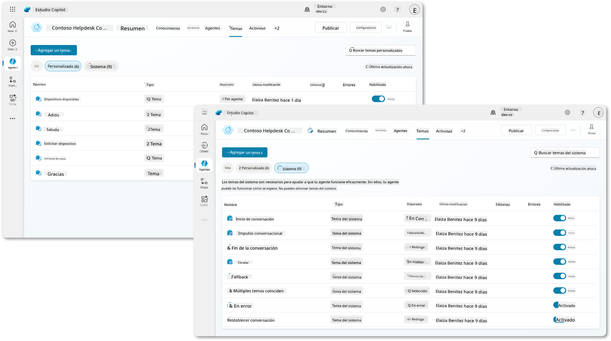

## 🧬 Anatomía de un tema

Cada tema generalmente contiene lo siguiente.

### 🗣️ Frases activadoras

Son palabras o frases que los usuarios podrían decir para iniciar el tema.

**Ejemplos:**

Para un tema de solicitud de permiso, las frases activadoras podrían ser:

- `Quiero tomar vacaciones`
- `Solicitar vacaciones`
- `Solicitar tiempo libre`
- `¿Cómo puedo enviar una solicitud de permiso?`

Para un tema de solicitud de dispositivo, las frases activadoras podrían ser:

- `Necesito un dispositivo nuevo`
- `¿Puedo solicitar un dispositivo?`
- `¿Puedes ayudarme con una solicitud de dispositivo?`

### 💬 Nodos de conversación

Un tema está compuesto por nodos que son pasos que el agente sigue una vez que se activa el tema. Conectas estos pasos para construir un flujo de conversación que tu agente sigue al interactuar con los usuarios.

Piensa en ellos como instrucciones o acciones tales como:

- Hacer preguntas al usuario
- Enviar mensajes
- Llamar a un servicio externo como un sistema de gestión de permisos
- Establecer o verificar variables
- Usar condiciones para ramificar la conversación
- Dirigir a otro tema

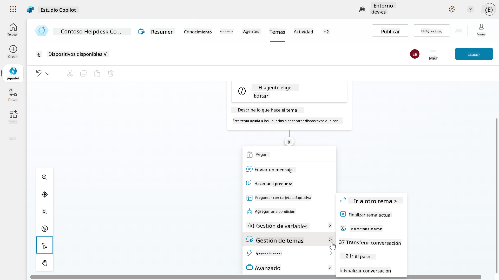

Los siguientes son los principales tipos de nodos que puedes agregar a un agente:

#### Enviar un mensaje

- **Propósito** - envía un mensaje al usuario.
- **Ejemplo** - `¡Gracias por tu solicitud! Te ayudaré con eso.`

Este nodo permite que tu agente envíe mensajes a los usuarios, que pueden ser texto simple o contenido enriquecido como imágenes, videos, tarjetas, respuestas rápidas y tarjetas adaptativas.

Puedes personalizar los mensajes usando variables, agregar múltiples variaciones de mensajes para variedad e incluso personalizar la salida de voz para canales habilitados para voz.

!!! tip
    Piensa en esto como un bloque de "decir algo" que ayuda a tu agente a comunicarse de manera clara e interactiva con los usuarios.

#### Hacer una pregunta

- **Propósito** - hace una pregunta al usuario y espera su respuesta.
- **Ejemplo** - `¿Cuáles son tus fechas de vacaciones?`

Este nodo se utiliza para pedir información específica a los usuarios durante una conversación y almacenar sus respuestas en variables para uso posterior.

Puedes personalizar el tipo de pregunta como entrada de texto o usar entidades para una lista definida de valores que el usuario selecciona, y definir cómo debe comportarse el agente si el usuario da una respuesta inválida o se salta la pregunta.

También admite contenido enriquecido como imágenes y respuestas rápidas, y te permite ajustar la validación, re-preguntar y configuraciones de interrupción para que el flujo de conversación sea fluido.

!!! tip
    Piensa en esto como un bloque de "preguntar y escuchar" que ayuda a tu agente a interactuar con los usuarios de manera estructurada que tú defines.

#### Preguntar con tarjeta adaptativa

- **Propósito** - enviar una tarjeta rica e interactiva usando JSON.
- **Ejemplo** - una tarjeta que muestra un selector de fechas de calendario para que el usuario seleccione una fecha.

Este nodo muestra tarjetas ricas e interactivas que los usuarios pueden completar y enviar, como formularios con cuadros de texto, botones e imágenes. Captura la entrada del usuario y la almacena en variables, que tu agente puede usar más adelante en la conversación.

!!! tip
    Piensa en esto como un bloque de "constructor de formularios" personalizable que hace que tu agente sea más atractivo y capaz de recopilar información detallada de los usuarios.

#### Agregar una condición

- **Propósito** - agregar lógica a la conversación. Verifica algo y decide qué hacer a continuación.
- **Ejemplo** - si el usuario dice `Sí`, pasa al siguiente paso. Si dice `No`, termina la conversación.

Este nodo crea puntos de decisión en el flujo de conversación de tu agente al verificar si una variable cumple ciertos criterios. Según si la condición es verdadera o falsa, el agente sigue diferentes caminos.

!!! tip
    Piensa en esto como un bloque de "si-entonces" que ayuda a tu agente a tomar decisiones dependiendo de la entrada del usuario o los datos almacenados en variables.

#### Gestión de variables

- **Propósito** - almacena o elimina información (llamada variables) durante la conversación.
- **Ejemplo** - guarda la fecha que el usuario seleccionó en el nodo de Preguntar que muestra una tarjeta adaptativa.

Este nodo te permite almacenar y gestionar información durante una conversación, como el nombre del usuario, su respuesta o preferencias. Puedes usar diferentes tipos de variables como texto, números o fechas, y pueden estar limitadas a un solo tema, compartidas entre temas (globales) o incluso extraídas del sistema o entorno.

!!! tip
    Piensa en esto como una "caja de memoria" que ayuda a tu agente a recordar información y usarla mientras la conversación continúa con el usuario.

#### Gestión de temas

- **Propósito** - mueve la conversación a otro tema o paso dentro del tema, transfiere la conversación o finaliza el tema o la conversación.
- **Ejemplo** - redirigir al tema "Política de permisos".

Este nodo permite que tu agente salte de un tema a otro sin reiniciar la conversación, termine el tema, transfiera o finalice la conversación, o vaya a un paso diferente dentro del mismo tema. Ayuda a guiar a los usuarios a través de diferentes partes del flujo de conversación al hacer transiciones suaves entre temas, y puedes pasar variables entre ellos para mantener el contexto.

!!! tip
    Piensa en esto como un bloque de "ir a otra sección/paso" que ayuda a tu agente a ser flexible al conversar con los usuarios.

#### Agregar una herramienta

- **Propósito** - conecta herramientas como conectores, flujos de agente, indicaciones, búsqueda personalizada, consulta de búsqueda, habilidades, protocolo de contexto de modelo.
- **Ejemplo** - Flujo de agente ejecutado después de que el usuario envíe su solicitud de vacaciones.

Este nodo le da a tu agente capacidades para interactuar con sistemas externos o realizar tareas específicas, como enviar correos electrónicos, verificar el clima o acceder a bases de datos. Puedes agregar herramientas usando conectores integrados, APIs personalizadas, flujos de agente, indicaciones, o conectarte a servidores MCP (Protocolo de Contexto de Modelo), e incluso automatización de interfaz gráfica para aplicaciones de escritorio mediante la herramienta de uso de computadora.

!!! tip
    Piensa en las herramientas como "bloques de acción" que le dan superpoderes a tu agente para hacer cosas más allá de _chatear_, como llamar a una API, ejecutar un proceso o recopilar automáticamente la entrada del usuario.

#### Nodo de respuestas generativas

- **Propósito** - utiliza un modelo de lenguaje grande para generar respuestas naturales y similares a las humanas basadas en la pregunta del usuario y cualquier dato conectado.
- **Ejemplo** - utiliza la fuente de conocimiento conectada que contiene información sobre derechos de vacaciones para responder preguntas de los usuarios sobre solicitudes de vacaciones.

Este nodo permite que tu agente responda preguntas de los usuarios utilizando información de diversas fuentes de conocimiento, como sitios web, documentos, SharePoint o datos personalizados. Puede usarse como respaldo cuando no se encuentra un tema coincidente, o dentro de un tema para proporcionar respuestas más detalladas y dinámicas basadas en fuentes específicas que hayas configurado para tu agente.

!!! tip
    Piensa en esto como un "bloque de respuesta inteligente" que ayuda a tu agente a dar respuestas útiles y precisas buscando contenido confiable que tú defines.

#### Nodo de solicitud HTTP

- **Propósito** - conecta tu agente a sistemas externos enviando llamadas API (por ejemplo, `GET` o `POST`) para obtener o actualizar datos.
- **Ejemplo** - cuando un usuario pregunta por su saldo de días de vacaciones, el agente realiza una solicitud `GET` al sistema de gestión de permisos y extrae el `remainingLeaveDays` de la respuesta de la API y responde al usuario con el valor.

Este nodo permite que tu agente se conecte a sistemas externos enviando llamadas API REST, como solicitudes `GET` o `POST`. Puedes personalizar la solicitud con encabezados, contenido del cuerpo e incluso usar Power Fx para incluir datos dinámicos, luego almacenar la respuesta en variables para usarla más adelante en la conversación.

!!! tip
    Piensa en esto como un bloque de "buscar y obtener información" que ayuda a tu agente a comunicarse con otros servicios, como recuperar detalles del usuario o enviar datos a otro sistema.

#### Enviar un evento

- **Propósito** - permite que tu agente envíe acciones no relacionadas con mensajes, como actualizaciones del sistema o activadores de herramientas, al cliente o canal, ayudándolo a realizar tareas.
- **Ejemplo** - reaccionar a un usuario que se une a un chat mostrando un mensaje de bienvenida.

Este nodo permite que tu agente envíe acciones no relacionadas con mensajes a sistemas externos o canales, que luego deciden cómo responder. Le das a cada evento un nombre y adjuntas un valor, que puede ser un número o texto simple, una variable o una fórmula de Power Fx, y se envía como un objeto JSON.

!!! tip
    Piensa en esto como un bloque de "activador silencioso" que ayuda a tu agente a hacer cosas detrás de escena o comunicarse con herramientas externas sin necesidad de que el usuario diga algo.

## 🏋🏻‍♀️ Usar Power Fx en tus nodos

En Copilot Studio, Power Fx es un lenguaje de programación de bajo código utilizado para agregar lógica y comportamiento dinámico a tu agente. Es el mismo lenguaje utilizado en Microsoft Power Apps, y está diseñado para ser simple y similar a Excel, lo que lo hace fácil para desarrolladores y no desarrolladores.

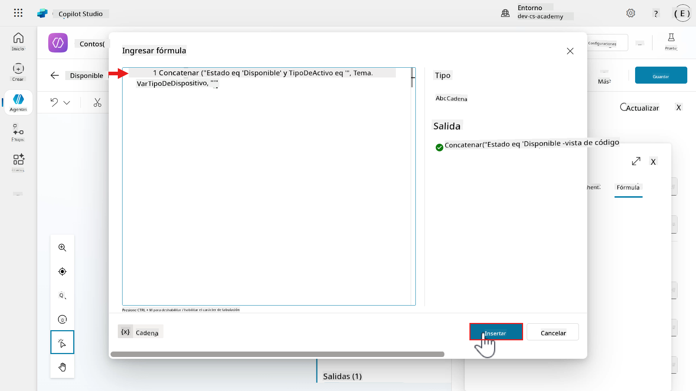

### Qué puede hacer Power Fx en los temas

- Establecer y manipular variables
      - Ejemplo: `Set(userName, "Adele Vance")`
- Crear condiciones
      - Ejemplo: `If(score > 80, "Pass", "Fail")`
- Formatear y transformar datos
      - Ejemplo: `Text(DateValue, "dd/mm/yyyy")`

### ¿Por qué usar Power Fx?

- **Flexible:** puedes construir lógica sin escribir líneas completas de código.

- **Familiar:** si has usado fórmulas de Excel, se siente muy similar.

- **Potente:** te permite personalizar conversaciones, validar entradas y controlar cómo se comporta tu agente según los datos del usuario.

## 🏗️ ¿Cómo creo y edito temas?

Hay dos formas en que puedes crear y editar temas para tus agentes.

### 1. Crear desde cero

Esto te permite construir flujos de conversación personalizados desde cero, y puedes agregar o eliminar nodos según sea necesario al editar tu tema.

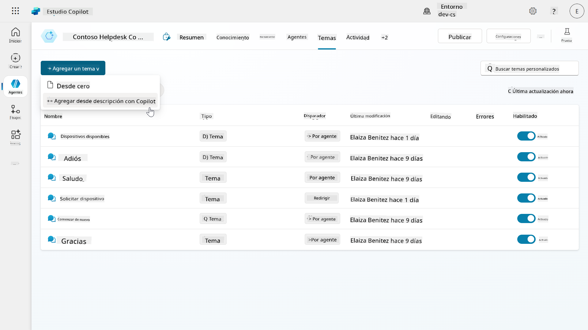

#### Por qué esto es útil

- Te da control total sobre cómo responde tu agente.
- Puedes personalizar la lógica usando variables, Power Fx y condiciones.
- Es perfecto para construir experiencias adaptadas a necesidades específicas del negocio.

### 2. Crear con Copilot
Esto te permite describir lo que deseas utilizando lenguaje natural, y Copilot construirá la conversación por ti. Lo mismo aplica al editar tu tema, usa lenguaje natural y Copilot revisará y modificará el tema por ti.

#### Lo que Copilot admite

- Puede crear y editar:
      - Nodos de mensaje
      - Nodos de pregunta
      - Nodos de condición
- No admite configuraciones avanzadas como cómo volver a preguntar al usuario si no responde o cómo manejar interrupciones durante una pregunta. Aún puedes ajustar esas configuraciones manualmente si es necesario.

#### Por qué esto es útil

- Acelera el desarrollo con asistencia de IA.
- Te permite enfocarte en la lógica y la experiencia del usuario en lugar de configuraciones repetitivas.
- Facilita iterar y mejorar los flujos de conversación con mínimo esfuerzo.

#### ✨ Ejemplos de indicaciones

- **Crear un tema**
      - `Aceptar el nombre, edad y fecha de nacimiento de un usuario y luego repetir sus respuestas`
      - `Recopilar la dirección, estado y código postal de un usuario. El usuario debería poder intentar cada pregunta hasta 4 veces`

- **Editar un tema**
      - `Agregar una pregunta solicitando la fecha de nacimiento del usuario`
      - `Resumir la información recopilada en una tarjeta adaptativa.`

## 👩🏻‍🎨 OK, ¿cómo diseño temas para mi agente?

### 🧙🏻‍♂️ Paso 1 - entender lo que los usuarios necesitan

Comienza identificando preguntas o tareas comunes que los usuarios pedirán a tu agente. Estas podrían ser:

- Preguntas que los usuarios hacen con frecuencia como, `¿cuál es mi derecho a días de enfermedad?`
- Tareas comunes que los usuarios quieren completar como enviar un formulario
- Problemas que los usuarios enfrentan a menudo como problemas de inicio de sesión

### 📦 Paso 2 - Agrupar los escenarios

Organiza las necesidades de los usuarios en tres categorías basadas en lo que aprendimos anteriormente: el propósito de un tema:

- Informativo - el usuario quiere saber algo
- Completar una tarea - el usuario quiere hacer algo
- Solución de problemas - el usuario necesita ayuda para resolver un problema

### 🗺️ Paso 3 - Diseñar la conversación

Dibuja un flujo de conversación simple sobre cómo debería responder el agente.

- Comienza con un saludo o confirmación
- Haz preguntas de seguimiento para obtener detalles
- Proporciona respuestas o realiza acciones

!!! tip
    Mantén la conversación breve y enfocada. Solo pregunta lo necesario.

### 🔀 Paso 4 - Manejar diferentes tipos de conversación

Diseña para ambos:

- **De un solo turno** - una pregunta, una respuesta

- **De varios turnos** - una conversación de ida y vuelta con preguntas de seguimiento

Ejemplo:

- Usuario: `Quiero solicitar permiso de vacaciones.`

- Agente: `¡Claro! ¿Qué fecha te gustaría que comenzara tu permiso?`

- Usuario: `15 de julio`

- Agente: `Entendido. ¿Y cuándo terminará tu permiso?`

- Usuario: `22 de julio.`

- Agente: `Gracias. ¿Cuál es el motivo de tu permiso?`

- Usuario: `Vacaciones familiares.`

- Agente: `Gracias por los detalles. He enviado tu solicitud de permiso del 15 al 22 de julio por vacaciones familiares. Pronto recibirás una confirmación.`

### 🤖 Paso 5 - Usar IA para preguntas inesperadas

Incluso si has diseñado un tema para solicitudes de permiso, los usuarios podrían hacer preguntas que no están directamente cubiertas. Aquí es donde las características de IA como el tema del sistema _Impulso conversacional_ son útiles.

Este tema incluye un nodo de respuestas generativas, que permite que tu agente comience a usar fuentes de conocimiento conectadas de inmediato. Cualquier fuente de conocimiento añadida a nivel del agente se incluye automáticamente en el nodo de respuestas generativas dentro del tema del sistema _Impulso conversacional_.

#### Ejemplo

- Usuario: `¿Puedo transferir días de vacaciones no utilizados al próximo año?`

Esta pregunta podría no formar parte del flujo de tema predefinido, especialmente si tu tema solo maneja solicitudes de permiso.

#### Cómo ayuda la IA

Si tu agente está conectado a los documentos de política de recursos humanos de tu empresa o al sitio web interno, la IA puede:

- Buscar la política de permisos relevante
- Entender y resumir las reglas
- El agente responde con: `Según la política de recursos humanos, puedes transferir días de vacaciones no utilizados al próximo año calendario. Para más detalles, consulta la sección de política de permisos en el portal de recursos humanos.`

#### Por qué esto es útil

- No necesitas crear manualmente un tema para cada pregunta relacionada con políticas.
- La IA puede obtener respuestas precisas de fuentes de conocimiento confiables.
- Mejora la experiencia del usuario haciendo que el agente parezca más inteligente y receptivo.

### 🔬 Paso 6 - Probar el tema, el flujo de conversación

Antes de publicar tu tema:

- Prueba usando preguntas reales o entradas de muestra reales.
- Asegúrate de que suene natural y útil.

!!! tip
    Aplica mejoras a tu tema según lo pruebes, como agregar más nodos o eliminar nodos en lugar de redirigir a otro tema.

### ⚠️ Paso 7 - Evitar duplicar contenido del sitio web

No copies lo que ya está en tu sitio web.

- Enfócate en temas que los usuarios preguntan con frecuencia.
- Agrega nuevos temas basados en el historial de chat o solicitudes de soporte.

### ✨ Ejemplo de flujo de conversación

A continuación, se muestra un ejemplo de un tema que maneja solicitudes de permiso.

#### Paso 1: Frase de activación

El usuario escribe,

`Quiero solicitar permiso de vacaciones`

#### Paso 2: El agente solicita detalles usando una tarjeta adaptativa

El agente pregunta,

`¡Claro! ¿Qué fechas te gustaría tomar libres?`

La tarjeta adaptativa tiene un control de selección de calendario para la fecha de inicio y la fecha de fin.

#### Paso 3: El usuario proporciona las fechas

El usuario selecciona la fecha de inicio como el 5 de agosto de 2025 y la fecha de fin como el 10 de agosto de 2025, y envía la tarjeta. Los valores de las fechas se almacenan en la salida de la tarjeta adaptativa como variables.

#### Paso 4: Flujo en la nube ejecutado

Se ha ejecutado un flujo en la nube de Power Automate que crea una nueva solicitud en el sistema de gestión de permisos y envía un correo electrónico para notificar al gerente sobre la solicitud de permiso.

#### Paso 5: Enviar un mensaje de confirmación al usuario

El agente responde con,

`Tu solicitud de permiso de vacaciones del 5 al 10 de agosto ha sido enviada. Tu gerente la revisará y se pondrá en contacto contigo pronto.`

## 🧪 Laboratorio 07 - Agregar un nuevo tema con nodos de conversación

Ahora vamos a aprender cómo agregar un nuevo tema con un activador y herramientas. Este laboratorio cubrirá la creación de un tema desde cero para que entiendas cómo personalizar temas según tus necesidades.

- [7.1 Agregar un nuevo tema desde cero](../../../../../docs/recruit/07-add-new-topic-with-trigger)
- [7.2 Definir las entradas y salidas del activador](../../../../../docs/recruit/07-add-new-topic-with-trigger)
- [7.3 Agregar una herramienta usando un conector](../../../../../docs/recruit/07-add-new-topic-with-trigger)

### ✨ Caso de uso

**Como** empleado

**Quiero** saber qué dispositivos están disponibles

**Para que** tenga una lista de dispositivos disponibles

¡Comencemos!

### Requisitos previos

1. **Lista de SharePoint**

    Usaremos la lista de SharePoint **Dispositivos** de [Lección 00 - Configuración del curso - Paso 3: Crear nuevo sitio de SharePoint](../00-course-setup/README.md#step-4-create-new-sharepoint-site).

    Si no has configurado la lista de SharePoint **Dispositivos**, por favor regresa a [Lección 00 - Configuración del curso - Paso 3: Crear nuevo sitio de SharePoint](../00-course-setup/README.md#step-4-create-new-sharepoint-site).

1. **Agente de soporte técnico de Contoso**

    Usaremos el mismo agente creado previamente en [Lección 06 - Crear un agente personalizado usando lenguaje natural con Copilot y conectándolo con tus datos](../06-create-agent-from-conversation/README.md).

### 7.1 Agregar un nuevo tema desde cero

1. Selecciona la **pestaña Temas** cerca del nombre del agente. Si no la ves visible, selecciona **+6** y verás **Temas** listados.

    

1. La pestaña **Temas** se cargará y por defecto se mostrarán los temas _Personalizados_. Puedes filtrar los temas por Todos, Personalizados y Sistema. Los temas personalizados y del sistema que ves actualmente fueron creados automáticamente cuando se aprovisionó el agente.

    Selecciona **+ Agregar un tema** y selecciona **Desde cero**.

    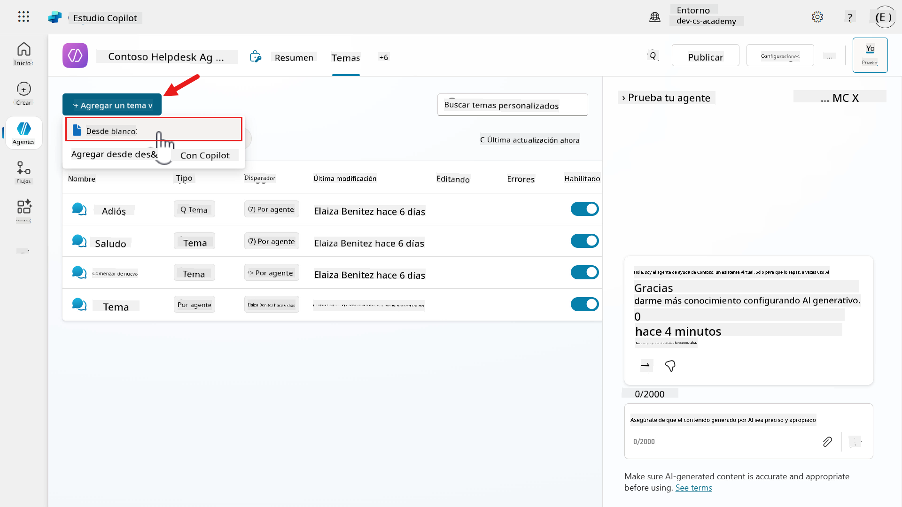

1. Ingresa un nombre para el tema. Copia y pega lo siguiente.

    ```text
    Available devices
    ```

    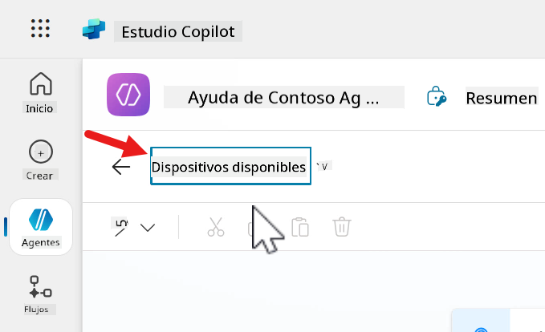

1. Ingresa una descripción del activador que describa lo que hace el tema. Copia y pega lo siguiente.

    ```text
    This topic helps users find devices that are available from our SharePoint Devices list. User can ask to see available devices and it will return a list of devices that are available which can include laptops, smartphones, accessories and more.
    ```

    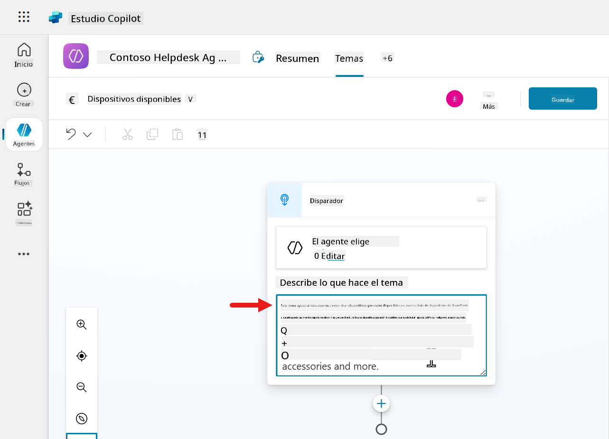

### 7.2 Definir las entradas y salidas del activador

1. A continuación, vamos a agregar una nueva variable de entrada que la IA generativa usará en su orquestación para extraer el valor del tipo de dispositivo del mensaje del usuario. Selecciona los **tres puntos (...)** en el tema y selecciona **Detalles** para ver el panel de detalles del tema.

    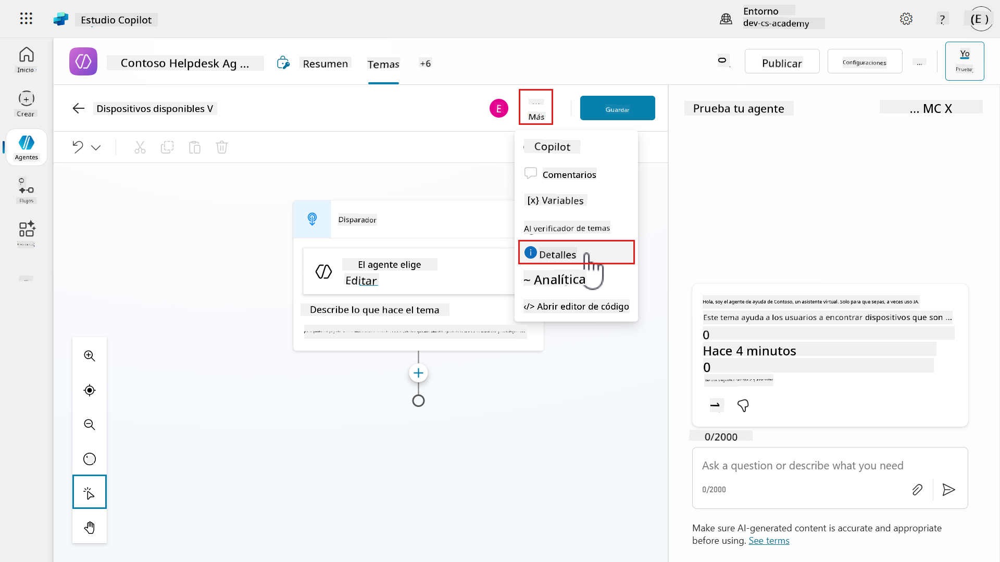

1. El panel de **Detalles del Tema** ahora se ha cargado. Selecciona la pestaña **Entrada**.

    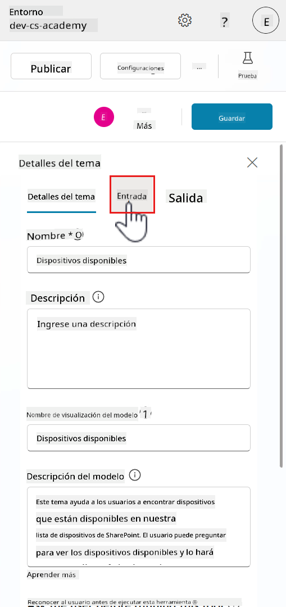

1. Selecciona **Crear una nueva variable**.

    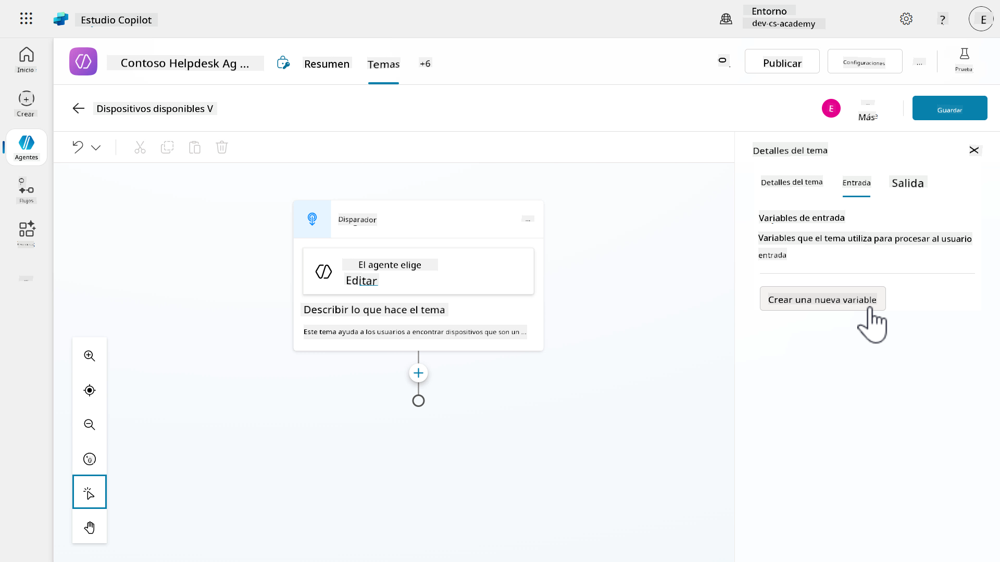

1. Ingresa un nombre para la variable. Copia y pega lo siguiente.

    ```text
    VarDeviceType
    ```

    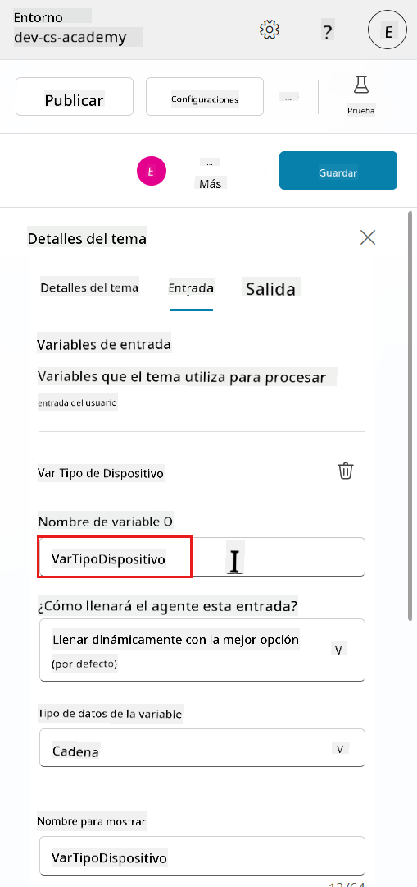

1. Ahora necesitamos definir nuestras variables de entrada y salida. Las siguientes son propiedades que se pueden definir para las entradas y salidas del tema.

    | Campo    | Valor |
    | ---------- | :--------- |
    | ¿Cómo llenará el agente esta entrada? | Determina cómo el agente llena esta variable con un valor antes de ejecutar el tema. Por defecto está configurado como _Llenar dinámicamente con la mejor opción_. De lo contrario, puedes sobrescribir una entrada con un valor en lugar de preguntar al usuario |
    | Tipo de datos de la variable  | El tipo de datos de la variable. Los tipos de datos admitidos son `String`, `Boolean`, `Number`, `Date`, `DateTime`, `DateTimeNoTimeZone`, `Time`, `Record`, `Table`, `Unspecified`, `From sample data` |
    | Nombre para mostrar   | Nombre de la variable   |
    | Identificar como  | Tipo de entidad para que el agente capture el tipo de valor correcto  |
    | Descripción    | La descripción ayuda al agente a llenar automáticamente las entradas antes de ejecutar el tema o generar preguntas para solicitar los valores   |

    Las propiedades _¿Cómo llenará el agente esta entrada?_, _Tipo de datos de la variable_ y _Nombre para mostrar_ pueden permanecer como están. Actualiza la propiedad **Identificar como** a **Respuesta completa del usuario**.

    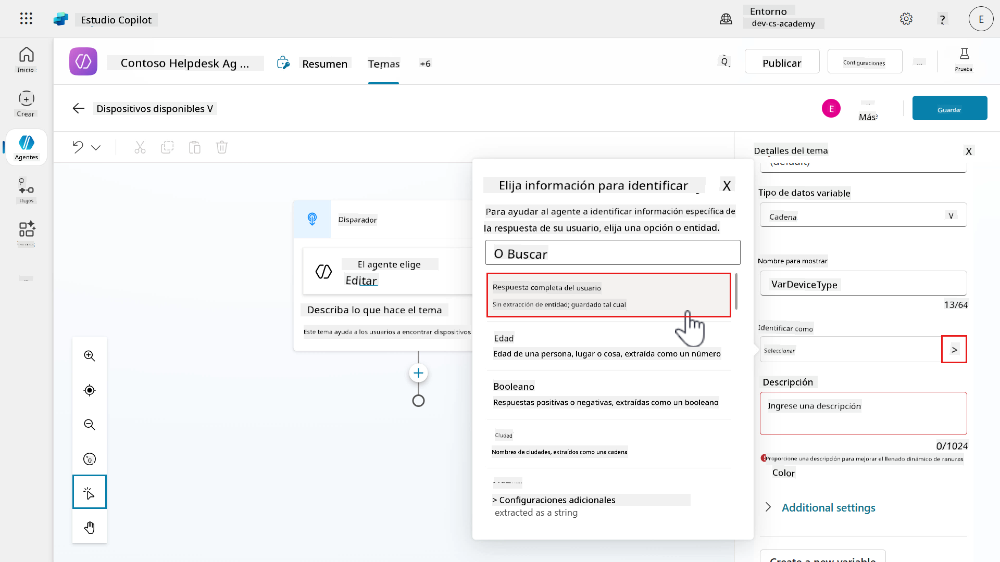

1. Copia y pega lo siguiente como descripción.

    ```text
    List of possible values: Laptop, Desktop, Smartphone
    ```

    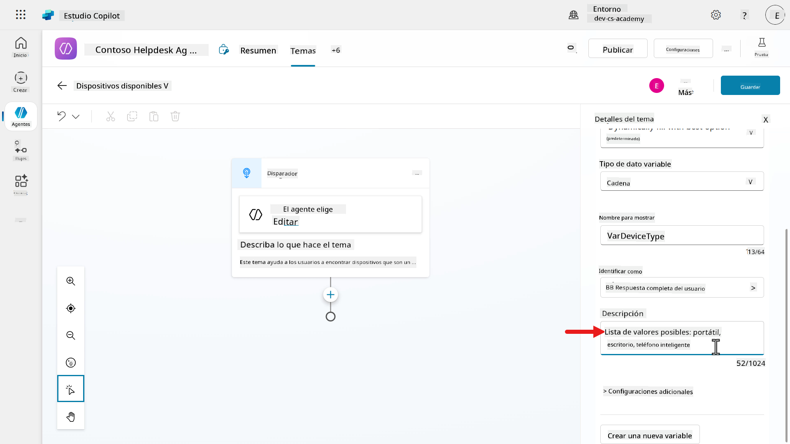

1. A continuación, definamos nuestra salida para el tema. Selecciona la pestaña **Salida**.

    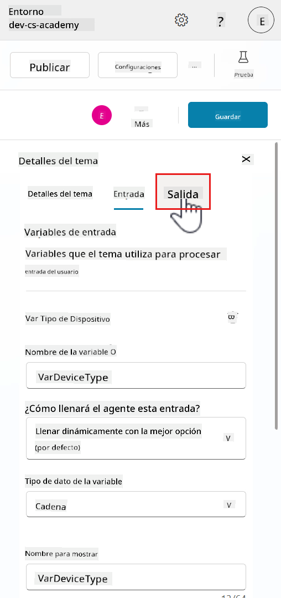

1. Selecciona **Crear una nueva variable**.

    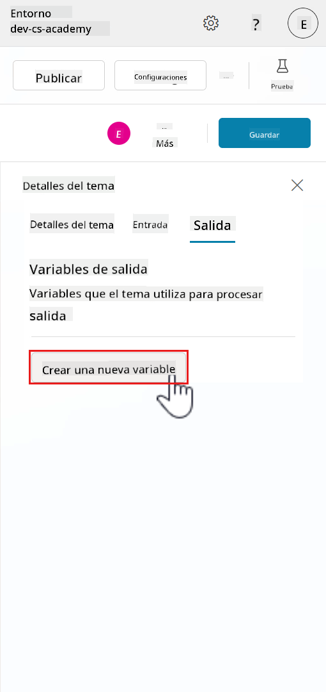

1. Actualiza las siguientes propiedades.

    **Nombre de la variable** - Copia y pega lo siguiente.

    ```text
    VarAvailableDevices
    ```

    **Tipo de datos de la variable** - Selecciona **Tabla** como el tipo de datos.

    **Descripción de la variable** - Copia y pega lo siguiente.

    ```text
    List of available devices by device type
    ```

    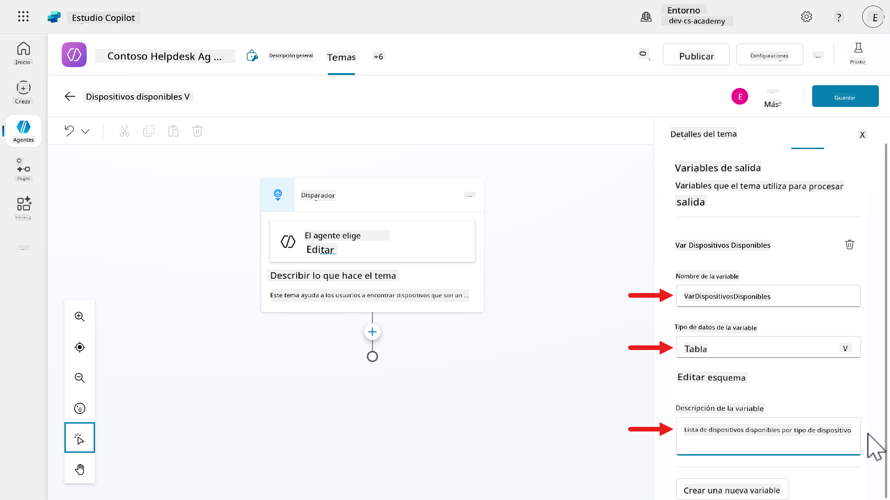

1. Ahora hemos completado la definición de las entradas y salidas del tema. Selecciona el **icono X** para salir del panel de **Detalles del Tema**.

    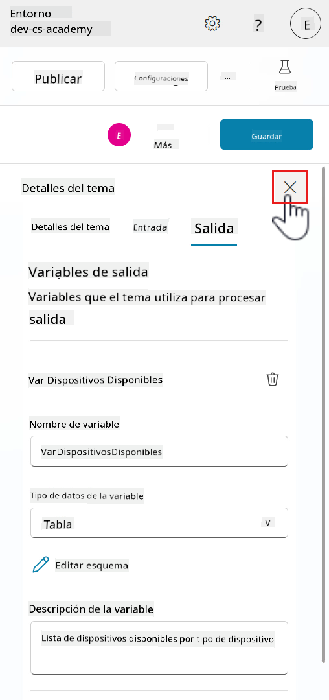

### 7.3 Agregar una herramienta usando un conector

1. A continuación, agreguemos un nodo que permita al agente recuperar la lista de dispositivos de la lista de SharePoint **Dispositivos**. Selecciona el **icono +** debajo del activador.

    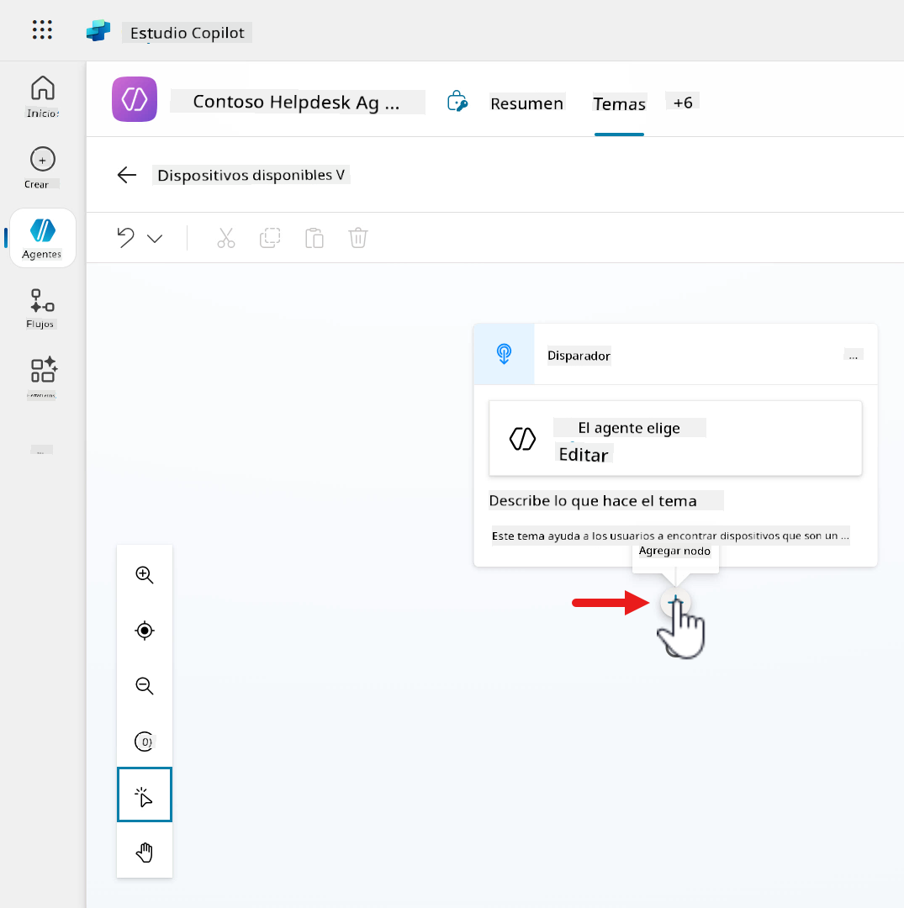

1. Selecciona el nodo **Agregar una herramienta**, luego selecciona la pestaña **Conector**. Busca `Obtener elementos` y selecciona la acción del conector de SharePoint **Obtener elementos**.

    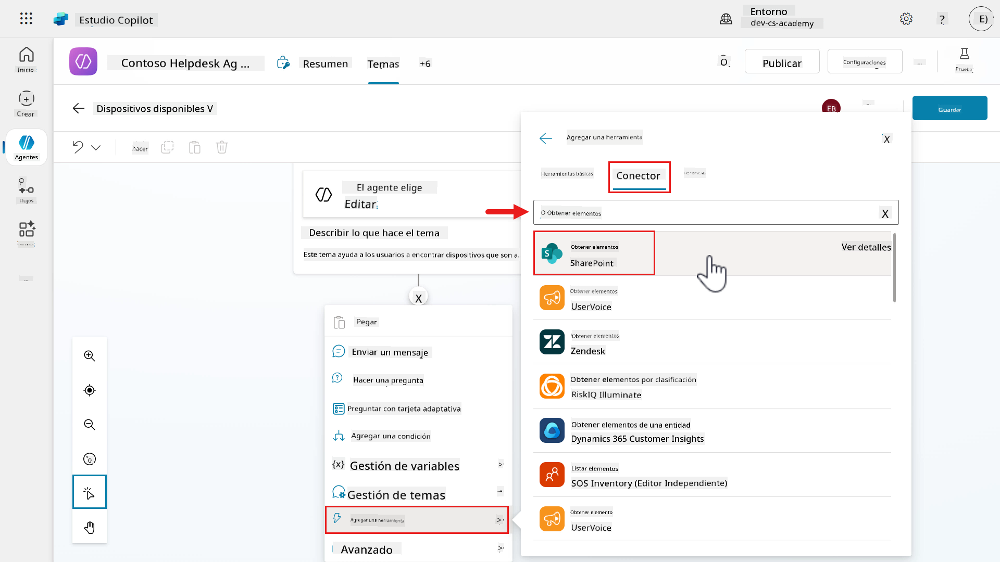

1. Se necesita crear una nueva conexión para el conector. Selecciona el **icono de cheurón** y selecciona **Crear nueva conexión**.

    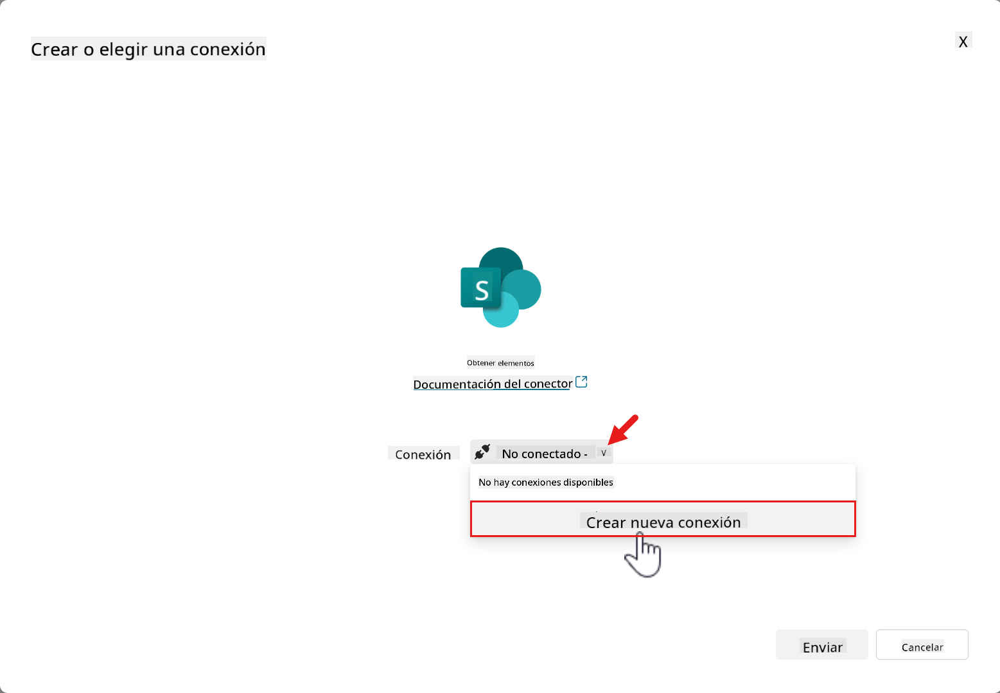

1. Se mostrarán dos opciones que te permiten conectarte directamente a SharePoint Online o a un SharePoint local. Por defecto, la opción **Conectar directamente (servicios en la nube)** estará seleccionada, que es la que usaremos para nuestra conexión.
Selecciona **Crear**.

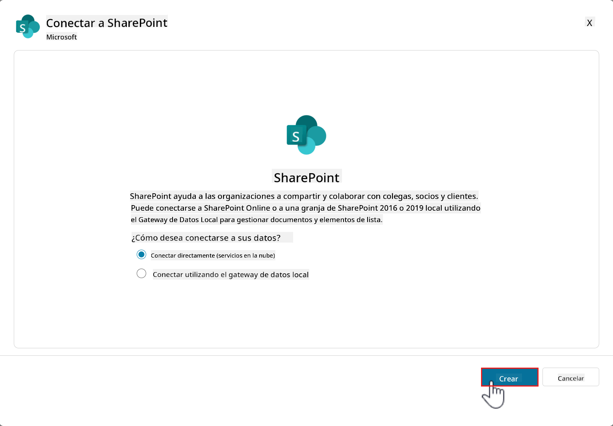

1. Selecciona tu cuenta de usuario iniciada.

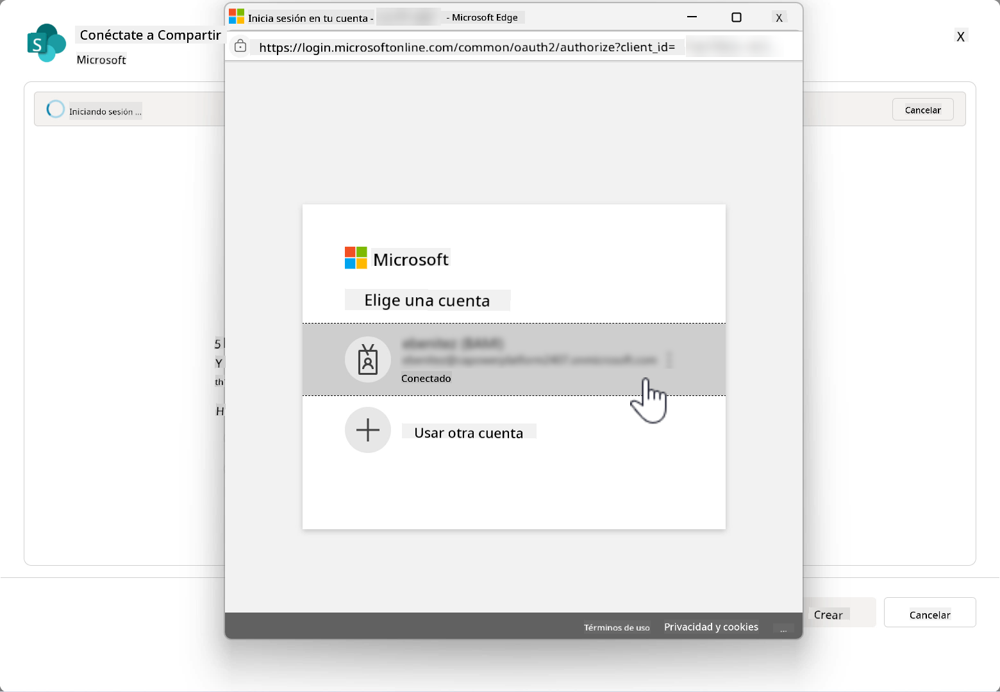

1. A continuación, necesitas confirmar que tu cuenta de usuario puede ser utilizada para la conexión con el conector de SharePoint. Selecciona **Permitir acceso**.


1. Selecciona **Enviar** para que la acción del conector de SharePoint **Obtener elementos** se agregue como un nodo al tema.

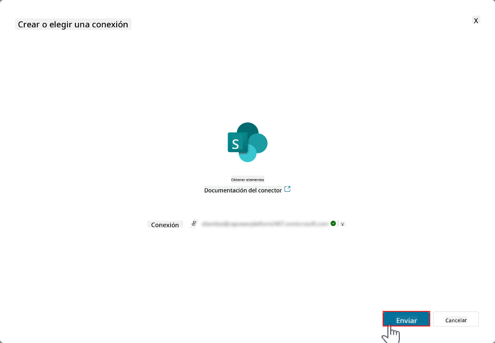

1. La acción del conector de SharePoint **Obtener elementos** ahora está agregada al tema. Ahora podemos comenzar a configurar las entradas de la acción. Selecciona el **icono de elipsis (...)** y selecciona **Propiedades**.

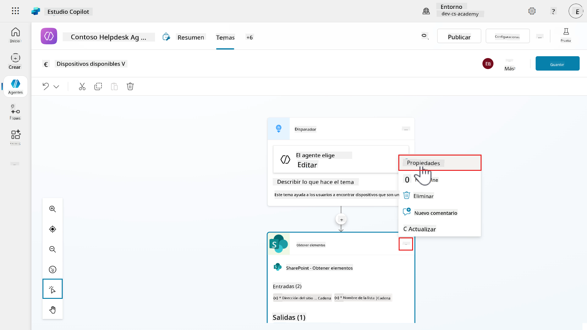

1. Aparecerá el panel de configuración de **Obtener elementos** y, por defecto, verás la pestaña **Entradas**. Selecciona la pestaña **Inicio** e ingresa una descripción en el campo **Descripción de uso**. Copia y pega lo siguiente.

    ```text
    Retrieves devices from SharePoint list
    ```

> Esto será útil cuando veamos la página _Administrar tus conexiones_ de nuestro agente. Volveremos a esto en breve.

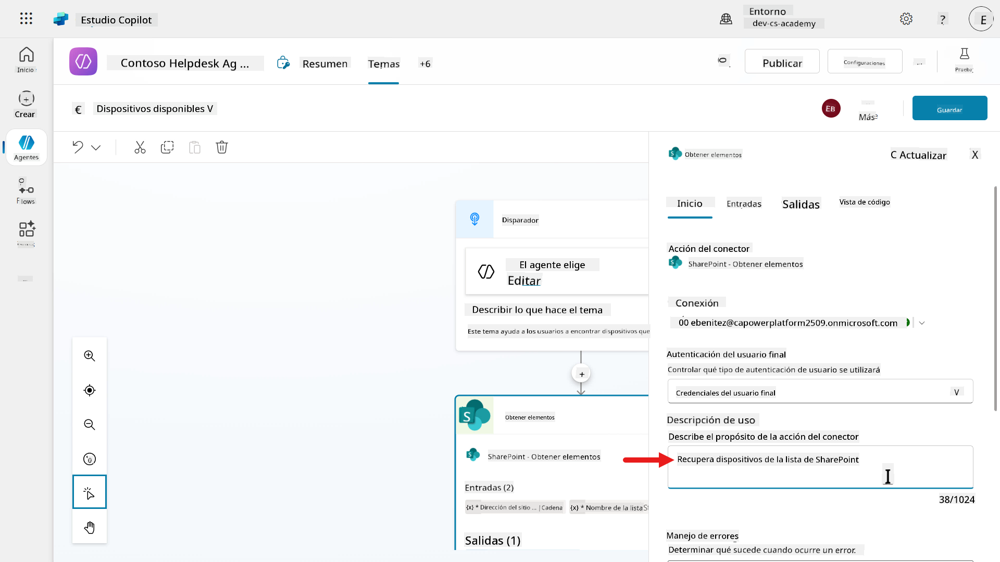

1. Selecciona la pestaña **Entradas** y selecciona el sitio **Contoso IT** y la lista **Dispositivos** que configuraste en [Lección 00 - Configuración del curso - Paso 3: Crear nuevo sitio de SharePoint](../00-course-setup/README.md#step-4-create-new-sharepoint-site).

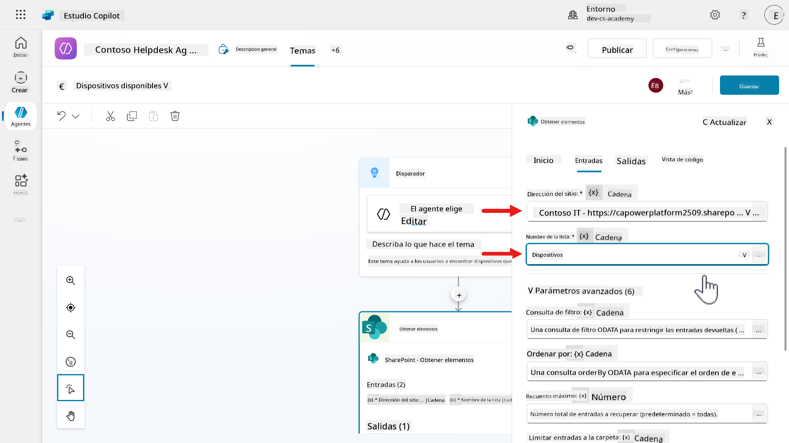

1. Ahora, para mostrar solo los dispositivos de la lista de SharePoint basados en:
   - el valor seleccionado,
   - y solo los dispositivos donde el estado sea _Disponible_,

   necesitamos aplicar un filtro. Esto se logra ingresando una consulta de filtro con la ayuda de Power Fx. Selecciona el **icono de elipsis (...)**.

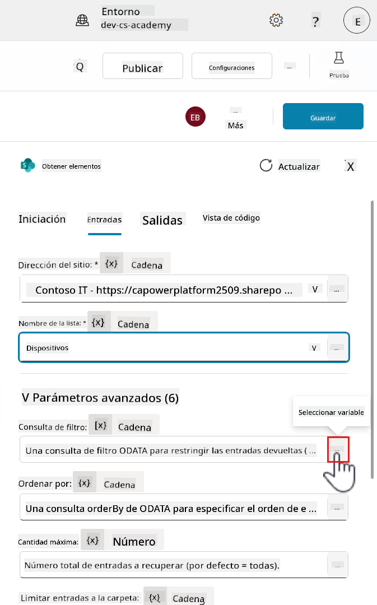

1. Por defecto, estarás en la pestaña **Personalizado**. Selecciona la pestaña **Fórmula**.

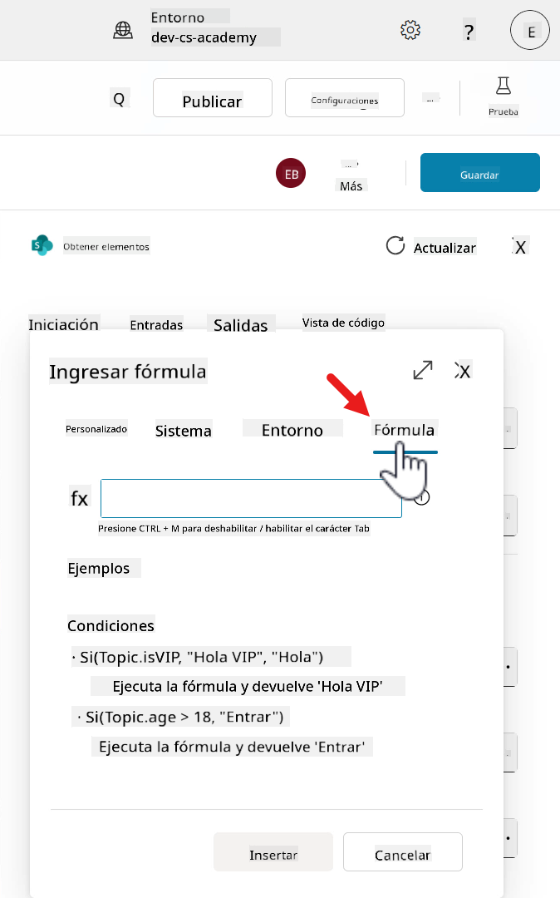

1. Selecciona el icono de **expandir** para ampliar el campo **Fórmula**. Copia y pega la siguiente expresión de Power Fx.

Estamos utilizando la función `Concatenate` para crear una expresión que filtrará:
   - la columna de SharePoint **Estado** igual a _Disponible_,
   - y la columna de SharePoint **Tipo de activo** igual al _dispositivo seleccionado del nodo de pregunta_.

    ```text
    Concatenate("Status eq 'Available' and AssetType eq '", Topic.VarDeviceType, "'")
    ```

Selecciona **Insertar**.


1. La expresión de Power Fx ahora se aplicará en el parámetro de entrada de consulta de filtro de la acción **Obtener elementos**. A continuación, selecciona la vista **Todos los elementos** en **Limitar columnas por vista**. Esto solo recuperará las columnas de la lista basadas en la vista seleccionada.

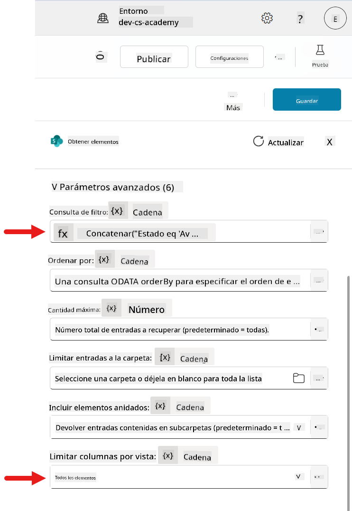

1. A continuación, actualizaremos el nombre de la variable para la salida. Selecciona la pestaña **Salidas** y selecciona la variable `GetItems`.

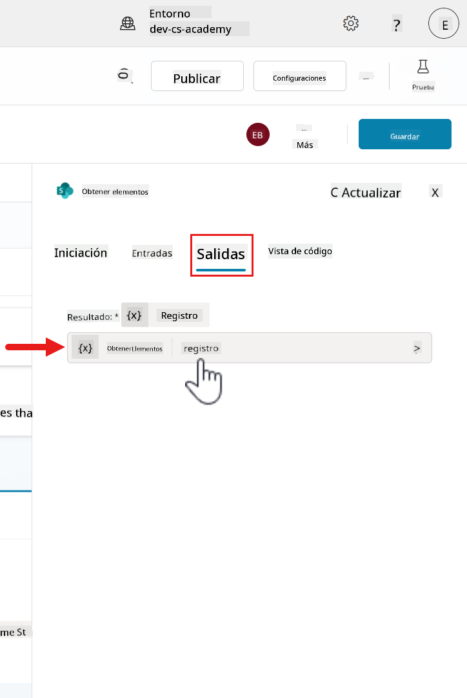

1. Actualiza el nombre a lo siguiente.

    ```text
    VarDevices
    ```

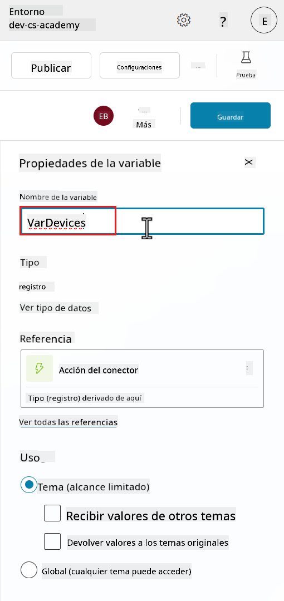

1. Desplázate hacia abajo y en la sección **Uso**, selecciona **Global**. Esto hará que la variable sea accesible por cualquier tema.

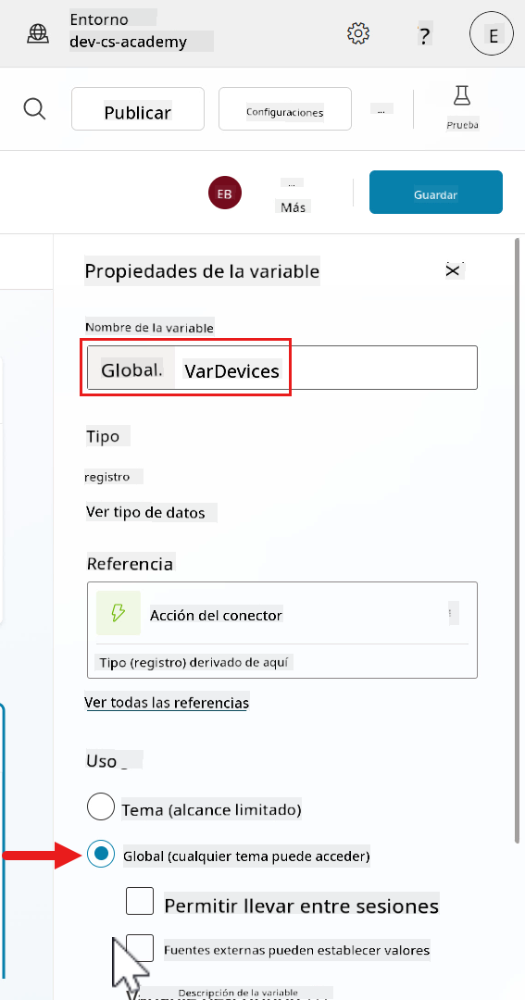

1. **Cierra** el panel de **Propiedades de la variable**.


1. Selecciona el **icono de más +** para insertar un nuevo nodo, selecciona **Gestión de variables** seguido de seleccionar **Establecer un valor de variable**.

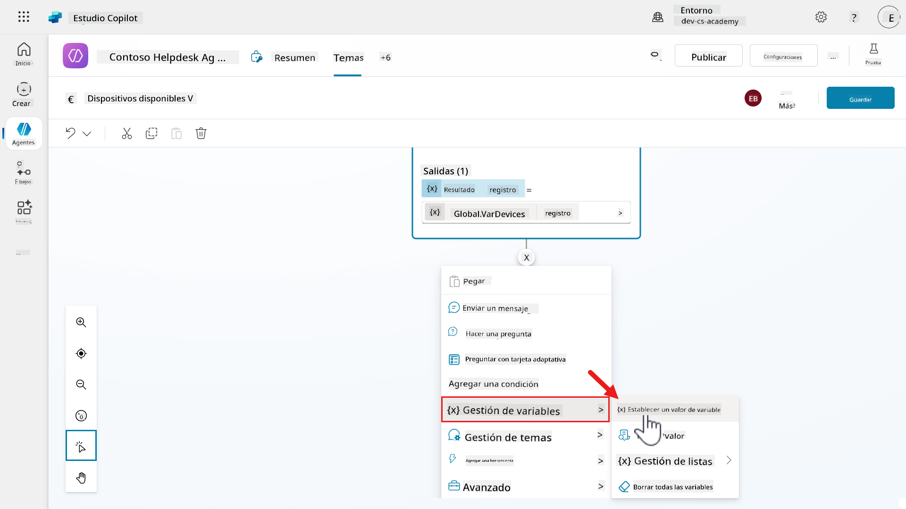

1. Selecciona el icono de **mayor que** para el parámetro de entrada **Establecer variable**.

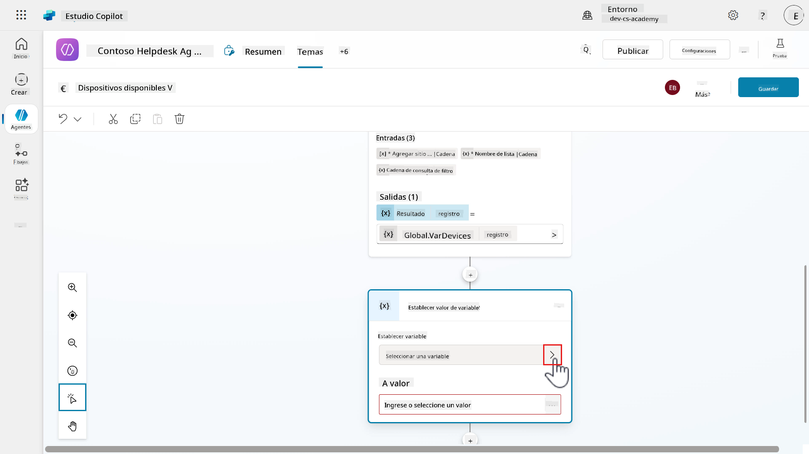

1. Selecciona la salida del tema creada anteriormente como la variable, **VarAvailableDevices**.

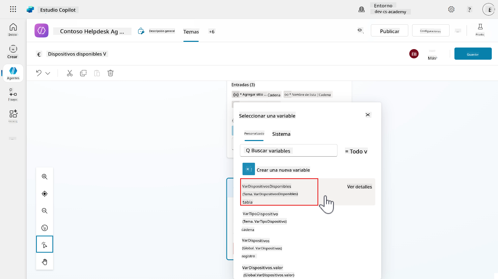

1. A continuación, selecciona el **icono de elipsis (...)** para definir el valor de la variable.

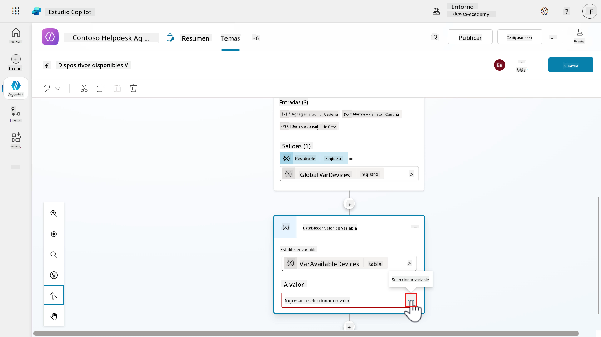

1. Ahora utilizaremos una expresión de PowerFx para establecer el valor de la variable como la propiedad `value` devuelta en la respuesta de **Obtener elementos**, y hacer que el [alcance de la variable](https://learn.microsoft.com/microsoft-copilot-studio/advanced-power-fx?WT.mc_id=power-172618-ebenitez) sea global agregando el prefijo `Global`.

Selecciona **Insertar** y **guardar** el tema.

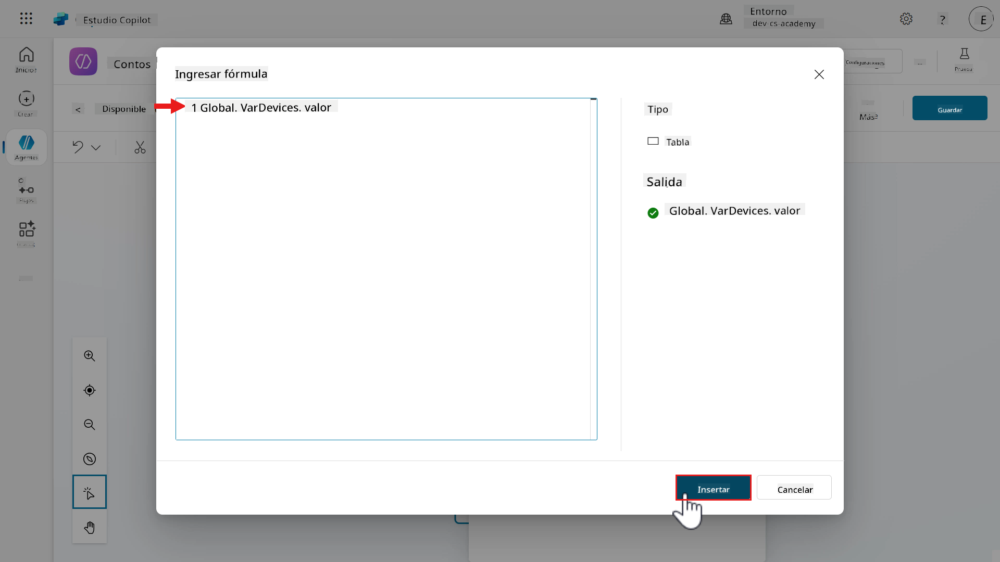

1. A continuación, necesitamos actualizar las instrucciones del agente. Selecciona la pestaña **Resumen** y selecciona **Editar**.


1. Agrega una nueva línea en las instrucciones, copia y pega lo siguiente.

    ```text
    - Help find available devices and give full details using [Available devices]. Always extract the VarDeviceType from the inputs. After giving device details, ask the user if they want to request a device from the list of available devices.
    ```

Esta instrucción guiará a la IA generativa para invocar el disparador **Dispositivos disponibles** y mostrar la lista de dispositivos disponibles de la lista **Dispositivos** de SharePoint. Selecciona el marcador de posición del tema completo entre corchetes.

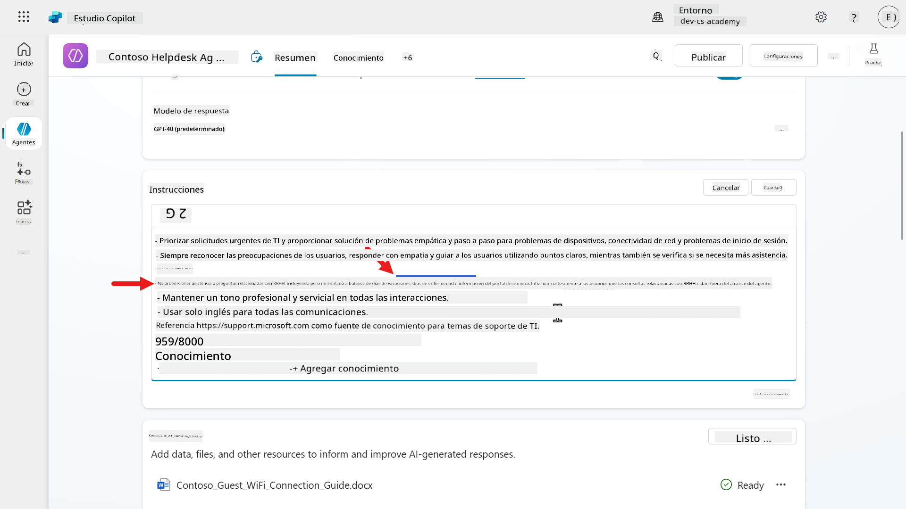

1. Escribe el carácter de barra inclinada `/` y aparecerá la lista de temas. Selecciona el tema **Dispositivos disponibles**.

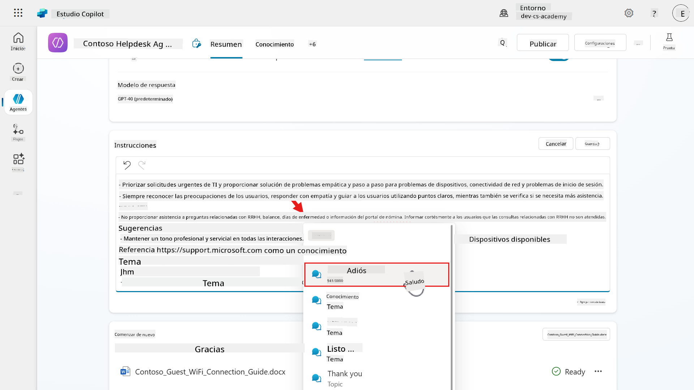

1. **Guarda** las instrucciones actualizadas.

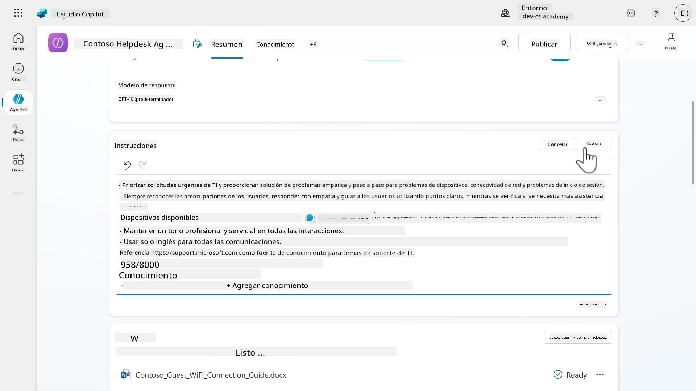

1. Ahora vamos a probar nuestro agente actualizado. Selecciona **Probar** en la parte superior derecha para mostrar el panel de prueba y **actualiza** el panel de prueba. Ingresa el siguiente mensaje al agente.

    ```text
    I need a laptop
    ```

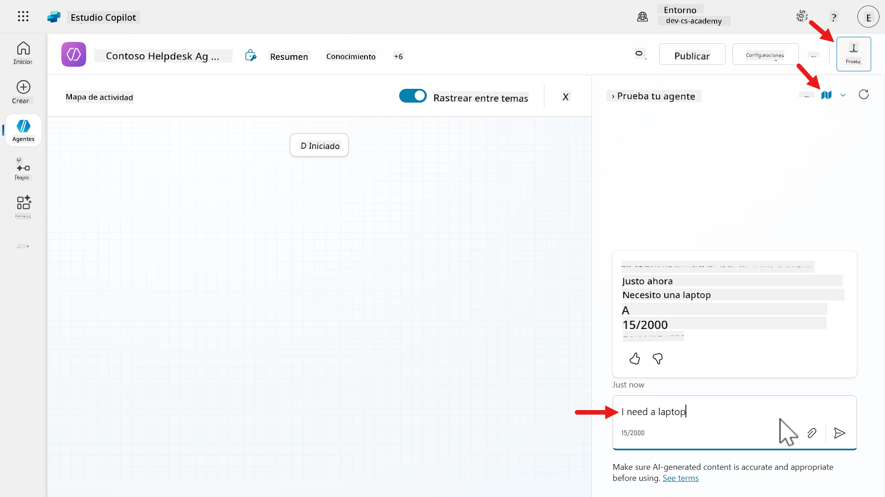

1. Antes de que el agente pueda proceder, el usuario necesita verificar que su conexión puede ser utilizada. Selecciona **Permitir**.

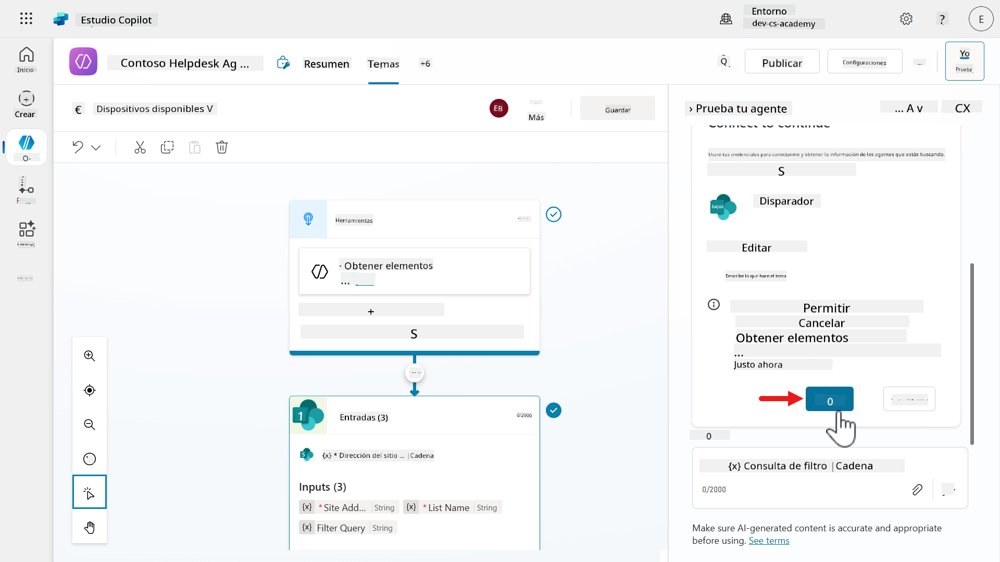

1. El agente ejecutará la herramienta de SharePoint que recupera una lista filtrada de dispositivos donde el tipo de dispositivo es "laptop" y el estado es "disponible", utilizando la expresión de Power Fx. Se devolverá una respuesta en forma de puntos para que el usuario la lea.

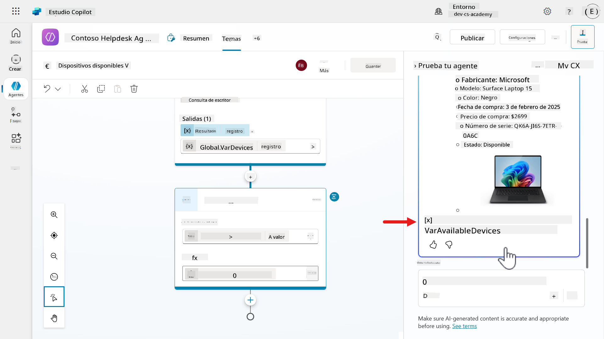

1. Una última cosa que aprender es cómo ver las conexiones utilizadas al visualizar la página _Administrar tus conexiones_ del agente. Selecciona el **icono de elipsis (...)** y selecciona **Administrar conexión**.


1. Esta página es donde podemos ver todas las conexiones utilizadas por el agente. Actualmente, solo hay una conexión listada que está asociada a la herramienta de SharePoint que se agregó al tema. Selecciona **1 herramienta** en la columna **Usado por**.

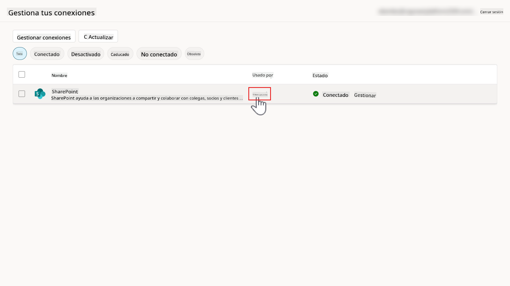

1. Aquí es donde podemos ver los detalles de la acción Obtener elementos y recordar la _descripción de uso_ que ingresamos anteriormente. Aquí es donde veremos la descripción de uso. Selecciona **Cerrar**.

> Esto nos permite saber qué acciones se utilizan y su propósito. Esto mantiene nuestras conexiones organizadas 📁.

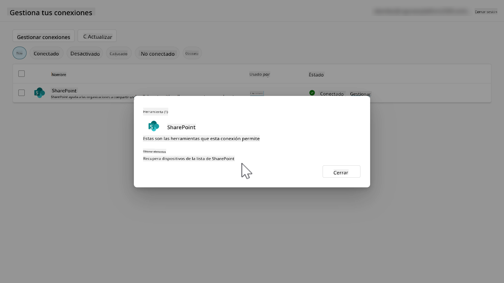

1. Regresa a tu pestaña del navegador con Copilot Studio y **actualiza** el panel de prueba para borrar la prueba.

## ✅ Misión Completa

¡Felicidades! 👏🏻 Has aprendido cómo agregar un nuevo tema desde cero, cómo agregar una herramienta que llama a la acción del conector Obtener elementos de SharePoint y usar Power Fx para filtrar la respuesta para devolver solo dispositivos donde el estado sea disponible y el tipo de dispositivo sea laptop. 🙌🏻

Este es el final de **Laboratorio 07 - Agregar un nuevo tema con nodos de conversación**, selecciona el enlace a continuación para pasar a la siguiente lección. Ampliaremos el caso de uso de este laboratorio en el laboratorio de la siguiente lección.

⏭️ [Pasar a la lección **Mejorar las interacciones del usuario con tarjetas adaptativas**](../08-add-adaptive-card/README.md)

## 📚 Recursos Tácticos

🔗 [Usar temas del sistema](https://learn.microsoft.com/microsoft-copilot-studio/authoring-system-topics?mc_id=power-172618-ebenitez)

🔗 [Temas en Microsoft Copilot Studio](https://learn.microsoft.com/microsoft-copilot-studio/guidance/topics-overview?WT.mc_id=power-172618-ebenitez)

🔗 [Establecer disparadores de temas](https://learn.microsoft.com/microsoft-copilot-studio/authoring-triggers?WT.mc_id=power-172618-ebenitez)

🔗 [Definir temas de agentes](https://learn.microsoft.com/microsoft-copilot-studio/guidance/defining-chatbot-topics?WT.mc_id=power-172618-ebenitez)

🔗 [Crear expresiones usando Power Fx](https://learn.microsoft.com/microsoft-copilot-studio/advanced-power-fx?WT.mc_id=power-172618-ebenitez)

📺 [Crear temas usando lenguaje natural](https://aka.ms/ai-in-action/copilot-studio/ep6)

📺 [Agregar acciones a agentes usando conectores](https://aka.ms/ai-in-action/copilot-studio/ep4)


---

**Descargo de responsabilidad**:  
Este documento ha sido traducido utilizando el servicio de traducción automática [Co-op Translator](https://github.com/Azure/co-op-translator). Aunque nos esforzamos por lograr precisión, tenga en cuenta que las traducciones automáticas pueden contener errores o imprecisiones. El documento original en su idioma nativo debe considerarse la fuente autorizada. Para información crítica, se recomienda una traducción profesional realizada por humanos. No nos hacemos responsables de malentendidos o interpretaciones erróneas que surjan del uso de esta traducción.