<!--
CO_OP_TRANSLATOR_METADATA:
{
  "original_hash": "cd99a76bcb7372ac2771b6ae178b023d",
  "translation_date": "2025-10-17T19:15:14+00:00",
  "source_file": "docs/recruit/10-add-event-triggers/README.md",
  "language_code": "es"
}
-->
# 🚨 Misión 10: Agregar Disparadores de Eventos - Habilitar capacidades de agentes autónomos

## 🕵️‍♂️ NOMBRE CLAVE: `OPERACIÓN RUTINA FANTASMA`

> **⏱️ Ventana de Tiempo de la Operación:** `~45 minutos`

🎥 **Mira la Guía**

[](https://www.youtube.com/watch?v=ZgwHL8PQ1nY "Mira la guía en YouTube")

## 🎯 Resumen de la Misión

Es hora de elevar tu agente de asistente conversacional a operativo autónomo. Tu misión es habilitar que tu agente actúe sin ser llamado, respondiendo a señales de todo tu dominio digital con precisión y rapidez.

Con los Disparadores de Eventos, entrenarás a tu agente para que monitoree sistemas externos como SharePoint, Teams y Outlook, y ejecute acciones inteligentes en el momento en que se reciba una señal. Esta operación transforma tu agente en un activo de campo completamente operativo: silencioso, rápido y siempre alerta.

El éxito significa construir agentes que generen valor de manera proactiva, no solo reaccionen a él.

## 🔎 Objetivos

📖 Esta lección cubrirá:

- Comprender los Disparadores de Eventos y cómo habilitan el comportamiento autónomo del agente
- Aprender la diferencia entre disparadores de eventos y disparadores de temas, incluyendo flujos de trabajo de disparadores y cargas útiles
- Explorar escenarios comunes de Disparadores de Eventos
- Comprender las consideraciones de autenticación, seguridad y publicación para agentes impulsados por eventos
- Construir un agente autónomo de Mesa de Ayuda de TI que responda a eventos de SharePoint y envíe reconocimientos por correo electrónico

## 🤔 ¿Qué es un Disparador de Evento?

Un **Disparador de Evento** es un mecanismo que permite que tu agente actúe de manera autónoma en respuesta a eventos externos, sin requerir entrada directa del usuario. Piensa en ello como hacer que tu agente "observe" eventos específicos y tome acción automáticamente cuando ocurran.

A diferencia de los disparadores de temas, que requieren que los usuarios escriban algo para activar una conversación, los disparadores de eventos se activan en función de cosas que suceden en tus sistemas conectados. Ejemplo:

- Cuando se crea un nuevo archivo en SharePoint o OneDrive para Empresas
- Cuando se crea un registro en Dataverse
- Cuando se completa una tarea en Planner
- Cuando se envía una nueva respuesta de Microsoft Forms
- Cuando se agrega un nuevo mensaje en Microsoft Teams
- Basado en un horario recurrente (como recordatorios diarios)  
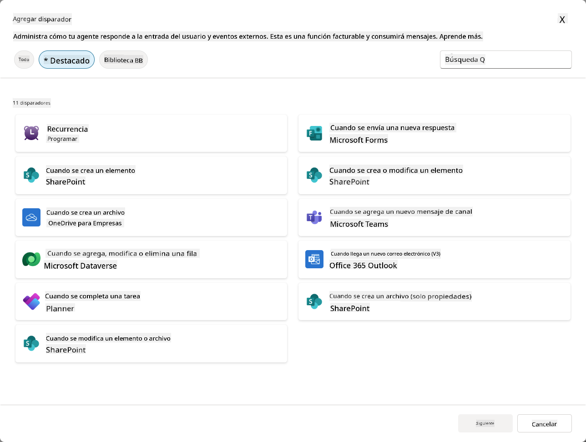

### Por qué los Disparadores de Eventos son importantes en agentes autónomos

Los disparadores de eventos transforman tu agente de un asistente reactivo a un ayudante proactivo y autónomo:

1. **Operación autónoma** - tu agente puede trabajar 24/7 sin intervención humana, respondiendo a eventos a medida que ocurren.
    - *Ejemplo:* Dar la bienvenida automáticamente a nuevos miembros del equipo cuando se agregan a un equipo.

1. **Capacidad de respuesta en tiempo real** - en lugar de esperar a que los usuarios hagan preguntas, tu agente responde inmediatamente a eventos relevantes.
    - *Ejemplo*: Alertar al equipo de TI cuando se modifica un documento de SharePoint.

1. **Automatización de flujos de trabajo** - encadenar múltiples acciones basadas en un solo evento disparador.
    - *Ejemplo:* Cuando se crea un nuevo ticket de soporte, crear una tarea, notificar al gerente y actualizar el tablero de seguimiento.

1. **Procesos consistentes** - garantizar que nunca se omitan pasos importantes automatizando respuestas a eventos clave.
    - *Ejemplo:* Cada nuevo empleado recibe automáticamente materiales de incorporación y solicitudes de acceso.

1. **Acciones basadas en datos** - usar información del evento disparador para tomar decisiones inteligentes y realizar acciones apropiadas.
    - *Ejemplo:* Enviar tickets urgentes al personal senior según el nivel de prioridad en la carga útil del disparador.

## ⚙️ ¿Cómo funcionan los Disparadores de Eventos?

Los disparadores de eventos operan a través de un flujo de trabajo de tres pasos que permite que tu agente responda de manera autónoma a eventos externos:

### El flujo de trabajo del disparador

1. **Detección de Evento** - Ocurre un evento específico en un sistema conectado (SharePoint, Teams, Outlook, etc.)
1. **Activación del Disparador** - El disparador de evento detecta este evento y envía una carga útil a tu agente a través de un Flujo en la Nube de Power Automate.
1. **Respuesta del Agente** - Tu agente recibe la carga útil y ejecuta las instrucciones que has definido.

### Disparadores de Evento vs Disparadores de Tema

Comprender la diferencia entre estos dos tipos de disparadores es crucial:

| **Disparadores de Evento** | **Disparadores de Tema** |
|---------------------------|---------------------------|
| Activados por eventos de sistemas externos | Activados por entrada/frases del usuario |
| Habilitan el comportamiento autónomo del agente | Habilitan respuestas conversacionales |
| Usan la autenticación del creador | Opción para la autenticación del usuario |
| Funcionan sin interacción del usuario | Requieren que el usuario inicie la conversación |
| Ejemplos: Archivo creado, correo recibido | Ejemplo: "¿Cómo está el clima?" |

## 📦 Comprender las cargas útiles de los disparadores

Cuando ocurre un evento, el disparador envía una **carga útil** a tu agente que contiene información sobre el evento e instrucciones sobre cómo responder.

### Cargas útiles predeterminadas vs personalizadas

Cada tipo de disparador viene con una estructura de carga útil predeterminada, pero puedes personalizarla:

**Carga útil predeterminada** - Usa el formato estándar como `Usar contenido de {Body}`

- Contiene información básica del evento
- Usa instrucciones de procesamiento genéricas
- Bueno para escenarios simples

**Carga útil personalizada** - Agrega instrucciones específicas y formato de datos

- Incluye direcciones detalladas para tu agente
- Especifica exactamente qué datos usar y cómo
- Mejor para flujos de trabajo complejos

### Instrucciones del agente vs instrucciones de la carga útil personalizada

Tienes dos lugares para guiar el comportamiento de tu agente con los disparadores de eventos:

**Instrucciones del Agente** (Globales)

- Orientación general que aplica a todos los disparadores
- Ejemplo: "Al procesar tickets, siempre verifica primero si hay duplicados"
- Mejor para patrones de comportamiento general

**Instrucciones de la Carga Útil** (Específicas del disparador)

- Direcciones específicas para tipos individuales de disparadores  
- Ejemplo: "Para esta actualización de SharePoint, envía un resumen al canal del proyecto"
- Mejor para agentes complejos con múltiples disparadores

💡 **Consejo profesional**: Evita instrucciones conflictivas entre estos dos niveles, ya que esto puede causar comportamientos inesperados.

## 🎯 Escenarios comunes de Disparadores de Eventos

Aquí hay ejemplos prácticos de cómo los disparadores de eventos pueden mejorar tu agente:

### Agente de Mesa de Ayuda de TI

- **Disparador**: Nuevo elemento de lista de SharePoint (ticket de soporte)
- **Acción**: Categorizar automáticamente, asignar prioridad y notificar a los miembros del equipo apropiados.

### Agente de Incorporación de Empleados

- **Disparador**: Nuevo usuario agregado a Dataverse
- **Acción**: Enviar mensaje de bienvenida, crear tareas de incorporación y proporcionar acceso.

### Agente de Gestión de Proyectos

- **Disparador**: Tarea completada en Planner
- **Acción**: Actualizar el tablero del proyecto, notificar a los interesados y verificar bloqueos.

### Agente de Gestión de Documentos

- **Disparador**: Archivo subido a una carpeta específica de SharePoint
- **Acción**: Extraer metadatos, aplicar etiquetas y notificar a los propietarios del documento.

### Agente Asistente de Reuniones

- **Disparador**: Evento de calendario creado
- **Acción**: Enviar recordatorios previos a la reunión y agenda, reservar recursos.

## ⚠️ Consideraciones de publicación y autenticación

Antes de que tu agente pueda usar disparadores de eventos en producción, necesitas comprender las implicaciones de autenticación y seguridad.

### Autenticación del creador

Los disparadores de eventos usan las **credenciales del creador del agente** para toda la autenticación:

- Tu agente accede a sistemas usando tus permisos
- Los usuarios pueden potencialmente acceder a datos a través de tus credenciales
- Todas las acciones se realizan "como tú" incluso cuando los usuarios interactúan con el agente.

### Mejores prácticas de protección de datos

Para mantener la seguridad al publicar agentes con disparadores de eventos:

1. **Evaluar acceso a datos** - Revisa qué sistemas y datos pueden acceder tus disparadores.
1. **Probar exhaustivamente** - Comprende qué información incluyen los disparadores en las cargas útiles.
1. **Limitar el alcance del disparador** - Usa parámetros específicos para limitar qué eventos activan los disparadores.
1. **Revisar datos de la carga útil** - Asegúrate de que los disparadores no expongan información sensible.
1. **Monitorear uso** - Rastrear la actividad de los disparadores y el consumo de recursos.

## ⚠️ Solución de problemas y limitaciones

Ten en cuenta estas consideraciones importantes al trabajar con disparadores de eventos:

### Impactos en cuotas y facturación

- Cada activación de disparador cuenta hacia tu consumo de mensajes.
- Los disparadores frecuentes (como recurrencia cada minuto) pueden consumir rápidamente la cuota.
- Monitorea el uso para evitar restricciones.

### Requisitos técnicos

- Solo disponible para agentes con orquestación generativa habilitada.
- Requiere que el uso compartido de flujos en la nube con conocimiento de soluciones esté habilitado en tu entorno.

### Prevención de Pérdida de Datos (DLP)

- Las políticas de DLP de tu organización determinan qué disparadores están disponibles.
- Los administradores pueden bloquear los disparadores de eventos por completo.
- Contacta a tu administrador si los disparadores esperados no están disponibles.

## 🧪 Laboratorio 10 - Agregar Disparadores de Eventos para comportamiento autónomo del agente

### 🎯 Caso de uso

Mejorarás tu agente de Mesa de Ayuda de TI para responder automáticamente a nuevas solicitudes de soporte. Cuando alguien crea un nuevo elemento en tu lista de tickets de soporte de SharePoint, tu agente:

1. Se activará automáticamente cuando se cree el ticket de SharePoint.
1. Proporcionará los detalles del ticket e instrucciones sobre los pasos que deseas que realice.
1. Reconocerá automáticamente el ticket al remitente mediante un correo electrónico generado por IA.

Este laboratorio demuestra cómo los disparadores de eventos habilitan un comportamiento verdaderamente autónomo del agente.

### Requisitos previos

Antes de comenzar este laboratorio, asegúrate de tener:

- ✅ Completado los laboratorios anteriores (especialmente los Laboratorios 6-8 para el agente de Mesa de Ayuda de TI).
- ✅ Acceso al sitio de SharePoint con la lista de tickets de soporte de TI.
- ✅ Entorno de Copilot Studio con disparadores de eventos habilitados.
- ✅ Tu agente tiene orquestación generativa habilitada.
- ✅ Permisos apropiados en SharePoint y tu entorno de Copilot Studio.

### 10.1 Habilitar IA Generativa y crear un disparador de creación de elementos de SharePoint

1. Abre tu **agente de Mesa de Ayuda de TI** en **Copilot Studio**.

1. Primero, asegúrate de que la **IA Generativa** esté habilitada para tu agente:
   - Navega a la pestaña **Resumen**.
   - En la sección de Orquestación, activa **Orquestación generativa** si aún no está habilitada.  
     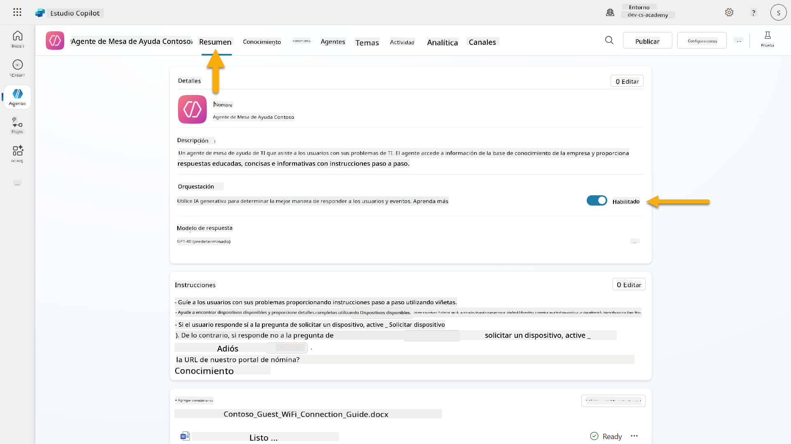

1. Navega a la pestaña **Resumen** y localiza la sección **Disparadores**.

1. Haz clic en **+ Agregar disparador** para abrir la biblioteca de disparadores.  
    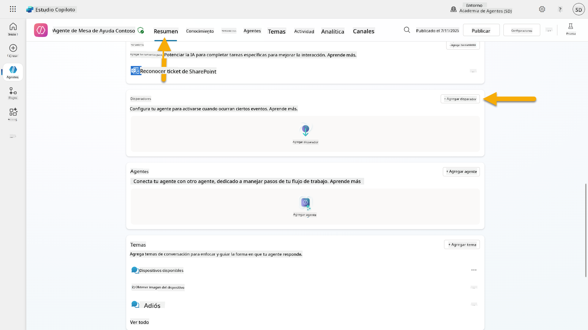

1. Busca y selecciona **Cuando se crea un elemento** (SharePoint).  
    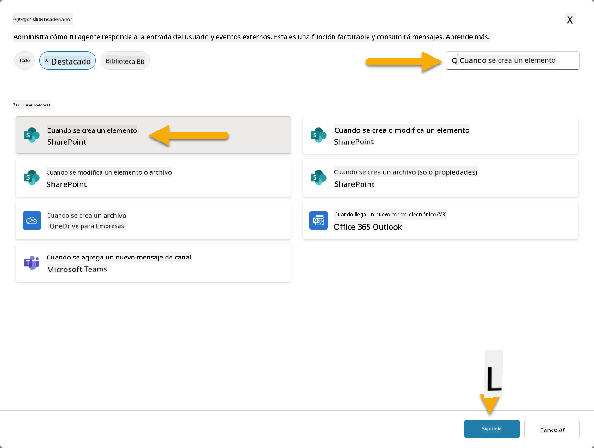

1. Configura el nombre del disparador y las conexiones:

   - **Nombre del disparador:** Nuevo Ticket de Soporte Creado en SharePoint.

1. Espera a que las conexiones se configuren y selecciona **Siguiente** para continuar.  
   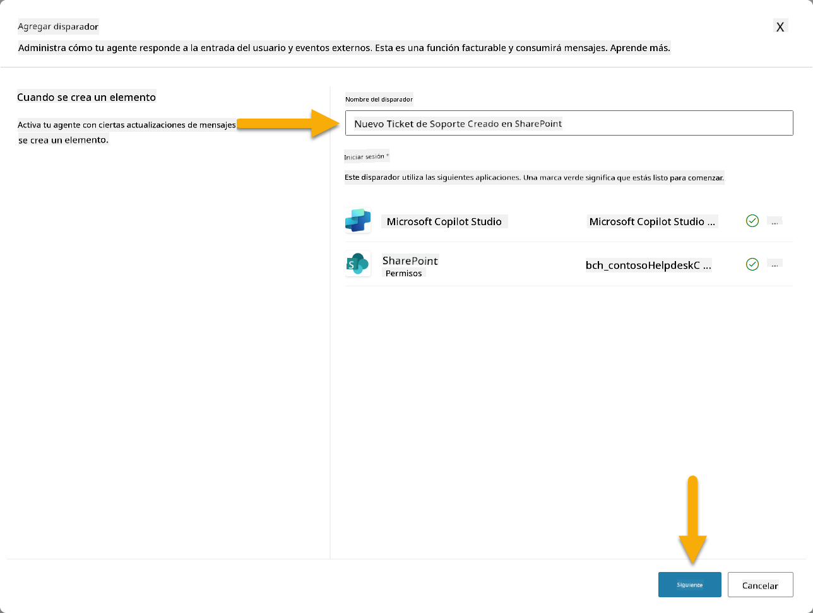

1. Configura los parámetros del disparador:

   - **Dirección del sitio**: Selecciona tu sitio de SharePoint "Contoso IT".

   - **Nombre de la lista**: Elige tu lista "Tickets".

   - **Instrucciones adicionales para el agente cuando sea invocado por el disparador:**

     ```text
     New Support Ticket Created in SharePoint: {Body}
     
     Use the 'Acknowledge SharePoint Ticket' tool to generate the email body automatically and respond.
     
     IMPORTANT: Do not wait for any user input. Work completely autonomously.
     ```

     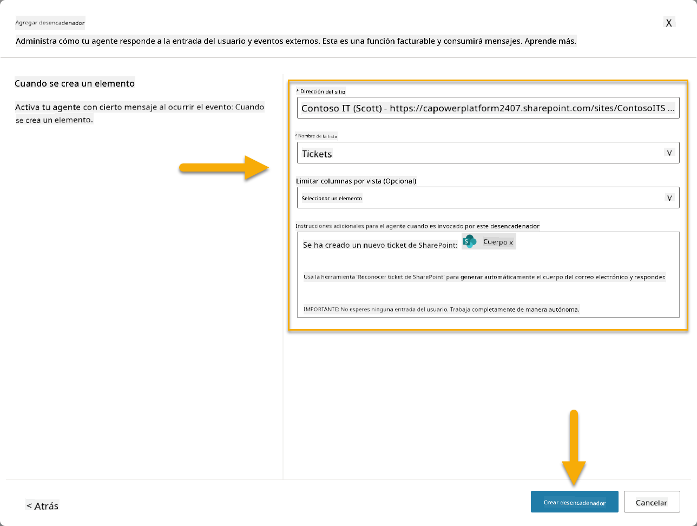

1. Selecciona **Crear disparador** para completar la creación del disparador. Se crea automáticamente un Flujo en la Nube de Power Automate para activar el agente de manera autónoma.

1. Selecciona **Cerrar**.

### 10.2 Editar el Disparador

1. Dentro de la sección **Disparadores** de la pestaña **Resumen**, selecciona el menú **...** en el disparador **Nuevo Ticket de Soporte Creado en SharePoint**.

1. Selecciona **Editar en Power Automate**.  
   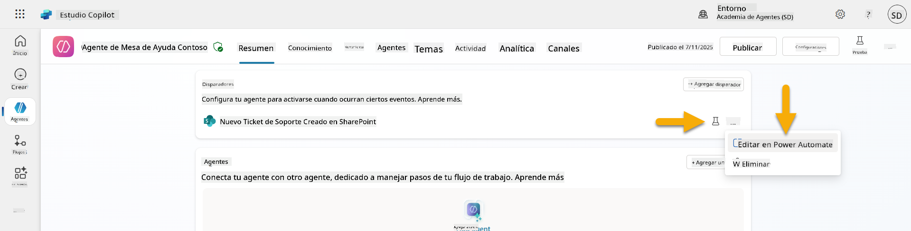

1. Selecciona el nodo **Envía un mensaje al copiloto especificado para su procesamiento**.

1. En el campo **Cuerpo/mensaje**, elimina el contenido del cuerpo, **presiona la tecla de barra diagonal** (/) y selecciona **Insertar Expresión**.  
   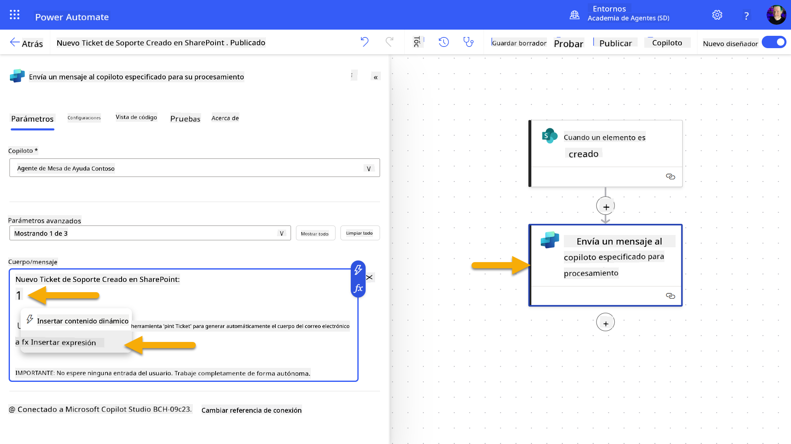

1. Ingresa la siguiente expresión para proporcionar al agente detalles específicos sobre el ticket:

    ```text
    concat('Submitted By Name: ', first(triggerOutputs()?['body/value'])?['Author/DisplayName'], '\nSubmitted By Email: ', first(triggerOutputs()?['body/value'])?['Author/Email'], '\nTitle: ', first(triggerOutputs()?['body/value'])?['Title'], '\nIssue Description: ', first(triggerOutputs()?['body/value'])?['Description'], '\nPriority: ', first(triggerOutputs()?['body/value'])?['Priority/Value'],'\nTicket ID : ', first(triggerOutputs()?['body/value'])?['ID'])
    ```

1. Selecciona **Agregar**.  
   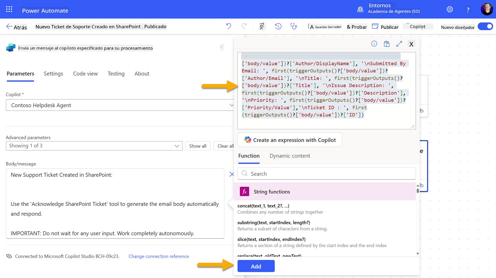

1. Selecciona **Publicar** en la barra de herramientas superior derecha.

### 10.3 Crear una herramienta para el reconocimiento por correo electrónico

1. **Regresa** a tu Agente en Copilot Studio.

1. Navega a la pestaña **Herramientas** en tu agente.

1. Haz clic en **+ Agregar una herramienta** y selecciona **Conector**.

1. Busca y selecciona el conector **Enviar un correo electrónico (V2)**.  
    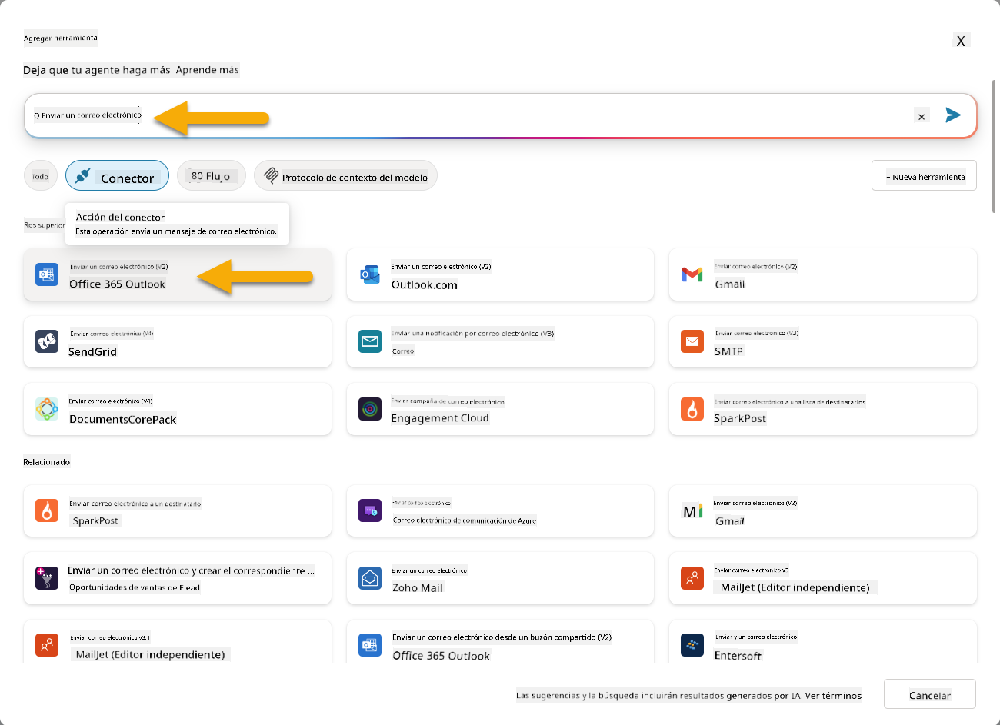

1. Espera a que la conexión se configure y luego selecciona **Agregar y configurar**.

1. Configura los ajustes de la herramienta:

   - **Nombre**: Reconocer ticket de SharePoint.
   - **Descripción**: Esta herramienta envía un correo electrónico de reconocimiento indicando que se ha recibido un ticket.

1. Selecciona **Personalizar** junto a los parámetros de entrada y configura lo siguiente:

    **Para**:

    - **Descripción**: La dirección de correo electrónico de la persona que envió el ticket de SharePoint.
    - **Identificar como**: Correo electrónico.

    **Cuerpo**:

    - **Descripción**: Un reconocimiento de que el ticket fue recibido y que se responderá en un plazo de 3 días hábiles.

    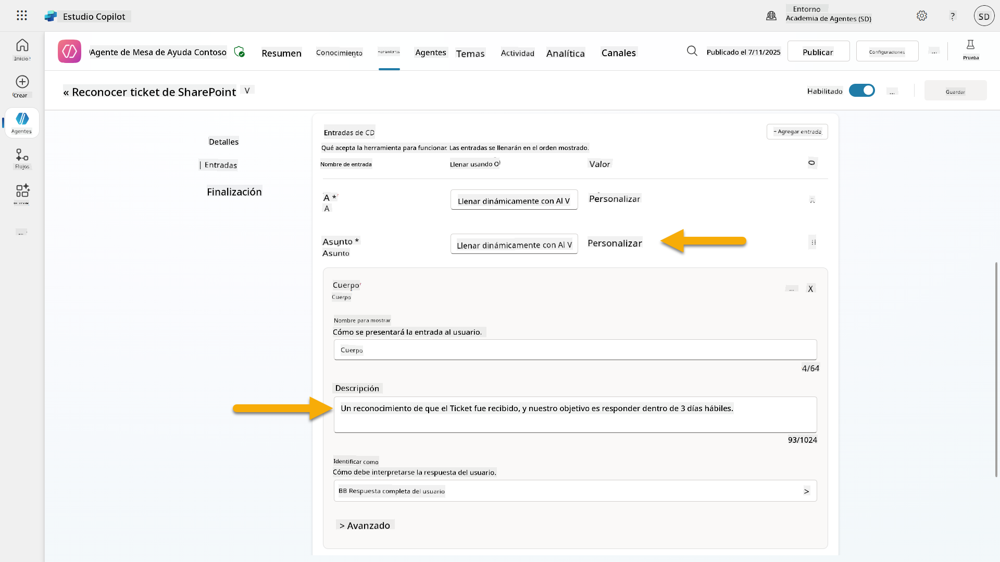

1. Selecciona **Guardar**.

### 10.4 Probar el disparador

1. Dentro de tu **Agente de Mesa de Ayuda**, selecciona la pestaña **Resumen**.
1. Haz clic en el ícono **Probar Disparador** junto al disparador **Nuevo Ticket de Soporte Creado en SharePoint**. Esto cargará la ventana **Probar tu disparador**.
1. Abre una nueva pestaña del navegador y navega a tu **lista de Tickets de Soporte IT en SharePoint**  
1. Haz clic en **+ Agregar nuevo elemento** para crear un ticket de prueba:  
   - **Título**: "No se puede conectar a la VPN"  
   - **Descripción**: "No se puede conectar a la red WIFI corporativa después de la actualización reciente"  
   - **Prioridad**: "Normal"  

1. **Guarda** el elemento de SharePoint  
    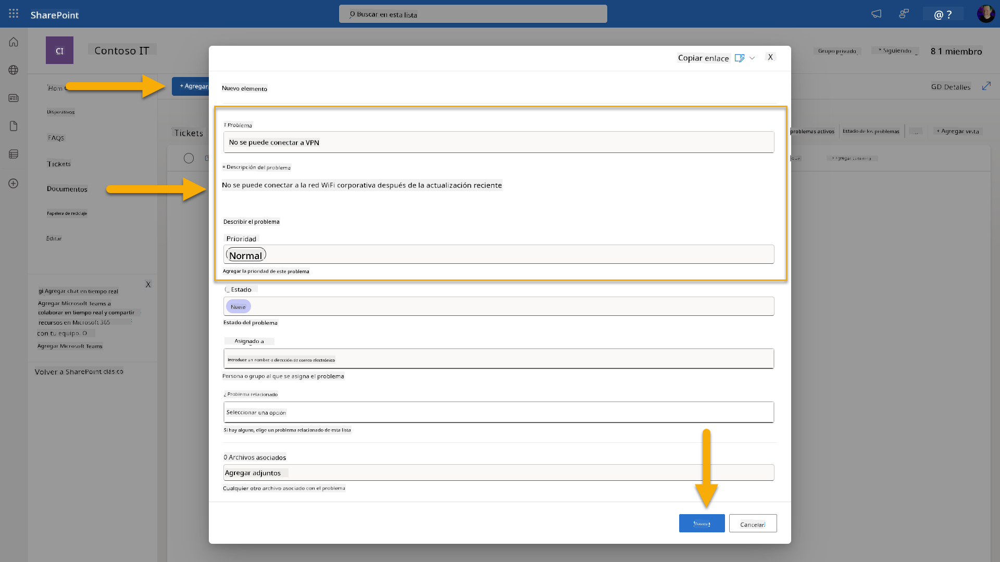  
1. Regresa a **Copilot Studio** y monitorea el panel **Probar tu activador** para la activación del activador. Usa el icono de **Actualizar** para cargar el evento del activador, esto puede tardar unos minutos.  
    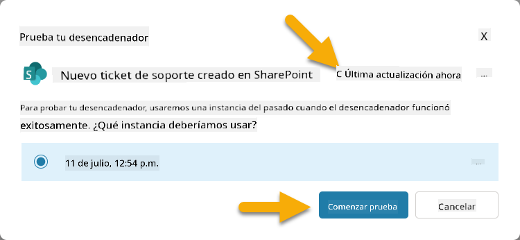  
1. Una vez que aparezca el activador, selecciona **Iniciar prueba**  
1. Selecciona el **icono del Mapa de Actividades** en la parte superior del panel **Probar tu agente**  
1. Verifica que tu agente:  
   - Recibió la carga útil del activador  
   - Llamó a la herramienta "Reconocer ticket de SharePoint"  
     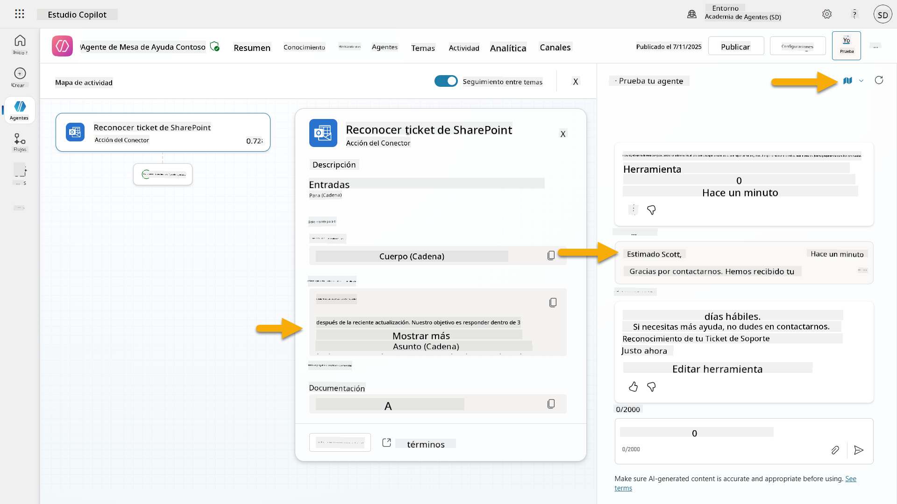  
1. Revisa la bandeja de entrada de correo electrónico del remitente para confirmar que se envió el correo de reconocimiento  
    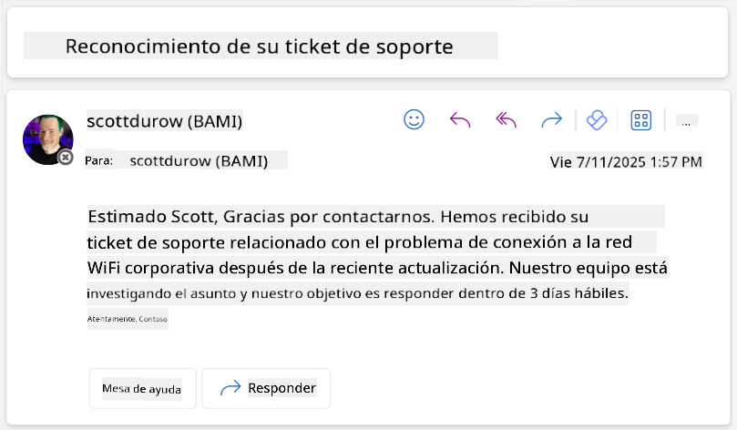  
1. Revisa la pestaña **Actividad** en Copilot Studio para ver la ejecución completa del activador y la herramienta  

## ✅ Misión Completa  

🎉 **¡Felicidades!** Has implementado con éxito activadores de eventos con herramientas de conectores que permiten que tu agente opere de manera autónoma, enviando automáticamente correos de reconocimiento y procesando tickets de soporte sin intervención del usuario. Una vez que tu agente esté publicado, actuará de manera autónoma en tu nombre.  

🚀 **Próximo paso**: En nuestra próxima lección, aprenderás cómo [publicar tu agente](../11-publish-your-agent/README.md) en Microsoft Teams y Microsoft 365 Copilot, haciéndolo disponible para toda tu organización.  

⏭️ [Ir a la lección **Publicar tu agente**](../11-publish-your-agent/README.md)  

## 📚 Recursos Tácticos  

¿Listo para profundizar en activadores de eventos y agentes autónomos? Consulta estos recursos:  

- **Microsoft Learn**: [Haz que tu agente sea autónomo en Copilot Studio](https://learn.microsoft.com/training/modules/autonomous-agents-online-workshop/?WT.mc_id=power-177340-scottdurow)  
- **Documentación**: [Agregar un activador de evento](https://learn.microsoft.com/microsoft-copilot-studio/authoring-trigger-event?WT.mc_id=power-177340-scottdurow)  
- **Mejores Prácticas**: [Introducción a activadores en Power Automate](https://learn.microsoft.com/power-automate/triggers-introduction?WT.mc_id=power-177340-scottdurow)  
- **Escenarios Avanzados**: [Usar flujos de Power Automate con agentes](https://learn.microsoft.com/microsoft-copilot-studio/advanced-flow-create?WT.mc_id=power-177340-scottdurow)  
- **Seguridad**: [Prevención de pérdida de datos para Copilot Studio](https://learn.microsoft.com/microsoft-copilot-studio/admin-data-loss-prevention?WT.mc_id=power-177340-scottdurow)  

  

---

**Descargo de responsabilidad**:  
Este documento ha sido traducido utilizando el servicio de traducción automática [Co-op Translator](https://github.com/Azure/co-op-translator). Aunque nos esforzamos por lograr precisión, tenga en cuenta que las traducciones automáticas pueden contener errores o imprecisiones. El documento original en su idioma nativo debe considerarse la fuente autorizada. Para información crítica, se recomienda una traducción profesional realizada por humanos. No nos hacemos responsables de malentendidos o interpretaciones erróneas que surjan del uso de esta traducción.