<!--
CO_OP_TRANSLATOR_METADATA:
{
  "original_hash": "9dceeba2eae2bb73e328602a060eddab",
  "translation_date": "2025-10-17T19:05:01+00:00",
  "source_file": "docs/recruit/11-publish-your-agent/README.md",
  "language_code": "es"
}
-->
# 🚨 Misión 11: Publica tu Agente

## 🕵️‍♂️ NOMBRE CLAVE: `OPERACIÓN PUBLICAR PUBLICAR PUBLICAR`

> **⏱️ Ventana de Tiempo de la Operación:** `~30 minutos`  

🎥 **Mira el Tutorial**

[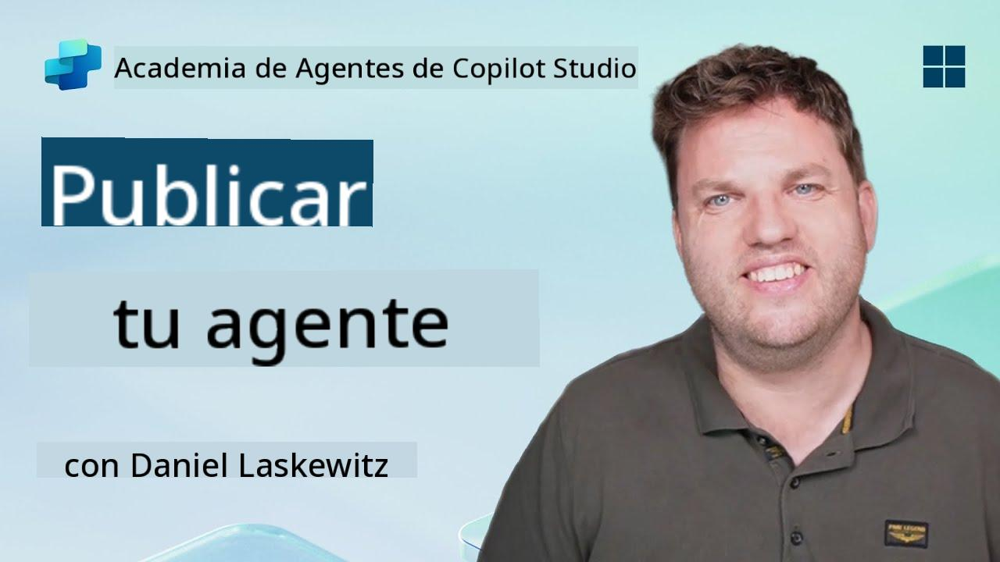](https://www.youtube.com/watch?v=eVZmljhYlSI "Mira el tutorial en YouTube")

## 🎯 Resumen de la Misión

Después de completar una serie de módulos desafiantes, Creador de Agentes, ahora estás listo para el paso más crítico: publicar tu agente. Es hora de hacer que tu creación esté disponible para los usuarios en Microsoft Teams y Microsoft 365 Copilot.

Tu agente, equipado con una misión clara, herramientas poderosas y acceso a fuentes de conocimiento clave, está listo para servir. Usando Microsoft Copilot Studio, despliegas tu agente para que comience a asistir a usuarios reales, justo donde trabajan.

Lanzemos tu agente en acción.

## 🔎 Objetivos

📖 Esta lección cubre:

1. Por qué es importante publicar tu agente
1. Qué sucede cuando publicas tu agente
1. Cómo agregar un canal (Microsoft Teams y Microsoft 365 Copilot)
1. Cómo agregar el agente en Microsoft Teams
1. Cómo hacer que el agente esté disponible en Microsoft Teams para toda tu organización

## 🚀 Publica un agente

Cada vez que trabajas en un agente en Copilot Studio, puedes actualizarlo añadiendo conocimiento o herramientas. Cuando estés listo con todos los cambios y hayas probado todo a fondo, estarás listo para publicarlo. Publicar asegura que las actualizaciones más recientes estén activas. Si actualizas tu agente con nuevas herramientas y no presionas el botón de publicar, aún no estará disponible para los usuarios finales.

Asegúrate de presionar siempre el botón de publicar cuando desees que las actualizaciones lleguen a los usuarios de tu agente. Tu agente puede tener canales añadidos y, al presionar publicar, las actualizaciones estarán disponibles para todos los canales que hayas agregado al agente.

## ⚙️ Configura canales

Los canales determinan dónde tus usuarios pueden acceder e interactuar con tu agente. Después de publicar tu agente, puedes hacerlo disponible en múltiples canales. Cada canal puede mostrar el contenido de tu agente de manera diferente.

Puedes agregar tu agente a los siguientes canales:

- **Microsoft Teams y Microsoft 365 Copilot** - Haz que tu agente esté disponible en chats y reuniones de Teams, y dentro de las experiencias de Microsoft 365 Copilot ([Más información](https://learn.microsoft.com/microsoft-copilot-studio/publication-add-bot-to-microsoft-teams))
- **Sitio web de demostración** - Prueba tu agente en un sitio web de demostración proporcionado por Copilot Studio ([Más información](https://learn.microsoft.com/microsoft-copilot-studio/publication-connect-bot-to-web-channels))
- **Sitio web personalizado** - Inserta tu agente directamente en tu propio sitio web ([Más información](https://learn.microsoft.com/microsoft-copilot-studio/publication-connect-bot-to-web-channels))
- **Aplicación móvil** - Integra tu agente en una aplicación móvil personalizada ([Más información](https://learn.microsoft.com/microsoft-copilot-studio/publication-connect-bot-to-custom-application))
- **SharePoint** - Agrega tu agente a sitios de SharePoint para asistencia con documentos y sitios ([Más información](https://learn.microsoft.com/microsoft-copilot-studio/publication-add-bot-to-sharepoint))
- **Facebook Messenger** - Conéctate con usuarios a través de la plataforma de mensajería de Facebook ([Más información](https://learn.microsoft.com/microsoft-copilot-studio/publication-add-bot-to-facebook))
- **Power Pages** - Integra tu agente en sitios web de Power Pages ([Más información](https://learn.microsoft.com/microsoft-copilot-studio/publication-add-bot-to-power-pages))
- **Canales de Azure Bot Service** - Accede a canales adicionales como Slack, Telegram, Twilio SMS y más ([Más información](https://learn.microsoft.com/microsoft-copilot-studio/publication-connect-bot-to-azure-bot-service-channels))

Para agregar un canal, navega a la pestaña **Canales** en tu agente y selecciona el canal que deseas configurar. Cada canal tiene requisitos específicos de configuración y puede requerir pasos adicionales de autenticación o configuración.

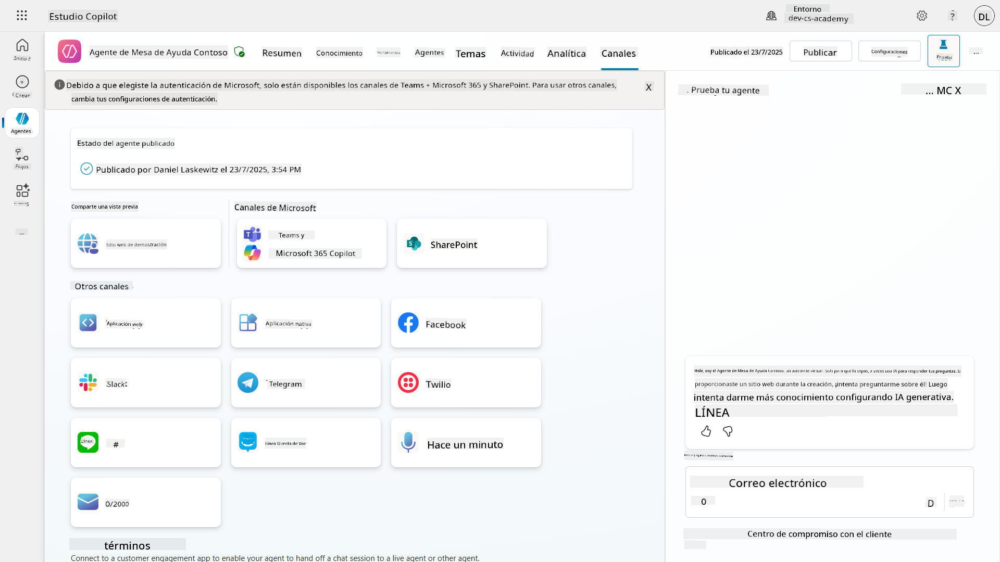

## 📺 Experiencias de los canales

Diferentes canales tienen diferentes experiencias de usuario. Al construir un agente para múltiples canales, asegúrate de estar al tanto de las diferencias por canal. Siempre es una buena estrategia probar tu agente en múltiples canales para verificar si realmente hace lo que pretendías.

| Experiencia                        | Sitio web     | Teams y Microsoft 365 Copilot         | Facebook                 | Dynamics Omnichannel para Servicio al Cliente              |
| --------------------------------- | ------------- | ------------------------------------- | ------------------------ | ---------------------------------------------------------- |
| [Encuesta de satisfacción del cliente][1] | Tarjeta adaptativa | Solo texto                             | Solo texto              | Solo texto                                                 |
| [Opciones de selección múltiple][1] | Compatible    | [Compatible hasta seis (como tarjeta hero)][4] | [Compatible hasta 13][6] | [Parcialmente compatible][8]                               |
| [Markdown][2]                     | Compatible    | [Parcialmente compatible][5]          | [Parcialmente compatible][7] | [Parcialmente compatible][9]                               |
| [Mensaje de bienvenida][1]        | Compatible    | Compatible                             | No compatible           | Compatible para [Chat][10]. No compatible para otros canales. |
| [¿Quisiste decir?][3]             | Compatible    | Compatible                             | Compatible              | Compatible para [Microsoft Teams][11], [Chat][10], Facebook y canales de solo texto (servicio de mensajes cortos (SMS) vía [TeleSign][12] y [Twilio][13], [WhatsApp][14], [WeChat][15] y [Twitter][16]). Las acciones sugeridas se presentan como una lista de solo texto; los usuarios deben volver a escribir una opción para responder. |

[1]: https://learn.microsoft.com/microsoft-copilot-studio/authoring-create-edit-topics
[2]: https://daringfireball.net/projects/markdown/
[3]: https://learn.microsoft.com/microsoft-copilot-studio/advanced-ai-features
[4]: https://learn.microsoft.com/microsoftteams/platform/concepts/cards/cards-reference#hero-card
[5]: https://learn.microsoft.com/microsoftteams/platform/bots/how-to/format-your-bot-messages#text-only-messages
[6]: https://developers.facebook.com/docs/messenger-platform/send-messages/quick-replies/
[7]: https://www.facebook.com/help/147348452522644?helpref=related
[8]: https://learn.microsoft.com/dynamics365/customer-service/asynchronous-channels#suggested-actions-support
[9]: https://learn.microsoft.com/dynamics365/customer-service/asynchronous-channels#preview-support-for-formatted-messages
[10]: https://learn.microsoft.com/dynamics365/customer-service/set-up-chat-widget
[11]: https://learn.microsoft.com/dynamics365/customer-service/configure-microsoft-teams
[12]: https://learn.microsoft.com/dynamics365/customer-service/configure-sms-channel
[13]: https://learn.microsoft.com/dynamics365/customer-service/configure-sms-channel-twilio
[14]: https://learn.microsoft.com/dynamics365/customer-service/configure-whatsapp-channel
[15]: https://learn.microsoft.com/dynamics365/customer-service/configure-wechat-channel
[16]: https://learn.microsoft.com/dynamics365/customer-service/configure-twitter-channel

> [!NOTE]
> Hay algunos ejemplos de cómo puedes usar lógica diferente para diferentes canales. Un ejemplo de esto se puede encontrar en el repositorio de Power Platform Snippets:
>
> Henry Jammes compartió un ejemplo de cómo mostrar una tarjeta adaptativa diferente cuando el canal es Microsoft Teams. ([Enlace al ejemplo](https://github.com/pnp/powerplatform-snippets/blob/main/copilot-studio/multiple-topics-matched-topic/source/multiple-topics-matched.yaml#L40))

## 🧪 Laboratorio 11: Publica tu agente en Teams y Microsoft 365 Copilot

### 🎯 Caso de uso

Tu agente de soporte técnico de Contoso IT ahora está completamente configurado con capacidades poderosas: puede acceder a fuentes de conocimiento de SharePoint, crear tickets de soporte, enviar notificaciones proactivas y responder inteligentemente a las consultas de los usuarios. Sin embargo, todas estas funciones actualmente solo están disponibles en el entorno de desarrollo donde las construiste.

**El desafío:** Los usuarios finales no pueden beneficiarse de las capacidades de tu agente hasta que esté correctamente publicado y accesible a través de los canales donde realmente trabajan.

**La solución:** Publicar tu agente asegura que la última versión, con todas tus actualizaciones recientes, nuevos temas, fuentes de conocimiento mejoradas y flujos configurados, esté disponible para usuarios reales. Sin publicar, los usuarios seguirían interactuando con una versión anterior de tu agente que podría carecer de funcionalidades críticas.

Agregar el canal de Teams y Microsoft 365 Copilot es igualmente crucial porque:

- **Integración con Teams**: Los empleados de tu organización pasan la mayor parte de su día en Microsoft Teams colaborando, en reuniones y comunicándose. Al agregar tu agente a Teams, los usuarios pueden obtener soporte técnico sin salir de su entorno de trabajo principal.

- **Microsoft 365 Copilot**: Los usuarios pueden acceder a tu agente especializado de soporte técnico directamente dentro de su experiencia de Microsoft 365 Copilot, integrándolo perfectamente en su flujo de trabajo diario en las aplicaciones de Office.

- **Acceso centralizado**: En lugar de recordar sitios web o aplicaciones separadas, los usuarios pueden acceder al soporte técnico a través de las plataformas que ya están utilizando, reduciendo la fricción y aumentando la adopción.

Esta misión transforma tu trabajo de desarrollo en una solución lista para producción que ofrece un valor real a los usuarios finales de tu organización.

### Requisitos previos

Antes de comenzar este laboratorio, asegúrate de tener:

- ✅ Completado los laboratorios anteriores y tener un agente de soporte técnico de Contoso completamente configurado
- ✅ Tu agente ha sido probado y está listo para uso en producción
- ✅ Permisos en tu entorno de Copilot Studio para publicar agentes
- ✅ Acceso a Microsoft Teams en tu organización

### 11.1 Publica tu agente

Ahora que todo nuestro trabajo en el agente está terminado, debemos asegurarnos de que todo esté disponible para los usuarios finales que van a usar nuestro agente. Para asegurarnos de que el contenido esté disponible para todos los usuarios, necesitamos publicar nuestro agente.

1. Ve al agente de soporte técnico de Contoso en Copilot Studio (a través del [portal de creación de Copilot Studio](https://copilotstudio.microsoft.com))

    En Copilot Studio, es fácil publicar tu agente. Solo necesitas seleccionar el botón de publicar en la parte superior de la vista general del agente.

    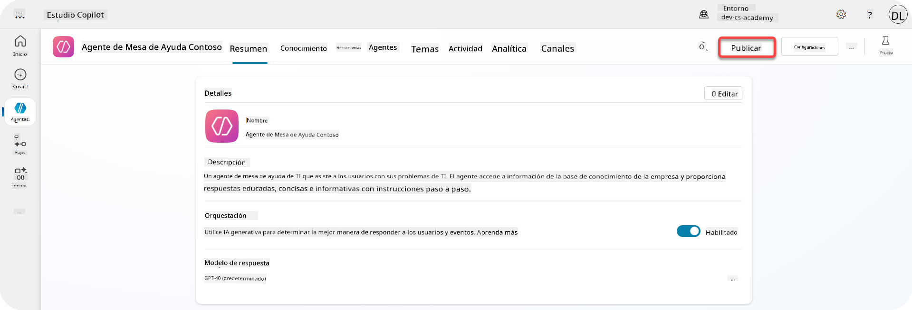

1. Selecciona el botón **Publicar** en tu agente

    Se abrirá una ventana emergente de publicación para confirmar que realmente deseas publicar tu agente.

    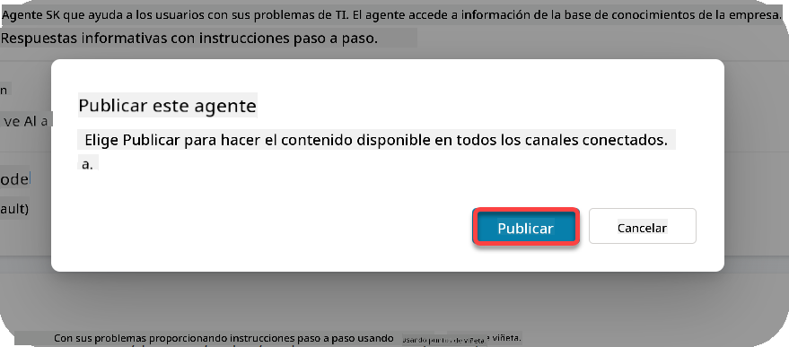

1. Selecciona **Publicar** para confirmar la publicación de tu agente

    Ahora aparece un mensaje indicando que tu agente se está publicando. No necesitas mantener esa ventana emergente abierta. Recibirás una notificación cuando el agente esté publicado.

    

    Cuando el agente haya terminado de publicarse, verás la notificación en la parte superior de la página del agente.

    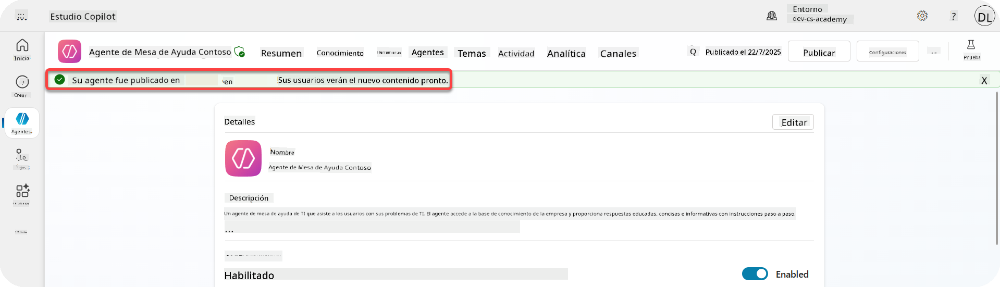

Pero - solo hemos publicado el agente, aún no lo hemos agregado a un canal, ¡así que arreglemos eso ahora!

### 11.2 Agrega el canal de Teams y Microsoft 365 Copilot

1. Para agregar el canal de Teams y Microsoft 365 Copilot a nuestro agente, necesitamos seleccionar **Canal** en la navegación superior del agente

    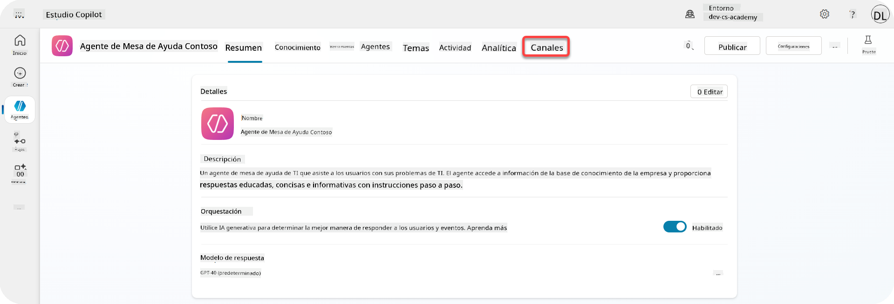

    Aquí podemos ver todos los canales que podemos agregar a este agente.

1. Selecciona **Teams y Microsoft 365**

    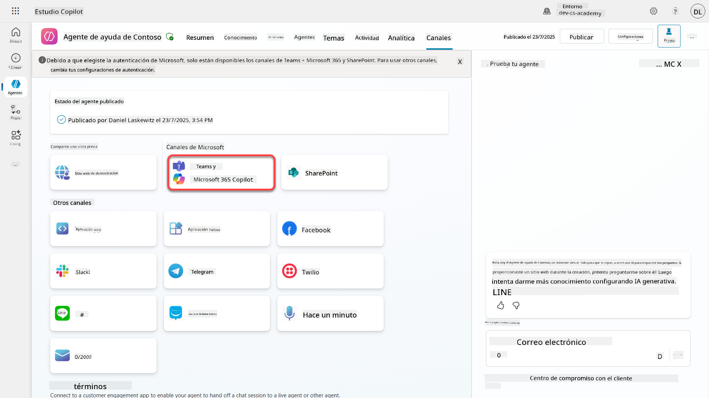

1. Selecciona **Agregar canal** para completar el asistente y agregar el canal al agente

    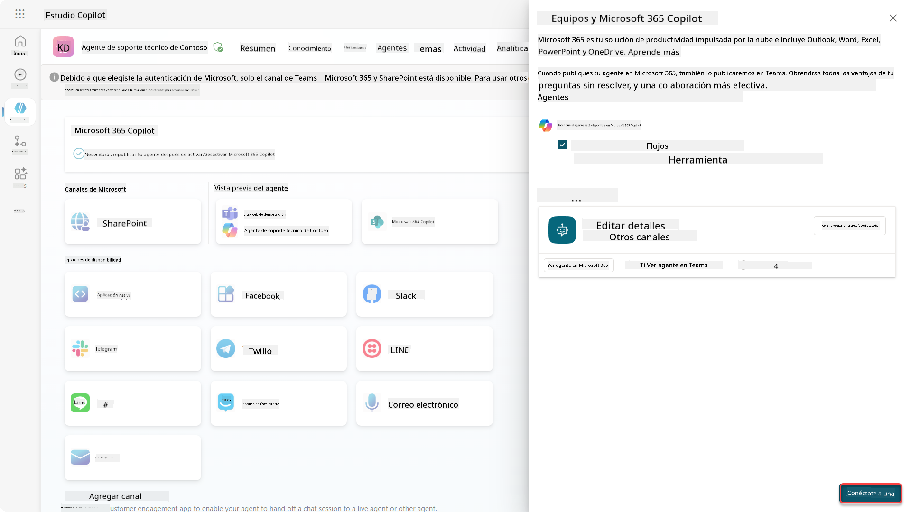

    Esto tomará un poco de tiempo hasta que se agregue. Después de que se haya agregado, aparecerá una notificación verde en la parte superior de la barra lateral.

    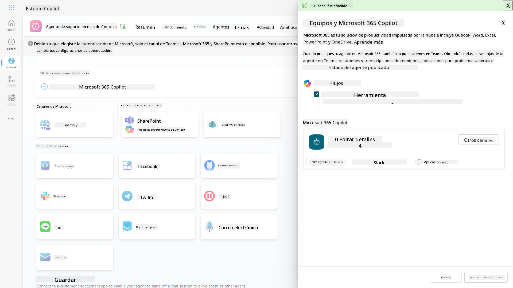

1. Selecciona **Ver agente en Teams** para abrir una nueva pestaña

    

1. Selecciona **Agregar** para agregar el agente de soporte técnico de Contoso a Teams

    

    Esto debería tomar un poco de tiempo. Después debería mostrar la siguiente pantalla:

    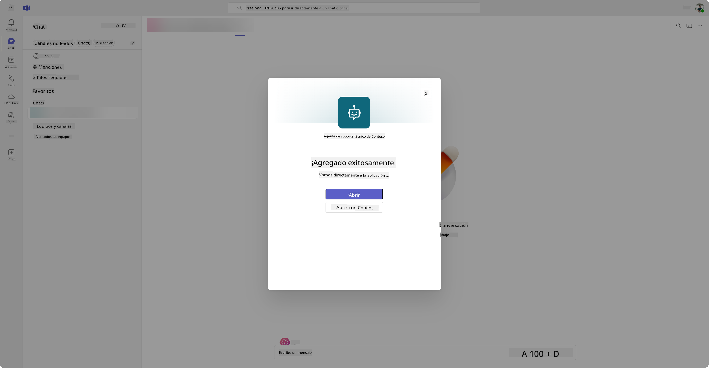

1. Selecciona **Abrir** para abrir el agente en Teams

    Esto abrirá el agente en Teams como una aplicación de Teams

    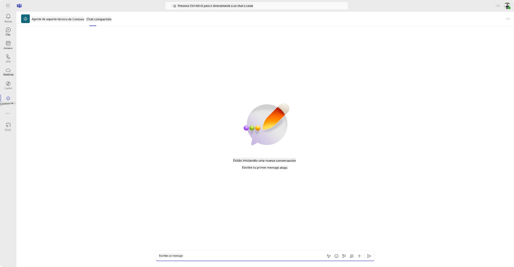

Ahora hemos publicado el agente para que funcione en Microsoft Teams, pero es posible que desees hacerlo disponible para más personas.

### 11.3 Haz que el agente esté disponible para todos los usuarios en el tenant

1. Cierra la pestaña del navegador donde el agente de soporte técnico de Contoso está abierto

    Esto debería llevarte de vuelta a Copilot Studio donde el panel lateral de Teams y Microsoft 365 Copilot aún está abierto. Solo hemos abierto el agente en Teams ahora, pero podemos hacer mucho más aquí. Podemos editar los detalles del agente, podemos desplegar el agente a más usuarios y más.

1. Selecciona **Editar detalles**

    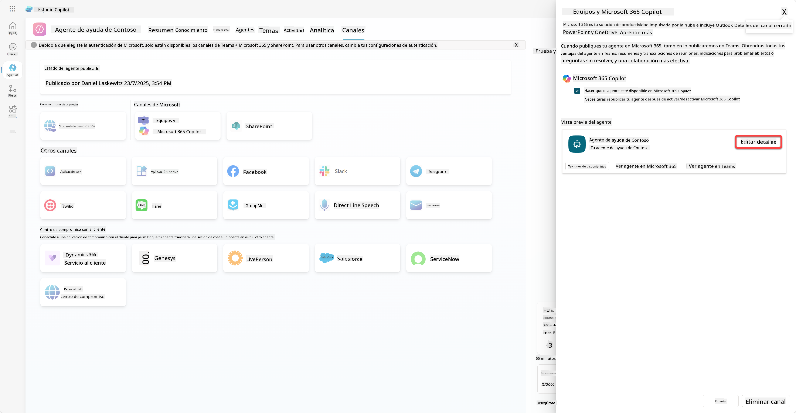
Esto abrirá un panel donde podemos cambiar varios detalles y configuraciones del agente. Podemos modificar detalles básicos como el ícono, el color de fondo del ícono y las descripciones. También podemos cambiar configuraciones de Teams (por ejemplo, permitir que un usuario agregue el agente a un equipo o permitir el uso de este agente en chats grupales y reuniones) aquí. Al seleccionar *más*, también puedes cambiar detalles del desarrollador como el nombre del desarrollador, el sitio web, la declaración de privacidad y los términos de uso.

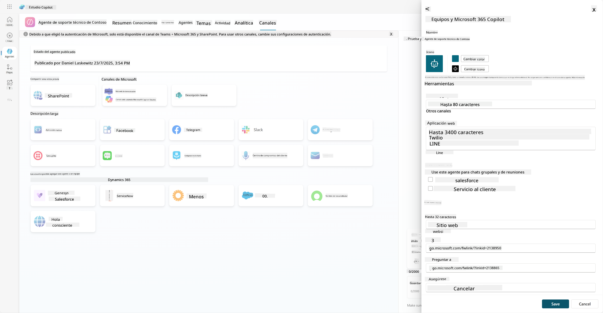

1. Selecciona **Cancelar** para cerrar el panel de edición de detalles.

1. Selecciona **Opciones de disponibilidad**

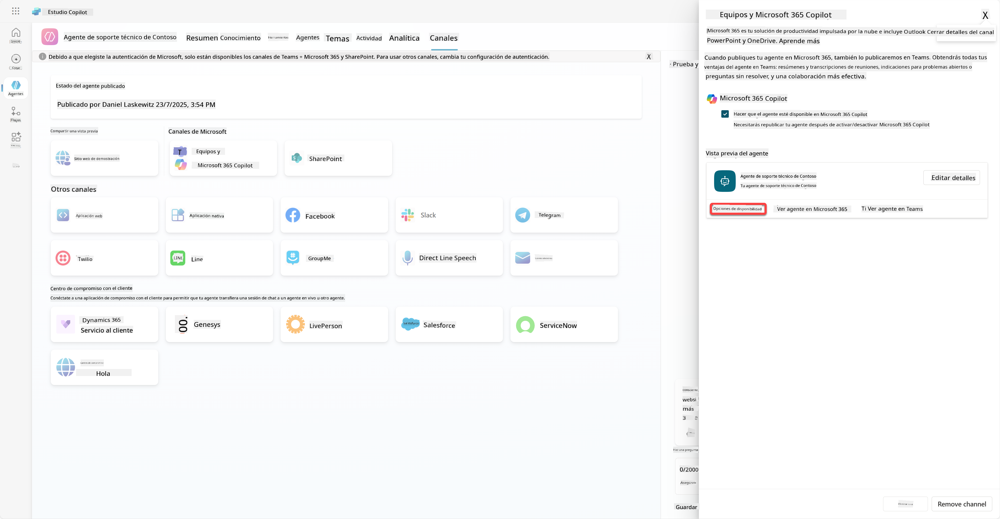

Esto abrirá el panel de opciones de disponibilidad, donde puedes copiar un enlace para enviarlo a los usuarios y que puedan usar este agente (ten en cuenta que también necesitas compartir el agente con el usuario) y puedes descargar un archivo para agregar tu agente a la tienda de Microsoft Teams o Microsoft 365. Para mostrar el agente en la tienda, también tienes otras opciones: puedes mostrarlo a tus compañeros de equipo y usuarios compartidos (para que aparezca en la sección *Creado con Power Platform*) o puedes mostrarlo a todos en tu organización (esto requiere la aprobación del administrador).

1. Selecciona **Mostrar a todos en mi organización**

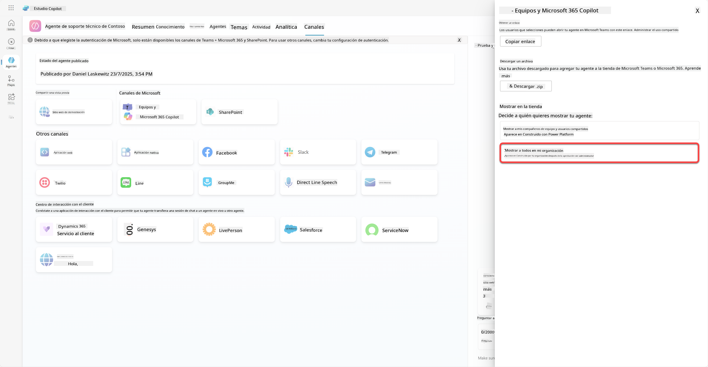

1. Selecciona **Enviar para aprobación del administrador**

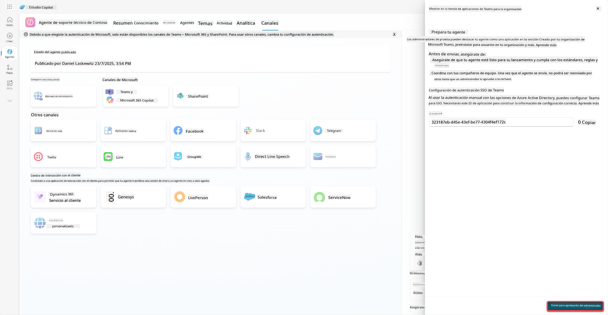

Ahora, tu administrador tiene que aprobar la presentación de tu agente. Puede hacerlo yendo al Centro de Administración de Teams y buscando el Agente de Ayuda de Contoso en Aplicaciones. En la captura de pantalla puedes ver lo que el administrador vería en el Centro de Administración de Teams.

El administrador tiene que seleccionar el Agente de Ayuda de Contoso y elegir *Publicar* para publicar el Agente de Ayuda de Contoso para todos.

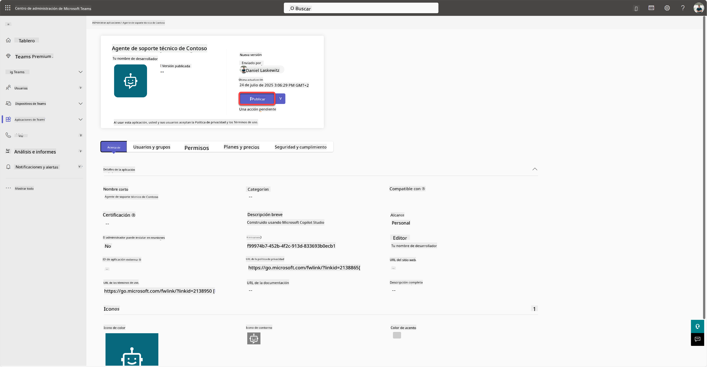

Cuando el administrador haya publicado la presentación del agente, podrás actualizar Copilot Studio y deberías ver el banner *disponible en la tienda de aplicaciones* en las opciones de disponibilidad.

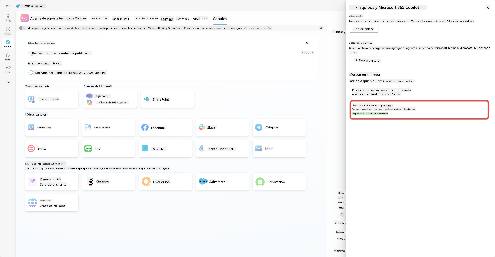

Aquí hay aún más posibilidades. Tu administrador puede cambiar la política de configuración global y auto instalar el Agente de Ayuda de Contoso para todos en el inquilino. Además, puedes fijar el Agente de Ayuda de Contoso en la barra lateral izquierda para que todos tengan fácil acceso a él.

## ✅ Misión Completa

🎉 **¡Felicidades!** Has publicado exitosamente tu agente y lo has agregado a Teams y Microsoft 365 Copilot. Lo siguiente es la última misión del curso: Comprender las licencias.

⏭️ [Ir a la lección **Comprender las licencias**](../12-understanding-licensing/README.md)

## 📚 Recursos Tácticos

🔗 [Documentación sobre canales de publicación](https://learn.microsoft.com/microsoft-copilot-studio/publication-fundamentals-publish-channels)

---

**Descargo de responsabilidad**:  
Este documento ha sido traducido utilizando el servicio de traducción automática [Co-op Translator](https://github.com/Azure/co-op-translator). Aunque nos esforzamos por lograr precisión, tenga en cuenta que las traducciones automáticas pueden contener errores o imprecisiones. El documento original en su idioma nativo debe considerarse la fuente autorizada. Para información crítica, se recomienda una traducción profesional realizada por humanos. No nos hacemos responsables de malentendidos o interpretaciones erróneas que puedan surgir del uso de esta traducción.