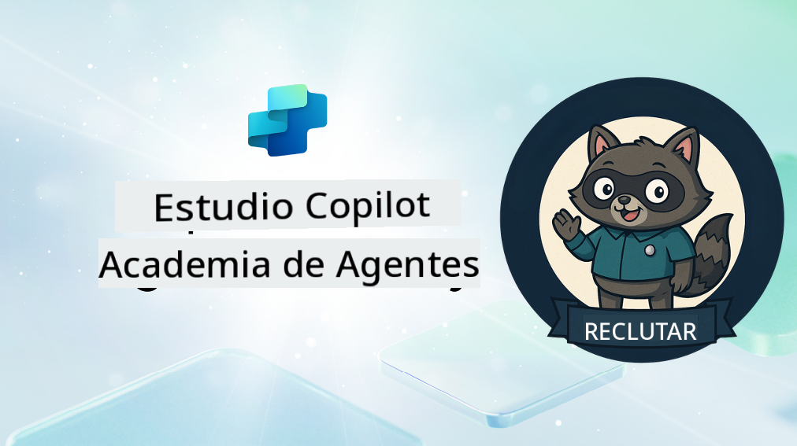

<!--
CO_OP_TRANSLATOR_METADATA:
{
  "original_hash": "8b5ecad9d5d073ea3f4c2b844e80f2e5",
  "translation_date": "2025-10-17T18:52:52+00:00",
  "source_file": "docs/recruit/README.md",
  "language_code": "es"
}
-->
# Bienvenido Recluta

**Bienvenido, Recluta.**  
Tu misión—si decides aceptarla—es dominar el arte de construir agentes utilizando **Microsoft Copilot Studio**.

Este entrenamiento práctico es tu punto de entrada al **mundo de los agentes**: desde prompts fundamentados hasta Adaptive Cards y flujos de agentes, aprenderás a construir, escalar y desplegar agentes inteligentes utilizando herramientas y casos de uso del mundo real.

---

## 🎯 Objetivo de la Misión

Al completar la Academia de Agentes, serás capaz de:

- Comprender qué son los agentes en el contexto de Microsoft Copilot Studio
- Explorar cómo los Modelos de Lenguaje Extenso (LLMs), la generación aumentada por recuperación (RAG) y la orquestación se combinan en un agente
- Construir tanto **agentes declarativos** como **personalizados**
- Mejorar los agentes con **Temas**, **Adaptive Cards** y **Flujos de Agentes**
- Desplegar agentes en **Microsoft Teams** y **Microsoft 365 Copilot**

---

## 🧪 Requisitos Previos

Para completar todas las misiones, necesitarás:

- Un tenant de desarrollador de Microsoft 365 (con SharePoint habilitado)
- Acceso a **Microsoft Copilot Studio** (de prueba o con licencia)
- Opcional: Conocimientos básicos de SharePoint, Power Platform o Power Fx

---

## 🧬 ¿Para Quién Es Este Curso?

Este curso es ideal para:

- Creadores y desarrolladores que exploran **Copilot Studio**
- Profesionales de TI que construyen **extensiones de Microsoft 365 Copilot**
- Entusiastas de Power Platform que quieren **mejorar** con agentes inteligentes
- Cualquiera que prefiera aprender **haciendo**

---

## 🧭 Resumen del Currículo

Esta academia está dividida en lecciones progresivas, cada una diseñada como una misión de campo para mejorar tus habilidades en la construcción de agentes.

| Lección | Título | Resumen de la Misión |
|---------|--------|-----------------------|
| `00` | 🧰 [Configuración del Curso](./00-course-setup/README.md) | Configura tu entorno de desarrollo, prueba de Copilot Studio y sitio de SharePoint |
| `01` | 🧠 [Introducción a los Agentes](./01-introduction-to-agents/README.md) | Comprende los conceptos de IA conversacional, LLMs y agentes autónomos vs. declarativos |
| `02` | 🛠️ [Fundamentos de Copilot Studio](./02-copilot-studio-fundamentals/README.md) | Aprende los bloques de construcción: conocimiento, habilidades, autonomía |
| `03` | 👩‍💻 [Crear un Agente Declarativo](./03-create-a-declarative-agent-for-M365Copilot/README.md) | Agrega tu propio agente al Microsoft 365 Copilot, fundamentado en un prompt |
| `04` | 🧩 [Creando una Solución](./04-creating-a-solution/README.md) | Empaqueta tu agente en una solución reutilizable para la gestión de entornos |
| `05` | 🚀 [Comienza con Agentes Preconstruidos](./05-using-prebuilt-agents/README.md) | Usa y personaliza un agente de plantilla para acelerar la configuración |
| `06` | ✍️ [Construir un Agente Personalizado](./06-create-agent-from-conversation/README.md) | Crea un nuevo Copilot fundamentado en fuentes de conocimiento |
| `07` | 🧠 [Agregar un Tema con Disparadores](./07-add-new-topic-with-trigger/README.md) | Usa Temas para definir rutas personalizadas de preguntas/respuestas |
| `08` | 🪪 [Mejorar con Adaptive Cards](./08-add-adaptive-card/README.md) | Construye una Adaptive Card utilizando Power Fx y SharePoint |
| `09` | 🔁 [Automatizar con Flujos de Agentes](./09-add-an-agent-flow/README.md) | Usa la entrada de Adaptive Card para activar flujos de back-end |
| `10` | 🧭 [Agregar Disparadores de Eventos](./10-add-event-triggers/README.md) | Permite que tu agente actúe de forma autónoma utilizando lógica basada en eventos |
| `11` | 📢 [Publicar tu Agente](./11-publish-your-agent/README.md) | Despliega tu agente en Microsoft Teams y Microsoft 365 Copilot |
| `12` | 🪪 [Entender las Licencias](./12-understanding-licensing/README.md) | Aprende cómo funcionan las licencias y la facturación con Copilot Studio |
| `13` | 🚨 [Asegurar tu Insignia de Recluta](./course-completion-badges-recruit/README.md) | Reclama tu insignia y marca tu logro |

!!! note
    ✅ Completar este currículo te otorga la insignia de **Recluta**.  
    🔓 **Operativo** y **Comandante** se desbloquearán en fases futuras.

<!-- markdownlint-disable-next-line MD033 -->

---

**Descargo de responsabilidad**:  
Este documento ha sido traducido utilizando el servicio de traducción automática [Co-op Translator](https://github.com/Azure/co-op-translator). Aunque nos esforzamos por lograr precisión, tenga en cuenta que las traducciones automáticas pueden contener errores o imprecisiones. El documento original en su idioma nativo debe considerarse la fuente autorizada. Para información crítica, se recomienda una traducción profesional realizada por humanos. No nos hacemos responsables de malentendidos o interpretaciones erróneas que surjan del uso de esta traducción.