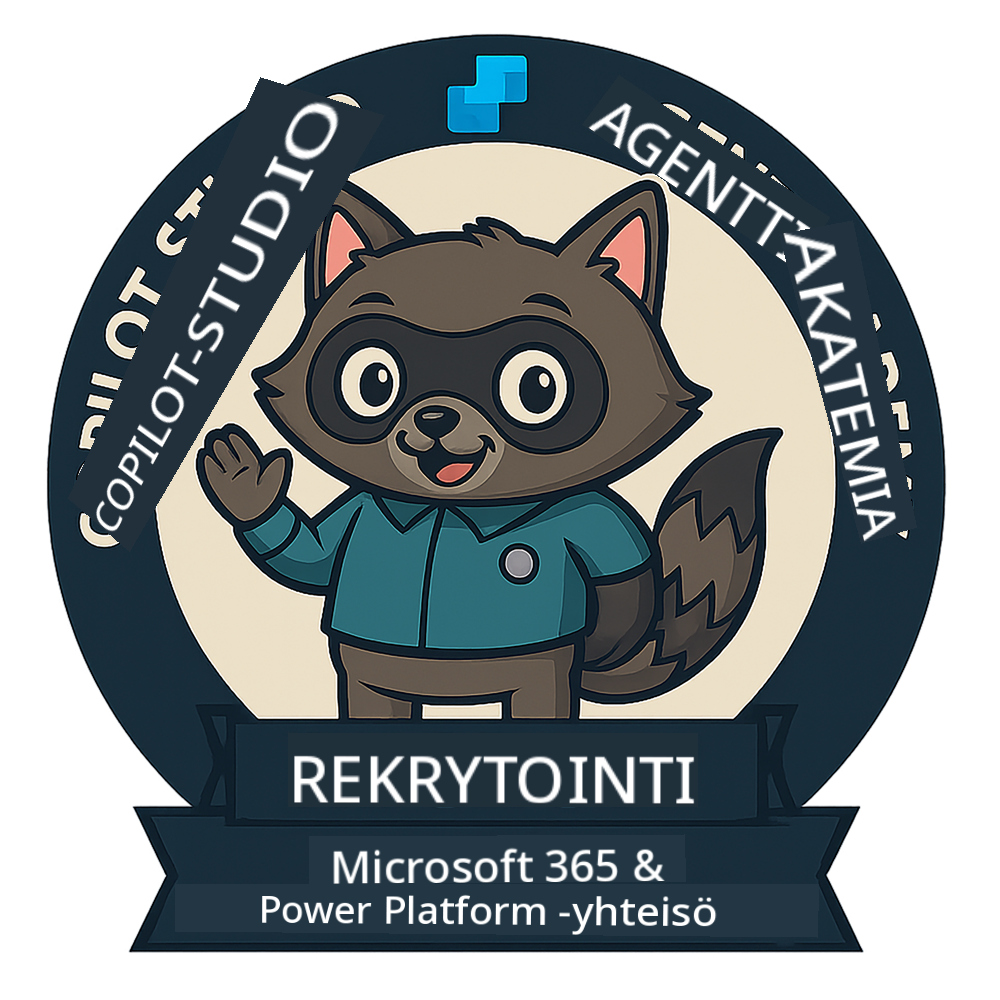
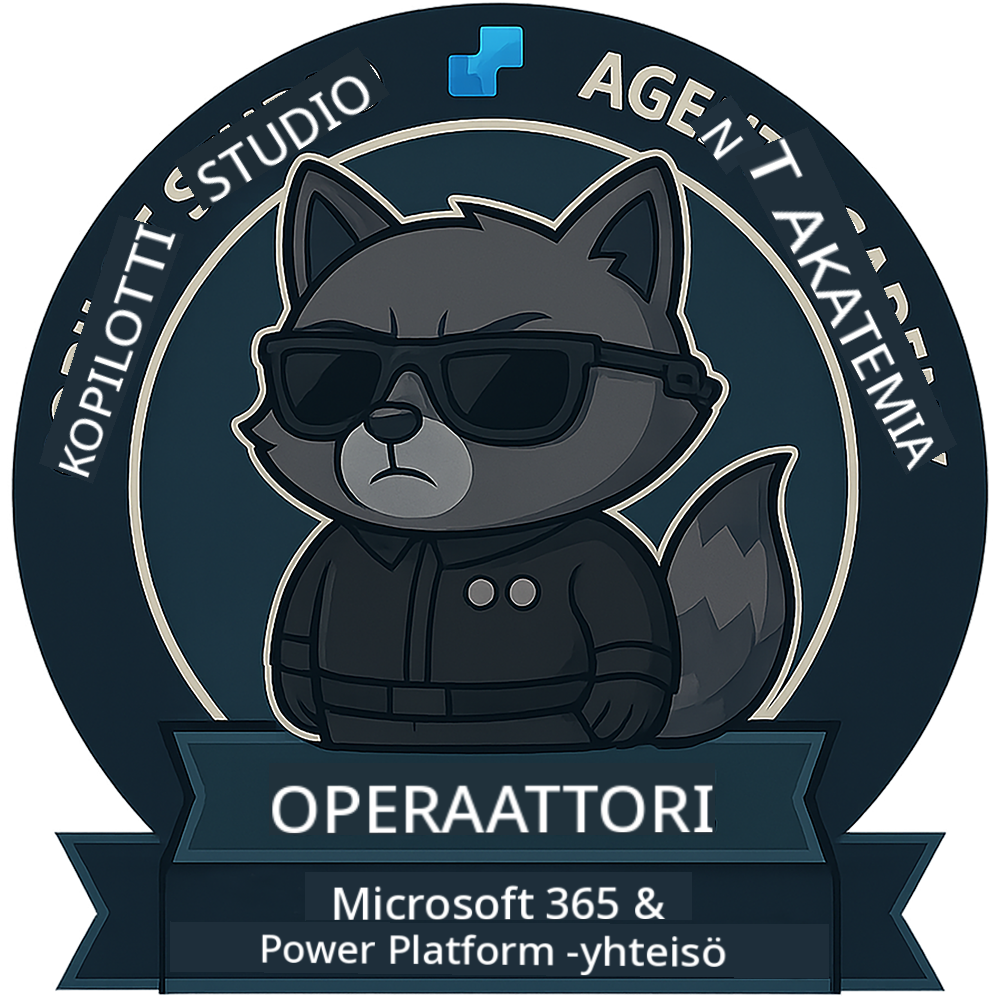

<!--
CO_OP_TRANSLATOR_METADATA:
{
  "original_hash": "15e57e059ce7689d602d7853187235cd",
  "translation_date": "2025-10-17T01:13:27+00:00",
  "source_file": "docs/index.md",
  "language_code": "fi"
}
-->
---
hide:
- navigation
---

# Copilot Studio Agenttiakatemia

**Tervetuloa Copilot Studio Agenttiakatemiaan.**  

Tehtäväsi—jos päätät ottaa sen vastaan—on oppia rakentamaan agentteja **Microsoft Copilot Studion** avulla.

Tämä käytännönläheinen koulutus on porttisi **agenttien maailmaan**: opit luomaan, skaalaamaan ja ottamaan käyttöön älykkäitä agentteja todellisten työkalujen ja käyttötapausten avulla, alkaen perustason kehotteista aina Adaptive Cards -kortteihin ja agenttivirtoihin.

---

## 🏅 Tason eteneminen

**Copilot Studio Agenttiakatemia** on monivaiheinen koulutusohjelma, joka kehittää taitojasi kolmen agenttitason kautta. Jokainen taso sisältää merkin ja kasvavia vastuualueita:

| Taso             | Tasoluokka | Visuaalinen |
|------------------|:-----:|--------|
| 🟢 **Rekrytoitu**  [🚀 Aloita](https://aka.ms/agent-academy-recruit){ .md-button .md-button--primary }     | •     | { width="300" }     |
| 🔵 **Operatiivinen** (Tulossa pian)   | ••    | { width="300" } |
| 🟡 **Komentaja** (Tulossa pian)    | •••   | { width="300" } |

Jokainen taso rakentuu edellisen päälle. Suorita Rekrytoidun tehtäväsi ja pysy kuulolla, jotta voit edetä agenttitaitojesi seuraavalle tasolle.

---

## 🎒 Muut kurssit

Tutustu näihin muihin kursseihin jatkaaksesi oppimista tekoälystä ja agenteista:

- [Microsoft Copilot Studio <3 MCP Lab](https://aka.ms/mcsmcplab)
- [Copilot Developer Camp](https://microsoft.github.io/copilot-camp/)
- [AI Agents for Beginners](https://microsoft.github.io/ai-agents-for-beginners/)
- [Model Context Protocol (MCP) For Beginners](https://github.com/microsoft/mcp-for-beginners)

---

## 🚑 Ongelmat

Arvostamme palautettasi! Käytä [ongelmalistaa](https://github.com/microsoft/agent-academy/issues) jakaaksesi kommenttisi ja huolenaiheesi. Kiitos!

---

## 📜 Käytännesäännöt

Tämä projekti on omaksunut [Microsoftin avoimen lähdekoodin käytännesäännöt](https://opensource.microsoft.com/codeofconduct/).

!!! info "Resurssit:"

    - [Microsoftin avoimen lähdekoodin käytännesäännöt](https://opensource.microsoft.com/codeofconduct/)
    - [Microsoftin käytännesääntöjen UKK](https://opensource.microsoft.com/codeofconduct/faq/)
    - Ota yhteyttä [opencode@microsoft.com](mailto:opencode@microsoft.com) kysymyksissä tai huolenaiheissa

---

[⭐️ Tähtää reposi](https://github.com/microsoft/agent-academy){ .md-button .md-button--primary }

<!-- markdownlint-disable-next-line MD033 -->

---

**Vastuuvapauslauseke**:  
Tämä asiakirja on käännetty käyttämällä tekoälypohjaista käännöspalvelua [Co-op Translator](https://github.com/Azure/co-op-translator). Vaikka pyrimme tarkkuuteen, huomioithan, että automaattiset käännökset voivat sisältää virheitä tai epätarkkuuksia. Alkuperäistä asiakirjaa sen alkuperäisellä kielellä tulisi pitää ensisijaisena lähteenä. Kriittisen tiedon osalta suositellaan ammattimaista ihmiskäännöstä. Emme ole vastuussa väärinkäsityksistä tai virhetulkinnoista, jotka johtuvat tämän käännöksen käytöstä.