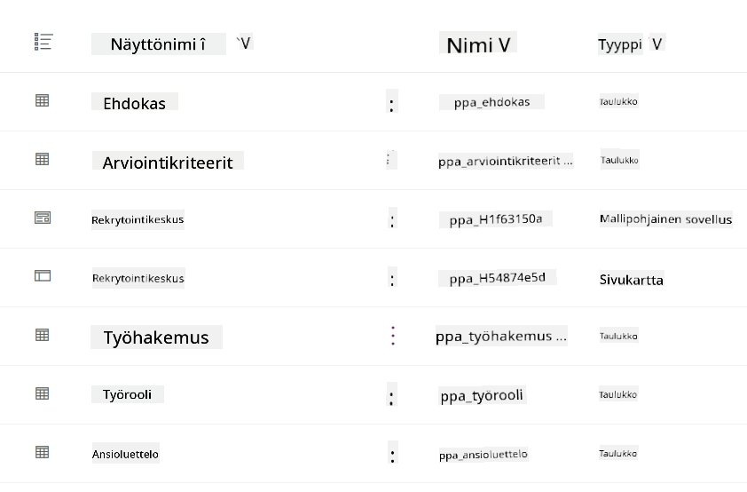
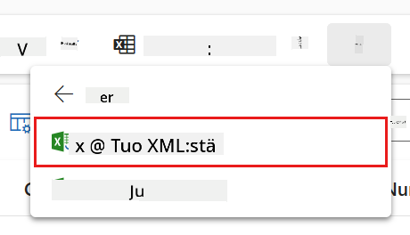
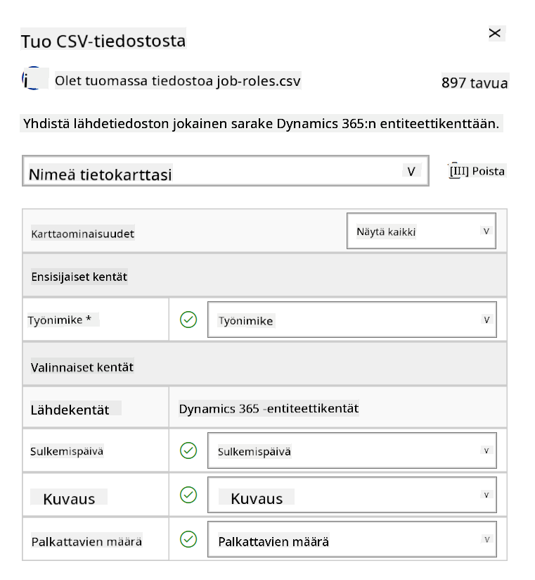
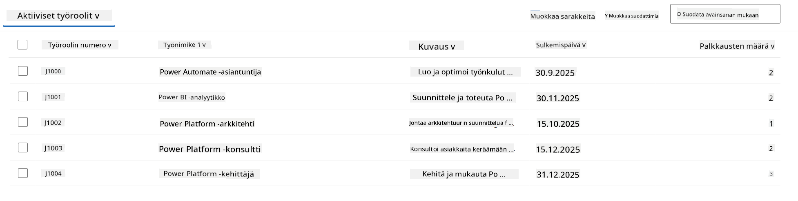
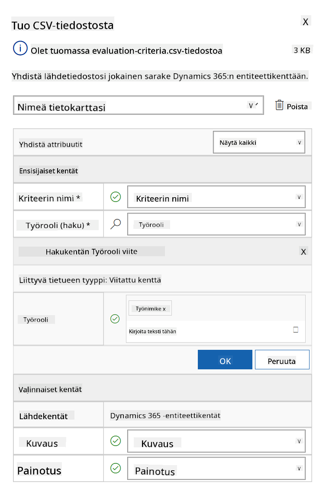
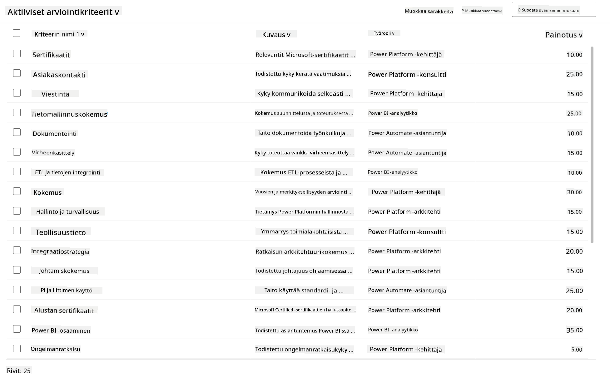

<!--
CO_OP_TRANSLATOR_METADATA:
{
  "original_hash": "2620cf9eaf09a3fc6be7fa31a3a62956",
  "translation_date": "2025-10-17T01:48:30+00:00",
  "source_file": "docs/operative-preview/01-get-started/README.md",
  "language_code": "fi"
}
-->
# 🚨 Tehtävä 01: Aloita Hiring Agentin kanssa

--8<-- "disclaimer.md"

## 🕵️‍♂️ Koodinimi: `OPERATION TALENT SCOUT`

> **⏱️ Operaatioaikaikkuna:** `~45 minuuttia`

## 🎯 Tehtävän kuvaus

Tervetuloa, Agentti. Ensimmäinen tehtäväsi on **Operation Talent Scout** - luoda perusta tekoälypohjaiselle rekrytointijärjestelmälle, joka mullistaa organisaatioiden tavat tunnistaa ja palkata huippuosaajia.

Tehtäväsi, jos päätät hyväksyä sen, on ottaa käyttöön ja konfiguroida kattava rekrytoinnin hallintajärjestelmä Microsoft Copilot Studion avulla. Tulet tuomaan valmiin ratkaisun, joka sisältää kaikki tarvittavat tietorakenteet, ja luomaan ensimmäisen tekoälyagenttisi - **Hiring Agentin** - joka toimii keskeisenä koordinaattorina kaikissa tulevissa rekrytointitoiminnoissa.

Tämä alkuvaiheen käyttöönotto luo komentokeskuksen, jota kehität Agent Academy Operative -ohjelman aikana. Pidä tätä toimintasi tukikohtana - perustana, jonka päälle rakennat verkoston erikoistuneita agentteja tulevissa tehtävissä.

---

## 🔎 Tavoitteet

Tehtävän suorittamalla opit:

- **Skenaarion ymmärtäminen**: Saavutat kattavan ymmärryksen rekrytoinnin automaation haasteista ja ratkaisuista
- **Ratkaisun käyttöönotto**: Onnistut tuomaan ja konfiguroimaan rekrytoinnin hallintajärjestelmän perusosat
- **Agentin luominen**: Rakennat Hiring Agentin, joka toimii skenaarion lähtökohtana Agent Academy Operative -ohjelmassa

---

## 🔍 Esivaatimukset

Ennen tehtävän aloittamista varmista, että sinulla on:

- Copilot Studio -lisenssi
- Pääsy Microsoft Power Platform -ympäristöön
- Hallintaoikeudet ratkaisujen ja agenttien luomiseen

---

## 🏢 Rekrytoinnin automaation skenaarion ymmärtäminen

Tämä skenaario näyttää, kuinka yritys voi käyttää Microsoft Copilot Studiota parantaakseen ja automatisoidakseen rekrytointiprosessiaan. Se esittelee agenttijärjestelmän, joka hoitaa tehtäviä, kuten ansioluetteloiden tarkastelua, työroolien suosituksia, haastattelumateriaalien valmistelua ja ehdokkaiden arviointia.

### Liiketoimintahyödyt

Ratkaisu auttaa HR-tiimejä säästämään aikaa ja tekemään parempia päätöksiä:

- Käsittelemällä automaattisesti sähköpostitse saapuvia ansioluetteloita.
- Suosittelemalla sopivia työrooleja ehdokasprofiilien perusteella.
- Luomalla työpaikkahakemuksia ja haastatteluoppaita, jotka on räätälöity kullekin ehdokkaalle.
- Varmistamalla oikeudenmukaiset ja sääntöjenmukaiset rekrytointikäytännöt sisäänrakennettujen turvallisuus- ja moderointiominaisuuksien avulla.
- Keräämällä palautetta ratkaisun parantamiseksi.

### Miten se toimii

- Keskitetty **Hiring Agent** koordinoi prosessia ja tallentaa tiedot Microsoft Dataverseen.
- **Application Intake Agent** lukee ansioluetteloita ja luo työpaikkahakemuksia.
- **Interview Prep Agent** tuottaa haastattelukysymyksiä ja dokumentteja ehdokkaan taustan perusteella.
- Järjestelmä voidaan julkaista demoverkkosivustolle, jolloin sidosryhmät voivat olla vuorovaikutuksessa sen kanssa.

Tämä skenaario sopii erinomaisesti organisaatioille, jotka haluavat modernisoida rekrytointiprosessejaan tekoälypohjaisen automaation avulla, säilyttäen samalla läpinäkyvyyden, oikeudenmukaisuuden ja tehokkuuden.

---

## 🧪 Laboratorio: Hiring Agentin asennus

Tässä käytännön laboratoriossa luot perustan rekrytoinnin automaatiojärjestelmällesi. Aloitat tuomalla esikonfiguroidun ratkaisun, joka sisältää kaikki tarvittavat Dataverse-taulukot ja tietorakenteet ehdokkaiden, työpaikkojen ja rekrytointiprosessien hallintaan. Seuraavaksi täytät nämä taulukot esimerkkidatalla, joka tukee oppimistasi tämän moduulin aikana ja tarjoaa realistisia testiskenaarioita. Lopuksi luot Hiring Agentin Copilot Studiossa, perustamalla peruskeskusteluliittymän, joka toimii kulmakivenä kaikille tuleville ominaisuuksille, joita lisäät tulevissa tehtävissä.

### 🧪 Lab 1.1: Ratkaisun tuonti

1. Siirry **[Copilot Studioon](https://copilotstudio.microsoft.com)**
1. Valitse **...** vasemmasta navigaatiosta ja valitse **Solutions**
1. Valitse yläreunasta **Import Solution** -painike
1. **[Lataa](https://raw.githubusercontent.com/microsoft/agent-academy/refs/heads/main/docs/operative-preview/01-get-started/assets/Operative_1_0_0_0.zip)** valmisteltu ratkaisu
1. Valitse **Browse** ja valitse edellisessä vaiheessa ladattu ratkaisu
1. Valitse **Next**
1. Valitse **Import**

!!! success
    Onnistuneen tuonnin jälkeen näet vihreän ilmoituspalkin seuraavalla viestillä:  
    "Solution "Operative" imported successfully."

Kun ratkaisu on tuotu, tutustu tuomiisi komponentteihin valitsemalla ratkaisun näyttönimi (`Operative`).



Seuraavat komponentit on tuotu:

| Näyttönimi | Tyyppi | Kuvaus |
|-------------|------|-------------|
| Candidate | Taulukko | Ehdokastiedot |
| Evaluation Criteria | Taulukko | Arviointikriteerit roolia varten |
| Hiring Hub | Mallipohjainen sovellus | Sovellus rekrytointiprosessin hallintaan |
| Hiring Hub | Sivukartta | Hiring Hub -sovelluksen navigointirakenne |
| Job Application | Taulukko | Työhakemukset |
| Job Role | Taulukko | Työroolit |
| Resume | Taulukko | Ehdokkaiden ansioluettelot |

Viimeisenä tehtävänä tässä laboratoriossa, valitse yläreunasta **Publish all customizations** -painike.

### 🧪 Lab 1.2: Esimerkkidatan tuonti

Tässä laboratoriossa lisäät esimerkkidataa joihinkin taulukoihin, jotka toit labrassa 1.1.

#### Lataa tiedostot tuontia varten

1. **[Lataa](https://raw.githubusercontent.com/microsoft/agent-academy/refs/heads/main/docs/operative-preview/01-get-started/assets/evaluation-criteria.csv)** CSV-tiedosto arviointikriteereistä
1. **[Lataa](https://raw.githubusercontent.com/microsoft/agent-academy/refs/heads/main/docs/operative-preview/01-get-started/assets/job-roles.csv)** CSV-tiedosto työrooleista

#### Työroolien esimerkkidatan tuonti

1. Palaa ratkaisuun, jonka juuri toit edellisessä laboratoriossa
1. Valitse **Hiring Hub** -mallipohjainen sovellus valitsemalla rivin edessä oleva valintamerkki
1. Valitse yläreunasta **Play**-painike

    !!! warning
        Sinua saatetaan pyytää kirjautumaan uudelleen. Varmista, että teet sen. Tämän jälkeen sinun pitäisi nähdä Hiring Hub -sovellus.

1. Valitse **Job Roles** vasemmasta navigaatiosta
1. Valitse komentopalkista **More**-ikoni (kolme pistettä päällekkäin)
1. Valitse **oikea nuoli** *Import from Excel* -kohdan vierestä

    

1. Valitse **Import from CSV**

    

1. Valitse **Choose File** -painike, valitse juuri ladattu **job-roles.csv**-tiedosto ja valitse **Open**
1. Valitse **Next**
1. Jätä seuraava vaihe ennalleen ja valitse **Review Mapping**

    

1. Varmista, että kartoitus on oikein, ja valitse **Finish Import**

    !!! info
        Tämä käynnistää tuonnin, ja voit seurata edistymistä tai viimeistellä prosessin heti valitsemalla **Done**

1. Valitse **Done**

Tämä voi kestää hetken, mutta voit painaa **Refresh**-painiketta nähdäksesi, onko tuonti onnistunut.



#### Arviointikriteerien esimerkkidatan tuonti

1. Valitse **Evaluation Criteria** vasemmasta navigaatiosta
1. Valitse komentopalkista **More**-ikoni (kolme pistettä päällekkäin)
1. Valitse **oikea nuoli** *Import from Excel* -kohdan vierestä

    

1. Valitse **Import from CSV**

    

1. Valitse **Choose File** -painike, valitse juuri ladattu **evaluation-criteria.csv**-tiedosto ja valitse **Open**
1. Valitse **Next**
1. Jätä seuraava vaihe ennalleen ja valitse **Review Mapping**

    

1. Nyt meidän täytyy tehdä hieman enemmän työtä kartoituksen kanssa. Valitse suurennuslasi (🔎-ikoni) Job Role -kentän vierestä
1. Varmista, että **Job Title** on valittuna, ja jos ei ole - lisää se
1. Valitse **OK**
1. Varmista, että loput kartoituksesta ovat myös oikein, ja valitse **Finish Import**

    !!! info
        Tämä käynnistää tuonnin uudelleen, ja voit seurata edistymistä tai viimeistellä prosessin heti valitsemalla **Done**

1. Valitse **Done**

Tämä voi kestää hetken, mutta voit painaa **Refresh**-painiketta nähdäksesi, onko tuonti onnistunut.



### 🧪 Lab 1.3: Hiring Agentin luominen

Nyt kun olet valmis esivaatimusten asennuksen kanssa, on aika siirtyä varsinaiseen työhön! Lisätään ensin Hiring Agent!

1. Siirry **[Copilot Studioon](https://copilotstudio.microsoft.com)** ja varmista, että olet samassa ympäristössä, johon toit ratkaisun ja datan
1. Valitse **Agents** vasemmasta navigaatiosta
1. Valitse **New Agent**
1. Valitse **Configure**
1. **Name**-kenttään kirjoita:

    ```text
    Hiring Agent
    ```

1. **Description**-kenttään kirjoita:

    ```text
    Central orchestrator for all hiring activities
    ```

1. Valitse **...** *Create*-painikkeen vierestä oikeassa yläkulmassa
1. Valitse **Update advanced settings**
1. **Solution**-kohtaan valitse `Operative`
1. Valitse **Update**
1. Valitse oikeasta yläkulmasta **Create**

Tämä luo sinulle Hiring Agentin, jota käytät koko Operative-kurssin ajan.

---

## 🎉 Tehtävä suoritettu

Tehtävä 01 on suoritettu! Olet nyt hallinnut seuraavat taidot:

✅ **Skenaarion ymmärtäminen**: Kattava tieto rekrytoinnin automaation haasteista ja ratkaisuista  
✅ **Ratkaisun käyttöönotto**: Onnistunut rekrytoinnin hallintajärjestelmän perusosien tuonti ja konfigurointi  
✅ **Agentin luominen**: Hiring Agentin rakentaminen, joka toimii skenaarion lähtökohtana Agent Academy Operative -ohjelmassa  

Seuraavaksi [Tehtävä 02](../02-multi-agent/README.md): Tee agentistasi monen agentin yhteensopiva yhdistetyillä agenteilla.

---

## 📚 Taktiset resurssit

📖 [Microsoft Copilot Studio - Luo agentti](https://learn.microsoft.com/microsoft-copilot-studio/authoring-first-bot)  
📖 [Microsoft Dataverse Dokumentaatio](https://learn.microsoft.com/power-apps/maker/data-platform)

---

**Vastuuvapauslauseke**:  
Tämä asiakirja on käännetty käyttämällä tekoälypohjaista käännöspalvelua [Co-op Translator](https://github.com/Azure/co-op-translator). Vaikka pyrimme tarkkuuteen, huomioithan, että automaattiset käännökset voivat sisältää virheitä tai epätarkkuuksia. Alkuperäinen asiakirja sen alkuperäisellä kielellä tulisi pitää ensisijaisena lähteenä. Kriittisen tiedon osalta suositellaan ammattimaista ihmiskäännöstä. Emme ole vastuussa väärinkäsityksistä tai virhetulkinnoista, jotka johtuvat tämän käännöksen käytöstä.