<!--
CO_OP_TRANSLATOR_METADATA:
{
  "original_hash": "4fb913dfc3bbc71506dd3602c4b8e6ed",
  "translation_date": "2025-10-17T01:44:09+00:00",
  "source_file": "docs/operative-preview/02-multi-agent/README.md",
  "language_code": "fi"
}
-->
# 🚨 Tehtävä 02: Yhdistetyt agentit

--8<-- "disclaimer.md"

## 🕵️‍♂️ Koodinimi: `OPERAATIO SYMPHONY`

> **⏱️ Operaatioaikaikkuna:** `~45 minuuttia`

## 🎯 Tehtävän kuvaus

Tervetuloa takaisin, agentti. Tehtävässä 01 loit pääasiallisen rekrytointia hoitavan agenttisi - vankan perustan rekrytointiprosessien hallintaan. Mutta yksi agentti voi tehdä vain rajallisesti.

Tehtäväsi, jos päätät hyväksyä sen, on **Operaatio Symphony** - muuttaa yksittäinen agenttisi **moniagenttiseksi järjestelmäksi**: orkestroitu erikoistuneiden agenttien tiimi, joka työskentelee yhdessä monimutkaisten rekrytointihaasteiden parissa. Ajattele sitä siirtymisenä yksin toimivasta operaattorista erikoistuneen tehtäväryhmän komentamiseen.

Kuten sinfoniaorkesteri, jossa jokainen muusikko soittaa omaa osaansa täydellisessä harmoniassa, lisäät kaksi kriittistä erikoisasiantuntijaa olemassa olevaan rekrytointia hoitavaan agenttiisi: hakemusten vastaanottaja-agentin, joka käsittelee ansioluettelot automaattisesti, ja haastatteluun valmistautumisagentin, joka luo kattavat haastattelumateriaalit. Nämä agentit toimivat saumattomasti yhdessä pääorkestroijasi alaisuudessa.

## 🔎 Tavoitteet

Tässä tehtävässä opit:

1. Milloin käyttää **lapsiagentteja** vs **yhdistettyjä agentteja**
1. Kuinka suunnitella **moniagenttisia arkkitehtuureja**, jotka skaalautuvat  
1. Luomaan **lapsiagentteja** keskittyneisiin tehtäviin
1. Vakiinnuttamaan **kommunikaatiomalleja** agenttien välillä
1. Rakentamaan hakemusten vastaanottaja-agentin ja haastatteluun valmistautumisagentin

## 🧠 Mitä ovat yhdistetyt agentit?

Copilot Studiossa et ole rajoitettu rakentamaan yksittäisiä, monoliittisia agentteja. Voit luoda **moniagenttisia järjestelmiä** - erikoistuneiden agenttien verkostoja, jotka työskentelevät yhdessä monimutkaisten työnkulkujen hallitsemiseksi.

Ajattele sitä kuin oikean maailman organisaatiota: sen sijaan, että yksi henkilö tekisi kaiken, sinulla on erikoistuneita asiantuntijoita, jotka loistavat tietyissä tehtävissä ja tekevät yhteistyötä tarvittaessa.

### Miksi moniagenttiset järjestelmät ovat tärkeitä

- **Skaalautuvuus:** Jokainen agentti voidaan kehittää, testata ja ylläpitää itsenäisesti eri tiimien toimesta.  
- **Erikoistuminen:** Agentit voivat keskittyä siihen, mitä ne tekevät parhaiten. Esimerkiksi yksi datan käsittelyyn, toinen käyttäjävuorovaikutukseen, kolmas päätöksentekoon.  
- **Joustavuus:** Voit yhdistellä agentteja, käyttää niitä uudelleen eri projekteissa ja kehittää järjestelmääsi asteittain.  
- **Ylläpidettävyys:** Muutokset yhteen agenttiin eivät välttämättä vaikuta muihin, mikä tekee päivityksistä turvallisempia ja helpompia.

### Esimerkki tosielämästä: Rekrytointiprosessi

Ajatellaan rekrytointityönkulkua - useat agentit voivat työskennellä yhdessä seuraavilla vastuualueilla:

- **Ansioluetteloiden vastaanotto** vaatii asiakirjojen käsittely- ja tiedonhankintataitoja
- **Pisteytys** sisältää hakijoiden ansioluetteloiden arvioinnin ja niiden sovittamisen työvaatimuksiin
- **Haastatteluun valmistautuminen** vaatii syvällistä pohdintaa hakijan sopivuudesta  
- **Hakijan viestintä** vaatii empaattisia viestintätaitoja

Sen sijaan, että rakennettaisiin yksi massiivinen agentti, joka yrittää hoitaa kaikki nämä erilaiset tehtävät, voit luoda erikoistuneita agentteja jokaista aluetta varten ja orkestroida ne yhdessä.

## 🔗 Lapsiagentit vs yhdistetyt agentit: Keskeinen ero

Copilot Studio tarjoaa kaksi tapaa rakentaa moniagenttisia järjestelmiä, joista jokaisella on omat käyttötapauksensa:

### ↘️ Lapsiagentit

Lapsiagentit ovat **kevyitä erikoisasiantuntijoita**, jotka toimivat pääagenttisi sisällä. Ajattele niitä erikoistuneina tiimeinä saman osaston sisällä.

#### Keskeiset tekniset yksityiskohdat

- Lapsiagentit toimivat pääagentin sisällä ja niillä on yksi konfigurointisivu.
- Työkalut ja tieto ovat **tallennettu pääagenttiin**, mutta ne on konfiguroitu "Saatavilla" lapsiagentille.
- Lapsiagentit **jakavat pääagentin aiheet**. Aiheita voidaan viitata lapsiagentin ohjeissa.
- Lapsiagentteja **ei tarvitse julkaista erikseen** - ne ovat automaattisesti käytettävissä pääagentin sisällä, kun ne on luotu. Tämä tekee testauksesta helpompaa, koska muutokset pääagenttiin ja lapsiagentteihin voidaan tehdä **samassa jaetussa työtilassa**.

#### Käytä lapsiagentteja, kun

- Yksi tiimi hallinnoi koko ratkaisua
- Haluat loogisesti järjestää työkalut ja tiedon alagentteihin
- Et tarvitse erillistä autentikointia tai käyttöönottoa jokaiselle agentille
- Agentteja ei julkaista erikseen tai käytetä itsenäisesti
- Et tarvitse agenttien uudelleenkäyttöä useissa ratkaisuissa

**Esimerkki:** IT-tukipalveluagentti, jolla on lapsiagentteja:

- Salasanan palautusmenettelyt
- Laitteistovianetsintä  
- Ohjelmistojen asennusohjeet

### 🔀 Yhdistetyt agentit

Yhdistetyt agentit ovat **täysin itsenäisiä agentteja**, joiden kanssa pääagenttisi voi tehdä yhteistyötä. Ajattele niitä erillisinä osastoina, jotka työskentelevät yhdessä projektin parissa.

#### Keskeiset tekniset yksityiskohdat

- Yhdistetyillä agenteilla on **omat aiheensa** ja keskustelun kulkunsa. Ne toimivat itsenäisesti omilla asetuksillaan, logiikallaan ja käyttöönoton elinkaarella.
- Yhdistetyt agentit **täytyy julkaista** ennen kuin ne voidaan lisätä ja käyttää muiden agenttien toimesta.
- Testauksen aikana yhdistetyn agentin muutokset täytyy julkaista ennen kuin kutsuva agentti voi käyttää niitä.

#### Käytä yhdistettyjä agentteja, kun

- Useat tiimit kehittävät ja ylläpitävät eri agentteja itsenäisesti
- Agenttien täytyy olla omat asetuksensa, autentikointinsa ja käyttöönotto-kanavansa
- Haluat julkaista ja ylläpitää agentteja erikseen itsenäisellä sovelluksen elinkaaren hallinnalla (ALM) jokaiselle agentille
- Agenttien tulisi olla uudelleenkäytettäviä useissa ratkaisuissa

**Esimerkki:** Asiakaspalvelujärjestelmä, joka yhdistyy:

- Erilliseen laskutusagenttiin, jota ylläpitää taloustiimi
- Erilliseen teknisen tuen agenttiin, jota ylläpitää tuotetiimi
- Erilliseen palautusagenttiin, jota ylläpitää operatiivinen tiimi

!!! tip "Vinkki"
    Voit yhdistellä molempia lähestymistapoja! Esimerkiksi pääagenttisi voisi yhdistyä ulkoisiin agentteihin muista tiimeistä samalla kun sillä on omia lapsiagentteja erikoistuneisiin sisäisiin tehtäviin.

## 🎯 Moniagenttiset arkkitehtuurimallit

Moniagenttisia järjestelmiä suunniteltaessa syntyy useita malleja sen perusteella, miten agentit ovat vuorovaikutuksessa:

| Malli                | Kuvaus                                                                 | Paras käyttötilanne                                           |
|----------------------|-------------------------------------------------------------------------|---------------------------------------------------------------|
| **Hub and Spoke**    | Pääorkestroija-agentti koordinoi useita erikoistuneita agentteja. Orkestroija hoitaa käyttäjävuorovaikutuksen ja delegoi tehtävät lapsi- tai yhdistetyille agenteille. | Monimutkaiset työnkulut, joissa yksi agentti koordinoi erikoistuneita tehtäviä |
| **Pipeline**         | Agentit siirtävät työtä peräkkäin yhdeltä toiselle, jokainen lisää arvoa ennen siirtoa seuraavaan vaiheeseen. | Lineaariset prosessit, kuten hakemusten käsittely (vastaanotto → seulonta → haastattelu → päätös) |
| **Collaborative**    | Agentit työskentelevät yhdessä samanaikaisesti eri näkökulmista saman ongelman parissa, jakaen kontekstia ja tuloksia. | Monimutkainen analyysi, joka vaatii useita näkökulmia tai asiantuntija-alueita |

!!! tip "Vinkki"
    Voit jopa yhdistää kaksi tai useampia näistä malleista.

## 💬Agenttien kommunikaatio ja kontekstin jakaminen

Kun agentit työskentelevät yhdessä, niiden täytyy jakaa tietoa tehokkaasti. Näin tämä toimii Copilot Studiossa:

### Keskusteluhistoria

Oletuksena, kun pääagentti kutsuu lapsi- tai yhdistettyä agenttia, se voi välittää **keskusteluhistorian**. Tämä antaa erikoistuneelle agentille täydellisen kontekstin siitä, mistä käyttäjä on keskustellut.

Voit poistaa tämän käytöstä turvallisuus- tai suorituskykysyistä - esimerkiksi, jos erikoistuneen agentin tarvitsee suorittaa vain tietty tehtävä ilman koko keskustelukontekstia. Tämä voi olla hyvä puolustus **tietovuotoja** vastaan.

### Selkeät ohjeet

Pääagenttisi voi antaa **tarkkoja ohjeita** lapsi- tai yhdistetyille agenteille. Esimerkiksi: "Käsittele tämä ansioluettelo ja tiivistä heidän taitonsa Senior Developer -roolia varten."

### Palautusarvot

Agentit voivat palauttaa rakenteellista tietoa kutsuvalle agentille, jolloin pääagentti voi käyttää kyseistä tietoa seuraavissa vaiheissa tai jakaa sen muiden agenttien kanssa.

### Dataverse-integraatio

Monimutkaisemmissa skenaarioissa agentit voivat jakaa tietoa **Dataversen** tai muiden tietovarastojen kautta, mikä mahdollistaa pysyvän kontekstin jakamisen useiden vuorovaikutusten välillä.

## ↘️Lapsiagentti: Hakemusten vastaanottaja-agentti

Aloitetaan moniagenttisen rekrytointijärjestelmän rakentaminen. Ensimmäinen erikoisasiantuntijamme on **Hakemusten vastaanottaja-agentti** - lapsiagentti, joka vastaa saapuvien ansioluetteloiden ja hakijatietojen käsittelystä.

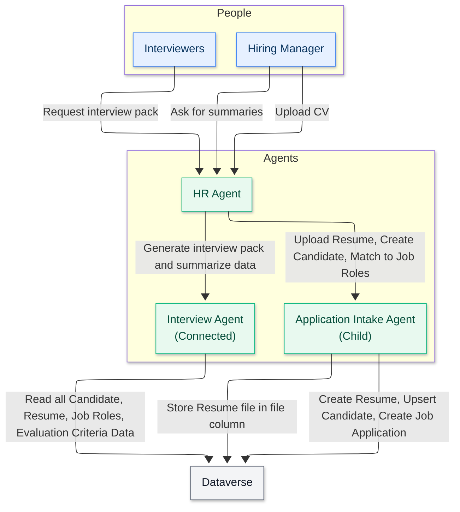
```mermaid
---
config:
  layout: elk
  look: neo
---
flowchart TB
 subgraph People["People"]
    direction TB
        HiringManager["Hiring Manager"]
        Interviewers["Interviewers"]
  end
 subgraph Agents["Agents"]
    direction LR
        ApplicationIntakeAgent["Application Intake Agent<br>(Child)"]
        InterviewAgent["Interview Agent<br>(Connected)"]
        HRAgent["HR Agent"]
  end
    HiringManager -- Upload CV --> HRAgent
    HRAgent -- Upload Resume, Create Candidate, Match to Job Roles --> ApplicationIntakeAgent
    ApplicationIntakeAgent -- Create Resume, Upsert Candidate, Create Job Application --> Dataverse["Dataverse"]
    ApplicationIntakeAgent -- Store Resume file in file column --> Dataverse
    HiringManager -- Ask for summaries --> HRAgent
    Interviewers -- Request interview pack --> HRAgent
    HRAgent -- Generate interview pack and summarize data --> InterviewAgent
    InterviewAgent -- Read all Candidate, Resume, Job Roles, Evaluation Criteria Data --> Dataverse
     HiringManager:::person
     Interviewers:::person
     ApplicationIntakeAgent:::agent
     InterviewAgent:::agent
     HRAgent:::agent
     Dataverse:::data
    classDef person fill:#e6f0ff,stroke:#3b82f6,color:#0b3660
    classDef agent fill:#e8f9ef,stroke:#10b981,color:#064e3b
    classDef data  fill:#f3f4f6,stroke:#6b7280,color:#111827
```

### 🤝Hakemusten vastaanottaja-agentin vastuut

- **Ansioluettelon sisällön käsittely** PDF-tiedostoista, jotka toimitetaan interaktiivisen chatin kautta (tulevassa tehtävässä opit, kuinka ansioluetteloita käsitellään itsenäisesti).
- **Rakenteellisen datan poiminta** (nimi, taidot, kokemus, koulutus)
- **Hakijoiden sovittaminen avoimiin rooleihin** pätevyyksien ja saatekirjeen perusteella
- **Hakijatietojen tallentaminen** Dataverseen myöhempää käsittelyä varten
- **Hakemusten deduplikointi** välttääksesi saman hakijan luomisen kahdesti, sovittaminen olemassa oleviin tietoihin ansioluettelosta poimitun sähköpostiosoitteen avulla.

### ⭐Miksi tämän tulisi olla lapsiagentti

Hakemusten vastaanottaja-agentti sopii täydellisesti lapsiagentiksi, koska:

- Se on erikoistunut asiakirjojen käsittelyyn ja datan poimintaan
- Sitä ei tarvitse julkaista erikseen  
- Se on osa kokonaisvaltaista rekrytointiratkaisua, jota hallinnoi sama tiimi
- Se keskittyy tiettyyn laukaisimeen (uusi ansioluettelo vastaanotettu) ja sen käynnistää rekrytointia hoitava agentti.

## 🔀Yhdistetty agentti: Haastatteluun valmistautumisagentti  

Toinen erikoisasiantuntijamme on **Haastatteluun valmistautumisagentti** - yhdistetty agentti, joka auttaa luomaan kattavat haastattelumateriaalit ja arvioimaan hakijoiden vastauksia.

### 🤝Haastatteluun valmistautumisagentin vastuut

- **Luoda haastattelupaketit**, jotka sisältävät yritystiedot, roolivaatimukset ja arviointikriteerit
- **Luoda haastattelukysymyksiä**, jotka on räätälöity tiettyihin rooleihin ja hakijoiden taustoihin
- **Vastata yleisiin kysymyksiin** työrooleista ja hakemuksista sidosryhmien viestintää varten

### ⭐Miksi tämän tulisi olla yhdistetty agentti

Haastatteluun valmistautumisagentti toimii paremmin yhdistettynä agenttina, koska:

- Rekrytointitiimi saattaa haluta käyttää sitä itsenäisesti useissa rekrytointiprosesseissa
- Se tarvitsee oman tietopohjan haastattelukäytännöistä ja arviointikriteereistä
- Eri rekrytointipäälliköt saattavat haluta mukauttaa sen toimintaa omille tiimeilleen
- Sitä voitaisiin käyttää uudelleen sisäisiin tehtäviin, ei vain ulkoiseen rekrytointiin

## 🧪Lab 2.1: Hakemusten vastaanottaja-agentin lisääminen

Valmis laittamaan teoria käytäntöön? Lisätään ensimmäinen lapsiagentti olemassa olevaan rekrytointia hoitavaan agenttiisi.

### Edellytykset tehtävän suorittamiselle

Sinulla täytyy olla **joko**:

- **Suoritettuna Tehtävä 01** ja rekrytointia hoitava agenttisi valmiina, **TAI**
- **Tuoda Tehtävä 02 aloitusratkaisu**, jos aloitat alusta tai haluat ottaa kiinni. [Lataa Tehtävä 02 aloitusratkaisu](https://aka.ms/agent-academy)

!!! note "Ratkaisun tuonti ja esimerkkidata"
    Jos käytät aloitusratkaisua, katso [Tehtävä 01](../01-get-started/README.md) saadaksesi yksityiskohtaiset ohjeet ratkaisujen ja esimerkkidatan tuomisesta ympäristöösi.

### 2.1.1 Ratkaisun asennus

1. Copilot Studiossa, valitse ellipsis (...) Työkalut-kohdan alla vasemmassa navigointipalkissa.
1. Valitse **Ratkaisut**.  
    
1. Etsi Operative-ratkaisusi, valitse sen vieressä oleva **ellipsis (...)** ja valitse **Aseta ensisijaiseksi ratkaisuksi**. Tämä varmistaa, että kaikki työsi lisätään tähän ratkaisuun.  
    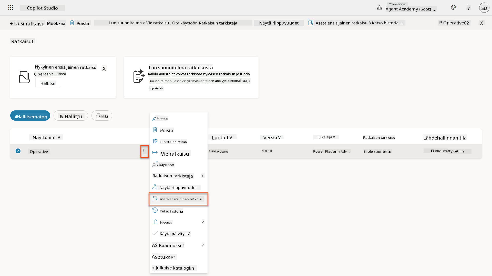

### 2.1.2 Konfiguroi rekrytointia hoitavan agentin ohjeet

1. **Siirry** Copilot Studioon. Varmista, että ympäristösi on valittu oikeassa yläkulmassa **Ympäristön valitsimessa**.

1. Avaa **Rekrytointia hoitava agenttisi** Tehtävästä 01

1. Valitse **Muokkaa** **Ohjeet**-osiossa **Yleiskatsaus**-välilehdellä ja lisää seuraavat ohjeet alkuun:

    ```text
    You are the central orchestrator for the hiring process. You coordinate activities, provide summaries, and delegate work to specialized agents.
    ```

1. Valitse **Tallenna**  
    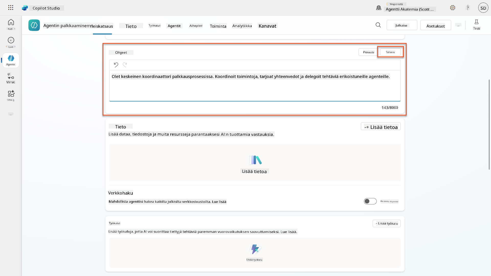

1. Valitse **Asetukset** (oikea yläkulma)

1. Varmista seuraavat asetukset:

    | Asetus | Arvo |
    |---------|-------|
    | Käytä generatiivista AI-orkestrointia agentin vastauksille | **Kyllä** |
    | Sisällön moderointi | **Kohtalainen** |
    | Käytä yleistä tietoa | **Pois päältä** |
    | Käytä tietoa verkosta | **Pois päältä** |
    | Tiedostojen lataukset | **Päällä** |

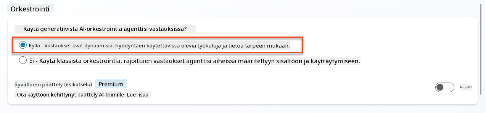
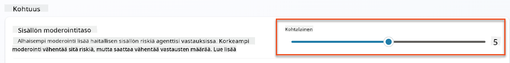


### 2.1.3 Lisää hakemusten vastaanottaja-lapsiagentti

1. **Siirry** **Agentit**
Käytämme **Agent Flow -työkaluja** sen sijaan, että käyttäisimme Aiheita *Lataa ansioluettelo* -vaiheessa, koska tämä monivaiheinen taustaprosessi vaatii determinististä suoritusta ja integraatiota ulkoisten järjestelmien kanssa. Vaikka Aiheet sopivat parhaiten keskustelun ohjaamiseen, Agent Flow tarjoaa rakenteellisen automaation, joka tarvitaan tiedostojen käsittelyyn, tietojen validointiin ja tietokantapäivityksiin (lisää uusi tai päivitä olemassa oleva) luotettavasti ilman käyttäjän vuorovaikutusta.

1. Etsi **Työkalut**-osio Application Intake Agent -sivulta.
   **Tärkeää:** Tämä ei ole pääagentin Työkalut-välilehti, vaan se löytyy vierittämällä alas lapsiagentin ohjeiden alta.

1. Valitse **+ Lisää**
   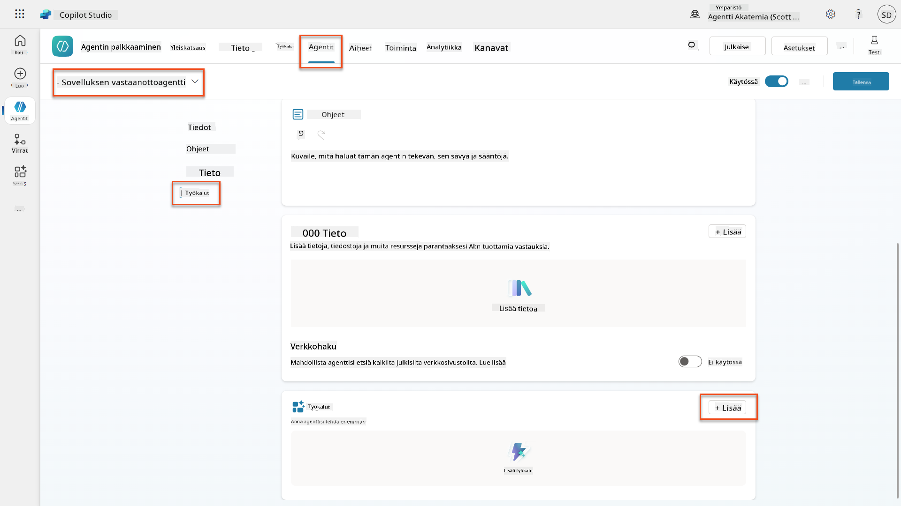

1. Valitse **+ Uusi työkalu** 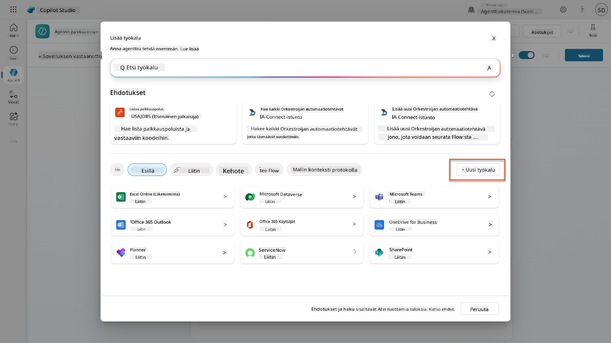

1. Valitse **Agent flow**.
    Agent Flow -suunnittelija avautuu, ja tässä lisätään ansioluettelon latauslogiikka.  
    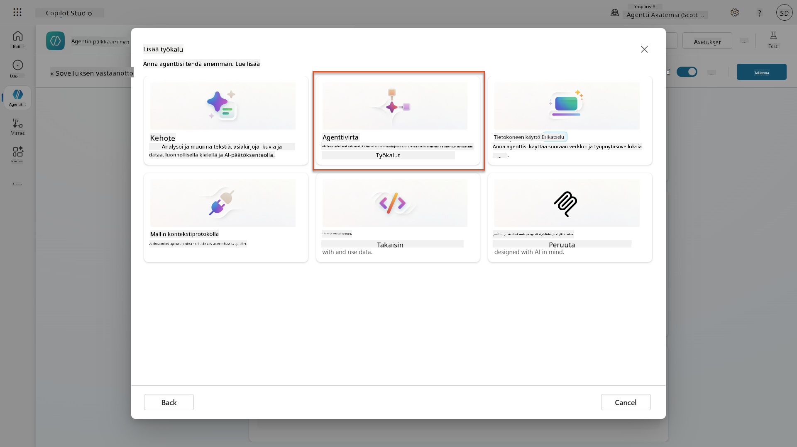

1. Valitse **Kun agentti kutsuu flow'n** -solmu ja valitse **+ Lisää** syöte seuraaville parametreille, varmistaen, että lisäät sekä nimen että kuvauksen.

    | Tyyppi | Nimi       | Kuvaus                                                                                                   |
    |--------|------------|---------------------------------------------------------------------------------------------------------|
    | Tiedosto | Ansioluettelo | Ansioluettelo PDF-tiedosto                                                                                 |
    | Teksti  | Viesti     | Luo saatekirjeen tyylinen viesti kontekstista. Viestin tulee olla alle 2000 merkkiä.                     |
    | Teksti  | KäyttäjänSähköposti | Sähköpostiosoite, josta ansioluettelo on peräisin. Tämä on käyttäjä, joka lataa ansioluettelon chatissa, tai lähettäjän sähköpostiosoite, jos se on vastaanotettu sähköpostitse. |

    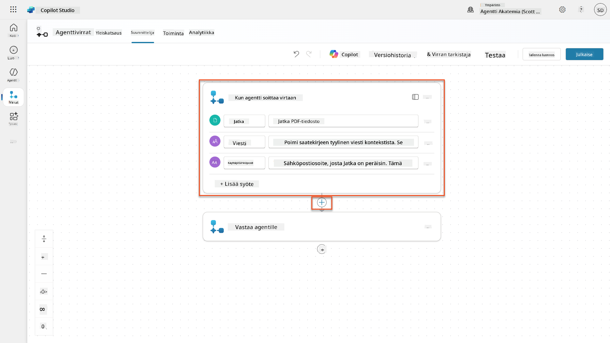

1. Valitse **+ -kuvake** trigger-solmun alapuolella, etsi `Dataverse`, valitse **Näytä lisää** Microsoft Dataversen vieressä ja valitse **Lisää uusi rivi** -toiminto **Microsoft Dataverse** -osiossa  
    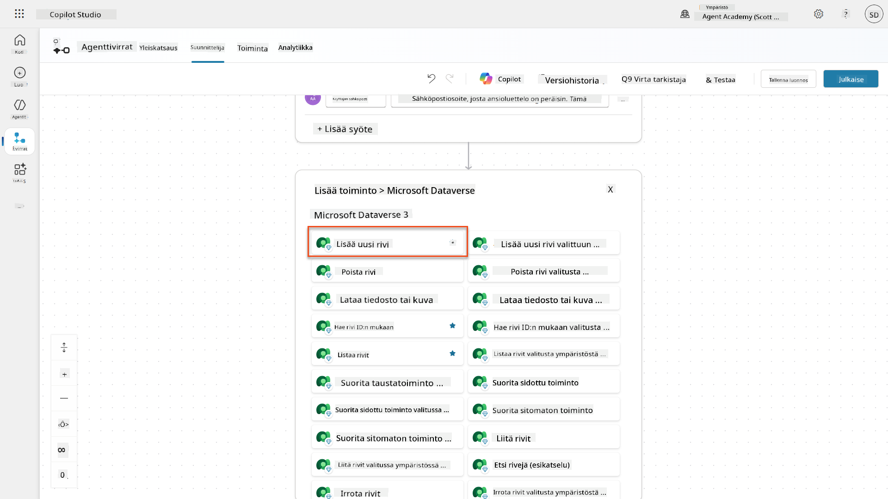

1. Nimeä solmu **Luo ansioluettelo**, valitsemalla **kolme pistettä (...)**, ja valitsemalla **Nimeä uudelleen**  
    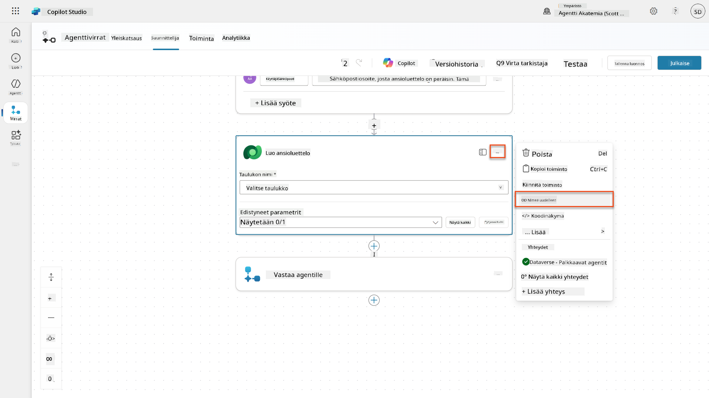

1. Aseta **Taulukon nimi** arvoksi **Ansioluettelot**, ja valitse sitten **Näytä kaikki**, jotta kaikki parametrit näkyvät.

1. Aseta seuraavat **ominaisuudet**:

    | Ominaisuus              | Miten asetetaan                 | Yksityiskohdat / Lauseke                                         |
    |-------------------------|---------------------------------|------------------------------------------------------------------|
    | **Ansioluettelon otsikko** | Dynaaminen data (salama-kuvake) | **Kun agentti kutsuu flow'n** → **Ansioluettelon nimi**    Jos et näe Ansioluettelon nimeä, varmista, että olet määrittänyt Ansioluettelo-parametrin yllä datatyypiksi. |
    | **Saatekirje**          | Lauseke (fx-kuvake)            | `if(greater(length(triggerBody()?['text']), 2000), substring(triggerBody()?['text'], 0, 2000), triggerBody()?['text'])` |
    | **Lähteen sähköpostiosoite** | Dynaaminen data (salama-kuvake) | **Kun agentti kutsuu flow'n** → **KäyttäjänSähköposti**             |
    | **Latauspäivämäärä**    | Lauseke (fx-kuvake)            | `utcNow()`                                                   |

    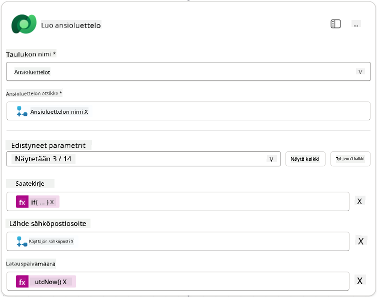

1. Valitse **+ -kuvake** Luo ansioluettelo -solmun alapuolella, etsi `Dataverse`, valitse **Näytä lisää** Microsoft Dataversen vieressä ja valitse **Lataa tiedosto tai kuva** -toiminto.
   **Tärkeää:** Varmista, ettet valitse toimintoa "Lataa tiedosto tai kuva valittuun ympäristöön".

1. Nimeä solmu **Lataa ansioluettelotiedosto**, valitsemalla **kolme pistettä (...)**, ja valitsemalla **Nimeä uudelleen**

1. Aseta seuraavat **ominaisuudet**:

     | Ominaisuus | Miten asetetaan | Yksityiskohdat |
     |------------|-----------------|----------------|
     | **Sisällön nimi** | Dynaaminen data (salama-kuvake) | Kun agentti kutsuu flow'n → Ansioluettelon nimi |
     | **Taulukon nimi** | Valitse | Ansioluettelot |
     | **Rivin tunnus** | Dynaaminen data (salama-kuvake) | Luo ansioluettelo → Näytä lisää → Ansioluettelo |
     | **Sarakkeen nimi** | Valitse | Ansioluettelo PDF |
     | **Sisältö** | Dynaaminen data (salama-kuvake) | Kun agentti kutsuu flow'n → Ansioluettelon contentBytes |

     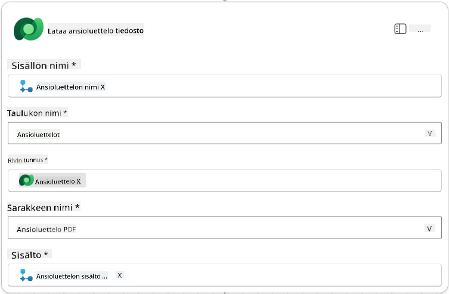

1. Valitse **Vastaa agentille -solmu**, ja valitse sitten **+ Lisää ulostulo**

     | Ominaisuus | Miten asetetaan | Yksityiskohdat |
     |------------|-----------------|----------------|
     | **Tyyppi** | Valitse | `Teksti` |
     | **Nimi** | Kirjoita | `AnsioluettelonNumero` |
     | **Arvo** | Dynaaminen data (salama-kuvake) | Luo ansioluettelo → Näytä lisää → Ansioluettelon numero |
     | **Kuvaus** | Kirjoita | `Luodun ansioluettelon [AnsioluettelonNumero]` |

     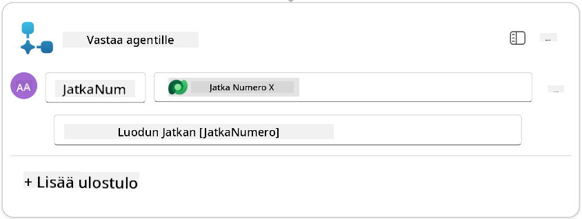

1. Valitse **Tallenna luonnos** oikeasta yläkulmasta  
     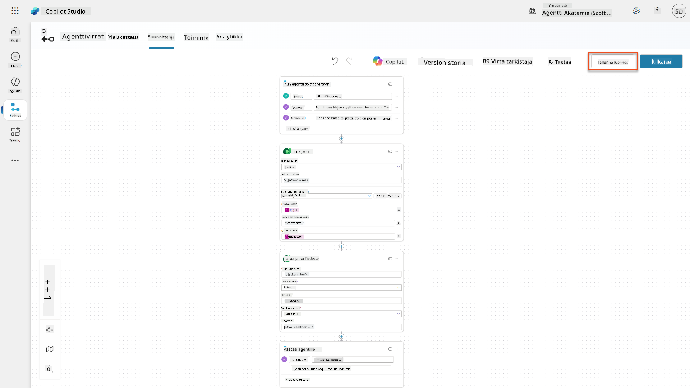

1. Valitse **Yleiskatsaus**-välilehti, valitse **Muokkaa** kohdassa **Tiedot**-paneeli

     1. **Flow'n nimi**:`Ansioluettelon lataus`
     1. **Kuvaus**:`Lataa ansioluettelo pyydettäessä`

     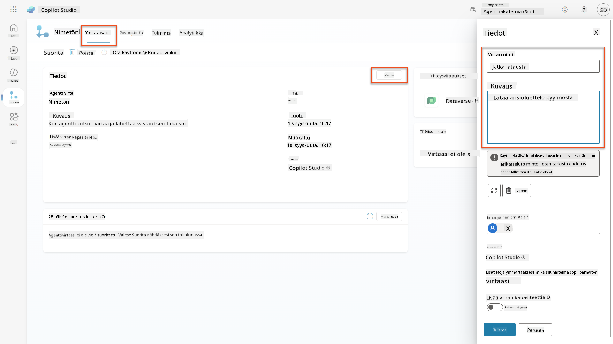

1. Valitse uudelleen **Suunnittelija**-välilehti ja valitse **Julkaise**.  
     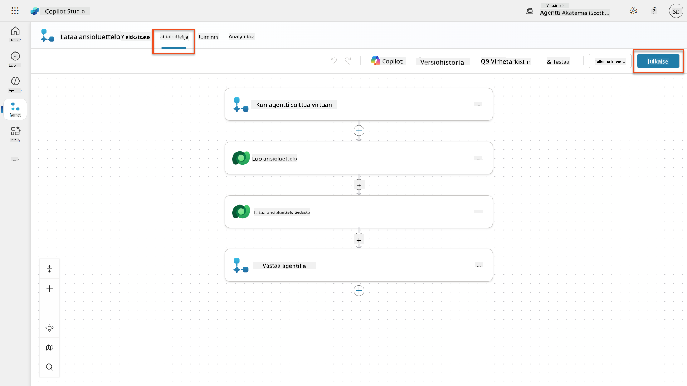

### 2.1.5 Yhdistä flow agenttiisi

Nyt yhdistät julkaistun flow'n Application Intake Agent -agenttiisi.

1. Siirry takaisin **Hiring Agent** -agenttiin ja valitse **Agentit**-välilehti. Avaa **Application Intake Agent**, ja etsi **Työkalut**-paneeli.  
    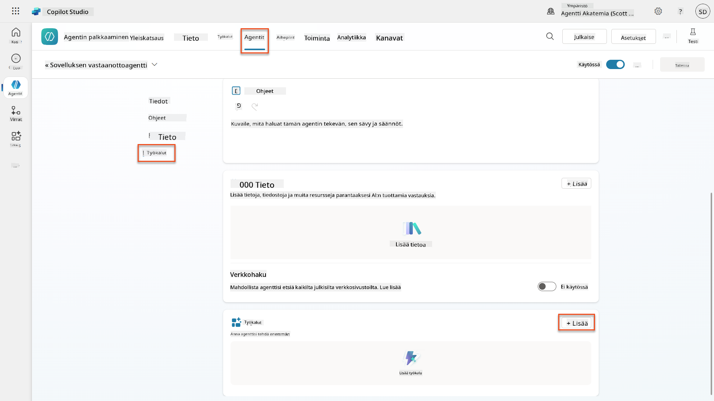

1. Valitse **+ Lisää**

1. Valitse **Flow**-suodatin ja etsi `Ansioluettelon lataus`. Valitse **Ansioluettelon lataus** -flow ja sitten **Lisää ja määritä**.

1. Aseta seuraavat parametrit:

    | Parametri | Arvo |
    |-----------|------|
    | **Kuvaus** | `Lataa ansioluettelo pyydettäessä. TIUKKA SÄÄNTÖ: Kutsu tätä työkalua vain, kun viitataan muotoon "Ansioluettelon lataus" ja liitteitä on mukana.` |
    | **Lisätiedot → Milloin tätä työkalua voidaan käyttää** | `vain kun aihe tai agentti viittaa siihen` |
    | **Syötteet → Lisää syöte** | `contentBytes` |
    | **Syötteet → Lisää syöte** | `name` |

    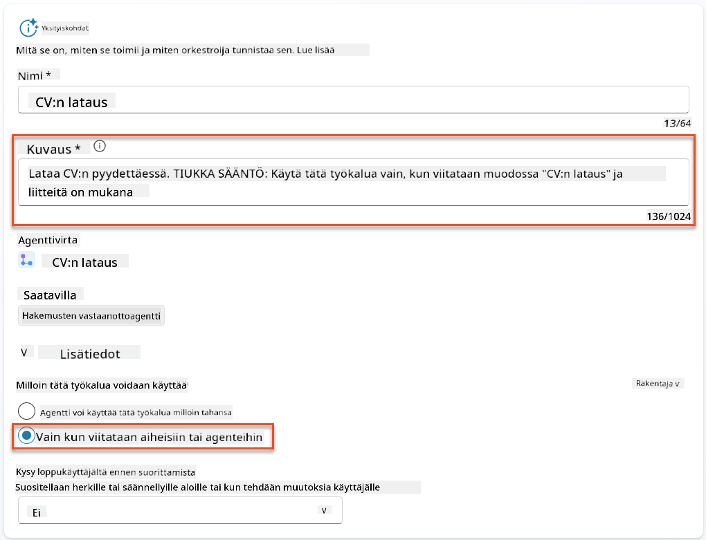

    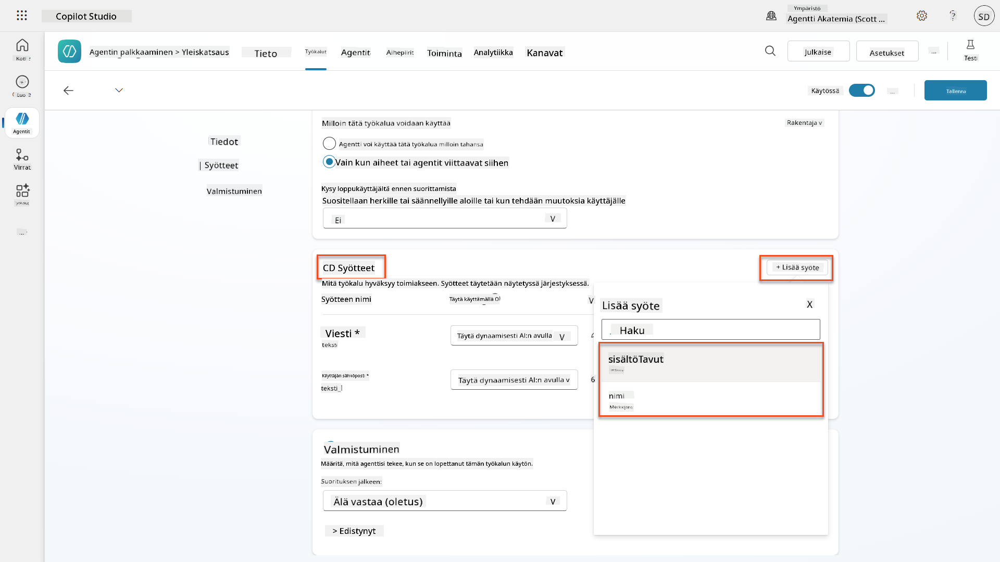

1. Aseta seuraavaksi syötteiden ominaisuudet seuraavasti:

    | Syöteparametri | Ominaisuus | Yksityiskohdat |
    |----------------|------------|----------------|
    | **contentBytes** | Täytä käyttäen | Mukautettu arvo |
    |                  | Arvo (...→Kaava→Lisää) | `First(System.Activity.Attachments).Content` |
    | **name** | Täytä käyttäen | Mukautettu arvo |
    |          | Arvo (...→Kaava→Lisää) | `First(System.Activity.Attachments).Name` |
    | **Viesti** | Mukauta | Määritä mukautetut asetukset |
    |             | Kuvaus | `Luo saatekirjeen tyylinen viesti kontekstista. Varmista, ettet koskaan pyydä käyttäjää ja luo vähintään minimaalinen saatekirje saatavilla olevasta kontekstista. TIUKKA SÄÄNTÖ - viestin tulee olla alle 2000 merkkiä.` |
    |             | Kuinka monta kertaa kysytään uudelleen | Älä toista |
    |             | Toiminta, jos entiteettiä ei löydy | Aseta muuttuja arvoon |
    |             | Oletusarvo entiteetille | Ansioluettelon lataus |
    | **KäyttäjänSähköposti** | Täytä käyttäen | Mukautettu arvo |
    |  | Arvo (...→Kaava→Lisää) | `System.User.Email` |

    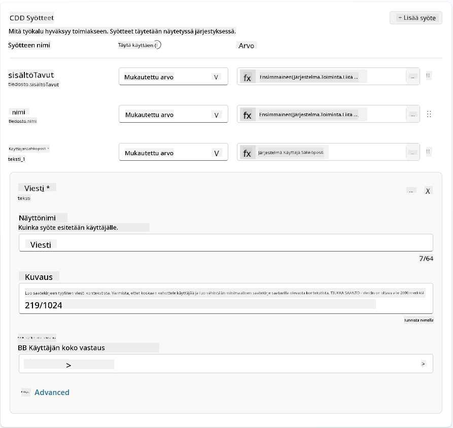

1. Valitse **Tallenna**

### 2.1.6 Määritä agentin ohjeet

1. Siirry takaisin **Application Intake Agent** -agenttiin valitsemalla **Agentit**-välilehti ja etsi **Ohjeet**-paneeli.

1. Liitä **Ohjeet**-kenttään seuraavat selkeät ohjeet lapsiagentillesi:

    ```text
    You are tasked with managing incoming Resumes, Candidate information, and creating Job Applications.  
    Only use tools if the step exactly matches the defined process. Otherwise, indicate you cannot help.  
    
    Process for Resume Upload via Chat  
    1. Upload Resume  
      - Trigger only if /System.Activity.Attachments contains exactly one new resume.  
      - If more than one file, instruct the user to upload one at a time and stop.  
      - Call /Upload Resume once. Never upload more than once for the same message.  
    
    2. Post-Upload  
      - Always output the [ResumeNumber] (R#####).  
    ```

1. Missä ohjeet sisältävät kauttaviivan (/), valitse teksti kauttaviivan jälkeen ja valitse ratkaistu nimi. Tee tämä seuraaville:

    - `System.Activity.Attachments` (Muuttuja)
    - `Lataa ansioluettelo` (Työkalu)

    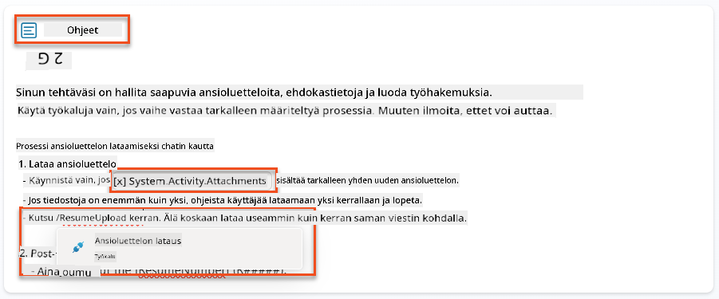

1. Valitse **Tallenna**

### 2.1.7 Testaa Application Intake Agent

Nyt varmistetaan, että ensimmäinen orkesterin jäsen toimii oikein.

1. **Lataa** [testi-ansioluettelot.](https://download-directory.github.io/?url=https://github.com/microsoft/agent-academy/tree/main/operative/sample-data/resumes&filename=operative_sampledata)

1. **Avaa** testipaneeli valitsemalla **Testaa**.

1. **Lataa** kaksi ansioluetteloa testichattiin ja anna viesti `Käsittele nämä ansioluettelot`

    - Agentin pitäisi palauttaa viesti, joka on samankaltainen kuin *Vain yksi ansioluettelo voidaan ladata kerrallaan. Lataa yksi ansioluettelo jatkaaksesi.*

    

1. Kokeile ladata **vain yksi ansioluettelo**, viestillä `Käsittele tämä ansioluettelo`

    - Agentin pitäisi sitten antaa viesti, joka on samankaltainen kuin *Ansioluettelo Avery Examplelle on ladattu onnistuneesti. Ansioluettelon numero on R10026.*

1. **Toimintakartassa** sinun pitäisi nähdä **Application Intake Agent** käsittelemässä ansioluettelon latausta.  
    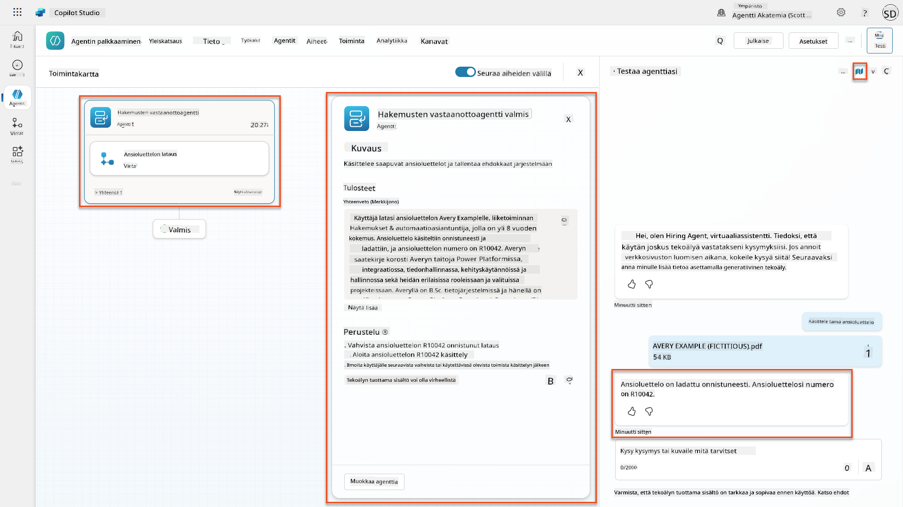

1. Siirry osoitteeseen make.powerapps.com → Varmista, että ympäristösi on valittu oikeassa yläkulmassa olevasta ympäristövalitsimesta.

1. Valitse **Sovellukset** → Hiring Hub → kolmen pisteen (...) valikko → **Pelaa**  
    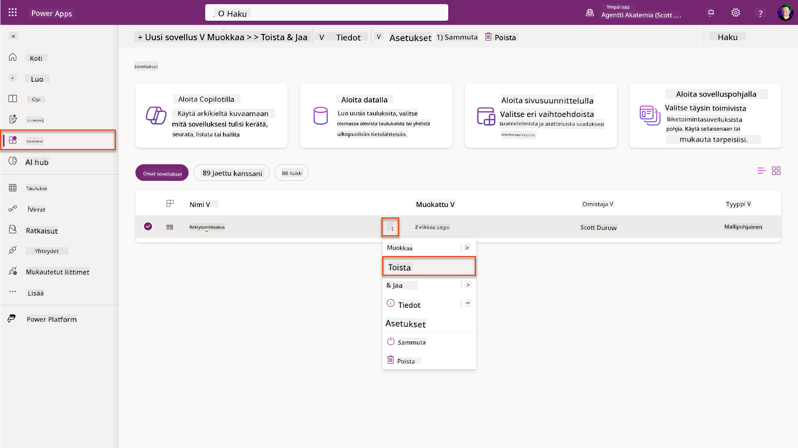

    Huomautus: Jos pelaa-painike on harmaana, se tarkoittaa, että et ole julkaissut ratkaisua Mission 01:stä. Valitse **Ratkaisut** → **Julkaise kaikki mukautukset**.

1. Siirry kohtaan **Ansioluettelot** ja tarkista, että ansioluettelotiedosto on ladattu ja saatekirje on asetettu vastaavasti.  
    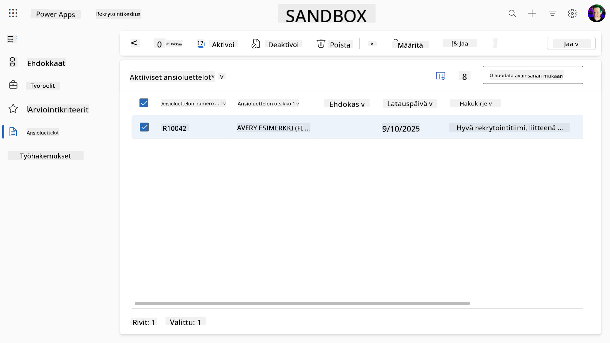

## 🧪Lab 2.2: Lisää haastatteluun valmistautumiseen liittyvä yhdistetty agentti

Nyt luodaan yhdistetty agentti haastatteluun valmistautumista varten ja lisätään se olemassa olevaan Hiring Agent -agenttiin.

### 2.2.1 Luo yhdistetty haastatteluagentti

1. **Siirry** Copilot Studioon. Varmista, että ympäristösi on edelleen valittu oikeassa yläkulmassa olevasta ympäristövalitsimesta.

1. Avaa **Hiring Agent**

1. Siirry Agentti-välilehteen ja valitse **+ Lisää agentti**

1. Valitse **Yhdistä olemassa oleva agentti** → **Copilot Studio**

1. Valitse **+ Uusi agentti**

### 2.2.2 Määritä perusasetukset

1. Valitse **Määritä**-välilehti ja syötä seuraavat ominaisuudet:

    - **Nimi**: `Haastatteluagentti`
    - **Kuvaus**: `Auttaa haastatteluprosessissa.`

1. Ohjeet:

    ```text
    You are the Interview Agent. You help interviewers and hiring managers prepare for interviews. You never contact candidates. 
    Use Knowledge to help with interview preparation. 
    
    The only valid identifiers are:
      - ResumeNumber (ppa_resumenumber)→ format R#####
      - CandidateNumber (ppa_candidatenumber)→ format C#####
      - ApplicationNumber (ppa_applicationnumber)→ format A#####
      - JobRoleNumber (ppa_jobrolenumber)→ format J#####
    
    Examples you handle
      - Give me a summary of ...
      - Help me prepare to interview candidates for the Power Platform Developer role
      - Create interview assistance for the candidates for Power Platform Developer
      - Give targeted questions for Candidate Alex Johnson focusing on the criteria for the Job Application
      
    How to work:
        You are expected to ask clarification questions if required information for queries is not provided
        - If asked for interview help without providing a job role, ask for it
        - If asking for interview questions, ask for the candidate and job role if not provided.
    
    General behavior
    - Do not invent or guess facts
    - Be concise, professional, and evidence-based
    - Map strengths and risks to the highest-weight criteria
    - If data is missing (e.g., no resume), state what is missing and ask for clarification
    - Never address or message a candidate
    ```

1. Vaihda **Verkkohaku** tilaan **Pois päältä**

1. Valitse **Luo**  
    

### 2.2.3 Määritä tiedonsaanti ja julkaise

1. **Tiedot**-osiossa valitse **+ Lisää tietoa**  
    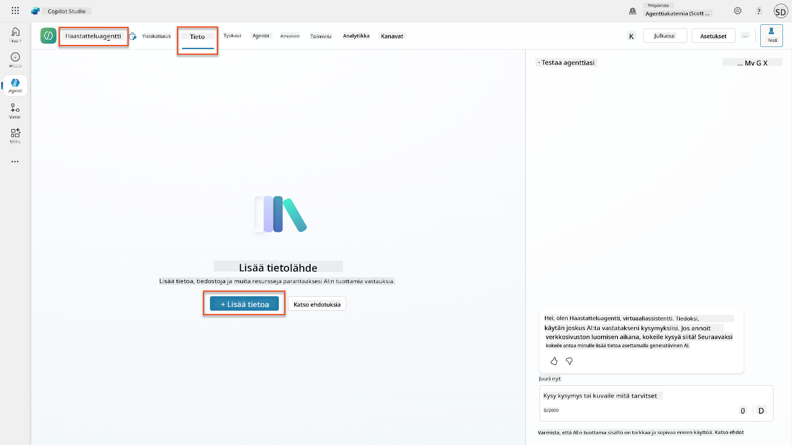
1. Valitse **Dataverse**  
    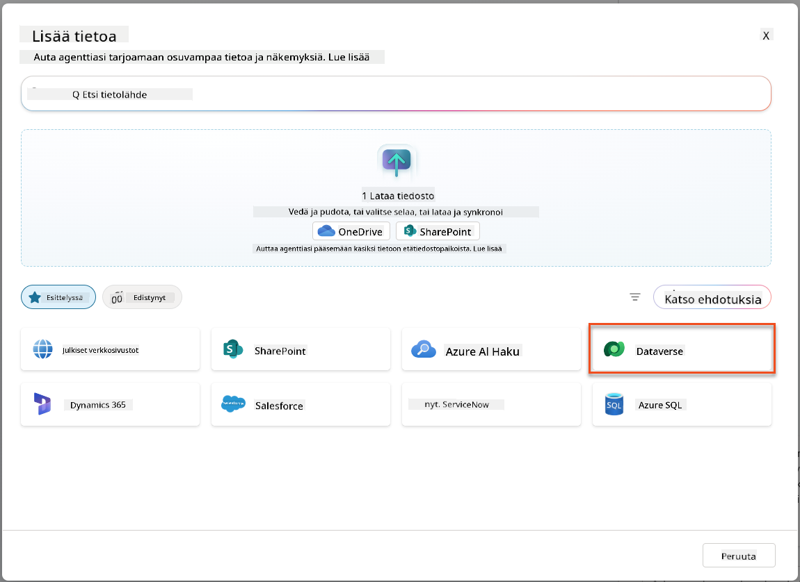
1. **Hakukenttään**, kirjoita `ppa_`. Tämä on aiemmin tuomiesi taulukoiden etuliite.
1. **Valitse** kaikki 5 taulukkoa (Ehdokas, Arviointikriteerit, Työhakemus, Työrooli, Ansioluettelo)
1. Valitse **Lisää agenttiin**  
    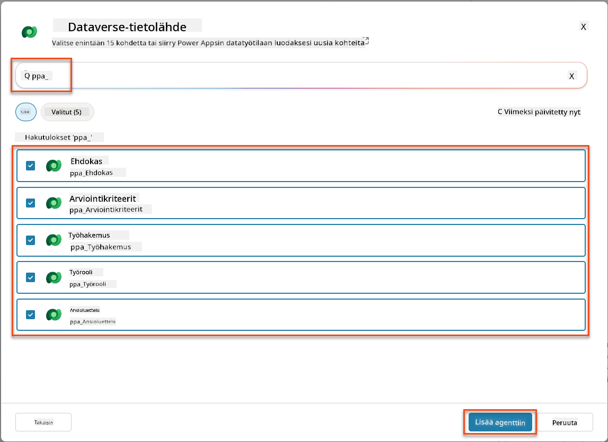
1. Valitse **Asetukset**, haastatteluagentissa, ja aseta seuraavat asetukset:

    - **Anna muiden agenttien yhdistää ja käyttää tätä:** `Päällä`
    - **Käytä yleistä tietoa**: `Pois päältä`
    - **Tiedostojen lataukset**: `Pois päältä`
    - **Sisällön moderointitaso:** `Keskitaso`
1. Valitse **Tallenna**
1. Valitse **Julkaise**, ja odota julkaisun valmistumista.

### 2.2.4 Yhdistä haastatteluun valmistautumisagentti Hiring Agent -agenttiin

1. Siirry takaisin **Hiring Agent** -agenttiin

1. Valitse **Agentit**-välilehti

1. Käytä **+ Lisää agentti** → **Copilot Studio**, lisätäksesi **Haastatteluagentin**. Aseta Kuvaus:
    ```text
    Assists with the interview process and provides information about Resumes, Candidates, Job Roles, and Evaluation Criteria.
    ```

    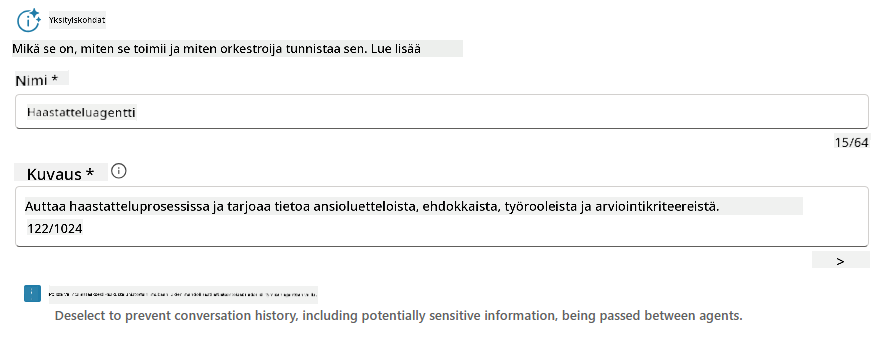
    Huomaa, että "Pass conversation history to this agent" -asetus on valittuna. Tämä mahdollistaa sen, että pääagentti voi tarjota täydellisen kontekstin yhdistetylle agentille.

1. Valitse **Add agent**

1. Varmista, että näet sekä **Application Intake Agent** että **Interview Agent**. Huomaa, kuinka toinen on lapsiagentti ja toinen yhdistetty agentti.  
    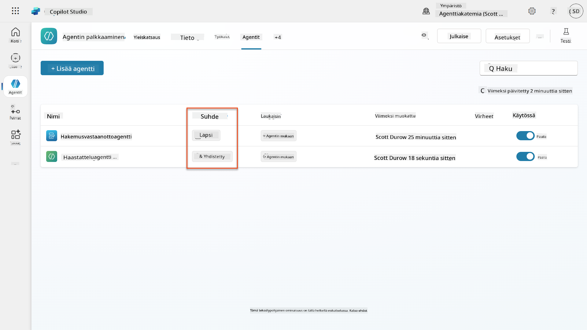

### 2.2.5 Testaa monen agentin yhteistyötä

1. **Avaa** testipaneeli valitsemalla **Test**.

1. **Lataa** yksi testiansioista ja kirjoita seuraava kuvaus, joka kertoo pääagentille, mitä se voi delegoida yhdistetylle agentille:

    ```text
    Upload this resume, then show me open job roles, each with a description of the evaluation criteria, then use this to match the resume to at least one suitable job role even if not a perfect match.
    ```

    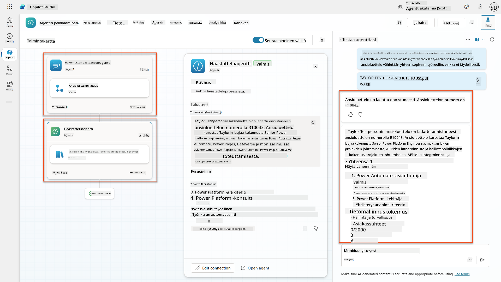

1. Huomaa, kuinka Hiring Agent delegoi latauksen lapsiagentille ja pyysi sitten Interview Agentia tarjoamaan yhteenvedon ja työroolin vastaavuuden sen tietämyksen avulla.  
   Kokeile erilaisia tapoja esittää kysymyksiä ansioluetteloista, työrooleista ja arviointikriteereistä.  
   **Esimerkkejä:**

    ```text
    Give me a summary of active resumes
    ```

    ```text
    Summarize resume R10044
    ```

    ```text
    Which active resumes are suitable for the Power Platform Developer role?
    ```

## 🎉 Tehtävä suoritettu

Hienoa työtä, Agentti! **Operation Symphony** on nyt valmis. Olet onnistuneesti muuttanut yksittäisen Hiring Agentin kehittyneeksi monen agentin orkesteriksi, jolla on erikoistuneita kykyjä.

Tässä on, mitä olet saavuttanut tässä tehtävässä:

**✅ Monen agentin arkkitehtuurin hallinta**  
Ymmärrät nyt, milloin käyttää lapsiagentteja vs yhdistettyjä agentteja ja kuinka suunnitella järjestelmiä, jotka skaalautuvat.

**✅ Application Intake lapsiagentti**  
Olet lisännyt erikoistuneen lapsiagentin Hiring Agentille, joka käsittelee ansioluetteloita, poimii kandidaattien tietoja ja tallentaa tiedot Dataverseen.

**✅ Interview Prep yhdistetty agentti**  
Olet rakentanut uudelleenkäytettävän yhdistetyn agentin haastattelun valmisteluun ja onnistuneesti yhdistänyt sen Hiring Agentiin.

**✅ Agenttien välinen viestintä**  
Olet nähnyt, kuinka pääagenttisi voi tehdä yhteistyötä erikoistuneiden agenttien kanssa, jakaa kontekstia ja orkestroida monimutkaisia työnkulkuja.

**✅ Perusta autonomialle**  
Parannettu rekrytointijärjestelmäsi on nyt valmis edistyneille ominaisuuksille, joita lisäämme tulevissa tehtävissä: autonomiset laukaisimet, sisällön moderointi ja syvä päättely.

🚀**Seuraavaksi:** Seuraavassa tehtävässä opit, kuinka konfiguroida agenttisi käsittelemään ansioluetteloita automaattisesti sähköposteista!

⏩[Siirry tehtävään 03: Automatisoi agenttisi laukaisimilla](../03-automate-triggers/README.md)

## 📚 Taktiset resurssit

📖 [Lisää muita agentteja (esikatselu)](https://learn.microsoft.com/microsoft-copilot-studio/authoring-add-other-agents?WT.mc_id=power-182762-scottdurow)

📖 [Lisää työkaluja mukautettuihin agentteihin](https://learn.microsoft.com/microsoft-copilot-studio/advanced-plugin-actions?WT.mc_id=power-182762-scottdurow)

📖 [Työskentele Dataversen kanssa Copilot Studiossa](https://learn.microsoft.com/microsoft-copilot-studio/knowledge-add-dataverse?WT.mc_id=power-182762-scottdurow)

📖 [Agenttien työnkulkujen yleiskatsaus](https://learn.microsoft.com/microsoft-copilot-studio/flows-overview?WT.mc_id=power-182762-scottdurow)

📖 [Luo ratkaisu](https://learn.microsoft.com/power-platform/alm/solution-concepts-alm?WT.mc_id=power-182762-scottdurow)

📖 [Power Platformin ratkaisu ALM-opas](https://learn.microsoft.com/power-platform/alm/overview-alm?WT.mc_id=power-182762-scottdurow)

📺 [Agenttien välinen yhteistyö Copilot Studiossa](https://youtu.be/d-oD3pApHAg?si=rwIHKhJTkjSvhTHw)

---

**Vastuuvapauslauseke**:  
Tämä asiakirja on käännetty käyttämällä tekoälypohjaista käännöspalvelua [Co-op Translator](https://github.com/Azure/co-op-translator). Vaikka pyrimme tarkkuuteen, huomioithan, että automaattiset käännökset voivat sisältää virheitä tai epätarkkuuksia. Alkuperäinen asiakirja sen alkuperäisellä kielellä tulisi pitää ensisijaisena lähteenä. Tärkeissä tiedoissa suositellaan ammattimaista ihmiskäännöstä. Emme ole vastuussa väärinkäsityksistä tai virhetulkinnoista, jotka johtuvat tämän käännöksen käytöstä.