<!--
CO_OP_TRANSLATOR_METADATA:
{
  "original_hash": "75efaf515d5694d4fd549bfd6518901a",
  "translation_date": "2025-10-17T01:55:43+00:00",
  "source_file": "docs/operative-preview/03-automate-triggers/README.md",
  "language_code": "fi"
}
-->
# Tehtävä 03: Lisää tapahtumatriggereitä toimimaan itsenäisesti

--8<-- "disclaimer.md"

## 🕵️‍♂️ Koodinimi: `OPERATION SIGNAL POINT`

> **⏱️ Operaatioaikaikkuna:** `~45 minuuttia`

## 🎯 Tehtävän kuvaus

Tervetuloa takaisin, Agentti. [Tehtävässä 02](../02-multi-agent/README.md) opit rakentamaan Application Intake -lapsiagentin ja Interview Prep -yhdistetyn agentin laajentaaksesi päärekrytointiauttajasi kykyjä.

Tehtäväsi, jos päätät hyväksyä sen, on **Operation Signal Point** - syventyminen **tapahtumatriggereihin** - nostamalla agenttijärjestelmäsi reaktiivisesta **itsenäiseen toimintaan**. Muunnat agenttisi odottamasta ihmisen syötettä proaktiivisesti reagoimaan ulkoisiin tapahtumiin ja toimimaan älykkäästi ilman valvontaa.

Ajattele sitä päivityksenä agenteista, jotka _vastaavat kysymyksiin_, agenteiksi, jotka _ennakoivat tarpeita_ ja _toimivat itsenäisesti_. Tapahtumatriggereiden ja automatisoitujen työnkulkujen avulla rekrytointiauttajasi havaitsee saapuvat ansioluettelot sähköpostitse, käsittelee liitteet automaattisesti, tallentaa tiedot Dataverseen ja ilmoittaa HR-rekrytointitiimillesi Microsoft Teamsin kautta - samalla kun keskityt tärkeämpiin tehtäviin.

Tervetuloa maailmaan, jossa automaatio kohtaa älykkyyden.

## 🔎 Tavoitteet

Tässä tehtävässä opit:

1. Kuinka tapahtumatriggerit mahdollistavat itsenäisen agentin toiminnan ilman käyttäjän vuorovaikutusta
1. Erot interaktiivisten ja itsenäisten agenttien välillä Copilot Studiossa
1. Kuinka luoda tapahtumatriggereitä, jotka käsittelevät sähköpostiliitteitä automaattisesti ja lataavat tiedostoja Dataverseen
1. Kuinka rakentaa agenttivirtoja, jotka lähettävät mukautuvia kortteja Teams-kanaville ilmoituksia varten
1. Kuinka siirtää tietoja tapahtumatriggereiden ja agenttivirtojen välillä päästä-päähän automaatiota varten

## 🤔 Mikä on tapahtumatriggeri?

Aiemmin [Recruitissa](../../recruit/10-add-event-triggers/README.md) opimme tapahtumatriggereistä. Käydään tämä nopeasti läpi, jos se jäi välistä.

**Tapahtumatriggerit** antavat agentin _toimia_ _itsenäisesti_, kun jotain tapahtuu toisessa järjestelmässä - ilman käyttäjän viestiä. Kun määritetty tapahtuma käynnistyy - kuten “uusi SharePoint-kohde,” “uusi sähköposti,” “Planner-tehtävä osoitettu” tai jopa ajastettu toistuvuus, liitin lähettää triggerin hyötykuorman agentillesi. Agentti noudattaa sitten ohjeitasi päättääkseen, mitä toimia tai aiheita kutsua.

### Keskeiset ominaisuudet

- **Itsenäinen aktivointi:**
      - Toisin kuin aiheet, jotka käynnistyvät, kun käyttäjä kirjoittaa agentille, tapahtumatriggerit käynnistyvät ulkoisista tapahtumista, mikä mahdollistaa proaktiivisen toiminnan.

- **Hyötykuormaohjattu:**
      - Jokainen tapahtuma toimittaa hyötykuorman (muuttujat + valinnaiset ohjeet) liittimen kautta. Agentti käyttää määritettyjä ohjeitasi ja hyötykuormaa päättääkseen, mitä tehdä seuraavaksi.
      - Esimerkiksi _kutsua aihe_ tai _suorittaa työkalujen määrittämät toiminnot_.

- **Esimerkkejä valmiina:**
      - SharePoint/OneDrive-tiedosto tai -kohde luotu
      - Planner-tehtävä suoritettu/osoitettu
      - Microsoft Forms -vastaus lähetetty
      - Toistuvuus/aikataulu

    Saatavuus riippuu organisaatiosi Power Automate -datapolitiikoista.

- **Vaatii generatiivista orkestrointia:**
      - Tapahtumatriggerit ovat käytettävissä vain, kun generatiivinen orkestrointi on aktivoitu agentille.

- **Laskutus/käyttö:**
      - Jokainen triggerin toimitus lasketaan viestiksi Copilot Studion kapasiteetissa.
      - Esimerkiksi 10 minuutin toistuvuus lähettää viestin joka 10. minuutti.

- **Todennusmalli ja asennus:**
      - Lisää triggerit agentin yleiskatsauksessa, kohdassa _Triggers_. Trigger-liittimen todennus käyttää agentin tekijän tiliä (“agentin tekijän todennus”).
      - Voit muokata triggerin parametreja ja hyötykuormaa Power Automate -tekijäportaalissa.

- **Testaus ja havainnointi:**
      - Voit testata triggereitä agentin testipaneelista ja tarkastella toimintaa aktiviteettikartalla ennen julkaisua.

!!! info "TL;DR kehittäjille"

    Ajattele tapahtumatriggereitä **webhook-tyyppisinä signaaleina**, jotka työntävät rakenteellisen hyötykuorman agentillesi, antaen sen _aloittaa_ työn ja ketjuttaa toimintoja järjestelmien välillä - odottamatta käyttäjän pyyntöä.

### Aihetriggerit - miten ne eroavat

Aiemmin opit aihetriggereistä [Recruitissa](../../recruit/07-add-new-topic-with-trigger/README.md), mutta saatat silti miettiä, miten _aihetriggerit_ eroavat _tapahtumatriggereistä_ ja miksi tämä ero on tärkeä ymmärtää, mikä tekee agentista itsenäisen.

Aihetriggerit hallitsevat _milloin aihe käynnistyy_, yleensä käyttäjän viestin perusteella.

- Generatiivisessa orkestroinnissa oletustriggeri on **By agent** - suunnittelija valitsee aiheen, jonka nimi/kuvaus parhaiten vastaa käyttäjän viestiä.
- Klassisen orkestroinnin oletus on **Phrases** - suunnittelija valitsee aiheen, kun yksi tai useampi triggerilauseke parhaiten vastaa käyttäjän viestiä.

Muita triggerityyppejä ovat `Message received`, `Event received`, `Activity received`, `Conversation update`, `Invoke received`, `On redirect`, `Inactivity` ja `Plan complete`.

!!! info "Keskeinen ero"

    Aihetriggerit ovat _keskustelutoiminnan_ käynnistäjiä chatissa.
    
    Tapahtumatriggerit ovat järjestelmän _tapahtumien_ käynnistäjiä, jotka toimitetaan liittimien kautta ja voivat käynnistää agentin ilman keskustelua.

### Pikaopas: Aihetriggeri vs Tapahtumatriggeri

- **Aihetriggeri:** Käyttäjä (tai chat-toiminta) sanoi/teki X ➡️ käynnistä aihe T.
- **Tapahtumatriggeri:** SharePoint/Planner/Sähköposti/Ajasti käynnistyi hyötykuormalla P ➡️ agentti arvioi ohjeet ➡️ kutsuu Toiminnot/Aiheet vastaavasti.

## 🏓 Interaktiivinen agentti vs Itsenäinen agentti - vertailu

Nyt kun tiedät eron tapahtumatriggereiden ja aihetriggereiden välillä, seuraavaksi opit eron interaktiivisen agentin ja itsenäisen agentin välillä.

Copilot Studion termeissä "interaktiivinen" viittaa agenteihin, jotka pääasiassa toimivat **aiheiden** kautta chatissa tai kanavassa. "Itsenäinen" viittaa agenteihin, jotka hyödyntävät myös **tapahtumatriggereitä** toimiakseen ilman käyttäjän syötettä.

Seuraava taulukko tiivistää niiden erot ja yhtäläisyydet.

| Ulottuvuus                          | Interaktiivinen agentti | Itsenäinen agentti                                                                                           |
|-------------------------------------|-------------------------|-------------------------------------------------------------------------------------------------------------|
| Miten käynnistyy                   | Käyttäjä (tai chat-toiminta) käynnistää aiheen. Esimerkki: By agent, Phrases, Message received. | Ulkoinen tapahtumatriggeri lähettää hyötykuorman liittimen kautta agentille. Esimerkki: SharePoint, Planner, sähköposti, aikataulu jne. |
| Pääasiallinen käyttö               | Kysymys-vastaus, ohjatut työnkulut, pyyntöihin perustuvat toiminnot chatissa - Teams, web jne. | Proaktiiviset toiminnot ja taustalla tapahtuva automaatio - reagoi järjestelmämuutoksiin ja ilmoittaa, arkistoi tai orkestroi tehtäviä. |
| Triggeripinta                      | Aihetriggerit: By agent / Phrases / Message received / Activity types / Invoke / Inactivity / Plan complete | Tapahtumatriggerikirjasto liittimien kautta; hyötykuorma sisältää tapahtumatiedot + valinnaiset ohjeet. |
| Suunnittelija (generatiivinen orkestrointi) | Hyödynnetään vahvasti By agent- ja Plan complete -triggereissä aiheiden valintaan/järjestykseen. | Vaaditaan tapahtumatriggereille; agentti käyttää ohjeita + hyötykuormaa päättääkseen, mitä toimintoja/aiheita kutsua. |
| Tyypillinen esimerkki              | Käyttäjä kysyy "Mikä on palautuskäytäntömme?" → Aihe käynnistyy, hakee tietoa, vastaa. | Uusi Planner-tehtävä osoitettu → Tapahtumatriggeri käynnistyy → Agentti lähettää Teams-viestin, päivittää tietueen tai kutsuu aiheen. |
| Asennuspolku                       | Luo aiheet, määritä triggerityyppi, kirjoita dialogi/toiminnot; julkaise kanaviin. | Lisää tapahtumatriggeri (Overview → Triggers), todenna liitin agentin tekijän tunnuksilla, määritä hyötykuorma/ohjeet; testaa testipaneelin kautta; julkaise. |
| Todennus ja hallinta               | Toimii kanavan/todennuksen kontekstissa; aihetriggerit vastaavat sallittujen kanavien chat-toimintoihin. | Triggerin saatavuus riippuu Power Automate -datapolitiikoista; liittimet toimivat agentin tekijän tilillä. |
| Havainnointi                       | Testaa aiheet Copilot Studiossa, tarkastele keskustelutranskripteja/toimintoja. | Käytä Test triggeriä ja aktiviteettikarttaa varmistaaksesi suoritus ennen julkaisua, seuraa toimintaa julkaisun jälkeen. |
| Kapasiteettivaikutus               | Jokainen käyttäjän viesti/agentin vastaus on viesti, joka kuluttaa kapasiteettia. | Jokainen tapahtuman toimitus on myös viesti, plus mahdolliset seuraavat toiminnot. Esimerkki: 10 minuutin toistuvuus = 6 viestiä/tunti |

### Milloin käyttää mitä?

- Valitse **aihetriggerit (interaktiiviset)**, kun käyttäjät aloittavat agenttikeskustelun - FAQ, ohjattu tiedonkeruu tai komento-tyyliset tehtävät chatissa. Suunnittelijan By agent -triggeri vähentää manuaalista lauseiden kuratointia.
- Lisää **tapahtumatriggerit (itsenäiset)**, kun agentin pitäisi aloittaa keskustelu tai toimia itse - SharePoint/Dataverse-päivityksissä, saapuvassa sähköpostissa tai aikataulussa. Tämä siirtää sinut reaktiivisesta proaktiiviseen toimintaan.

## Kehittäjävinkit ja huomioitavat asiat

1. **Ota generatiivinen orkestrointi käyttöön** kaikille agenteille, jotka haluat tehdä itsenäisiksi. Tapahtumatriggerit eivät näy muuten.

1. **Mallinna hyötykuorma aikaisin.** Päätä, mitkä minimikentät agenttisi tarvitsee triggeristä, kuten `itemId`, `assignedTo`, `dueDate`, ja lisää tiiviit ohjeet, jotka kertovat agentille, mitä toimintoa/aihetta kutsua hyötykuorman arvojen perusteella.

1. **Todennuksen laajuus on tärkeä.** Triggerit todennetaan agentin tekijän tilillä. Varmista, että tilillä on oikeat liittimen käyttöoikeudet ja että se noudattaa Power Automate -datapolitiikoita.

1. **Hallitse kustannuksia ja melua.** Korkean taajuuden toistuvuudet tai erittäin vilkkaat lähteet voivat nopeasti kuluttaa viestikapasiteettia - rajoita mahdollisuuksien mukaan tai lisää ehtoja triggeriin suodattaaksesi tapahtumia.

1. **Testaa ennen julkaisua.** Käytä **Test triggeriä** ja aktiviteettikarttaa tarkkaillaksesi suunnitelmaa ja kutsuttuja toimintoja - iteroi ohjeita/hyötykuormaa, kunnes toiminta on vakaa.

## 🧪 Lab 03 - Hakemusten sähköpostien automatisointi

Seuraavaksi lisäämme tapahtumatriggerin **Hiring Agentille** ja rakennamme agenttivirran lapsiagenttiin **Application Intake Agent**, joka käsittelee jatkokäsittelyä itsenäisyyden saavuttamiseksi.

### ✨ Käyttötapaus

!!! info ""

    **HR-rekrytoijana**

    **Haluan** saada ilmoituksen, kun ansioluetteloa sisältävä sähköposti saapuu postilaatikkooni ja se on automaattisesti ladattu Dataverseen

    **Jotta voin** pysyä ajan tasalla sähköpostitse lähetetyistä hakemuksista, jotka on automaattisesti ladattu Dataverseen

Tämä saavutetaan kahdella tekniikalla

1. Tapahtumatriggerillä, joka aktivoituu, kun sähköposti saapuu,
    1. Tarkista, että tiedoston `contentType` vastaa `PDF`-muotoa.
    1. Poimi tiedosto ja lataa se Dataverseen Dataverse-liittimen toimien avulla.
    1. Lähetä sitten kehotus agentille jatkokäsittelyä varten siirtämällä syöttöparametrit Dataverse-toimista.

1. Agenttivirta lisätään lapsiagenttiin **Application Intake Agent**, joka aktivoituu tapahtumatriggerin kehotuksesta.
    1. Käytä tapahtumatriggerin kehotuksesta siirrettyjä syöttöparametreja mukautuvassa kortissa, joka lähetetään Microsoft Teams -kanavalle HR-rekrytointitiimin ilmoitukseksi. Mukautuva kortti sisältää linkin Dataversen riville, joka näkyy **Hiring Agentissa**.

Aloitetaan!

### ✨ Esivaatimukset tehtävän suorittamiseksi

Tarvitset **joko**:

- **Olla suorittanut Tehtävä 01 ja Tehtävä 02** ja valmiin Hiring Agentin, **TAI**
- **Tuoda Tehtävä 03 aloitusratkaisun**, jos aloitat alusta tai tarvitset kiinniottoa. [Lataa Tehtävä 03 aloitusratkaisu](https://aka.ms/agent-academy)

!!! note "Ratkaisun tuonti ja esimerkkidata"
    Jos käytät aloitusratkaisua, katso [Tehtävä 01](../01-get-started/README.md) saadaksesi yksityiskohtaiset ohjeet ratkaisujen ja esimerkkidatan tuomisesta ympäristöösi.

Tarvitset myös pääsyn **Microsoft Teamsiin** suorittaaksesi toisen laboratorion harjoituksen mukautuvan kortin lähettämisestä Microsoft Teamsiin.

### Lab 3.1 - Automatisoi ansioluetteloiden lataaminen Dataverseen sähköpostitse

1. Hiring Agentissa, vieritä alas **Overview-välilehdellä** ja valitse **+ Add trigger**.

       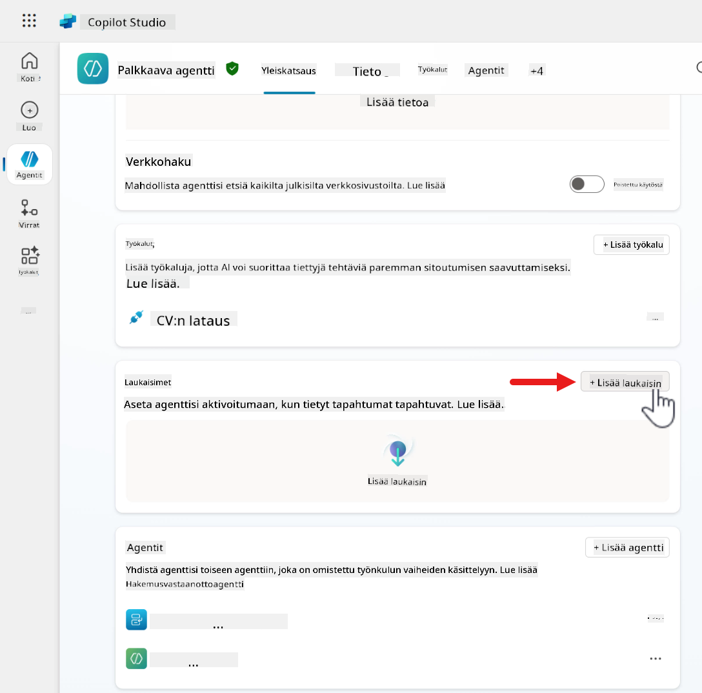

1. Lista triggereistä ilmestyy. Valitse **When a new email arrives (V3)** ja valitse **Next**.

       

1. Näet nyt **Trigger name** ja **Sign in** -yhteysviittaukset listatuista sovelluksista.

       Nimeä triggeri seuraavasti,
    
       ```text
       When a new email arrives from an applicant
       ```

       Varmista, että näet vihreän tarkistusmerkin jokaisen listatun sovelluksen yhteysviittauksen kohdalla. Jos et näe vihreää tarkistusmerkkiä, kirjaudu sisään ellipsin (...) kautta ja valitse **+ New connection reference** luodaksesi uuden yhteysviittauksen.

       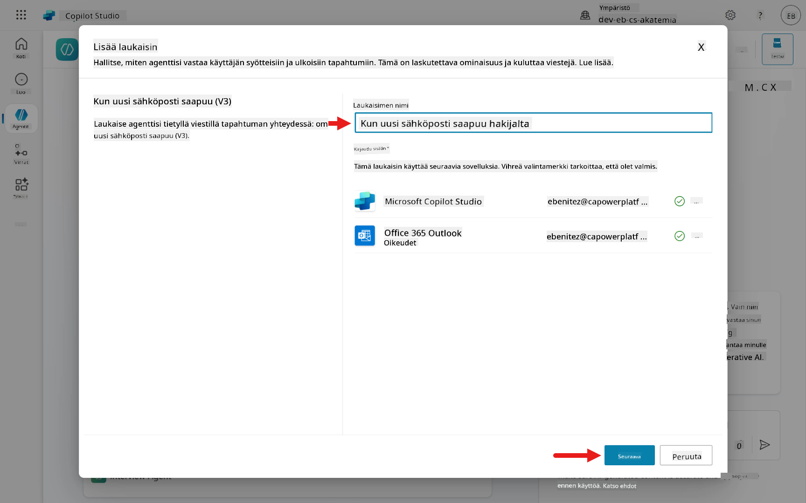

1. Viimeinen vaihe on asettaa triggerin syöttöominaisuudet. Päivitä seuraavat ominaisuudet seuraavasti,

     | Ominaisuus | Miten asetetaan | Tiedot |
     |------------|-----------------|--------|
     | **Include Attachments (Optional)** | Pudotusvalikko | Kyllä |
     | **Subject Filter (Optional)** | Kirjoita/näppäile näppäimistöllä | Application |
     | **Only with Attachments (Optional)** | Pudotusvalikko | K
Nyt päivitetään tapahtuman laukaisija lisäämään automaatiomahdollisuuksia. Valitse laukaisijan **kolmipistevalikko (...)** ja valitse **Muokkaa Power Automatessa**.

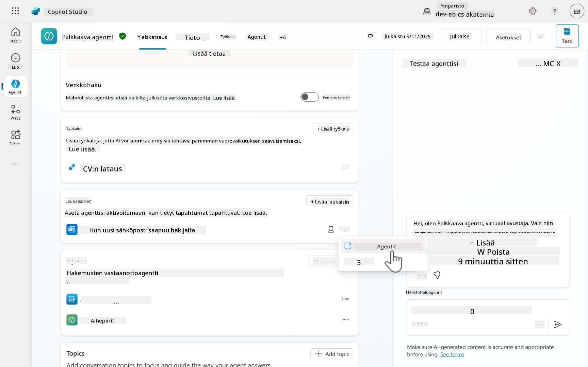

1. Laukaisija latautuu Power Automate -portaalin virtausmuokkaimeen. Näet virtausmuokkaimen Power Automate -portaalissa. Täällä voimme lisätä lisää logiikkaa ja toimintoja automaation tehostamiseksi. Laukaisija näkyy ylhäällä, ja viimeisenä toimintona on **Lähettää kehotteen määritetylle copilotille käsittelyä varten**.

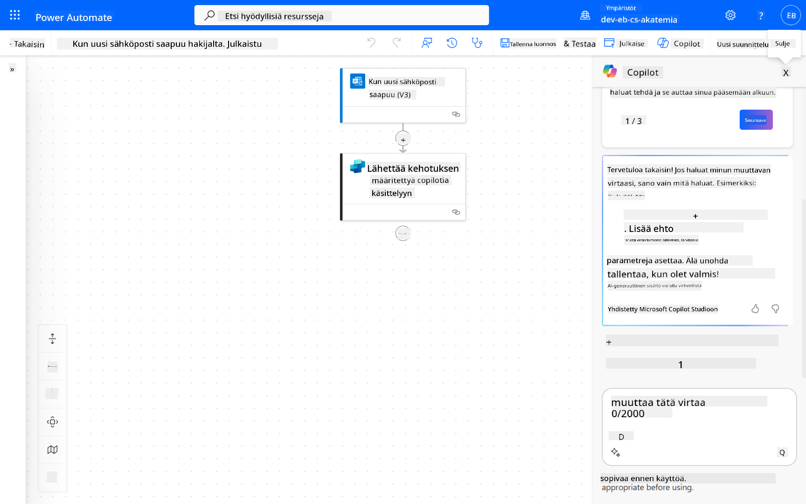

1. Oletuksena Power Automaten **Kun uusi sähköposti saapuu** -laukaisija voi käsitellä useita sähköposteja yhdessä, jos niitä saapuu useita kerralla, suorittaen virtauksen vain kerran erälle.

Jotta virtaus suoritetaan erikseen jokaiselle sähköpostille, ota käyttöön **Split On** -asetus laukaisijan asetuksissa ja valitse `@triggerOutputs()?['body/value']` pudotusvalikon kentästä.

Kun **Split On** on käytössä ja kenttä asetettu `@triggerOutputs()?['body/value']`, virtaus suoritetaan yksittäin jokaiselle viestille, vaikka niitä saapuisi useita samanaikaisesti.

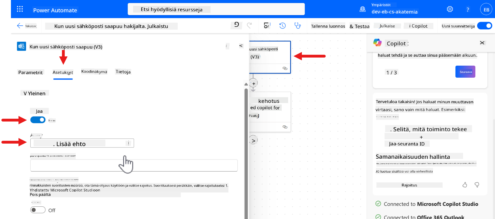

1. Lisätään seuraavaksi logiikkaa tarkistamaan liitteen tiedostotyyppi. Haluamme ladata vain .PDF-tiedostoliitteet, ei kuvia (nämä voivat olla sähköpostin allekirjoituksista). Valitse laukaisijan alapuolella **+**-kuvake ja valitse **Control** kohdasta **Sisäänrakennetut työkalut**.

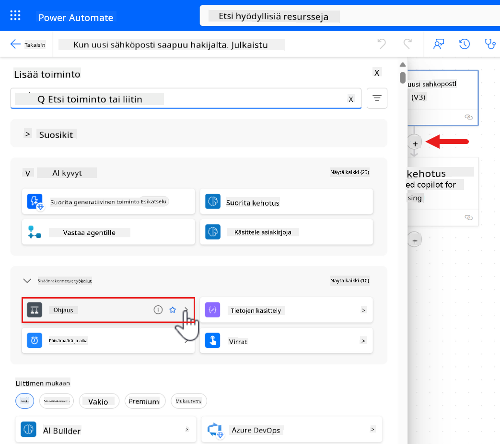

1. Valitse **Ehto**-toiminto.

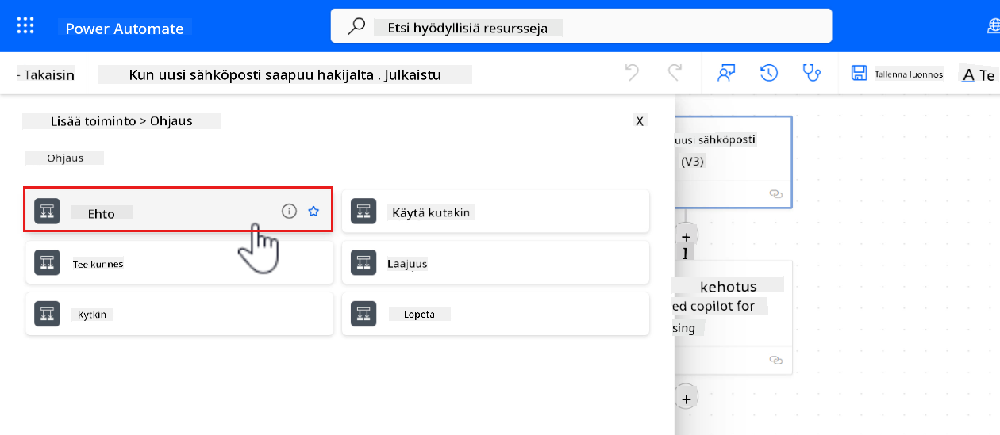

1. Konfiguroidaan ehto tarkistamaan, onko liitteen tiedostotyyppi .PDF. **Valitse arvo** -kentässä valitse oikealla oleva **salaman kuva** tai **fx-kuvake**.

1. **Haku**-kenttään kirjoita seuraava:

```text
content type
```

1. Valitse sitten laukaisijan **Attachments Content-Type** -parametri.

1. Valitse **Lisää** lisätäksesi dynaamisen sisällön syötteen toiminnon **Id**-parametriin.

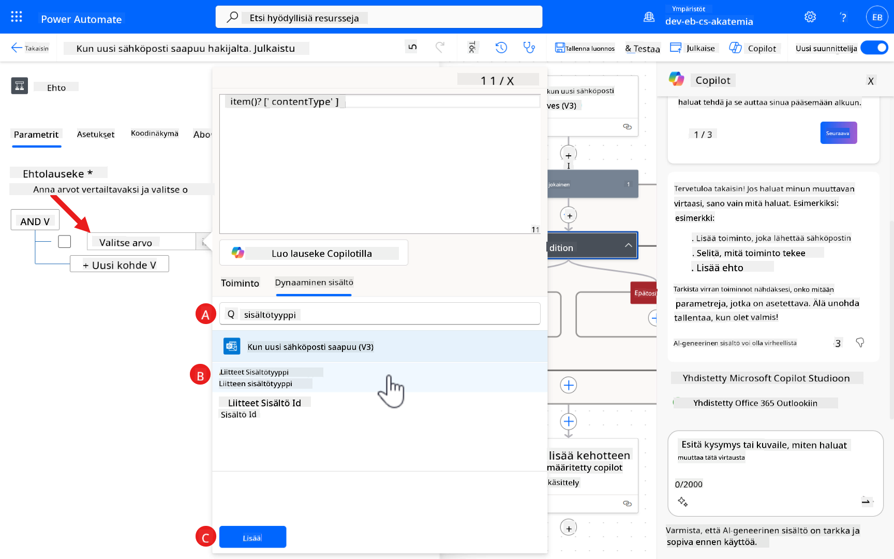

1. Pysähdytään hetkeksi, olet ehkä huomannut, että **For each**-toiminto ilmestyi automaattisesti.

Valitse **For each**-toiminto. Tämä toiminto edustaa silmukointia jokaisen sähköpostin liitteen läpi, koska laukaisijan **Attachments Content-Type** -parametri liittyy jokaiseen liitteeseen.

Taustalla se on taulukko, ja siksi **For each**-toiminto lisättiin automaattisesti, kun valitsimme **Attachments Content-Type** -parametrin **Ehto**-toiminnossa.

Lisätietoja tästä saat laajentamalla seuraavan oppimisosion.

??? info "Lisäoppiminen: For each -toiminto ilmestyy automaattisesti"

🤔 **Miksi "Apply to each" tai "For each" ilmestyy automaattisesti?**

Kun valitset parametrin (dynaaminen sisältö), joka edustaa listaa tai taulukkoa - esimerkiksi liitteiden, sähköpostien tai rivien lista - Power Automate tunnistaa, että haluat ehkä käsitellä jokaista kohdetta erikseen.

Power Automate lisää automaattisesti **"Apply to each"** (tai **For each**) -silmukan toiminnon ympärille. Tämä varmistaa, että toiminto suoritetaan kerran jokaista listan kohdetta varten, sen sijaan että yritettäisiin käsitellä koko lista kerralla (mikä voisi aiheuttaa virheitä).

🦋 **Esimerkki**

- Jos valitset "Attachments" edellisestä toiminnosta (joka on taulukko) ja yrität käyttää sitä toiminnossa, joka odottaa yksittäistä tiedostoa, Power Automate ympäröi toimintosi **"Apply to each"** (tai **For each**) -silmukalla.
- Näin toimintosi suoritetaan **jokaiselle liitteelle** - yksi kerrallaan.

💡 **Keskeiset kohdat**

- **Automaattinen:** Silmukka ilmestyy automaattisesti auttamaan sinua käsittelemään jokaista kohdetta kokoelmassa.
- **Estää virheet:** Ilman silmukkaa toimintosi saattaa epäonnistua, koska se ei voi käsitellä useita kohteita kerralla.
- **Visuaalinen vihje:** Se näyttää visuaalisesti, että virtauksesi toistaa toiminnon jokaiselle listan kohteelle.

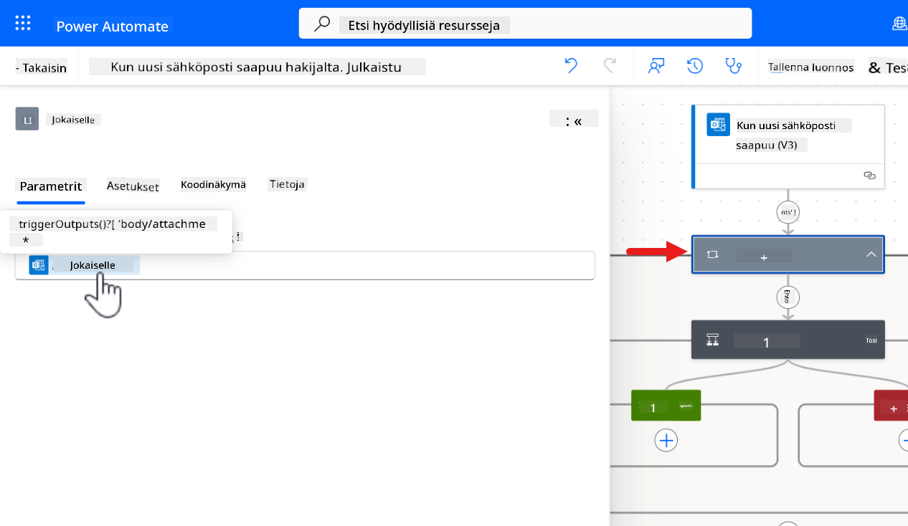

1. Seuraavaksi, toisessa **Valitse arvo** -kentässä, kirjoita seuraava:

```text
application/pdf
```

Tämä varmistaa, että jokaisen tiedostoliitteen kohdalla tarkistetaan, että tiedostomuoto on .PDF.

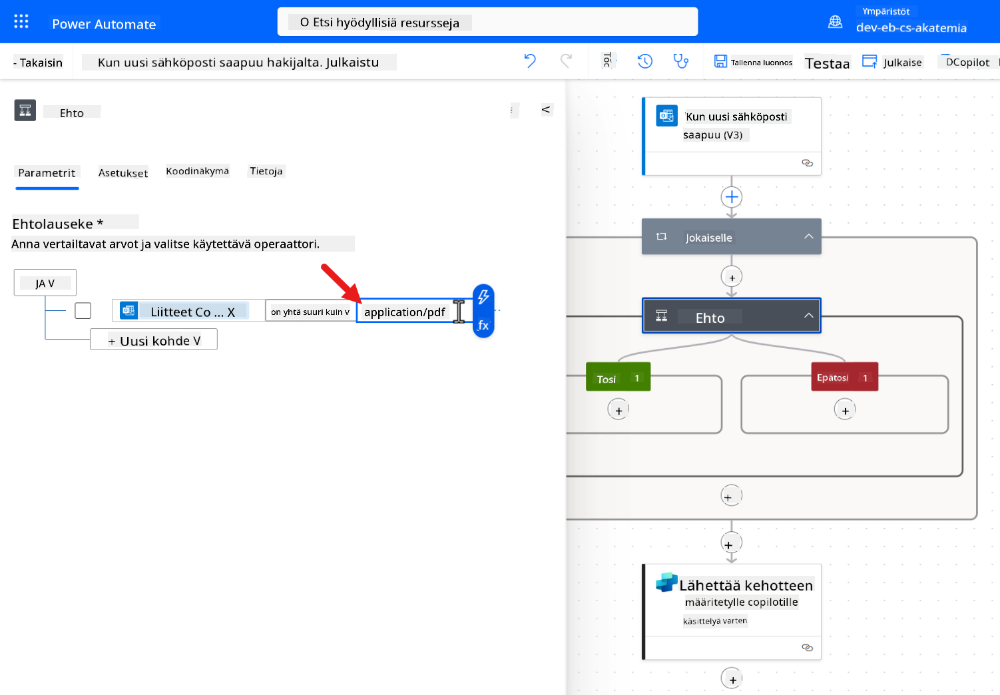

1. Konfiguroidaan **True**-polku, jotta tiedosto voidaan poimia sähköpostista ja ladata **Resume** Dataverse-taulukkoon.

Lisää uusi toiminto **True**-polun alle ja etsi `html to text`. Valitse **Html to text**-toiminto.

Lisätietoja **Html to text**-toiminnosta saat laajentamalla seuraavan oppimisosion.

??? info "Lisäoppiminen: Html to text -toiminto"

🤔 **Mikä on "HTML to text" -toiminto?**

**HTML to text**-toiminto Power Automatessa muuntaa HTML-muotoisen sisällön tavalliseksi tekstiksi. Tämä on erityisen hyödyllistä, kun vastaanotat dataa (kuten sähköposteja, verkkosisältöä tai API-vastauksia), jotka sisältävät HTML-tageja, ja haluat poimia vain luettavan tekstin ilman muotoiluja tai koodia.

⚙️ **Miten se toimii?**

- **Syöte:** Syötät HTML-sisältöä (esimerkiksi sähköpostin runko).
- **Tulos:** Toiminto poistaa kaikki HTML-tagit ja palauttaa vain tavallisen tekstin.

👍🏻 **Milloin sitä kannattaa käyttää?**

- Kun haluat poimia luettavaa tekstiä sähköposteista, verkkosivuilta tai API-vastauksista, jotka sisältävät HTML:ää.
- Ennen sisällön lähettämistä järjestelmiin, jotka eivät tue HTML-muotoilua (kuten tekstiviestit, Teams-viestit tai tietokannat).
- Datan puhdistamiseen ja sisällön valmisteluun jatkokäsittelyä tai analyysiä varten.

🔭 **Mistä sen löytää?**

- Power Automatessa Agent Flows -osiossa, etsi toiminto nimeltä `HTML to text`. Se löytyy **Data Operations**-liittimestä.

💡 **Keskeiset kohdat**

- Poistaa kaikki HTML-tagit ja jättää vain tekstin.
- Ei tulkitse tai suorita skriptejä/tyylejä - vain poistaa tagit.
- Hyödyllinen datan puhdistamiseen ja sisällön valmisteluun tavallisen tekstin ulostuloja varten.

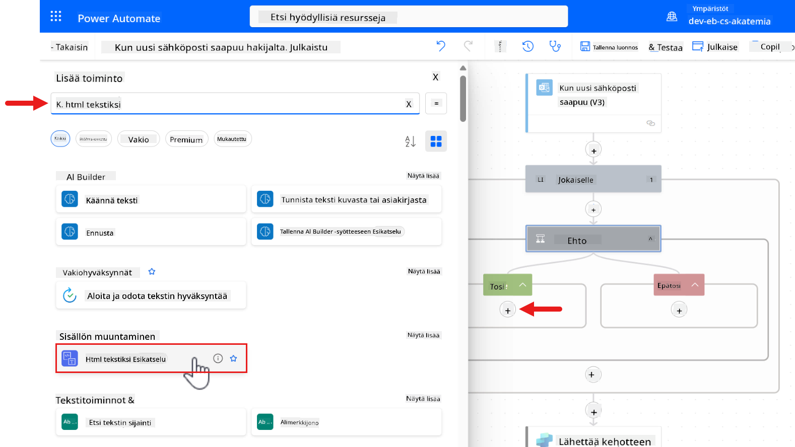

1. Seuraavaksi meidän täytyy luoda uusi yhteysviite **Html to text**-toiminnolle valitsemalla **Lisää uusi**.

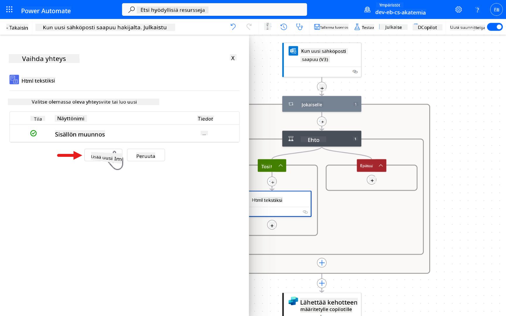

1. Toiminto voidaan nyt konfiguroida. Lisätään laukaisijan **Body**-parametri. **Sisältö**-kentässä valitse oikealla oleva **salaman kuva** tai **fx-kuvake**.

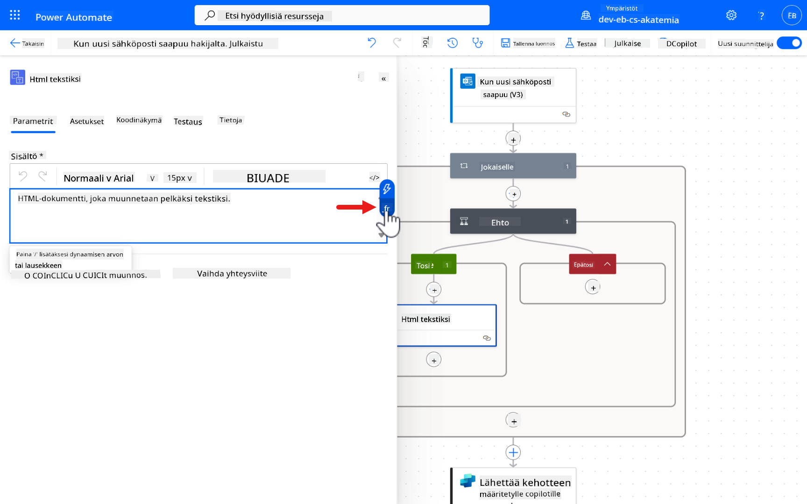

1. **Dynaaminen sisältö**-välilehdessä etsi `body` ja valitse laukaisijan **Body**-parametri, ja valitse sitten **Lisää**.

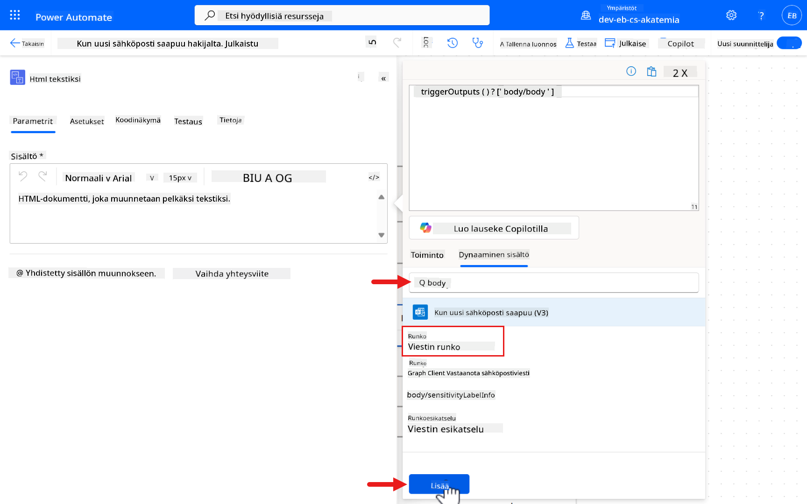

1. Olemme nyt valmiita konfiguroimaan tämän toiminnon, joten poistutaan toiminnosta valitsemalla vasemmalle osoittavat kaksoisnuolet («) paneelin pienentämiseksi.

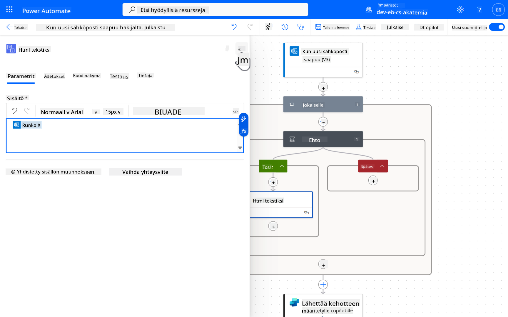

1. Lisätään uusi toiminto valitsemalla **+**-kuvake **Html to text**-toiminnon alapuolella, mikä avaa paneelin toimintojen lisäämistä varten. Valitse **Microsoft Dataverse**-liitin.


1. Valitse **Lisää uusi rivi**-toiminto.

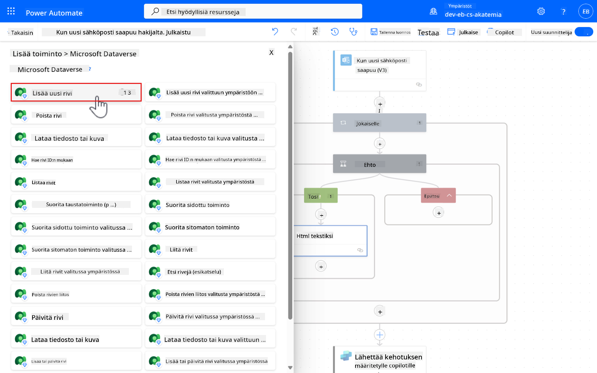

1. Nimeä toiminto valitsemalla **Kolmipistevalikko (...)**, kopioi ja liitä seuraava nimi:

```text
Lisää uusi Resume-rivi
```

**Taulukon nimi**-parametrissa etsi `res` ja valitse **Resumes**-taulukko.

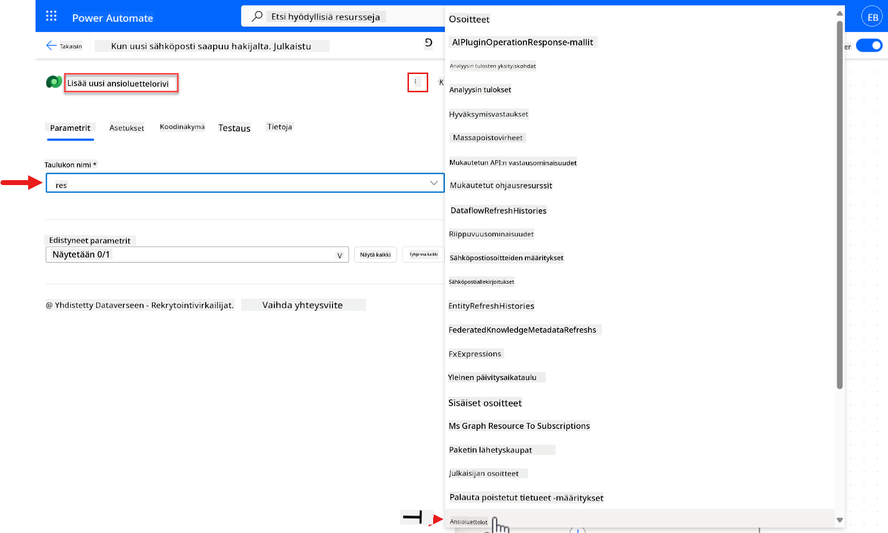

1. Valitse seuraavaksi **Resume Title**-kenttä ja valitse oikealla oleva **salaman kuva** tai **fx-kuvake**.

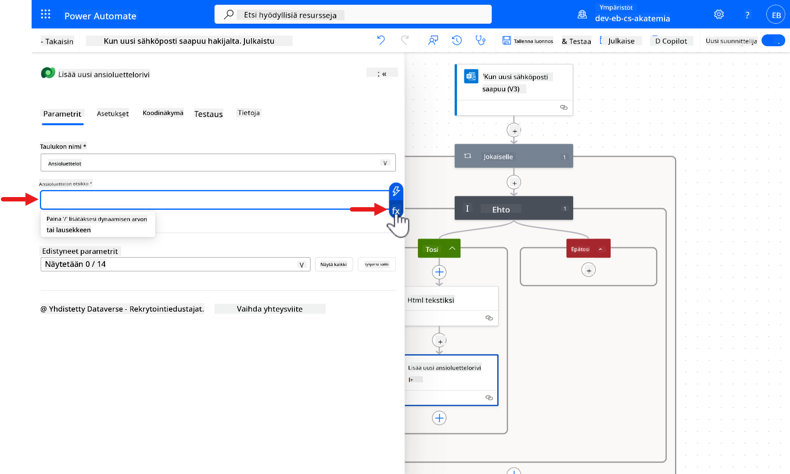

1. **Funktiot**-välilehdessä syötä seuraava lauseke, joka käyttää `item()`-funktiota:

```text
item()?['name']
```

Lisätietoja `item()`-funktiosta saat laajentamalla seuraavan oppimisosion.

??? info "Lisäoppiminen: `item()`-funktio"

🤔 **Mikä on `item()`-funktio?**

- Kun käytät **Apply to each**-toimintoa, Power Automate käy läpi jokaisen elementin kokoelmassa (taulukossa).
- Sitä käytetään yleisimmin toiminnon kuten **Apply to each** (tai **For each**), **Select** tai **Filter array** sisällä.

⚙️ **Miten se toimii?**

- `item()` on funktio, joka palauttaa silmukassa tai taulukko-operaatiossa käsiteltävän nykyisen kohteen.
- Silmukan sisällä `item()` viittaa _käsiteltävään elementtiin_.

📌 **Missä sitä käytetään?**

- **Apply to each:** pääsy nykyisen kohteen ominaisuuksiin.
- **Select:** taulukon jokaisen kohteen muuntamiseen.
- **Filter array:** viittaus nykyiseen arvioitavaan kohteeseen.

🦋 **Esimerkki**

- Lauseke silmukan sisällä:
       -  `item()?['Email']`
- Tämä hakee nykyisen kohteen `Email`-ominaisuuden.

💡 **Keskeiset kohdat**

- `item()` on _kontekstisidonnainen_: se viittaa aina silmukassa tai taulukko-operaatiossa käsiteltävään kohteeseen.
- Jos silmukoita on sisäkkäin, voit käyttää `items('LoopName')` viitataksesi tietyn silmukan kohteisiin.

Valitse **Lisää** lisätäksesi lausekkeen **Resume Title**-parametriin.

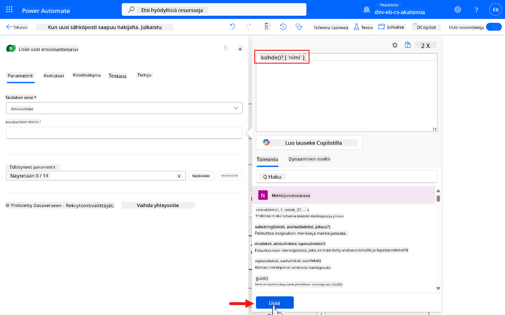

1. Meidän täytyy vielä konfiguroida useita parametreja. Valitse **Näytä kaikki** ja **Cover Letter**-kentässä valitse oikealla oleva **salaman kuva** tai **fx-kuvake**.

**Funktiot**-välilehdessä syötä seuraava lauseke, joka käyttää samaa lauseketta edellisessä [tehtävässä](../02-multi-agent/README.md).

```text
if(greater(length(body('Html_to_text')), 2000), substring(body('Html_to_text'), 0, 2000), body('Html_to_text'))
```

Tämä lauseke tarkistaa, onko **Html to text**-toiminnosta saatu _teksti_ pidempi kuin 2000 merkkiä, ja jos on, palauttaa vain ensimmäiset 2000 merkkiä; muuten se palauttaa koko tekstin.

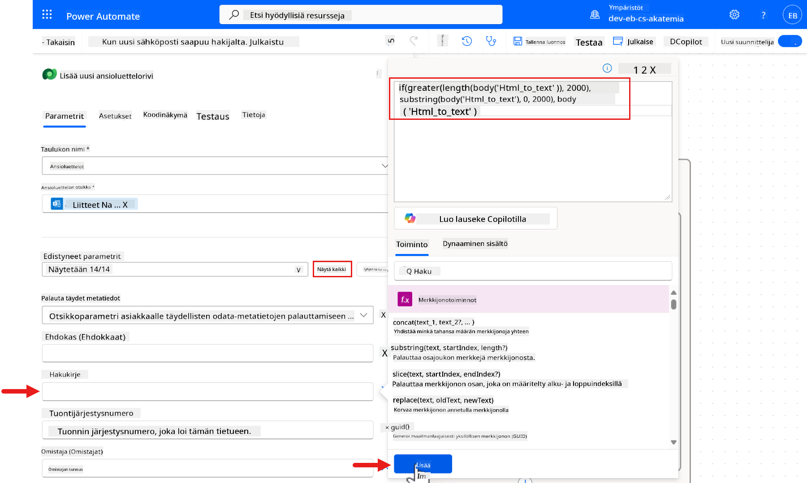

1. Lauseke lisätään nyt **Cover Letter**-kenttään.

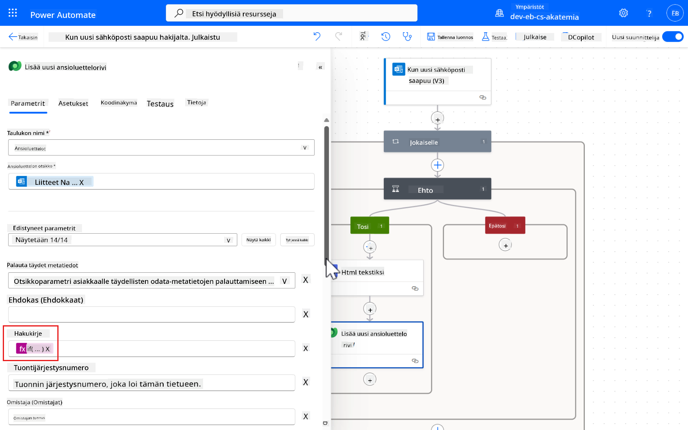

1. **Source Email Address**-kenttään etsi `from` ja valitse laukaisijan **From**-parametri, koska tämä sisältää sähköpostiosoitteen arvon.

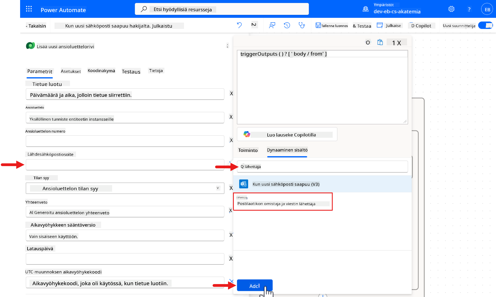

1. **Upload Date**-kentässä valitse oikealla oleva **salaman kuva** tai **fx-kuvake**. **Funktiot**-välilehdessä syötä seuraava lauseke, joka käyttää `utcNow()`-funktiota.

```text
utcNow()
```

Lisätietoja `utcNow`-funktiosta saat laajentamalla seuraavan oppimisosion.

??? info "Lisäoppiminen: `utcNow`-funktio"

🤔 **Mikä on `utcNow()`-funktio?**

- `utcNow()`-funktio Power Automatessa palauttaa nykyisen päivämäärän ja ajan koordinoidussa yleisajassa (UTC) ISO 8601 -muodossa, kuten: `2025-09-23T04:32:14Z`

🦋 **Esimerkki**

- Lauseke:
       -  `concat('Raportti luotu ', utcNow())`
- Tulos on:
       - Raportti luotu `2025-09-23T04:32:14Z`

💡 **Keskeiset kohdat**
- **Ei vaadi argumentteja (syöttöparametreja):** antaa aina nykyisen UTC-aikaleiman.
   - **Käyttötapaukset**
       - Aikaleimojen lisääminen lokitiedostoihin tai tiedostonimiin
       - Nykyisen ajan vertailu muihin päivämääriin
       - Ajastaminen tai aikaperusteiset ehdot

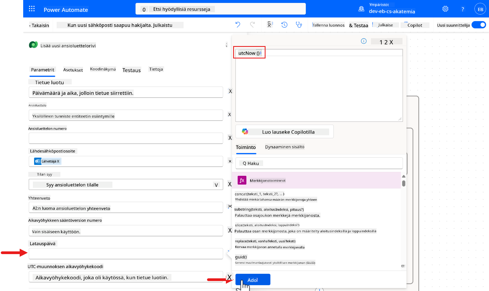

1. Olemme nyt saaneet valmiiksi **Lisää uusi ansioluettelorivi** -toiminnon määrittämisen, joten suljetaan paneeli pienentämällä se.

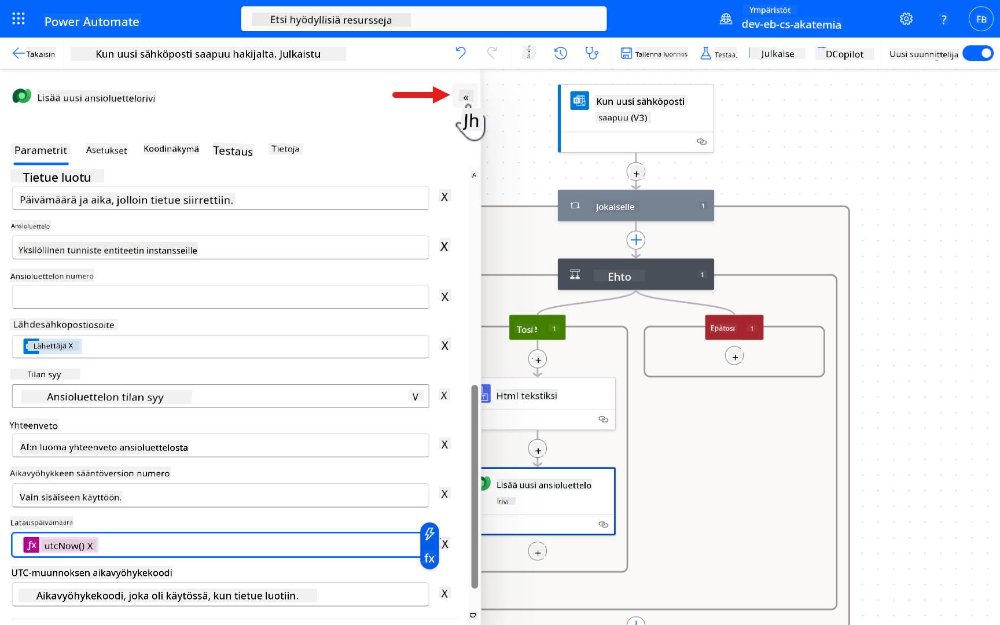

1. Lisätään uusi toiminto valitsemalla **+ -kuvake** **Lisää uusi ansioluettelorivi** -toiminnon alapuolelta, mikä avaa paneelin toimintojen lisäämistä varten. Valitse uudelleen **Microsoft Dataverse** -liitin.

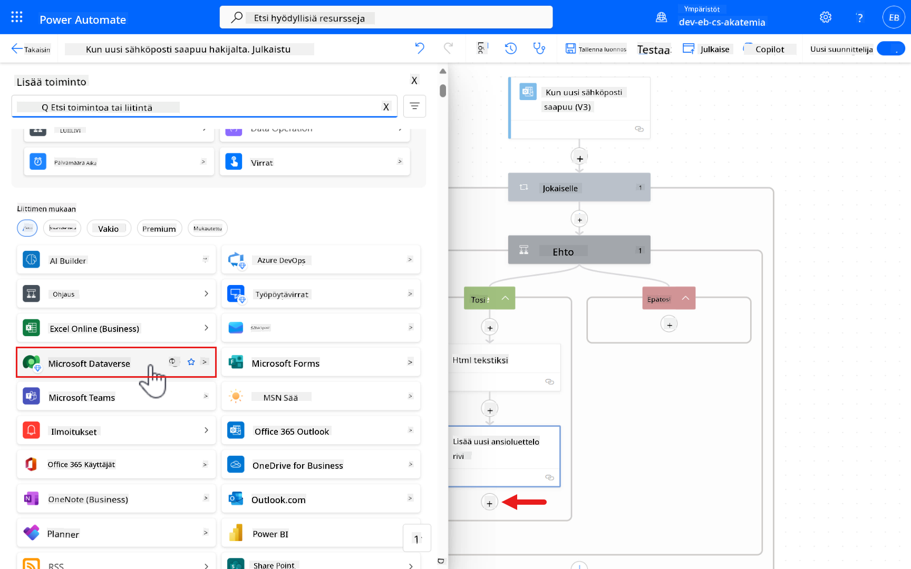

1. Valitse **Lataa tiedosto tai kuva** -toiminto.

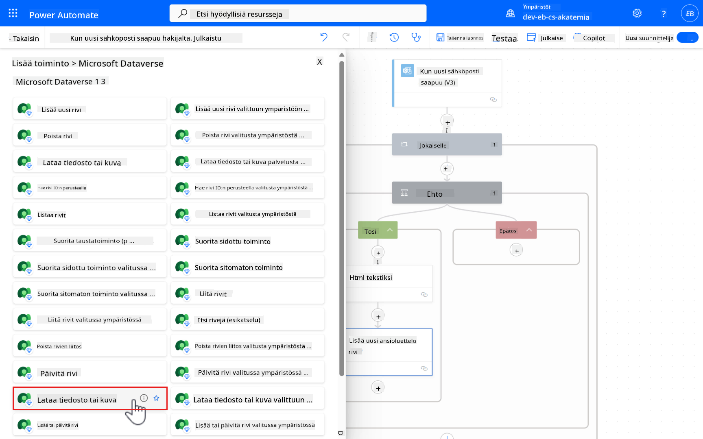

1. Nimeä toiminto uudelleen valitsemalla **Kolme pistettä (...)**, kopioi ja liitä seuraava nimi:

```text
Lataa ansioluettelo-tiedosto
```

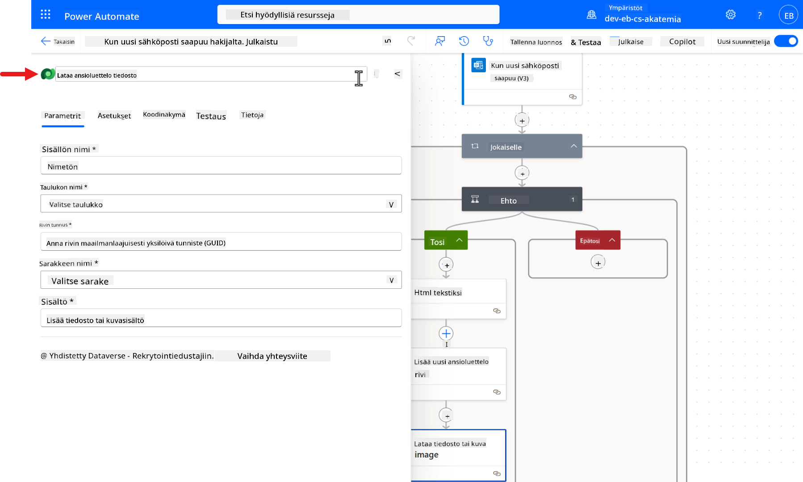

1. Valitse seuraavaksi **Sisällön nimi** -kenttä ja valitse oikealla puolella oleva **salaman kuvake** tai **fx-kuvake**.

   **Funktio-välilehdellä** syötä seuraava lauseke, joka käyttää `item ()` -funktiota. Tämä hakee nykyisen kohteen (liitetiedoston) `name`-ominaisuuden.

```text
item()?['name']
```

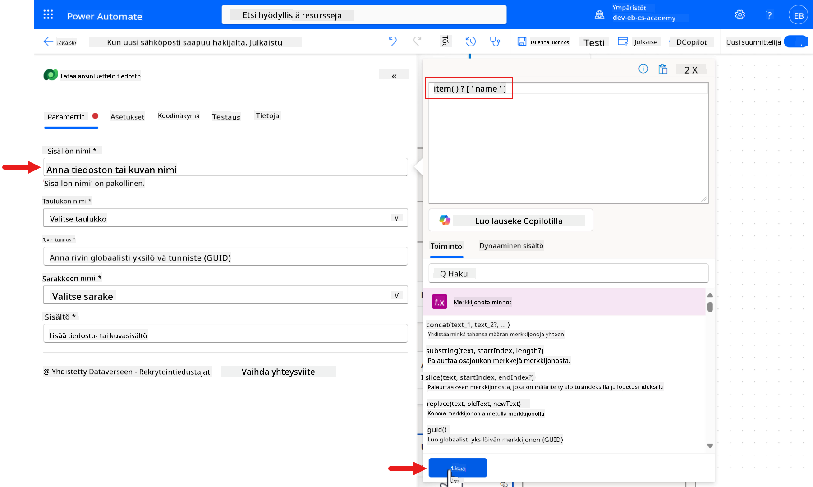

1. **Taulukon nimi** -parametrille etsi `res` ja valitse **Ansioluettelot**-taulukko.

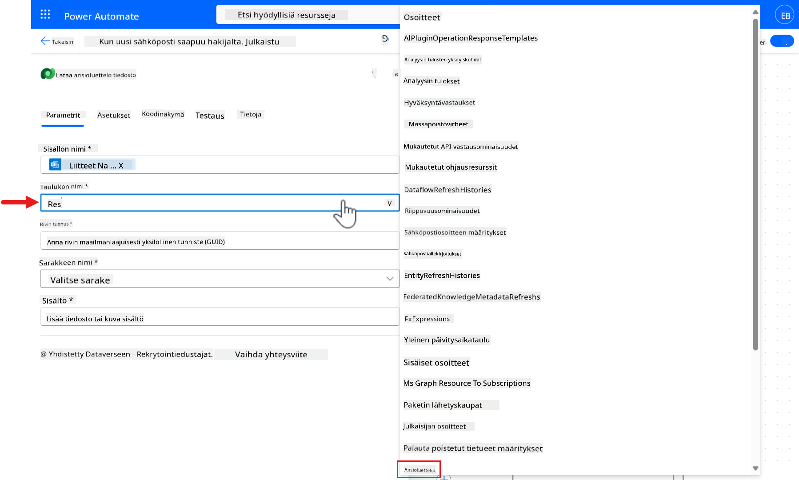

1. Valitse seuraavaksi **Rivin tunnus** -kenttä ja valitse oikealla puolella oleva **salaman kuvake** tai **fx-kuvake**.

   Etsi `ID` ja valitse **Ansioluettelo**-parametri _Lisää uusi rivi_ Dataverse-toiminnosta, koska tämä sisältää rivin tunnusarvon, johon PDF-tiedosto ladataan.

   Valitse **Lisää**.

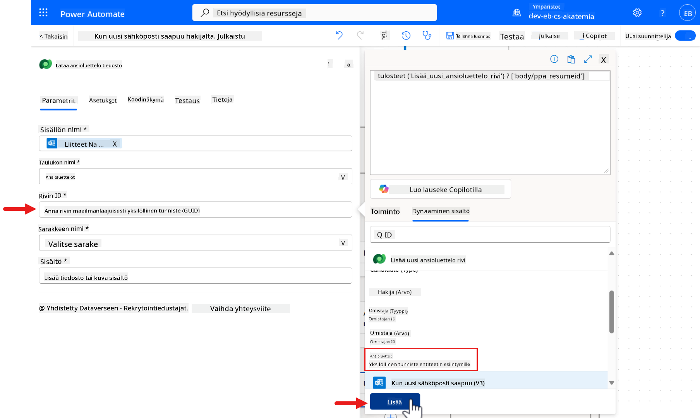

1. Valitse **Sarakkeen nimi** -kenttä ja valitse **Ansioluettelo PDF** -vaihtoehto.

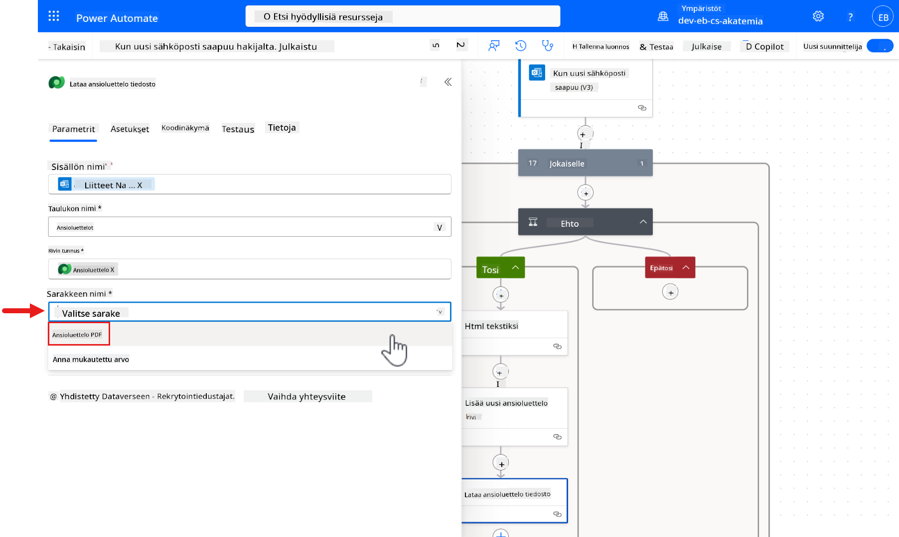

1. Valitse **Sisältö**-kenttä ja valitse oikealla puolella oleva **salaman kuvake** tai **fx-kuvake**.

   **Funktio-välilehdellä** syötä seuraava lauseke, joka käyttää `item ()` -funktiota. Tämä hakee nykyisen kohteen (liitetiedoston) `contentBytes`-ominaisuuden. `contentBytes` viittaa tiedoston tai liitteen raakaan binääridataan, joka on koodattu Base64-merkkijonoksi.

```text
item()?['contentBytes']
```

1. Olemme saaneet tämän toiminnon määrittämisen valmiiksi, joten suljetaan toiminto valitsemalla vasemmalle osoittavat kaksoisnuolet («) paneelin pienentämiseksi.

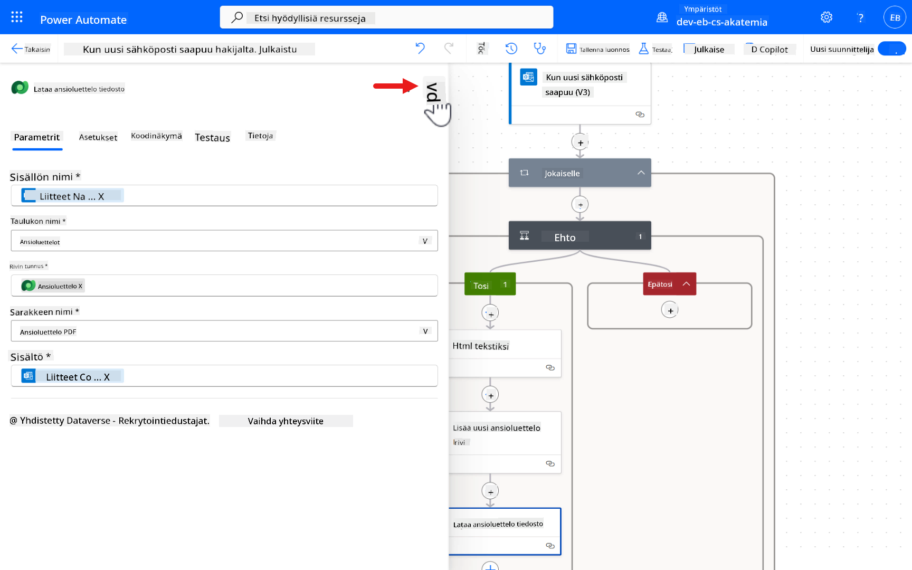

1. Valitse seuraavaksi **Lähettää kehotteen määritetylle copilotille käsittelyä varten**, ja vedä ja pudota tämä toiminto **Lataa ansioluettelo-tiedosto** -toiminnon alapuolelle ehdon _True_-polussa.

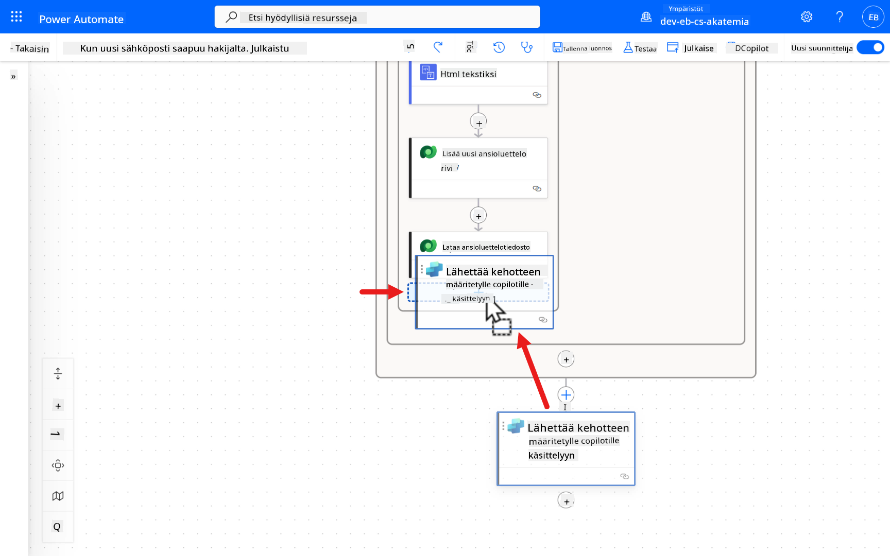

1. Valitse **Lähettää kehotteen määritetylle copilotille käsittelyä varten** -toiminto sen määrittämiseksi.

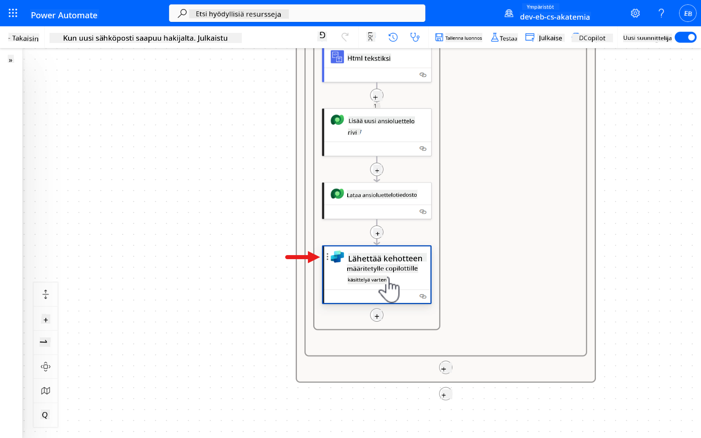

1. **Runko/viesti**-kentässä valitse kaikki kentän sisältö ja tyhjennä/poista se.

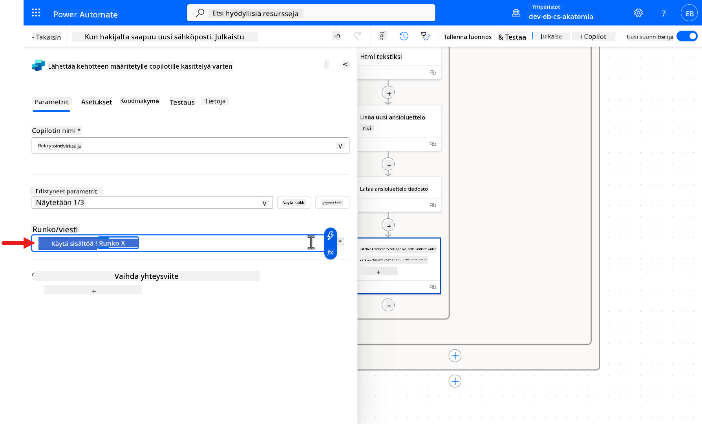

1. Kopioi ja liitä seuraava teksti **Runko/viesti**-kenttään ja korosta `RESUME ID PLACEHOLDER`.

```text
Lähetä [ResumeId (text)] = "RESUME ID PLACEHOLDER" ja [ResumeTitle (text_1)] = "RESUME TITLE PLACEHOLDER" ja [ResumeNumber (text_2)]= "RESUME NUMBER PLACEHOLDER" Työkaluun "Ilmoita Teamsin hakijakanavalle" lapsiagentissa "Hakemusten vastaanottoagentti"
```

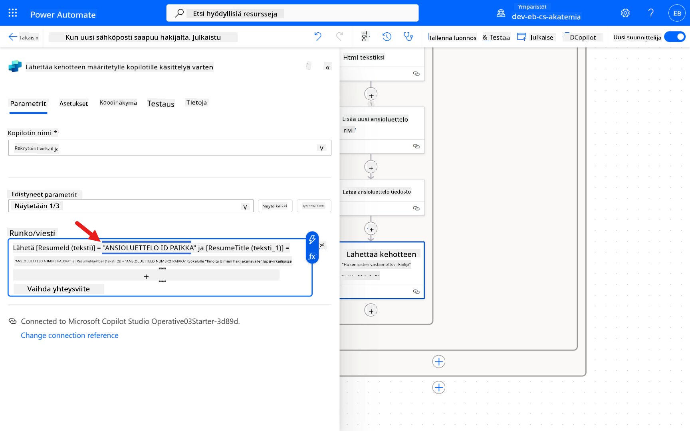

1. Valitse oikealla puolella oleva **salaman kuvake** tai **fx-kuvake**.

   Etsi `resume` ja valitse **Ansioluettelo**-parametri _Lisää uusi rivi Dataverse_-toiminnosta, koska tämä sisältää luodun ansioluettelorivin `ID`-arvon.

   Valitse **Lisää**.

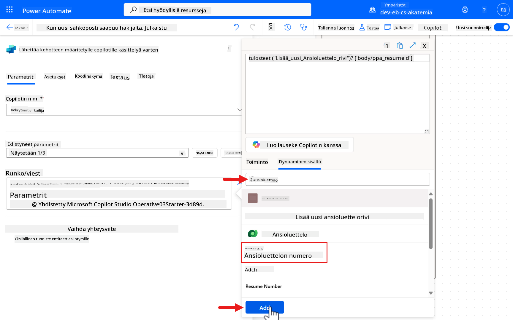

1. Korosta `RESUME TITLE PLACEHOLDER`. Valitse oikealla puolella oleva **salaman kuvake** tai **fx-kuvake**.

   Etsi `title` ja valitse **Ansioluettelon otsikko** -parametri _Lisää uusi rivi Dataverse_-toiminnosta, koska tämä sisältää luodun ansioluettelorivin `otsikko`-arvon.

   Valitse **Lisää**.

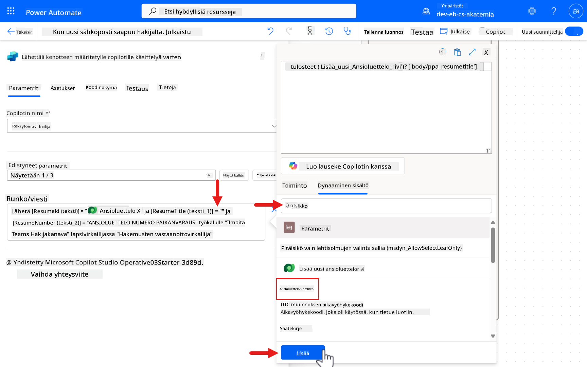

1. Korosta `RESUME NUMBER PLACEHOLDER`. Valitse oikealla puolella oleva **salaman kuvake** tai **fx-kuvake**.

   Etsi `resume number` ja valitse **Ansioluettelon numero** -parametri _Lisää uusi rivi Dataverse_-toiminnosta, koska tämä sisältää luodun ansioluettelorivin `numero`-arvon.

   Valitse **Lisää**.

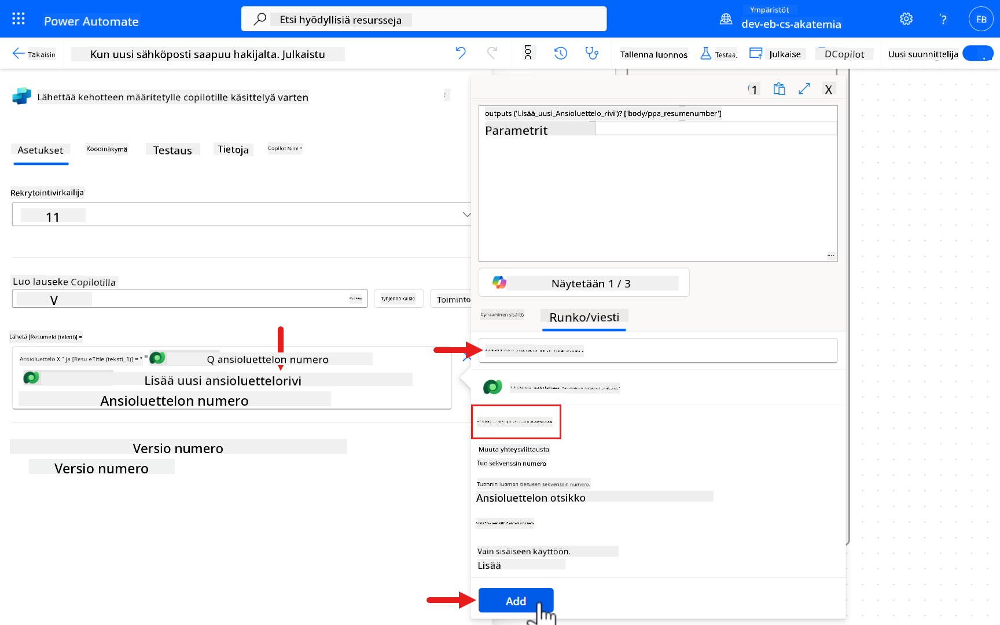

1. Olemme saaneet tämän toiminnon määrittämisen valmiiksi ja agenttivirtaus on valmis 🙌🏻 Hyvin tehty! Nyt tallennetaan tapahtumatrigger-virtaus valitsemalla **Tallenna luonnos**.

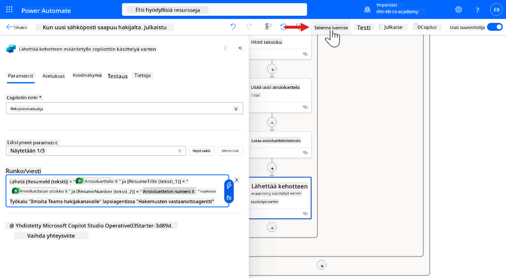

1. Nyt meidän täytyy muokata agenttivirtauksen yksityiskohtia, valitse **Takaisin**.


1. Valitse **Muokkaa** **Yksityiskohdat**-osiossa ja päivitä **Suunnitelma** **Copilot Studio** -vaihtoehtoon.

   Valitse **Tallenna**.

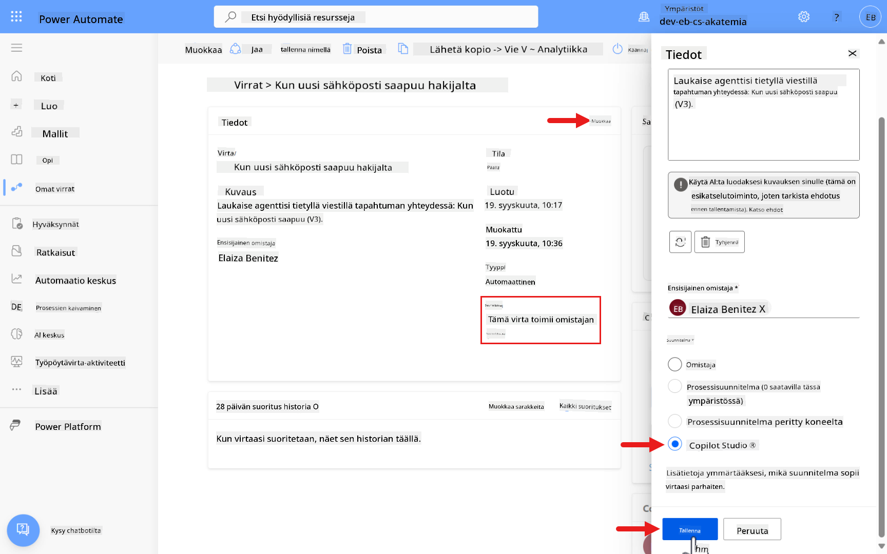

1. Näyttöön tulee modal, joka pyytää vahvistamaan siirtymisen Copilot Studio -suunnitelmaan. Valitse **Vahvista**.

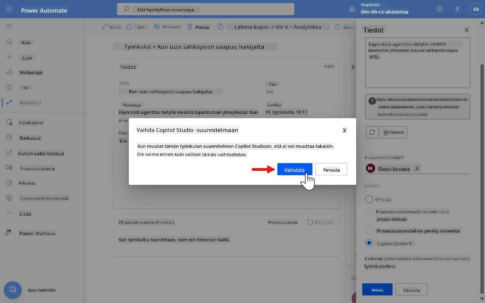

1. Suunnitelma on nyt päivitetty **Copilot Studio** -suunnitelmaan. Valitse **Muokkaa**, koska meidän täytyy julkaista tapahtumatrigger-virtaus agentillemme.

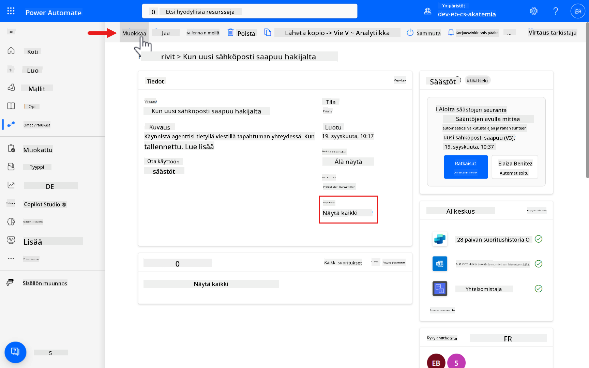

1. Valitse **Julkaise**.

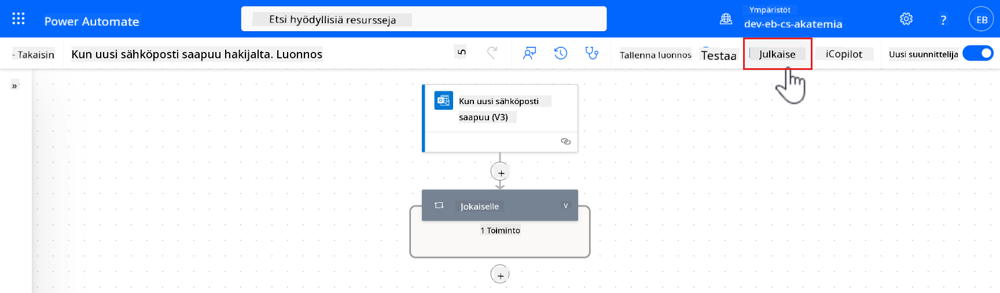

   Hurraa! Tapahtumatrigger-virtaus on nyt julkaistu 😃

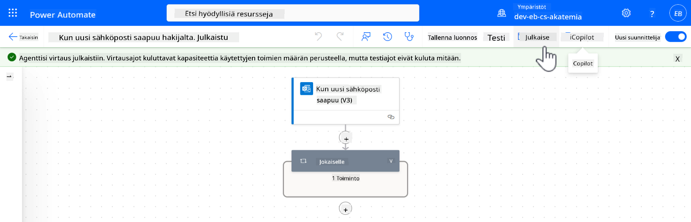

Jatketaan uuden agenttivirtauksen luomisella, jonka lapsiagentti **Hakemusten vastaanottoagentti** käynnistää.

### Lab 3.2 - Ilmoita Teams-kanavalle mukautetulla kortilla

Nyt luomme uuden agenttivirtauksen lapsiagentille **Hakemusten vastaanottoagentti**, joka käyttää tapahtumatriggerin välittämiä arvoja lähettääkseen mukautetun kortin Teams-kanavalle. Tämä mukautettu kortti ilmoittaa HR-rekrytointitiimille automaattisesti ladatusta PDF-tiedostosta, jotta he voivat tarkistaa sen.

Aloitetaan!

1. Valitse **Rekrytointiautomaatti**-agentissa **Agentit**-välilehti ja valitse **Hakemusten vastaanottoagentti**.


1. Vieritä alas kohtaan **Työkalut** ja valitse **+ Lisää**.

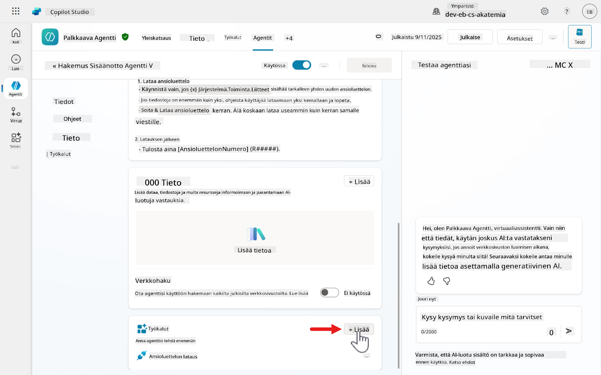

1. Näyttöön tulee **Lisää työkalu** -modal. Valitse **+ Uusi työkalu**.

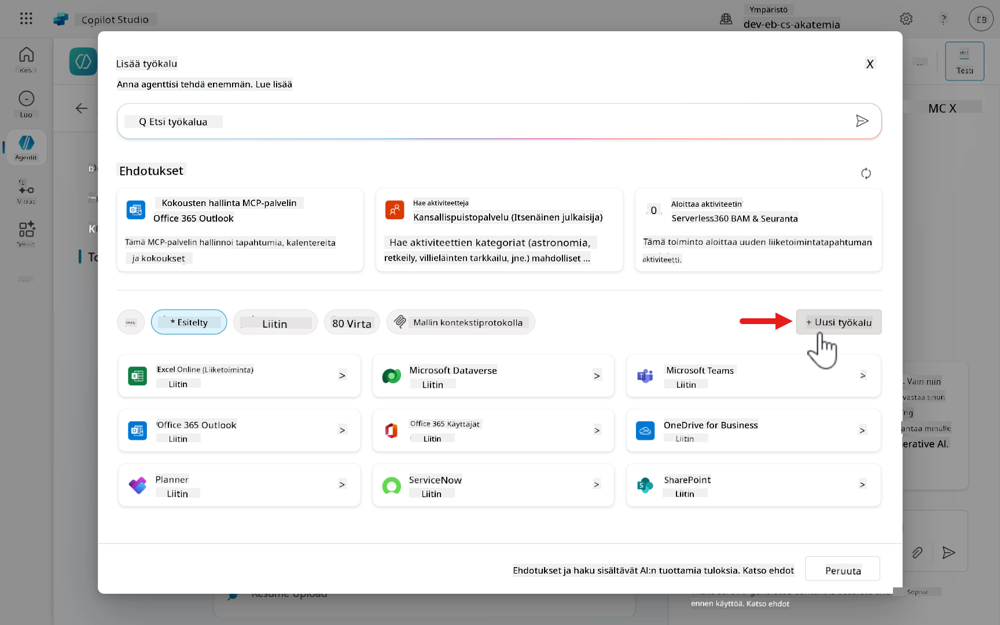

1. Valitse **Agenttivirtaus**.

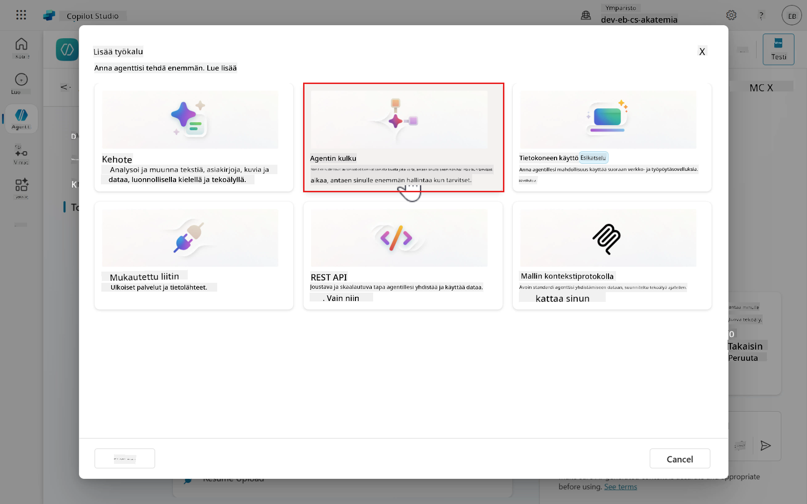

1. Seuraavaksi latautuu **agenttivirtauksen suunnittelija**. **Kun agentti kutsuu virtauksen** -triggerissä valitse **+ Lisää syöte**.

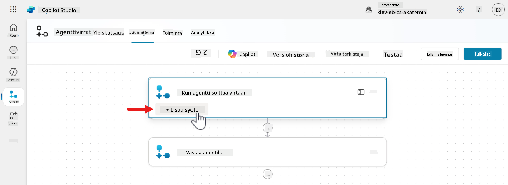

1. Valitse **Teksti** käyttäjän syötteen tyypiksi.

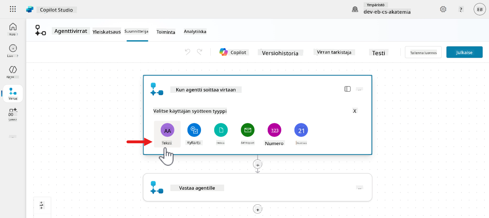

1. Syötteen tekstikenttään kopioi ja liitä seuraava syöttöparametrin nimi.

```text
ResumeId
```


1. Toista samat vaiheet lisätäksesi toisen tekstisyötteen. Kopioi ja liitä seuraava syöttöparametrin nimi.

```text
ResumeTitle
```


1. Toista samat vaiheet lisätäksesi kolmannen tekstisyötteen. Kopioi ja liitä seuraava syöttöparametrin nimi.

```text
ResumeNumber
```


1. Muistatko, kuinka [Rekrytointi](../../recruit/08-add-adaptive-card/README.md#81-create-a-new-topic-with-an-adaptive-card-for-user-to-submit-their-request) -osiossa lisäsimme mukautetun kortin agentin aiheeseen? Tällä kertaa aiomme lisätä mukautetun kortin agenttivirtaukseen. Nyt lisäämme toisen toiminnon agenttivirtaukseen, joka lähettää mukautetun kortin Teams-kanavalle.

   Valitse triggerin alapuolelta **+ -kuvake**.


1. Valitse **Lähetä kortti keskusteluun tai kanavalle** -toiminto.


1. Microsoft Teams -yhteysviite täytyy luoda kirjautuneella käyttäjätililläsi. Valitse **Kirjaudu sisään**.


1. Valitse käyttäjätilisi ja valitse **Salli pääsy**.


1. Seuraaville syöttöparametreille:

   | Parametri | Miten asetetaan | Tiedot |
   |----------|------------|---------|
   | **Lähetä nimellä** | Pudotusvalikko | Valitse `Flow bot` -vaihtoehto |
   | **Lähetä** | Pudotusvalikko | Valitse `Kanava` -vaihtoehto |
   | **Tiimi** | Pudotusvalikko | Valitse tiimi, joka on käytettävissä ympäristössäsi tämän harjoituksen suorittamista varten |
   | **Kanava** | Pudotusvalikko | Valitse kanava, joka on käytettävissä ympäristössäsi tämän harjoituksen suorittamista varten |


1. Seuraavaksi määritämme **Mukautettu kortti** -kentän. Valitse **Mukautettu kortti** -kenttä.


1. Avaa [Ansioluettelotaulukko päivitetty JSON-tiedosto](../../../../../docs/operative-preview/03-automate-triggers/assets/3.2_ResumeTableUpdated.json), kopioi sen koko sisältö ja liitä se Mukautettu kortti -kenttään.


1. Kuten teimme [Rekrytointi](../../recruit/08-add-adaptive-card/README.md#81-create-a-new-topic-with-an-adaptive-card-for-user-to-submit-their-request) -osiossa, korvaamme olemassa olevat arvot JSON-payloadissa todellisilla arvoilla tai dynaamisella sisällöllä.

   Ensiksi päivitetään URL `url`-ominaisuudelle `selectAction`-ominaisuuden sisällä. Tämä URL korvataan **Hiring Hub** -mallipohjaisen sovelluksen Ansioluettelot-järjestelmänäkymän URL-osoitteella. Tämä mahdollistaa rekrytoijan valita toiminnon ja siirtyä Ansioluettelot-järjestelmänäkymään mallipohjaisessa sovelluksessa.

   Korosta nykyinen URL-arvo ja poista se.


1. **Hiring Hub** -mallipohjaisessa sovelluksessa siirry **Ansioluettelot**-järjestelmänäkymään vasemmanpuoleisen valikon avulla ja kopioi URL-osoite. Siirry sitten takaisin agenttivirtaukseen ja liitä kopioitu URL `url`-ominaisuuteen `selectAction`-ominaisuuden sisällä.


1. Näet seuraavan, jossa keltaisella korostettuna ovat ympäristötiedot **Hiring Hub** -mallipohjaisesta sovelluksesta.

     | Parametri | Arvo | Selitys |
     |----------|------------|---------|
     | **Organisaation URI** | GUID | Dataverse/Dynamics 365 -ympäristön organisaation URL |
     | **appid** | GUID | Tietyn mallipohjaisen sovelluksen avaamiseen käytetään joko appid- tai appname-kyselyparametria. Tässä tapauksessa käytetään appid-parametria |
     | **viewid** | GUID | Kyselyparametri, joka on näkymän tunnus |

       

1. Seuraavaksi lisätään dynaamisia sisältöarvoja useille ominaisuuksille. Aloitetaan tekstistä, joka näyttää tapahtumatriggerin luoman rivin ansioviitteen.

      Valitse **paneeli**-ikoni ladataksesi toimintopaneelin.

       

1. Vieritä alas riville, jossa näet `text`-ominaisuuden kohdassa `RESUME NUMBER PLACEHOLDER`. Korosta paikkamerkin arvo ja poista se.

       

1. Klikkaa lainausmerkkien väliin ja valitse oikealla oleva **salaman kuva** tai **fx-ikoni**.

      Valitse **Dynaaminen sisältö** -välilehdeltä **ResumeNumber**-parametri ja valitse **Lisää**.

       

1. **ResumeNumber**-parametri lisätään nyt dynaamiseksi sisällöksi `text`-ominaisuuteen.

       

1. Toistetaan samat vaiheet `RESUME NAME PLACEHOLDER`-kohdalle. Vieritä alas riville, jossa näet `text`-ominaisuuden kohdassa `RESUME NAME PLACEHOLDER`. Korosta paikkamerkin arvo ja poista se.

       

1. Klikkaa lainausmerkkien väliin ja valitse oikealla oleva **salaman kuva** tai **fx-ikoni**.

      Valitse **Dynaaminen sisältö** -välilehdeltä **ResumeTitle**-parametri ja valitse **Lisää**.

       

1. **ResumeTitle**-parametri lisätään nyt dynaamiseksi sisällöksi `text`-ominaisuuteen.

       

1. Toistetaan samat vaiheet **Due Date**-arvolle, joka edustaa päivämäärää, jolloin rekrytoijan tulisi tarkistaa ansioluettelo. Vieritä alas riville, jossa näet `text`-ominaisuuden kohdassa `May 21, 2023`.

       

1. Poista tämä päivämääräpaikkamerkin arvo ja klikkaa lainausmerkkien väliin.

       

1. Valitse oikealla oleva **salaman kuva** tai **fx-ikoni** ja kirjoita **Toiminto**-välilehdelle seuraava lauseke ja valitse **Lisää**.

       ```text
       addDays(utcNow(), 3, 'MMM dd, yyyy')
       ```

      Tämä lauseke käyttää kahta toimintoa.

     | Toiminto | Selitys |
     |----------|------------|
     | **addDays** | Lisää tietyn määrän päiviä annettuun päivämäärään ja palauttaa tuloksena olevan päivämäärän merkkijonona |
     | **utcNow** | Palauttaa nykyisen päivämäärän ja ajan koordinoidussa yleisaikamuodossa (UTC) merkkijonona. |

      utcNow-arvoa varten muotoilemme päivämäärän kuukaudeksi ja päiväksi, jota seuraa vuosi.

       

      Lauseke lisätään nyt `text`-ominaisuuteen.

       

1. Lopuksi päivitetään URL `url`-ominaisuudelle JSON-paketin `actions`-taulukko-ominaisuuden alaosassa. Nykyinen paikkamerkki-URL korvataan ansioluettelorivin URL:lla **Hiring Hub** -mallipohjaisessa sovelluksessa. Tämä mahdollistaa rekrytoijan valita mukautetun kortin `Action.OpenURL`-toiminnon ja siirtyä ansioluetteloon mallipohjaisessa sovelluksessa.

       

1. **Hiring Hub** -mallipohjaisessa sovelluksessa avaa rivi **Resumes**-järjestelmänäkymässä vasemmanpuoleisen valikon avulla. Ansioluettelorivi latautuu lomakkeena mallipohjaisessa sovelluksessa.

      Kopioi ansioluettelorivin URL.

    ??? info "Kuinka navigoida takaisin **Hiring Hub** -mallipohjaiseen sovellukseen, jos olet poistunut/sulkenut sen"

        1. Siirry osoitteeseen [https://make.powerapps.com](https://make.powerapps.com) ja varmista, että olet kehittäjäympäristössä, jota käytät näissä harjoituksissa, tai vaihda siihen.
        
        

        1. Valitse **Sovellukset** vasemmanpuoleisessa valikkopaneelissa ja valitse **Hiring Hub** -mallipohjaiselle sovellukselle **Pelaa**-ikoni ladataksesi sen selaimeesi.
        
        

       

1. Siirry takaisin agenttivirtaan, korosta nykyinen paikkamerkki-URL-arvo ja poista se.

       

1. Liitä kopioitu URL **url**-ominaisuuteen `url`-ominaisuuden sisällä.

       

1. Näet seuraavan. Poista `GUID`-tunnusarvo lopusta. Korvataan tämä dynaamisella sisällöllä - **ResumeId**-parametrilla.

       

1. Valitse oikealla oleva **salaman kuva** tai **fx-ikoni**.

      Valitse **Dynaaminen sisältö** -välilehdeltä **ResumeId**-parametri ja valitse **Lisää**.

       

1. **ResumeId** lisätään dynaamiseksi sisällöksi. Seuraava keltaisella korostettu on ympäristötietosi **Hiring Hub** -mallipohjaisesta sovelluksesta.

     | Parametri | Arvo | Selitys |
     |----------|------------|---------|
     | **Organisaation URI** | GUID | Dataverse/Dynamics 365 -ympäristön organisaation URL |
     | **appid** | GUID | Tietyn mallipohjaisen sovelluksen avaamiseen käytetään joko appid- tai appname-kyselyparametria. Tässä tapauksessa käytetään appid-parametria |
     | **id** | GUID | Kyselyparametri, joka on ansioluettelorivin tunnus |

       

1. Olemme nyt valmiita konfiguroimaan **Post card in a chat or channel** -toiminnon 👏🏻 Poistu toimintokonfiguraatiopaneelista valitsemalla **x**-ikoni.

       

1. Lopuksi konfiguroidaan viimeinen toiminto, **Vastaa agentille**, lähettämällä teksti takaisin agentille prosessin päättämiseksi.

      **Vastaa agentille** -toiminnossa valitse **+Lisää lähtö**.

       

1. Valitse **Teksti** lähtötyypiksi.

       

1. Syötä seuraava lähtönimeksi.

       

1. Syötä seuraava lähtöarvoksi.

       ```text
       Valmis
       ```

       

1. Olemme nyt valmiita konfiguroimaan agenttivirran. Valitse **Tallenna luonnos** tallentaaksesi agenttivirran. Vahvistusviesti ilmestyy tallennuksen jälkeen.

       

1. Ennen agenttivirran julkaisemista meidän täytyy päivittää agenttivirran tiedot. Valitse **Yleiskatsaus**-välilehti ja valitse **Muokkaa**.

      Syötä virran nimeksi seuraava.

       ```text
       Ilmoita Teamsin hakijakanavalle
       ```      

      Valitse sen jälkeen **Päivitä**-ikoni päivittääksesi agenttivirran kuvauksen AI:n avulla.

      Valitse sitten **Tallenna** tallentaaksesi päivitetyt tiedot agenttivirrasta.

       

1. Siirry takaisin **Suunnittelija**-välilehdelle ja valitse **Julkaise** julkaistaksesi agenttivirran. Vahvistusviesti ilmestyy tallennuksen jälkeen.

       

1. Agenttivirta täytyy nyt lisätä työkaluksi **Application Intake Agent** -agenttiin. Siirry takaisin **Hiring Agent** -agenttiin ja valitse **Agentit**-välilehti, sitten valitse **Application Intake Agent**.

       

1. Agentin **Tiedot**-osiossa päivitetään **Kuvaus**-kenttä. Kopioi seuraava ja liitä kuvauksen tekstin loppuun.

       ```text
       ja ilmoita myös Teamsin hakijakanavalle
       ```

       

1. Seuraavaksi lisätään agenttivirta työkaluksi. Vieritä alas ja valitse **+ Lisää**.

       

1. Valitse aiemmin luotu agenttivirta, **Ilmoita Teamsin hakijakanavalle**.

       

1. Valitse seuraavaksi **Lisää ja konfiguroi**.

       

1. Agenttivirran **Syötteet**-osiossa näkyvät kolme aiemmin agenttivirrassa konfiguroitua syötettä. Oletuksena **Täytä käyttäen**-konfiguraatio on asetettu **Täytä dynaamisesti AI:lla**. Pidetään tämä asetus ennallaan, sillä tapahtumatriggerin kehotus (viimeisessä toiminnossa, **Lähetä kehotus määritetylle copilotille käsittelyä varten** - tämä on vaiheet 38-44 **Lab 3.1 - Automatisoi sähköpostitse vastaanotettujen ansioluetteloiden lataaminen Dataverseen**) sisältää parametriarvot, jotka AI poimii.

       

1. Nyt kun työkalu on lisätty **Application Intake Agent** -agenttiin, agentin ohjeet täytyy päivittää. Valitse **takaisin nuoli**-ikoni palataksesi agenttilistaan.

       

1. Valitse **Application Intake Agent** **Agentit**-välilehdeltä **Hiring Agent** -agentissa.

       

1. **Ohjeet**-kentässä lisää uusi rivi `2.Post-Upload`-ohjeiden jälkeen. Kopioi ja liitä seuraavat ohjeet.

       ```text
       Prosessi ansioluettelon lataamiseksi sähköpostitse
       1. Kun saat viestin, **Lähetä [ResumeId (teksti)] = "1680265f-5793-f011-b41b-7c1e525be9f7" ja [ResumeTitle (teksti_1)] = "TAYLOR TESTPERSON (FICTITIOUS).pdf" ja [ResumeNumber (teksti_2)]= "R01026" työkalulle "Ilmoita Teamsin hakijakanavalle" lapsiagentissa "Application Intake Agent", kutsu [AGENT FLOW PLACEHOLDER]
       ```

       

1. Korosta `[AGENT FLOW PLACEHOLDER`-teksti.

       

1. Syötä eteenpäin vinoviiva `/` ja valitse **Ilmoita Teamsin hakijakanavalle**-työkalu.

       
1. Agenttivirta käynnistetään nyt **Application Intake Agent** -agentin toimesta ohjeiden mukaisesti, kun tapahtumakäynnistimen viimeinen toiminto (**Lähettää kehotteen määritetylle copilotille käsittelyä varten**) lähettää kehotteen, joka sisältää parametrien arvot takaisin agentille.

      Valitse **Tallenna** tallentaaksesi päivitetyt ohjeet **Application Intake Agent** -agentille.

       

1. Ohjeet päivitetään, kun agentti on tallennettu.

       

1. Nyt meidän täytyy **Julkaista** **Hiring Agent**. Valitse **Julkaise** oikeasta yläkulmasta ja valitse _Julkaise tämä agentti_ -modaalissa **Julkaise**.

       

1. Julkaisun jälkeen ilmestyy vahvistusviesti, joka ilmoittaa, että agentti on julkaistu.

       

Nyt voimme testata agenttia!

### Lab 3.3 - Testaa tapahtumakäynnistin

1. Tapahtumakäynnistimen suorittamiseksi täytyy lähettää sähköposti, jossa on liitteenä ansioluettelo PDF-tiedostona. Luo uusi sähköpostiviesti Outlookissa.

     | Sähköpostikomponentti | Tiedot |
     |-----------------------|--------|
     | **Vastaanottaja** | Käytä kirjautunutta käyttäjätiliäsi arvona |
     | **Tiedostoliite** | Lataa [TAYLOR TESTPERSON (FICTITIOUS)](../../../../../docs/operative-preview/test-data/resumes/TAYLOR%20TESTPERSON%20(FICTITIOUS).pdf) -tiedosto |
     | **Viestin sisältö** | Kopioi ja liitä alla oleva teksti sähköpostin sisältöön |

       ```text
       Hyvä rekrytointipäällikkö,

       Kirjoitan ilmaistakseni kiinnostukseni Senior Power Platform Engineer -tehtävään organisaatiossanne. Yli yhdeksän vuoden kokemuksella turvallisten ja skaalautuvien ratkaisujen toimittamisesta Microsoftin pilvialustoilla olen varma, että voin tehokkaasti tukea tiimiänne.

       Viimeisimmässä roolissani Lead Power Platform Engineerinä kehitin automatisoidun ansioluetteloiden vastaanottoputken, joka vähensi manuaalista lajittelua ja paransi hakukelpoisuutta. Olen toimittanut HR-tapausten hallintasovelluksia, ottanut käyttöön ratkaisukeskeisiä työnkulkuja ja toteuttanut PR-tarkistuksia parantaakseni käyttöönottoaikoja. Erikoisosaamiseeni kuuluvat Power Apps, Power Automate, Power Pages, Dataverse ja useat Microsoft 365 -palvelut sekä integraatiot Graph/REST API:iden ja Azure Functionsin kanssa.

       Aiemmin kehitin Teams-hyväksyntöjä mukautetuilla korteilla, mikä lyhensi hyväksyntäaikoja samalle päivälle, ja loin vankkoja virheenkäsittelykehyksiä. Taustani sisältää myös vanhojen työnkulkujen siirtämisen Power Automateen ja itsepalveluportaalien rakentamisen, joita sadat työntekijät ovat ottaneet käyttöön.

       Minulla on tietojenkäsittelytieteen kandidaatin tutkinto ja olen sertifioitu Power Platform Developer (PL-400) ja Solution Architect (PL-600). Olen myös intohimoinen mentoroinnista ja olen toiminut vapaaehtoisena paikallisissa maker-ryhmissä.

       Liitteenä on ansioluetteloni harkittavaksenne. Keskustelen mielelläni siitä, miten taitoni ja kokemukseni vastaavat tarpeisiinne.

       Kiitos ajastanne ja huomiostanne.

       Ystävällisin terveisin,
       Taylor Testperson
       ```

       **Lähetä** sähköposti, kun se on valmis.

       

1. Power Automate -valmistajaportaalissa tapahtumakäynnistimen virralle, valitse **Päivitä**-kuvake nähdäksesi lähetetyn sähköpostin onnistuneen virran suorituksen.

       

1. Palaa Copilot Studioon ja valitse **Hiring Agent** -agentissa **Toiminta**-välilehti.

       

1. **Toiminta**-välilehti latautuu ja näyttää kaikki **Hiring Agent** -agentin toiminnot. Näkyvissä on toiminto nimeltä **Automated**, jonka tila on **Complete**. Tämä toiminto edustaa tapahtumakäynnistintä ja agenttivirtaa, joka käynnistettiin.

       

1. Valitse toiminto ja valitse tapahtumakäynnistin toimintokartassa. Huomaa oikeanpuoleisessa paneelissa, kuinka kehotteen syöttöparametrit sisältävät `Resume Id`, `Resume Title` ja `Resume Number` -parametrien arvot **Dataverse**-riviltä, joka luotiin. Tämä johtuu aiemmin vaiheissa 18–27 **Lab 3.1 - Automate uploading resumes to Dataverse received by email** määritetystä dynaamisesta sisällöstä.

       

1. Siirry takaisin **Hiring Hub** -mallipohjaiseen sovellukseen ja valitse **Resumes system view** -näkymässä **Päivitä** päivittääksesi näkymän. Sähköpostilla lähetetylle ansioluettelolle luotu uusi rivi näkyy nyt, koska se luotiin tapahtumakäynnistimen kautta.

       

1. Palaa Copilot Studioon ja valitse **Notify Teams Applicant Channel** -agenttivirta **Application Intake Agent** -agentissa toimintokartassa. Huomaa oikeanpuoleisessa paneelissa, kuinka syötteillä on arvot Dataverse-riviltä. Tämä johtuu tapahtumakäynnistimen viimeisestä toiminnosta (**Lähettää kehotteen määritetylle copilotille käsittelyä varten**), joka sisältää parametrien arvot juuri luodusta Dataverse-rivistä. Näin voimme siirtää parametrien arvot tapahtumakäynnistimistä agenttivirtoihin.

       

1. Lopuksi tarkastellaan mukautettua korttia, joka on julkaistu kanavalle **Microsoft Teams** -sovelluksessa. Kanavalla näemme mukautetun kortin, joka näyttää tiedot juuri luodusta ansioluettelorivistä Dataversessa. Vie hiiri mukautetun kortin alussa olevan hyperlinkin päälle, huomaa kuinka URL on Resumes system view -näkymän URL, jonka määritimme aiemmin JSON-payloadissa (vaiheet 15–19 **Lab 3.2 - Notify a Teams channel using an adaptive card**).

       

1. Valitse hyperlinkki, ja sinut ohjataan Resumes system view -näkymään **Hiring Hub** -mallipohjaisessa sovelluksessa selaimessasi.

       

1. Palaa mukautettuun korttiin, joka on julkaistu kanavalle Microsoft Teamsissa. Tällä kertaa vie hiiri **View Resume** -kohdan päälle, joka on mukautetun kortin `Action.OpenURL`-toiminto. Huomaa kuinka URL on ansioluettelorivi, jonka määritimme aiemmin JSON-payloadissa (vaiheet 30–36 **Lab 3.2 - Notify a Teams channel using an adaptive card**).

       

1. Valitse toiminto, ja sinut ohjataan ansioluettelorivin lomakkeeseen **Hiring Hub** -mallipohjaisessa sovelluksessa selaimessasi.

       

## ✅ Tehtävä suoritettu

Onnittelut! 👏🏻 Erinomaista työtä, Operative.

✅ Tapahtumakäynnistin: olet luonut tapahtumakäynnistimen, joka siirtää Dataverse-parametrien arvot agenttivirtaan.  
✅ Rakennettu agenttivirta: käyttää Dataverse-parametrien arvoja julkaistakseen mukautetun kortin kanavalle Microsoft Teamsissa HR-rekrytointitiimin ilmoittamiseksi.  
✅ Päivitetty lapsiagentin ohjeet: käynnistää virran, kun tapahtumakäynnistin on suoritettu.

Tämä mahdollistaa **Hiring Agent** -agentin toimimaan itsenäisesti aina, kun ansioluetteloita vastaanotetaan sähköpostiliitteinä ja ilmoittamaan HR-rekrytointitiimille manuaalista tarkistusta varten.

Tämä oli **Lab 03 - Automating candidate application emails** -osion loppu, valitse alla oleva linkki siirtyäksesi seuraavaan oppituntiin.

⏭️ [Siirry **Authoring Agent Instructions** -oppituntiin](../04-agent-instructions/README.md)

## 📚 Taktiset resurssit

📖 [Tee agentistasi autonominen Copilot Studiossa](https://learn.microsoft.com/training/modules/autonomous-agents-online-workshop/?WT.mc_id=power-188561-ebenitez)

📖 [Lisää tapahtumakäynnistin](https://learn.microsoft.com/microsoft-copilot-studio/authoring-trigger-event?WT.mc_id=power-188561-ebenitez)

📖 [Käytä agenttivirtoja agenttisi kanssa](https://learn.microsoft.com/microsoft-copilot-studio/advanced-flow?WT.mc_id=power-188561-ebenitez)

📖 [Power Automate -käynnistimien esittely](https://learn.microsoft.com/power-automate/triggers-introduction?WT.mc_id=power-188561-ebenitez)

📖 [Power Automate -virtojen käyttö agenttien kanssa](https://learn.microsoft.com/microsoft-copilot-studio/advanced-flow-create?WT.mc_id=power-188561-ebenitez)

📖 [Tietojen menetyksen estäminen Copilot Studiossa](https://learn.microsoft.com/microsoft-copilot-studio/admin-data-loss-prevention?WT.mc_id=power-188561-ebenitez)

---

**Vastuuvapauslauseke**:  
Tämä asiakirja on käännetty käyttämällä tekoälypohjaista käännöspalvelua [Co-op Translator](https://github.com/Azure/co-op-translator). Vaikka pyrimme tarkkuuteen, huomioithan, että automaattiset käännökset voivat sisältää virheitä tai epätarkkuuksia. Alkuperäinen asiakirja sen alkuperäisellä kielellä tulisi pitää ensisijaisena lähteenä. Kriittisen tiedon osalta suositellaan ammattimaista ihmiskäännöstä. Emme ole vastuussa väärinkäsityksistä tai virhetulkinnoista, jotka johtuvat tämän käännöksen käytöstä.