<!--
CO_OP_TRANSLATOR_METADATA:
{
  "original_hash": "616d142d4fb5f45d2a168fad6c1f9545",
  "translation_date": "2025-10-17T02:01:20+00:00",
  "source_file": "docs/operative-preview/07-multimodal-prompts/README.md",
  "language_code": "fi"
}
-->
# 🚨 Tehtävä 07: Ansioluettelon sisällön poiminta multimodaalisilla kehotteilla

--8<-- "disclaimer.md"

## 🕵️‍♂️ Koodinimi: `DOKUMENTTI ANSIOLUETTELO TUTKIMUS`

> **⏱️ Operaatioaikaikkuna:** `~45 minuuttia`

## 🎯 Tehtävän kuvaus

Tervetuloa, Operatiivinen. Aiemmat tehtäväsi ovat antaneet sinulle tehokkaita agenttien orkestrointitaitoja, mutta nyt on aika avata pelin muuttava kyky: **multimodaalinen dokumenttianalyysi**.

Tehtäväsi, jos päätät hyväksyä sen, on **Dokumentti Ansioluettelo Tutkimus** - poimia jäsenneltyä dataa mistä tahansa dokumentista tarkasti. Vaikka agenttisi voivat käsitellä tekstiä helposti, todellisessa maailmassa on päivittäin käsiteltävä PDF-tiedostoja, kuvia ja monimutkaisia dokumentteja. Ansioluettelot kasaantuvat, laskut vaativat käsittelyä ja lomakkeet tarvitsevat välitöntä digitalisointia.

Tämä tehtävä muuttaa sinut tekstipohjaisesta agentin rakentajasta **multimodaaliseksi asiantuntijaksi**. Opit konfiguroimaan tekoälyä, joka lukee ja ymmärtää dokumentteja kuin ihmisanalyytikko - mutta tekoälyn nopeudella ja johdonmukaisuudella. Tehtävän lopussa olet rakentanut täydellisen ansioluettelon poistojärjestelmän, joka integroituu rekrytointityönkulkuusi.

Tässä opitut tekniikat ovat olennaisia seuraavan tehtävän edistyneissä datan perustamisoperaatioissa.

## 🔎 Tavoitteet

Tässä tehtävässä opit:

1. Mitä multimodaaliset kehotteet ovat ja milloin käyttää eri tekoälymalleja
1. Kuinka konfiguroida kehotteita kuvan ja dokumentin syötteillä
1. Kuinka muotoilla kehotteiden tulokset JSON-muotoon jäsenneltyä datan poimintaa varten
1. Parhaat käytännöt kehotteen suunnittelussa dokumenttianalyysiin
1. Kuinka integroida multimodaaliset kehotteet Agent Flows -työnkulkuihin

## 🧠 Multimodaalisten kehotteiden ymmärtäminen

### Mikä tekee kehotteesta "multimodaalisen"?

Perinteiset kehotteet toimivat vain tekstin kanssa. Mutta multimodaaliset kehotteet voivat käsitellä useita sisältötyyppejä:

- **Teksti**: Kirjalliset ohjeet ja sisältö
- **Kuvat**: Valokuvat, kuvakaappaukset, kaaviot ja diagrammit (.PNG, .JPG, .JPEG)  
- **Dokumentit**: Laskut, ansioluettelot, lomakkeet (.PDF)

Tämä kyky avaa voimakkaita skenaarioita, kuten ansioluetteloiden analysointi, laskujen käsittely tai datan poiminta lomakkeista.

### Miksi multimodaalisuus on tärkeää työnkuluillesi

Joka päivä organisaatiosi kohtaa näitä dokumenttien käsittelyhaasteita:

- **Ansioluetteloiden seulonta**: Satojen ansioluetteloiden manuaalinen lukeminen vie arvokasta aikaa
- **Laskujen käsittely**: Toimittajatietojen, summien ja päivämäärien poiminta vaihtelevista dokumenttiformaateista
- **Lomakkeiden analyysi**: Paperilomakkeiden muuntaminen digitaaliseksi dataksi

Multimodaaliset kehotteet poistavat nämä pullonkaulat yhdistämällä tekoälyn kielen ymmärryksen visuaalisen analyysin kykyihin. Tämä antaa tekoälyllesi kyvyn käsitellä dokumentteja yhtä tehokkaasti kuin tekstiä.

### Yleiset liiketoimintaskenaariot

Tässä muutamia esimerkkejä siitä, miten multimodaalisia kehotteita voidaan soveltaa:

| Skenaario                | Tehtävä                                                                                                                                      | Esimerkkitulokentät                                                                                   |
|--------------------------|---------------------------------------------------------------------------------------------------------------------------------------------|-------------------------------------------------------------------------------------------------------|
| **Ansioluetteloiden seulonta** | Poimi ehdokkaan nimi, sähköposti, puhelinnumero, nykyinen titteli, työkokemusvuodet ja keskeiset taidot.                                  | Ehdokkaan nimi, sähköpostiosoite, puhelinnumero, nykyinen työtehtävä, työkokemusvuodet, keskeiset taidot |
| **Laskujen käsittely**   | Poimi toimittajatiedot, laskun päivämäärä, kokonaissumma ja rivitiedot tästä laskusta.                                                       | Toimittajan nimi, laskun päivämäärä, kokonaissumma, laskun rivitiedot                                 |
| **Lomakkeiden analyysi** | Analysoi tämä hakemuslomake ja poimi kaikki täytetyt kentät.                                                                                 | Kentän nimi (esim. Hakijan nimi), Syötetty arvo (esim. John Doe), ...                                 |
| **Henkilöllisyystodistuksen tarkistus** | Poimi nimi, henkilötunnus, voimassaolopäivä ja osoite tästä henkilöllisyystodistuksesta. Varmista, että kaikki teksti on selkeästi luettavissa ja merkitse epäselvät osat. | Koko nimi, henkilötunnus, voimassaolopäivä, osoite, epäselvien osien merkintä                         |

## ⚙️ Mallin valinta AI Builderissa

AI Builder tarjoaa erilaisia malleja, jotka on optimoitu tiettyihin tehtäviin. Ymmärtäminen, mitä mallia käyttää, on ratkaisevan tärkeää menestyksen kannalta.

!!! note "Tarkka syyskuussa 2025"
    AI Builder -mallit päivitetään säännöllisesti, joten tarkista viimeisimmät [AI Builder -malliasetusten dokumentaatio](https://learn.microsoft.com/ai-builder/prompt-modelsettings) saadaksesi ajantasaiset tiedot mallien saatavuudesta.

### Mallien vertailu

Kaikki seuraavat mallit tukevat visuaalista ja dokumenttien käsittelyä:

| Malli | 💰Kustannus | ⚡Nopeus | ✅Paras käyttö |
|-------|------------|---------|---------------|
| **GPT-4.1 mini** | Perus (edullisin) | Nopea | Tavallinen dokumenttien käsittely, tiivistelmät, budjettitietoiset projektit |
| **GPT-4.1** | Standardi | Kohtalainen | Monimutkaiset dokumentit, edistynyt sisällön luominen, korkean tarkkuuden tarpeet |
| **o3** | Premium | Hidas (perustelut ensin) | Datan analyysi, kriittinen ajattelu, hienostunut ongelmanratkaisu |
| **GPT-5 chat** | Standardi | Parannettu | Uusin dokumenttien ymmärtäminen, korkein vastaustarkkuus |
| **GPT-5 reasoning** | Premium | Hidas (monimutkainen analyysi) | Hienostunein analyysi, suunnittelu, edistynyt päättely |

### Lämpötila-asetusten selitys

Lämpötila ohjaa, kuinka luovia tai ennustettavia tekoälyn vastaukset ovat:

- **Lämpötila 0**: Ennustettavin, johdonmukaisimmat tulokset (paras datan poimintaan)
- **Lämpötila 0.5**: Tasapainoinen luovuus ja johdonmukaisuus  
- **Lämpötila 1**: Maksimaalinen luovuus (paras sisällön luomiseen)

Dokumenttianalyysiin käytä **lämpötila 0** varmistaaksesi johdonmukaisen datan poiminnan.

## 📊 Tulostusmuodot: Teksti vs JSON

Oikean tulostusmuodon valinta on kriittistä jatkokäsittelyä varten.

### Milloin käyttää tekstimuotoa

Tekstimuoto toimii hyvin:

- Ihmisten luettavissa oleville tiivistelmille
- Yksinkertaisille luokituksille
- Sisällölle, joka ei vaadi jäsenneltyä käsittelyä

### Milloin käyttää JSON-muotoa

JSON-muoto on välttämätön:

- Jäsenneltyyn datan poimintaan
- Integrointiin tietokantojen tai järjestelmien kanssa
- Power Automate -työnkulkujen käsittelyyn
- Johdonmukaiseen kenttien kartoitukseen

### JSON:n parhaat käytännöt

1. **Määrittele selkeät kenttien nimet**: Käytä kuvaavia, johdonmukaisia nimiä
1. **Tarjoa esimerkkejä**: Sisällytä näytetuloksia ja arvoja jokaiselle kentälle
1. **Määritä datatyypit**: Sisällytä esimerkkejä päivämääristä, numeroista ja tekstistä
1. **Käsittele puuttuva data**: Suunnittele null- tai tyhjät arvot
1. **Vahvista rakenne**: Testaa eri dokumenttityypeillä

### Dokumenttien laatuvaatimukset

- **Resoluutio**: Varmista, että kuvat ovat selkeitä ja luettavia
- **Orientaatio**: Käännä dokumentit oikeaan suuntaan ennen käsittelyä
- **Formaatin tuki**: Testaa erityisillä dokumenttityypeilläsi (PDF, JPG, PNG)
- **Kokorajoitukset**: Ole tietoinen ympäristösi tiedostokokorajoituksista

### Suorituskyvyn optimointi

- **Valitse sopivat mallit**: Päivitä malleja vain tarvittaessa
- **Optimoi kehotteet**: Usein lyhyemmät, selkeämmät ohjeet toimivat paremmin
- **Virheenkäsittely**: Suunnittele dokumentteja, joita ei voida käsitellä
- **Seuraa kustannuksia**: Eri mallit kuluttavat eri määrän AI Builder -krediittejä

## 🧪 Lab 7: Ansioluettelon poistojärjestelmän rakentaminen

Aika laittaa multimodaalinen tietosi käytäntöön. Rakennat kattavan ansioluettelon poistojärjestelmän, joka analysoi ehdokkaiden dokumentteja ja muuntaa ne jäsenneltyyn dataan rekrytointityönkulkuasi varten.

### Edellytykset tehtävän suorittamiseksi

1. Sinulla tulee olla **joko**:

    - **Suorittanut tehtävän 06** ja valmis monen agentin rekrytointijärjestelmä, **TAI**
    - **Tuoda tehtävän 07 aloitusratkaisu**, jos aloitat alusta tai tarvitset kiinniottoa. [Lataa tehtävän 07 aloitusratkaisu](https://aka.ms/agent-academy)

1. Näyteansioluettelot [Testiansioluettelot](https://download-directory.github.io/?url=https://github.com/microsoft/agent-academy/tree/main/operative/sample-data/resumes&filename=operative_sampledata)

!!! note "Ratkaisun tuonti ja näytedata"
    Jos käytät aloitusratkaisua, katso [Tehtävä 01](../01-get-started/README.md) saadaksesi yksityiskohtaiset ohjeet ratkaisujen ja näytedatan tuomisesta ympäristöösi.

### 7.1 Luo multimodaalinen kehotus

Ensimmäinen tavoitteesi: luo kehotus, joka pystyy analysoimaan ansioluettelodokumentteja ja poimimaan jäsenneltyä dataa.

1. Kirjaudu sisään [Copilot Studio](https://copilotstudio.microsoft.com) ja valitse **Työkalut** vasemmasta navigaatiosta.

1. Valitse **+ Uusi työkalu**, sitten valitse **Kehotus**.  
    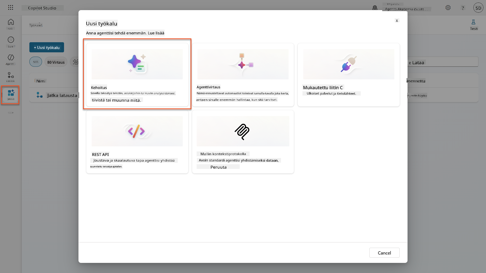

1. **Nimeä uudelleen** kehotus oletusajastetusta nimestä (Esim. *Mukautettu kehotus 09/04/2025, 04:59:11 PM*) nimellä `Yhteenveto Ansioluettelosta`.

1. Lisää Ohjeet-kenttään tämä kehotus:

    ```text
    You are tasked with extracting key candidate information from a resume and cover letter to facilitate matching with open job roles and creating a summary for application review.
    
    Instructions:
    1. Extract Candidate Details:
        - Identify and extract the candidate’s full name.
        - Extract contact information, specifically the email address.
    2. Create Candidate Summary:
        - Summarize the candidate’s profile as multiline text (max 2000 characters) with the following sections:
            - Candidate name
            - Role(s) applied for if present
            - Contact and location
            - One-paragraph summary
            - Experience snapshot (last 2–3 roles with outcomes)
            - Key projects (1–3 with metrics)
            - Education and certifications
            - Top skills (Top 10)
            - Availability and work authorization
    
    Guidelines:
    - Extract information only from the provided resume and cover letter documents.
    - Ensure accuracy in identifying all details such as contact details and skills.
    - The summary should be concise but informative, suitable for quick application review.
    
    Resume: /document
    CoverLetter: /text
    ```

    !!! tip "Käytä Copilot-apua"
        Voit käyttää "Aloita Copilotilla" -toimintoa kehotteen luomiseen luonnollisella kielellä. Kokeile pyytää Copilotia luomaan kehotus ansioluettelon yhteenvetoon!

1. **Konfiguroi** syöttöparametrit:

    | Parametri | Tyyppi | Nimi | Näytedata |
    |-----------|--------|------|-----------|
    | Ansioluettelo | Kuva tai dokumentti | Ansioluettelo | Lataa näyteansioluettelo testidatakansiosta |
    | Saatekirje | Teksti | Saatekirje | Tässä on ansioluettelo! |

1. Valitse **Testaa** nähdäksesi kehotteesi alkuperäisen tekstituloksen.  
    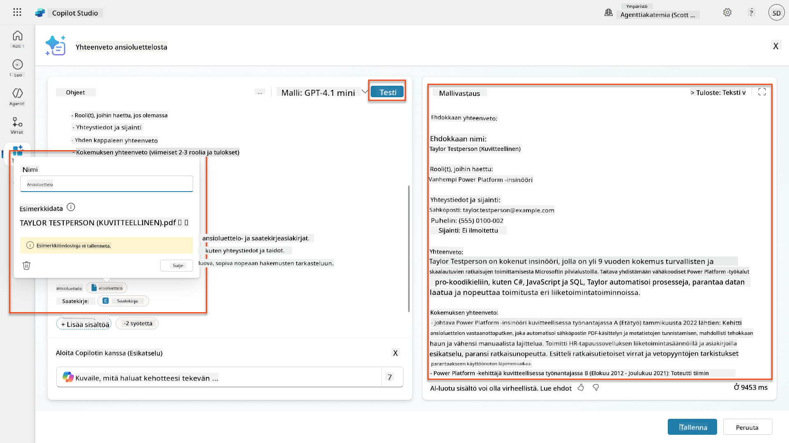

### 7.2 Konfiguroi JSON-tulostus

Nyt muutat kehotteen tuottamaan jäsenneltyä JSON-dataa tavallisen tekstin sijaan.

1. Lisää tämä JSON-muotoilumääritys kehotteen ohjeiden loppuun:

    ```text
    Output Format:
    Provide the output in valid JSON format with the following structure:
    
    {
        "CandidateName": "string",
        "Email": "string",
        "Summary": "string max 2000 characters",
        "Skills": [ {"item": "Skill 1"}, {"item": "Skill 2"}],
        "Experience": [ {"item": "Experience 1"}, {"item": "Experience 2"}],
    }
    ```

1. Vaihda **Tulostus**-asetus "Teksti" → **JSON**.

1. Valitse **Testaa** uudelleen varmistaaksesi, että tulos on nyt JSON-muodossa.  
    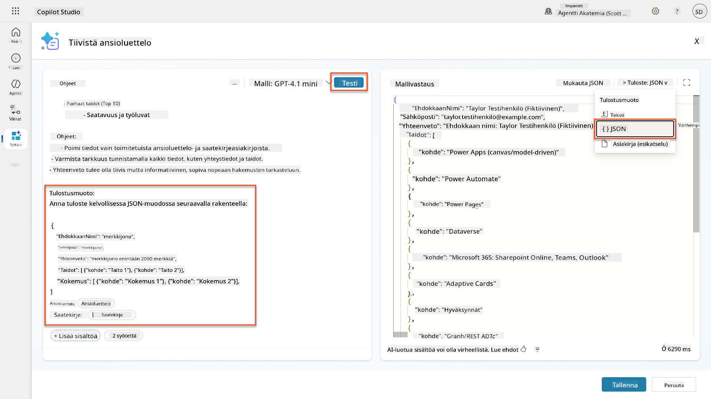

1. **Valinnainen:** Kokeile eri tekoälymalleja nähdäksesi, miten tulokset vaihtelevat, ja palaa sitten oletusmalliin.

1. Valitse **Tallenna** luodaksesi kehotteen.

1. **Konfiguroi käyttö agentissa** -valintaikkunassa valitse **Peruuta**.

    !!! info "Miksi emme lisää tätä työkaluksi vielä"
        Käytät tätä kehotetta Agent Flow -työnkulussa sen sijaan, että käyttäisit sitä suoraan työkaluna, mikä antaa sinulle enemmän hallintaa datan käsittelytyönkulussa.

### 7.3 Lisää kehotus Agent Flow -työnkulkuun

Luo Agent Flow, joka käyttää kehotettasi käsittelemään Dataversessa tallennettuja ansioluetteloita.

!!! tip "Agent Flow -ilmaisut"
    On erittäin tärkeää, että noudatat ohjeita solmujen nimeämisestä ja ilmaisujen syöttämisestä tarkasti, koska ilmaisut viittaavat edellisiin solmuihin niiden nimien avulla! Katso [Agent Flow -tehtävä Rekrytoinnissa](../../recruit/09-add-an-agent-flow/README.md#you-mentioned-expressions-what-are-expressions) nopeaa kertausta varten!

1. Siirry **Rekrytointiajan agenttiisi** Copilot Studiossa

1. Valitse **Agentit**-välilehti ja valitse lapsi **Hakemusten vastaanottoagentti**

1. **Työkalut**-paneelissa valitse **+ Lisää** → **+ Uusi työkalu** → **Agent Flow**

1. Valitse solmussa "Kun agentti kutsuu työnkulun", käytä **+ Lisää syöte** lisätäksesi seuraavan parametrin:

    | Tyyppi | Nimi | Kuvaus |
    |--------|------|--------|
    | Teksti | AnsioluettelonNumero | Varmista, että käytät [AnsioluettelonNumero]. Tämä tulee aina alkaa kirjaimella R |

1. Valitse **+** Lisää toiminto -kuvake ensimmäisen solmun alapuolella, etsi **Dataverse**, valitse **Näytä lisää**, ja etsi **Listaa rivit** -toiminto

1. Valitse **kolme pistettä (...)** Listaa rivit -solmussa ja valitse **Nimeä uudelleen** nimellä `Hae Ansioluettelotieto`, ja aseta seuraavat parametrit:

    | Ominaisuus | Kuinka asettaa | Arvo |
    |------------|----------------|------|
    | **Taulukon nimi** | Valitse | Ansioluettelot |
    | **Suodata rivit** | Dynaaminen data (salama-kuvake) | `ppa_resumenumber eq 'AnsioluettelonNumero'` Korvaa **AnsioluettelonNumero** **Kun agentti kutsuu työnkulun** → **AnsioluettelonNumero** |
    | **Rivien määrä** | Syötä | 1 |

    !!! tip "Optimoi kyselyt!"
        Kun käytät tätä tekniikkaa tuotannossa, sinun tulisi aina rajoittaa valittavat sarakkeet vain niihin, joita Agent Flow tarvitsee.

    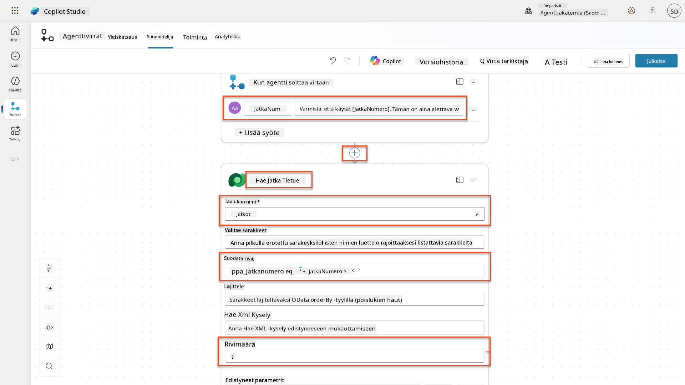

1. Valitse **+** Lisää toiminto -kuvake Hae Ansioluettelotieto -solmun alapuolella, etsi **Dataverse**, valitse **Näytä lisää**, ja etsi **Lataa tiedosto tai kuva** -toiminto.


| **Kehote** | Valitse | Tiivistä ansioluettelo |
| **Hakukirje** | Lauseke (fx-kuvake) | `first(body('Get_Resume_Record')?['value'])?['ppa_coverletter']` |
| **Ansioluettelo** | Dynaaminen data (salamakuvake) | Lataa ansioluettelo → Tiedosto tai kuvasisältö |

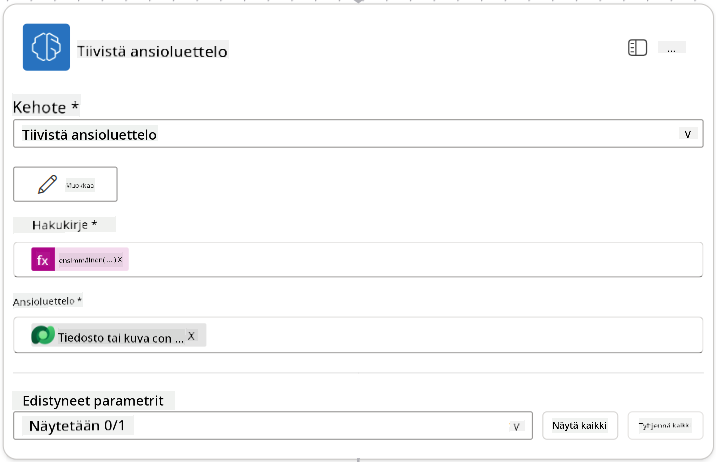

!!! tip "Kehotteen parametrit"
    Huomaa, että täyttämäsi parametrit ovat samoja, jotka määritit syöteparametreiksi luodessasi kehotteen.

### 7.4 Luo hakijarekisteri

Seuraavaksi sinun tulee käyttää kehotteen antamia tietoja ja luoda uusi hakijarekisteri, jos sitä ei ole jo olemassa.

1. Valitse **+** Lisää toiminto -kuvake Tiivistä ansioluettelo -solmun alapuolelta, etsi **Dataverse**, valitse **Näytä lisää** ja etsi **Listaa rivit** -toiminto.

1. Nimeä solmu `Get Existing Candidate` ja aseta seuraavat parametrit:

    | Ominaisuus | Miten asetetaan | Arvo |
    |------------|-----------------|------|
    | **Taulukon nimi** | Valitse | Candidates |
    | **Suodata rivit** | Dynaaminen data (salamakuvake) | `ppa_email eq 'Email'`  **Korvaa** `Email` **Tiivistä ansioluettelo → Email** |
    | **Rivimäärä** | Syötä | 1 |

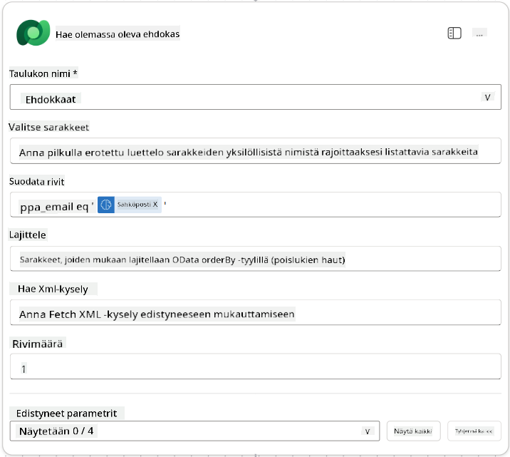

1. Valitse **+** Lisää toiminto -kuvake Hae olemassa oleva hakija -solmun alapuolelta, etsi **Control**, valitse **Näytä lisää** ja etsi **Ehto**-toiminto.

1. Aseta ehtojen ominaisuuksiin seuraava ehto:

    | Ehto | Operaattori | Arvo |
    |------|-------------|------|
    | Lauseke (fx-kuvake): `length(outputs('Get_Existing_Candidate')?['body/value'])` | on yhtä suuri kuin | 0 |

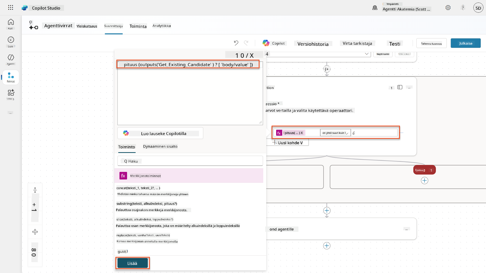

1. Valitse **+** Lisää toiminto -kuvake **True**-haarassa, etsi **Dataverse**, valitse **Näytä lisää** ja etsi **Lisää uusi rivi** -toiminto.

1. Nimeä solmu `Add a New Candidate` ja aseta seuraavat parametrit:

    | Ominaisuus | Miten asetetaan | Arvo |
    |------------|-----------------|------|
    | **Taulukon nimi** | Valitse | Candidates |
    | **Hakijan nimi** | Dynaaminen data (salamakuvake) | Tiivistä ansioluettelo → `CandidateName` |
    | **Sähköposti** | Dynaaminen data (salamakuvake) | Tiivistä ansioluettelo → `Email` |

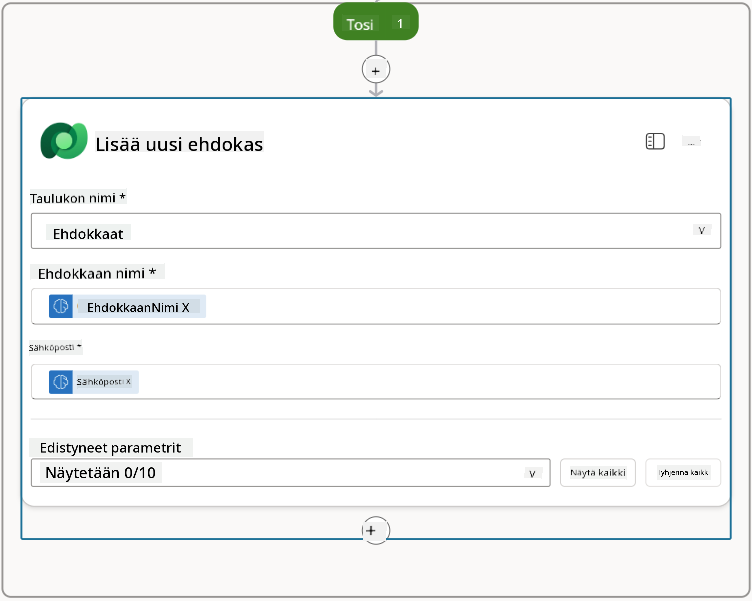

### 7.5 Päivitä ansioluettelo ja määritä työnkulun tulokset

Viimeistele työnkulku päivittämällä ansioluettelorekisteri ja määrittämällä, mitä tietoja palautetaan agentille.

1. Valitse **+** Lisää toiminto -kuvake ehdon alapuolelta, etsi **Dataverse**, valitse **Näytä lisää** ja etsi **Päivitä rivi** -toiminto.

1. Valitse otsikko ja nimeä solmu `Update Resume`, valitse **Näytä kaikki** ja aseta seuraavat parametrit:

    | Ominaisuus | Miten asetetaan | Arvo |
    |------------|-----------------|------|
    | **Taulukon nimi** | Valitse | Resumes |
    | **Rivin ID** | Lauseke (fx-kuvake) | `first(body('Get_Resume_Record')?['value'])?['ppa_resumeid']` |
    | **Yhteenveto** | Dynaaminen data (salamakuvake) | Tiivistä ansioluettelo → Teksti |
    | **Hakija (Candidates)** | Lauseke (fx-kuvake) | `if(equals(length(outputs('Get_Existing_Candidate')?['body/value']), 1), first(outputs('Get_Existing_Candidate')?['body/value'])?['ppa_candidateid'], outputs('Add_a_New_Candidate')?['body/ppa_candidateid'])` |

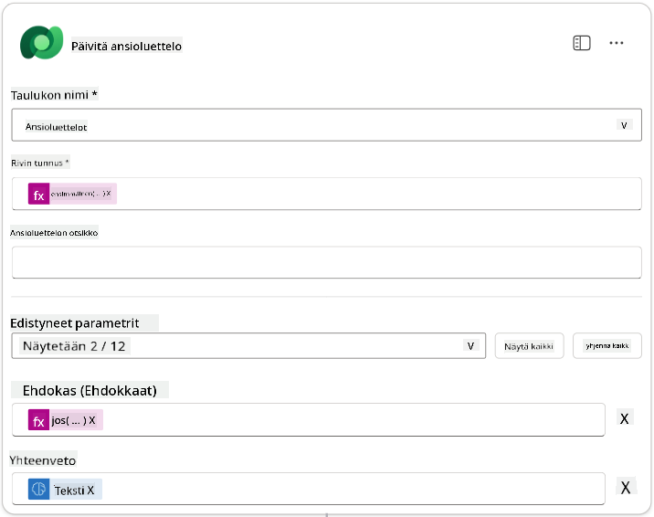

1. Valitse **Vastaa agentille** -solmu ja käytä **+ Lisää tulos** -toimintoa määrittääksesi:

    | Tyyppi | Nimi              | Miten asetetaan                | Arvo                                                        | Kuvaus                                            |
    |--------|-------------------|--------------------------------|-------------------------------------------------------------|--------------------------------------------------|
    | Teksti | `CandidateName`   | Dynaaminen data (salamakuvake) | Tiivistä ansioluettelo → Näytä lisää → CandidateName         | Ansioluettelossa annettu [CandidateName]         |
    | Teksti | `CandidateEmail`  | Dynaaminen data (salamakuvake) | Tiivistä ansioluettelo → Näytä lisää → Email                 | Ansioluettelossa annettu [CandidateEmail]        |
    | Teksti | `CandidateNumber` | Lauseke (fx-kuvake)            | `concat('ppa_candidates/', if(equals(length(outputs('Get_Existing_Candidate')?['body/value']), 1), first(outputs('Get_Existing_Candidate')?['body/value'])?['ppa_candidateid'], outputs('Add_a_New_Candidate')?['body/ppa_candidateid']) )` | Uuden tai olemassa olevan hakijan [CandidateNumber] |
    | Teksti | `ResumeSummary`   | Dynaaminen data (salamakuvake) | Tiivistä ansioluettelo → Näytä lisää → body/responsev2/predictionOutput/structuredOutput | Ansioluettelon yhteenveto ja tiedot JSON-muodossa |

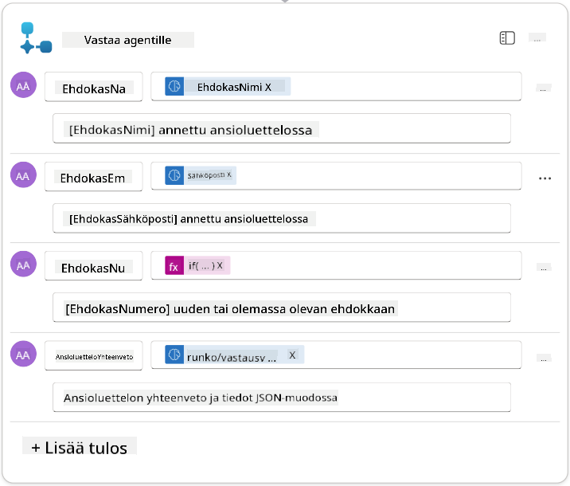

1. Valitse **Tallenna luonnos** oikeasta yläkulmasta. Agenttityönkulun pitäisi näyttää seuraavalta:  
    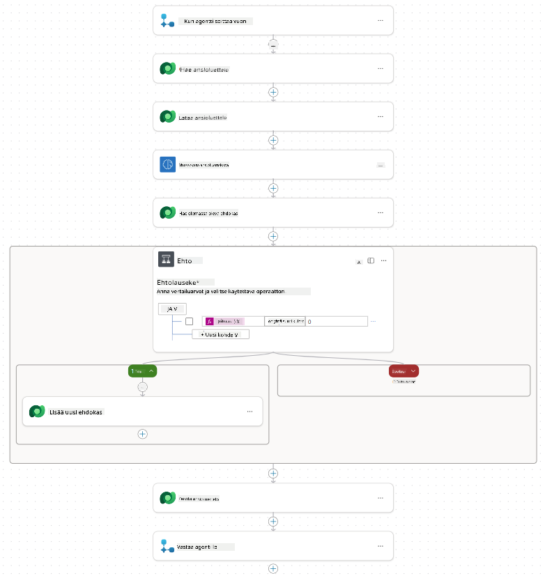

1. Valitse **Yleiskatsaus**-välilehti, valitse **Muokkaa** **Tiedot**-paneelista.

    1. **Työnkulun nimi**: `Summarize Resume`
    1. **Kuvaus**:

        ```text
        Summarize an existing Resume stored in Dataverse using a [ResumeNumber] as input, return the [CandidateNumber], and resume summary JSON
        ```

1. Valitse **Tallenna**

1. Valitse uudelleen **Suunnittelija**-välilehti ja valitse **Julkaise**.

### 7.6 Yhdistä työnkulku agenttiin

Lisää työnkulku työkaluksi ja määritä agentti käyttämään sitä.

1. Avaa **Hiring Agent** Copilot Studiossa.

1. Valitse **Agents**-välilehti ja avaa **Application Intake Agent**.

1. Valitse **Työkalut**-paneeli ja valitse **+ Lisää työkalu** -> **Flow** -> **Summarize Resume** **(Agent Flow)**.

1. Valitse **Lisää ja määritä**.

1. Määritä työkalun asetukset seuraavasti:

    | Asetus | Arvo |
    |--------|------|
    | **Kuvaus** | Tiivistä olemassa oleva ansioluettelo, joka on tallennettu Dataverseen käyttämällä [ResumeNumber]-tunnusta syötteenä, palauta [CandidateNumber] ja ansioluettelon yhteenveto JSON-muodossa |
    | **Milloin tätä työkalua voidaan käyttää** | Vain kun viitataan aiheiden tai agenttien toimesta |

1. Valitse **Tallenna**  
    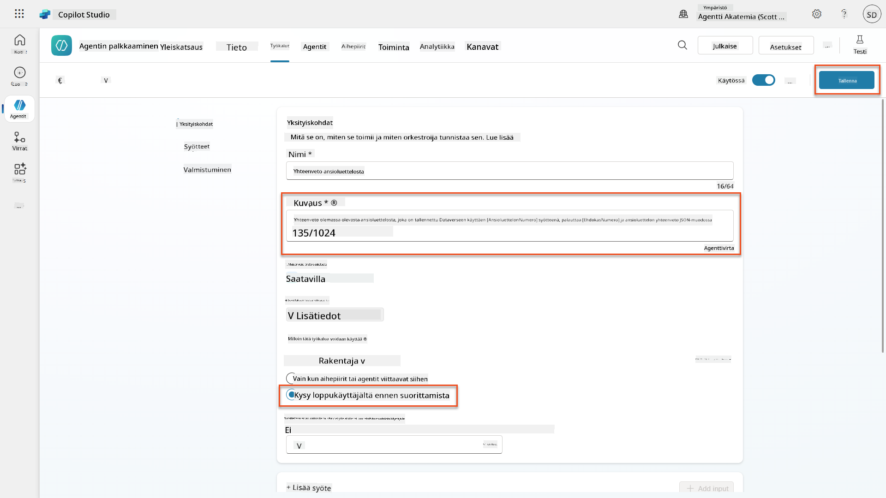

1. Jos valitset Työkalut Hiring Agentissa, näet nyt molemmat työkalut, jotka ovat käytettävissä **Application Intake Agent** -agentilla.  
    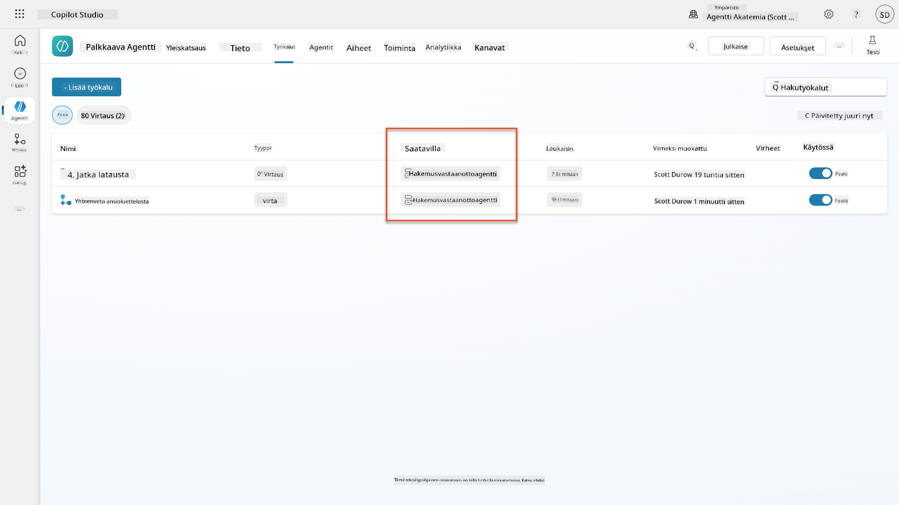

1. Siirry **Application Intake Child** -agentin ohjeisiin ja muokkaa **Post-Upload**-vaihe seuraavasti:

    ```text
    2. Post-Upload Processing  
        - After uploading, be sure to also output the [ResumeNumber] in all messages
        - Pass [ResumeNumber] to /Summarize Resume  - Be sure to use the correct value that will start with the letter R.
        - Be sure to also output the [CandidateNumber] in all messages
        - Use the [ResumeSummary] to output a summary of the processed Resume and candidate
    ```

    Korvaa `/Summarize Resume` lisäämällä viittaus **Summarize Resume agent flow** -työnkulkuun kirjoittamalla kauttaviiva (`/)`) tai valitsemalla `/Summarize` lisätäksesi viittauksen.  
    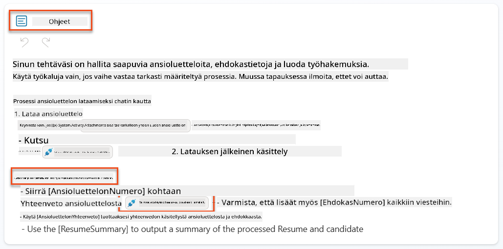

1. Valitse **Tallenna**.

### 7.7 Testaa agenttisi

Testaa koko multimodaalinen järjestelmäsi varmistaaksesi, että kaikki toimii oikein.

1. **Aloita testaus**:

    - Valitse **Testaa** avataksesi testipaneelin
    - Kirjoita: `Tässä on hakijan ansioluettelo`

    - Lataa yksi esimerkkianisoluetteloista [Test Resumes](https://download-directory.github.io/?url=https://github.com/microsoft/agent-academy/tree/main/operative/sample-data/resumes&filename=operative_sampledata)

1. **Vahvista tulokset**:
    - Kun lähetät viestin ja ansioluettelon, tarkista, että saat ansioluettelon numeron (muoto: R#####)
    - Vahvista, että saat hakijan numeron ja yhteenvedon
    - Käytä toimintakarttaa nähdäksesi sekä ansioluettelon lataustyökalun että Tiivistä ansioluettelo -työkalun toiminnassa, ja että yhteenvedon kehotteen tulokset vastaanotetaan agentilta:  
        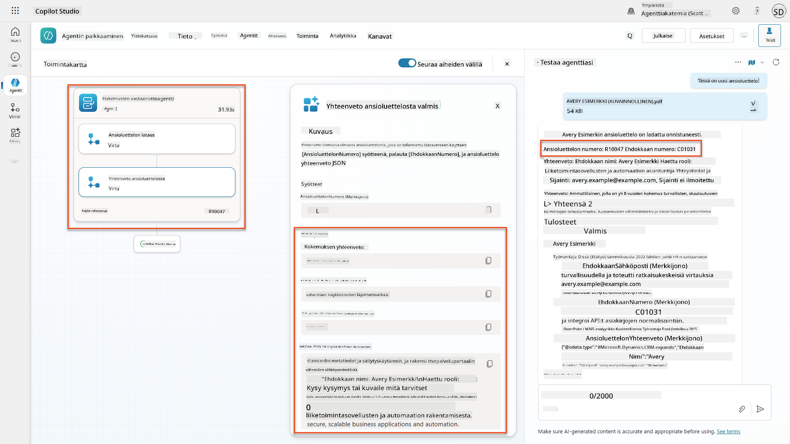

1. **Tarkista tietojen pysyvyys**:
    - Siirry [Power Apps](https://make.powerapps.com)
    - Avaa **Sovellukset** → **Hiring Hub** → **Pelaa**
    - Siirry **Resumes**-osioon varmistaaksesi, että ansioluettelo ladattiin ja käsiteltiin. Sen pitäisi sisältää sekä yhteenvetotiedot että siihen liittyvä hakijarekisteri.
    - Tarkista **Candidates**-osio nähdäksesi poimitut hakijatiedot  
        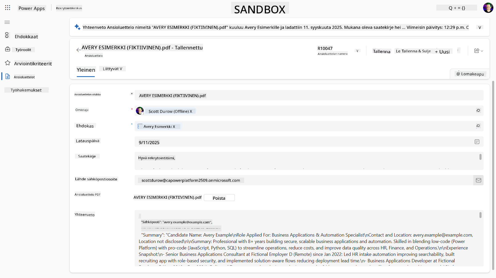
    - Kun suoritat prosessin uudelleen, sen pitäisi käyttää olemassa olevaa hakijaa (sähköpostin perusteella), eikä luoda uutta.

!!! tip "Vianmääritys"
    - **Ansioluettelo ei käsittele**: Varmista, että tiedosto on PDF-muodossa ja kokorajoitusten mukainen
    - **Hakijaa ei luotu**: Tarkista, että sähköposti poimittiin oikein ansioluettelosta
    - **JSON-muotoiluvirheet**: Varmista, että kehotteen ohjeet sisältävät tarkan JSON-rakenteen
    - **Työnkulkuvirheet**: Tarkista, että kaikki Dataverse-yhteydet ja lausekkeet on määritetty oikein

### Valmius tuotantokäyttöön

Vaikka tämä ei ole osa tehtävää, tuotantokäyttöön valmiin agenttityönkulun luomiseksi voit harkita seuraavia:

1. **Virheenkäsittely** - Jos ansioluettelon numeroa ei löydy tai kehotteen käsittely epäonnistuu, lisää virheenkäsittelyä, joka palauttaa selkeän virheen agentille.
1. **Olemassa olevien hakijoiden päivittäminen** - Hakija löytyy sähköpostin perusteella, jolloin nimi voitaisiin päivittää vastaamaan ansioluettelossa olevaa.
1. **Ansioluettelon tiivistämisen ja hakijan luomisen erottaminen** - Tämä toiminnallisuus voitaisiin jakaa pienempiin agenttityönkulkuihin, jotta niitä olisi helpompi ylläpitää, ja sitten agentille annettaisiin ohjeet käyttää niitä vuorotellen.

## 🎉 Tehtävä suoritettu

Hienoa työtä, Operative! **Document Resume Recon** on nyt valmis. Olet onnistuneesti hallinnut multimodaaliset kehotteet ja pystyt nyt poimimaan tarkasti rakenteellista dataa mistä tahansa dokumentista.

Tässä on, mitä olet saavuttanut tehtävässä:

**✅ Multimodaalisten kehotteiden hallinta**  
Ymmärrät nyt, mitä multimodaaliset kehotteet ovat ja milloin käyttää eri AI-malleja optimaalisten tulosten saavuttamiseksi.

**✅ Dokumenttien käsittelyosaaminen**  
Olet oppinut määrittämään kehotteita kuva- ja dokumenttisyötteillä sekä muotoilemaan tuloksia JSON-muotoon rakenteellisen datan poimintaa varten.

**✅ Ansioluettelon poistojärjestelmä**  
Olet rakentanut täydellisen ansioluettelon poistojärjestelmän, joka käsittelee hakijadokumentteja ja integroituu rekrytointiprosessiisi.

**✅ Parhaiden käytäntöjen toteutus**  
Olet soveltanut parhaita käytäntöjä kehotteiden suunnittelussa dokumenttianalyysiin ja integroinut multimodaaliset kehotteet agenttityönkulkuihin.

**✅ Perusta kehittyneelle käsittelylle**  
Parannetut dokumenttianalyysikyvyt ovat nyt valmiita edistyneille datan pohjustusominaisuuksille, joita lisätään tulevissa tehtävissä.

🚀 **Seuraavaksi:** Tehtävässä 08 opit parantamaan kehotteitasi reaaliaikaisella Dataverse-datalla, luoden dynaamisia AI-ratkaisuja, jotka mukautuvat muuttuviin liiketoimintavaatimuksiin.

⏩ [Siirry tehtävään 08: Kehotteen parantaminen Dataverse-pohjustuksella](../08-dataverse-grounding/README.md)

## 📚 Taktiset resurssit

📖 [Luo kehote](https://learn.microsoft.com/ai-builder/create-a-custom-prompt?WT.mc_id=power-power-182762-scottdurow)

📖 [Lisää teksti-, kuva- tai dokumenttisyöte kehotteeseesi](https://learn.microsoft.com/ai-builder/add-inputs-prompt?WT.mc_id=power-182762-scottdurow)

📖 [Käsittele vastauksia JSON-muodossa](https://learn.microsoft.com/ai-builder/process-responses-json-output?WT.mc_id=power-182762-scottdurow)

📖 [Mallin valinta ja lämpötila-asetukset](https://learn.microsoft.com/ai-builder/prompt-modelsettings?WT.mc_id=power-182762-scottdurow)

📖 [Käytä kehotettasi Power Automatessa](https://learn.microsoft.com/ai-builder/use-a-custom-prompt-in-flow?WT.mc_id=power-182762-scottdurow)

📺 [AI Builder: JSON-tulokset kehoterakentajassa](https://www.youtube.com/watch?v=F0fGnWrRY_I)

---

**Vastuuvapauslauseke**:  
Tämä asiakirja on käännetty käyttämällä tekoälypohjaista käännöspalvelua [Co-op Translator](https://github.com/Azure/co-op-translator). Vaikka pyrimme tarkkuuteen, huomioithan, että automaattiset käännökset voivat sisältää virheitä tai epätarkkuuksia. Alkuperäinen asiakirja sen alkuperäisellä kielellä tulisi pitää ensisijaisena lähteenä. Kriittisen tiedon osalta suositellaan ammattimaista ihmiskäännöstä. Emme ole vastuussa väärinkäsityksistä tai virhetulkinnoista, jotka johtuvat tämän käännöksen käytöstä.