<!--
CO_OP_TRANSLATOR_METADATA:
{
  "original_hash": "750f3ea8a94930439ebd8a10871b1d73",
  "translation_date": "2025-10-17T01:41:51+00:00",
  "source_file": "docs/operative-preview/08-dataverse-grounding/README.md",
  "language_code": "fi"
}
-->
# 🚨 Tehtävä 08: Parannellut kehotteet Dataverse-pohjauksella

--8<-- "disclaimer.md"

## 🕵️‍♂️ Koodinimi: `OPERATION GROUNDING CONTROL`

> **⏱️ Operaatioaika:** `~60 minuuttia`

## 🎯 Tehtävän kuvaus

Tervetuloa takaisin, Operatiivinen. Moniagenttinen rekrytointijärjestelmäsi toimii, mutta se tarvitsee kriittisen parannuksen **datapohjaukseen** - tekoälymallisi tarvitsevat reaaliaikaista pääsyä organisaatiosi jäsenneltyihin tietoihin tehdäkseen älykkäitä päätöksiä.

Tällä hetkellä tiivistelmää ansioluettelosta -kehotteesi toimii staattisen tiedon varassa. Mutta entä jos se voisi dynaamisesti käyttää työroolien tietokantaa tarjotakseen tarkkoja ja ajantasaisia ehdotuksia? Entä jos se ymmärtäisi arviointikriteerisi ilman, että sinun täytyy kovakoodata niitä?

Tässä tehtävässä parannat mukautettua kehotettasi **Dataverse-pohjauksella** - yhdistämällä kehotteesi suoraan reaaliaikaisiin tietolähteisiin. Tämä muuttaa agenttisi staattisista vastaajista dynaamisiksi, dataohjatuiksi järjestelmiksi, jotka mukautuvat muuttuviin liiketoiminnan tarpeisiin.

Tehtäväsi: integroi reaaliaikaiset työrooli- ja arviointikriteeritiedot ansioluetteloanalyysityöhön, luoden itsepäivittyvän järjestelmän, joka pysyy ajan tasalla organisaatiosi rekrytointivaatimusten kanssa.

## 🔎 Tavoitteet

Tässä tehtävässä opit:

1. Kuinka **Dataverse-pohjaus** parantaa mukautettuja kehotteita
1. Milloin käyttää datapohjausta staattisten ohjeiden sijaan
1. Kehottamisen suunnittelua, joka dynaamisesti sisältää reaaliaikaisia tietoja
1. Tiivistelmää ansioluettelosta -prosessin parantamista työroolien sovittamisella

## 🧠 Dataverse-pohjauksen ymmärtäminen kehotteille

**Dataverse-pohjaus** mahdollistaa mukautettujen kehotteiden pääsyn reaaliaikaisiin tietoihin Dataverse-taulukoista pyyntöjä käsiteltäessä. Staattisten ohjeiden sijaan kehotteesi voivat sisältää reaaliaikaista tietoa tehdäkseen perusteltuja päätöksiä.

### Miksi Dataverse-pohjaus on tärkeää

Perinteiset kehotteet toimivat kiinteillä ohjeilla:

```text
Match this candidate to these job roles: Developer, Manager, Analyst
```

Dataverse-pohjauksella kehotteesi käyttää ajankohtaista tietoa:

```text
Match this candidate to available job roles from the Job Roles table, 
considering current evaluation criteria and requirements
```

Tämä lähestymistapa tarjoaa useita keskeisiä etuja:

- **Dynaamiset päivitykset:** Työroolit ja kriteerit muuttuvat ilman kehotteen muokkausta
- **Johdonmukaisuus:** Kaikki agentit käyttävät samoja ajankohtaisia tietolähteitä
- **Laajennettavuus:** Uudet roolit ja kriteerit ovat automaattisesti saatavilla
- **Tarkkuus:** Reaaliaikainen tieto varmistaa, että päätökset heijastavat nykyisiä tarpeita

### Kuinka Dataverse-pohjaus toimii

Kun otat Dataverse-pohjauksen käyttöön mukautetulle kehotteelle:

1. **Tietojen valinta:** Valitse tietyt Dataverse-taulukot ja sarakkeet mukaan. Voit myös valita liittyvät taulukot, joita järjestelmä suodattaa vanhempien tietueiden perusteella.
1. **Kontekstin lisääminen:** Kehote sisältää automaattisesti haetut tiedot kontekstiinsa
1. **Älykäs suodatus:** Järjestelmä sisältää vain pyynnön kannalta olennaiset tiedot, jos annat suodatuskriteerejä.
1. **Jäsennelty ulostulo:** Kehote voi viitata haettuihin tietoihin ja tehdä päätelmiä haetuista tietueista luodakseen ulostulon.

### Staattisesta dynaamiseen: Pohjauksen etu

Tarkastellaan nykyistä Tiivistelmää ansioluettelosta -prosessiasi Tehtävästä 07 ja katsotaan, kuinka Dataverse-pohjaus muuttaa sen staattisesta dynaamiseen älykkyyteen.

**Nykyinen staattinen lähestymistapa:**
Nykyinen kehotteesi sisältää kovakoodatut arviointikriteerit ja ennalta määrätyn sovituslogiikan. Tämä lähestymistapa toimii, mutta vaatii manuaalisia päivityksiä aina, kun lisäät uusia työrooleja, muutat arviointikriteerejä tai siirrät yrityksen painopisteitä.

**Dataverse-pohjauksen muutos:**
Lisäämällä Dataverse-pohjauksen Tiivistelmää ansioluettelosta -prosessisi:

- **Käyttää ajankohtaisia työrooleja** Työroolit-taulukosta
- **Käyttää reaaliaikaisia arviointikriteerejä** staattisten kuvausten sijaan  
- **Tarjoaa tarkkoja sovituksia** reaaliaikaisten vaatimusten perusteella

## 🎯 Miksi omat kehotteet vs agenttikeskustelut

Tehtävässä 02 koit, kuinka Haastatteluagentti pystyi sovittamaan ehdokkaita työrooleihin, mutta vaati monimutkaisia käyttäjäkehotteita, kuten:

```text
Upload this resume, then show me open job roles,
each with a description of the evaluation criteria, 
then use this to match the resume to at least one suitable
job role even if not a perfect match.
```

Vaikka tämä toimi, omat kehotteet Dataverse-pohjauksella tarjoavat merkittäviä etuja tiettyihin tehtäviin:

### Omiin kehotteisiin liittyvät keskeiset edut

| Ominaisuus | Agenttikeskustelut | Omat kehotteet |
|------------|--------------------|----------------|
| **Johdonmukaisuus** | Tulokset vaihtelevat käyttäjän kehotteiden muotoilutaitojen mukaan | Vakioitu käsittely joka kerta |
| **Erikoistuminen** | Yleiskäyttöinen päättely voi ohittaa liiketoiminnan vivahteet | Tarkoitukseen suunniteltu optimoidulla liiketoimintalogiikalla |
| **Automaatio** | Vaatii ihmisen vuorovaikutusta ja tulkintaa | Käynnistyy automaattisesti jäsennellyllä JSON-ulostulolla |

## 🧪 Laboratorio 8: Lisää Dataverse-pohjaus kehotteisiin

Aika päivittää ansioluetteloanalyysisi! Parannat olemassa olevaa Tiivistelmää ansioluettelosta -prosessia dynaamisella työroolien sovittamisella.

### Esivaatimukset tehtävän suorittamiseksi

1. Sinulla tulee olla **joko**:

    - **Suoritettuna Tehtävä 07** ja valmiina ansioluetteloanalyysijärjestelmäsi, **TAI**
    - **Tuoda Tehtävä 08 aloitusratkaisu**, jos aloitat alusta tai tarvitset apua. [Lataa Tehtävä 08 aloitusratkaisu](https://aka.ms/agent-academy)

1. Esimerkkianasioluettelot [testi-ansioluettelot](https://download-directory.github.io/?url=https://github.com/microsoft/agent-academy/tree/main/operative/sample-data/resumes&filename=operative_sampledata)

!!! note "Ratkaisun tuonti ja esimerkkidata"
    Jos käytät aloitusratkaisua, katso [Tehtävä 01](../01-get-started/README.md) yksityiskohtaiset ohjeet ratkaisujen ja esimerkkidatan tuomisesta ympäristöösi.

### 8.1 Lisää Dataverse-pohjaus kehotteeseesi

Rakennat Tiivistelmää ansioluettelosta -kehotteen, jonka loit Tehtävässä 07. Tällä hetkellä se yksinkertaisesti tiivistää ansioluettelon, mutta nyt pohjaat sen Dataversen työrooleihin, pitäen sen aina ajantasaisena.

Ensin tarkastellaan Dataverse-taulukoita, joita käytät pohjaukseen:

1. **Siirry** [Power Apps](https://make.powerapps.com) -sivustolle ja valitse ympäristösi **Ympäristön valitsimella** navigointipalkin oikeasta yläkulmasta.

1. Valitse **Taulukot** ja etsi **Työroolit**-taulukko.

1. Tarkista keskeiset sarakkeet, joita käytät pohjaukseen:

    | Sarake | Tarkoitus |
    |--------|----------|
    | **Työroolin numero** | Yksilöllinen tunniste roolin sovittamiseen |
    | **Työnimike** | Roolin näyttönimi |
    | **Kuvaus** | Yksityiskohtaiset roolivaatimukset |

1. Tarkista vastaavasti muut taulukot, kuten **Arviointikriteerit**-taulukko.

### 8.2 Lisää Dataverse-pohjaustiedot kehotteeseesi

1. **Siirry** Copilot Studioon ja valitse ympäristösi **Ympäristön valitsimella** navigointipalkin oikeasta yläkulmasta.

1. Valitse **Työkalut** vasemmanpuoleisesta navigointipalkista.

1. Valitse **Kehote** ja etsi **Tiivistelmää ansioluettelosta** -kehote Tehtävästä 07.  
    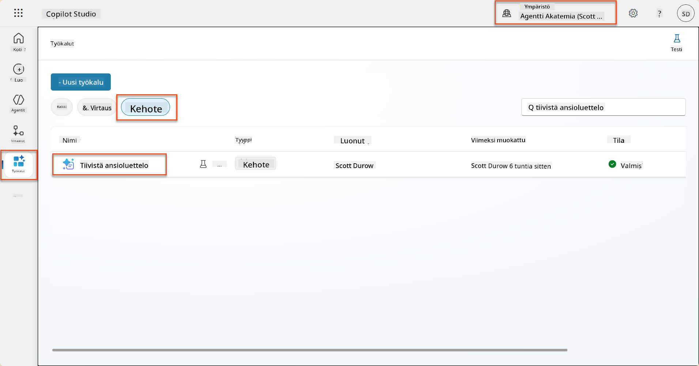

1. Valitse **Muokkaa** muokataksesi kehotetta ja korvaa se alla olevalla parannetulla versiolla:

    !!! important
        Varmista, että Ansioluettelo- ja Hakemuskirje-parametrit säilyvät ehjinä parametreina.

    ```text
    You are tasked with extracting key candidate information from a resume and cover letter to facilitate matching with open job roles and creating a summary for application review.
    
    ### Instructions:
    1. **Extract Candidate Details:**
       - Identify and extract the candidate's full name.
       - Extract contact information, specifically the email address.
    
    2. **Analyze Resume and Cover Letter:**
       - Review the resume content to identify relevant skills, experience, and qualifications.
       - Review the cover letter to understand the candidate's motivation and suitability for the roles.
    
    3. **Match Against Open Job Roles:**
       - Compare the extracted candidate information with the requirements and descriptions of the provided open job roles.
       - Use the job descriptions to assess potential fit.
       - Identify all roles that align with the candidate's cover letter and profile. You don't need to assess perfect suitability.
       - Provide reasoning for each match based on the specific job requirements.
    
    4. **Create Candidate Summary:**
       - Summarize the candidate's profile as multiline text with the following sections:
          - Candidate name
          - Role(s) applied for if present
          - Contact and location
          - One-paragraph summary
          - Top skills (8–10)
          - Experience snapshot (last 2–3 roles with outcomes)
          - Key projects (1–3 with metrics)
          - Education and certifications
          - Availability and work authorization
    
    ### Output Format
    
    Provide the output in valid JSON format with the following structure:
    
    {
      "CandidateName": "string",
      "Email": "string",
      "MatchedRoles": [
        {
          "JobRoleNumber": "ppa_jobrolenumber from grounded data",
          "RoleName": "ppa_jobtitle from grounded data",
          "Reasoning": "Detailed explanation based on job requirements"
        }
      ],
      "Summary": "string"
    }
    
    ### Guidelines
    
    - Extract information only from the provided resume and cover letter documents.
    - Ensure accuracy in identifying contact details.
    - Use the available job role data for matching decisions.
    - The summary should be concise but informative, suitable for quick application review.
    - If no suitable matches are found, indicate an empty list for MatchedRoles and explain briefly in the summary.
    
    ### Input Data
    Open Job Roles (ppa_jobrolenumber, ppa_jobtitle): /Job Role 
    Resume: {Resume}
    Cover Letter: {CoverLetter}
    ```

1. Kehotteen editorissa korvaa `/Job Role` valitsemalla **+ Lisää sisältö**, valitsemalla **Dataverse** → **Työrooli** ja valitse seuraavat sarakkeet, ja valitse sitten **Lisää**:

    1. **Työroolin numero**

    1. **Työnimike**

    1. **Kuvaus**

    !!! tip
        Voit kirjoittaa taulukon nimen hakukenttään.

1. **Työrooli**-valintaikkunassa valitse **Suodatin**-attribuutti, valitse **Tila**, ja kirjoita **Aktiivinen** **Suodatin**-arvoksi.  
    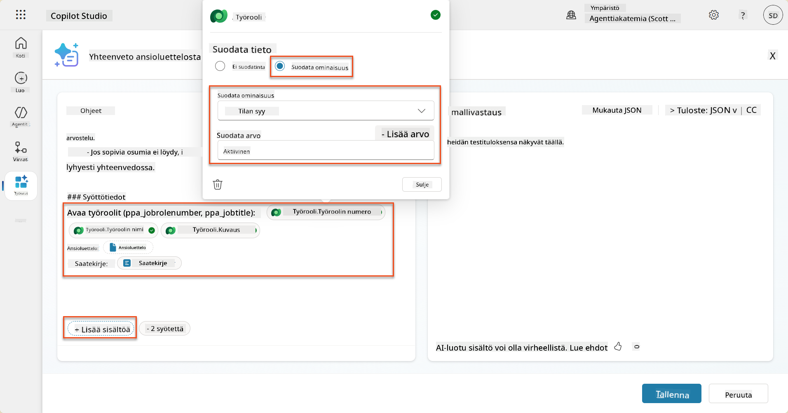

    !!! tip
        Voit käyttää **Lisää arvo**-toimintoa lisätäksesi syöttöparametrin - esimerkiksi, jos sinulla olisi kehote tiivistää olemassa oleva tietue, voisit antaa Ansioluettelon numeron parametrina suodatusta varten.

1. Seuraavaksi lisäät liittyvän Dataverse-taulukon **Arviointikriteerit**, valitsemalla jälleen **+ Lisää sisältö**, etsimällä **Työroolit**, ja sen sijaan, että valitsisit sarakkeet Työroolista, laajenna **Työrooli (Arviointikriteerit)** ja valitse seuraavat sarakkeet, ja valitse sitten **Lisää**:

    1. **Kriteerin nimi**

    1. **Kuvaus**  
        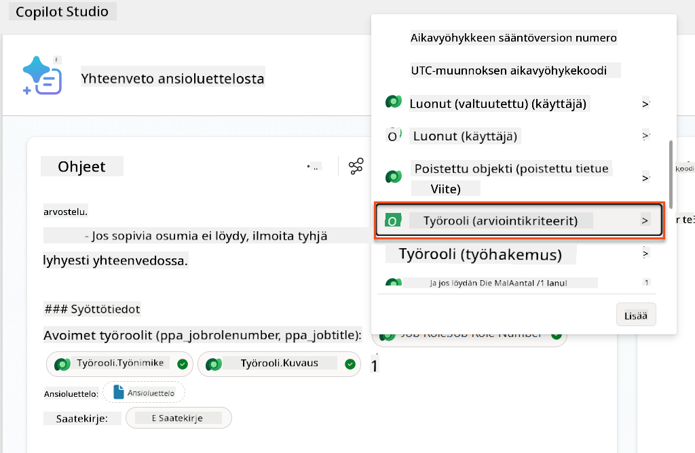

        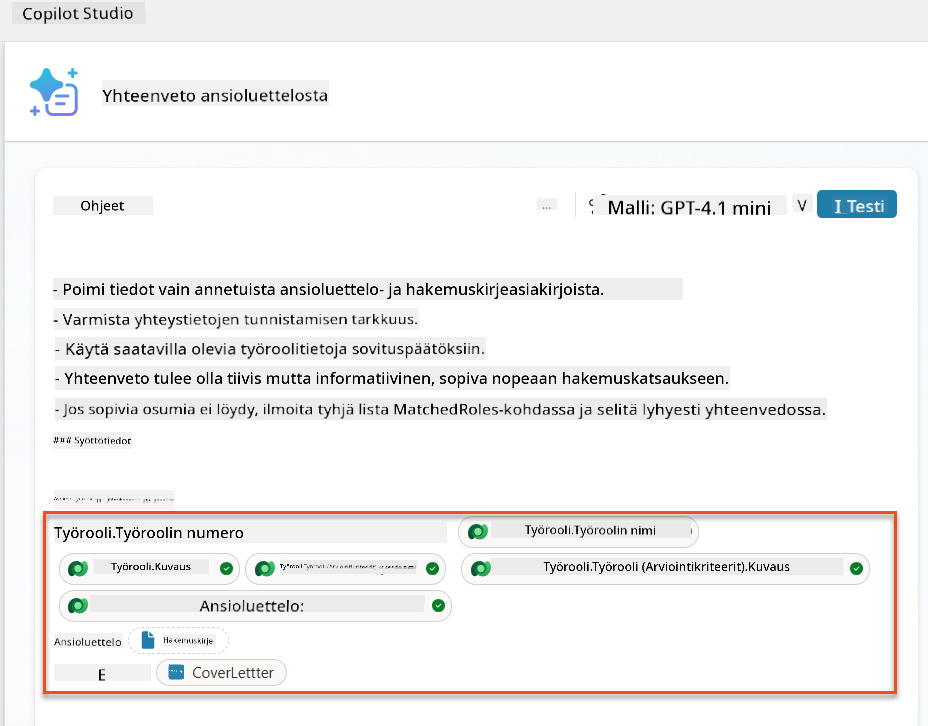

    !!! tip
        On tärkeää valita liittyvät Arviointikriteerit ensin valitsemalla Työrooli ja sitten navigoimalla valikossa Työrooli (Arviointikriteerit). Tämä varmistaa, että vain Työrooliin liittyvät tietueet ladataan.

1. Valitse **Asetukset**, ja säädä **Tietueiden haku** arvoon 1000 - tämä mahdollistaa enimmäismäärän Työrooleja ja Arviointikriteerejä kehotteeseesi.  
    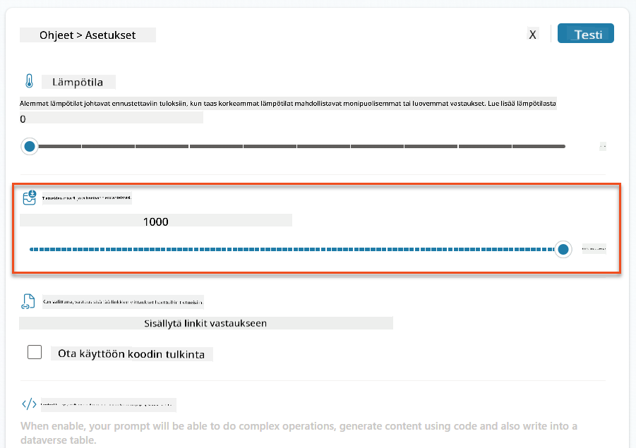

### 8.3 Testaa paranneltua kehotetta

1. Valitse **Ansioluettelo**-parametri ja lataa esimerkkianasioluettelo, jota käytit Tehtävässä 07.
1. Valitse **Testaa**.
1. Kun testi on suoritettu, huomaa, että JSON-ulostulo sisältää nyt **Sovitettuja rooleja**.
1. Valitse **Käytetyt tiedot**-välilehti nähdäksesi Dataverse-tiedot, jotka yhdistettiin kehotteeseesi ennen suoritusta.
1. **Tallenna** päivitetty kehotteesi. Järjestelmä sisältää nyt automaattisesti nämä Dataverse-tiedot kehotteeseesi, kun olemassa oleva Tiivistelmää ansioluettelosta -agenttiprosessi kutsuu sitä.  
    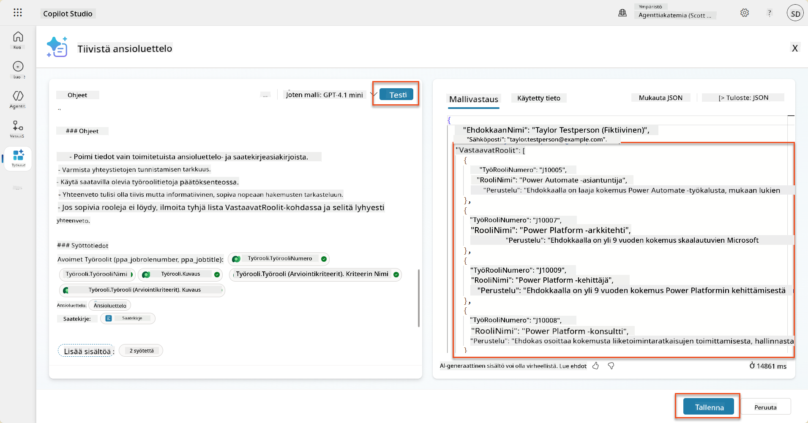

### 8.4 Lisää Työhakemus-agenttiprosessi

Jotta Hakemusten vastaanottoagentti voi luoda Työrooleja ehdotettujen roolien perusteella, meidän täytyy luoda agenttiprosessi. Agentti kutsuu tätä työkalua jokaiselle ehdotetulle työroolille, josta hakija on kiinnostunut.

!!! tip "Agenttiprosessin lausekkeet"
    On erittäin tärkeää, että noudatat ohjeita solmujen nimeämisestä ja lausekkeiden syöttämisestä tarkasti, koska lausekkeet viittaavat aiempiin solmuihin niiden nimien avulla! Katso [Agenttiprosessin tehtävä Rekrytointi-osiossa](../../recruit/09-add-an-agent-flow/README.md#you-mentioned-expressions-what-are-expressions) nopea kertaus!

1. **Rekrytointiagentin** sisällä valitse **Agentit**-välilehti ja avaa **Hakemusten vastaanottoagentti**-alagentti.

1. **Työkalut**-paneelissa valitse **+ Lisää** → **+ Uusi työkalu** → **Agenttiprosessi**

1. Valitse **Kun agentti kutsuu prosessin**-solmu, käytä **+ Lisää syöte** lisätäksesi seuraavat parametrit:

    | Tyyppi | Nimi            | Kuvaus                                                  |
    |--------|-----------------|---------------------------------------------------------|
    | Teksti | `ResumeNumber`  | Varmista, että käytät vain [ResumeNumber] - sen TÄYTYY alkaa kirjaimella R |
    | Teksti | `JobRoleNumber` | Varmista, että käytät vain [JobRoleNumber] - sen TÄYTYY alkaa kirjaimella J |

    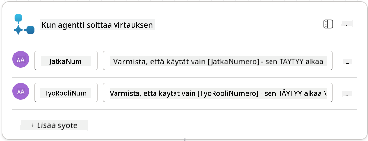

1. Valitse **+** Lisää toiminto -kuvake ensimmäisen solmun alapuolella, etsi **Dataverse**, valitse **Näytä lisää**, ja etsi **Listaa rivit**-toiminto.

1. **Nimeä** solmu `Hae ansioluettelo`, ja aseta seuraavat parametrit:

    | Ominaisuus        | Kuinka asettaa               | Arvo                                                        |
    |-------------------|------------------------------|-------------------------------------------------------------|
    | **Taulukon nimi** | Valitse                      | Ansioluettelot                                              |
    | **Suodata rivit** | Dynaaminen data (salamaikoni) | `ppa_resumenumber eq 'ResumeNumber'` Valitse ja korvaa **ResumeNumber** kohdasta **Kun agentti kutsuu prosessin** → **ResumeNumber** |
    | **Rivien määrä**  | Syötä                        | 1                                                           |

    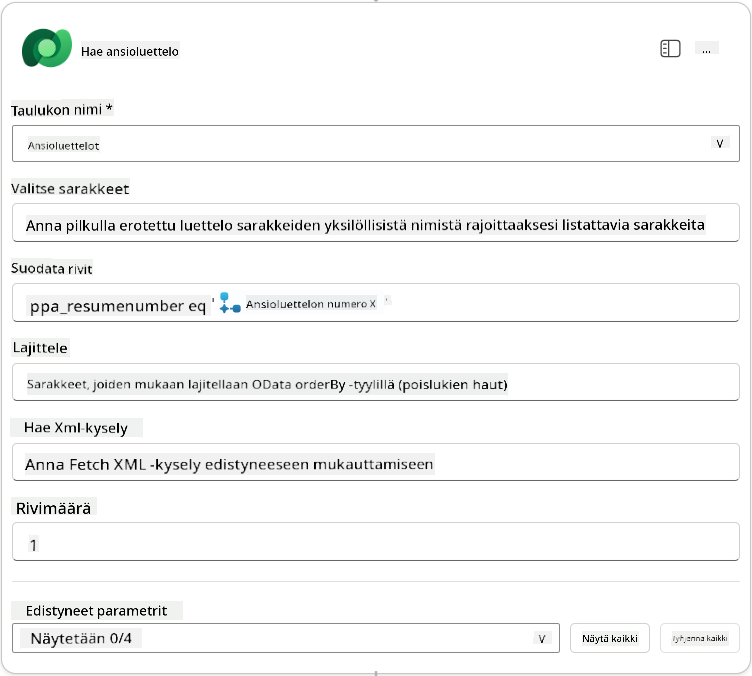

1. Nyt valitse **+** Lisää toiminto -kuvake Hae ansioluettelo -solmun alapuolella, etsi **Dataverse**, valitse **Näytä lisää**, ja etsi **Listaa rivit**-toiminto.

1. **Nimeä** solmu `Hae työrooli`, ja aseta seuraavat parametrit:

    | Ominaisuus        | Kuinka asettaa               | Arvo                                                        |
    |-------------------|------------------------------|-------------------------------------------------------------|
    | **Taulukon nimi** | Valitse                      | Työroolit                                                   |
    | **Suodata rivit** | Dynaaminen data (salamaikoni) | `ppa_jobrolenumber eq 'JobRoleNumber'` Valitse ja korvaa **JobRoleNumber** kohdasta **Kun agentti kutsuu prosessin** → **JobRoleNumber** |
    | **Rivien määrä**  | Syötä                        | 1                                                           |

    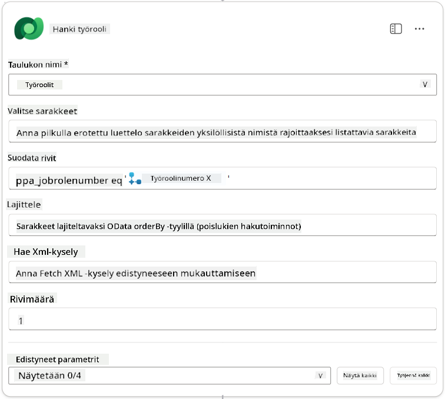

1. Nyt valitse **+** Lisää toiminto -kuvake Hae työrooli -solmun alapuolella, etsi **Dataverse**, valitse **Näytä lisää**, ja etsi **Lisää uusi rivi**-toiminto.

1. **Nimeä** solmu `Lisää hakemus`, ja aseta seuraavat parametrit:

    | Ominaisuus                           | Kuinka asettaa        | Arvo                                                        |
    |--------------------------------------|-----------------------|-------------------------------------------------------------|
    | **Ta
| **Työrooli (Työroolit)**               | Lauseke (fx-kuvake) | `concat('ppa_jobroles/',first(outputs('Get_Job_Role')?['body/value'])?['ppa_jobroleid'])` |
| **Ansioluettelo (Ansioluettelot)**     | Lauseke (fx-kuvake) | `concat('ppa_resumes/', first(outputs('Get_Resume')?['body/value'])?['ppa_resumeid'])` |
| **Hakupäivämäärä** (käytä **Näytä kaikki**) | Lauseke (fx-kuvake) | `utcNow()`                                                   |

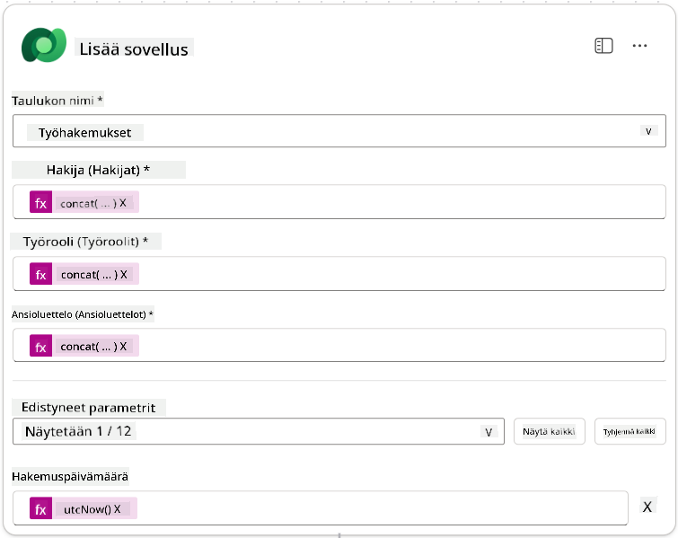

1. Valitse **Vastaa agentille -solmu** ja valitse sitten **+ Lisää lähtö**

     | Ominaisuus      | Miten asetetaan                 | Tiedot                                         |
     | --------------- | ------------------------------- | ---------------------------------------------- |
     | **Tyyppi**      | Valitse                        | `Teksti`                                       |
     | **Nimi**        | Kirjoita                       | `Hakemusnumero`                                |
     | **Arvo**        | Dynaaminen data (salama-kuvake) | *Lisää hakemus → Näytä lisää → Hakemusnumero*  |
     | **Kuvaus**      | Kirjoita                       | `Luodun työhakemuksen [Hakemusnumero]`         |

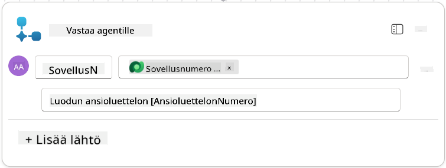

1. Valitse **Tallenna luonnos** oikeasta yläkulmasta.

1. Valitse **Yleiskatsaus**-välilehti, valitse **Muokkaa** kohdassa **Tiedot**-paneeli.

      - **Virran nimi**:`Luo työhakemus`
      - **Kuvaus**:`Luo uuden työhakemuksen, kun annetaan [Ansioluettelonumero] ja [Työroolinumero]`
      - **Tallenna**

1. Valitse uudelleen **Suunnittelija**-välilehti ja valitse **Julkaise**.

### 8.5 Lisää Luo työhakemus agentille

Nyt yhdistät julkaistun virran hakemusagenttiin.

1. Siirry takaisin **Rekrytointagenttiin** ja valitse **Agentit**-välilehti. Avaa **Hakemusagentti** ja etsi **Työkalut**-paneeli.

1. Valitse **+ Lisää**

1. Valitse **Virta**-suodatin ja etsi `Luo työhakemus`. Valitse **Luo työhakemus**-virta ja sitten **Lisää ja määritä**.

1. Aseta seuraavat parametrit:

    | Parametri                                           | Arvo                                                        |
    | --------------------------------------------------- | ----------------------------------------------------------- |
    | **Kuvaus**                                          | `Luo uuden työhakemuksen, kun annetaan [Ansioluettelonumero] ja [Työroolinumero]` |
    | **Lisätiedot → Milloin tätä työkalua voidaan käyttää** | `Vain kun viitataan aiheisiin tai agenteihin`               |

1. Valitse **Tallenna**  
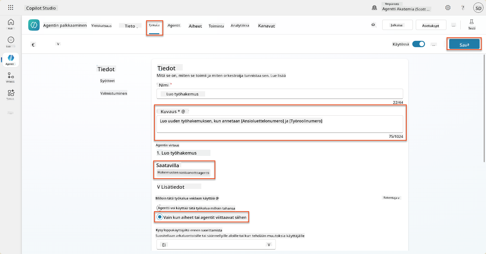

### 8.6 Määritä agentin ohjeet

Työhakemusten luomiseksi sinun täytyy kertoa agentille, milloin käyttää uutta työkalua. Tässä tapauksessa pyydät käyttäjää vahvistamaan, mihin ehdotettuihin työrooleihin hän haluaa hakea, ja ohjeistat agenttia käyttämään työkalua kunkin roolin kohdalla.

1. Siirry takaisin **Hakemusagenttiin** ja etsi **Ohjeet**-paneeli.

1. **Ohjeet**-kentässä **lisää** seuraavat selkeät ohjeet lapsiagentillesi **olemassa olevien ohjeiden loppuun**:

    ```text
    3. Post Resume Upload
       - Respond with a formatted bullet list of [SuggestedJobRoles] the candidate could apply for.  
       - Use the format: [JobRoleNumber] - [RoleDescription]
       - Ask the user to confirm which Job Roles to create applications for the candidate.
       - When the user has confirmed a set of [JobRoleNumber]s, move to the next step.
    
    4. Post Upload - Application Creation
        - After the user confirms which [SuggestedJobRoles] for a specific [ResumeNumber]:
        E.g. "Apply [ResumeNumber] for the Job Roles [JobRoleNumber], [JobRoleNumber], [JobRoleNumber]
        E.g. "apply to all suggested job roles" - this implies use all the [JobRoleNumbers] 
         - Loop over each [JobRoleNumber] and send with [ResumeNumber] to /Create Job Application   
         - Summarize the Job Applications Created
    
    Strict Rules (that must never be broken)
    You must always follow these rules and never break them:
    1. The only valid identifiers are:
      - ResumeNumber (ppa_resumenumber)→ format R#####
      - CandidateNumber (ppa_candidatenumber)→ format C#####
      - ApplicationNumber (ppa_applicationnumber)→ format A#####
      - JobRoleNumber (ppa_jobrolenumber)→ format J#####
    2. Never guess or invent these values.
    3. Always extract identifiers from the current context (conversation, data, or system output). 
    ```

1. Kun ohjeissa on kauttaviiva (/), valitse teksti kauttaviivan jälkeen ja valitse **Luo työhakemus**-työkalu.

1. Valitse **Tallenna**  
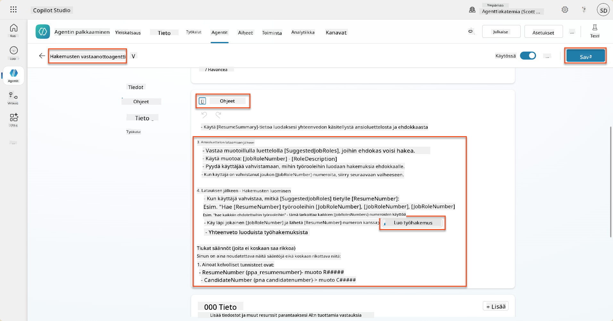

!!! tip "Iterointi useiden kohteiden yli generatiivisessa orkestroinnissa"
    Nämä ohjeet hyödyntävät generatiivisen orkestroinnin kykyä iteroida useiden rivien yli päätöksiä tehtäessä siitä, mitä vaiheita ja työkaluja käytetään. Vastaavat työroolit luetaan automaattisesti, ja hakemusagentti suorittaa toiminnon kullekin riville. Tervetuloa generatiivisen orkestroinnin maagiseen maailmaan!

### 8.7 Testaa agenttisi

1. Avaa **Rekrytointagenttisi** Copilot Studiossa.

1. **Lataa** esimerkkian­sioluettelo keskusteluun ja kirjoita:

    ```text
    This is a new resume for the Power Platform Developer Role.
    ```

1. Huomaa, kuinka agentti tarjoaa listan ehdotetuista työrooleista - jokaisella on työroolinumero.  
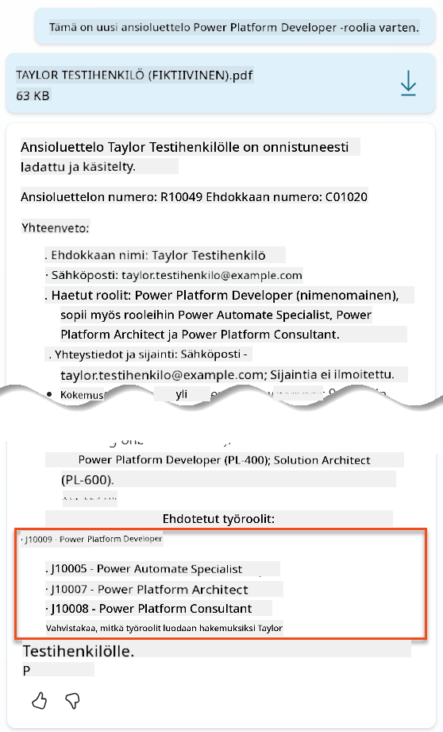

1. Voit sitten ilmoittaa, mihin näistä haluat lisätä ansioluettelon työhakemukseksi.
    **Esimerkkejä:**

    ```text
    "Apply for all of those job roles"
    "Apply for the J10009 Power Platform Developer role"
    "Apply for the Developer and Architect roles"
    ```

    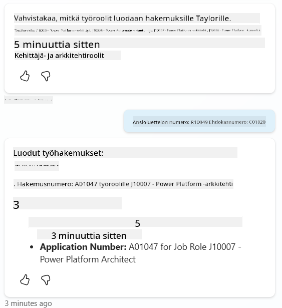

1. **Luo työhakemus -työkalu** suoritetaan sitten kunkin työroolin kohdalla, jonka pyysit luomaan hakemuksen. Aktiviteettikartassa näet, kuinka työkalu suoritetaan kullekin työroolille:  
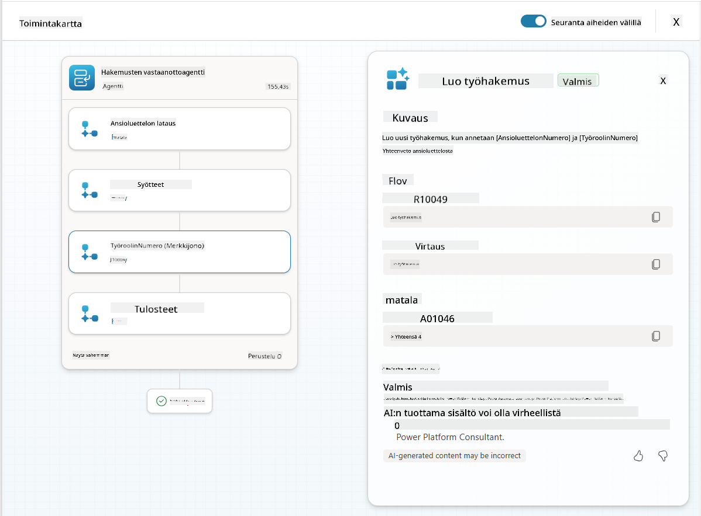

## 🎉 Tehtävä suoritettu

Loistavaa työtä, Operatiivinen! **Operaatio Grounding Control** on nyt valmis. Olet onnistuneesti parantanut tekoälysi kyvykkyyksiä dynaamisella datan pohjautuvuudella, luoden aidosti älykkään rekrytointijärjestelmän.

Tässä on, mitä olet saavuttanut tässä tehtävässä:

**✅ Dataversen pohjautuvuuden hallinta**  
Ymmärrät nyt, kuinka yhdistää mukautetut kehotteet reaaliaikaisiin tietolähteisiin dynaamisen älykkyyden saavuttamiseksi.

**✅ Parannettu ansioluetteloanalyysi**  
Tiivistä ansioluettelo -virta käyttää nyt reaaliaikaista työroolidataa ja arviointikriteerejä tarkkaan kohdistamiseen.

**✅ Dataan perustuva päätöksenteko**  
Rekrytointisi agentit voivat nyt mukautua automaattisesti muuttuviin työvaatimuksiin ilman manuaalisia kehotepäivityksiä.

**✅ Työhakemusten luominen**  
Parannettu järjestelmäsi voi nyt luoda työhakemuksia ja on valmis monimutkaisempaan työnkulkuorkestrointiin.

🚀 **Seuraavaksi:** Seuraavassa tehtävässä opit toteuttamaan syvällisiä päättelykykyjä, jotka auttavat agentejasi tekemään monimutkaisia päätöksiä ja antamaan yksityiskohtaisia selityksiä suosituksilleen.

⏩ [Siirry tehtävään 09: Syvällinen päättely](../09-deep-reasoning/README.md)

## 📚 Taktiset resurssit

📖 [Käytä omaa dataasi kehotteessa](https://learn.microsoft.com/ai-builder/use-your-own-prompt-data?WT.mc_id=power-182762-scottdurow)

📖 [Luo mukautettu kehotus](https://learn.microsoft.com/ai-builder/create-a-custom-prompt?WT.mc_id=power-182762-scottdurow)

📖 [Työskentele Dataversen kanssa Copilot Studiossa](https://learn.microsoft.com/microsoft-copilot-studio/knowledge-add-dataverse?WT.mc_id=power-182762-scottdurow)

📖 [AI Builder mukautettujen kehotusten yleiskatsaus](https://learn.microsoft.com/ai-builder/prompts-overview?WT.mc_id=power-182762-scottdurow)

📖 [Power Platform AI Builder -dokumentaatio](https://learn.microsoft.com/ai-builder/?WT.mc_id=power-182762-scottdurow)

📖 [Koulutus: Luo AI Builder -kehotuksia käyttäen omaa Dataverse-dataasi](https://learn.microsoft.com/training/modules/ai-builder-grounded-prompts/?WT.mc_id=power-182762-scottdurow)

---

**Vastuuvapauslauseke**:  
Tämä asiakirja on käännetty käyttämällä tekoälypohjaista käännöspalvelua [Co-op Translator](https://github.com/Azure/co-op-translator). Vaikka pyrimme tarkkuuteen, huomioithan, että automaattiset käännökset voivat sisältää virheitä tai epätarkkuuksia. Alkuperäistä asiakirjaa sen alkuperäisellä kielellä tulisi pitää ensisijaisena lähteenä. Kriittisen tiedon osalta suositellaan ammattimaista ihmiskäännöstä. Emme ole vastuussa väärinkäsityksistä tai virhetulkinnoista, jotka johtuvat tämän käännöksen käytöstä.