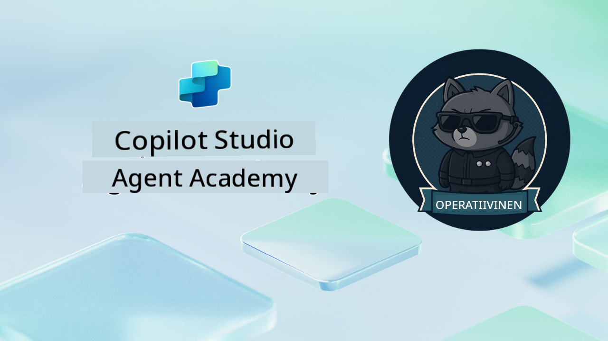

<!--
CO_OP_TRANSLATOR_METADATA:
{
  "original_hash": "24fcbe9a57d3439e05f8866e550c0a84",
  "translation_date": "2025-10-17T01:41:02+00:00",
  "source_file": "docs/operative-preview/README.md",
  "language_code": "fi"
}
-->
# Tervetuloa Operatiivinen Agentti

**Tervetuloa, Operatiivinen Agentti.**  
Edistynyt tehtäväsi—jos päätät hyväksyä sen—on oppia rakentamaan **yritystason monen agentin järjestelmiä** käyttäen **Microsoft Copilot Studiota**.

Tämä intensiivinen koulutus vie sinut perusagenttien luomisesta monimutkaiseen **monen agentin orkestroinnin** maailmaan: rekrytointiautomaatiosta tekoälyn turvallisuuteen, opit rakentamaan, koordinoimaan ja ottamaan käyttöön älykkäitä agenttiekosysteemejä todellisissa yritysskenaarioissa.

--8<-- "disclaimer.md"

---

## 🎯 Tehtävän Tavoite

Agent Academy Operative -ohjelman suorittamisen jälkeen osaat:

- Suunnitella ja toteuttaa **monen agentin järjestelmiä** monimutkaisiin liiketoimintaskenaarioihin
- Hallita **agenttien orkestrointia** ja yhteistyökuvioita
- Toteuttaa **tekoälyn turvallisuutta ja sisällön moderointia** tuotantojärjestelmissä
- Rakentaa **monimodaalisia kehotteita** dokumenttien käsittelyyn ja analysointiin
- Ottaa käyttöön **yritystason agentteja** asianmukaisella hallinnalla ja testauksella

---

## 🧪 Esivaatimukset

Kaikkien tehtävien suorittamiseen tarvitset:

- Suoritettu **Agent Academy Recruit** -koulutus
- Microsoft Power Platform -ympäristö, jossa on **Copilot Studio** -lisenssi
- Pääsy **Microsoft Dataverseen**
- Järjestelmänvalvojan oikeudet ratkaisujen ja agenttien luomiseen

---

## 🧬 Kenelle Tämä On Tarkoitettu

Tämä edistynyt kurssi sopii:

- **Ratkaisuarkkitehdeille**, jotka suunnittelevat yritystason tekoälyjärjestelmiä
- **Kehittäjille**, jotka rakentavat tuotantovalmiita agenttiratkaisuja
- **IT-ammattilaisille**, jotka toteuttavat tekoälyn hallintaa ja turvallisuutta
- **Liiketoiminta-analyytikoille**, jotka luovat monimutkaisia automaatiotyönkulkuja
- Kaikille, jotka ovat valmiita **nostamaan tasoaan** perusagenteista yritysjärjestelmiin

---

## 🧭 Kurssin Yleiskatsaus

Tämä akatemia on rakennettu eteneväksi sarjaksi kenttäoperaatioita—jokainen tehtävä rakentuu edellisen päälle luoden kattavan rekrytointiautomaatiojärjestelmän.

| Tehtävä | Otsikko | Operaatio Briefing |
|---------|---------|--------------------|
| `01` | 🚨 [Aloita rekrytointiautomaation agentilla](./01-get-started/README.md) | Ota käyttöön perusinfrastruktuuri ja luo keskeinen orkestrointiautomaattisi |
| `02` | 🎭 [Tee agentistasi monen agentin järjestelmään sopiva](./02-multi-agent/README.md) | Muunna yksittäinen agentti koordinoiduksi monen agentin järjestelmäksi |
| `03` | ⚡ [Automatisoi agenttisi laukaisimilla](./03-automate-triggers/README.md) | Toteuta autonomisia agenttikäyttäytymisiä tapahtumapohjaisilla laukaisimilla |
| `04` | 📝 [Agenttiohjeiden kirjoittaminen](./04-agent-instructions/README.md) | Hallitse tarkkaa agenttiviestintää ja käyttäytymisen ohjausta |
| `05` | 💬 [Agenttivastausten personointi](./05-agent-responses/README.md) | Mukauta agenttivastauksia maksimaalisen vaikutuksen ja sitoutumisen saavuttamiseksi |
| `06` | 🛡️ [Sisällön moderointi ja tekoälyn turvallisuuden perusteet](./06-ai-safety/README.md) | Toteuta yritystason turvallisuus- ja vaatimustenmukaisuusratkaisut |
| `07` | 🎨 [Ansioluetteloiden sisällön poiminta monimodaalisilla kehotteilla](./07-multimodal-prompts/README.md) | Käsittele dokumentteja ja kuvia edistyneillä tekoälyominaisuuksilla |
| `08` | 🗄️ [Kehotteet - Dataverse-pohjaisuus](./08-dataverse-grounding/README.md) | Perusta agentit yritysdatan varaan tarkkoja vastauksia varten |
| `09` | 🧠 [Syvällisen päättelyn soveltaminen kandidaatin sopivuuden arviointiin ja haastatteluun valmistautumiseen](./09-deep-reasoning/README.md) | Toteuta kehittynyttä tekoälypäättelyä monimutkaisiin päätöksiin |
| `10` | 📄 [Luo kandidaattikohtaisia haastatteludokumentteja kehotteilla](./10-generate-documents/README.md) | Luo dynaamisia dokumentteja agenttianalyysin perusteella |
| `11` | 📊 [Kerää käyttäjäpalautetta mukautuvilla korteilla](./11-obtain-user-feedback/README.md) | Kerää ja käsittele käyttäjäpalautetta jatkuvan parantamisen tueksi |
| `12` | 🌐 [Julkaise agenttisi demoverkkosivustolle sidosryhmien testattavaksi](./12-demo-website/README.md) | Ota käyttöön valmis ratkaisu sidosryhmien esittelyä ja testausta varten |

!!! note
    ✅ Tämän kurssin suorittaminen ansaitsee sinulle **Operatiivinen Agentti** -merkin.  
    🔓 **Komentaja** avautuu tulevissa vaiheissa.

<!-- markdownlint-disable-next-line MD033 -->

---

**Vastuuvapauslauseke**:  
Tämä asiakirja on käännetty käyttämällä tekoälypohjaista käännöspalvelua [Co-op Translator](https://github.com/Azure/co-op-translator). Vaikka pyrimme tarkkuuteen, huomioithan, että automaattiset käännökset voivat sisältää virheitä tai epätarkkuuksia. Alkuperäinen asiakirja sen alkuperäisellä kielellä tulisi pitää ensisijaisena lähteenä. Kriittisen tiedon osalta suositellaan ammattimaista ihmiskäännöstä. Emme ole vastuussa väärinkäsityksistä tai virhetulkinnoista, jotka johtuvat tämän käännöksen käytöstä.