<!--
CO_OP_TRANSLATOR_METADATA:
{
  "original_hash": "d9cd8cd1a4fbd8915171a2ed972cc322",
  "translation_date": "2025-10-17T01:21:44+00:00",
  "source_file": "docs/recruit/00-course-setup/README.md",
  "language_code": "fi"
}
-->
# 🚨 Tehtävä 00: Kurssin aloitus

## 🕵️‍♂️ Koodinimi: `OPERATION DEPLOYMENT READY`

> **⏱️ Operaatioaika:** `~30 minuuttia`  

## 🎯 Tehtävän kuvaus

Tervetuloa ensimmäiseen tehtävään Copilot Studio -agenttikoulutuksessasi.  
Ennen kuin voit aloittaa ensimmäisen tekoälyagenttisi rakentamisen, sinun täytyy luoda **kenttävalmis kehitysympäristö**.

Tässä ohjeessa käydään läpi järjestelmät, käyttöoikeudet ja asennusvaiheet, jotka tarvitaan Microsoft 365 -ekosysteemissä toimimiseen.

## 🔎 Tavoitteet

Tehtäväsi sisältää:

1. Microsoft 365 -tilin hankkiminen  
1. Pääsyn saaminen Microsoft Copilot Studioon  
1. (Valinnainen) Microsoft 365 Copilot -lisenssin hankkiminen tuotantokäyttöä varten  
1. Kehitysympäristön luominen Copilot Studio -ympäristöksi  
1. SharePoint-sivuston luominen, joka toimii tietolähteenä myöhemmissä tehtävissä  

---

## 🔍 Esivaatimukset

Ennen kuin aloitat, varmista että sinulla on:

1. **Työ- tai koulusähköpostiosoite** (henkilökohtaiset @outlook.com, @gmail.com jne. eivät ole tuettuja).  
1. Pääsy internetiin ja moderni selain (suositellaan Edge, Chrome tai Firefox).  
1. Perustiedot Microsoft 365:stä (esimerkiksi kirjautuminen Office-sovelluksiin tai Teamsiin).  
1. (Valinnainen) Luottokortti tai maksutapa, jos aiot ostaa maksullisia lisenssejä.  

---

## Vaihe 1: Hanki Microsoft 365 -tili

Copilot Studio sijaitsee Microsoft 365:ssä, joten tarvitset Microsoft 365 -tilin päästäksesi siihen. Voit käyttää olemassa olevaa tiliäsi, jos sinulla on sellainen, tai noudattaa näitä ohjeita sopivan lisenssin hankkimiseksi:

1. **Hanki maksullinen Microsoft 365 Business -tilaus**  
   1. Siirry [Microsoft 365 Business -suunnitelmien ja hinnoittelun sivulle](https://www.microsoft.com/microsoft-365/business/microsoft-365-plans-and-pricing)  
   1. Edullisin vaihtoehto aloittamiseen on Microsoft 365 Business Basic -suunnitelma. Valitse `Kokeile ilmaiseksi` ja täytä ohjattu lomake tilauksen, tilitietojen ja maksutietojen osalta.  
   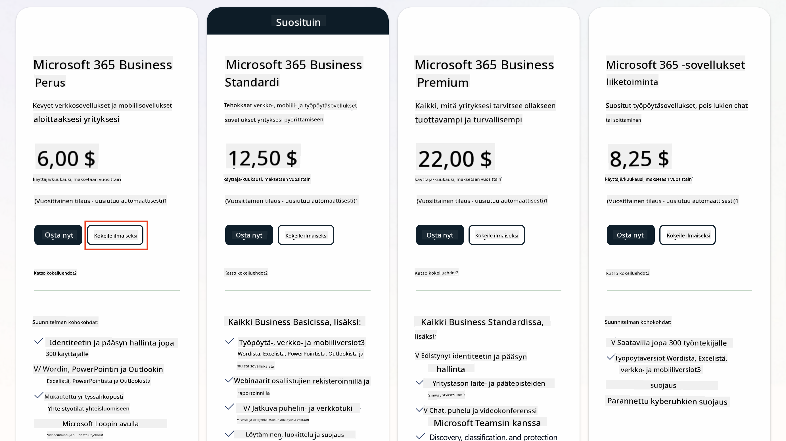  
   1. Kun sinulla on uusi tilisi, kirjaudu sisään.

    !!! Tip
        Jos aiot julkaista agentteja Microsoft 365 Copilot Chatissa tai yhdistää organisaation dataan (SharePoint, OneDrive, Dataverse), tarvitset Microsoft 365 Copilot -lisenssin. Tämä on lisenssi, josta voit lukea lisää [lisensointisivustolla](https://www.microsoft.com/microsoft-365/copilot#plans).

---

## Vaihe 2: Aloita Copilot Studio -kokeilu

Kun sinulla on Microsoft 365 -vuokralainen, sinun täytyy saada pääsy Copilot Studioon. Voit saada ilmaisen 30 päivän kokeilujakson seuraamalla näitä ohjeita:

1. Siirry osoitteeseen [aka.ms/TryCopilotStudio](https://aka.ms/TryCopilotStudio).  
1. Syötä sähköpostiosoite, jonka määritit edellisessä vaiheessa, ja valitse `Seuraava`.  
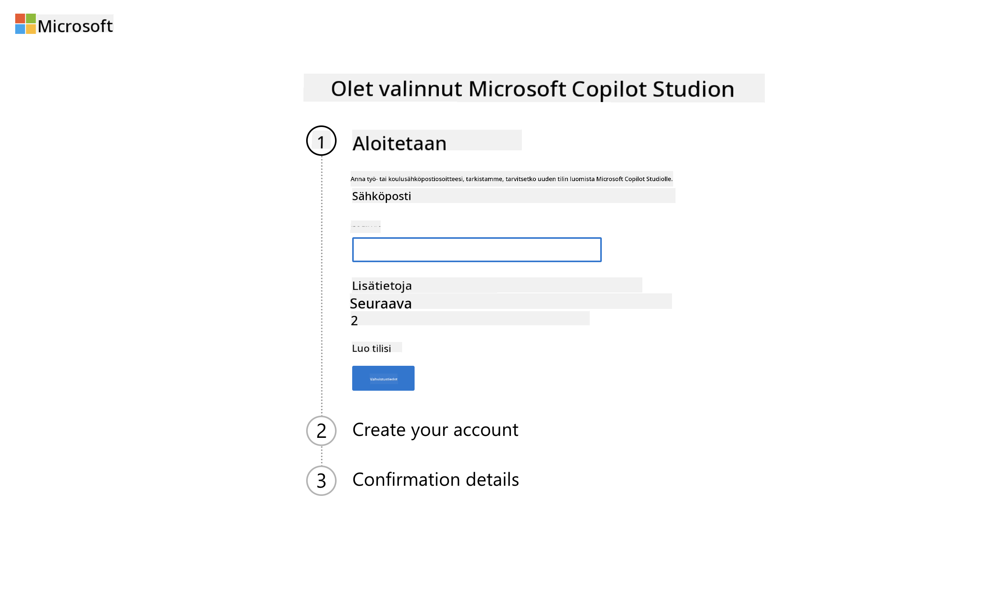  
1. Järjestelmän pitäisi tunnistaa tilisi. Valitse `Kirjaudu sisään`.  
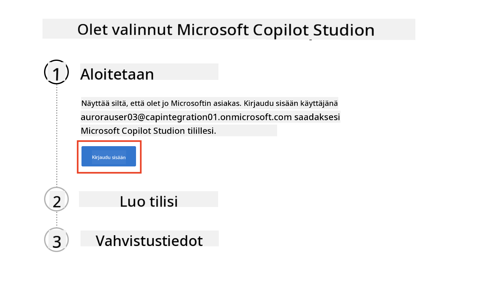  
1. Valitse `Aloita ilmainen kokeilu`.  
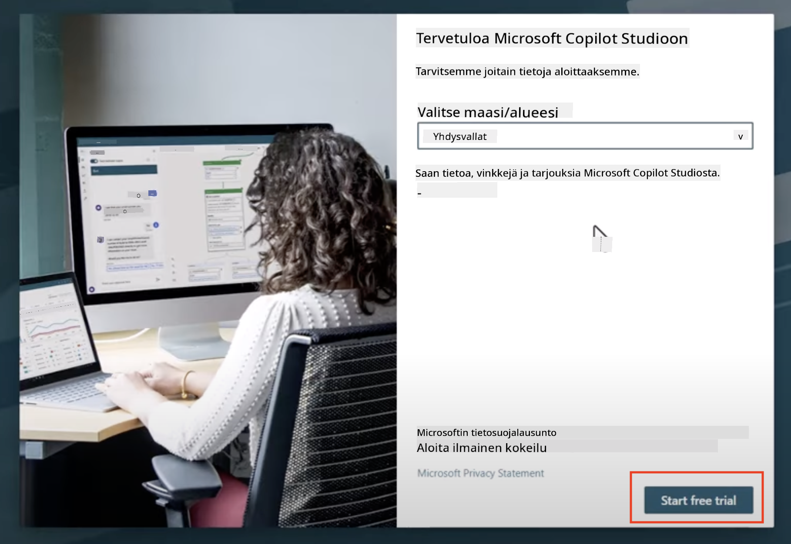

!!! info "Kokeilun tiedot"  
     1. Ilmainen kokeilu tarjoaa **täydet Copilot Studio -ominaisuudet**.  
     1. Saat sähköposti-ilmoituksia kokeilujakson päättymisestä. Voit jatkaa kokeilua 30 päivän jaksoissa (enintään 90 päivää agentin käyttöaikaa).  
     1. Jos vuokralaisesi järjestelmänvalvoja on poistanut itsepalvelukirjautumisen käytöstä, näet virheilmoituksen—ota yhteyttä Microsoft 365 -järjestelmänvalvojaan sen uudelleen aktivoimiseksi.

---

## Vaihe 3: Luo uusi kehitysympäristö

### Rekisteröidy Power Apps Developer Plan -suunnitelmaan

Käytä samaa Microsoft 365 -vuokralaista kuin vaiheessa 1 ja rekisteröidy Power Apps Developer Plan -suunnitelmaan luodaksesi ilmaisen kehitysympäristön Copilot Studion rakentamista ja testaamista varten.

1. Rekisteröidy [Power Apps Developer Plan -sivustolla](https://aka.ms/PowerAppsDevPlan).

    - Syötä sähköpostiosoitteesi  
    - Valitse valintaruutu  
    - Valitse **Aloita ilmainen**  

    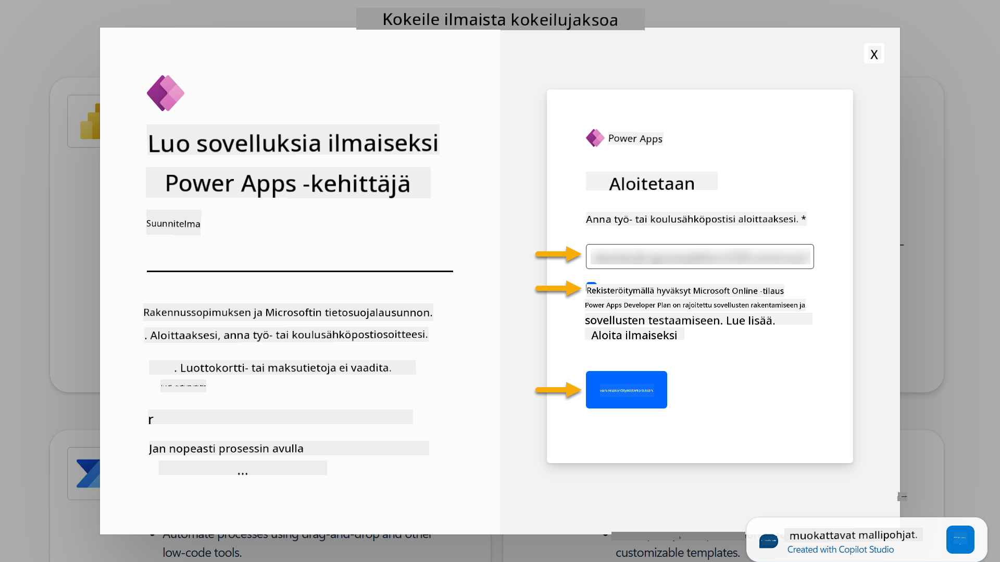

1. Kun olet rekisteröitynyt Developer Plan -suunnitelmaan, sinut ohjataan [Power Apps](https://make.powerapps.com/)-sivustolle. Ympäristö käyttää nimeäsi, esimerkiksi **Adele Vancen ympäristö**. Jos ympäristö on jo olemassa samalla nimellä, uusi kehitysympäristö nimetään **Adele Vancen (1)** ympäristöksi.

    Käytä tätä kehitysympäristöä Copilot Studiossa, kun suoritat harjoituksia.

!!! Note
    Jos käytät olemassa olevaa Microsoft 365 -tiliä etkä luonut uutta vaiheessa 1, esimerkiksi omaa tiliäsi työorganisaatiossasi, IT-järjestelmänvalvojasi (tai vastaava) tiimi, joka hallinnoi vuokralaistasi/ympäristöjäsi, on saattanut poistaa rekisteröintiprosessin käytöstä. Tässä tapauksessa ota yhteyttä järjestelmänvalvojaan tai luo testivuokralainen vaiheessa 1 kuvatulla tavalla.

---

## Vaihe 4: Luo uusi SharePoint-sivusto

Uusi SharePoint-sivusto täytyy luoda, ja sitä käytetään [Oppitunnilla 06 - Luo mukautettu agentti keskustelukokemuksen avulla Copilotilla ja yhdistä se dataasi](../06-create-agent-from-conversation/README.md#62-add-an-internal-knowledge-source-using-a-sharepoint-site).

1. Valitse Microsoft Copilot Studion vasemmasta yläkulmasta vohvelikuvake nähdäksesi valikon. Valitse valikosta SharePoint.

    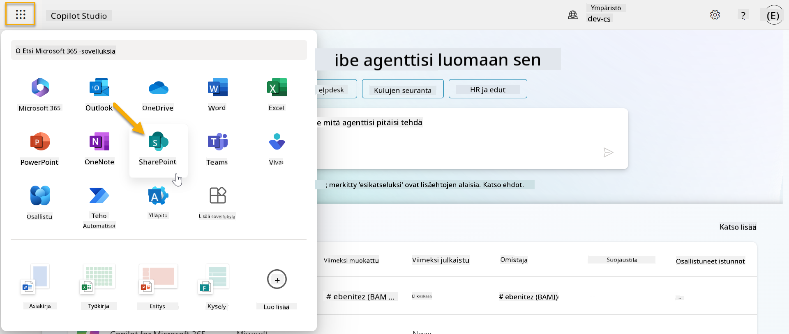

1. SharePoint latautuu. Valitse **+ Luo sivusto** luodaksesi uuden SharePoint-sivuston.

    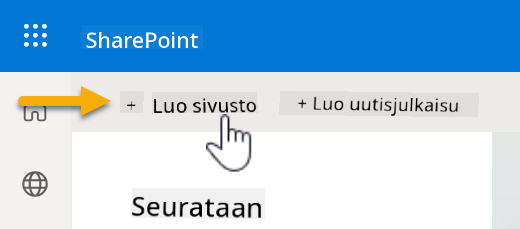

1. Näyttöön tulee valintaikkuna, joka ohjaa sinua uuden SharePoint-sivuston luomisessa. Valitse **Tiimisivusto**.

    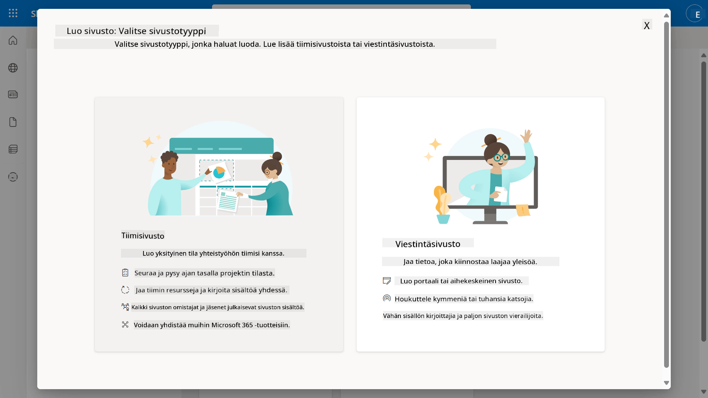

1. Seuraavassa vaiheessa Microsoftin malliluettelo latautuu oletuksena. Vieritä alas ja valitse **IT-tukipalvelu** -malli.

    

1. Valitse **Käytä mallia** luodaksesi uuden SharePoint-sivuston IT-tukipalvelu-mallin avulla.

    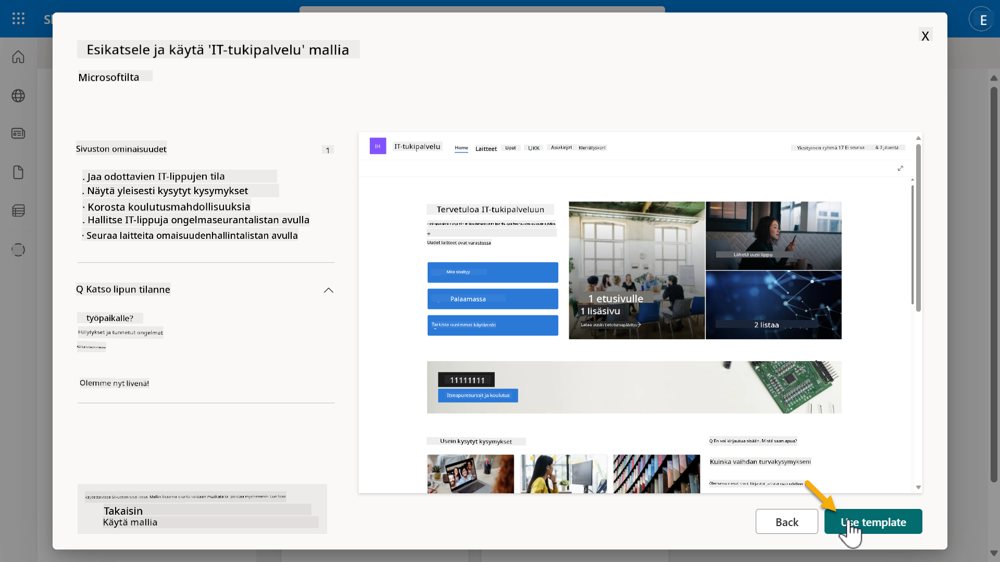

1. Syötä sivustosi tiedot. Esimerkki:

    | Kenttä | Arvo |
    | --- | --- |
    | Sivuston nimi | Contoso IT |
    | Sivuston kuvaus | Copilot Studio aloittelijoille |
    | Sivuston osoite | ContosoIT |

    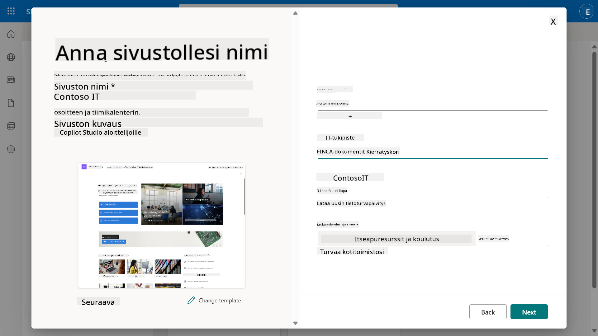

1. Viimeisessä vaiheessa voit valita kielen SharePoint-sivustolle. Oletuksena kieli on **englanti**. Jätä kieli **englanniksi** ja valitse **Luo sivusto**.

    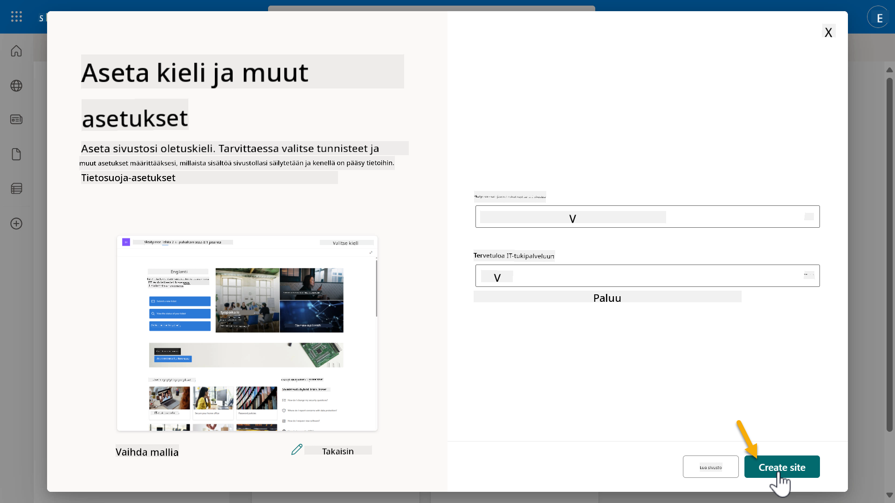

1. SharePoint-sivusto luodaan muutamassa sekunnissa. Voit halutessasi lisätä muita käyttäjiä sivustollesi syöttämällä heidän sähköpostiosoitteensa **Lisää jäseniä** -kenttään. Kun olet valmis, valitse **Valmis**.

    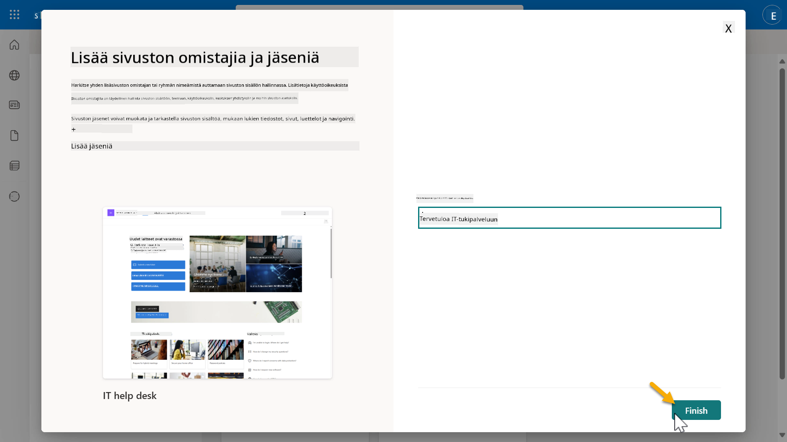

1. SharePoint-sivuston etusivu latautuu seuraavaksi. **Kopioi** SharePoint-sivuston URL-osoite.

1. Tämä malli tarjoaa sivuja, joissa on esimerkkitietoja eri IT-käytännöistä, sekä kaksi esimerkkiluetteloa (Tickets ja Devices).

### Käytä Devices SharePoint -luetteloa

Käytämme **Devices**-luetteloa [Tehtävässä 07 - Lisää uusi aihe laukaisimella ja solmuilla](../07-add-new-topic-with-trigger/README.md#73-add-a-tool-using-a-connector).

### Lisää uusi sarake

Vieritä luettelon oikeaan reunaan ja valitse **+ Lisää sarake** -painike. Valitse **hyperlinkki**-tyyppi, syötä sarakkeen nimeksi **Kuva** ja valitse lisää.

### Luo esimerkkitietoja Devices SharePoint -luetteloon

Varmista, että täytät tämän luettelon vähintään neljällä esimerkkitietokohteella ja lisäät yhden lisäsarakkeen tähän luetteloon.  

Kun lisäät esimerkkitietoja, varmista, että seuraavat kentät täytetään:

- Laitteen kuva - käytä kuvia [laitteiden kuvat -kansiosta](https://github.com/microsoft/agent-academy/tree/main/docs/recruit/00-course-setup/images/device-images)  
- Otsikko  
- Tila  
- Valmistaja  
- Malli  
- Omaisuustyyppi  
- Väri  
- Sarjanumero  
- Ostopäivä  
- Ostohinta  
- Tilausnumero  
- Kuva - käytä seuraavia linkkejä  

|Laite  |URL  |
|---------|---------|
|Surface Laptop 13     | [https://raw.githubusercontent.com/microsoft/agent-academy/refs/heads/main/docs/recruit/00-course-setup/images/device-images/Surface-Laptop-13.png](https://raw.githubusercontent.com/microsoft/agent-academy/refs/heads/main/docs/recruit/00-course-setup/images/device-images/Surface-Laptop-13.png)        |
|Surface Laptop 15     | [https://raw.githubusercontent.com/microsoft/agent-academy/refs/heads/main/docs/recruit/00-course-setup/images/device-images/Surface-Laptop-15.png](https://raw.githubusercontent.com/microsoft/agent-academy/refs/heads/main/docs/recruit/00-course-setup/images/device-images/Surface-Laptop-15.png)        |
|Surface Pro    | [https://raw.githubusercontent.com/microsoft/agent-academy/refs/heads/main/docs/recruit/00-course-setup/images/device-images/Surface-Pro-12.png](https://raw.githubusercontent.com/microsoft/agent-academy/refs/heads/main/docs/recruit/00-course-setup/images/device-images/Surface-Pro-12.png)        |
|Surface Studio    | [https://raw.githubusercontent.com/microsoft/agent-academy/refs/heads/main/docs/recruit/00-course-setup/images/device-images/Surface-Studio.png](https://raw.githubusercontent.com/microsoft/agent-academy/refs/heads/main/docs/recruit/00-course-setup/images/device-images/Surface-Studio.png)        |

---

## ✅ Tehtävä suoritettu

Olet onnistuneesti:

- Luonut Microsoft 365 -kehitysympäristön  
- Aktivoinut Copilot Studio -kokeilujakson  
- Luonut SharePoint-sivuston agenttien pohjustamista varten  
- Täyttänyt Devices-luettelon tulevia tehtäviä varten  

Olet virallisesti valmis aloittamaan **rekrytointitason agenttikoulutuksen** [Oppitunnilla 01](../01-introduction-to-agents/README.md).  

<!-- markdownlint-disable-next-line MD033 -->

---

**Vastuuvapauslauseke**:  
Tämä asiakirja on käännetty käyttämällä tekoälypohjaista käännöspalvelua [Co-op Translator](https://github.com/Azure/co-op-translator). Vaikka pyrimme tarkkuuteen, huomioithan, että automaattiset käännökset voivat sisältää virheitä tai epätarkkuuksia. Alkuperäinen asiakirja sen alkuperäisellä kielellä tulisi pitää ensisijaisena lähteenä. Kriittisen tiedon osalta suositellaan ammattimaista ihmiskäännöstä. Emme ole vastuussa väärinkäsityksistä tai virhetulkinnoista, jotka johtuvat tämän käännöksen käytöstä.