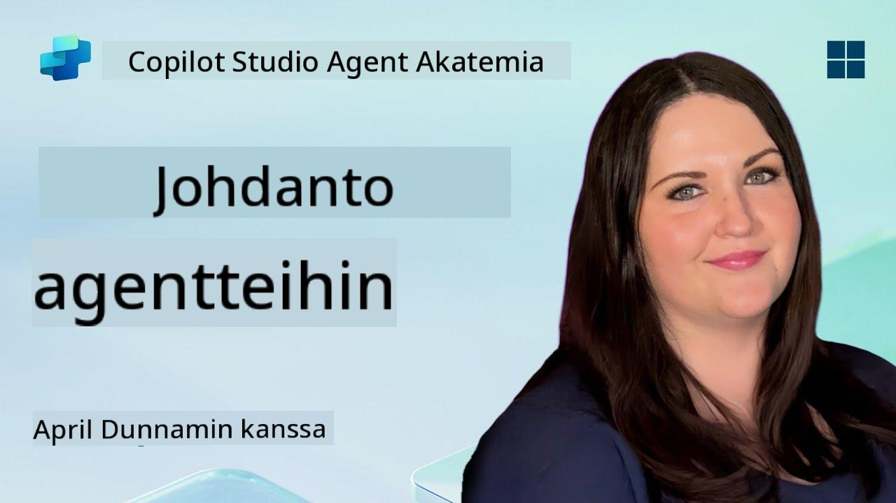

<!--
CO_OP_TRANSLATOR_METADATA:
{
  "original_hash": "d6706e107678264168d77b2e107710b1",
  "translation_date": "2025-10-17T01:36:52+00:00",
  "source_file": "docs/recruit/01-introduction-to-agents/README.md",
  "language_code": "fi"
}
-->
# 🚨 Tehtävä 01: Johdatus agenteihin

## 🕵️‍♂️ KOODINIMI: `OPERATION AI AGENT DECODE`

> **⏱️ Operaatioaika:** `~30 minuuttia – vain tiedustelua, ei kenttätyötä`

🎥 **Katso opastusvideo**

## 🎯 Tehtävän kuvaus

Tervetuloa, rekrytoitu. Ennen kuin sukellamme agenttien rakentamiseen, sinun on ymmärrettävä hyvin AI-konseptit, jotka niitä ohjaavat. Tämä tehtävä antaa sinulle perustiedot keskustelupohjaisesta tekoälystä, suurista kielimalleista (LLM), hakuun perustuvasta generoinnista (RAG) ja Copilot Studion tarjoamista agenttityypeistä.

## 🔎 Tavoitteet

Tässä tehtävässä opit:

1. Mitä keskustelupohjainen tekoäly on ja miksi se on tärkeää  
1. Kuinka suuret kielimallit (LLM) ohjaavat keskustelukokemuksia  
1. Mitä hakuun perustuva generointi (RAG) tuo mukanaan  
1. Ero keskustelupohjaisten ja autonomisten agenttien välillä  
1. Kuinka Copilot Studion agentit hyödyntävät näitä konsepteja  

Aloitetaan!

---

## Mitä on keskustelupohjainen tekoäly?

Keskustelupohjainen tekoäly viittaa järjestelmään, joka ymmärtää, käsittelee ja vastaa ihmisen kieleen – olipa kyseessä teksti tai puhe – luonnollisella tavalla. Ajattele esimerkiksi asiakaspalveluchatbotteja tai virtuaalisia henkilökohtaisia avustajia suosikkisovelluksissasi. Kulissien takana useimmat modernit keskustelupohjaiset tekoälyt perustuvat suuriin kielimalleihin (LLM), joista puhumme seuraavaksi.

### Miksi se on tärkeää

- **Käyttäjäkokemus:** Keskustelupohjaiset käyttöliittymät ovat usein intuitiivisempia kuin valikoiden läpi klikkailu.  
- **Skaalautuvuus:** Yksi agentti voi käsitellä kymmeniä tai satoja samanaikaisia keskusteluja.  
- **Tehokkuus:** Sen sijaan, että rakennettaisiin räätälöityjä sääntöpohjaisia skriptejä, LLM-pohjaiset agentit mukautuvat käyttäjän syötteisiin lennossa.  
- **Laajennettavuus:** Oikein suunniteltuina agentit voivat hyödyntää tietokantoja, yhdistyä API:hin tai toimia "digitaalisina työtovereina" liiketoimintaprosesseissa.

---

## Suuret kielimallit (LLM) 101

Useimpien keskustelupohjaisten tekoälyjärjestelmien ytimessä ovat **suuret kielimallit** – neuroverkot, jotka on koulutettu valtavilla tekstiaineistoilla. Ne oppivat kielen tilastolliset mallit, jotta ne voivat tuottaa johdonmukaisia lauseita, vastata kysymyksiin tai jopa ideoida. Keskeiset asiat, jotka kannattaa ymmärtää:

1. **Koulutusdata:** LLM:t käsittelevät teratavuja tekstiä (verkkosivuja, kirjoja, artikkeleita). Tämä "maailmantieto" mahdollistaa vastaukset moniin aiheisiin.  
1. **Tokenisointi:** Teksti jaetaan pienempiin yksiköihin, joita kutsutaan tokeneiksi (sanoja, osasanoja tai merkkejä). Malli ennustaa yhden tokenin kerrallaan.  
1. **Kontekstinäkymä:** Jokaisella LLM:llä on rajoitus, kuinka monta tokenia se voi "nähdä" kerralla. Tämän rajan yli menevät tokenit katkaistaan.  
1. **Promptaus:** LLM:ään kommunikoidaan lähettämällä sille kehotus. Mitä parempi kehotus, sitä keskittyneempi ja osuvampi vastaus.  
1. **Zero-shot vs. Fine-tuning:** Zero-shot tarkoittaa LLM:n käyttöä sellaisenaan (vain raakapainot). Fine-tuning tarkoittaa mallin säätämistä alakohtaisella datalla, jotta se vastaa tarkemmin tarpeisiisi.

!!! Tip "Vinkki"
    Yleinen vertauskuva on, että LLM on kuin "superälykäs automaattinen täydennys". Se ei oikeasti ymmärrä merkitystä kuten ihmisaivot, mutta se on erittäin hyvä ennustamaan seuraavaa parasta sanaa (tai fraasia) sekvenssissä.

---

## Hakuun perustuva generointi (RAG)

Kun LLM:t luottavat pelkästään staattiseen koulutusdataan, ne voivat tuottaa virheellistä tietoa tai vanhentua. RAG ratkaisee tämän antamalla mallin "etsiä" tuoretta tietoa ennen vastauksen muodostamista. Yleisesti ottaen RAG toimii näin:

1. **Käyttäjän kysely:** Käyttäjä esittää kysymyksen (esim. "Mitä uutta Contoson neljännesvuosikatsauksessa?").  
1. **Hakuvaihe:** Järjestelmä etsii tietolähteestä (dokumentit, sisäiset tietokannat, SharePoint-kirjastot jne.) relevantteja kohtia.  
1. **Täydennys:** Haetut kohdat lisätään LLM-kehotukseen joko alkuun tai loppuun.  
1. **Generointi:** LLM käsittelee sekä käyttäjän kysymyksen että haetun kontekstin ja tuottaa vastauksen, joka perustuu ajankohtaiseen dataan.  

RAG:n avulla agenttisi voi käyttää sisäisiä yrityksen wikejä, plugin-API:ita tai etsiä tietoa FAQ-tietokannasta – ja antaa vastauksia, jotka eivät rajoitu staattisiin malliparametreihin.

---

## Keskustelupohjaiset vs. autonomiset agentit

Copilot Studiossa termi **agentti** voi viitata monenlaisiin tekoälyavustajiin. On hyödyllistä erottaa toisistaan:

**Keskustelupohjaiset agentit:**

- Keskittyvät ensisijaisesti kaksisuuntaiseen vuoropuheluun.  
- Säilyttävät kontekstin keskustelun useiden vaiheiden ajan.  
- Yleensä ohjataan ennalta määritellyillä kulku- tai laukaisusäännöillä (esim. "Jos käyttäjä sanoo X, vastaa Y").  
- Sopivat asiakastukeen, usein kysyttyihin kysymyksiin, ohjattuihin vuorovaikutuksiin, ajanvarauksiin tai yksinkertaiseen kysymys-vastaus -toimintaan.  
  - Esimerkkejä:  
    - Teams-chatbot, joka vastaa HR-politiikkaa koskeviin kysymyksiin.  
    - Power Virtual Agents -botti SharePoint-sivulla, joka ohjaa käyttäjiä lomakkeen täyttämisessä.  

**Autonomiset agentit:**

- Menevät pidemmälle kuin pelkkä keskustelu; ne voivat **suorittaa toimia** käyttäjän puolesta.  
- Käyttävät LLM:n päättelysilmukoita (ajattele "suunnittele → toimi → havainnoi → suunnittele uudelleen") tehtävien suorittamiseen.  
- Yhdistyvät ulkoisiin työkaluihin tai API:ihin (esim. käynnistävät Power Automate -prosessin, lähettävät kalenterikutsuja, käsittelevät dataa Dataversessa).  
- Toimivat ilman jatkuvaa ihmisen ohjausta – kun ne käynnistetään, ne voivat hoitaa monivaiheisia prosesseja itsenäisesti.  
  - Esimerkkejä:  
    - Agentti, joka luo matkasuunnitelman, varaa lennot ja lähettää vahvistukset sähköpostitse.  
    - "Kokouksen tiivistelijä" -agentti, joka liittyy Teams-puheluun, litteroi sen reaaliajassa ja kirjoittaa johtopäätöksen OneNoteen.  

!!! Info "Keskeinen ero"
    Keskustelupohjaiset agentit odottavat käyttäjän syötettä ja keskittyvät vuoropuheluun. Autonomiset agentit suunnittelevat ja toteuttavat itsenäisesti useita vaiheita laajempien työkalujen avulla.

---

## Agentit Copilot Studiossa

**Copilot Studio** yhdistää sekä keskustelupohjaiset että autonomiset skenaariot yhdeksi kokonaisuudeksi. Näin Copilot Studio auttaa sinua rakentamaan agentteja:

1. **Visuaalinen agenttisuunnittelija:** Low-code-työkalu, jolla voit määritellä kehotuksia, muistia ja työkaluja sekä keskustelu- että toimintatyönkuluille.  
1. **LLM-konfiguraatiot:** Valitse eri OpenAI-mallien tai Microsoftin yritystason GPT:n välillä suorituskyvyn ja kustannusten mukaan.  
1. **Hakuliitännät:** Valmiit integraatiot SharePointiin, OneDriveen, Azure Cognitive Searchiin ja Dataverseen, jotka mahdollistavat RAG:n käytön heti.  
1. **Mukautetut työkalut ja toiminnot:** Määritä mukautettuja HTTP-toimintoja tai Power Automate -prosesseja, joita agenttisi voi käyttää itsenäisesti.  
1. **Monimuotoinen tuki:** Tekstin lisäksi Copilot Studion agentit voivat käsitellä kuvia, tiedostoja tai jäsenneltyä dataa kontekstin rikastamiseksi.  
1. **Julkaisu ja jakelu:** Kun agenttisi on valmis, voit julkaista sen Microsoft 365 Copilotiin (jotta käyttäjät voivat käyttää sitä Teamsissa, SharePointissa, Outlookissa jne.) tai upottaa sen itsenäisenä chat-widgetinä verkkosivulle.

---

## 🎉 Tehtävä suoritettu

Olet nyt suorittanut johdannon agentteihin ja perustavanlaatuiset AI-konseptit. Ymmärrät:

1. **LLM:t = Agenttisi "aivot"**  
   - Vastuussa kielen ymmärtämisestä ja tuottamisesta.  
   - Enemmän tokeneita = rikkaampi konteksti, mutta myös korkeammat kustannukset per kutsu.  

1. **RAG = Reaaliaikainen tiedon integrointi**  
   - Kuromalla umpeen staattisen LLM:n ja jatkuvasti muuttuvien tietolähteiden välistä kuilua.  
   - Hakee ja lisää relevantteja dokumentteja tai tietueita LLM-kehotukseen.  

1. **Keskustelupohjaiset vs. autonomiset**  
   - **Keskustelupohjaiset:** Keskittyvät vuoropuhelun kulkuun ja kontekstin säilyttämiseen (esim. "istuntomuisti").  
   - **Autonomiset:** Lisäävät "toimintolohkoja", joiden avulla agentti voi käyttää ulkoisia työkaluja tai palveluita.

---
Seuraavaksi tutustut [Copilot Studion perusteisiin](../02-copilot-studio-fundamentals/README.md)!

Pysy valppaana, rekrytoitu – AI-matkasi on vasta alussa!

## 📚 Taktiset resurssit

🔗 [Copilot Studion dokumentaation etusivu](https://learn.microsoft.com/microsoft-copilot-studio/)

---

<!-- markdownlint-disable-next-line MD033 -->

---

**Vastuuvapauslauseke**:  
Tämä asiakirja on käännetty käyttämällä tekoälypohjaista käännöspalvelua [Co-op Translator](https://github.com/Azure/co-op-translator). Vaikka pyrimme tarkkuuteen, huomioithan, että automaattiset käännökset voivat sisältää virheitä tai epätarkkuuksia. Alkuperäinen asiakirja sen alkuperäisellä kielellä tulisi pitää ensisijaisena lähteenä. Kriittisen tiedon osalta suositellaan ammattimaista ihmiskäännöstä. Emme ole vastuussa väärinkäsityksistä tai virhetulkinnoista, jotka johtuvat tämän käännöksen käytöstä.