<!--
CO_OP_TRANSLATOR_METADATA:
{
  "original_hash": "0c51aabca81d6256990caf4c015e6195",
  "translation_date": "2025-10-17T01:29:11+00:00",
  "source_file": "docs/recruit/04-creating-a-solution/README.md",
  "language_code": "fi"
}
-->
# 🚨 Tehtävä 04: Ratkaisun luominen agentillesi

## 🕵️‍♂️ KÄYTTÖKOODI: `OPERATION CTRL-ALT-PACKAGE`

> **⏱️ Operaatioaika:** `~45 minuuttia`

🎥 **Katso opastusvideo**

[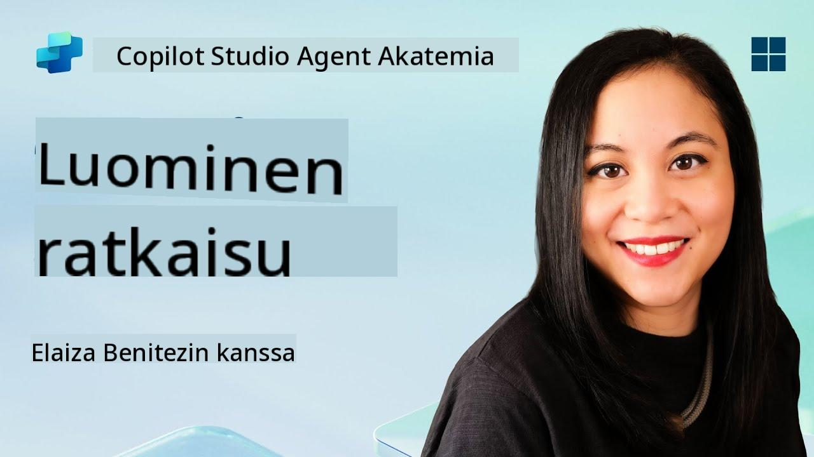](https://www.youtube.com/watch?v=1iATbkgfcpU "Katso opastus YouTubessa")

## 🎯 Tehtävän kuvaus

Agentin luoja, tervetuloa seuraavaan taktiseen operaatioon. Tässä tehtävässä opit kokoamaan ratkaisun – virallisen käyttöönottoalustan IT-tukipalveluagentillesi, joka on rakennettu Microsoft Copilot Studiossa. Ajattele tätä digitaalisena salkkuna, joka sisältää agenttisi ja sen artefaktit.

Jokainen agentti tarvitsee hyvin rakennetun kodin. Juuri sitä Power Platform -ratkaisu tarjoaa – järjestystä, siirrettävyyttä ja valmiutta tuotantoon.

Aloitetaan pakkaaminen.

## 🔎 Tavoitteet

Tässä tehtävässä opit:

1. Ymmärtämään, mitä Power Platform -ratkaisut ovat ja niiden roolin agenttien kehityksessä
1. Oppimaan ratkaisujen käytön hyödyt agenttien organisoinnissa ja käyttöönotossa
1. Tutustumaan ratkaisujen julkaisijoihin ja niiden merkitykseen komponenttien hallinnassa
1. Ymmärtämään Power Platform -ratkaisun elinkaarta kehityksestä tuotantoon
1. Luomaan oman ratkaisun julkaisijan ja mukautetun ratkaisun IT-tukipalveluagentillesi

## 🕵🏻‍♀️ Mikä on ratkaisu?

Microsoft Power Platformissa ratkaisut ovat kuin säiliöitä tai paketteja, jotka sisältävät kaikki sovellustesi tai agenttiesi osat – nämä voivat olla taulukoita, lomakkeita, työnkulkuja ja mukautettua logiikkaa. Ratkaisut ovat välttämättömiä sovellusten elinkaaren hallinnassa (ALM), sillä niiden avulla voit hallita sovellustasi ja agenttejasi ideasta kehitykseen, testaukseen, käyttöönottoon ja päivityksiin.

Copilot Studiossa jokainen luomasi agentti tallennetaan Power Platform -ratkaisuun. Oletuksena agentit luodaan oletusratkaisuun, ellei luoda uutta mukautettua ratkaisua agentin luomista varten. Tätä opimme 🤓 tässä oppitunnissa ja käytännön laboratoriossa.

Ratkaisut on perinteisesti luotu **Power Apps -kehittäjäportaalissa** – verkkopohjaisessa käyttöliittymässä, jossa voit rakentaa ja mukauttaa sovelluksia, Dataverse-taulukoita, työnkulkuja, tutkia tekoälykomponentteja ja paljon muuta.

   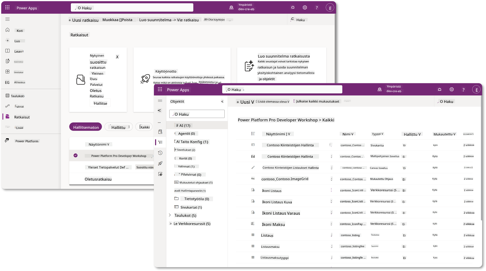

Copilot Studiossa on nyt **Solution Explorer**, jossa voit hallita ratkaisuja suoraan. Sinun ei enää tarvitse siirtyä Power Apps -kehittäjäportaaliin hallitaksesi ratkaisuja, vaan se onnistuu suoraan Copilot Studiossa 🪄

Tämä tarkoittaa, että voit tehdä tavallisia ratkaisuihin liittyviä tehtäviä:

- **Luo ratkaisu** – mukautetut ratkaisut mahdollistavat agenttien viennin ja tuonnin ympäristöjen välillä.
- **Aseta suosikkiratkaisu** – valitse ratkaisu, johon agentit, sovellukset jne. luodaan oletuksena.
- **Lisää tai poista komponentteja** – agenttisi voi viitata muihin komponentteihin, kuten ympäristömuuttujiin tai pilvityönkulkuihin. Näin ollen nämä komponentit on sisällytettävä ratkaisuun.
- **Vie ratkaisuja** – siirrä ratkaisuja toiseen kohdeympäristöön.
- **Tuo ratkaisuja** – tuo muualla luotuja ratkaisuja, mukaan lukien ratkaisujen päivittäminen tai päivittäminen.
- **Luo ja hallitse ratkaisuputkia** – automatisoi ratkaisujen käyttöönotto ympäristöjen välillä.
- **Git-integraatio** – mahdollistaa kehittäjien yhdistää ratkaisut Git-repositorioihin versionhallintaa, yhteistyötä ja ALM:ää varten. Tarkoitettu käytettäväksi vain kehitysympäristöissä.

   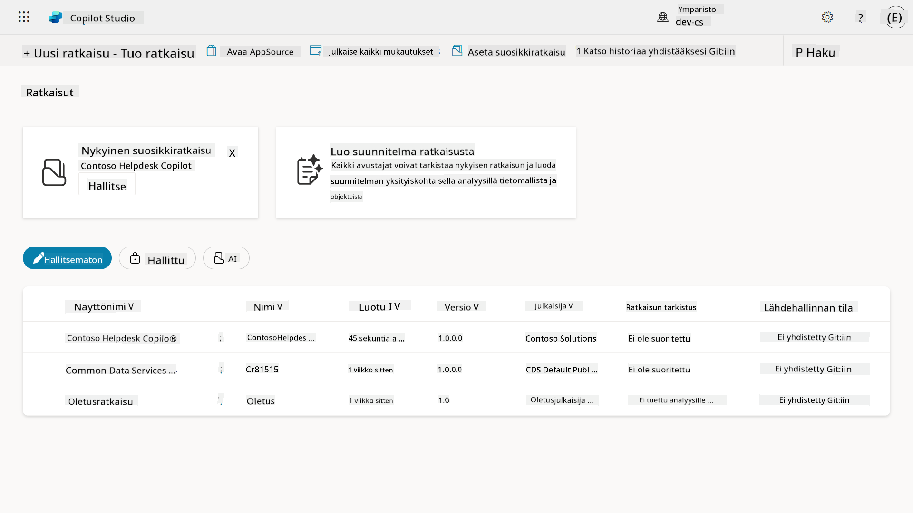

Ratkaisuja on kahdenlaisia:

- **Hallitsemattomat ratkaisut** – käytetään kehityksen aikana. Voit vapaasti muokata ja mukauttaa tarpeen mukaan.
- **Hallitut ratkaisut** – käytetään, kun sovellus on valmis testaukseen tai tuotantoon. Nämä ovat lukittuja estämään tahattomat muutokset.

## 🤔 Miksi _pitäisi_ käyttää ratkaisua agentilleni?

Ajattele ratkaisuja _työkalupakkina_. Kun sinun täytyy korjata tai rakentaa jotain (agentti) eri sijainnissa (ympäristö), keräät kaikki tarvittavat työkalut (komponentit) ja laitat ne työkalupakkiin (ratkaisu). Voit sitten kuljettaa tämän työkalupakin uuteen sijaintiin (ympäristöön) ja käyttää työkaluja (komponentteja) työsi suorittamiseen tai lisätä uusia työkaluja (komponentteja) mukauttaaksesi agenttiasi tai projektiasi.

!!! quote "Elaiza, ystävällinen pilvilähettiläsi, täällä jakamassa ajatuksia 🙋🏻‍♀️:"
    Meillä Uudessa-Seelannissa on sanonta "Ole siisti kiivi!", joka kehottaa Uuden-Seelannin asukkaita 🥝 huolehtimaan ympäristöstään heittämällä roskat asianmukaisesti ja pitämällä julkiset tilat siisteinä. Voimme käyttää samaa ajatusta agenteille pitämällä kaikki agenttiisi liittyvä järjestettynä ja siirrettävänä, mikä auttaa sinua ylläpitämään siistiä ympäristöä.

On hyvä käytäntö luoda agentti omassa ratkaisussa lähdeympäristössä (kehittäjäympäristössä). Tässä syitä, miksi ratkaisut ovat arvokkaita:

🧩 **Järjestelmällinen kehitys**

- Pidät agenttisi erillään oletusratkaisusta, joka sisältää kaiken ympäristössä. Kaikki agenttisi komponentit ovat yhdessä paikassa 🎯

- Kaikki, mitä tarvitset agentillesi, on ratkaisussa, mikä tekee sen viemisestä ja tuomisesta kohdeympäristöön helpompaa 👉🏻 tämä on terveellinen ALM-tapa.

🧩 **Turvallinen käyttöönotto**

- Voit viedä sovelluksesi tai agenttisi hallittuna ratkaisuna ja ottaa sen käyttöön muissa kohdeympäristöissä (kuten testauksessa tai tuotannossa) ilman riskiä tahattomista muokkauksista.

🧩 **Versionhallinta**

- Voit luoda korjauksia (kohdennettuja korjauksia), päivityksiä (laajempia muutoksia) tai päivityksiä (ratkaisun korvaaminen – yleensä suuria muutoksia ja uusien ominaisuuksien lisäämistä).

- Auttaa ottamaan muutokset käyttöön hallitusti.

🧩 **Riippuvuuksien hallinta**

- Ratkaisut seuraavat, mitkä osat ovat riippuvaisia toisistaan. Tämä estää sinua rikkomasta asioita, kun teet muutoksia.

🧩 **Tiimityö**

- Kehittäjät ja tekijät voivat työskennellä yhdessä hallitsemattomien ratkaisujen parissa kehitysvaiheessa ja siirtää sitten hallitun ratkaisun käyttöönottoa varten.

## 🪪 Ratkaisujen julkaisijoiden ymmärtäminen

Power Platformin ratkaisujen julkaisija on kuin etiketti tai brändi, joka tunnistaa, kuka on luonut tai omistaa ratkaisun. Se on pieni mutta tärkeä osa sovellusten, agenttien ja työnkulkujen mukautusten hallintaa, erityisesti tiimityössä tai ympäristöjen välillä.

Kun luot ratkaisun, sinun täytyy valita julkaisija. Tämä julkaisija määrittää:

- Etuliitteen, joka lisätään kaikkiin mukautettuihin komponentteihin (kuten taulukot, kentät ja työnkulut).

- Nimen ja yhteystiedot organisaatiolle tai henkilölle, joka omistaa ratkaisun.

### 🤔 Miksi se on tärkeää?

1. **Helppo tunnistus** – etuliite (esim. `new_` tai `abc_`) auttaa nopeasti tunnistamaan, mitkä komponentit kuuluvat mihinkin ratkaisuun tai tiimiin.

1. **Välttää ristiriidat** – jos kaksi tiimiä luo sarakkeen nimeltä status, niiden etuliitteet (`teamA_status`, `teamB_status`) estävät nimien törmäykset.

1. **Tukee ALM:ää** – kun ratkaisuja siirretään ympäristöjen välillä (Kehitys → Testaus → Tuotanto), julkaisija auttaa seuraamaan omistajuutta ja ylläpitämään johdonmukaisuutta.

### ✨ Esimerkki

Oletetaan, että luot julkaisijan nimeltä Contoso Solutions, jonka etuliite on `cts_`.

Jos lisäät mukautetun sarakkeen nimeltä _Priority_, se tallennetaan nimellä `cts_Priority` ratkaisuun.

Kuka tahansa, joka näkee sarakkeen ratkaisutasolla riippumatta siitä, missä ympäristössä he ovat, voi helposti tunnistaa sen sarakkeeksi, joka liittyy Contoso Solutionsiin.

## 🧭 Power Platform -ratkaisun elinkaari

Nyt kun ymmärrät ratkaisun tarkoituksen, opitaan seuraavaksi sen elinkaari.

**1. Luo ratkaisu kehitysympäristössä** – aloita luomalla uusi ratkaisu kehitysympäristössäsi.

**2. Lisää komponentteja** – lisää sovelluksia, työnkulkuja, taulukoita ja muita elementtejä ratkaisuusi.

**3. Vie hallittuna ratkaisuna** – pakkaa ratkaisusi käyttöönottoa varten viemällä se hallittuna ratkaisuna.

**4. Tuo testausympäristöön** – testaa ratkaisusi erillisessä testausympäristössä varmistaaksesi, että kaikki toimii odotetusti.

**5. Tuo tuotantoympäristöön** – ota testattu ratkaisu käyttöön live-tuotantoympäristössä.

**6. Tee korjauksia, päivityksiä tai päivityksiä** – paranna tai korjaa ratkaisua korjauksilla, päivityksillä tai päivityksillä. 🔁 Toista sykli!

### ✨ Esimerkki

Kuvittele, että rakennat IT-tukipalveluagenttia auttamaan työntekijöitä ongelmissa, kuten laiteongelmissa, verkon vianetsinnässä, tulostimen asennuksessa ja muussa.

- Aloitat kehitysympäristössä käyttämällä hallitsematonta ratkaisua.

- Kun se on valmis, viet sen hallittuna ratkaisuna ja tuot sen kohdeympäristöön, kuten järjestelmätestaukseen tai käyttäjähyväksyntätestaukseen (UAT).

- Testauksen jälkeen siirrät sen tuotantoympäristöön – koskematta alkuperäiseen kehitysversioon.

## 🧪 Laboratorio 04: Luo uusi ratkaisu

Nyt opimme

- [4.1 Kuinka luoda ratkaisun julkaisija](../../../../../docs/recruit/04-creating-a-solution)
- [4.2 Kuinka luoda ratkaisu](../../../../../docs/recruit/04-creating-a-solution)

Pysymme aiemmassa esimerkissä, jossa luomme ratkaisun omistetussa Copilot Studio -ympäristössä IT-tukipalveluagentin rakentamista varten.

Aloitetaan!

### Esivaatimukset

#### Turvarooli

Copilot Studiossa se, mitä _voit tehdä_ ratkaisunhallinnassa, riippuu käyttäjän turvaroolista.
Jos sinulla ei ole lupaa hallita ratkaisuja Power Apps -hallintakeskuksessa, et voi tehdä näitä tehtäviä Copilot Studiossa.

Varmista, että sinulla on oikeat turvaroolit ja luvat, jotta kaikki sujuu sujuvasti. Jos et hallinnoi ympäristöjä organisaatiossasi, kysy IT-järjestelmänvalvojalta (tai vastaavalta) tiimiltä, joka hallinnoi vuokraajaa/ympäristöjä.

Seuraavat turvaroolit mahdollistavat käyttäjien luoda ratkaisun ympäristössään.

| Turvarooli    | Kuvaus |
| ---------- | ---------- |
| Ympäristön luoja | Tarjoaa tarvittavat luvat resurssien luomiseen, mukauttamiseen ja hallintaan tietyssä ympäristössä, mukaan lukien ratkaisut  |
| Järjestelmän mukauttaja  | Laajemmat oikeudet kuin ympäristön luojalla, mukaan lukien ympäristön mukauttaminen ja turvaroolien hallinta |
| Järjestelmänvalvoja   | Korkein taso oikeuksia ja voi hallita kaikkia ympäristön osa-alueita, mukaan lukien turvaroolien luominen ja määrittäminen     |

#### Kehittäjäympäristö

Varmista, että vaihdat omistettuun kehittäjäympäristöösi. Katso [Oppitunti 00 - Kurssin aloitus - Vaihe 3: Luo uusi kehittäjäympäristö](../00-course-setup/README.md#step-3-create-new-developer-environment).

1. Valitse oikeasta yläkulmasta **hammasratas**-kuvake ja vaihda oletusympäristöstä omaan ympäristöösi, esimerkiksi **Adele Vancen ympäristöön**.

    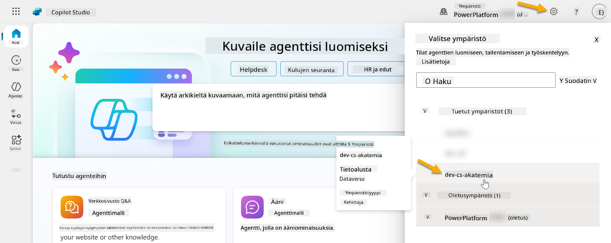

### 4.1 Luo ratkaisun julkaisija

1. Käytä samaa Copilot Studio -ympäristöä kuin edellisessä oppitunnissa. Valitse **kolmen pisteen kuvake (. . .)** Copilot Studion vasemmanpuoleisesta valikosta. Valitse **Ratkaisut** **Tutki**-otsikon alta.

    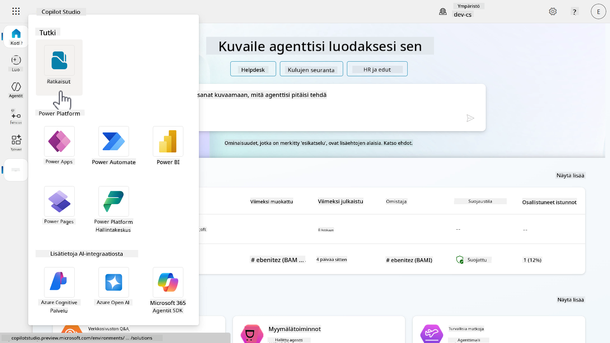

1. **Ratkaisunhallinta** Copilot Studiossa latautuu. Valitse **+ Uusi ratkaisu**

    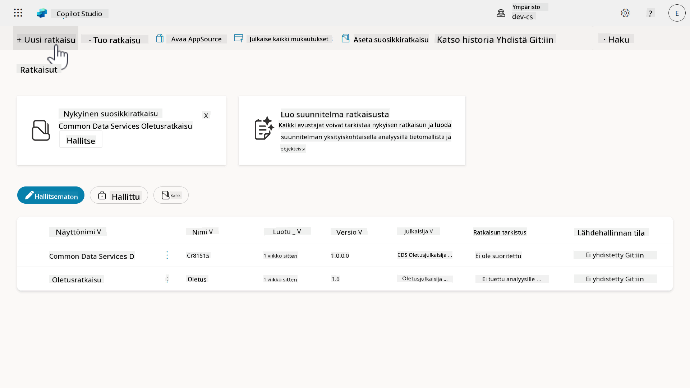

1. **Uusi ratkaisu** -paneeli ilmestyy, jossa voimme määritellä ratkaisumme tiedot. Ensin meidän täytyy luoda uusi julkaisija. Valitse **+ Uusi julkaisija**.

    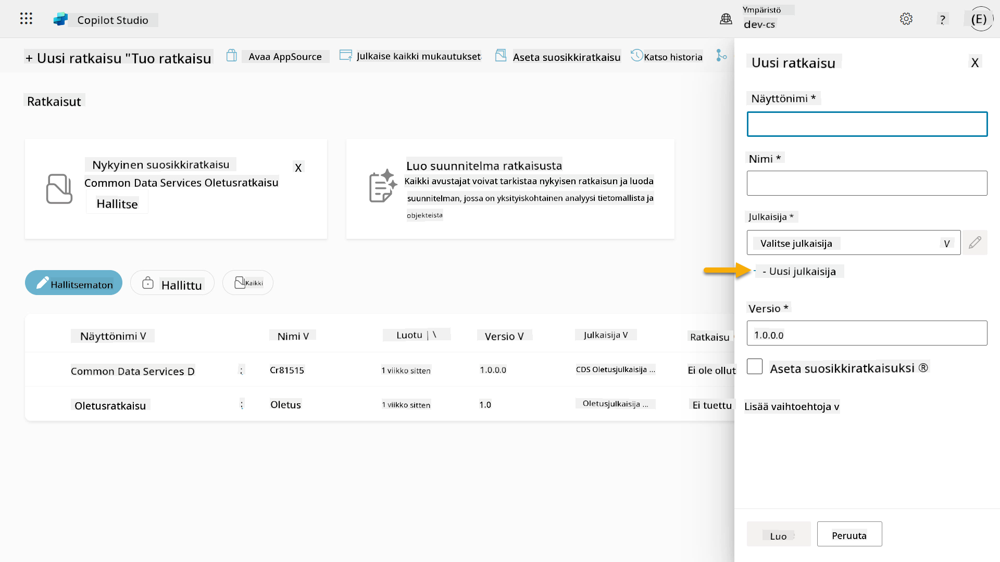  

1. **Uusi julkaisija** -paneelin **Ominaisuudet**-välilehti ilmestyy, jossa on täytettävä pakolliset ja ei-pakolliset kentät. Tässä voimme määritellä julkaisijan tiedot, joita käytetään ratkaisun luojan tai omistajan tunnistamiseen.

    | Ominaisuus    | Kuvaus | Pakollinen |
    | ---------- | ---------- | :----------: |
    | Näyttönimi | Julkaisijan näyttönimi | Kyllä   |
    | Nimi  | Julkaisijan yksilöllinen nimi ja skeemanimi  | Kyllä    |
    | Kuvaus   | Kuvaa ratkaisun tarkoituksen    | Ei     |
    | Etuliite    | Julkaisijan etuliite, joka lisätään uusiin komponentteihin   | Kyllä      |
    | Valintavaihtoehdon etuliite   | Generoi numeron julkaisijan etuliitteen perusteella. Tätä numeroa käytetään, kun lisäät vaihtoehtoja valintoihin, ja se osoittaa, mikä ratkaisu lisäsi vaihtoehdon.   | Kyllä      |

    Kopioi ja liitä seuraava **Näyttönimeksi**,

    ```text
    Contoso Solutions
    ```

    Kopioi ja liitä seuraava **Nimeksi**,

    ```text
    ContosoSolutions
    ```

    Kopioi ja liitä seuraava **Kuvaukseksi**,

    ```text
    Copilot Studio Agent Academy
    ```

    Kopioi ja liitä seuraava **Etuliitteeksi**,

    ```text
    cts
    ```

    Oletuksena **Valintavaihtoehdon** etuliite näyttää kokonaislukuarvon. Päivitä tämä kokonaisluku lähimpään tuhanteen. Esimerkiksi, jos kuvassani arvo oli alun perin `77074`, päivitä se arvoon `77000`.

    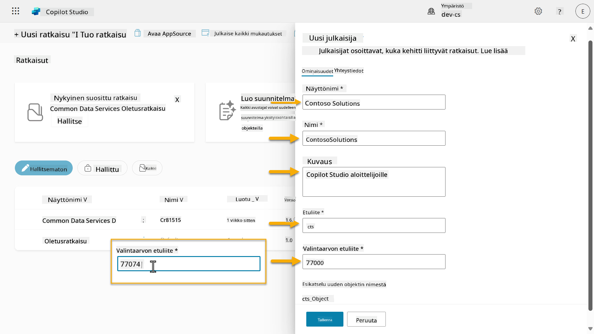  

1. Jos haluat antaa ratkaisun yhteystiedot, valitse **Yhteystiedot**-välilehti ja täytä näytetyt sarakkeet.

    

1. Valitse **Ominaisuudet**-välilehti ja valitse **Tallenna** luodaksesi julkaisijan.

    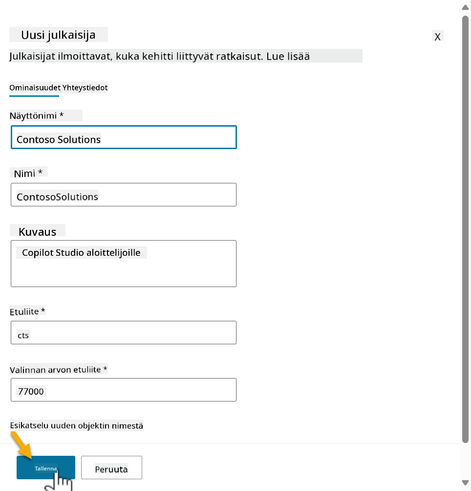
1. Uusi julkaisijan paneeli sulkeutuu ja sinut ohjataan takaisin **Uusi ratkaisu** -paneeliin, jossa juuri luotu julkaisija on valittuna.

    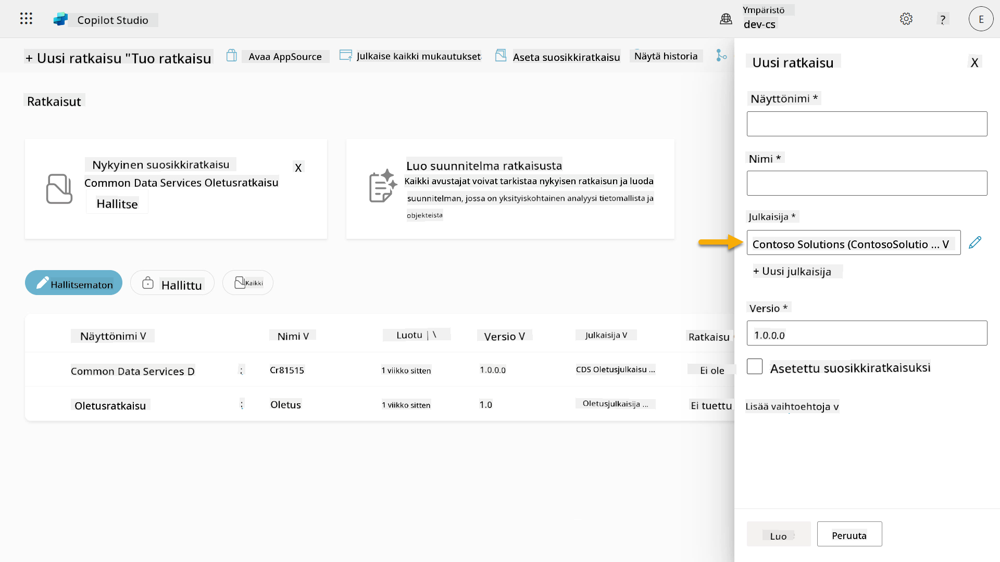  

Hyvä juttu, olet nyt luonut ratkaisujulkaisijan! 🙌🏻 Seuraavaksi opimme, kuinka luodaan uusi mukautettu ratkaisu.

### 4.2 Luo uusi ratkaisu

1. Nyt kun olemme luoneet julkaisijan, voimme täyttää loput **Uusi ratkaisu** -paneelin lomakkeesta.

    Kopioi ja liitä seuraava **Näyttönimeksi**,

    ```text
    Contoso Helpdesk Agent
    ```

    Kopioi ja liitä seuraava **Nimeksi**,

    ```text
    ContosoHelpdeskAgent
    ```

    Koska luomme uuden ratkaisun, [**Versio**-numero](https://learn.microsoft.com/power-apps/maker/data-platform/update-solutions#understanding-version-numbers-for-updates/?WT.mc_id=power-172615-ebenitez) on oletuksena `1.0.0.0`.

    Valitse **Aseta oletusratkaisuksi** -valintaruutu.

      

1. Laajenna **Lisäasetukset** nähdäksesi lisätiedot, jotka voidaan antaa ratkaisussa.

    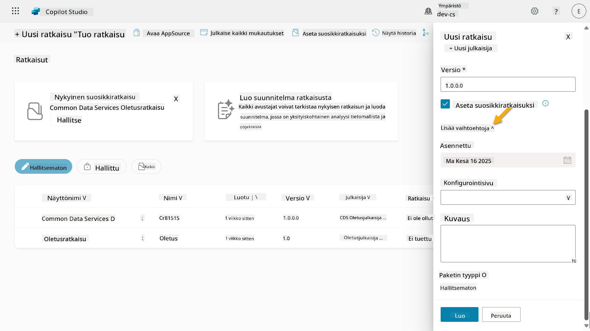

1. Näet seuraavat tiedot:

    - **Asennettu** - päivämäärä, jolloin ratkaisu asennettiin.

    - **Konfigurointisivu** - kehittäjät määrittävät HTML-verkkoresurssin, joka auttaa käyttäjiä vuorovaikuttamaan sovelluksensa, agenttinsa tai työkalunsa kanssa. Se näkyy verkkosivuna Tietosivulla ohjeiden tai painikkeiden kanssa. Tätä käyttävät yleensä yritykset tai kehittäjät, jotka rakentavat ja jakavat ratkaisuja muille.

    - **Kuvaus** - kuvaa ratkaisua tai antaa yleiskuvan konfigurointisivusta.

    Jätämme nämä tyhjiksi tässä harjoituksessa.

    Valitse **Luo**.

    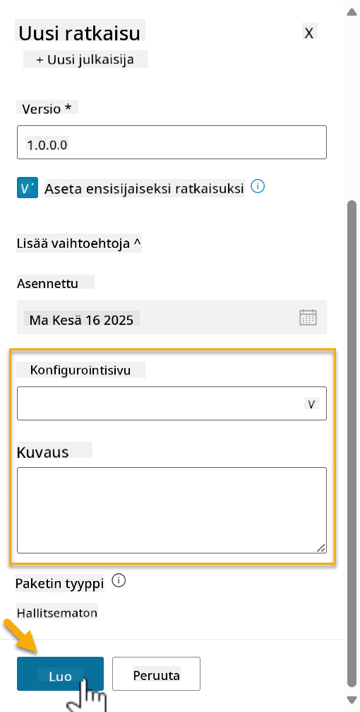

1. Contoso Helpdesk Agent -ratkaisu on nyt luotu. Siinä ei ole komponentteja, ennen kuin luomme agentin Copilot Studiossa.

    Valitse **takaisin nuoli** -kuvake palataksesi Ratkaisunhallintaan.

    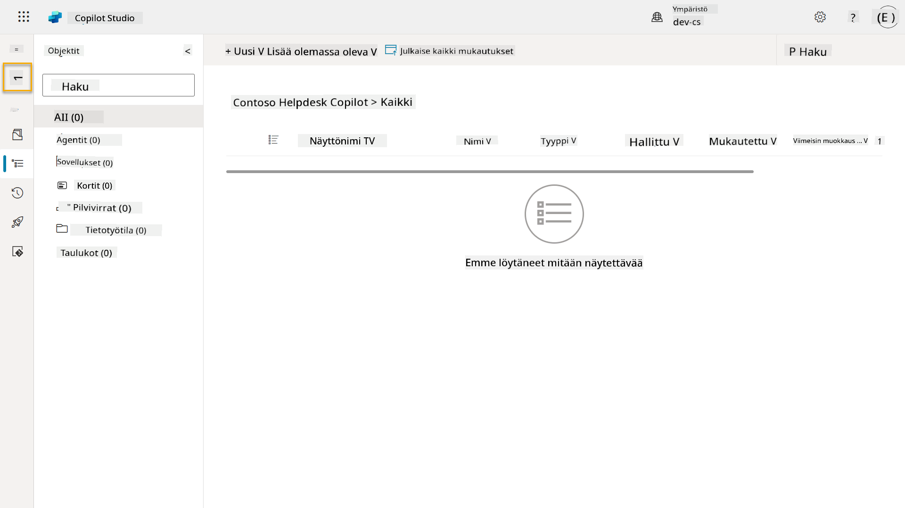

1. Huomaa, kuinka Contoso Helpdesk Agent näkyy nyt **Nykyisenä oletusratkaisuna**, koska valitsimme aiemmin **Aseta oletusratkaisuksi** -valintaruudun.

    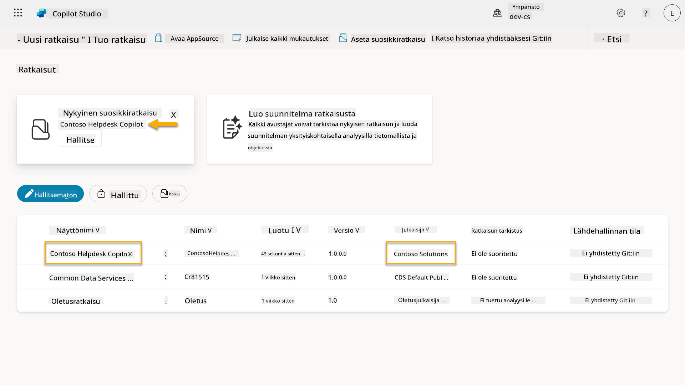

## ✅ Tehtävä suoritettu

Onnittelut! 👏🏻 Olet luonut julkaisijan ja käyttänyt sitä juuri luodussa ratkaisussa agenttisi rakentamiseen!

Hienoa työtä, Agent Maker. Siisti digitaalinen jalanjälki on ensimmäinen askel kohti skaalautuvaa toimivuutta. Nyt sinulla on työkalut ja ajattelutapa kestävään, yritystason agenttikehitykseen.

Tämä oli **Lab 04 - Ratkaisun luominen** loppu, valitse alla oleva linkki siirtyäksesi seuraavaan oppituntiin. Tässä laboratoriossa luomaasi ratkaisua käytetään seuraavan oppitunnin laboratoriossa.

⏭️ [Siirry **Aloita nopeasti valmiiden agenttien avulla** -oppituntiin](../05-using-prebuilt-agents/README.md)

## 📚 Taktiset resurssit

🔗 [Luo ratkaisu](https://learn.microsoft.com/power-apps/maker/data-platform/create-solution/?WT.mc_id=power-172615-ebenitez)

🔗 [Ratkaisujen luominen ja hallinta Copilot Studiossa](https://learn.microsoft.com/microsoft-copilot-studio/authoring-solutions-overview/?WT.mc_id=power-172615-ebenitez)

🔗 [Jaa agentteja muiden käyttäjien kanssa](https://learn.microsoft.com/microsoft-copilot-studio/admin-share-bots/?WT.mc_id=power-172615-ebenitez)

🔗 [Yhteenveto ennalta määritettyjen suojausroolien käytettävissä olevista resursseista](https://learn.microsoft.com/power-platform/admin/database-security#summary-of-resources-available-to-predefined-security-roles/?WT.mc_id=power-172615-ebenitez)

🔗 [Ratkaisun päivittäminen tai päivittäminen](https://learn.microsoft.com/power-apps/maker/data-platform/update-solutions/?WT.mc_id=power-172615-ebenitez)

🔗 [Yleiskatsaus Power Platformin putkistoihin](https://learn.microsoft.com/power-platform/alm/pipelines/?WT.mc_id=power-172615-ebenitez)

🔗 [Yleiskatsaus Git-integraatioon Power Platformissa](https://learn.microsoft.com/power-platform/alm/git-integration/overview/?WT.mc_id=power-172615-ebenitez)


---

**Vastuuvapauslauseke**:  
Tämä asiakirja on käännetty käyttämällä tekoälypohjaista käännöspalvelua [Co-op Translator](https://github.com/Azure/co-op-translator). Vaikka pyrimme tarkkuuteen, huomioithan, että automaattiset käännökset voivat sisältää virheitä tai epätarkkuuksia. Alkuperäinen asiakirja sen alkuperäisellä kielellä tulisi pitää ensisijaisena lähteenä. Kriittisen tiedon osalta suositellaan ammattimaista ihmiskäännöstä. Emme ole vastuussa väärinkäsityksistä tai virhetulkinnoista, jotka johtuvat tämän käännöksen käytöstä.