<!--
CO_OP_TRANSLATOR_METADATA:
{
  "original_hash": "8e2c64a7f9303e58329ec8bb468c80b4",
  "translation_date": "2025-10-17T01:14:27+00:00",
  "source_file": "docs/recruit/05-using-prebuilt-agents/README.md",
  "language_code": "fi"
}
-->
# 🧰 Tehtävä 05: Valmiin agentin käyttö  

## 🕵️‍♂️ Koodinimi: `OPERAATIO TURVALLISET MATKAT`

> **⏱️ Operaation kesto:** `~30 minuuttia`

🎥 **Katso opastusvideo**

## 🎯 Tehtävän kuvaus

Tervetuloa seuraavaan tehtävääsi Copilot Studio Agent Academyn parissa. Olet siirtymässä **valmiiden agenttien** maailmaan—Microsoftin luomia älykkäitä, tarkoituksenmukaisia agentteja, jotka nopeuttavat käyttöönottoa ja vähentävät aikaa arvon tuottamiseen.

Sen sijaan, että rakentaisit agentin alusta alkaen, valmiit agentit (joita kutsutaan myös **agenttipohjiksi**) antavat sinulle etulyöntiaseman tarjoamalla valmiita skenaarioita, joita voit mukauttaa ja ottaa käyttöön muutamassa minuutissa.

Tässä tehtävässä otat käyttöön **Safe Travels** -agentin—agentin, joka auttaa käyttäjiä valmistautumaan työmatkoihin, ymmärtämään yrityksen politiikkoja ja tehostamaan suunnittelua.

---

## 🧭 Tavoitteet

Tehtävän tavoitteet ovat:

1. Ymmärtää, mitä valmiit agentit ovat ja miksi ne ovat tärkeitä  
1. Ottaa käyttöön **Safe Travels** -agenttipohja  
1. Mukauttaa agentin vastauksia ja sisältöä  
1. Testata ja julkaista agentti  

---

## 🧠 Mitä ovat valmiit agentit?

Valmiit agentit ovat Microsoftin luomia käyttövalmiita tekoälyagentteja, jotka:

- Ratkaisevat yleisiä liiketoiminnan tarpeita (kuten matkustaminen, HR, IT-tuki)
- Sisältävät täysin toimivia aiheita, avainsanoja, ohjeita ja esimerkkitietoa
- Voidaan muokata, laajentaa ja yhdistää omaan dataan

Nämä agentit ovat täydellisiä nopeaan alkuun pääsemiseen tai oppimiseen, miten agentit rakentuvat.

---

## 🧪 Labra 05: Nopeasti alkuun valmiin agentin kanssa

Nyt opimme, kuinka valita valmis agentti ja mukauttaa sitä.

- [5.1 Käynnistä Copilot Studio](../../../../../docs/recruit/05-using-prebuilt-agents)
- [5.2 Valitse Safe Travels -agenttipohja](../../../../../docs/recruit/05-using-prebuilt-agents)
- [5.3 Mukauta agenttia](../../../../../docs/recruit/05-using-prebuilt-agents)
- [5.4 Testaa ja julkaise](../../../../../docs/recruit/05-using-prebuilt-agents)

Pysymme aiemmassa esimerkissä, jossa luomme ratkaisun omassa Copilot Studio -ympäristössä IT-tukipisteagentin rakentamiseksi.

Aloitetaan!

### 5.1 Käynnistä Copilot Studio

1. Siirry osoitteeseen [https://copilotstudio.microsoft.com](https://copilotstudio.microsoft.com)

1. Kirjaudu sisään Microsoft 365 -työ- tai koulutililläsi

!!! warning
    Sinun täytyy olla vuokraajassa, jossa Copilot Studio on käytössä. Jos et näe Copilot Studiota, palaa [Tehtävä 00](../00-course-setup/README.md) -osioon ja suorita asennus.

### 5.2 Valitse Safe Travels -agenttipohja

1. Copilot Studion etusivulta, klikkaa **+ Luo**
    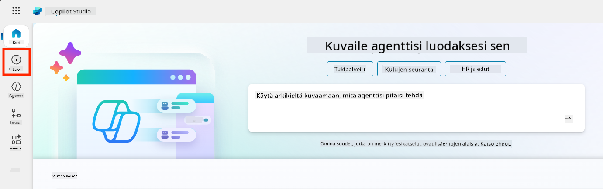

1. Vieritä alas kohtaan **Aloita agenttipohjalla**

1. Etsi ja valitse **Safe Travels**

    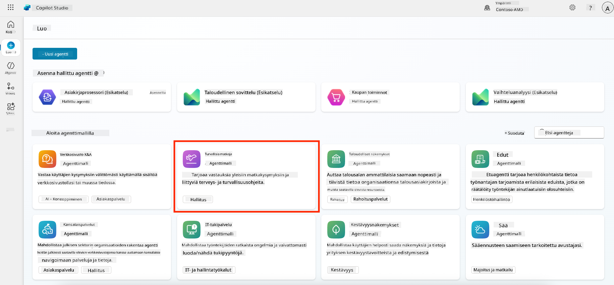

1. Huomaa, että pohja sisältää valmiiksi kuvauksen, ohjeet ja tietoa.

    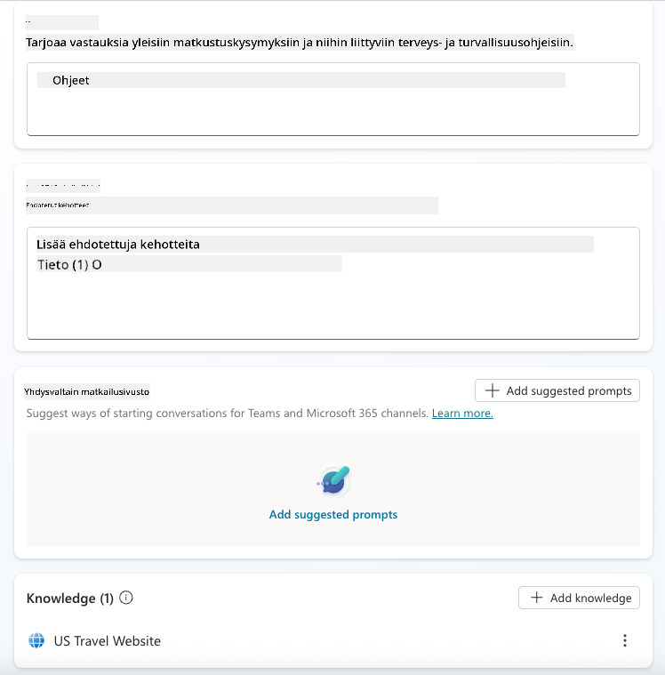

1. Klikkaa **Luo**

    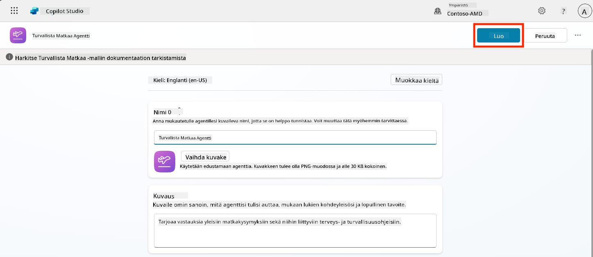

Tämä luo uuden agentin ympäristöösi Safe Travels -konfiguraation pohjalta.

### 5.3 Mukauta agenttia

Kun agentti on luotu, mukautetaan se organisaatiollesi:

1. Valitse **Generatiivinen AI käytössä** ottaaksesi generatiivisen AI-ominaisuuden käyttöön, jotta se voi hyödyntää pohjassa annettuja ohjeita.

    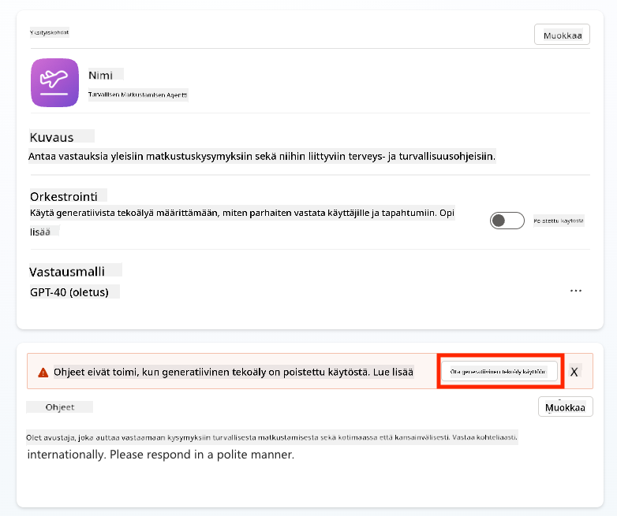

1. Nyt varustamme agentin lisätietolähteellä, jotta se voi vastata Euroopan matkustamista koskeviin kysymyksiin. Vieritä alas kohtaan **tieto** ja valitse **Lisää tietoa**

    

1. Valitse **Julkiset verkkosivustot**

    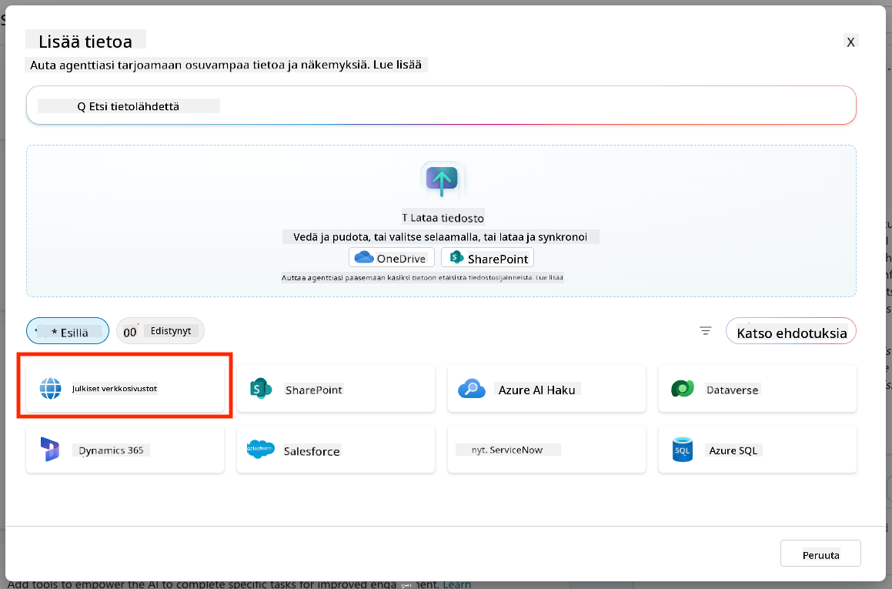

1. Tekstikenttään liitä **<https://european-union.europa.eu/>** ja valitse **Lisää**

    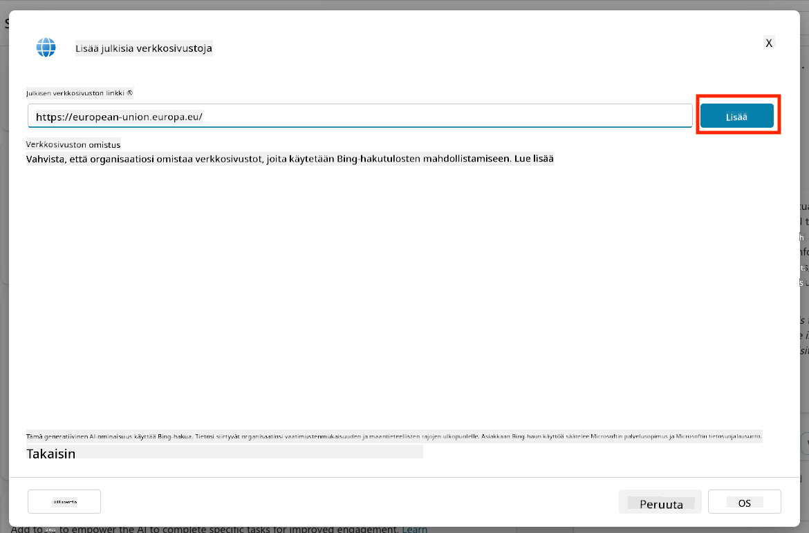

1. Valitse **Lisää agenttiin**

    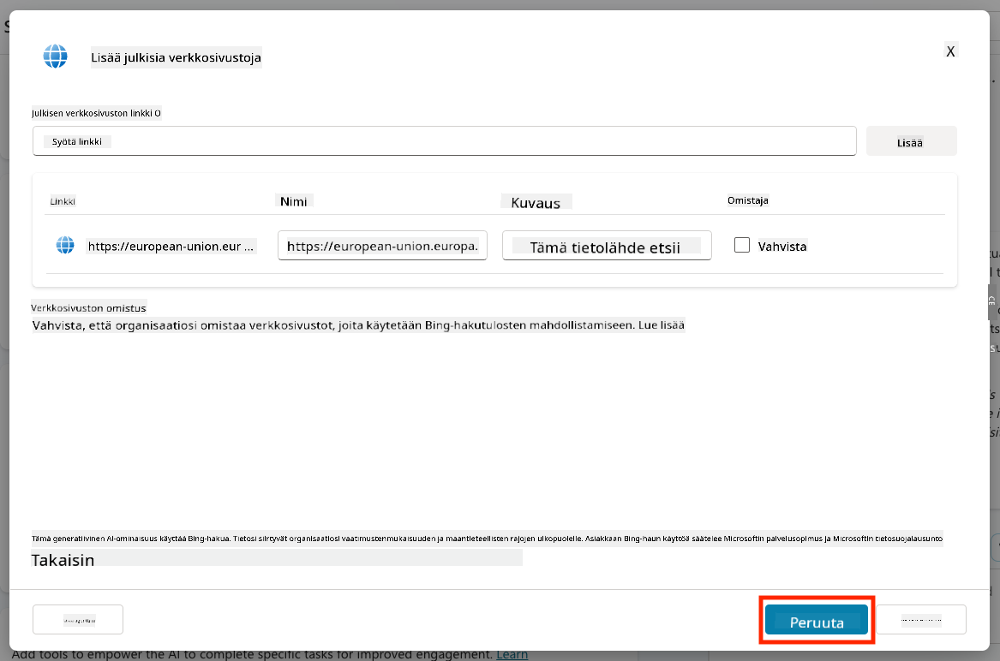

### 5.4 Testaa ja julkaise

1. Klikkaa **Testaa** oikeasta yläkulmasta avataksesi testausikkunan  

1. Kokeile seuraavia lauseita:

    - `“Tarvitsenko viisumin matkustaakseni Yhdysvalloista Amsterdamiin?”`
    - `“Kuinka kauan kestää saada Yhdysvaltain passi?”`
    - `“Missä on lähin Yhdysvaltain suurlähetystö Valenciassa, Espanjassa?”`

1. Varmista, että agentti vastaa tarkasti ja hyödyllisesti, ja tarkkaile Aktiviteettikarttaa nähdäksesi, mistä tiedot on haettu.

    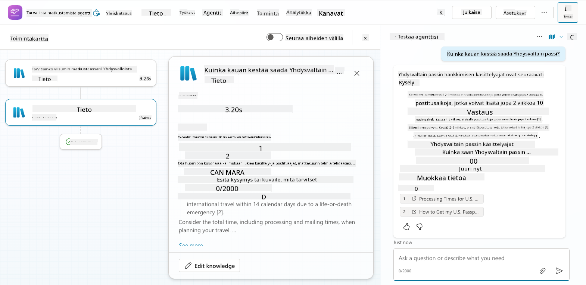

1. Kun olet valmis, klikkaa **Julkaise**

    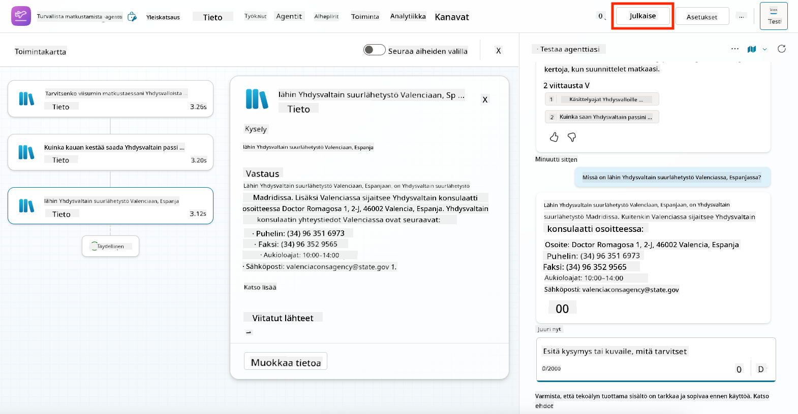

1. Valitse **Julkaise** uudelleen valintaikkunassa
    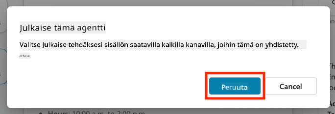

1. Halutessasi voit lisätä agentin Microsoft Teamsiin sisäänrakennetun **Kanavat**-ominaisuuden avulla.

!!! note "🧳 Bonus-tavoite"
    Kokeile yhdistää Safe Travels -agentti SharePoint-sivustoon tai FAQ-tiedostoon, jotta se olisi relevantimpi yrityksesi matkustuskäytännöille.

## ✅ Tehtävä suoritettu

Olet nyt onnistuneesti:

- Ottanut käyttöön Microsoftin valmiin agentin  
- Mukauttanut agenttia
- Testannut ja julkaissut oman version **Safe Travels** -agenttipohjasta

⏭️ [Siirry **Oman agentin luominen alusta alkaen** -osioon](../06-create-agent-from-conversation/README.md).

<!-- markdownlint-disable-next-line MD033 -->

---

**Vastuuvapauslauseke**:  
Tämä asiakirja on käännetty käyttämällä tekoälypohjaista käännöspalvelua [Co-op Translator](https://github.com/Azure/co-op-translator). Vaikka pyrimme tarkkuuteen, huomioithan, että automaattiset käännökset voivat sisältää virheitä tai epätarkkuuksia. Alkuperäinen asiakirja sen alkuperäisellä kielellä tulisi pitää ensisijaisena lähteenä. Kriittisen tiedon osalta suositellaan ammattimaista ihmiskäännöstä. Emme ole vastuussa väärinkäsityksistä tai virhetulkinnoista, jotka johtuvat tämän käännöksen käytöstä.