<!--
CO_OP_TRANSLATOR_METADATA:
{
  "original_hash": "180f9cc0b40527f61be092c9b0f72aba",
  "translation_date": "2025-10-17T01:33:57+00:00",
  "source_file": "docs/recruit/06-create-agent-from-conversation/README.md",
  "language_code": "fi"
}
-->
# 🚨 Tehtävä 06: Luo mukautettu agentti luonnollisella kielellä Copilotilla ja yhdistä se omaan dataasi

## 🕵️‍♂️ Koodinimi: `OPERATION AGENT FORGE`

> **⏱️ Operaatioaika:** `~75 minuuttia`

🎥 **Katso opastusvideo**

[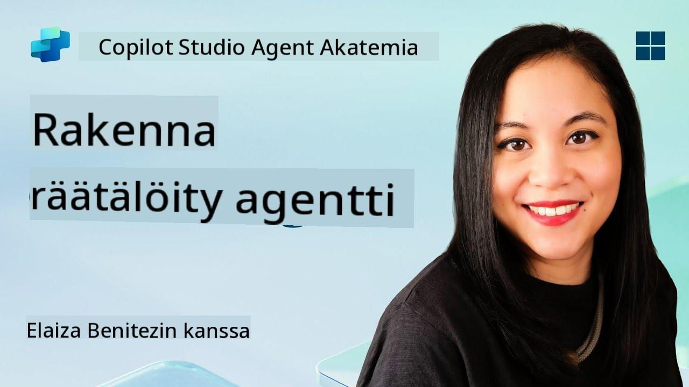](https://www.youtube.com/watch?v=qZTtQVncGFg "Katso opastus YouTubessa")

## 🎯 Tehtävän kuvaus

Tervetuloa takaisin, Agent Maker. Tässä tehtävässä pääset hyödyntämään Copilot Studion tehokkainta ominaisuutta - luomaan mukautetun agentin alusta alkaen pelkästään luonnollisella kielellä… ja vahvistamaan sitä omalla datallasi.

Tämä ei ole vain tavallinen chatbot. Olet rakentamassa tietoon perustuvaa digitaalista työtoveria - sellaista, joka osaa järkeillä, vastata ja viitata todelliseen yritystietoon.

Työkalusi? Luonnollinen kieli. Tehtäväsi? Suunnitella, kouluttaa ja testata täysin mukautettu IT-tukipalveluagentti, joka vastaa kysymyksiin SharePointin, ladattujen tiedostojen tai yrityksen URL-osoitteiden avulla.

Rakennetaan agentti alusta alkaen.

## 🔎 Tavoitteet

Tässä tehtävässä opit:

1. Ymmärtämään, mitä mukautetut agentit ovat ja miten ne eroavat valmiista malleista
1. Luomaan agentteja luonnollisen kielen kehotteiden ja keskustelusuunnittelun avulla Copilotilla
1. Yhdistämään agentit yrityksen tietolähteisiin, kuten SharePointiin, dokumentteihin ja verkkosivustoihin
1. Oppimaan generatiivisesta orkestroinnista ja siitä, miten agentit etsivät ja vastaavat dynaamisesti useista tietolähteistä
1. Rakentamaan ja testaamaan täysin toimivan IT-tukipalveluagentin, joka voi vastata kysymyksiin omasta datastasi

## 🤔 Mikä on _mukautettu_ agentti?

Mukautettu agentti on chatbot tai virtuaaliassistentti, jonka luot ja suunnittelet Copilot Studiossa auttamaan käyttäjiä tietyissä tehtävissä tai kysymyksissä. Sitä kutsutaan mukautetuksi, koska:

- **Sinä päätät tarkoituksen** - autat käyttäjiä pyytämään lomaa, tarkistamaan tilauksen tilan, tarjoamaan apua IT-kysymyksissä.
- **Sinä määrität keskustelun** - mitä agentti sanoo ja miten sen pitäisi vastata.
- **Sinä yhdistät sen omaan dataasi** - yhdistä yrityksesi data sisäänrakennettujen tietolähteiden avulla.
- **Sinä yhdistät sen omiin järjestelmiisi tai sovelluksiisi** - valitse liittimet, työnkulut, REST-rajapinnat ja mallikontekstiprotokollapalvelimet.

!!! note
    Ajattele sitä näin: rakennat oman digitaalisen avustajan, joka voi keskustella käyttäjien kanssa ja suorittaa tehtäviä heidän puolestaan, kuten vastata kysymyksiin, kerätä prosessiin tarvittavaa tietoa tai yhdistää yrityksesi dataan.

### 🤖 Mitä mukautettu agentti voi tehdä?

Mukautettu agentti voi tehdä seuraavaa:

- Kysyä käyttäjiltä tietoja, kuten nimiä, päivämääriä tai mieltymyksiä.
- Tallentaa tiedot tietokantaan tai taulukkoon.
- Etsiä tietoa kysymysten perusteella ja vastata niihin.
- Työskennellä itsenäisesti ilman, että käyttäjät ovat suoraan vuorovaikutuksessa agentin kanssa.
- Käynnistää toimintoja joko käyttäjän pyynnöstä tai itsenäisesti, kuten lähettää sähköposteja tai luoda tietueita.

### 👩🏻‍💻 Miksi käyttää mukautettua agenttia?

- Säästää aikaa automatisoimalla toistuvia tehtäviä.
- Tarjoaa käyttäjille ystävällisen ja ohjatun kokemuksen.
- Räätälöi sen yrityksesi tai projektisi tarpeisiin.

### ✨ Esimerkki

Rakennat mukautetun agentin, joka auttaa työntekijöitä pyytämään lomaa.

Se kysyy heidän nimensä, lomapäivämäärät ja heidän esimiehensä nimen, ja tallentaa tiedot järjestelmään, joka hallinnoi lomapyyntöjä, kuten SharePoint-listaan.

Nyt työntekijät voivat keskustella agentin kanssa sen sijaan, että navigoisivat SharePoint-listaan ja luovat uuden kohteen.

## 🗣️ Käytä luonnollista kieltä agenttien luomiseen

Aiemmin opit, kuinka nopeasti voit rakentaa agentteja Copilot Studiossa valmiiden agenttimallien avulla [Oppitunnilla 05 - Aloita nopeasti valmiiden agenttien avulla](../05-using-prebuilt-agents/README.md). Tässä oppitunnissa sukellamme Copilotin keskusteluluomiskokemukseen. Copilot Studio tekee agenttien rakentamisesta helppoa keskustelemalla Copilotin kanssa, aivan kuin kävisit keskustelua.

Copilot Studiossa sinun ei tarvitse kirjoittaa koodia luodaksesi agentin. Sen sijaan kuvailet, mitä haluat agenttisi tekevän, ja Copilot auttaa sinua rakentamaan sen askel askeleelta keskustelun kautta.

## 🌱 Mutta olen uusi "kuvailemaan mitä haluan" - mitä teen?

Mukautetun agentin luominen luonnollisella kielellä voi olla sinulle uusi konsepti. Aina kun käytät Copilotia Microsoftin tuotteissa ja palveluissa, käytät luonnollista kieltä muodossa _kehotus_.

Kehotus on viesti tai ohje, jonka annat tekoälyagentille kertoaksesi, mitä haluat sen tekevän. Ajattele sitä kuin antaisit ohjeita avustajalle. Mitä selkeämmät ohjeesi ovat, sitä helpompi avustajan on ymmärtää ja toimia niiden mukaan.

### 🪄 Miksi kehotukset ovat tärkeitä

- Ne ohjaavat agentin käyttäytymistä.
- Ne auttavat agenttia ymmärtämään, millainen keskustelu sen tulisi käydä.
- Hyvä kehotus tekee agentista hyödyllisemmän ja tarkemman.

### 📝 Vinkkejä hyvän kehotuksen kirjoittamiseen

- Ole selkeä ja tarkka - kerro täsmälleen, mitä haluat agentin tekevän.
- Ajattele kuin käyttäjä - mitä käyttäjä sanoo? Mitä agentin pitäisi vastata?
- Sisällytä esimerkkejä - jos mahdollista, anna näytekeskustelu.

### ✨ Esimerkki

HR-tiimi tarvitsee agentin auttamaan lomapyyntöjen kanssa.

Kehotus voisi olla:

    “Haluan rakentaa agentin, joka auttaa käyttäjiä lähettämään lomapyyntöjä. Kun käyttäjä sanoo haluavansa pyytää lomaa, agentin tulisi kysyä heidän nimensä, loman alkamispäivämäärä, loman päättymispäivämäärä ja heidän esimiehensä nimi. Kun käyttäjä antaa nämä tiedot, agentin tulisi tallentaa ne SharePoint-listaan nimeltä ‘Lomapyyntöjä’ ja lähettää ilmoitus omistettuun Microsoft Teams -kanavaan.”

Miksi tämä kehotus toimii:

- **Määrittelee tavoitteen selkeästi** - lähettää lomapyyntö
- **Kuvailee käyttäjän vuorovaikutuksen** - mitä käyttäjä sanoo ja mitä agentin tulisi kysyä
- **Listaa tarvittavat tiedot** - nimi, alkamispäivämäärä, päättymispäivämäärä, esimies
- **Mainitsee, minne tiedot menevät** - SharePoint-listaan nimeltä Lomapyyntöjä

## 🔮 OK, olen luonut agenttini... miten yhdistän sen tietoon?

Copilot Studiossa tietolähteet ovat paikkoja, joista agenttisi voi löytää tietoa antaakseen parempia vastauksia. Kun lisäät nämä lähteet, agenttisi voi tuoda yrityksesi dataa paikoista, kuten Power Platform, Dynamics 365, verkkosivustot ja muut järjestelmät tai palvelut, joita yrityksesi käyttää.

Nämä lähteet toimivat yhdessä tekoälyn kanssa auttaakseen agenttiasi vastaamaan tarkemmin käyttäjien kysymyksiin, mikä saavutetaan niin sanotun **generatiivisen orkestroinnin** avulla.

### 🌿 Mitä generatiivinen orkestrointi tarkoittaa agenttien yhteydessä?

Generatiivinen orkestrointi tarkoittaa, että agentti käyttää tekoälyä päättääkseen dynaamisesti, miten vastata kysymykseen yhdistämällä sisäänrakennetut kielitaidot lisättyjen tietolähteiden informaatioon.

Kun käyttäjä kysyy kysymyksen, agentti:

- Ymmärtää kysymyksen tekoälyn avulla.
- Voi kysyä käyttäjiltä puuttuvia tietoja luomalla kysymyksiä lennossa.
- Valitsee relevantit tietolähteet.
- Etsii vastauksia näistä lähteistä.
- Luo luonnollisen, hyödyllisen vastauksen löytämänsä tiedon perusteella.

### 🏦 Miksi tietolähteet ovat tärkeitä?

1. **Älykkäämmät vastaukset** - kun lisäät tietolähteitä, agenttisi voi antaa parempia, tarkempia vastauksia käyttäen organisaatiosi todellista dataa.

1. **Vähemmän manuaalista työtä** - sinun ei tarvitse kirjoittaa jokaista mahdollista vastausta. Agentti voi etsiä lisätyistä lähteistä ja vastata automaattisesti.

1. **Käytä luotettavaa tietoa** - agenttisi voi hakea vastauksia järjestelmistä, joita jo käytät, kuten Dataverse, SharePoint tai yrityksen verkkosivustot, jotta käyttäjät saavat luotettavaa tietoa.

1. **Toimii generatiivisen tekoälyn kanssa** - tietolähteet ja tekoäly auttavat agenttiasi ymmärtämään kysymyksiä ja vastaamaan luonnollisesti, vaikka kysymystä ei olisi ohjelmoitu etukäteen tai lisätty aloituskehotteeksi.

1. **Joustava ja laajennettavissa** - voit lisätä tietolähteitä milloin tahansa asennuksen aikana tai myöhemmin, jolloin agenttisi kehittyy tarpeidesi mukaan.

### ✨ Esimerkki

Kuvittele, että rakennat agentin auttamaan työntekijöitä HR-kysymyksissä. Lisäät yrityksesi HR-politiikkadokumentin ja SharePoint-sivuston tietolähteiksi.

Kun työntekijä kysyy, _“Kuinka monta lomapäivää minulla on oikeus saada?”_, agentti käyttää generatiivista orkestrointia etsiäkseen näistä lähteistä ja vastatakseen oikealla politiikalla ilman, että sinun tarvitsee kirjoittaa vastausta manuaalisesti. Tämä säästää aikaa, koska sinun ei tarvitse huomioida jokaista mahdollista kysymystä, jonka työntekijä voi esittää oikeuksistaan.

## Tietolähteiden tyypit, jotka voidaan lisätä

1. **Julkiset verkkosivustot**
    - **Mitä se tekee:** Etsii tietoa tietyiltä verkkosivustoilta (kuten yrityksesi sivustolta) Bingin avulla.
    - **Miksi se on hyödyllinen:** Erinomainen julkisten tietojen, kuten usein kysyttyjen kysymysten tai tuote-esittelyjen, tuomiseen.

1. **Dokumentit**
    - **Mitä se tekee:** Käyttää dokumentteja, jotka lataat suoraan agentillesi, kuten PDF- tai Word-tiedostoja. Nämä ladatut tiedostot tallennetaan turvallisesti Dataverseen.
    - **Miksi se on hyödyllinen:** Mahdollistaa agentin vastaamaan kysymyksiin sisäisten oppaiden, käsikirjojen tai politiikkojen perusteella.

1. **SharePoint**
    - **Mitä se tekee:** Yhdistää SharePoint-kansioihin tai tiedostoihin Microsoft Graph Searchin avulla.
    - **Miksi se on hyödyllinen:** Ihanteellinen tiimidokumenttien, HR-politiikkojen tai projektitiedostojen käyttämiseen, jotka on tallennettu SharePointiin.

1. **Dataverse**
    - **Mitä se tekee:** Käyttää rakenteellista dataa Dataverse-ympäristön taulukoista ja riveistä, ja voi soveltaa synonyymejä ja sanastomääritelmiä taulukoille ja sarakkeille parantaakseen agentin vastauksia.
    - **Miksi se on hyödyllinen:** Kun tarvitset yritysdatan hakemista Dataversesta, kuten asiakastietoja.

1. **Reaaliaikainen tieto liittimillä**
    - **Mitä se tekee:** Mahdollistaa agentin pääsyn reaaliaikaiseen dataan muista yritysjärjestelmistä, kuten Salesforce, ServiceNow, Dynamics 365, AzureSQL, Databricks ja enemmän keskustelun aikana käyttäjän omilla käyttöoikeuksilla.
    - **Miksi se on hyödyllinen:** Tarjoaa ajankohtaisia, turvallisia ja tarkkoja vastauksia ilman datan tallentamista tai kopioimista, tehden agentista älykkäämmän ja turvallisemman.

1. **Azure AI Search**
    - **Mitä se tekee:** Mahdollistaa agentin hakemisen suurista dokumenttijoukoista, jotka on tallennettu Azureen, käyttäen semanttista ja vektorihakua ymmärtääkseen käyttäjän kysymyksiä.
    - **Miksi se on hyödyllinen:** Toimittaa tarkkoja, luotettavia vastauksia monimutkaisista tietolähteistä, tukee viittauksia ja skaalautuu hyvin suurille dokumenttikokoelmille turvallisilla käyttöoikeuksilla.

## 🔒 Huomio turvallisuudesta

### Tietolähteiden autentikointi

Jotkut lähteet, kuten SharePoint ja Dataverse, vaativat käyttäjän autentikointia. Tämä tarkoittaa, että agentti viittaa vastauksissaan vain dataan, jonka käyttäjä saa nähdä. Muilla lähteillä voi olla lisäasetuksia, jotka vaaditaan agentin yhdistämiseksi, kuten Azure AI Search, joka vaatii Azure-tilin ja autentikointityypin määrittämisen.

## Agentin vastausten parantaminen Copilot Studiossa

Kun agenttisi on luotu keskusteluluomiskokemuksen kautta, haluat testata sen antamia vastauksia kehotteesi perusteella. Agentin vastausten parantaminen Copilot Studiossa tarkoittaa sitä, että varmistat sen ymmärtävän tavoitteesi selkeästi ja että sillä on oikea tieto käytettävissään.

1. **Tarkenna agentin ohjeita** - tässä kerrot agentille, miten sen tulisi käyttäytyä. Käytä selkeää ja tarkkaa kieltä.

    Esimerkiksi:

    ✅ “Toimi kuin ystävällinen asiakastukihenkilö, joka selittää asiat yksinkertaisesti.”

    ❌ “Ole avulias.” (Liian epämääräinen)

1. **Tarkista sävy ja kieli** - varmista, että agentin sävy vastaa kohdeyleisöäsi.

    Voit asettaa sen olemaan:

    - Ystävällinen ja rento.
    - Ammattimainen ja ytimekäs.
    - Tukevainen ja kärsivällinen.

1. **Lisää tai päivitä tietolähteitä** - jos agenttisi tarvitsee vastata kysymyksiin tietystä aiheesta, varmista, että sillä on pääsy oikeaan tietoon.

    - Lisää linkkejä verkkosivustoihin, dokumentteihin tai usein kysyttyihin kysymyksiin.
    - Pidä sisältö ajan tasalla.
    - Käytä selkeää, hyvin jäsenneltyä tietoa.

1. **Käytä aiheita ja laukaisimia** - Jos agenttisi tarvitsee käsitellä tiettyjä tehtäviä tai keskusteluja, voit luoda aiheita laukaisulausekkeilla. Tämä auttaa ohjaamaan keskustelua tarkemmin. Opimme tästä lisää seuraavassa oppitunnissa.

1. **Testaa oikeilla kysymyksillä** - kokeile kysyä agentiltasi sellaisia kysymyksiä, joita käyttäjät saattavat kysyä.

    Jos vastaukset eivät ole hyviä:

    - Säädä järjestelmäohjeita.
    - Lisää enemmän esimerkkejä tai tietoa.
    - Muotoile kysymyksesi uudelleen nähdäksesi, miten se vastaa.

1. **Arvioi ja kehitä** - agentin parantaminen on jatkuva prosessi!

    Julkaisun jälkeen:

    - Kerää palautetta käyttäjiltä.
    - Tarkkaile yleisiä kysymyksiä tai epäselvyyksiä.
    - Jatka agentin asetusten hienosäätöä.

## 🧪 Labra 06: Luo mukautettu agentti Copilot Studiossa

Nyt opimme, kuinka luoda mukautettu agentti, joka voi keskustella datasi kanssa

- [6.1 Käytä luonnollista kieltä agentin luomiseen Copilotilla](../../../../../docs/recruit/06-create-agent-from-conversation)
- [6.2 Lisää sisäinen tietolähde SharePoint-sivuston avulla](../../../../../docs/recruit/06-create-agent-from-conversation)
- [6.3 Lisää sisäinen tietolähde lataamalla dokumentti](#63-add-an-internal
Käytämme samaa käyttötapausta kuin [Oppitunti 03 - Luo deklaratiivinen agentti Microsoft 365 Copilotille](../03-create-a-declarative-agent-for-M365Copilot/README.md#use-case-scenario)

**Työntekijänä**

**Haluan** saada nopeaa ja tarkkaa apua IT-tukihenkilöltä ongelmiin, kuten laiteongelmiin, verkon vianmääritykseen, tulostimen asennukseen

**Jotta voin** pysyä tuottavana ja ratkaista tekniset ongelmat viivytyksettä

Aloitetaan!

### ✨ Esivaatimukset

- **SharePoint-sivusto**

Käytämme **Contoso IT** SharePoint-sivustoa oppitunnista [Oppitunti 00 - Kurssin asennus - Vaihe 3: Luo uusi SharePoint-sivusto](../00-course-setup/README.md#step-4-create-new-sharepoint-site).

Jos et ole vielä luonut **Contoso IT** SharePoint-sivustoa, palaa takaisin oppituntiin [Oppitunti 00 - Kurssin asennus - Vaihe 3: Luo uusi SharePoint-sivusto](../00-course-setup/README.md#step-4-create-new-sharepoint-site).

- **Ratkaisu**

Käytämme **Contoso Helpdesk Agent** -ratkaisua oppitunnista [Oppitunti 04 - Ratkaisun luominen agentillesi](../04-creating-a-solution/README.md#41-create-a-solution-publisher).

Jos et ole vielä luonut **Contoso Agent** -ratkaisua, palaa takaisin oppituntiin [Oppitunti 04 - Ratkaisun luominen agentillesi](../04-creating-a-solution/README.md#41-create-a-solution-publisher).

### 6.1 Luo agentti luonnollisella kielellä Copilotin avulla

!!! warning "Copilot-kysymykset voivat vaihdella eri istunnoissa"

    Copilotin keskusteluluontikokemus voi vaihdella, ja tarjotut ohjaavat kysymykset voivat olla hieman erilaisia kuin aiemmin.

1. Siirry Copilot Studion etusivulle ja kirjoita kenttään seuraava kehotus, joka kuvaa IT-tukihenkilöagenttia. Kehotus sisältää agentin tavoitteen, kontekstin, odotetut tehtävät ja agentin vastausten muodon.

    ```text
    You are an IT help desk agent. Your goal is to assist users with their IT issues. You can access information from our company's knowledge base at https://support.microsoft.com/en-us. Your responses should be polite and helpful. If a user reports a slow computer, ask about the age of the device, current software versions, and if they've recently installed any new programs. If a user is experiencing trouble logging into their email, guide them through password reset procedures. You should be concise and informative, using step-by-step instructions with bullet points when appropriate.
    ```

      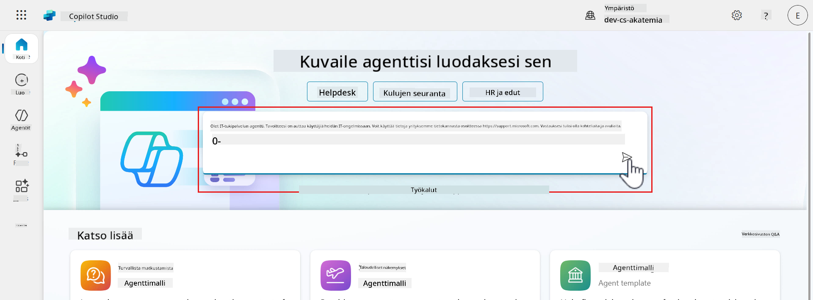

1. Seuraavaksi latautuu Copilotin keskusteluluontikokemus. Näet, että Copilot käsittelee vastausta.

      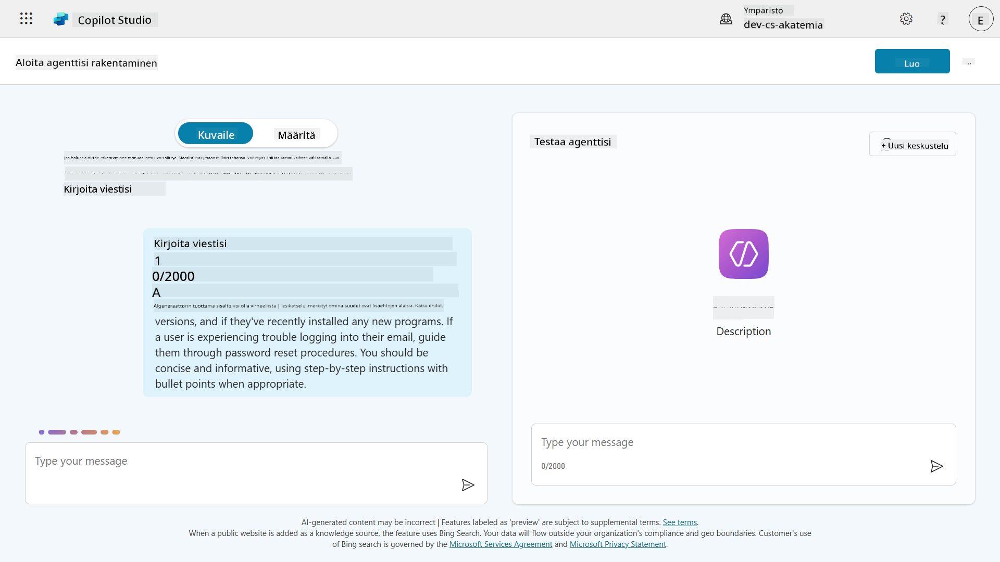

1. Copilot vahvistaa, että agentti on asetettu annettujen ohjeiden mukaisesti, ja pyytää vahvistusta agentin nimestä. Pyydämme Copilotia nimeämään agenttimme seuraavasti:

       ```text
       Contoso Helpdesk Agent
       ```

      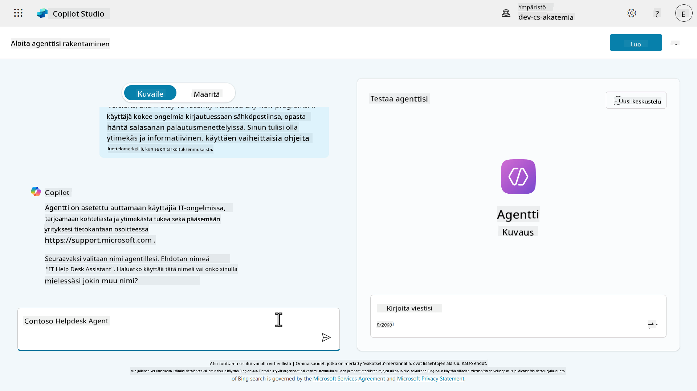

1. Copilot suorittaa pyynnön, ja näemme, että agentin nimi on päivitetty agenttipaneelissa. Seuraavaksi Copilot pyytää meitä tarkentamaan ohjeita. Se kysyy, miten meidän tulisi vastata tiettyihin ongelmiin, ja pyydämme, että se tunnistaa ongelman, antaa esimerkkejä aiheista ja muotoilee vastauksen luettelomerkein.

    Kopioi ja liitä seuraava teksti ja lähetä pyyntö Copilotille.

       ```text
       Priorisoi kiireelliset pyynnöt. Esimerkkejä IT-ongelmista tai skenaarioista, joissa auttaa: laiteongelmat, verkkoyhteysongelmat, kirjautumisongelmat. Vianmäärityksessä tunnista ensin heidän ongelmansa ja vastaa empaattisesti, sitten anna vaiheittaiset ohjeet luettelomerkein ja kysy, tarvitsevatko he lisäapua.
       ```

      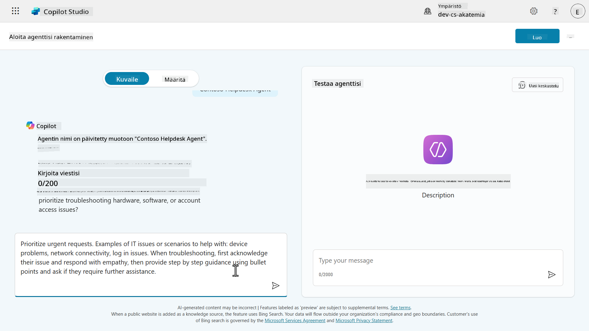

1. Agentin ohjeet päivitetään sen jälkeen, kun Copilot on vastaanottanut pyynnön. Huomaa, että oikealla puolella olevassa paneelissa näkyy nyt aloituskehotuksia. Nämä on muodostettu ohjeidemme perusteella.

    Seuraavaksi Copilot pyytää julkisia verkkosivustoja agentin tiedon pohjaksi.

    Kopioi ja liitä seuraava teksti ja lähetä pyyntö Copilotille.

      ```text
      https://support.microsoft.com
      ```

      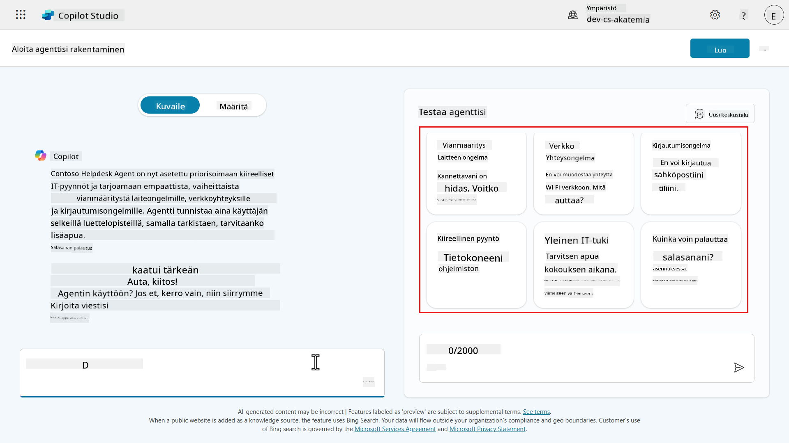

1. Julkinen verkkosivusto lisätään tiedon lähteeksi. Copilot kysyy, halutaanko lisätä muita tiedon lähteitä. Emme tarvitse lisätä muita julkisia verkkosivustoja.

    Kopioi ja liitä seuraava teksti ja lähetä pyyntö Copilotille.

      ```text
      Proceed with setup
      ```

      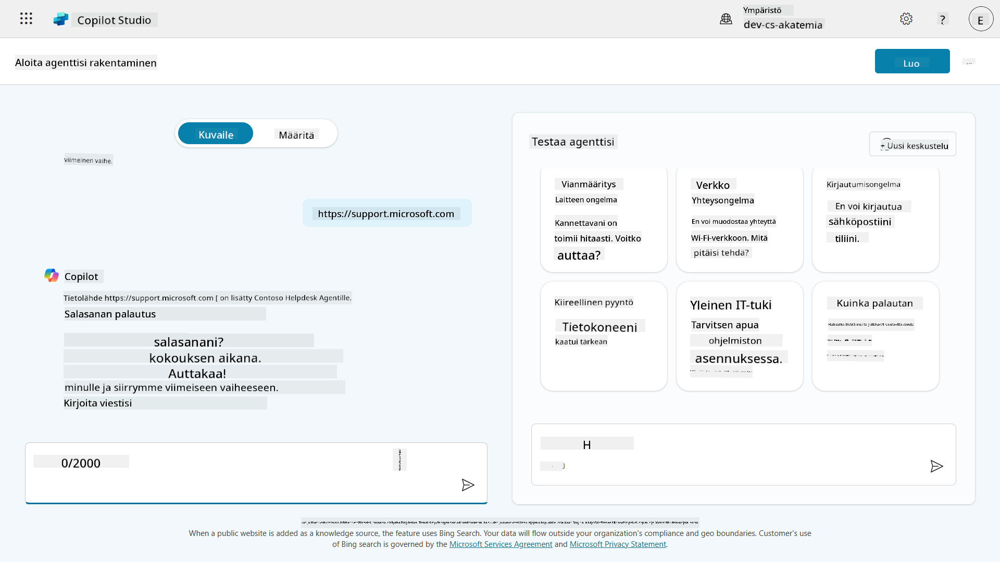

1. Copilot vahvistaa, että Contoso Helpdesk Agentin asennus on valmis, mutta teemme vielä yhden muutoksen: pyydämme, että agenttimme ei vastaa HR-aiheisiin liittyviin kysymyksiin. Tämä kertoo agentille, että sen ei tulisi vastata käyttäjien HR-aiheisiin kysymyksiin.

    Kopioi ja liitä seuraava teksti ja lähetä pyyntö Copilotille.

       ```text
       Älä anna apua HR-aiheisiin liittyvissä kysymyksissä, esimerkkejä: Mikä on lomapäivieni saldo? Kuinka monta sairauspäivää minulla on? Mikä on palkkahallinnon portaalin URL-osoite?
       ```

      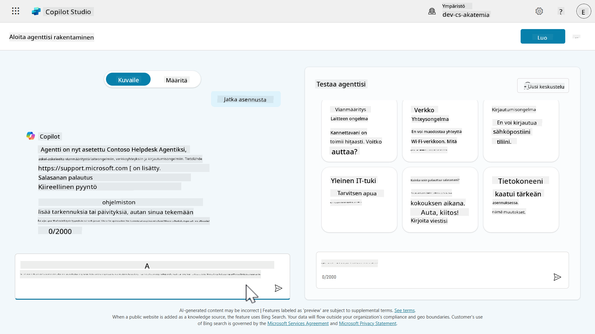

1. Ohjeet päivitetään niin, että HR-aiheisiin liittyviin kysymyksiin ei anneta apua. Emme tarvitse tehdä muita päivityksiä, agenttimme on valmis luotavaksi.

      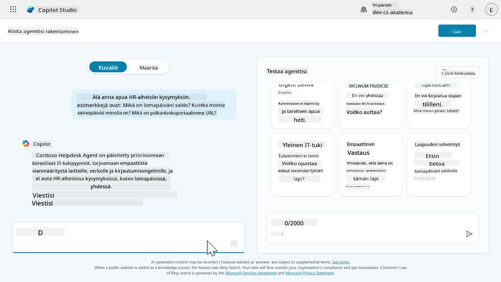

1. Ennen kuin luomme agenttimme, tehdään pari asiaa.

    Valitse ensin **Configure**-välilehti nähdäksesi agentin tiedot, jotka on määritelty keskustelussa Copilotin kanssa. Täältä näet nimen, kuvauksen, ohjeet, tiedon ja ehdotetut/aloituskehotukset.

      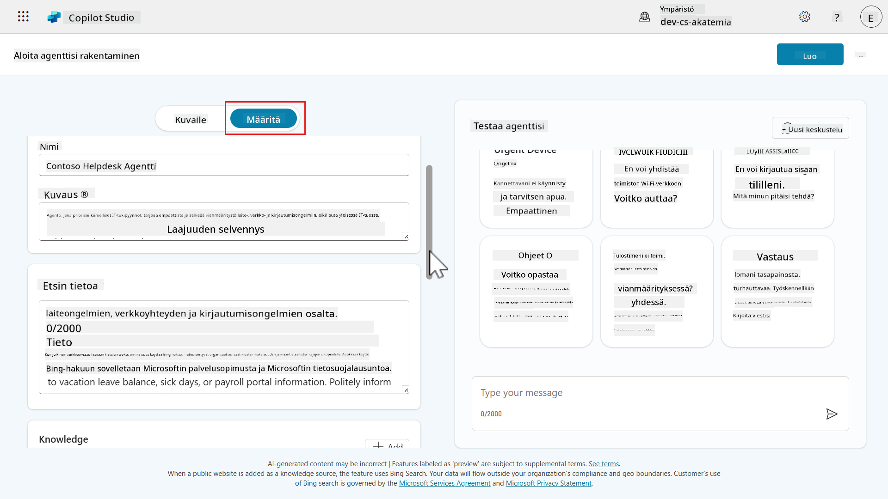

1. Toiseksi, testataan agenttiamme. Kopioi ja liitä seuraava teksti ja lähetä kysymys agentillemme.

       ```text
       Kuinka voin tarkistaa Surface-laitteeni takuun tilan?
       ```

      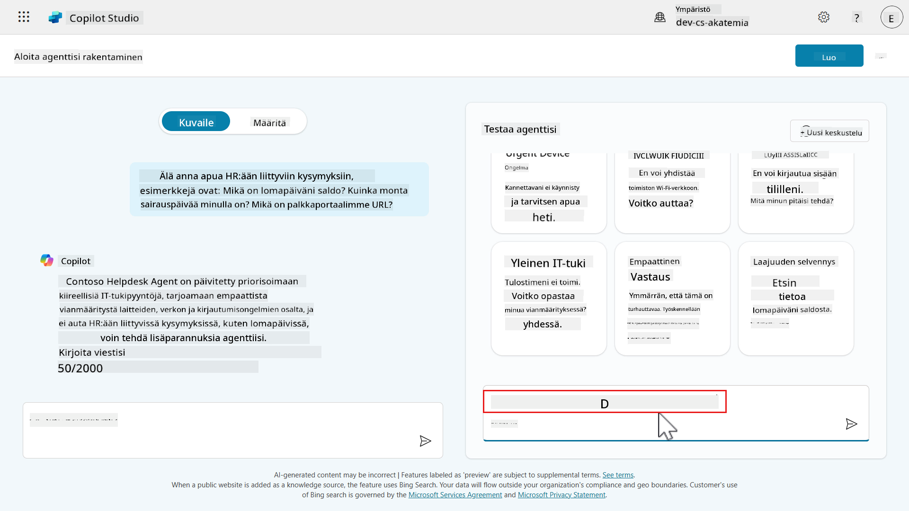

1. Kysymykseen annettu vastaus näkyy, ja vastaukset ovat vaiheittaisen oppaan muodossa luettelomerkein. Hienoa, agenttimme toimii! 🙌🏻

      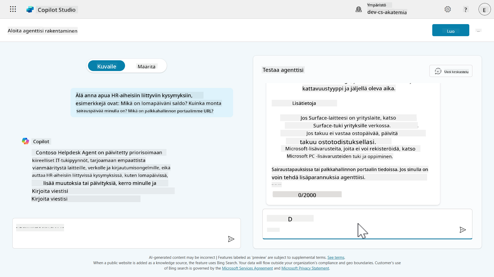

1. Lopuksi tarkistamme, että ratkaisu, johon agenttimme luodaan, on ratkaisu, jonka loimme ja valitsimme ensisijaiseksi ratkaisuksi oppitunnissa [Oppitunti 04 - Luo uusi ratkaisu](../04-creating-a-solution/README.md#42-create-a-new-solution).

    Valitse **kolmipistekuvake (...)** ja valitse **Update Advanced Settings**.

      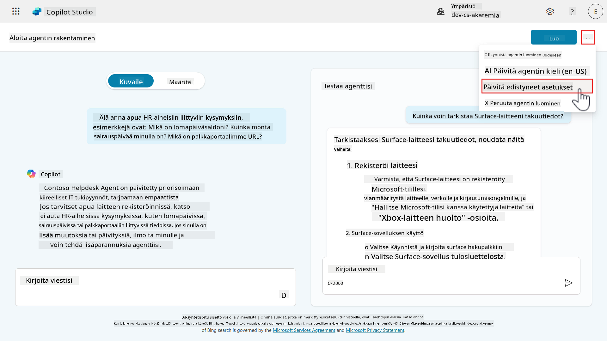

1. **Advanced Settings** -modaali tulee näkyviin, ja näemme, että aiemmin luomamme ratkaisu on valittu oletuksena. Tämä johtuu siitä, että valitsimme ratkaisumme ensisijaiseksi ratkaisuksi oppitunnissa [Oppitunti 04 - Luo uusi ratkaisu](../04-creating-a-solution/README.md#42-create-a-new-solution).

    Valitse **Cancel.**

      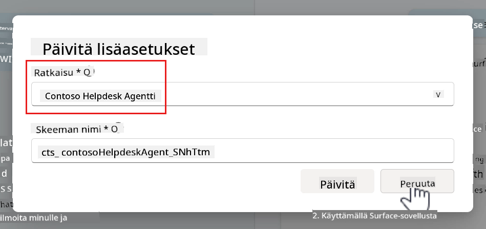

1. Luodaan nyt mukautettu agenttimme! Valitse **Create**.

      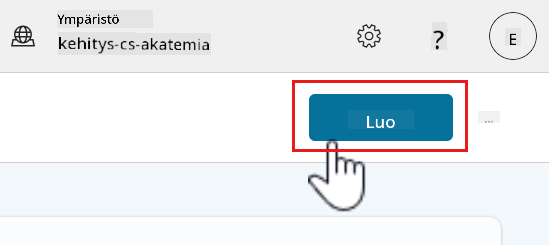

1. Copilot Studio alkaa luoda agenttiamme.

      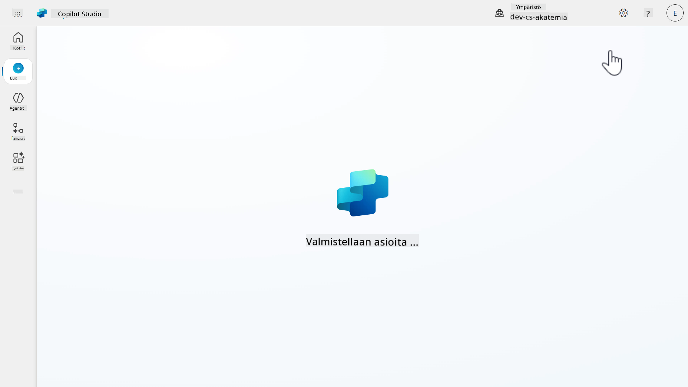

1. Kun agentti on luotu, voimme nähdä agentin tiedot, jotka heijastavat keskusteluluontikokemuksen aikana antamiamme pyyntöjä. Vieritä alas tarkistaaksesi agentin tiedot, joissa näkyvät nimi, kuvaus, ohjeet, tiedon lähteet ja ehdotetut kehotukset. Orkestrointitila on oletuksena käytössä, ja oletusmalli on käytössä agentin vastausmallina.

      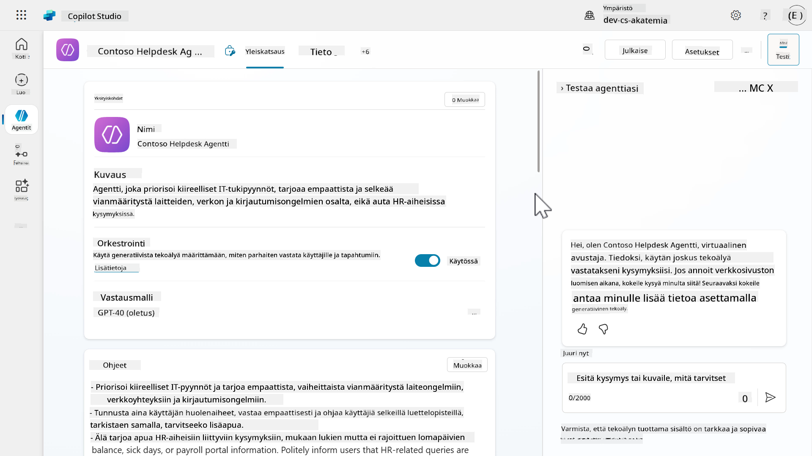

      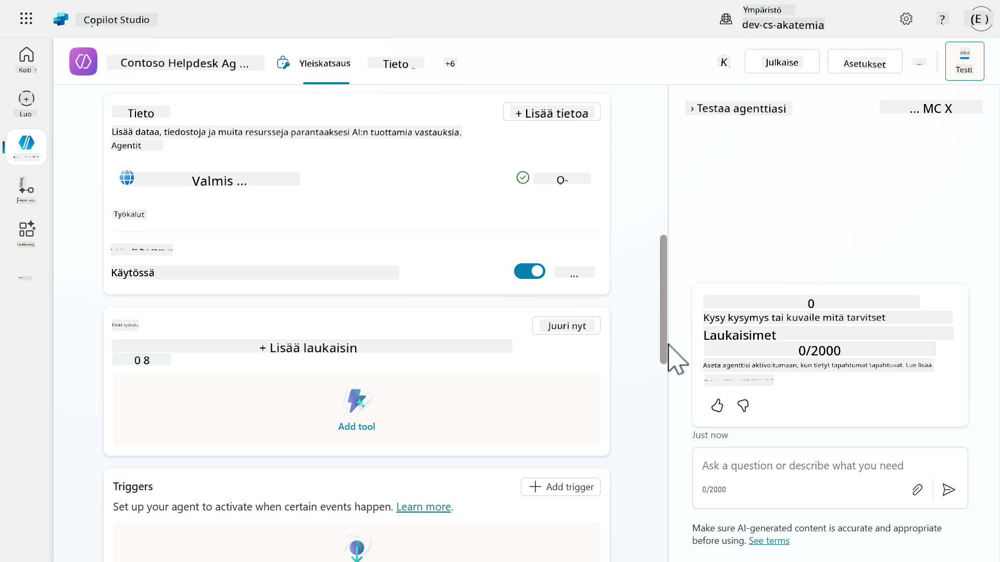

      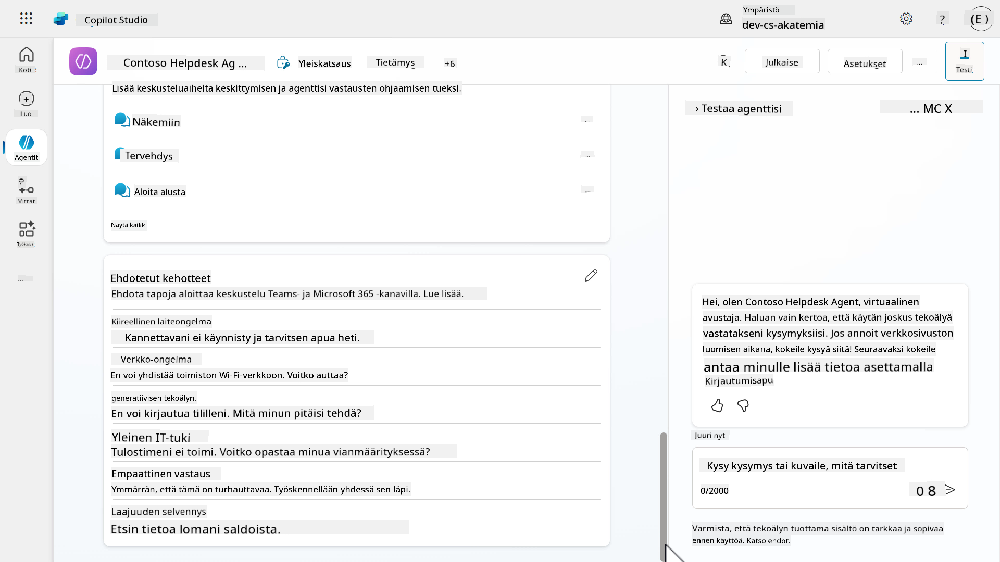

1. Testataan nyt juuri luotua agenttiamme. Oikealla puolella olevassa **Test**-paneelissa valitse **Activity Map** -kuvake.

      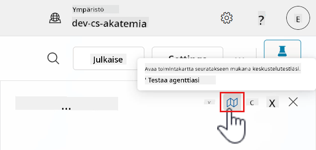

1. Kirjoita seuraava kysymys **Test**-paneeliin.

       ```text
       Kuinka löydän Windows 11 -tuoteavaimeni?
       ```

      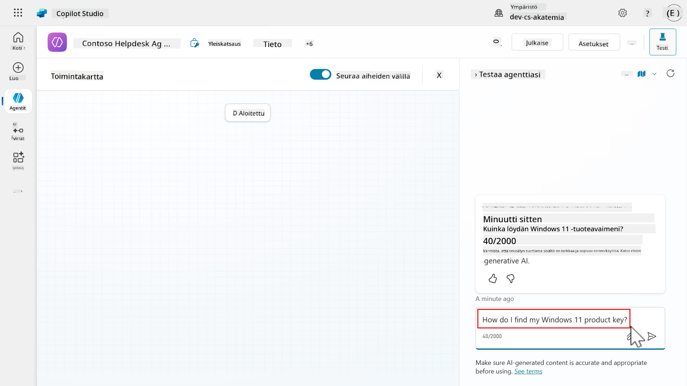

1. Activity Map latautuu ja näyttää meille reaaliajassa, mitä polkua agentti käsittelee. Tässä skenaariossa agenttimme on ymmärtänyt kysymyksen ja etsii tiedon lähteitä. Tällä hetkellä meillä on yksi lähde, joka on aiemmin Copilotin avulla lisätty julkinen verkkosivusto, jota agentti tarkastelee.

      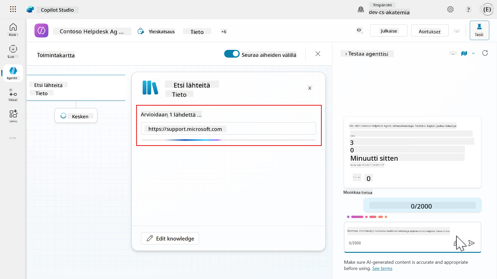

1. Agenttimme vastaa sitten vastauksilla, jotka on hahmoteltu luettelomerkein, kuten ohjeissa määriteltiin. Vastauksessa on viittauksia verkkosivuihin, joista agentti muodosti vastauksensa. Tämä mahdollistaa käyttäjien tarkistaa vastauksen lähteen.

      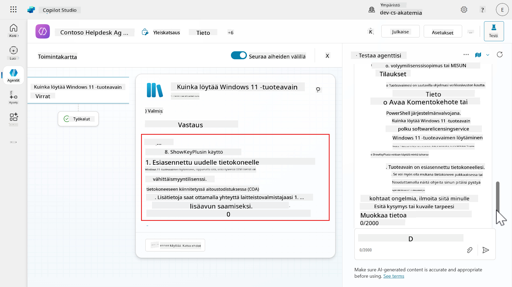

1. Voit myös tarkistaa vastauksen ja sen lähteet vierittämällä alas **Knowledge modal** -osiossa Activity Mapissa.

      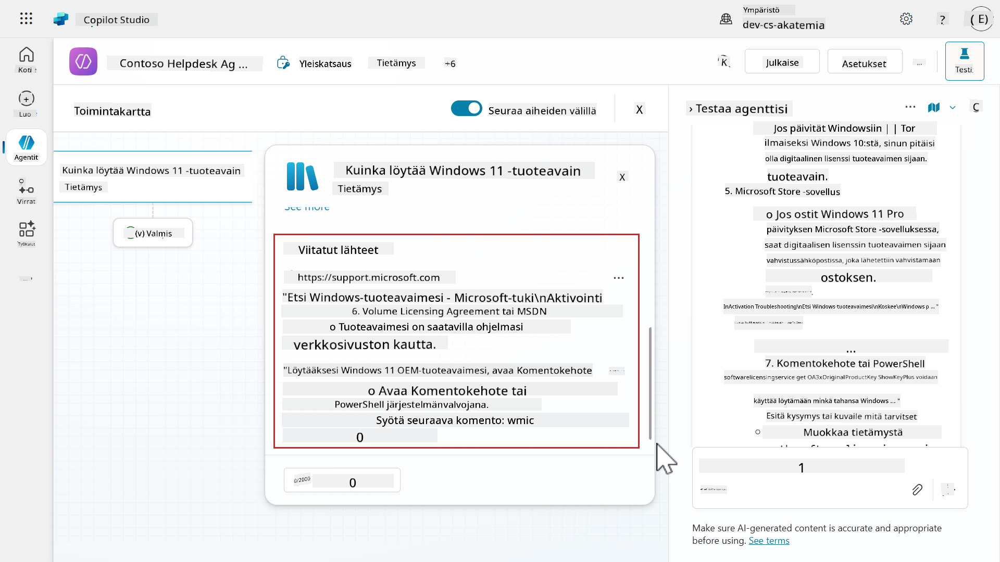

Onnittelut! Olet rakentanut ensimmäisen mukautetun agenttisi Copilotilla Copilot Studiossa 🙌🏻

### 6.2 Lisää sisäinen tiedon lähde SharePoint-sivuston avulla

Aiemmin Copilotin kanssa lisäsimme julkisen verkkosivuston agentin ulkoiseksi tiedon lähteeksi keskusteluluontikokemuksen aikana. Nyt aiomme lisätä sisäisen tiedon lähteen SharePoint-sivuston avulla. Tämä on SharePoint-sivusto, jonka loit oppitunnin [Oppitunti 00 - Kurssin asennus](../00-course-setup/README.md#step-4-create-new-sharepoint-site) aikana.

1. Valitse **+ Add knowledge**.

      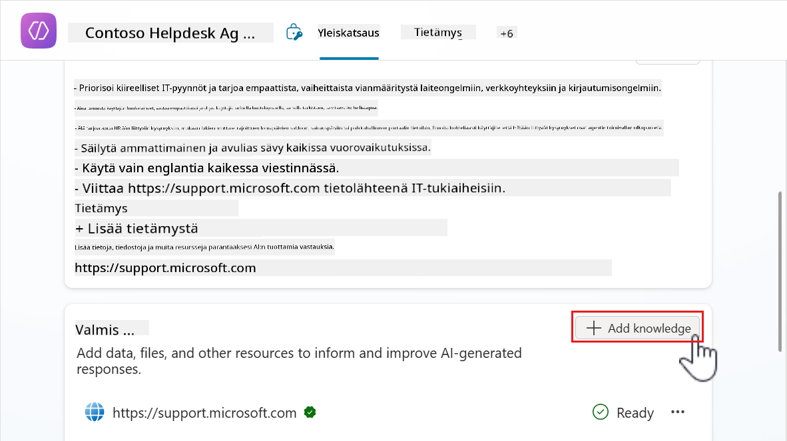

1. Valitse **SharePoint**.

      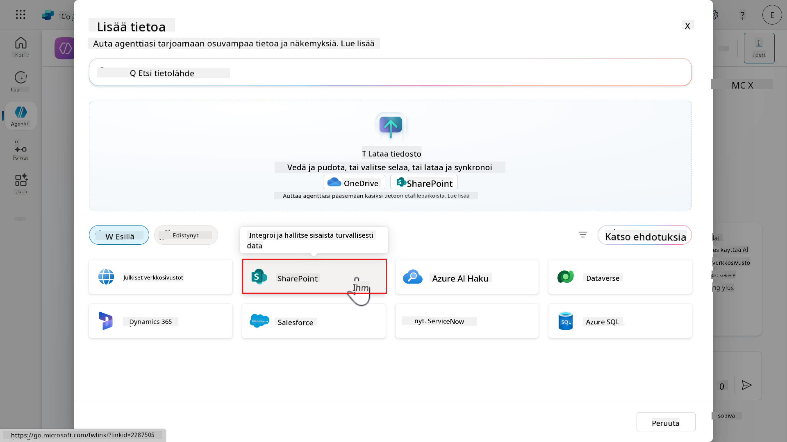

1. Liitä **SharePoint-sivuston osoite**, joka luotiin oppitunnin [Oppitunti 00 - Kurssin asennus](../00-course-setup/README.md#step-4-create-new-sharepoint-site) aikana, SharePoint URL -kenttään ja valitse **Add**.

      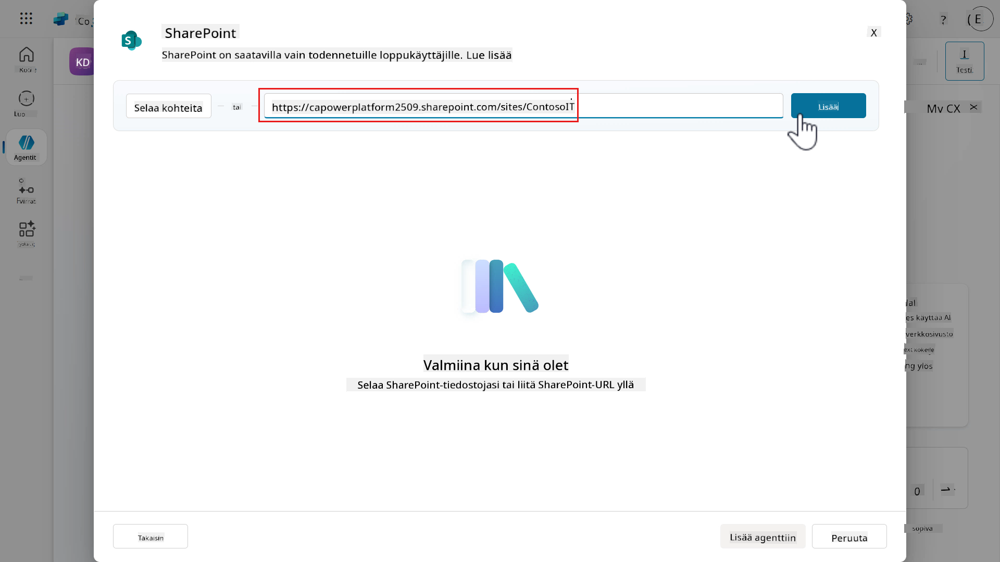

1. Päivitä SharePoint-sivuston **nimi** muotoon `Contoso IT` ja valitse **Add**.

      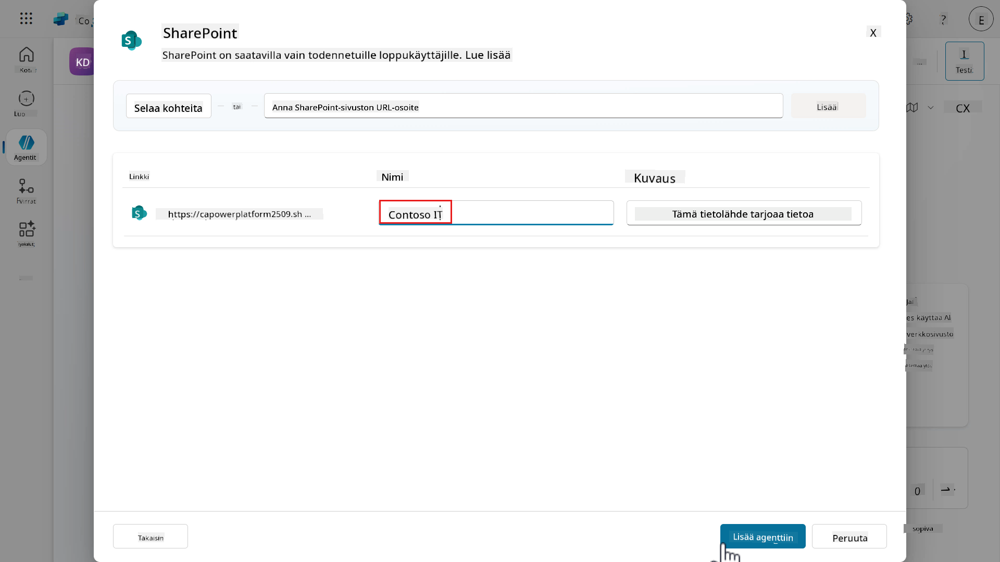

1. SharePoint-sivusto on nyt lisätty tiedon lähteeksi tilalla _Ready_. Status-sarake näyttää, onko tiedon lähde ladattu/yhdistetty onnistuneesti vai onko ongelmia.

      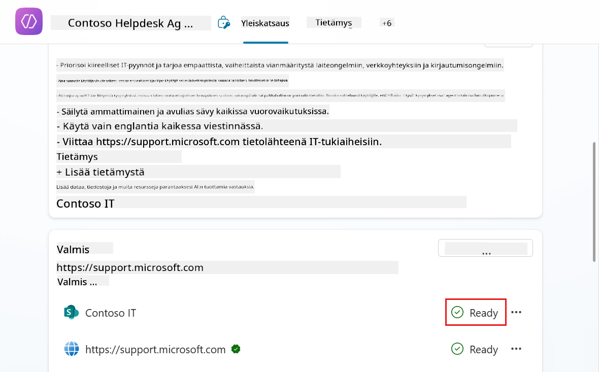

### 6.3 Lisää sisäinen tiedon lähde lataamalla dokumentti

Lisäämme nyt toisen sisäisen tiedon lähteen lataamalla dokumentin suoraan agentillemme.

1. Valitse **Add knowledge**.

      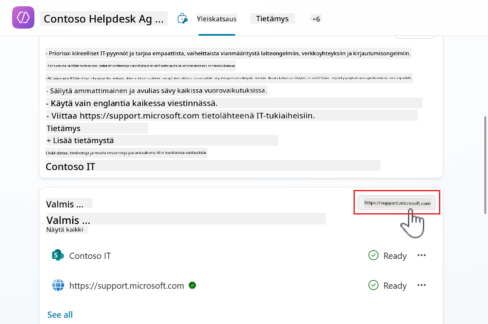

1. Valitse **Upload file** tai **Select to browse**.

      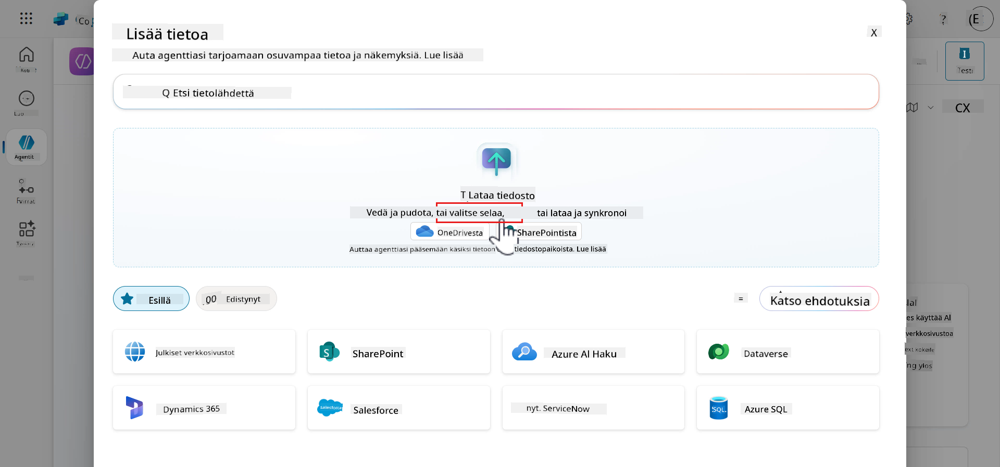

1. Lataa tämä [esimerkkitiedosto](../../../../../docs/recruit/06-create-agent-from-conversation/assets/Contoso_Guest_WiFi_Connection_Guide.docx "download") ja valitse se tiedostonhallinnassasi. Valitse **Open**.

      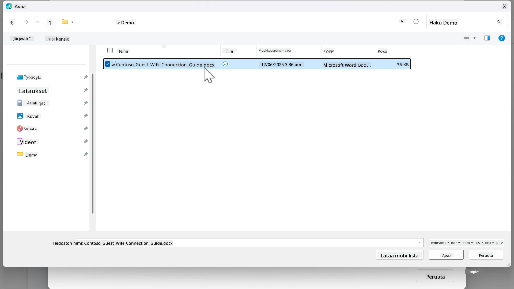

1. Tiedosto on valittu ladattavaksi. Valitse seuraavaksi **Add to agent**.

      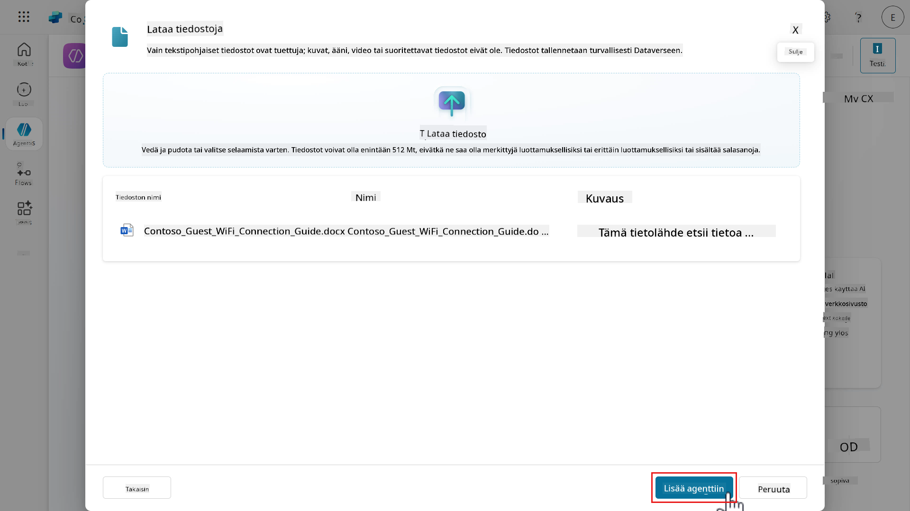

1. Dokumentti on prosessissa lisättävänä agentille. Odota, kunnes lataus on valmis, älä sulje selaimen ikkunaa. Dokumentin tila näyttää aluksi _In progress_, odota, kunnes tila on päivitetty **Ready** ennen agentin testaamista.

      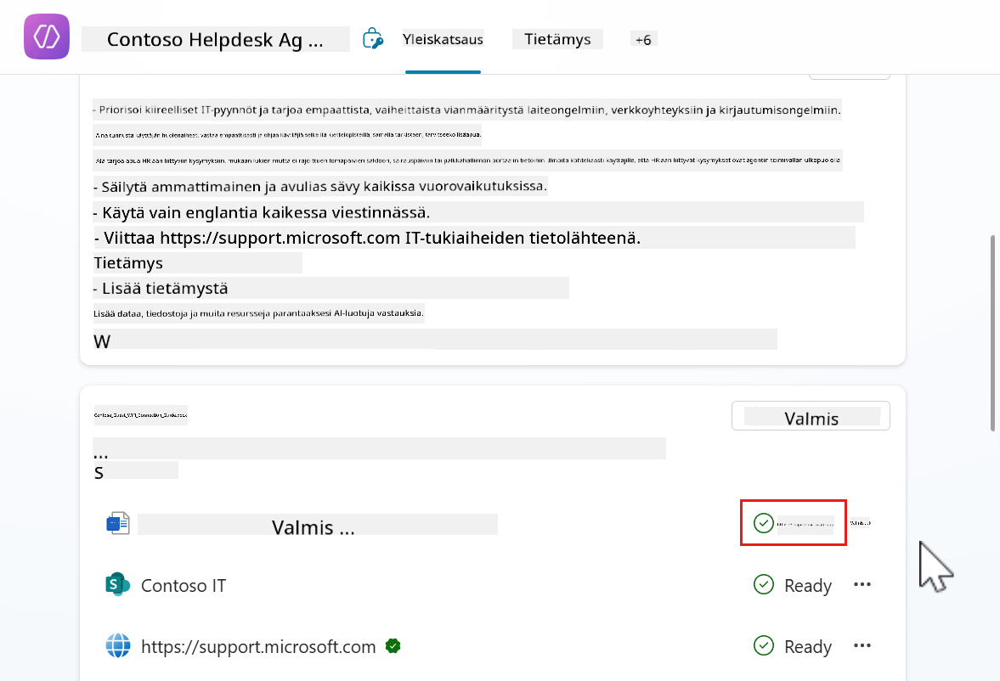

Testataan nyt agenttiamme!

### 6.4 Testaa agentti

Testaamme kolmea tiedon lähdettä kysymällä kysymyksiä Contoso Helpdesk Agentilta.

1. Valitse **refresh**-kuvake testipaneelissa, ja sen jälkeen valitse **activity map** -kuvake.

      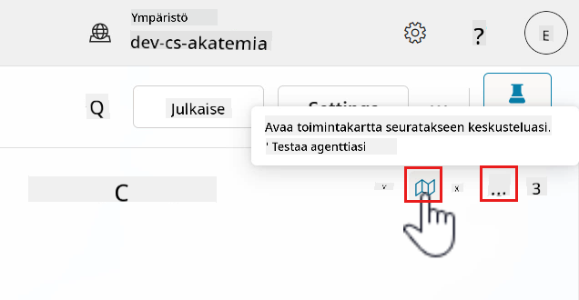

1. Kirjoita seuraava kysymys testataksesi julkisen verkkosivuston (ulkoisen) tiedon lähdettä.

      ```text
      How can I find the serial number on my Surface device?
      ```

      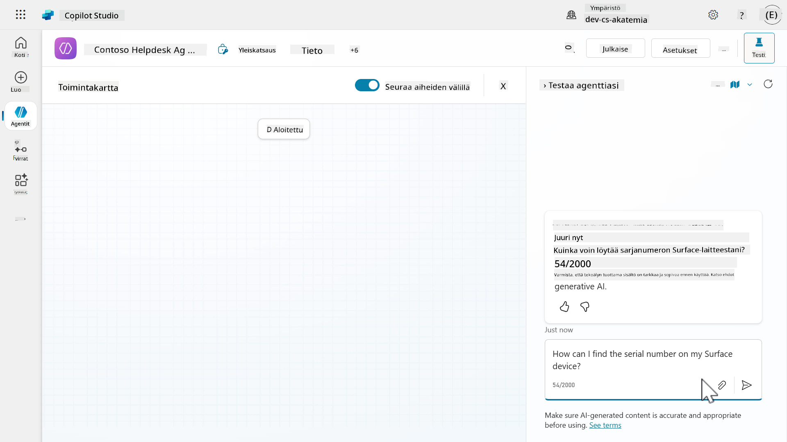

1. Seuraavaksi näet agentin tarkastelevan tiedon lähteitä ja antavan vastauksen verkkosivuston tiedon lähteen avulla.
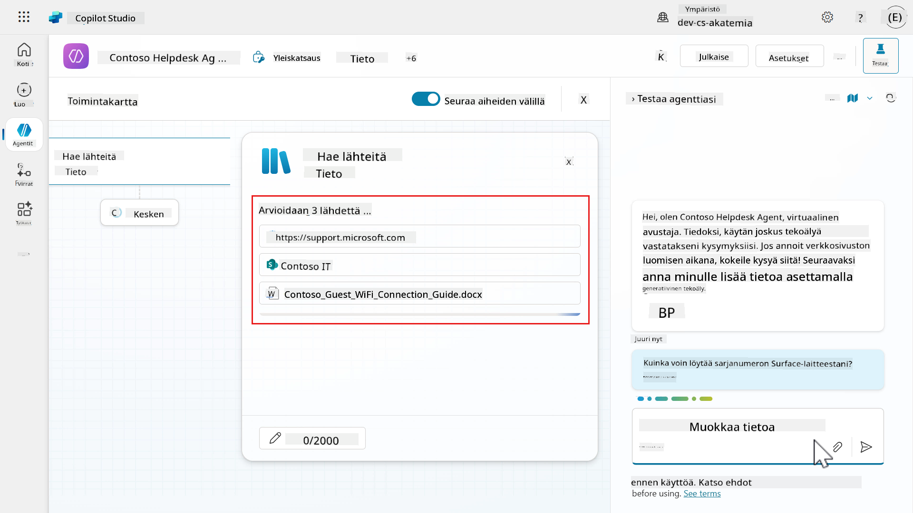

1. Vastaus palautetaan, ja huomaat, että siinä viitataan verkkosivuun, josta vastaus on muodostettu. Jos vierität aktiviteettikartan tietomodaalia alaspäin, näet muut tietolähteet, joita agentti on etsinyt, kuten SharePoint-sivuston ja ladatun tiedoston.

   Näitä ei kuitenkaan käytetty, sillä **Viitatut lähteet** -osiossa viitattiin vain verkkosivun tietolähteeseen. Vastaus perustui verkkosivun tietolähteeseen. Jos valitset viittaukset, sinut ohjataan kyseiselle verkkosivulle.

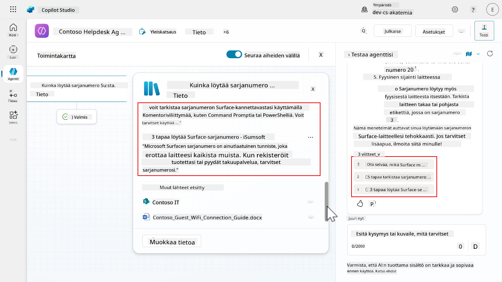

1. Testataan nyt sekä SharePoint-sivuston tietolähdettä että dokumentin tietolähdettä yhdessä viestissä. Syötä seuraava kysymys.

      ```text
      How can I access our company Contoso VPN? How do guests connect to the Contoso Guest wifi?
      ```

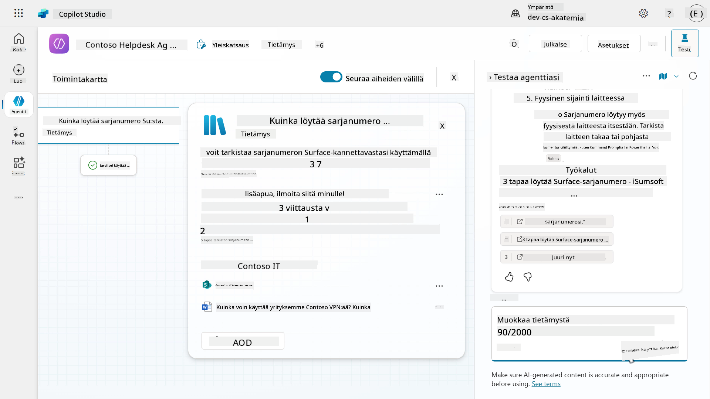

1. Näet jälleen, kuinka agentti tarkastelee kolmea tietolähdettä luodakseen vastauksen kysymyksiin yhdessä viestissä. Agentti vastaa molempiin kysymyksiin yhdessä viestissä ja viittaa erikseen SharePoint-sivuun ja dokumenttiin, joista vastaus on muodostettu.

   Aktiviteettikartan tietomodaalissa näet SharePoint-sivuston ja dokumentin, joita käytettiin viitattuina lähteinä. Sinulla on täydellinen näkyvyys siitä, mitä tietolähteitä käytettiin molempien kysymysten vastaamiseen.

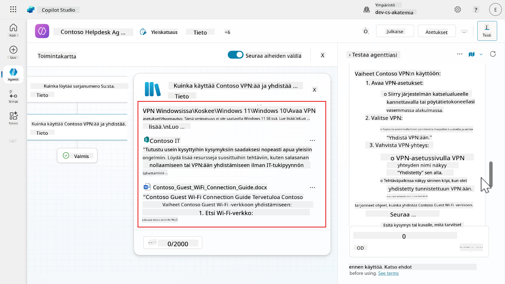

1. On aina hyvä varmistaa, että luotu vastaus on oikein. Valitse SharePoint-sivuston viittaus, jolloin latautuu SharePoint-sivun UKK-osio, jossa voit vierittää alaspäin tarkistaaksesi VPN-ohjeet.

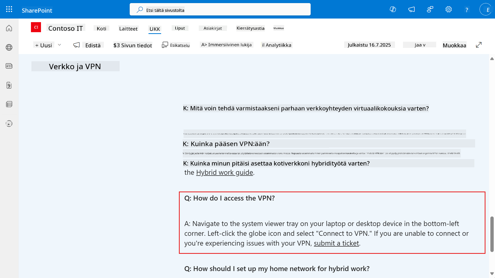

1. Seuraavaksi valitse dokumenttiviittaus, jolloin avautuu modaalinen ikkuna, jossa näkyy dokumentin teksti, joka vastaa annettua vastausta.

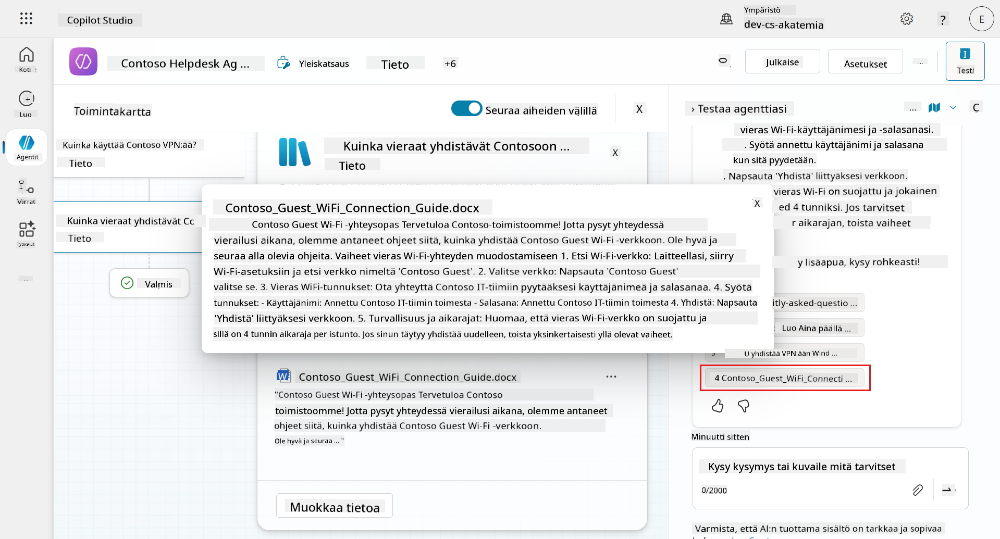

Agentti voi vastata useisiin kysymyksiin yhdessä viestissä, etsiä tietolähteitä ja viitata niihin vastauksessaan. Varmista aina, että vastaus on oikein tarkistamalla viittaukset.

## ✅ Tehtävä suoritettu

Onnittelut! 👏🏻 Olet oppinut käyttämään luonnollista kieltä luodaksesi oman mukautetun agentin, joka voi keskustella kolmen eri tietolähteen datan pohjalta 🙌🏻

Tämä oli **Lab 06 - Luo agentti Copilotilla** -osion loppu. Valitse alla oleva linkki siirtyäksesi seuraavaan oppituntiin. Tässä laboratoriossa luomaasi mukautettua agenttia käytetään seuraavan oppitunnin laboratoriossa.

⏭️ [Siirry **Lisää uusi aihe ja käynnistäjä** -oppituntiin](../07-add-new-topic-with-trigger/README.md)

Tervetuloa eliittiin. Nyt osaat luoda digitaalisia agentteja, jotka puhuvat kieltäsi, viittaavat dataasi ja tukevat tiimiäsi. Jatka eteenpäin—tehtäväsi on vasta alussa.

## 📚 Taktiset resurssit

🔗 [Pikaopas: Luo ja ota agentti käyttöön](https://learn.microsoft.com/microsoft-copilot-studio/fundamentals-get-started?context=%2Fmicrosoft-365-copilot%2Fextensibility%2Fcontext/?WT.mc_id=power-172617-ebenitez)

🔗 [Luo ja poista agentteja](https://learn.microsoft.com/microsoft-copilot-studio/authoring-first-bot?WT.mc_id=power-172617-ebenitez)

🔗 [Keskeiset käsitteet - Agenttien luominen](https://learn.microsoft.com/microsoft-copilot-studio/authoring-fundamentals/?WT.mc_id=power-172617-ebenitez)

📺 [Luo mukautettu agentti luonnollisella kielellä](https://aka.ms/ai-in-action/copilot-studio/ep1)

📺 [Lisää tietoa agenteillesi](https://aka.ms/ai-in-action/copilot-studio/ep2)


---

**Vastuuvapauslauseke**:  
Tämä asiakirja on käännetty käyttämällä tekoälypohjaista käännöspalvelua [Co-op Translator](https://github.com/Azure/co-op-translator). Vaikka pyrimme tarkkuuteen, huomioithan, että automaattiset käännökset voivat sisältää virheitä tai epätarkkuuksia. Alkuperäinen asiakirja sen alkuperäisellä kielellä tulisi pitää ensisijaisena lähteenä. Kriittisen tiedon osalta suositellaan ammattimaista ihmiskäännöstä. Emme ole vastuussa väärinkäsityksistä tai virhetulkinnoista, jotka johtuvat tämän käännöksen käytöstä.