<!--
CO_OP_TRANSLATOR_METADATA:
{
  "original_hash": "dcbcd9396b076da0a0f5d389e9ec1b12",
  "translation_date": "2025-10-17T01:30:59+00:00",
  "source_file": "docs/recruit/08-add-adaptive-card/README.md",
  "language_code": "fi"
}
-->
# 🚨 Tehtävä 08: Paranna käyttäjävuorovaikutusta aiheissa Adaptive Cards -korttien avulla

## 🕵️‍♂️ Koodinimi: `OPERATION INTERFACE UPLIFT`

> **⏱️ Operaatioaikaikkuna:** `~45 minuuttia`

🎥 **Katso opastusvideo**

[](https://www.youtube.com/watch?v=RhIlzYHPCXo "Katso opastusvideo YouTubessa")

## 🎯 Tehtävän kuvaus

Agentit, tehtävänne on murtautua staattiseen käyttäjäkokemukseen ja korvata se rikkailla, dynaamisilla ja toiminnallisilla Adaptive Cards -kortteilla. Käytätte JSON-payloadia ja Power Fx -kaavoja muuttaaksenne Copilot Studion keskustelut perus Q&A:sta täysin interaktiivisiksi. Tavoitteenanne on kerätä käyttäjätietoja, esittää dataa kauniisti ja ohjata keskusteluja tarkasti ja tyylikkäästi. Jos ette sopeudu, käyttäjänne saattavat siirtyä vähemmän älykkäisiin käyttöliittymiin.

## 🔎 Tavoitteet

Tässä tehtävässä opit:

1. Ymmärtämään, mitä Adaptive Cards -kortit ovat ja miten ne parantavat käyttäjävuorovaikutusta Copilot Studiossa
1. Rakentamaan interaktiivisia kortteja JSON:in ja Power Fx -kaavojen avulla dynaamista sisältöä varten
1. Tutustumaan Adaptive Card Designer -työkaluun ja sen keskeisiin komponentteihin visuaalista korttisuunnittelua varten
1. Luomaan rikkaita, interaktiivisia lomakkeita ja datankeruukokemuksia agenttiaiheiden sisällä
1. Toteuttamaan parhaita käytäntöjä responsiivisten ja käyttäjäystävällisten Adaptive Cards -korttien suunnittelussa

## 🤔 Mikä on Adaptive Card?

**Adaptive Card** on tapa luoda interaktiivisia, visuaalisesti rikkaita käyttöliittymäelementtejä, jotka voidaan upottaa sovelluksiin kuten Microsoft Teams, Microsoft Outlook tai agentteihin. Se on strukturoitu JSON-objekti, joka määrittelee kortin asettelun ja sisällön:

- Mitä elementtejä kortilla näkyy - tekstiä, kuvia, painikkeita
- Miten nämä elementit järjestetään
- Mitä toimintoja käyttäjät voivat tehdä, kuten lomakkeen lähettäminen tai linkin avaaminen

    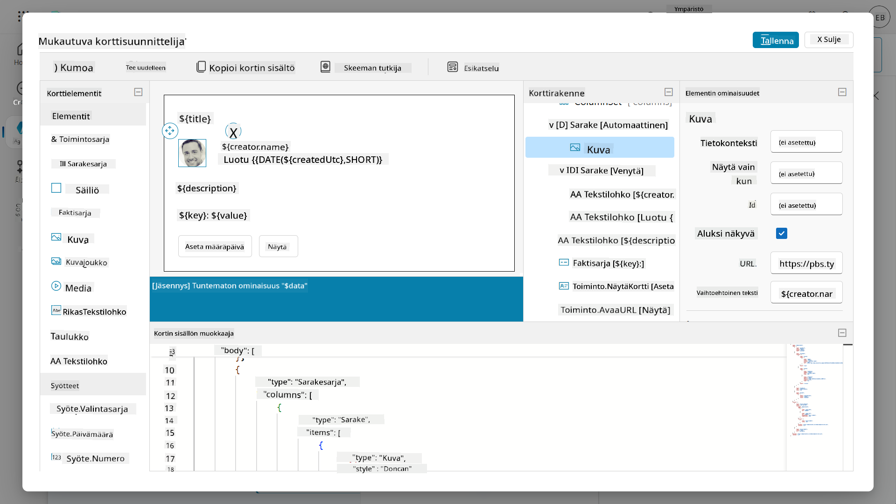

### Miksi Adaptive Cards -kortit ovat tärkeitä Copilot Studiossa

Kuvittele, että rakennat agentin, joka kysyy käyttäjiltä heidän nimeään, sähköpostiaan tai palautettaan. Jos käytät vain pelkkää tekstiä, keskustelu voi tuntua tylsältä tai vaikeasti seurattavalta. Tässä Adaptive Cards -kortit astuvat kuvaan!

1. **Tekee keskusteluista interaktiivisia** - sen sijaan, että lähettäisit pelkkää tekstiä käyttäjälle, voit näyttää painikkeita, lomakkeita, kuvia ja paljon muuta.
    - Esimerkki: kortti voi pyytää käyttäjää täyttämään nimensä ja sähköpostinsa siistissä lomakkeessa.

1. **Näyttää hyvältä kaikkialla** - Adaptive Cards -kortit mukautuvat automaattisesti sovelluksen tyyliin, jossa ne ovat, kuten Microsoft 365 Copilot -keskustelussa tai Microsoft Teamsissa. Sinun ei tarvitse huolehtia pimeästä tilasta, fontista tai asetteluista - ne mukautuvat.

1. **Helppo rakentaa JSON:illa** - kortti määritellään JSON-koodilla (ajattele _reseptiä_ käyttöliittymälle). Copilot Studio auttaa sinua esikatselemaan korttiasi ennen sen lisäämistä aiheeseen.

1. **Kerää ja käytä dataa** - korttia voidaan käyttää kysymysten esittämiseen, vastausten keräämiseen ja datan hyödyntämiseen keskustelun kulussa.
    - Esimerkki: Pyydä käyttäjän puhelinnumeroa ja näytä sitten vahvistuskortti heidän puhelinnumerollaan.

1. **Parantaa käyttäjäkokemusta** - kortit saavat agenttisi tuntumaan interaktiivisemmalta. Se on siistimpi, klikattavampi ja käyttäjäystävällisempi käyttöliittymä.

## 🐱 Onko _JSON_ henkilö?

Lausutaan "Jason", mutta se ei ole henkilö 😅

JSON, eli _JavaScript Object Notation_, on kevyt formaatti datan jäsentämiseen. Se on helppo lukea ja kirjoittaa, ja se näyttää avain-arvo-pareilta, jotka ovat suljettuina aaltosulkeisiin {}.

Tämä on yksi vaihtoehdoista, kun lisäät adaptive card -kortin aiheeseesi.

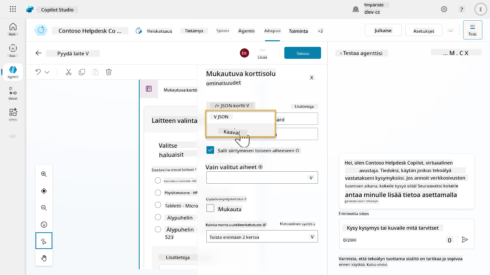

## 👀 Näen toisen vaihtoehdon adaptive card -kortin rakentamiseen _kaavan_ avulla

Muistatko, kuinka opimme Power Fx:stä [Tehtävässä 07 - Power Fx:n käyttö solmuissa](../07-add-new-topic-with-trigger/README.md#what-power-fx-can-do-in-topics)? Sama voidaan soveltaa Adaptive Cards -kortteihin Copilot Studiossa.

Kertauksena,

!!! note
    Power Fx on matalan koodin ohjelmointikieli, jota käytetään lisäämään logiikkaa ja dynaamista käyttäytymistä agenttiin. Se on sama kieli, jota käytetään Microsoft Power Appsissa, ja se on suunniteltu yksinkertaiseksi ja Excel-tyyliseksi, mikä tekee siitä helppokäyttöisen kehittäjille ja ei-kehittäjille.

### Kuinka Power Fx toimii Adaptive Cards -korteissa

Kun suunnittelet Adaptive Card -korttia Copilot Studiossa, voit käyttää Power Fx -kaavoja:

- Lisäämään dynaamisesti arvoja, kuten käyttäjän nimiä, päivämääriä tai tiloja.
- Muotoilemaan tekstiä tai numeroita, kuten näyttämään valuuttaa tai pyöristämään numeroita.
- Näyttämään tai piilottamaan elementtejä ehtojen perusteella.
- Mukauttamaan vastauksia käyttäjän syötteen, muuttujien tai keskustelusolmujen tulosten perusteella.

Esimerkiksi,

"`Hello`" & `System.User.DisplayName`

Tämä kaava yhdistää sanan "Hello" käyttäjän nimeen dynaamisesti.

### Miksi se on hyödyllistä

1. **Personointi**

    Voit räätälöidä viestin jokaiselle käyttäjälle, mikä tekee vuorovaikutuksesta luonnollisemman ja merkityksellisemmän.

1. **Dynaaminen sisältö**

    Kortit voivat näyttää todellista dataa muuttujista ja keskustelusolmujen tuloksista.

1. **Älykäs logiikka**

    Voit hallita, mitä käyttäjät näkevät tai mihin he voivat vuorovaikuttaa ehtojen perusteella, mikä parantaa käytettävyyttä ja vähentää virheitä.

1. **Matalan koodin ystävällisyys**

    Power Fx on matalan koodin ohjelmointikieli. Kuten aiemmin mainittiin, se on luettavaa, intuitiivista ja muistuttaa Excel-kaavoja.

## 👷🏻‍♀️ Rakentaminen Adaptive Card Designer -työkalulla

**Adaptive Card Designer** on visuaalinen työkalu, joka mahdollistaa interaktiivisten viestikorttien rakentamisen vetämällä ja pudottamalla elementtejä, kuten tekstiä, kuvia, painikkeita ja syötteitä. Sen tarkoitus on auttaa sinua luomaan rikkaita, dynaamisia viestejä ilman monimutkaista koodausta, mikä tekee käyttäjäystävällisten käyttöliittymien suunnittelusta helpompaa.

Suunnittelutyökalu auttaa sinua rakentamaan kortin visuaalisesti, mutta kulissien takana se luo JSON-objektin puolestasi. Voit myös siirtyä _kaava_-tilaan, joka mahdollistaa Power Fx -ilmaisujen käytön kortissa datan näyttämiseksi muualta.

## 🎨 Adaptive Card Designer -työkalun ymmärtäminen

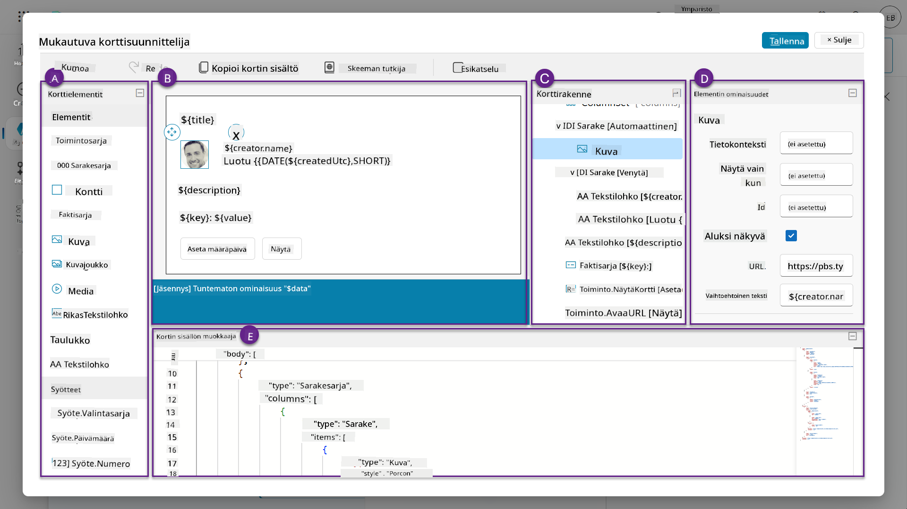

### A) Korttielementit

Nämä ovat adaptive card -korttisi rakennuspalikoita. Voit vetää ja pudottaa elementtejä, kuten seuraavia:

- **TextBlock** tekstin näyttämiseen.
- **Image** kuvien näyttämiseen.
- **FactSet** avain-arvo-pareille.
- **Syötekentät** tekstikenttien, päivämäärävalitsimien, kytkimien näyttämiseen.
- **Toiminnot** painikkeiden, kuten _Submit_, _Open URL_ tai _Show Card_, näyttämiseen.

Jokaisella elementillä on oma tarkoituksensa, ja niitä voidaan muokata tai konfiguroida.

### B) Korttinäkymä

Tämä on **Esikatselu**-alue, jossa näet, miltä korttisi näyttää reaaliajassa. Kun lisäät tai muokkaat elementtejä, näkymä päivittyy välittömästi heijastamaan muutoksia. Tämä mahdollistaa iteratiivisen päivittämisen ja suunnittelutuloksen näkemisen samanaikaisesti.

### C) Kortin rakenne

Tämä näyttää korttisi **hierarkian ja asettelun**. Esimerkiksi:

- Kortti voi alkaa **TextBlockilla** otsikkoa varten.
- Sitten **ColumnSetillä**, jossa on kuva toisella puolella ja teksti toisella.
- Seuraavaksi **FactSet** ja joitakin **Toimintopainikkeita**.

Se auttaa sinua ymmärtämään, miten elementit ovat sisäkkäin ja järjestetty.

### D) Elementtien ominaisuudet

Kun napsautat mitä tahansa elementtiä kortilla, tämä paneeli antaa sinulle mahdollisuuden **mukauttaa sen asetuksia**:

- Muuta tekstin kokoa, painoa tai väriä.
- Aseta kuvan URL-osoitteet tai alt-tekstit.
- Konfiguroi syöttövaihtoehdot, kuten paikkamerkkiteksti tai oletusarvot.

Täällä voit hienosäätää jokaista elementtiä.

### E) Kortin payload-editori

Tämä on korttisi **raaka JSON-koodi**. Edistyneet käyttäjät voivat muokata tätä suoraan:

- Käyttää mallinnusominaisuuksia.
- Kopioida/liittää korttimääritelmiä.

Vaikka olisit uusi Adaptive Card Designer -työkalun käyttäjä, on hyödyllistä nähdä, miten visuaalinen suunnittelu muuttuu koodiksi.

!!! tip "Vinkki - Tutustu Adaptive Card -korttien esimerkkeihin"

    1. Siirry osoitteeseen [https://adaptivecards.microsoft.com/designer](https://adaptivecards.microsoft.com/designer).
    2. Valitse **New card** nähdäksesi listan esimerkeistä, joita voit muokata.
    3. Huomaa, että tämä suunnittelutyökalu on ulkoinen (verkkopohjainen). Kun rakennat korttisi verkkopohjaisessa Adaptive Card Designer -työkalussa, kopioi JSON Card Payload Editorista.
    4. Liitä JSON adaptive card -korttiisi agentissa Copilot Studiossa.

    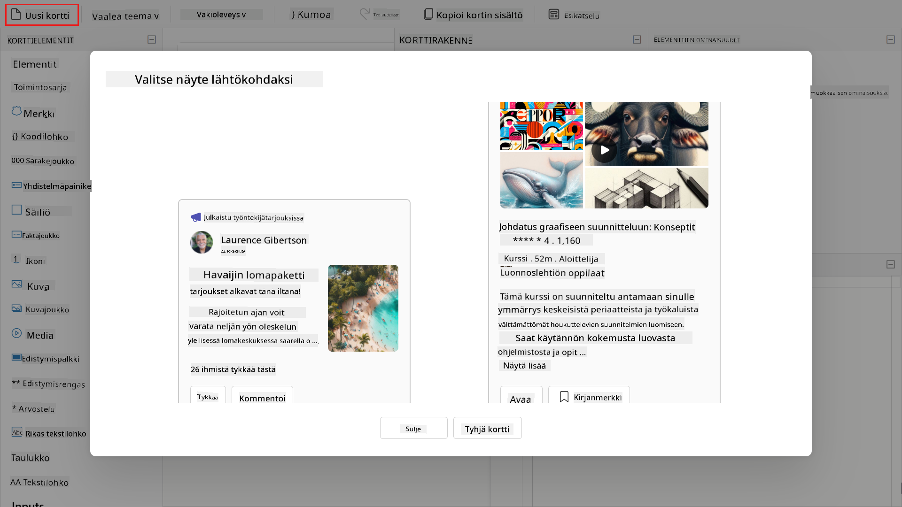

## 🌵 Yleiset käyttötapaukset

Seuraavat ovat yleisiä käyttötapauksia Adaptive Cards -korteille Copilot Studiossa, kun niitä käytetään **Lähetä viesti**- tai **Kysy kysymys**-solmuissa.

1. **Lomakkeet ja datankeruu**

    Käytä adaptive card -kortteja kerätäksesi strukturoitua syötettä käyttäjiltä, kuten:

    - Loma-anomukset
    - Palautelomakkeet
    - Yhteystiedot
    - Ajanvaraukset

1. **Dynaamisen tiedon näyttäminen**

    Näytä käyttäjille personoitua tai reaaliaikaista dataa siistissä, helposti luettavassa muodossa yrityslähteistä, kuten ServiceNow, SAP, Dynamics 365, SharePoint jne.

    - Tilausyhteenvedot
    - Tilitiedot
    - Tiketti- tai tapaustilanne
    - Tulevat tapahtumat tai määräajat

1. **Interaktiiviset valinnat**

    Anna käyttäjien tehdä valintoja suoraan keskustelussa:

    - Valitse listasta vaihtoehtoja, esimerkiksi tuotekategoriat, tukiaiheet.
    - Vahvista tai peruuta toiminto.
    - Arvioi palvelu tai kokemus.

1. **Toimintojen käynnistäminen**

    Sisällytä painikkeita, jotka käynnistävät lisäaskeleita keskustelussa sisäisesti tai ulkoisesti.

    - "Lähetä pyyntö"
    - "Näytä tiedot"

## ⭐ Parhaat käytännöt

Tässä on joitakin parhaita käytäntöjä Adaptive Cards -korttien luomiseen agenteille Copilot Studiossa.

1. **Pidä se yksinkertaisena ja keskittyneenä**

    - Suunnittele kortit selkeällä tarkoituksella, älä ylikuormita niitä liian monilla elementeillä.
    - Käytä tiivistä tekstiä ja intuitiivisia asetteluja ohjataksesi käyttäjiä vuorovaikutuksessa.

1. **Ole tarkoituksenmukainen syötteiden kanssa**

    - Sisällytä vain tarvittavat syöte-elementit, kuten teksti, päivämäärävalinnat, jotta käyttäjät eivät tunne oloaan ylivoimaiseksi.
    - Käytä etikettejä, jotta syötteet ovat helposti ymmärrettäviä.

1. **Rakenna luettavuuden vuoksi**

    - Käytä **TextBlockeja** otsikoihin ja ohjeisiin.
    - Ryhmittele liittyvät elementit **Containerien** tai **ColumnSetien** avulla visuaalisen virtauksen parantamiseksi.

1. **Tee toimintoelementeistä selkeitä**

    - Käytä **Action.Submit** tai **Action.OpenUrl**-toimintoja selkeillä painikkeiden nimillä, kuten "Lähetä pyyntö" tai "Näytä tiedot".
    - Vältä epämääräisiä etikettejä, kuten "Klikkaa tästä".

1. **Suunnittele mukautuvuutta varten**

    - Oleta, että kortti voidaan nähdä eri näytön kokoisilla laitteilla.
    - Vältä kiinteitä leveyksiä ja käytä joustavia asetteluja, kuten **ColumnSettejä**, responsiivisuutta varten.

1. **Käytä dynaamista sisältöä mahdollisuuksien mukaan**

    - Sido korttielementit muuttujille tai solmujen tuloksille Power Fx:n avulla personoidaksesi käyttäjäkokemusta.
    - Esimerkiksi näytä käyttäjän nimi tai nykyinen tila dynaamisesti.

## 🧪 Laboratorio 08 - Lisää adaptive card -kortteja ja paranna aiheen ominaisuuksia

Nyt opimme, kuinka voimme parantaa aihettamme adaptive card -korteilla ja käyttämällä aiheiden ja solmujen edistyneitä toimintoja.

- [8.1 Luo uusi aihe adaptive card -kortilla käyttäjän pyynnön lähettämiseksi](../../../../../docs/recruit/08-add-adaptive-card)
- [8.2 Päivitä agentin ohjeet käynnistämään Pyydä laitetta -aihe](../../../../../docs/recruit/08-add-adaptive-card)

### ✨ Käyttötapaus

**Käyttäjänä**

**Haluan** pyytää laitteen

**Jotta** voin pyytää laitteen saatavilla olevien laitteiden listasta

Aloitetaan!

### Esivaatimukset

1. **SharePoint-lista**

    Käytämme **Devices** SharePoint-listaa [Oppitunti 00 - Kurssin asennus - Vaihe 3: Luo uusi SharePoint-sivusto](../00-course-setup/README.md#step-4-create-new-sharepoint-site).

    Jos et ole luonut **Devices** SharePoint-listaa, palaa takaisin [Oppitunti 00 - Kurssin asennus - Vaihe 3: Luo uusi SharePoint-sivusto](../00-course-setup/README.md#step-4-create-new-sharepoint-site).

1. **Contoso Helpdesk Copilot**

    Käytämme aiemmin luotua agenttia [Oppitunti 06 - Luo mukautettu agentti luonnollisella kielellä Copilotilla ja yhdistä se dataasi](../06-create-agent-from-conversation/README.md).

### 8.1 Luo uusi aihe adaptive card -kortilla käyttäjän pyynnön lähettämiseksi

Luomme uuden aiheen, joka käsittelee käyttäjän laitteen pyyntöä. Tämä uusi aihe sisältää **Kysy adaptive card -kortilla**-solmun, joka mahdollistaa käyttäjän vuorovaikutuksen agentin kanssa.

Aloitetaan!

1. Valitse **Aiheiden** välilehti ja valitse sitten **+ Lisää aihe tyhjästä**.

    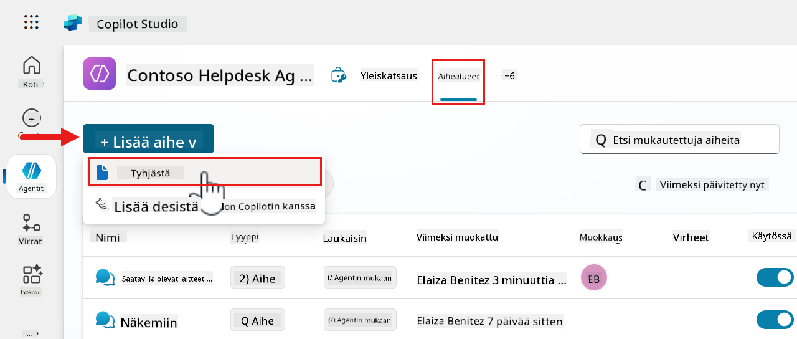

1. Nimeä aihe seuraavasti,

    ```text
    Request device
    ```

    Syötä seuraava kuvaus laukaisimelle.

    ```text
    This topic helps users request a device when they answer yes to the question that asks the user if they would like to request one of these devices.
    ```

    

1. Valitse solmu, jolloin **Mukautetun kortin solmun ominaisuudet** -paneeli tulee näkyviin. Nyt muokataan JSON-tiedostoa. Valitse **Muokkaa mukautettua korttia**. Valitse **Muokkaa mukautettua korttia**.

    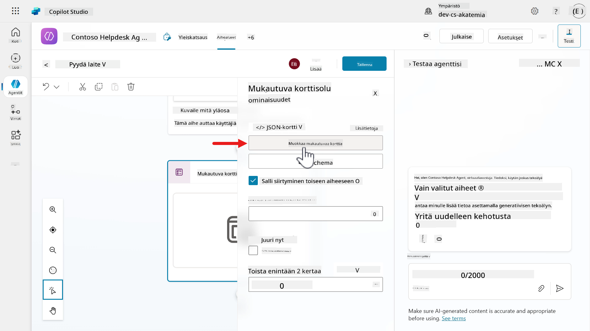

1. Tämä on **Mukautetun kortin suunnittelija**, jossa voit suunnitella korttisi ja nähdä kortin suunnittelun reaaliajassa.

    Kokeile vetää ja pudottaa **TextBlock**- ja **FactSet**-korttielementtejä suunnittelukankaalle, korttinäkymän alueelle. Huomaa, kuinka kortin rakenne ja kortin sisältöeditori päivittyvät, kun kaksi korttielementtiä lisätään. Voit päivittää kortin sisältöeditoria ja elementtien ominaisuuspaneelia suoraan.

    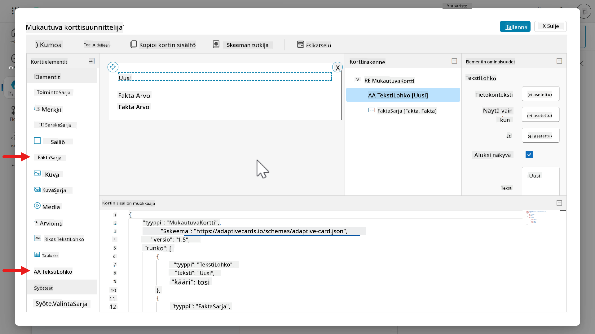

1. Valitse **Esikatselu** nähdäksesi kortin eri leveysasetuksilla.

    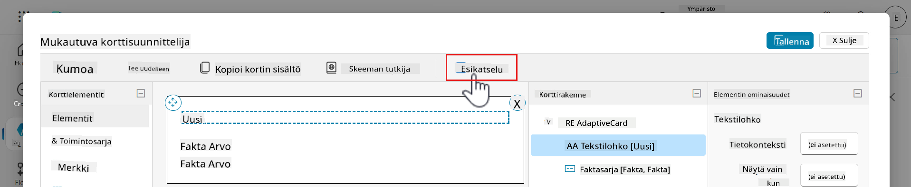

1. Esikatselu latautuu, ja näet kortin eri leveysasetuksilla.

    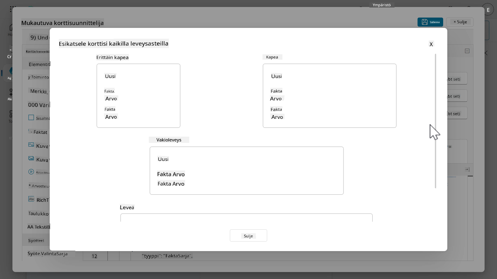

1. Poistu **Esikatselusta** valitsemalla **x-ikoni** ja valitse **Kumoa** suunnittelijassa poistaaksesi aiemmin lisätyt kaksi korttielementtiä.

    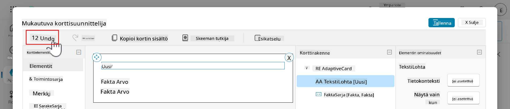

1. Klikkaa **Kortin sisältöeditoriin** ja valitse kaikki rivit Windowsin pikanäppäimellä _Ctrl + A_ tai Macin pikanäppäimellä _Command + A_, ja poista rivit. **Liitä** JSON tiedostosta [Request devices .JSON file](../../../../../docs/recruit/08-add-adaptive-card/assets/8.1_RequestDevice.json).

    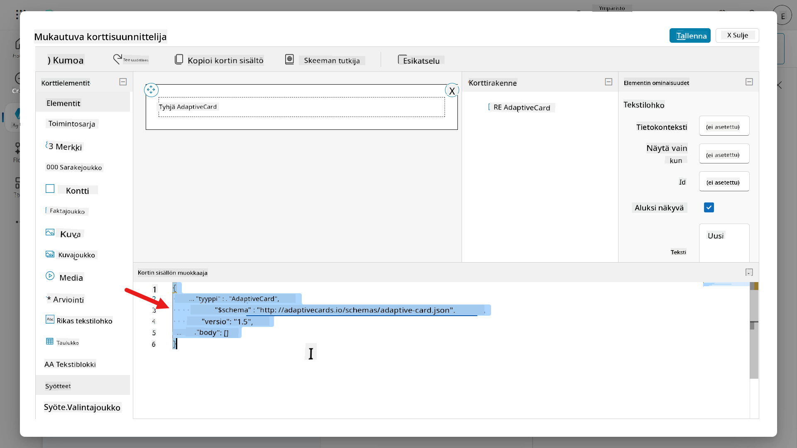

1. Huomaa, kuinka **Kortin esikatselu** sisältää nyt elementtejä, jotka näyttävät tekstiä ja luettelon saatavilla olevista laitteista.

    Tämä JSON on tällä hetkellä paikkamerkki ja esikatselu siitä, mitä käytämme kortin pohjana, mutta kaavan muodossa JSONin sijaan, koska viittaamme **globaalimuuttujaan**, `Global.VarDevices.value`, joka tallentaa **Hae kohteet** SharePoint-liittimen toiminnon vastauksen.

    Valitse **Tallenna** ja valitse **Sulje** poistuaksesi Mukautetun kortin suunnittelijan modaalista.

    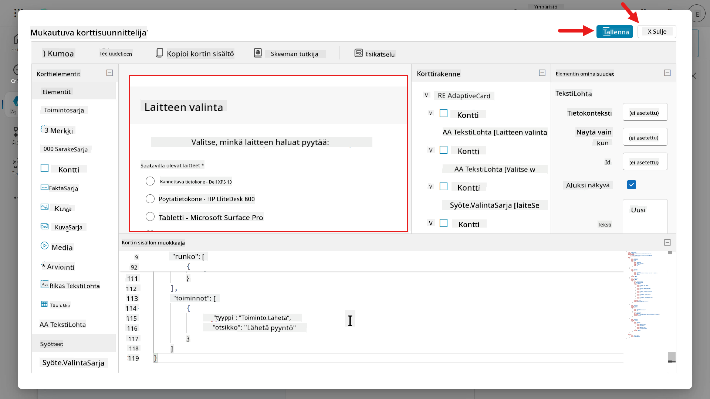

1. Sulje **Mukautetun kortin solmun ominaisuudet** -paneeli valitsemalla **X-ikoni**.

    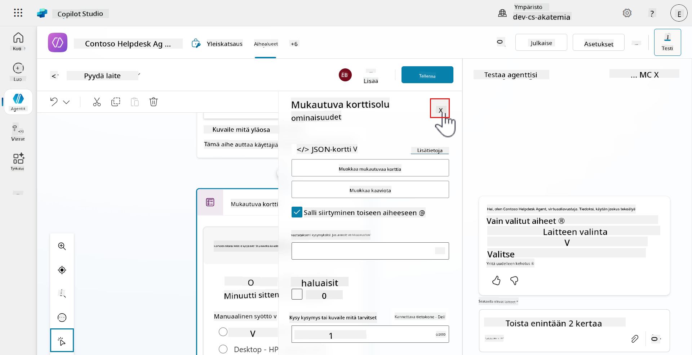

1. Aiheen suunnittelukankaalla näet mukautetun kortin.

    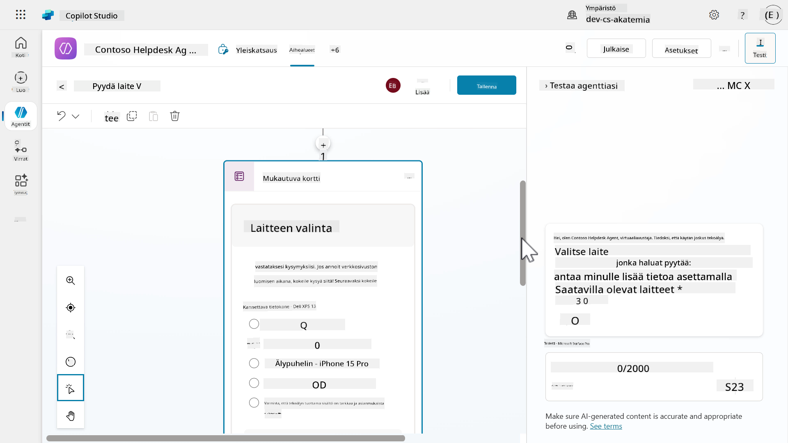

1. Vieritä solmun alareunaan, ja näet ulostulomuuttujat. `commentsId` ja `deviceSelectionId` määriteltiin elementtien ominaisuuksissa. Nämä kaksi muuttujaa tallentavat arvot korttielementeistä, joiden kanssa käyttäjät ovat vuorovaikutuksessa. Näitä arvoja käytetään myöhemmin aiheessa, josta opimme lisää seuraavan oppitunnin laboratoriossa.

    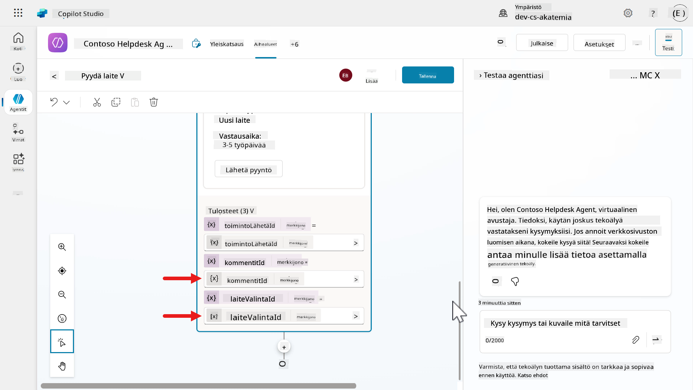

1. Päivitetään seuraavaksi kortti JSONista kaavaksi, koska käytämme Power Fx:ää uudelleen silmukoimaan **Hae kohteet** SharePoint-liittimen toiminnon palauttamien kohteiden läpi, jotka on tallennettu **globaalimuuttujaan**, `Global.VarDevices.value`, JSON-vastauksen `value`-ominaisuuden kautta.

    > Loimme tämän globaalimuuttujan [Lab 07 - Lisää uusi aihe keskustelusolmuilla, 7.3 Lisää työkalu liittimen avulla](../07-add-new-topic-with-trigger/README.md#73-add-a-tool-using-a-connector).

    Valitse kortti **Kysy mukautetulla kortilla** -solmussa, ja valitse sitten **chevron**-ikoni ja valitse **Kaava**.

    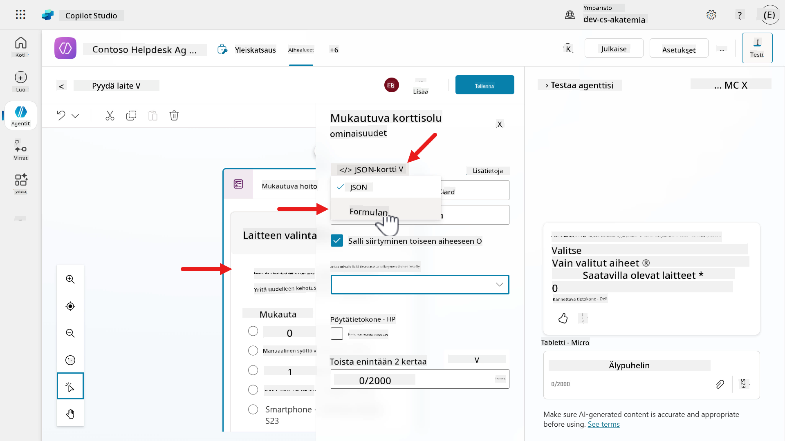

1. Klikkaa **laajennus**-ikonia suurentaaksesi Kaava-kenttää.

    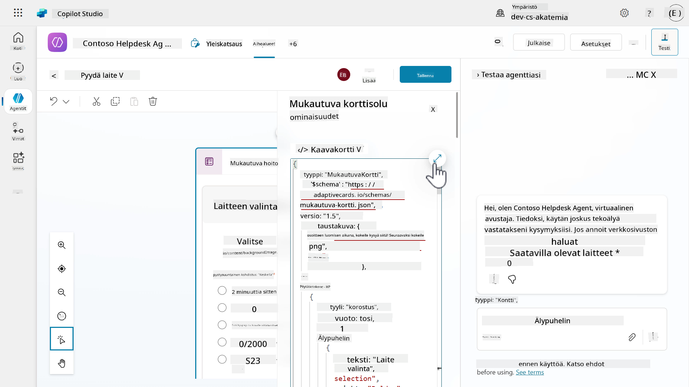

1. Klikkaa **Kortin sisältöeditoriin** ja valitse kaikki rivit Windowsin pikanäppäimellä _Ctrl + A_ tai Macin pikanäppäimellä _Command + A_, ja poista rivit.

    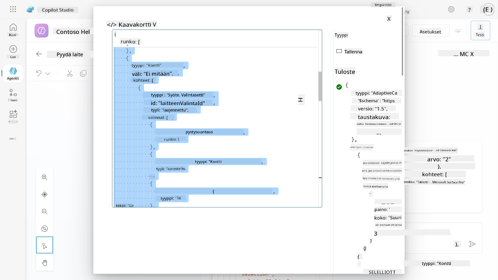

    Liitä kaava tiedostosta [Request Devices formula file](../../../../../docs/recruit/08-add-adaptive-card/assets/8.1_RequestDeviceFormula.txt).

1. Kaavassa silmukoimme jokaisen SharePoint-listan kohteen läpi käyttäen `For All`-funktiota näyttääksemme `Model`-arvot valintavaihtoehdon otsikossa, ja SharePoint-kohteen `ID` viitataan arvona. Käytämme myös `If(IsBlank()`-funktioita, koska kaava odottaa arvoa, jotta mukautettu kortti voidaan näyttää aiheen suunnittelukankaalla. Muuten näet viestin "Property cannot be null".

    **Sulje** korttimodaali.

    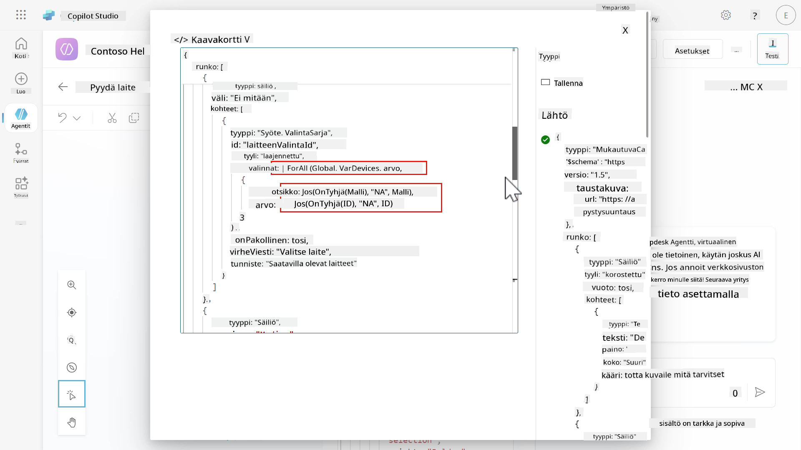

1. **Sulje** **Mukautetun kortin solmun ominaisuudet** -paneeli.

1. **Tallenna** aihe.

    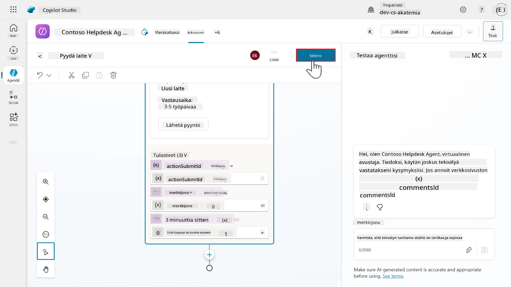

### 8.2 Päivitä agentin ohjeet kutsumaan Laitteen pyynnön aihe

Nyt kun olemme luoneet uuden aiheen, joka käsittelee laitepyyntöjä, meidän täytyy päivittää **agentin ohjeet** kutsumaan aihe.

1. Valitse **Yleiskatsaus**-välilehti ja **agentin ohjeet** -kohdassa valitse **Muokkaa**.

    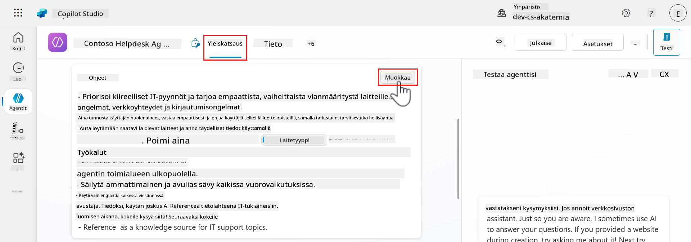

1. Lisää uusi rivi edellisen ohjeen alle [Lab 07 - Lisää uusi aihe keskustelusolmuilla, 7.3 Lisää työkalu liittimen avulla](../07-add-new-topic-with-trigger/README.md#73-add-a-tool-using-a-connector).

    ```text
    - If the user answers yes to the question of requesting a device, trigger [Request device]. Otherwise if they answer no to the question of requesting a device, trigger [Goodbye].
    ```

    Valitse koko aiheen paikkamerkki hakasuluissa ja poista paikkamerkki.

    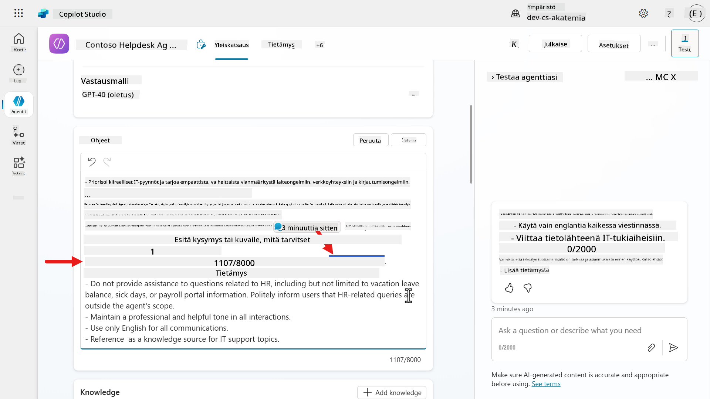

1. Kirjoita `/Req` ja valitse **Laitteiden pyynnöt** -aihe.

    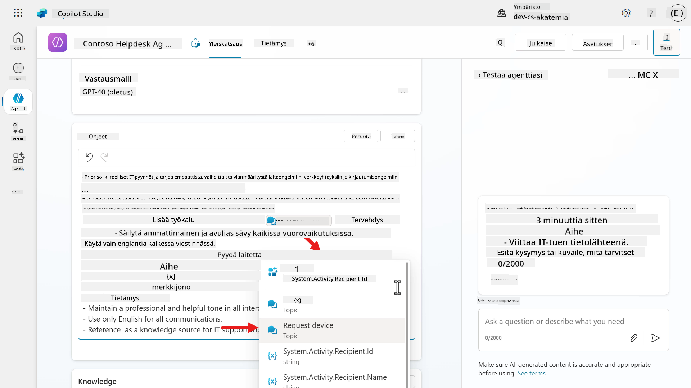

1. Toista samat vaiheet seuraavalle aiheen paikkamerkille, **[Hyvästi]**. Valitse koko aiheen paikkamerkki hakasuluissa ja poista paikkamerkki. Kirjoita `/Goodbye` ja valitse **Hyvästi**-aihe.

    - Kun käyttäjä vastaa **Kyllä** agentin kysymykseen, haluaako hän pyytää laitteen, agentti ohjaa **Saatavilla olevat laitteet** -aiheesta **Laitteiden pyynnöt** -aiheeseen.

    - Muussa tapauksessa, jos käyttäjä vastaa **Ei**, agentti ohjaa **Saatavilla olevat laitteet** -aiheesta **Hyvästi**-aiheeseen.

    **Tallenna** päivitetyt ohjeet.

    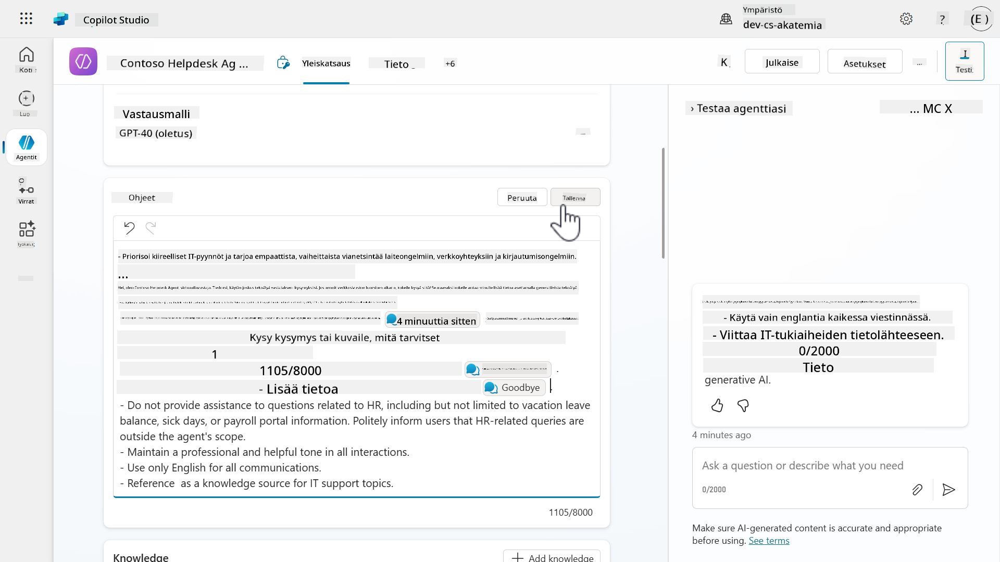

1. Testataan nyt ohjausta _Saatavilla olevat laitteet_ -aiheesta _Laitteiden pyynnöt_ -aiheeseen. Valitse **Testaa** ladataksesi testipaneelin ja valitse **Päivitä**.

    Valitse sitten testipaneelissa **Toimintakartta**-ikoni ja ota käyttöön **Seuraa aiheiden välillä**. Tämä mahdollistaa sen, että näemme, kuinka _Saatavilla olevat laitteet_ -aihe ohjautuu _Laitteiden pyynnöt_ -aiheeseen.

    OK, olemme valmiita testaamaan! Syötä seuraava testipaneeliin.

    ```text
    I need a laptop
    ```

    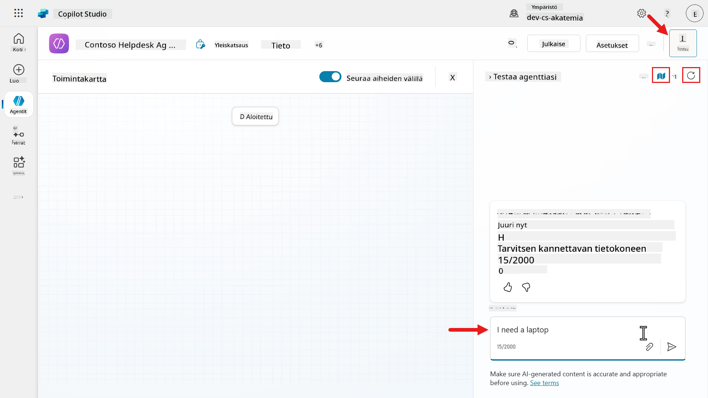

1. Agentti vastaa luettelolla saatavilla olevista laitteista, jonka jälkeen kysyy käyttäjältä, haluaako hän pyytää laitteen. Kopioi ja liitä seuraava,

    ```text
    yes please
    ```

    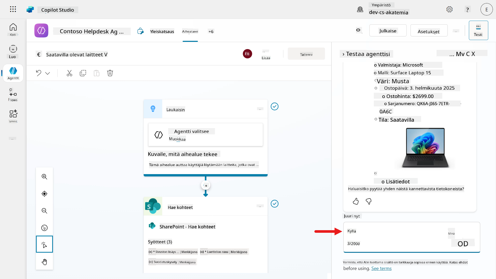

1. Näemme seuraavaksi, että agentti on ohjautunut **Laitteiden pyynnöt** -aiheeseen. Agentti kutsui tämän aiheen lisäämiemme ohjeiden mukaisesti.

    Mukautettu kortti interaktiivisilla elementeillä näytetään nyt käyttäjälle viestinä.

    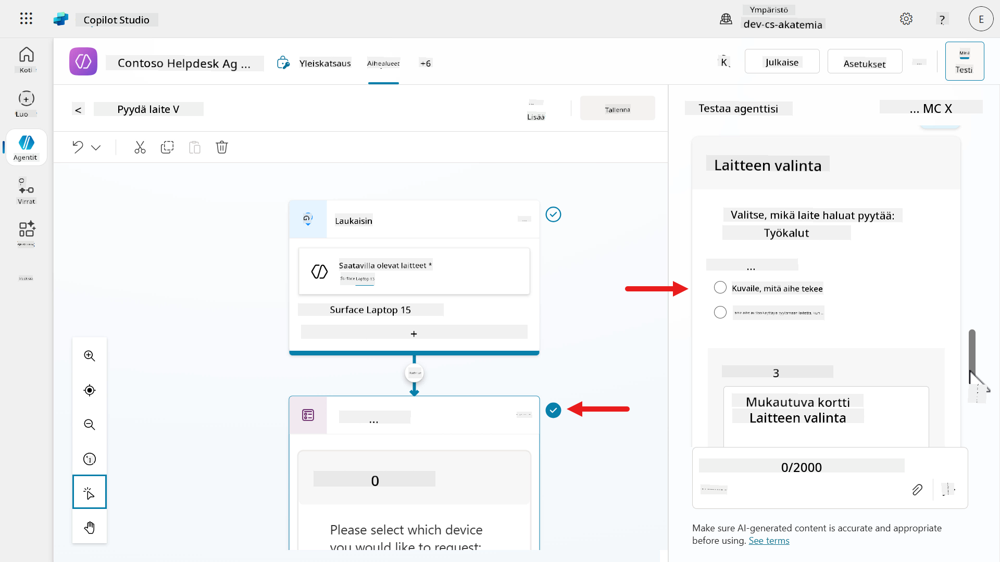

1. Olemme nyt onnistuneesti testanneet 😄 _Saatavilla olevat laitteet_ -aiheen ohjautumisen _Laitteiden pyynnöt_ -aiheeseen. Lisäämme tähän aiheeseen lisää parannuksia seuraavan oppitunnin laboratoriossa.

    Päivitä testipaneeli.

    

## ✅ Tehtävä suoritettu

Onnittelut! 👏🏻 Olet oppinut, kuinka lisätä mukautettuja kortteja Power Fx -kaavoilla näyttämään tietoja muuttujista, ja olet myös oppinut, kuinka ohjata aiheesta toiseen. Pienikokoisten aiheiden luominen tekee agentistasi järjestelmällisemmän ja auttaa myös ohjaamaan käyttäjiä keskustelun eri osien läpi agentin kanssa.

Tämä oli **Lab 08 - Paranna käyttäjävuorovaikutusta mukautetuilla korteilla** loppu, valitse alla oleva linkki siirtyäksesi seuraavaan oppituntiin. Laajennamme tämän laboratorion käyttötapausta seuraavassa oppitunnissa.

⏭️ [Siirry **Lisää agentin virtaus aiheeseesi automaatiota varten** -oppituntiin](../09-add-an-agent-flow/README.md)

## 📚 Taktiset resurssit

🔗 [Mukautettujen korttien käyttö Copilot Studiossa](https://learn.microsoft.com/microsoft-copilot-studio/guidance/adaptive-cards-overview?WT.mc_id=power-172619-ebenitez)

🔗 [Lisää mukautettu kortti Lähetä viesti -solmuun](https://learn.microsoft.com/microsoft-copilot-studio/authoring-send-message#add-an-adaptive-card?WT.mc_id=power-172619-ebenitez)

🔗 [Luo lausekkeita Power Fx:llä](https://learn.microsoft.com/microsoft-copilot-studio/advanced-power-fx?WT.mc_id=power-172619-ebenitez)

📺 [Mukautettujen korttien rakentaminen Power FX:llä](https://aka.ms/ai-in-action/copilot-studio/ep8)

<!-- markdownlint-disable-next-line MD033 -->


---

**Vastuuvapauslauseke**:  
Tämä asiakirja on käännetty käyttämällä tekoälypohjaista käännöspalvelua [Co-op Translator](https://github.com/Azure/co-op-translator). Vaikka pyrimme tarkkuuteen, huomioithan, että automaattiset käännökset voivat sisältää virheitä tai epätarkkuuksia. Alkuperäinen asiakirja sen alkuperäisellä kielellä tulisi katsoa ensisijaiseksi lähteeksi. Kriittisen tiedon osalta suositellaan ammattimaista ihmiskäännöstä. Emme ole vastuussa väärinkäsityksistä tai virhetulkinnoista, jotka johtuvat tämän käännöksen käytöstä.