<!--
CO_OP_TRANSLATOR_METADATA:
{
  "original_hash": "cd99a76bcb7372ac2771b6ae178b023d",
  "translation_date": "2025-10-17T01:39:06+00:00",
  "source_file": "docs/recruit/10-add-event-triggers/README.md",
  "language_code": "fi"
}
-->
# 🚨 Tehtävä 10: Lisää tapahtumatriggereitä - Ota käyttöön autonomisen agentin ominaisuudet

## 🕵️‍♂️ Koodinimi: `OPERATION GHOST ROUTINE`

> **⏱️ Operaatioaika:** `~45 minuuttia`

🎥 **Katso opastus**

[](https://www.youtube.com/watch?v=ZgwHL8PQ1nY "Katso opastus YouTubessa")

## 🎯 Tehtävän kuvaus

On aika nostaa agenttisi tasoa keskusteluavustajasta autonomiseksi toimijaksi. Tehtäväsi on mahdollistaa agenttisi toiminta ilman, että sitä tarvitsee erikseen kutsua - reagoimalla signaaleihin digitaalisessa ympäristössäsi tarkasti ja nopeasti.

Tapahtumatriggereiden avulla koulutat agenttisi seuraamaan ulkoisia järjestelmiä, kuten SharePointia, Teamsia ja Outlookia, ja suorittamaan älykkäitä toimintoja heti, kun signaali vastaanotetaan. Tämä operaatio muuttaa agenttisi täysin toimivaksi kenttäresurssiksi - hiljaiseksi, nopeaksi ja aina valppaaksi.

Onnistuminen tarkoittaa agenttien rakentamista, jotka tuottavat arvoa aloitteellisesti - eivät vain reagoi siihen.

## 🔎 Tavoitteet

📖 Tämä oppitunti kattaa:

- Tapahtumatriggereiden ymmärtäminen ja niiden rooli autonomisen agentin toiminnassa
- Tapahtumatriggereiden ja aihetriggereiden erot, mukaan lukien triggerityönkulut ja hyötykuormat
- Yleisimpien tapahtumatrigger-skenaarioiden tutkiminen
- Autentikoinnin, turvallisuuden ja julkaisemisen huomioiminen tapahtumapohjaisille agenteille
- Autonomisen IT-tukipisteagentin rakentaminen, joka reagoi SharePoint-tapahtumiin ja lähettää sähköpostivahvistuksia

## 🤔 Mikä on tapahtumatrigger?

**Tapahtumatrigger** on mekanismi, joka mahdollistaa agenttisi toiminnan autonomisesti ulkoisten tapahtumien perusteella ilman suoraa käyttäjän syötettä. Ajattele sitä tapana saada agenttisi "tarkkailemaan" tiettyjä tapahtumia ja toimimaan automaattisesti, kun nämä tapahtumat tapahtuvat.

Toisin kuin aihetriggerit, jotka vaativat käyttäjää kirjoittamaan jotain keskustelun aktivoimiseksi, tapahtumatriggerit aktivoituvat, kun jotain tapahtuu yhdistetyissä järjestelmissäsi. Esimerkiksi:

- Kun uusi tiedosto luodaan SharePointissa tai OneDrive for Businessissa
- Kun Dataversessa luodaan uusi tietue
- Kun Plannerissa tehtävä valmistuu
- Kun uusi Microsoft Forms -vastaus lähetetään
- Kun uusi Microsoft Teams -viesti lisätään
- Perustuen toistuviin aikatauluihin (kuten päivittäiset muistutukset)  
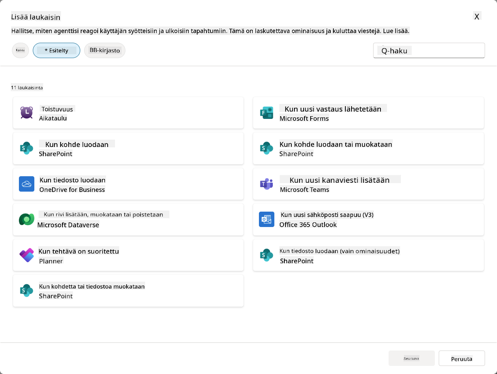

### Miksi tapahtumatriggerit ovat tärkeitä autonomisille agenteille

Tapahtumatriggerit muuttavat agenttisi reaktiivisesta avustajasta proaktiiviseksi, autonomiseksi auttajaksi:

1. **Autonominen toiminta** - agenttisi voi työskennellä 24/7 ilman ihmisen väliintuloa, reagoiden tapahtumiin niiden tapahtuessa.
    - *Esimerkki:* Tervetuloviestin lähettäminen automaattisesti uusille tiimin jäsenille, kun heidät lisätään tiimiin.

1. **Reaaliaikainen reagointi** - sen sijaan, että odotettaisiin käyttäjien kysyvän jotain, agenttisi reagoi välittömästi merkityksellisiin tapahtumiin.
    - *Esimerkki:* Ilmoita IT-tiimille, kun SharePoint-dokumenttia muokataan.

1. **Työnkulun automatisointi** - ketjuta useita toimintoja yhden trigger-tapahtuman perusteella.
    - *Esimerkki:* Kun uusi tukipyyntö luodaan, luo tehtävä, ilmoita esimiehelle ja päivitä seurantataulukko.

1. **Johdonmukaiset prosessit** - varmista, että tärkeät vaiheet eivät jää välistä automatisoimalla vastaukset avaintapahtumiin.
    - *Esimerkki:* Jokainen uusi työntekijä saa automaattisesti perehdytysmateriaalit ja käyttöoikeuspyynnöt.

1. **Tietopohjaiset toiminnot** - käytä tapahtuman sisältämää tietoa älykkäiden päätösten tekemiseen ja asianmukaisten toimien toteuttamiseen.
    - *Esimerkki:* Ohjaa kiireelliset tukipyynnöt kokeneille työntekijöille prioriteettitason perusteella triggerin hyötykuormassa.

## ⚙️ Kuinka tapahtumatriggerit toimivat?

Tapahtumatriggerit toimivat kolmen vaiheen työnkulun kautta, joka mahdollistaa agenttisi autonomisen reagoinnin ulkoisiin tapahtumiin:

### Triggerin työnkulku

1. **Tapahtuman havaitseminen** - Tietty tapahtuma tapahtuu yhdistetyssä järjestelmässä (SharePoint, Teams, Outlook jne.)
1. **Triggerin aktivointi** - Tapahtumatrigger havaitsee tämän tapahtuman ja lähettää hyötykuorman agentillesi Power Automate Cloud Flown kautta.
1. **Agentin vastaus** - Agenttisi vastaanottaa hyötykuorman ja suorittaa määritetyt ohjeet.

### Tapahtuma- vs aihetriggerit

Näiden kahden triggerityypin eron ymmärtäminen on tärkeää:

| **Tapahtumatriggerit** | **Aihetriggerit** |
|-------------------------|-------------------|
| Aktivoituu ulkoisten järjestelmätapahtumien perusteella | Aktivoituu käyttäjän syötteiden/lauseiden perusteella |
| Mahdollistaa autonomisen agentin toiminnan | Mahdollistaa keskusteluvastaukset |
| Käyttää tekijän autentikointia | Vaihtoehto käyttäjän autentikoinnille |
| Toimii ilman käyttäjän vuorovaikutusta | Vaatii käyttäjän aloittamaan keskustelun |
| Esimerkkejä: Tiedosto luotu, sähköposti vastaanotettu | Esimerkki: "Millainen sää on?" |

## 📦 Hyötykuormien ymmärtäminen

Kun tapahtuma tapahtuu, triggeri lähettää agentillesi **hyötykuorman**, joka sisältää tietoa tapahtumasta ja ohjeet siitä, miten reagoida.

### Oletus- vs mukautetut hyötykuormat

Jokaisella triggerityypillä on oletushyötykuorma, mutta voit mukauttaa sitä:

**Oletushyötykuorma** - Käyttää standardimuotoa, kuten `Käytä sisältöä {Body}`

- Sisältää perustiedot tapahtumasta
- Käyttää yleisiä käsittelyohjeita
- Hyvä yksinkertaisiin skenaarioihin

**Mukautettu hyötykuorma** - Lisää tarkat ohjeet ja tietojen muotoilu

- Sisältää yksityiskohtaiset ohjeet agentillesi
- Määrittää tarkasti, mitä tietoja käytetään ja miten
- Parempi monimutkaisiin työnkulkuihin

### Agentin ohjeet vs mukautetut hyötykuormaohjeet

Voit ohjata agenttisi toimintaa kahdella tasolla tapahtumatriggereiden avulla:

**Agentin ohjeet** (Yleiset)

- Laajat ohjeet, jotka koskevat kaikkia triggereitä
- Esimerkki: "Kun käsittelet tukipyyntöjä, tarkista aina ensin kaksoiskappaleet"
- Paras yleisiin toimintamalleihin

**Hyötykuormaohjeet** (Trigger-kohtaiset)

- Tarkat ohjeet yksittäisille triggerityypeille  
- Esimerkki: "Tämän SharePoint-päivityksen osalta lähetä yhteenveto projektikanavalle"
- Paras monimutkaisille agenteille, joilla on useita triggereitä

💡 **Vinkki**: Vältä ristiriitaisia ohjeita näiden kahden tason välillä, sillä tämä voi aiheuttaa odottamatonta käyttäytymistä.

## 🎯 Yleisiä tapahtumatrigger-skenaarioita

Tässä on käytännön esimerkkejä siitä, kuinka tapahtumatriggerit voivat parantaa agenttisi toimintaa:

### IT-tukipisteagentti

- **Triggeri**: Uusi SharePoint-listakohde (tukipyyntö)
- **Toiminto**: Luokittele automaattisesti, määritä prioriteetti ja ilmoita asianmukaisille tiimin jäsenille

### Työntekijän perehdytysagentti

- **Triggeri**: Uusi käyttäjä lisätty Dataverseen
- **Toiminto**: Lähetä tervetuloviesti, luo perehdytystehtävät ja myönnä käyttöoikeudet

### Projektinhallinta-agentti

- **Triggeri**: Plannerissa tehtävä valmis
- **Toiminto**: Päivitä projektin hallintapaneeli, ilmoita sidosryhmille ja tarkista esteet

### Dokumenttien hallinta-agentti

- **Triggeri**: Tiedosto ladattu tiettyyn SharePoint-kansioon
- **Toiminto**: Poimi metatiedot, lisää tunnisteet ja ilmoita dokumentin omistajille

### Kokousavustaja-agentti

- **Triggeri**: Kalenteritapahtuma luotu
- **Toiminto**: Lähetä kokousta edeltävät muistutukset ja agenda, varaa resurssit

## ⚠️ Julkaisu- ja autentikointihuomiot

Ennen kuin agenttisi voi käyttää tapahtumatriggereitä tuotannossa, sinun on ymmärrettävä autentikoinnin ja turvallisuuden vaikutukset.

### Tekijän autentikointi

Tapahtumatriggerit käyttävät **agentin luojan tunnuksia** kaikessa autentikoinnissa:

- Agenttisi käyttää järjestelmiä sinun käyttöoikeuksillasi
- Käyttäjät voivat mahdollisesti käyttää tietoja tunnustesi kautta
- Kaikki toiminnot suoritetaan "sinuna", vaikka käyttäjät olisivat vuorovaikutuksessa agentin kanssa

### Tietosuojan parhaat käytännöt

Turvallisuuden ylläpitämiseksi julkaistaessa tapahtumatriggereitä käyttäviä agentteja:

1. **Arvioi tietojen käyttöoikeudet** - Tarkista, mihin järjestelmiin ja tietoihin triggereilläsi on pääsy
1. **Testaa huolellisesti** - Ymmärrä, mitä tietoja triggerit sisältävät hyötykuormissa
1. **Rajaa triggerin laajuus** - Käytä tarkkoja parametreja rajoittaaksesi, mitkä tapahtumat aktivoivat triggereitä
1. **Tarkista hyötykuormatiedot** - Varmista, etteivät triggerit paljasta arkaluontoisia tietoja
1. **Seuraa käyttöä** - Seuraa triggerin toimintaa ja resurssien kulutusta

## ⚠️ Vianetsintä ja rajoitukset

Pidä mielessä nämä tärkeät seikat työskennellessäsi tapahtumatriggereiden kanssa:

### Kiintiö- ja laskutusvaikutukset

- Jokainen triggerin aktivointi lasketaan viestikulutukseesi
- Usein aktivoituvat triggerit (kuten minuutin välein tapahtuvat) voivat nopeasti kuluttaa kiintiön
- Seuraa käyttöä välttääksesi rajoitukset

### Teknisiä vaatimuksia

- Saatavilla vain agenteille, joilla on generatiivinen orkestrointi käytössä
- Vaatii ratkaisukohtaisen pilvityönkulun jakamisen olevan käytössä ympäristössäsi

### Tietojen menetyksen estäminen (DLP)

- Organisaatiosi DLP-käytännöt määrittävät, mitkä triggerit ovat käytettävissä
- Järjestelmänvalvojat voivat estää tapahtumatriggerit kokonaan
- Ota yhteyttä järjestelmänvalvojaan, jos odotetut triggerit eivät ole käytettävissä

## 🧪 Laboratorio 10 - Lisää tapahtumatriggereitä autonomisen agentin toimintaan

### 🎯 Käyttötapaus

Parannat IT-tukipisteagenttiasi reagoimaan automaattisesti uusiin tukipyyntöihin. Kun joku luo uuden kohteen SharePointin tukipyyntölistaan, agenttisi:

1. Aktivoituu autonomisesti, kun SharePoint-tukipyyntö luodaan
1. Toimittaa tukipyynnön tiedot ja ohjeet, jotka haluat sen suorittavan
1. Vahvistaa automaattisesti tukipyynnön lähettäjälle tekoälyn luomalla sähköpostilla

Tämä laboratorio osoittaa, kuinka tapahtumatriggerit mahdollistavat aidosti autonomisen agentin toiminnan.

### Esivaatimukset

Ennen kuin aloitat tämän laboratorion, varmista, että sinulla on:

- ✅ Suoritettu aiemmat laboratoriot (erityisesti laboratoriot 6-8 IT-tukipisteagentille)
- ✅ Pääsy SharePoint-sivustoon, jossa on IT-tukipyyntölista
- ✅ Copilot Studio -ympäristö, jossa tapahtumatriggerit ovat käytössä
- ✅ Agentillasi on generatiivinen orkestrointi käytössä
- ✅ Asianmukaiset käyttöoikeudet SharePointissa ja Copilot Studio -ympäristössäsi

### 10.1 Ota käyttöön generatiivinen tekoäly ja luo SharePoint-kohteen luomistriggeri

1. Avaa **IT-tukipisteagenttisi** **Copilot Studiossa**

1. Varmista ensin, että **Generatiivinen tekoäly** on käytössä agentillasi:
   - Siirry **Yleiskatsaus**-välilehdelle
   - Orkestrointiosiossa, kytke **Generatiivinen orkestrointi** päälle, jos se ei ole jo käytössä  
     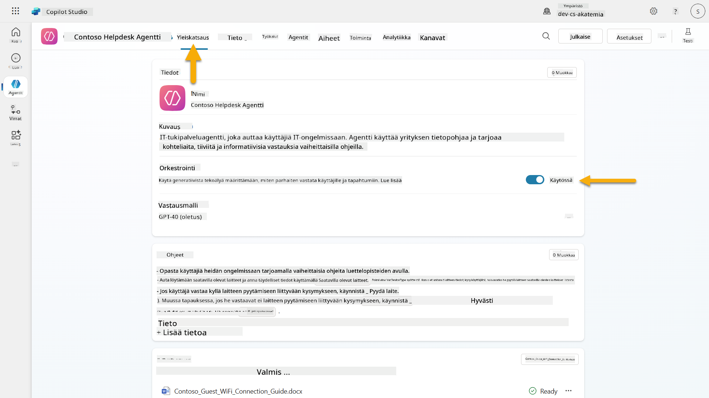

1. Siirry **Yleiskatsaus**-välilehdelle ja etsi **Triggerit**-osio

1. Klikkaa **+ Lisää triggeri** avataksesi triggerikirjaston  
    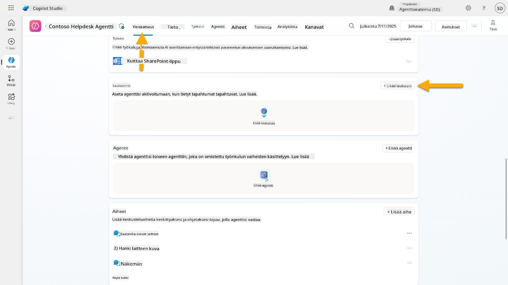

1. Etsi ja valitse **Kun kohde luodaan** (SharePoint)  
    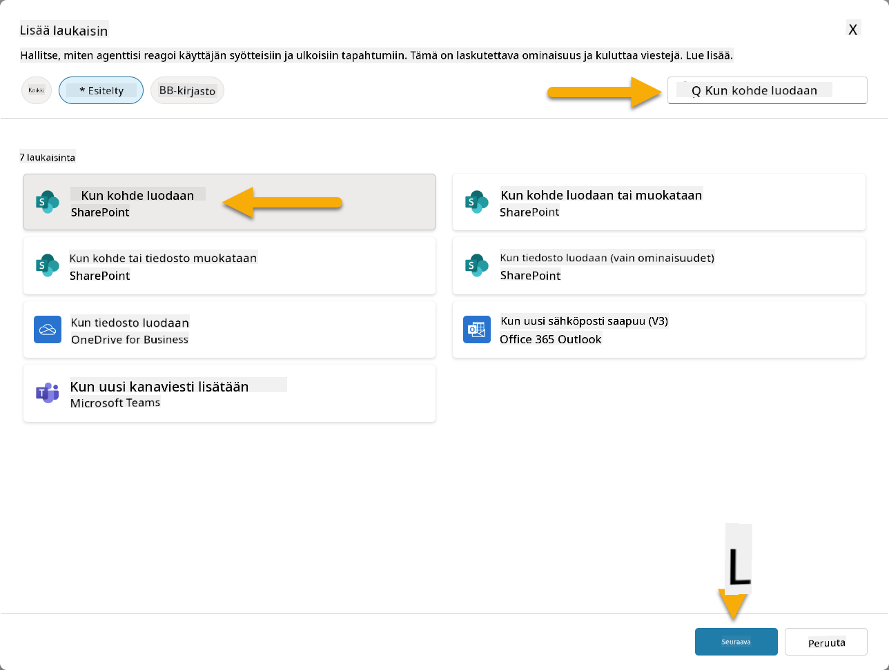

1. Määritä triggerin nimi ja yhteydet:

   - **Triggerin nimi:** Uusi tukipyyntö luotu SharePointissa

1. Odota, että yhteydet konfiguroituvat, ja valitse **Seuraava** jatkaaksesi.  
   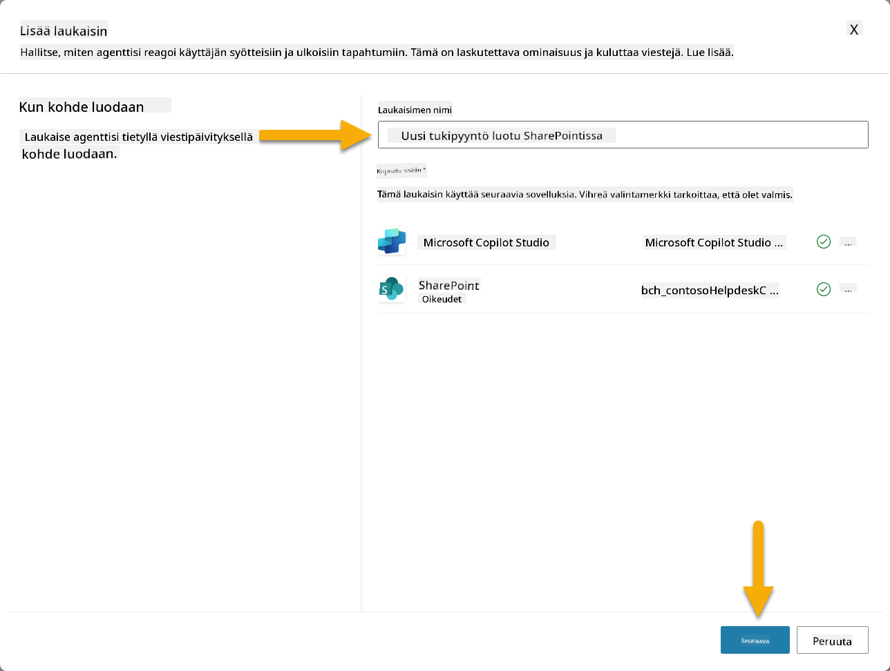

1. Määritä triggerin parametrit:

   - **Sivuston osoite**: Valitse "Contoso IT" SharePoint-sivustosi

   - **Listan nimi**: Valitse "Tickets"-listasi

   - **Lisäohjeet agentille, kun triggeri aktivoituu:**

     ```text
     New Support Ticket Created in SharePoint: {Body}
     
     Use the 'Acknowledge SharePoint Ticket' tool to generate the email body automatically and respond.
     
     IMPORTANT: Do not wait for any user input. Work completely autonomously.
     ```

     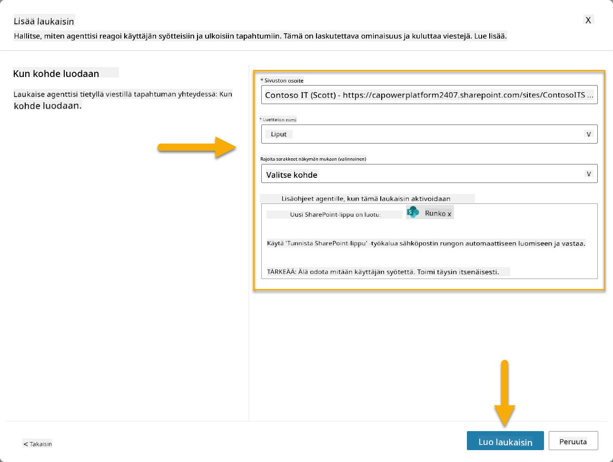

1. Valitse **Luo triggeri** viimeistelläksesi triggerin luomisen. Power Automate Cloud Flow luodaan automaattisesti aktivoimaan agentti autonomisesti.

1. Valitse **Sulje**.

### 10.2 Muokkaa triggeriä

1. **Yleiskatsaus**-välilehden **Triggerit**-osiossa, valitse **...**-valikko **Uusi tukipyyntö luotu SharePointissa** -triggerin kohdalla

1. Valitse **Muokkaa Power Automatessa**  
   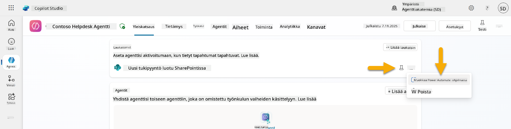

1. Valitse **Lähettää kehotteen määritetylle copilotille käsittelyä varten** -solmu

1. **Body/viesti**-kentässä, poista Body-sisältö, **paina kauttaviiva-näppäintä** (/) ja valitse **Lisää lauseke**  
   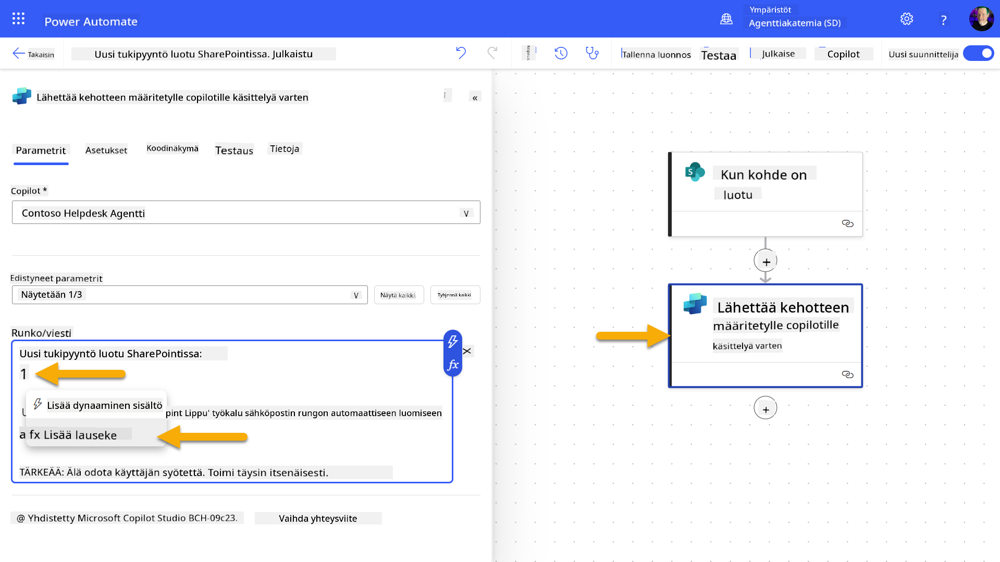

1. Syötä seuraava lauseke tarjotaksesi agentille tarkat tiedot tukipyynnöstä:

    ```text
    concat('Submitted By Name: ', first(triggerOutputs()?['body/value'])?['Author/DisplayName'], '\nSubmitted By Email: ', first(triggerOutputs()?['body/value'])?['Author/Email'], '\nTitle: ', first(triggerOutputs()?['body/value'])?['Title'], '\nIssue Description: ', first(triggerOutputs()?['body/value'])?['Description'], '\nPriority: ', first(triggerOutputs()?['body/value'])?['Priority/Value'],'\nTicket ID : ', first(triggerOutputs()?['body/value'])?['ID'])
    ```

1. Valitse **Lisää**  
   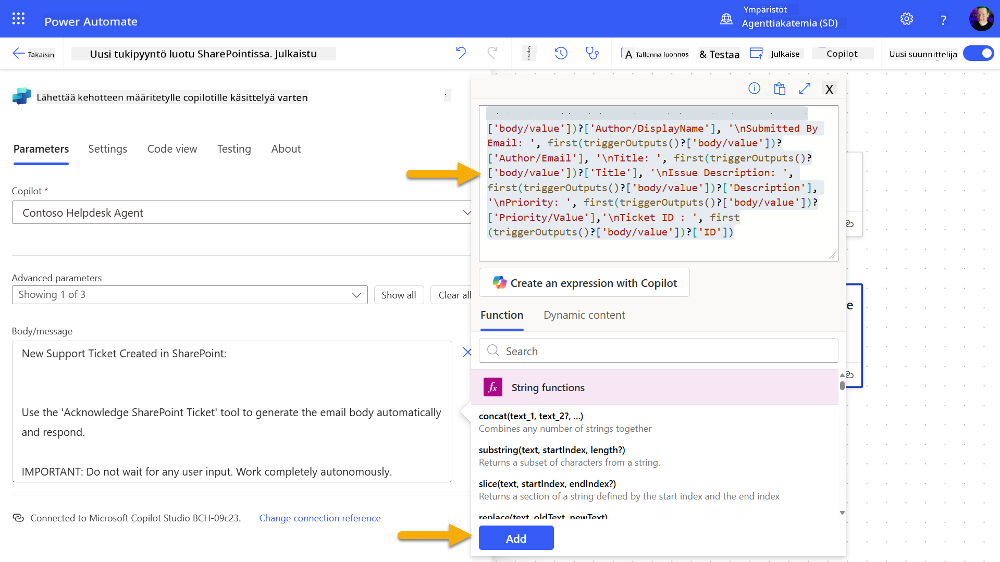

1. Valitse **Julkaise** oikean yläkulman työkalupalkista.

### 10.3 Luo työkalu sähköpostivahvistukselle

1. **Palaa** agenttiisi Copilot Studiossa

1. Siirry agenttisi **Työkalut**-välilehdelle

1. Klikkaa **+ Lisää työkalu** ja valitse **Liitin**

1. Etsi ja valitse **Lähetä sähköposti (V2)** -liitin  
    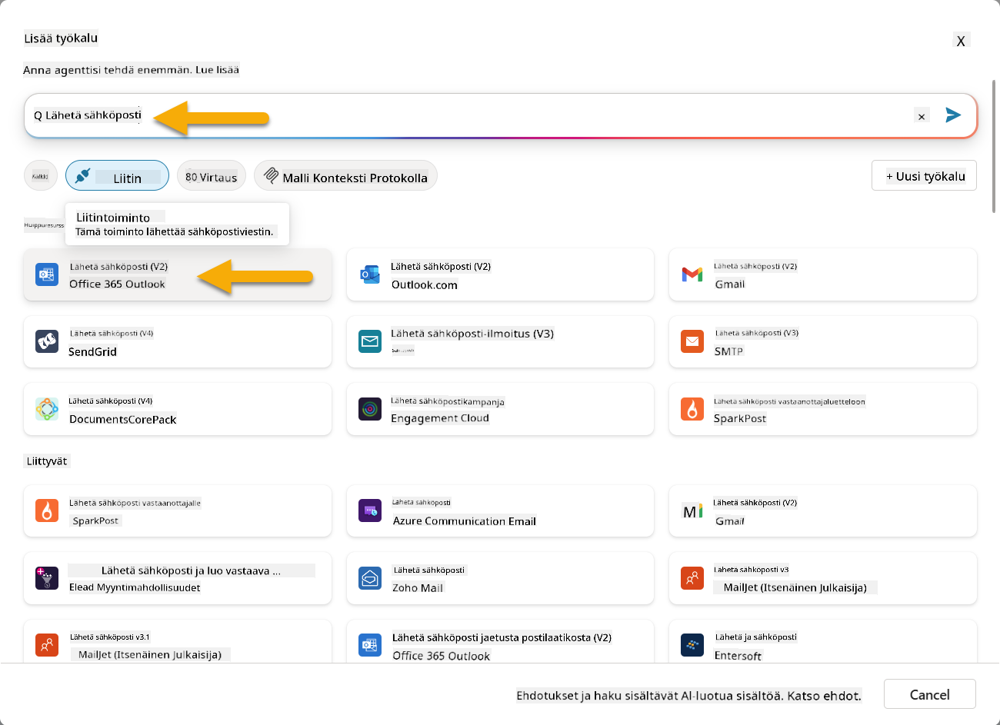

1. Odota, että yhteys konfiguroituu, ja valitse sitten **Lisää ja konfiguroi**

1. Määritä työkalun asetukset:

   - **Nimi**: Vahvista SharePoint-tukip
1. Avaa uusi selainvälilehti ja siirry **SharePoint IT-tukipyyntöjen listaan**
1. Klikkaa **+ Lisää uusi kohde** luodaksesi testipyynnön:
   - **Otsikko**: "Ei yhteyttä VPN:ään"
   - **Kuvaus**: "Ei yhteyttä yrityksen WIFI-verkkoon viimeisimmän päivityksen jälkeen"
   - **Prioriteetti**: "Normaali"

1. **Tallenna** SharePoint-kohde  
    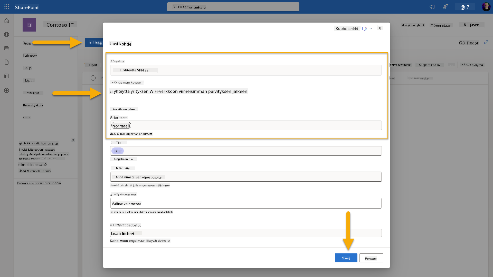
1. Palaa **Copilot Studioon** ja seuraa **Testaa laukaisinta** -paneelia laukaisimen aktivoitumisen varalta. Käytä **Päivitä**-kuvaketta ladataksesi laukaisutapahtuman, tämä voi kestää muutaman minuutin.  
    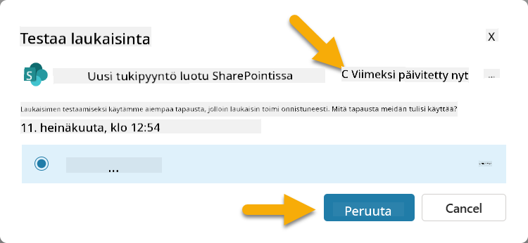
1. Kun laukaisin ilmestyy, valitse **Aloita testaus**
1. Valitse **Toimintakartta-kuvake** **Testaa agenttiasi** -paneelin yläosasta
1. Varmista, että agenttisi:
   - Sai laukaisimen tiedot
   - Käytti "Vahvista SharePoint-pyyntö" -työkalua  
     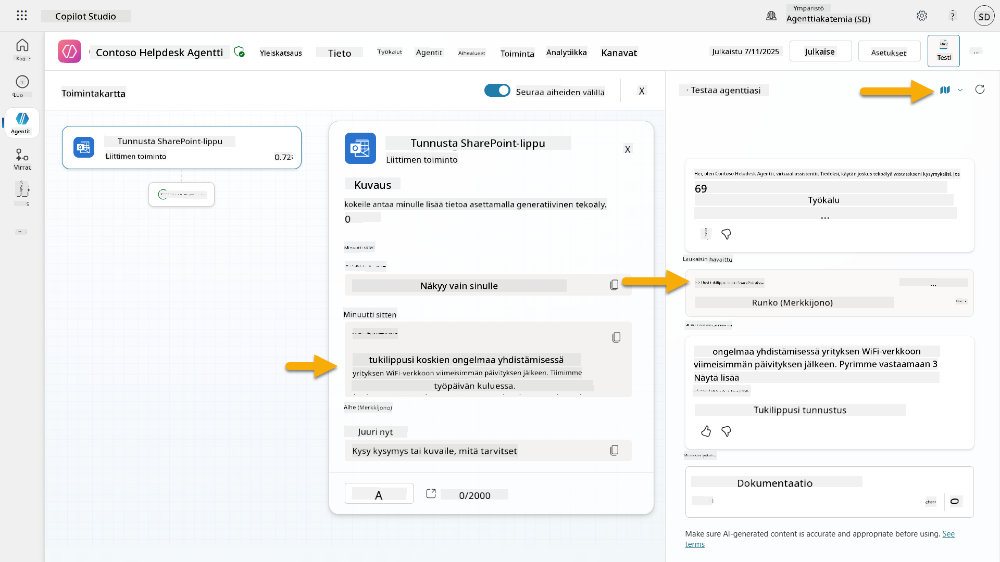
1. Tarkista lähettäjän sähköpostilaatikko varmistaaksesi, että vahvistussähköposti on lähetetty  
    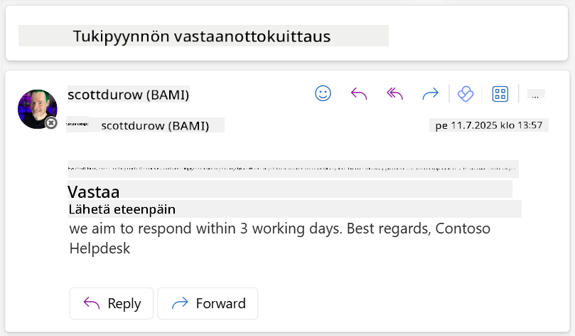
1. Tarkista **Toiminta**-välilehti Copilot Studiossa nähdäksesi täydellisen laukaisimen ja työkalun suorituksen

## ✅ Tehtävä suoritettu

🎉 **Onnittelut!** Olet onnistuneesti toteuttanut tapahtumalaukaisimet liitintyökaluilla, jotka mahdollistavat agenttisi toiminnan itsenäisesti, lähettäen automaattisesti sähköpostivahvistuksia ja käsitellen tukipyyntöjä ilman käyttäjän väliintuloa. Kun agenttisi julkaistaan, se toimii itsenäisesti puolestasi.

🚀 **Seuraavaksi**: Seuraavassa oppitunnissa opit [julkaisemaan agenttisi](../11-publish-your-agent/README.md) Microsoft Teamsiin ja Microsoft 365 Copilotiin, jolloin se on koko organisaatiosi käytettävissä!

⏭️ [Siirry **Julkaise agenttisi** -oppituntiin](../11-publish-your-agent/README.md)

## 📚 Taktiset resurssit

Valmis sukeltamaan syvemmälle tapahtumalaukaisimiin ja itsenäisiin agentteihin? Tutustu näihin resursseihin:

- **Microsoft Learn**: [Tee agentistasi itsenäinen Copilot Studiossa](https://learn.microsoft.com/training/modules/autonomous-agents-online-workshop/?WT.mc_id=power-177340-scottdurow)
- **Dokumentaatio**: [Lisää tapahtumalaukaisin](https://learn.microsoft.com/microsoft-copilot-studio/authoring-trigger-event?WT.mc_id=power-177340-scottdurow)
- **Parhaat käytännöt**: [Johdatus Power Automate -laukaisimiin](https://learn.microsoft.com/power-automate/triggers-introduction?WT.mc_id=power-177340-scottdurow)
- **Edistyneet skenaariot**: [Power Automate -työnkulkujen käyttö agenttien kanssa](https://learn.microsoft.com/microsoft-copilot-studio/advanced-flow-create?WT.mc_id=power-177340-scottdurow)
- **Tietoturva**: [Tietojen menetyksen estäminen Copilot Studiossa](https://learn.microsoft.com/microsoft-copilot-studio/admin-data-loss-prevention?WT.mc_id=power-177340-scottdurow)


---

**Vastuuvapauslauseke**:  
Tämä asiakirja on käännetty käyttämällä tekoälypohjaista käännöspalvelua [Co-op Translator](https://github.com/Azure/co-op-translator). Vaikka pyrimme tarkkuuteen, huomioithan, että automaattiset käännökset voivat sisältää virheitä tai epätarkkuuksia. Alkuperäinen asiakirja sen alkuperäisellä kielellä tulisi pitää ensisijaisena lähteenä. Kriittisen tiedon osalta suositellaan ammattimaista ihmiskäännöstä. Emme ole vastuussa väärinkäsityksistä tai virhetulkinnoista, jotka johtuvat tämän käännöksen käytöstä.