<!--
CO_OP_TRANSLATOR_METADATA:
{
  "original_hash": "9dceeba2eae2bb73e328602a060eddab",
  "translation_date": "2025-10-17T01:27:38+00:00",
  "source_file": "docs/recruit/11-publish-your-agent/README.md",
  "language_code": "fi"
}
-->
# 🚨 Tehtävä 11: Julkaise agenttisi

## 🕵️‍♂️ Koodinimi: `OPERATION PUBLISH PUBLISH PUBLISH`

> **⏱️ Operaatioaika:** `~30 minuuttia`  

🎥 **Katso opastus**

[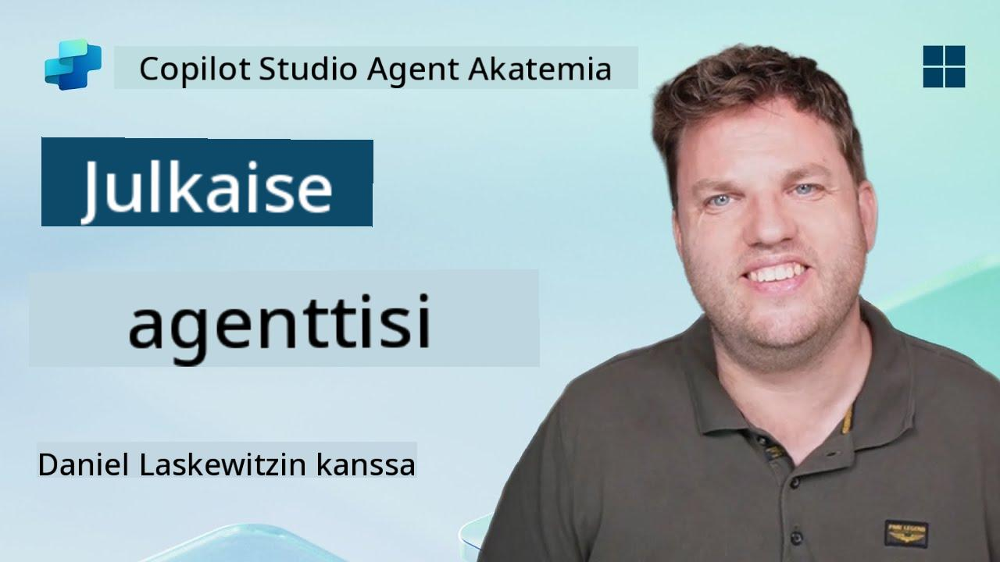](https://www.youtube.com/watch?v=eVZmljhYlSI "Katso opastus YouTubessa")

## 🎯 Tehtävän kuvaus

Agent Maker, olet suorittanut joukon haastavia moduuleja ja nyt olet valmis tärkeimpään vaiheeseen: agenttisi julkaisemiseen. On aika tehdä luomuksesi saatavilla käyttäjille Microsoft Teamsissa ja Microsoft 365 Copilotissa.

Agenttisi, joka on varustettu selkeällä tehtävällä, tehokkailla työkaluilla ja pääsyllä keskeisiin tietolähteisiin, on valmis palvelemaan. Microsoft Copilot Studion avulla voit ottaa agenttisi käyttöön, jotta se voi alkaa auttaa todellisia käyttäjiä heidän työympäristössään.

Lähdetään käynnistämään agenttisi toimintaan.

## 🔎 Tavoitteet

📖 Tämä osio kattaa:

1. Miksi agenttisi julkaiseminen on tärkeää
1. Mitä tapahtuu, kun julkaiset agenttisi
1. Kuinka lisätä kanava (Microsoft Teams & Microsoft 365 Copilot)
1. Kuinka lisätä agentti Microsoft Teamsiin
1. Kuinka tehdä agentti saatavilla koko organisaatiolle Microsoft Teamsissa

## 🚀 Julkaise agentti

Joka kerta kun työskentelet agentin parissa Copilot Studiossa, saatat päivittää sitä lisäämällä tietoa tai työkaluja. Kun kaikki muutokset ovat valmiita ja testattu huolellisesti, olet valmis julkaisemaan sen. Julkaiseminen varmistaa, että viimeisimmät päivitykset ovat käytössä. Jos päivität agenttiasi uusilla työkaluilla etkä paina julkaise-painiketta, päivitykset eivät ole vielä loppukäyttäjien saatavilla.

Muista aina painaa julkaise-painiketta, kun haluat viedä päivitykset agenttisi käyttäjille. Agentillasi voi olla lisättyjä kanavia, ja kun painat julkaise-painiketta, päivitykset tulevat saataville kaikille agenttiin lisätyille kanaville.

## ⚙️ Kanavien määrittäminen

Kanavat määrittävät, missä käyttäjäsi voivat käyttää ja olla vuorovaikutuksessa agenttisi kanssa. Kun olet julkaissut agenttisi, voit tehdä sen saatavilla useissa kanavissa. Jokainen kanava voi näyttää agenttisi sisällön eri tavalla.

Voit lisätä agenttisi seuraaviin kanaviin:

- **Microsoft Teams ja Microsoft 365 Copilot** - Tee agenttisi saatavilla Teams-keskusteluissa ja -kokouksissa sekä Microsoft 365 Copilot -kokemuksissa ([Lisätietoja](https://learn.microsoft.com/microsoft-copilot-studio/publication-add-bot-to-microsoft-teams))
- **Demo-sivusto** - Testaa agenttisi Copilot Studion tarjoamalla demo-sivustolla ([Lisätietoja](https://learn.microsoft.com/microsoft-copilot-studio/publication-connect-bot-to-web-channels))
- **Oma verkkosivusto** - Upota agenttisi suoraan omaan verkkosivustoosi ([Lisätietoja](https://learn.microsoft.com/microsoft-copilot-studio/publication-connect-bot-to-web-channels))
- **Mobiilisovellus** - Integroi agenttisi mukautettuun mobiilisovellukseen ([Lisätietoja](https://learn.microsoft.com/microsoft-copilot-studio/publication-connect-bot-to-custom-application))
- **SharePoint** - Lisää agenttisi SharePoint-sivustoille dokumentti- ja sivuavuksi ([Lisätietoja](https://learn.microsoft.com/microsoft-copilot-studio/publication-add-bot-to-sharepoint))
- **Facebook Messenger** - Yhdistä käyttäjiin Facebookin viestintäalustan kautta ([Lisätietoja](https://learn.microsoft.com/microsoft-copilot-studio/publication-add-bot-to-facebook))
- **Power Pages** - Integroi agenttisi Power Pages -verkkosivustoihin ([Lisätietoja](https://learn.microsoft.com/microsoft-copilot-studio/publication-add-bot-to-power-pages))
- **Azure Bot Service -kanavat** - Pääsy lisäkanaviin, kuten Slack, Telegram, Twilio SMS ja muihin ([Lisätietoja](https://learn.microsoft.com/microsoft-copilot-studio/publication-connect-bot-to-azure-bot-service-channels))

Kanavan lisäämiseksi siirry agenttisi **Kanavat**-välilehdelle ja valitse kanava, jonka haluat määrittää. Jokaisella kanavalla on omat asetusvaatimuksensa ja saattaa vaatia lisäautentikointia tai konfigurointivaiheita.

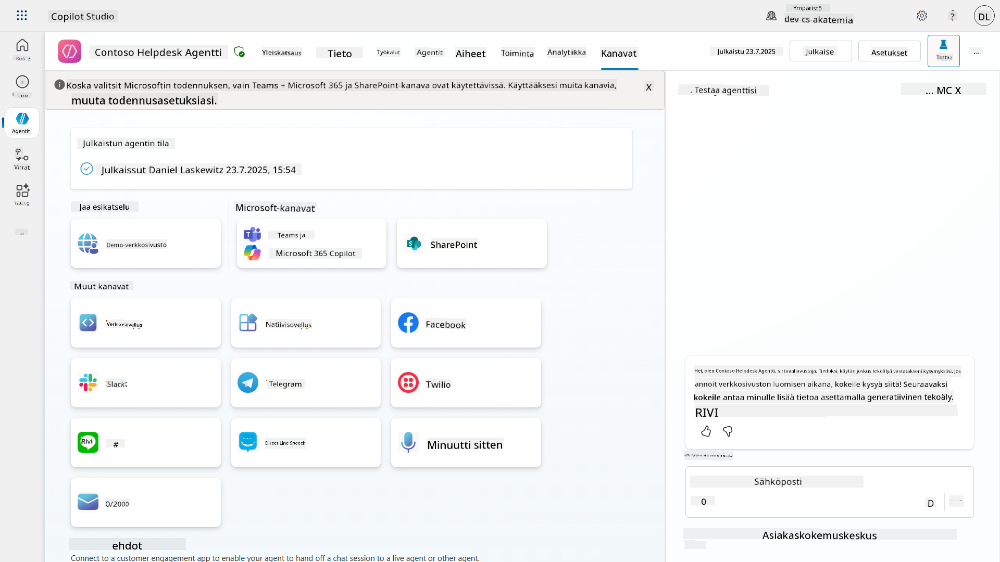

## 📺 Kanavakokemukset

Eri kanavilla on erilaisia käyttäjäkokemuksia. Kun rakennat agenttia useille kanaville, varmista, että olet tietoinen kanavakohtaisista eroista. On aina hyvä strategia testata agenttisi useissa kanavissa varmistaaksesi, että se toimii halutulla tavalla.

| Kokemus                          | Verkkosivusto | Teams ja Microsoft 365 Copilot         | Facebook                 | Dynamics Omnichannel asiakaspalveluun                     |
| --------------------------------- | ------------- | --------------------------------------- | ------------------------ | --------------------------------------------------------- |
| [Asiakastyytyväisyyskysely][1]    | Adaptive-kortti | Vain teksti                            | Vain teksti              | Vain teksti                                               |
| [Monivalintavaihtoehdot][1]       | Tuettu        | [Tuettu enintään kuusi (hero-kortti)][4] | [Tuettu enintään 13][6]  | [Osittain tuettu][8]                                      |
| [Markdown][2]                    | Tuettu        | [Osittain tuettu][5]                   | [Osittain tuettu][7]     | [Osittain tuettu][9]                                      |
| [Tervetuloviesti][1]             | Tuettu        | Tuettu                                 | Ei tuettu                | Tuettu [Chatissa][10]. Ei tuettu muissa kanavissa.        |
| [Did-You-Mean][3]                | Tuettu        | Tuettu                                 | Tuettu                   | Tuettu [Microsoft Teamsissa][11], [Chatissa][10], Facebookissa ja tekstipohjaisissa kanavissa (lyhytsanomapalvelu (SMS) [TeleSignin][12] ja [Twilion][13], [WhatsAppin][14], [WeChatin][15] ja [Twitterin][16] kautta). Ehdotetut toiminnot esitetään vain tekstilistana; käyttäjien on kirjoitettava vaihtoehto uudelleen vastatakseen. |

[1]: https://learn.microsoft.com/microsoft-copilot-studio/authoring-create-edit-topics
[2]: https://daringfireball.net/projects/markdown/
[3]: https://learn.microsoft.com/microsoft-copilot-studio/advanced-ai-features
[4]: https://learn.microsoft.com/microsoftteams/platform/concepts/cards/cards-reference#hero-card
[5]: https://learn.microsoft.com/microsoftteams/platform/bots/how-to/format-your-bot-messages#text-only-messages
[6]: https://developers.facebook.com/docs/messenger-platform/send-messages/quick-replies/
[7]: https://www.facebook.com/help/147348452522644?helpref=related
[8]: https://learn.microsoft.com/dynamics365/customer-service/asynchronous-channels#suggested-actions-support
[9]: https://learn.microsoft.com/dynamics365/customer-service/asynchronous-channels#preview-support-for-formatted-messages
[10]: https://learn.microsoft.com/dynamics365/customer-service/set-up-chat-widget
[11]: https://learn.microsoft.com/dynamics365/customer-service/configure-microsoft-teams
[12]: https://learn.microsoft.com/dynamics365/customer-service/configure-sms-channel
[13]: https://learn.microsoft.com/dynamics365/customer-service/configure-sms-channel-twilio
[14]: https://learn.microsoft.com/dynamics365/customer-service/configure-whatsapp-channel
[15]: https://learn.microsoft.com/dynamics365/customer-service/configure-wechat-channel
[16]: https://learn.microsoft.com/dynamics365/customer-service/configure-twitter-channel

> [!NOTE]
> Tässä on esimerkkejä siitä, miten voit käyttää erilaista logiikkaa eri kanavilla. Esimerkki löytyy Power Platform Snippets -tietovarastosta:
>
> Henry Jammes jakoi esimerkin siitä, miten näyttää erilainen adaptive-kortti, kun kanava on Microsoft Teams. ([Linkki esimerkkiin](https://github.com/pnp/powerplatform-snippets/blob/main/copilot-studio/multiple-topics-matched-topic/source/multiple-topics-matched.yaml#L40))

## 🧪 Lab 11: Julkaise agenttisi Teamsiin ja Microsoft 365 Copilotiin

### 🎯 Käyttötapaus

Contoso IT Help Desk -agenttisi on nyt täysin konfiguroitu ja varustettu tehokkailla ominaisuuksilla—se voi käyttää SharePoint-tietolähteitä, luoda tukipyyntöjä, lähettää proaktiivisia ilmoituksia ja vastata älykkäästi käyttäjien kyselyihin. Kaikki nämä ominaisuudet ovat kuitenkin tällä hetkellä saatavilla vain kehitysympäristössä, jossa ne on rakennettu.

**Haaste:** Loppukäyttäjät eivät voi hyödyntää agenttisi ominaisuuksia, ennen kuin se on asianmukaisesti julkaistu ja tehty saatavilla kanavissa, joissa he työskentelevät.

**Ratkaisu:** Agenttisi julkaiseminen varmistaa, että uusin versio—kaikkien viimeisimpien päivitysten, uusien aiheiden, parannettujen tietolähteiden ja konfiguroitujen toimintojen kanssa—on saatavilla todellisille käyttäjille. Ilman julkaisemista käyttäjät olisivat edelleen vuorovaikutuksessa vanhemman version kanssa, josta saattaa puuttua tärkeitä toimintoja.

Teams- ja Microsoft 365 Copilot -kanavan lisääminen on yhtä tärkeää, koska:

- **Teams-integraatio**: Organisaatiosi työntekijät viettävät suurimman osan päivästään Microsoft Teamsissa yhteistyön, kokousten ja viestinnän parissa. Lisäämällä agenttisi Teamsiin käyttäjät voivat saada IT-tukea poistumatta ensisijaisesta työympäristöstään.

- **Microsoft 365 Copilot**: Käyttäjät voivat käyttää erikoistunutta IT Help Desk -agenttiasi suoraan Microsoft 365 Copilot -kokemuksessaan, mikä tekee siitä saumattomasti integroidun heidän päivittäiseen työnkulkuunsa Office-sovelluksissa.

- **Keskitetty pääsy**: Sen sijaan, että käyttäjien pitäisi muistaa erilliset verkkosivustot tai sovellukset, he voivat käyttää IT-tukea jo käyttämissään alustoissa, mikä vähentää kitkaa ja lisää käyttöönottoa.

Tämä tehtävä muuttaa kehitystyösi tuotantovalmiiksi ratkaisuksi, joka tuottaa todellista arvoa organisaatiosi loppukäyttäjille.

### Esivaatimukset

Ennen kuin aloitat tämän laboratorion, varmista, että sinulla on:

- ✅ Suoritetut aiemmat laboratoriot ja täysin konfiguroitu Contoso Helpdesk Agent
- ✅ Agenttisi on testattu ja valmis tuotantokäyttöön
- ✅ Oikeudet Copilot Studio -ympäristössä agenttien julkaisemiseen
- ✅ Pääsy Microsoft Teamsiin organisaatiossasi

### 11.1 Julkaise agenttisi

Nyt kun kaikki työmme agentin parissa on tehty, meidän on varmistettava, että kaikki työmme on saatavilla loppukäyttäjille, jotka tulevat käyttämään agenttiamme. Jotta sisältö olisi saatavilla kaikille käyttäjille, meidän on julkaistava agenttimme.

1. Siirry Contoso Helpdesk Agenttiin Copilot Studiossa (kautta [Copilot Studio maker -portaali](https://copilotstudio.microsoft.com))

    Copilot Studiossa agenttisi julkaiseminen on helppoa. Voit vain valita julkaise-painikkeen agentin yleiskatsauksessa.

    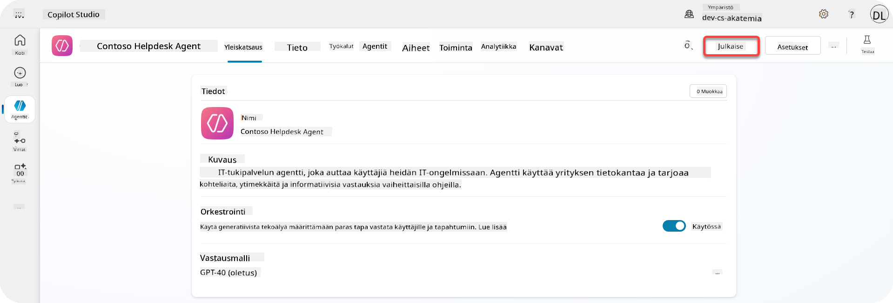

1. Valitse **Julkaise**-painike agentissasi

    Tämä avaa julkaisuponnahdusikkunan, jossa vahvistetaan, että haluat todella julkaista agenttisi.

    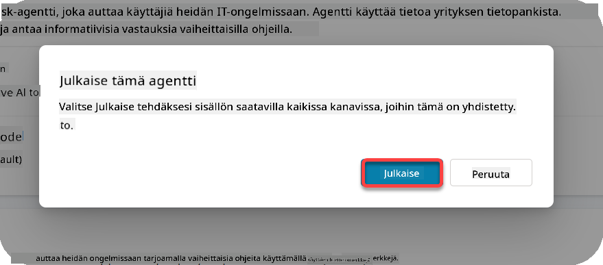

1. Valitse **Julkaise** vahvistaaksesi agenttisi julkaisemisen

    Nyt näytölle ilmestyy viesti, joka kertoo, että agenttisi julkaistaan. Sinun ei tarvitse pitää ponnahdusikkunaa auki. Saat ilmoituksen, kun agentti on julkaistu.

    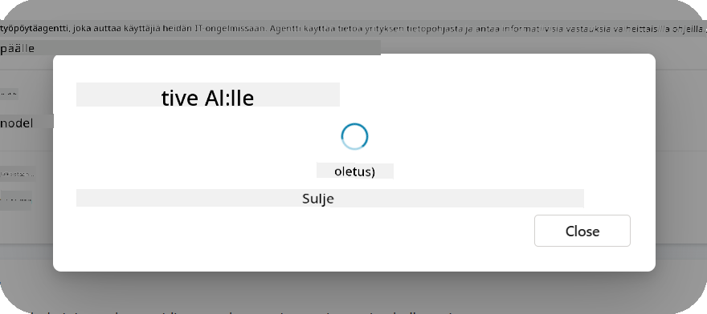

    Kun agentti on julkaistu, näet ilmoituksen agenttisivun yläosassa.

    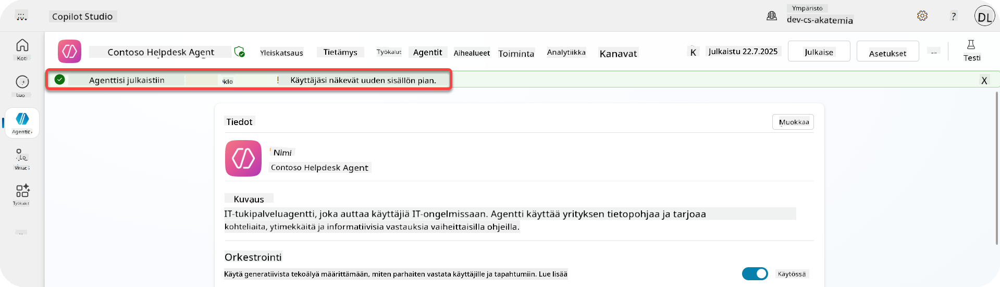

Mutta - olemme vasta julkaisseet agentin, emme ole vielä lisänneet sitä kanavaan, joten korjataan se nyt!

### 11.2 Lisää Teams- ja Microsoft 365 Copilot -kanava

1. Lisätäksesi Teams- ja Microsoft 365 Copilot -kanavan agenttiimme, meidän on valittava **Kanava** agentin ylävalikosta

    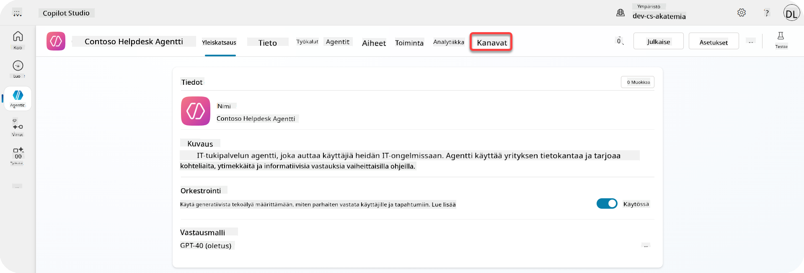

    Täällä näemme kaikki kanavat, jotka voimme lisätä tähän agenttiin.

1. Valitse **Teams ja Microsoft 365**

    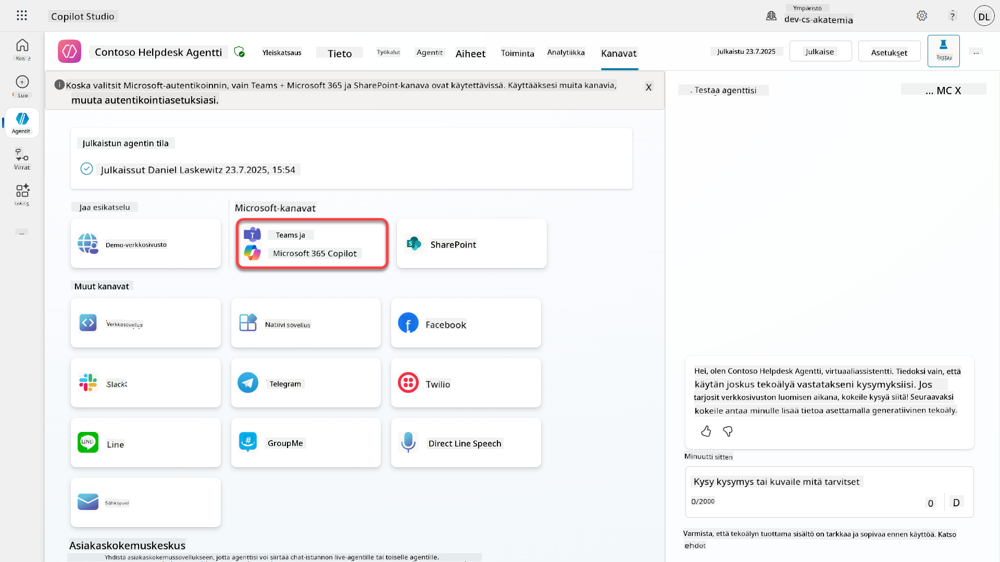

1. Valitse **Lisää kanava** viimeistelläksesi ohjatun toiminnon ja lisätäksesi kanavan agenttiin

    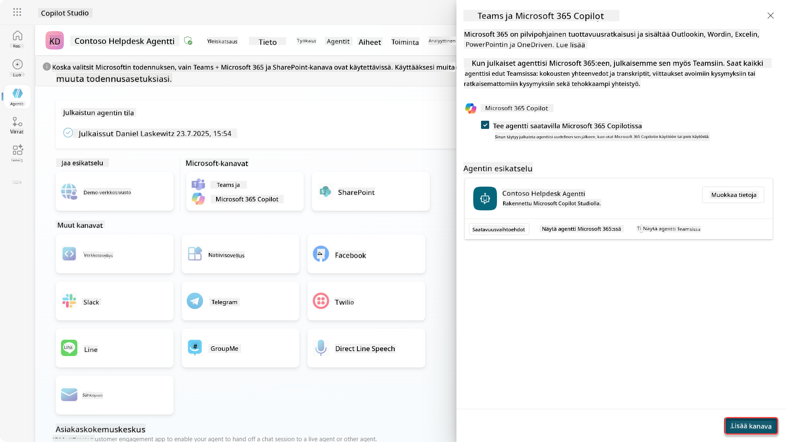

    Tämä kestää hetken, kunnes se on lisätty. Kun se on lisätty, sivupalkin yläosaan ilmestyy vihreä ilmoitus.

    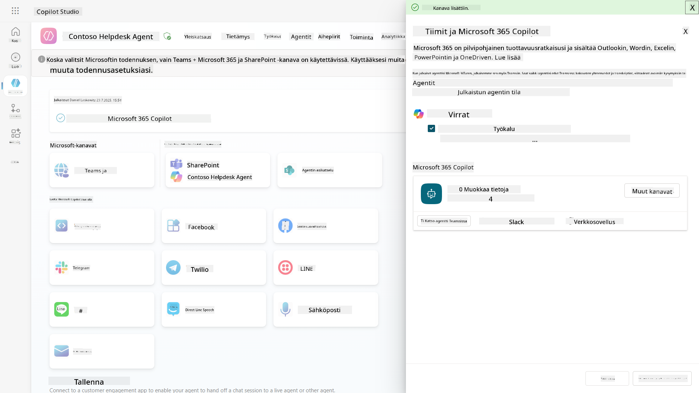

1. Valitse **Näytä agentti Teamsissa** avataksesi uuden välilehden

    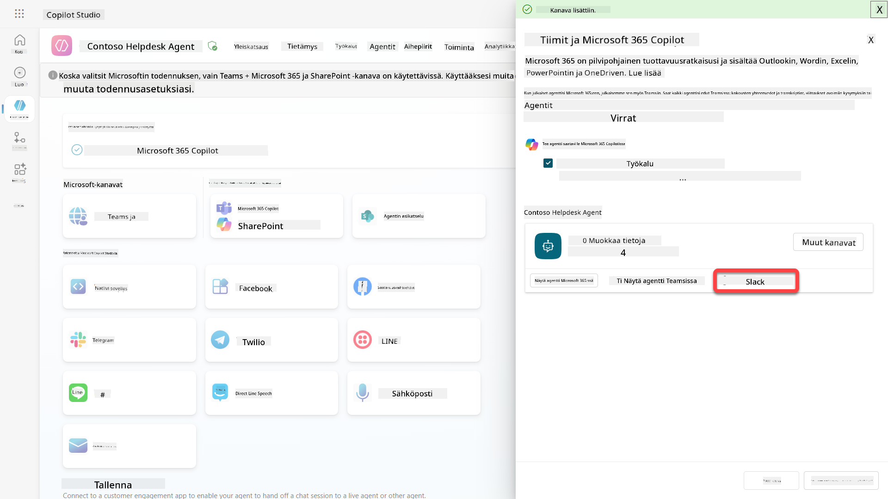

1. Valitse **Lisää** lisätäksesi Contoso Helpdesk Agentin Teamsiin

    

    Tämä kestää hetken. Sen jälkeen pitäisi näkyä seuraava näyttö:

    

1. Valitse **Avaa** avataksesi agentin Teamsissa

    Tämä avaa agentin Teamsissa Teams-sovelluksena

    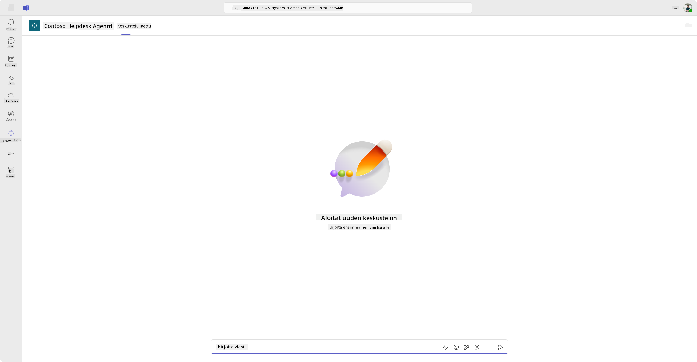

Nyt olemme julkaisseet agentin toimimaan sinulle Microsoft Teamsissa, mutta saatat haluta tehdä sen saatavilla useammille ihmisille.

### 11.3 Tee agentti saatavilla kaikille käyttäjille vuokraajassa

1. Sulje selainvälilehti, jossa Contoso Helpdesk Agent on avattu

    Tämä tuo sinut takaisin Copilot Studioon, jossa Teams- ja Microsoft 365 Copilot -sivupaneeli on edelleen avoinna. Olemme nyt vain avanneet agentin Teamsissa, mutta voimme tehdä paljon enemmän täällä. Voimme muokata agentin tietoja, voimme ottaa agentin käyttöön useammille käyttäjille ja paljon muuta.

1. Valitse **Muokkaa tietoja**

    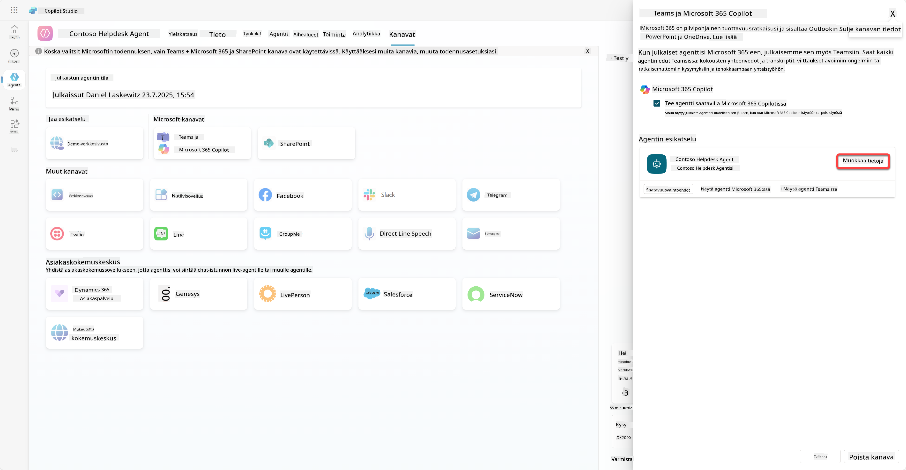
Tämä avaa paneelin, jossa voimme muuttaa agentin yksityiskohtia ja asetuksia. Voimme muuttaa perusasioita, kuten kuvaketta, kuvakkeen taustaväriä ja kuvauksia. Lisäksi voimme muokata Teams-asetuksia (esimerkiksi sallia käyttäjän lisätä agentin tiimiin tai käyttää agenttia ryhmä- ja kokouskeskusteluissa). Kun valitset *lisää*, voit myös muuttaa kehittäjätietoja, kuten kehittäjän nimeä, verkkosivustoa, tietosuojalausuntoa ja käyttöehtoja.

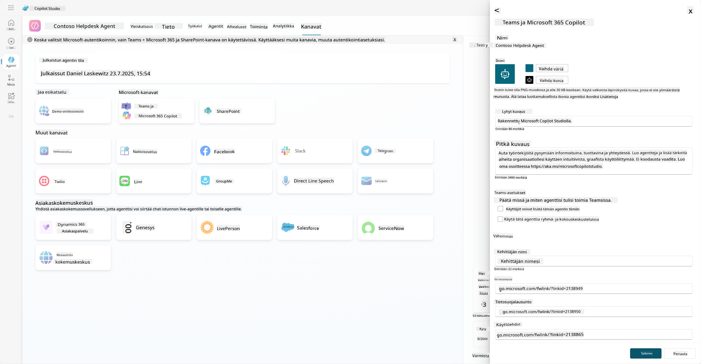

1. Valitse **Peruuta** sulkeaksesi Muokkaa tietoja -paneelin.

1. Valitse **Saatavuusasetukset**.

    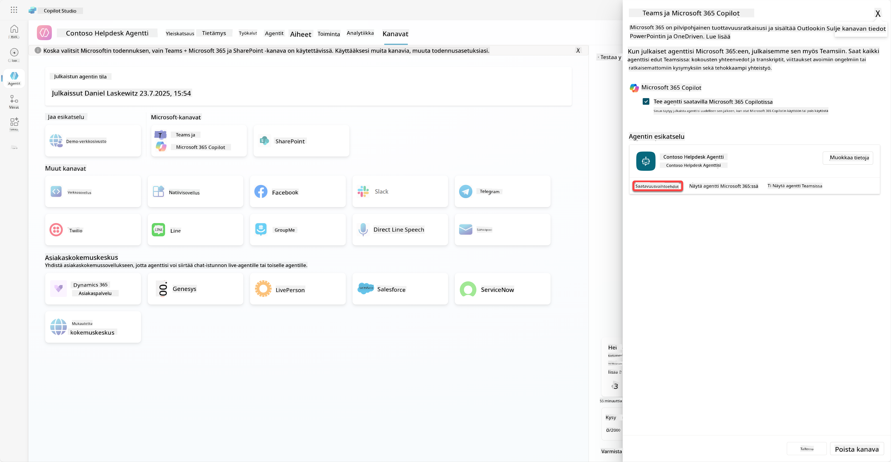

    Tämä avaa saatavuusasetusten paneelin, jossa voit kopioida linkin ja lähettää sen käyttäjille, jotta he voivat käyttää agenttia (huomaa, että sinun täytyy myös jakaa agentti käyttäjälle). Voit myös ladata tiedoston lisätäksesi agenttisi Microsoft Teams- tai Microsoft 365 -kauppaan. Agentin näyttämiseksi kaupassa sinulla on muitakin vaihtoehtoja: voit näyttää sen tiimikavereillesi ja jaetuille käyttäjille (*Built with Power Platform* -osiossa) tai voit näyttää sen kaikille organisaatiossasi (tämä vaatii järjestelmänvalvojan hyväksynnän).

1. Valitse **Näytä kaikille organisaatiossani**.

    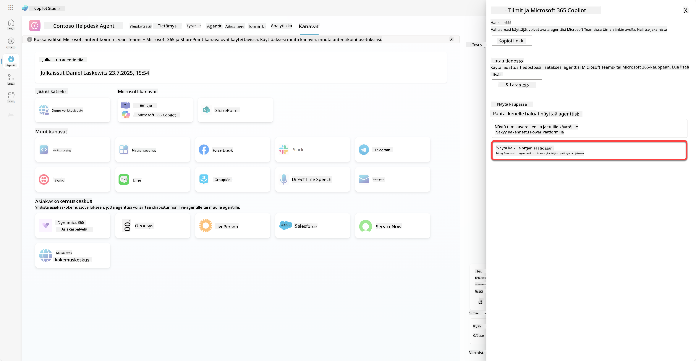

1. Valitse **Lähetä järjestelmänvalvojan hyväksyttäväksi**.

    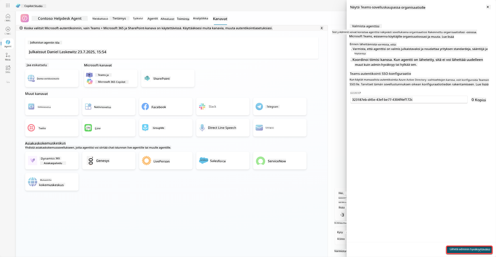

    Nyt järjestelmänvalvojan täytyy hyväksyä agenttisi lähetys. Hän voi tehdä sen siirtymällä Teamsin hallintakeskukseen ja etsimällä Contoso Helpdesk Agentin sovelluksista. Kuvassa näkyy, mitä järjestelmänvalvoja näkee Teamsin hallintakeskuksessa.

    

    Järjestelmänvalvojan täytyy valita Contoso Helpdesk Agent ja valita *Julkaise* julkaistakseen Contoso Helpdesk Agentin kaikille.

    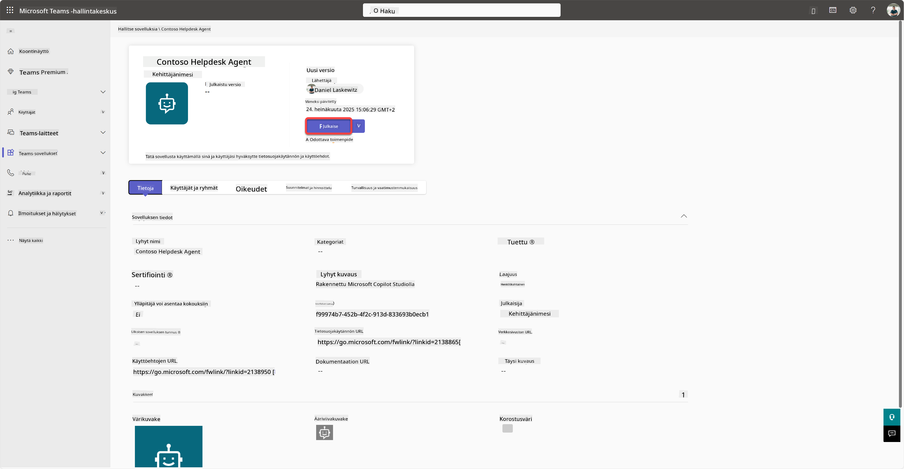

    Kun järjestelmänvalvoja on julkaissut agentin lähetyksen, voit päivittää Copilot Studion ja sinun pitäisi nähdä *saatavilla sovelluskaupassa* -banneri saatavuusasetuksissa.

    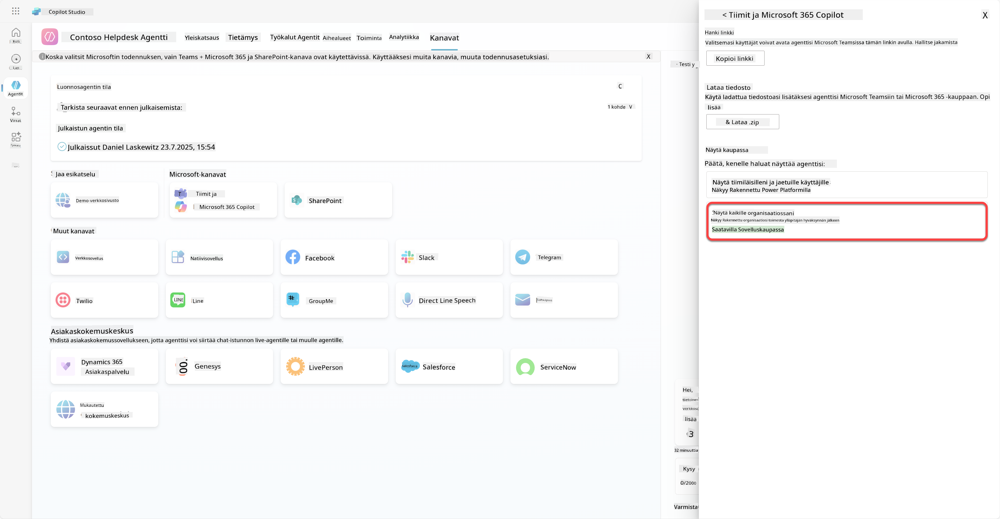

Täällä on vielä enemmän mahdollisuuksia. Järjestelmänvalvoja voi muuttaa yleistä asennuskäytäntöä ja asentaa Contoso Helpdesk Agentin automaattisesti kaikille vuokraajassa. Lisäksi voit kiinnittää Contoso Helpdesk Agentin vasempaan valikkopalkkiin, jotta kaikilla on helppo pääsy siihen.

## ✅ Tehtävä suoritettu

🎉 **Onnittelut!** Olet onnistuneesti julkaissut agenttisi ja lisännyt sen Teamsiin ja Microsoft 365 Copilotiin! Seuraavaksi on kurssin viimeinen tehtävä: Lisensoinnin ymmärtäminen.

⏭️ [Siirry **Lisensoinnin ymmärtäminen** -osioon](../12-understanding-licensing/README.md)

## 📚 Taktiset resurssit

🔗 [Julkaisukanavien dokumentaatio](https://learn.microsoft.com/microsoft-copilot-studio/publication-fundamentals-publish-channels)

---

**Vastuuvapauslauseke**:  
Tämä asiakirja on käännetty käyttämällä tekoälypohjaista käännöspalvelua [Co-op Translator](https://github.com/Azure/co-op-translator). Vaikka pyrimme tarkkuuteen, huomioithan, että automaattiset käännökset voivat sisältää virheitä tai epätarkkuuksia. Alkuperäinen asiakirja sen alkuperäisellä kielellä tulisi pitää ensisijaisena lähteenä. Kriittisen tiedon osalta suositellaan ammattimaista ihmiskäännöstä. Emme ole vastuussa väärinkäsityksistä tai virhetulkinnoista, jotka johtuvat tämän käännöksen käytöstä.