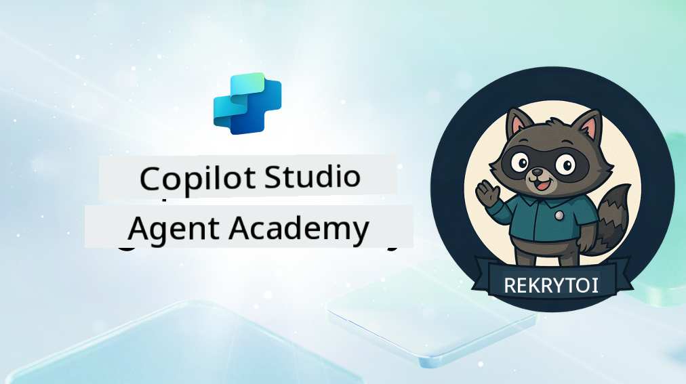

<!--
CO_OP_TRANSLATOR_METADATA:
{
  "original_hash": "8b5ecad9d5d073ea3f4c2b844e80f2e5",
  "translation_date": "2025-10-17T01:13:53+00:00",
  "source_file": "docs/recruit/README.md",
  "language_code": "fi"
}
-->
# Tervetuloa Rekrytoitu

**Tervetuloa, Rekrytoitu.**  
Tehtäväsi—jos päätät ottaa sen vastaan—on oppia agenttien rakentamisen taito **Microsoft Copilot Studion** avulla.

Tämä käytännönläheinen koulutus on porttisi **agenttien maailmaan**: opit luomaan, skaalaamaan ja ottamaan käyttöön älykkäitä agentteja todellisten työkalujen ja käyttötapausten avulla, alkaen perustelluista kehotteista aina Adaptive Cards -kortteihin ja agenttivirtoihin.

---

## 🎯 Tehtävän Tavoite

Agenttiakatemian suorittamisen jälkeen osaat:

- Ymmärtää, mitä agentit ovat Microsoft Copilot Studion kontekstissa
- Tutkia, miten Suuret Kielimallit (LLM), hakuun perustuva generointi (RAG) ja orkestrointi yhdistyvät agentissa
- Rakentaa sekä **deklaratiivisia** että **räätälöityjä agentteja**
- Parantaa agentteja **Aiheilla**, **Adaptive Cards -korteilla** ja **Agenttivirroilla**
- Ottaa agentteja käyttöön **Microsoft Teamsissa** ja **Microsoft 365 Copilotissa**

---

## 🧪 Esivaatimukset

Kaikkien tehtävien suorittamiseen tarvitset:

- Microsoft 365 -kehittäjävuokraajan (SharePoint käytössä)
- Pääsyn **Microsoft Copilot Studioon** (kokeiluversio tai lisenssi)
- Valinnainen: Perustiedot SharePointista, Power Platformista tai Power Fx:stä

---

## 🧬 Kenelle Tämä On Tarkoitettu

Tämä kurssi sopii:

- Tekijöille ja kehittäjille, jotka tutkivat **Copilot Studiota**
- IT-ammattilaisille, jotka rakentavat **Microsoft 365 Copilot -laajennuksia**
- Power Platform -harrastajille, jotka haluavat **kehittää taitojaan** älykkäiden agenttien parissa
- Kaikille, jotka oppivat mieluummin **tekemällä**

---

## 🧭 Kurssin Yleiskatsaus

Tämä akatemia on jaettu edistyviin oppitunteihin—jokainen niistä on suunniteltu kenttätehtäväksi, joka kehittää agenttien rakentamisen taitojasi.

| Oppitunti | Otsikko | Tehtävän Kuvaus |
|-----------|---------|-----------------|
| `00` | 🧰 [Kurssin Aloitus](./00-course-setup/README.md) | Valmistele kehitysympäristösi, Copilot Studion kokeiluversio ja SharePoint-sivusto |
| `01` | 🧠 [Johdatus Agentteihin](./01-introduction-to-agents/README.md) | Ymmärrä keskustelullisen tekoälyn käsitteet, LLM:t ja autonomiset vs. deklaratiiviset agentit |
| `02` | 🛠️ [Copilot Studion Perusteet](./02-copilot-studio-fundamentals/README.md) | Opi peruspalikat: tieto, taidot, autonomia |
| `03` | 👩‍💻 [Luo Deklaratiivinen Agentti](./03-create-a-declarative-agent-for-M365Copilot/README.md) | Lisää oma agenttisi Microsoft 365 Copilotiin, perustuen kehotteeseen |
| `04` | 🧩 [Ratkaisun Luominen](./04-creating-a-solution/README.md) | Pakkaa agenttisi uudelleenkäytettäväksi ratkaisuksi ympäristön hallintaa varten |
| `05` | 🚀 [Aloita Valmiiden Agenttien Käyttö](./05-using-prebuilt-agents/README.md) | Käytä ja mukauta mallipohjaista agenttia asennuksen nopeuttamiseksi |
| `06` | ✍️ [Rakenna Räätälöity Agentti](./06-create-agent-from-conversation/README.md) | Luo uusi Copilot, joka perustuu tietolähteisiin |
| `07` | 🧠 [Lisää Aihe Triggereillä](./07-add-new-topic-with-trigger/README.md) | Käytä Aiheita määrittämään mukautettuja kysymys/vastauspolkuja |
| `08` | 🪪 [Paranna Adaptive Cards -korteilla](./08-add-adaptive-card/README.md) | Rakenna Adaptive Card Power Fx:n ja SharePointin avulla |
| `09` | 🔁 [Automatisoi Agenttivirroilla](./09-add-an-agent-flow/README.md) | Käytä Adaptive Card -kortin syötettä taustavirtojen käynnistämiseen |
| `10` | 🧭 [Lisää Tapahtumatriggereitä](./10-add-event-triggers/README.md) | Mahdollista agenttisi toimia itsenäisesti tapahtumapohjaisen logiikan avulla |
| `11` | 📢 [Julkaise Agenttisi](./11-publish-your-agent/README.md) | Ota agenttisi käyttöön Microsoft Teamsissa ja Microsoft 365 Copilotissa |
| `12` | 🪪 [Ymmärrä Lisensointi](./12-understanding-licensing/README.md) | Opi, miten lisensointi ja laskutus toimivat Copilot Studion kanssa |
| `13` | 🚨 [Rekrytoidun Merkin Varmistaminen](./course-completion-badges-recruit/README.md) | Hanki merkki ja juhlista saavutustasi! |

!!! note
    ✅ Tämän kurssin suorittaminen ansaitsee sinulle **Rekrytoidun** merkin.  
    🔓 **Operatiivinen** ja **Komentaja** avautuvat tulevissa vaiheissa.

<!-- markdownlint-disable-next-line MD033 -->

---

**Vastuuvapauslauseke**:  
Tämä asiakirja on käännetty käyttämällä tekoälypohjaista käännöspalvelua [Co-op Translator](https://github.com/Azure/co-op-translator). Vaikka pyrimme tarkkuuteen, huomioithan, että automaattiset käännökset voivat sisältää virheitä tai epätarkkuuksia. Alkuperäistä asiakirjaa sen alkuperäisellä kielellä tulisi pitää ensisijaisena lähteenä. Kriittisen tiedon osalta suositellaan ammattimaista ihmiskäännöstä. Emme ole vastuussa väärinkäsityksistä tai virhetulkinnoista, jotka johtuvat tämän käännöksen käytöstä.