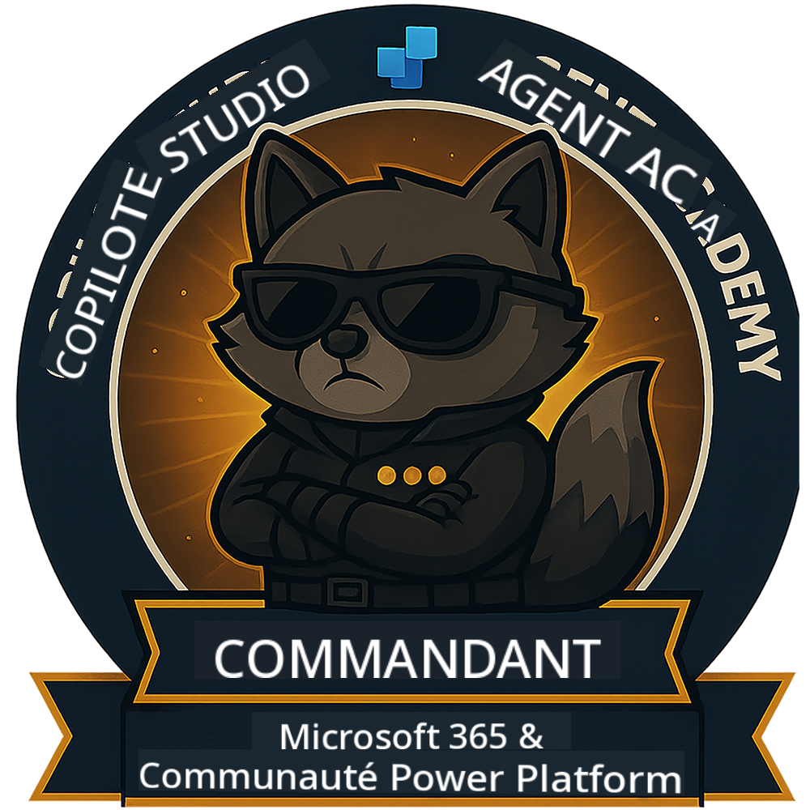

<!--
CO_OP_TRANSLATOR_METADATA:
{
  "original_hash": "8fb14b79c8616d9533f641ac2d555e8c",
  "translation_date": "2025-10-17T19:35:37+00:00",
  "source_file": "docs/commander/README.md",
  "language_code": "fr"
}
-->
---
hide:
- navigation
---

# Commandant (Bientôt disponible)

Ce cours est encore très secret. Il sera débloqué dans le futur ! 🔓

{ width="300" }

<!-- markdownlint-disable-next-line MD033 -->

---

**Avertissement** :  
Ce document a été traduit à l'aide du service de traduction automatique [Co-op Translator](https://github.com/Azure/co-op-translator). Bien que nous nous efforcions d'assurer l'exactitude, veuillez noter que les traductions automatisées peuvent contenir des erreurs ou des inexactitudes. Le document original dans sa langue d'origine doit être considéré comme la source faisant autorité. Pour des informations critiques, il est recommandé de recourir à une traduction professionnelle humaine. Nous ne sommes pas responsables des malentendus ou des interprétations erronées résultant de l'utilisation de cette traduction.