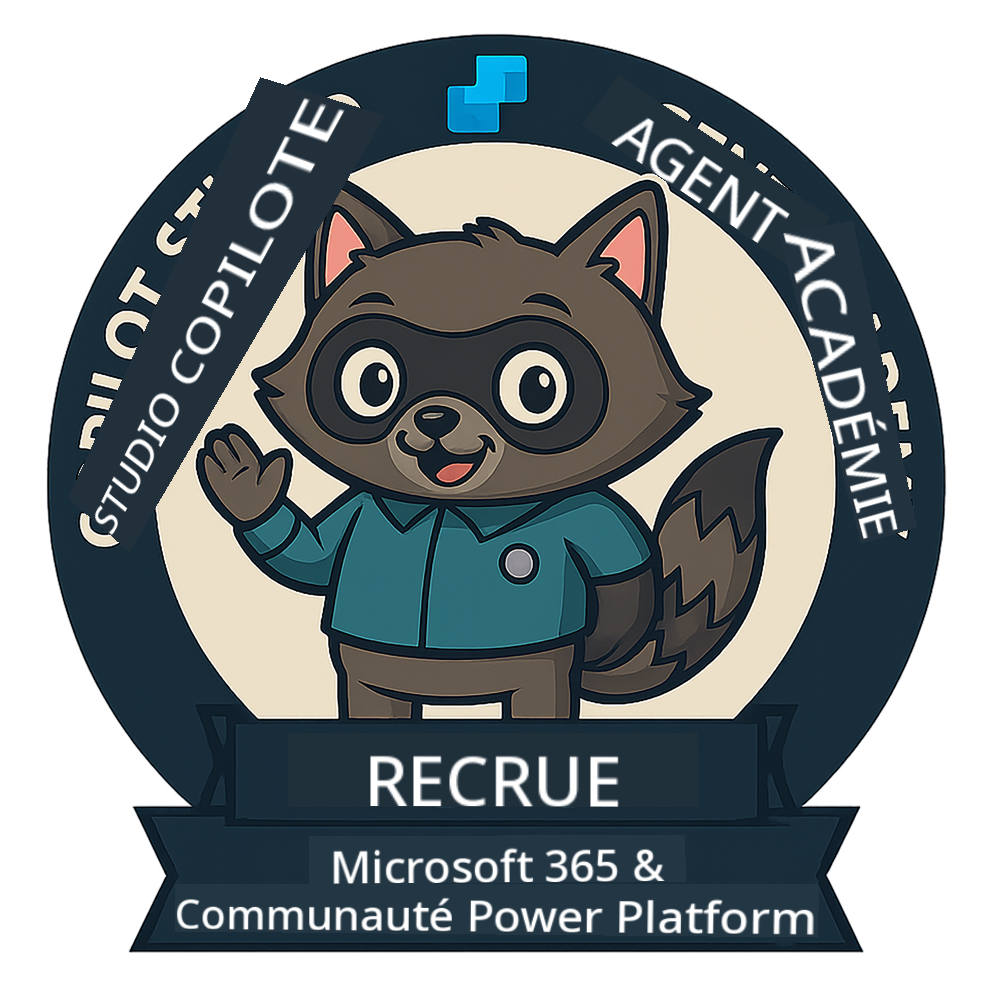
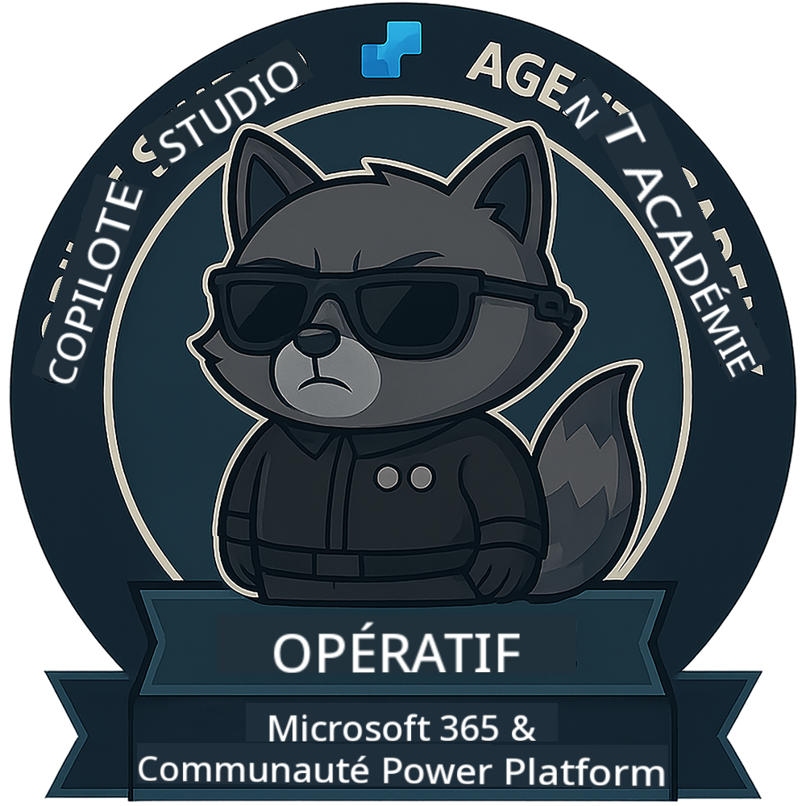

<!--
CO_OP_TRANSLATOR_METADATA:
{
  "original_hash": "15e57e059ce7689d602d7853187235cd",
  "translation_date": "2025-10-17T18:52:35+00:00",
  "source_file": "docs/index.md",
  "language_code": "fr"
}
-->
---
hide:
- navigation
---

# Académie des Agents Copilot Studio

**Bienvenue à l'Académie des Agents Copilot Studio.**  

Votre mission, si vous l'acceptez, est de maîtriser l'art de créer des agents avec **Microsoft Copilot Studio**.

Cette formation pratique est votre porte d'entrée dans le **monde des agents** : des invites structurées aux Adaptive Cards et aux flux d'agents, vous apprendrez à concevoir, développer et déployer des agents intelligents en utilisant des outils et des cas d'utilisation réels.

---

## 🏅 Progression des Rangs

L'**Académie des Agents Copilot Studio** est un programme de formation en plusieurs phases conçu pour développer vos compétences à travers trois rangs d'agents. Chaque niveau inclut un badge et des responsabilités croissantes :

| Rang              | Niveau | Visuel |
|-------------------|:------:|--------|
| 🟢 **Recrue**  [🚀 Commencer](https://aka.ms/agent-academy-recruit){ .md-button .md-button--primary }     | •     | { width="300" }     |
| 🔵 **Opératif** (Bientôt disponible)   | ••    | { width="300" } |
| 🟡 **Commandant** (Bientôt disponible)    | •••   | { width="300" } |

Chaque niveau s'appuie sur le précédent. Terminez votre mission de Recrue et restez à l'écoute pour progresser dans vos qualifications d'agent.

---

## 🎒 Autres Cours

Découvrez ces autres cours pour continuer à apprendre sur l'IA et les Agents :

- [Microsoft Copilot Studio <3 MCP Lab](https://aka.ms/mcsmcplab)
- [Camp des Développeurs Copilot](https://microsoft.github.io/copilot-camp/)
- [Agents IA pour Débutants](https://microsoft.github.io/ai-agents-for-beginners/)
- [Protocole de Contexte Modèle (MCP) pour Débutants](https://github.com/microsoft/mcp-for-beginners)

---

## 🚑 Problèmes

Nous apprécions vraiment vos retours ! Veuillez utiliser la [liste des problèmes](https://github.com/microsoft/agent-academy/issues) pour partager vos commentaires et signaler des problèmes. Merci !

---

## 📜 Code de Conduite

Ce projet a adopté le [Code de Conduite Open Source de Microsoft](https://opensource.microsoft.com/codeofconduct/).

!!! info "Ressources :"

    - [Code de Conduite Open Source de Microsoft](https://opensource.microsoft.com/codeofconduct/)
    - [FAQ sur le Code de Conduite de Microsoft](https://opensource.microsoft.com/codeofconduct/faq/)
    - Contactez [opencode@microsoft.com](mailto:opencode@microsoft.com) pour toute question ou préoccupation

---

[⭐️ Ajoutez notre dépôt à vos favoris](https://github.com/microsoft/agent-academy){ .md-button .md-button--primary }

<!-- markdownlint-disable-next-line MD033 -->

---

**Avertissement** :  
Ce document a été traduit à l'aide du service de traduction automatique [Co-op Translator](https://github.com/Azure/co-op-translator). Bien que nous nous efforcions d'assurer l'exactitude, veuillez noter que les traductions automatisées peuvent contenir des erreurs ou des inexactitudes. Le document original dans sa langue d'origine doit être considéré comme la source faisant autorité. Pour des informations critiques, il est recommandé de recourir à une traduction humaine professionnelle. Nous ne sommes pas responsables des malentendus ou des interprétations erronées résultant de l'utilisation de cette traduction.