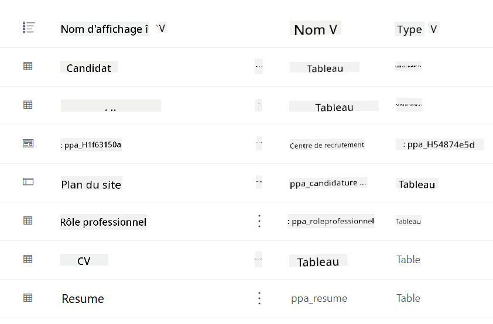
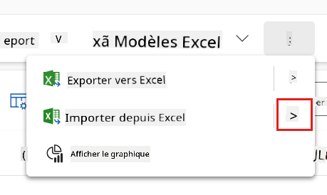
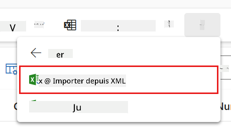
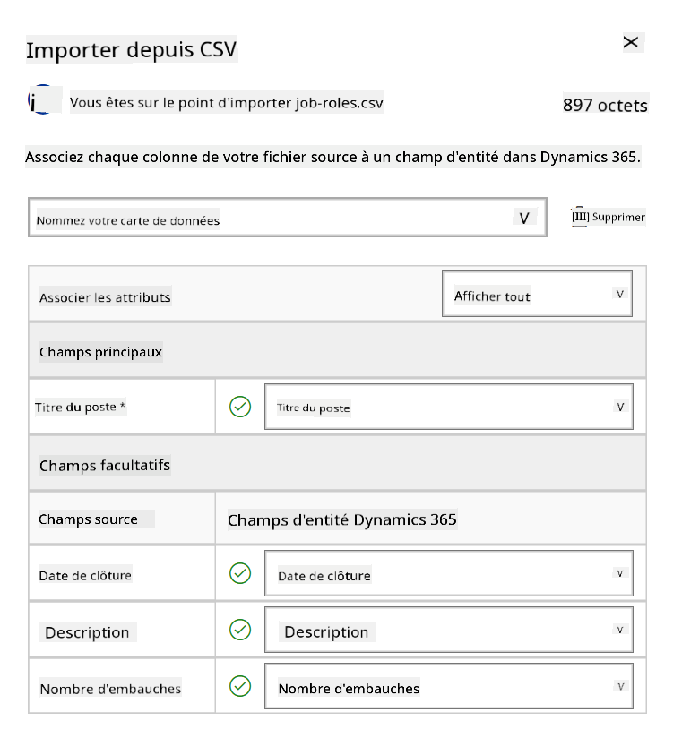
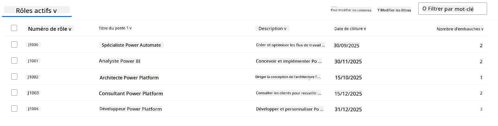
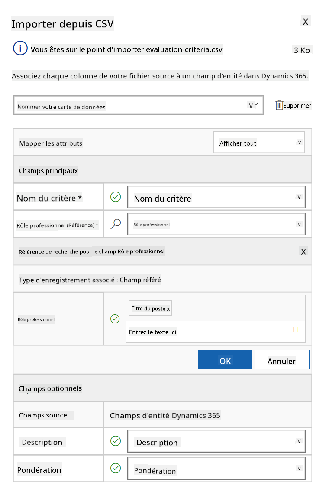
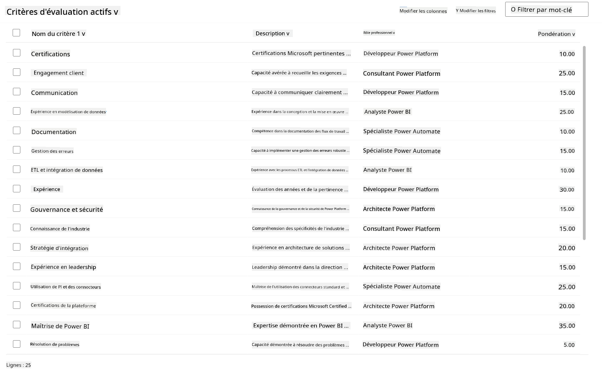

<!--
CO_OP_TRANSLATOR_METADATA:
{
  "original_hash": "2620cf9eaf09a3fc6be7fa31a3a62956",
  "translation_date": "2025-10-17T19:23:00+00:00",
  "source_file": "docs/operative-preview/01-get-started/README.md",
  "language_code": "fr"
}
-->
# 🚨 Mission 01 : Commencez avec l'Agent de Recrutement

--8<-- "disclaimer.md"

## 🕵️‍♂️ NOM DE CODE : `OPÉRATION DÉTECTEUR DE TALENTS`

> **⏱️ Durée de l'opération :** `~45 minutes`

## 🎯 Résumé de la mission

Bienvenue, Agent. Votre première mission est **Opération Détecteur de Talents** - établir l'infrastructure de base pour un système de recrutement alimenté par l'IA qui transformera la manière dont les organisations identifient et embauchent les meilleurs talents.

Votre mission, si vous l'acceptez, est de déployer et configurer un système de gestion des recrutements complet en utilisant Microsoft Copilot Studio. Vous importerez une solution préconçue contenant toutes les structures de données nécessaires, puis créerez votre premier agent IA - l'**Agent de Recrutement** - qui servira d'orchestrateur central pour toutes les futures opérations de recrutement.

Ce déploiement initial établit le centre de commande que vous améliorerez tout au long du programme de l'Académie des Agents. Considérez cela comme votre base d'opérations - la fondation sur laquelle vous construirez tout un réseau d'agents spécialisés dans les missions suivantes.

---

## 🔎 Objectifs

En complétant cette mission, vous allez :

- **Compréhension du scénario** : Acquérir une connaissance approfondie des défis et solutions liés à l'automatisation du recrutement
- **Déploiement de la solution** : Importer et configurer avec succès les bases d'un système de gestion des recrutements
- **Création d'agent** : Construire un agent de recrutement qui sera le point de départ du scénario que vous allez développer en tant qu'Opératif de l'Académie des Agents

---

## 🔍 Prérequis

Avant de commencer cette mission, assurez-vous d'avoir :

- Une licence Copilot Studio
- Accès à un environnement Microsoft Power Platform
- Des permissions administratives pour créer des solutions et des agents

---

## 🏢 Comprendre le scénario d'automatisation du recrutement

Ce scénario montre comment une entreprise peut utiliser Microsoft Copilot Studio pour améliorer et automatiser son processus de recrutement. Il introduit un système d'agents qui collaborent pour gérer des tâches telles que la revue des CV, la recommandation de postes, la préparation des documents d'entretien et l'évaluation des candidats.

### Valeur ajoutée pour l'entreprise

La solution aide les équipes RH à gagner du temps et à prendre de meilleures décisions en :

- Traitant automatiquement les CV reçus par email.
- Suggérant des postes adaptés en fonction des profils des candidats.
- Créant des candidatures et des guides d'entretien personnalisés pour chaque candidat.
- Garantissant des pratiques de recrutement équitables et conformes grâce à des fonctionnalités de sécurité et de modération intégrées.
- Collectant des retours pour améliorer la solution.

### Comment ça fonctionne

- Un **Agent de Recrutement** central coordonne le processus et stocke les données dans Microsoft Dataverse.
- Un **Agent de Réception des Candidatures** lit les CV et crée des candidatures.
- Un **Agent de Préparation des Entretiens** génère des questions et des documents d'entretien basés sur le profil du candidat.
- Le système peut être publié sur un site de démonstration, permettant aux parties prenantes d'interagir avec lui.

Ce scénario est idéal pour les organisations cherchant à moderniser leurs flux de travail de recrutement grâce à l'automatisation alimentée par l'IA, tout en maintenant transparence, équité et efficacité.

---

## 🧪 Atelier : Configurer l'Agent de Recrutement

Dans cet atelier pratique, vous allez établir la base de votre système d'automatisation du recrutement. Vous commencerez par importer une solution préconfigurée contenant toutes les tables Dataverse et structures de données nécessaires pour gérer les candidats, les postes et les flux de recrutement. Ensuite, vous remplirez ces tables avec des données d'exemple qui soutiendront votre apprentissage tout au long de ce module et fourniront des scénarios réalistes pour les tests. Enfin, vous créerez l'Agent de Recrutement dans Copilot Studio, en configurant l'interface conversationnelle de base qui servira de pierre angulaire pour toutes les autres fonctionnalités que vous ajouterez dans les missions futures.

### 🧪 Atelier 1.1 : Importer la solution

1. Allez sur **[Copilot Studio](https://copilotstudio.microsoft.com)**
1. Sélectionnez les **...** dans la navigation de gauche et choisissez **Solutions**
1. Cliquez sur le bouton **Importer une solution** en haut
1. **[Téléchargez](https://raw.githubusercontent.com/microsoft/agent-academy/refs/heads/main/docs/operative-preview/01-get-started/assets/Operative_1_0_0_0.zip)** la solution préparée
1. Cliquez sur **Parcourir** et sélectionnez la solution téléchargée à l'étape précédente
1. Cliquez sur **Suivant**
1. Cliquez sur **Importer**

!!! success
    En cas de succès, vous verrez une barre de notification verte avec le message suivant une fois terminé :  
    "Solution "Operative" importée avec succès."

Une fois la solution importée, examinez ce que vous avez importé en sélectionnant le nom d'affichage de la solution (`Operative`).



Les composants suivants sont importés :

| Nom d'affichage | Type | Description |
|-----------------|------|-------------|
| Candidat | Table | Informations sur les candidats |
| Critères d'évaluation | Table | Critères d'évaluation pour le poste |
| Hub de Recrutement | Application pilotée par modèle | Application pour gérer le processus de recrutement |
| Hub de Recrutement | Plan du site | Structure de navigation pour l'application Hub de Recrutement |
| Candidature | Table | Candidatures |
| Poste | Table | Postes |
| CV | Table | CV des candidats |

Pour la dernière tâche de cet atelier, cliquez sur le bouton **Publier toutes les personnalisations** en haut de la page.

### 🧪 Atelier 1.2 : Importer des données d'exemple

Dans cet atelier, vous allez ajouter des données d'exemple à certaines des tables que vous avez importées dans l'atelier 1.1.

#### Téléchargez les fichiers à importer

1. **[Téléchargez](https://raw.githubusercontent.com/microsoft/agent-academy/refs/heads/main/docs/operative-preview/01-get-started/assets/evaluation-criteria.csv)** le fichier CSV contenant les critères d'évaluation
1. **[Téléchargez](https://raw.githubusercontent.com/microsoft/agent-academy/refs/heads/main/docs/operative-preview/01-get-started/assets/job-roles.csv)** le fichier CSV contenant les postes

#### Importer les données d'exemple des postes

1. Retournez à la solution que vous venez d'importer dans l'atelier précédent
1. Sélectionnez l'application pilotée par modèle **Hub de Recrutement** en cochant la case devant la ligne correspondante
1. Cliquez sur le bouton **Jouer** en haut

    !!! warning
        Vous pourriez être invité à vous reconnecter. Assurez-vous de le faire. Après cela, vous devriez voir l'application Hub de Recrutement.

1. Sélectionnez **Postes** dans la navigation de gauche
1. Cliquez sur l'icône **Plus** (trois points verticaux) dans la barre de commande
1. Cliquez sur la **flèche droite** à côté de *Importer depuis Excel*

    

1. Cliquez sur **Importer depuis CSV**

    

1. Cliquez sur le bouton **Choisir un fichier**, sélectionnez le fichier **job-roles.csv** que vous venez de télécharger, puis cliquez sur **Ouvrir**
1. Cliquez sur **Suivant**
1. Laissez l'étape suivante telle quelle et cliquez sur **Vérifier le mappage**

    

1. Assurez-vous que le mappage est correct et cliquez sur **Terminer l'importation**

    !!! info
        Cela lancera une importation et vous pourrez suivre la progression ou terminer le processus immédiatement en cliquant sur **Terminé**

1. Cliquez sur **Terminé**

Cela peut prendre un peu de temps, mais vous pouvez cliquer sur le bouton **Actualiser** pour vérifier si l'importation a réussi.



#### Importer les données d'exemple des critères d'évaluation

1. Sélectionnez **Critères d'évaluation** dans la navigation de gauche
1. Cliquez sur l'icône **Plus** (trois points verticaux) dans la barre de commande
1. Cliquez sur la **flèche droite** à côté de *Importer depuis Excel*

    

1. Cliquez sur **Importer depuis CSV**

    

1. Cliquez sur le bouton **Choisir un fichier**, sélectionnez le fichier **evaluation-criteria.csv** que vous venez de télécharger, puis cliquez sur **Ouvrir**
1. Cliquez sur **Suivant**
1. Laissez l'étape suivante telle quelle et cliquez sur **Vérifier le mappage**

    

1. Maintenant, nous devons effectuer un peu plus de travail pour le mappage. Cliquez sur la loupe (icône 🔎) à côté du champ Rôle
1. Assurez-vous que **Titre du poste** est sélectionné ici, et si ce n'est pas le cas - ajoutez-le
1. Cliquez sur **OK**
1. Assurez-vous que le reste du mappage est également correct et cliquez sur **Terminer l'importation**

    !!! info
        Cela lancera une nouvelle importation et vous pourrez suivre la progression ou terminer le processus immédiatement en cliquant sur **Terminé**

1. Cliquez sur **Terminé**

Cela peut prendre un peu de temps, mais vous pouvez cliquer sur le bouton **Actualiser** pour vérifier si l'importation a réussi.



### 🧪 Atelier 1.3 : Créer l'agent de recrutement

Maintenant que vous avez terminé la configuration des prérequis, il est temps de passer au travail réel ! Ajoutons d'abord notre Agent de Recrutement !

1. Allez sur **[Copilot Studio](https://copilotstudio.microsoft.com)** et assurez-vous d'être dans le même environnement que celui où vous avez importé la solution et les données
1. Sélectionnez **Agents** dans la navigation de gauche
1. Cliquez sur **Nouvel Agent**
1. Cliquez sur **Configurer**
1. Pour **Nom**, entrez :

    ```text
    Hiring Agent
    ```

1. Pour **Description**, entrez :

    ```text
    Central orchestrator for all hiring activities
    ```

1. Cliquez sur les **...** à côté du bouton *Créer* en haut à droite
1. Sélectionnez **Mettre à jour les paramètres avancés**
1. Comme **Solution**, sélectionnez `Operative`
1. Cliquez sur **Mettre à jour**
1. Cliquez sur **Créer** en haut à droite

Cela créera l'Agent de Recrutement que vous utiliserez tout au long de ce cours Opératif.

---

## 🎉 Mission accomplie

La Mission 01 est terminée ! Vous avez maintenant maîtrisé les compétences suivantes :

✅ **Compréhension du scénario** : Connaissance approfondie des défis et solutions liés à l'automatisation du recrutement  
✅ **Déploiement de la solution** : Importation et configuration réussies des bases d'un système de gestion des recrutements  
✅ **Création d'agent** : Création d'un agent de recrutement qui est le point de départ du scénario que vous allez développer en tant qu'Opératif de l'Académie des Agents  

La prochaine étape est [Mission 02](../02-multi-agent/README.md) : Préparez votre agent à travailler en mode multi-agent avec des agents connectés.

---

## 📚 Ressources tactiques

📖 [Microsoft Copilot Studio - Créer un agent](https://learn.microsoft.com/microsoft-copilot-studio/authoring-first-bot)  
📖 [Documentation Microsoft Dataverse](https://learn.microsoft.com/power-apps/maker/data-platform)

---

**Avertissement** :  
Ce document a été traduit à l'aide du service de traduction automatique [Co-op Translator](https://github.com/Azure/co-op-translator). Bien que nous nous efforcions d'assurer l'exactitude, veuillez noter que les traductions automatisées peuvent contenir des erreurs ou des inexactitudes. Le document original dans sa langue d'origine doit être considéré comme la source faisant autorité. Pour des informations critiques, il est recommandé de recourir à une traduction humaine professionnelle. Nous ne sommes pas responsables des malentendus ou des interprétations erronées résultant de l'utilisation de cette traduction.