<!--
CO_OP_TRANSLATOR_METADATA:
{
  "original_hash": "75efaf515d5694d4fd549bfd6518901a",
  "translation_date": "2025-10-17T19:29:19+00:00",
  "source_file": "docs/operative-preview/03-automate-triggers/README.md",
  "language_code": "fr"
}
-->
# Mission 03 : Ajouter des déclencheurs d'événements pour agir de manière autonome

--8<-- "disclaimer.md"

## 🕵️‍♂️ NOM DE CODE : `OPÉRATION POINT SIGNAL`

> **⏱️ Durée de l'opération :** `~45 minutes`

## 🎯 Résumé de la mission

Bienvenue de retour, Agent. Dans [Mission 02](../02-multi-agent/README.md), vous avez appris à créer un agent enfant pour la réception des candidatures et un agent connecté pour la préparation des entretiens afin d'élargir les capacités de votre agent principal de recrutement.

Votre mission, si vous l'acceptez, est **Opération Point Signal** - approfondir les **déclencheurs d'événements** - pour faire évoluer votre système d'agents d'une approche réactive à une **opération autonome**. Vous transformerez vos agents, qui attendent des instructions humaines, en agents capables de répondre de manière proactive à des événements externes et d'agir intelligemment sans supervision.

Imaginez cela comme une mise à niveau : passer d'agents qui _répondent aux questions_ à des agents qui _anticipent les besoins_ et _agissent indépendamment_. Grâce aux déclencheurs d'événements et aux flux automatisés, votre agent de recrutement détectera les emails contenant des CV, traitera automatiquement les pièces jointes, stockera les données dans Dataverse et informera votre équipe RH via Microsoft Teams - tout cela pendant que vous vous concentrez sur des tâches à plus forte valeur ajoutée.

Bienvenue dans un monde où l'automatisation rencontre l'intelligence.

## 🔎 Objectifs

Dans cette mission, vous apprendrez :

1. Comment les déclencheurs d'événements permettent un comportement autonome des agents sans interaction utilisateur.
1. Les différences entre les agents interactifs et autonomes dans Copilot Studio.
1. Comment créer des déclencheurs d'événements qui traitent automatiquement les pièces jointes des emails et téléchargent des fichiers dans Dataverse.
1. Comment construire des flux d'agents qui publient des cartes adaptatives dans les canaux Teams pour les notifications.
1. Comment transmettre des données entre les déclencheurs d'événements et les flux d'agents pour une automatisation de bout en bout.

## 🤔 Qu'est-ce qu'un déclencheur d'événement ?

Dans [Recruit](../../recruit/10-add-event-triggers/README.md), nous avons appris les déclencheurs d'événements. Faisons un rapide rappel au cas où vous l'auriez manqué.

Les **déclencheurs d'événements** permettent à un agent _d'agir_ de manière autonome lorsqu'un événement se produit dans un autre système - aucun message utilisateur requis. Lorsque l'événement configuré se déclenche - comme “nouvel élément SharePoint,” “nouvel email,” “tâche assignée dans Planner,” ou même une récurrence basée sur le temps, un connecteur envoie une charge utile au déclencheur de votre agent. L'agent suit ensuite vos instructions pour décider quelles actions ou sujets appeler.

### Caractéristiques principales

- **Activation autonome :**
      - Contrairement aux déclencheurs de sujets qui démarrent lorsqu'un utilisateur interagit avec l'agent, les déclencheurs d'événements se déclenchent à partir d'événements externes, permettant un comportement proactif.

- **Basé sur une charge utile :**
      - Chaque événement fournit une charge utile (variables + instructions optionnelles) via un connecteur. L'agent utilise vos instructions définies et la charge utile pour choisir quoi faire ensuite.
      - Par exemple, _appeler un sujet_ ou _exécuter des actions définies par des outils_.

- **Exemples disponibles :**
      - Fichier ou élément créé dans SharePoint/OneDrive
      - Tâche terminée/assignée dans Planner
      - Réponse soumise dans Microsoft Forms
      - Récurrence/planification

    La disponibilité dépend des politiques de données de votre organisation configurées dans Power Automate.

- **Nécessite une orchestration générative :**
      - Les déclencheurs d'événements sont disponibles uniquement lorsque l'orchestration générative est activée pour l'agent.

- **Facturation/utilisation :**
      - Chaque livraison de déclencheur compte comme un message dans la capacité de Copilot Studio.
      - Par exemple, une récurrence toutes les 10 minutes envoie un message toutes les 10 minutes.

- **Modèle d'authentification et configuration :**
      - Vous ajoutez des déclencheurs dans l'onglet Vue d'ensemble de l'agent, sous _Déclencheurs_. L'authentification pour le connecteur de déclenchement utilise le compte du créateur de l'agent (“authentification de l'auteur de l'agent”).
      - Vous pouvez modifier les paramètres et la charge utile du déclencheur dans le portail de création Power Automate.

- **Tests et observabilité :**
      - Vous pouvez tester les déclencheurs depuis le panneau de test de l'agent et inspecter le comportement avec la carte d'activité avant publication.

!!! info "Résumé pour les développeurs"

    Pensez aux déclencheurs d'événements comme des **signaux similaires aux webhooks** qui envoient une charge utile structurée à votre agent, lui permettant de _commencer_ à travailler et de chaîner des actions entre systèmes - sans attendre qu'un utilisateur pose une question.

### Déclencheurs de sujets - différences

Vous avez précédemment appris les déclencheurs de sujets dans [Recruit](../../recruit/07-add-new-topic-with-trigger/README.md), mais vous vous demandez peut-être encore comment les déclencheurs de _sujets_ diffèrent des déclencheurs d'_événements_, et pourquoi cette distinction est importante pour comprendre ce qui rend un agent autonome.

Les déclencheurs de sujets contrôlent _quand un sujet s'exécute_, généralement en réponse à un message utilisateur.

- Dans l'orchestration générative, le déclencheur par défaut est **Par agent** - le planificateur choisit un sujet dont le nom/la description correspond le mieux au message de l'utilisateur.
- Dans l'orchestration classique, le déclencheur par défaut est **Phrases** - le planificateur choisit un sujet lorsque une ou plusieurs phrases de déclenchement correspondent le mieux au message de l'utilisateur.

D'autres types de déclencheurs incluent `Message reçu`, `Événement reçu`, `Activité reçue`, `Mise à jour de conversation`, `Appel reçu`, `Redirection`, `Inactivité`, et `Plan terminé`.

!!! info "Différence principale"

    Les déclencheurs de sujets sont des initiateurs d'activité de conversation à l'intérieur du chat.
    
    Les déclencheurs d'événements sont des initiateurs d'événements système livrés via des connecteurs qui peuvent exécuter l'agent sans aucune conversation.

### Guide rapide des déclencheurs de sujets vs déclencheurs d'événements

- **Déclencheur de sujet :** L'utilisateur (ou l'activité de chat) dit/fait X ➡️ exécuter le sujet T.
- **Déclencheur d'événement :** SharePoint/Planner/Email/Timer déclenche avec une charge utile P ➡️ l'agent évalue les instructions ➡️ appelle les actions/sujets en conséquence.

## 🏓 Agent interactif vs agent autonome - comparaison

Maintenant que vous connaissez la différence entre les déclencheurs d'événements et les déclencheurs de sujets, apprenons la différence entre un agent interactif et un agent autonome.

Dans les termes de Copilot Studio, "interactif" correspond aux agents qui interagissent principalement via **des sujets** dans un chat ou un canal. "Autonome" correspond aux agents qui utilisent également **des déclencheurs d'événements** pour fonctionner sans intervention de l'utilisateur.

Le tableau suivant résume leurs différences et similitudes.

| Dimension                           | Agent interactif     | Agent autonome                                                                                              |
|-------------------------------------|-----------------------|---------------------------------------------------------------------------------------------------------------|
| Comment il démarre                  | L'utilisateur (ou l'activité de chat) déclenche un sujet. Exemple : Par agent, Phrases, Message reçu.   | Un déclencheur d'événement externe envoie une charge utile via un connecteur à l'agent. Exemple : SharePoint, Planner, email, planification, etc. |
| Utilisation principale              | Q&R, flux guidés, actions sur demande dans le chat - Teams, web, etc.  | Opérations proactives et automatisation en arrière-plan - réagir aux changements système puis notifier, enregistrer ou orchestrer des tâches. |
| Surface de déclenchement            | Déclencheurs de sujets : Par agent / Phrases / Message reçu / Types d'activité / Appel / Inactivité / Plan terminé | Bibliothèque de déclencheurs d'événements via connecteurs ; la charge utile inclut des données d'événement + instructions optionnelles. |
| Planificateur (orchestration générative) | Fortement utilisé pour les déclencheurs Par agent et Plan terminé pour sélectionner/séquencer les sujets. | Requis pour les déclencheurs d'événements ; l'agent utilise les instructions + la charge utile pour décider quelles actions/sujets appeler. |
| Exemple typique                     | L'utilisateur demande "Quelle est notre politique de remboursement ?" → Le sujet s'exécute, interroge les connaissances, répond. | Nouvelle tâche assignée dans Planner → Le déclencheur d'événement se déclenche → L'agent publie un message Teams, met à jour un enregistrement ou appelle un sujet. |
| Chemin de configuration             | Créer des sujets, définir le type de déclencheur, rédiger le dialogue/les actions ; publier dans les canaux. | Ajouter un déclencheur d'événement (Vue d'ensemble → Déclencheurs), authentifier le connecteur avec les identifiants de l'auteur de l'agent, configurer la charge utile/les instructions ; tester via le panneau de test ; publier. |
| Authentification et gouvernance     | Fonctionne sous le contexte du canal/authentification ; les déclencheurs de sujets répondent aux activités de chat dans les canaux autorisés. | La disponibilité des déclencheurs dépend des politiques de données Power Automate ; les connecteurs fonctionnent sous le compte du créateur de l'agent. |
| Observabilité                       | Tester les sujets dans Copilot Studio, inspecter les transcriptions/activités de conversation. | Utiliser Tester le déclencheur et la carte d'activité pour valider l'exécution avant publication, surveiller l'activité après publication. |
| Impact sur la capacité              | Chaque message utilisateur/réponse de l'agent est un message consommant de la capacité. | Chaque livraison d'événement est également un message, plus les actions suivantes. Exemple : une récurrence toutes les 10 minutes = 6 messages/heure |

### Quand utiliser quoi ?

- Choisissez **les déclencheurs de sujets (interactifs)** lorsque les utilisateurs initient la conversation avec l'agent - FAQ, réception guidée, ou tâches de type commande dans le chat. Le déclencheur Par agent du planificateur réduit la curation manuelle des phrases.
- Ajoutez **les déclencheurs d'événements (autonomes)** lorsque l'agent doit initier la conversation ou agir de lui-même - sur des mises à jour dans SharePoint/Dataverse, des emails entrants, ou sur une planification. Cela vous fait passer d'opérations réactives à proactives.

## Conseils et pièges pour les développeurs

1. **Activez l'orchestration générative** pour tout agent que vous souhaitez rendre autonome. Les déclencheurs d'événements ne s'afficheront pas autrement.

1. **Modélisez la charge utile tôt.** Décidez des champs minimaux dont votre agent a besoin à partir du déclencheur, tels que `itemId`, `assignedTo`, `dueDate`, et ajoutez des instructions concises qui indiquent à l'agent quelle action/sujet appeler en fonction des valeurs de la charge utile.

1. **L'étendue de l'authentification est importante.** Les déclencheurs s'authentifient en utilisant le compte du créateur de l'agent. Assurez-vous que ce compte dispose des autorisations de connecteur appropriées et respecte les politiques de données Power Automate.

1. **Contrôlez les coûts et le bruit.** Les récurrences fréquentes ou les sources très bavardes peuvent rapidement consommer la capacité de messages - limitez autant que possible ou ajoutez des conditions dans le déclencheur pour filtrer les événements.

1. **Testez avant de publier.** Utilisez **Tester le déclencheur** et la carte d'activité pour observer le plan et les actions appelées - itérez sur les instructions/charge utile jusqu'à ce que le comportement soit stable.

## 🧪 Lab 03 - Automatisation des emails de candidature

Nous allons maintenant ajouter un déclencheur d'événement à l'**Agent de recrutement** et construire un flux d'agent dans l'agent enfant **Agent de réception des candidatures** pour gérer le traitement ultérieur de manière autonome.

### ✨ Scénario d'utilisation

!!! info ""

    **En tant que** recruteur RH

    **Je veux** être informé lorsqu'un email contenant un CV arrive dans ma boîte de réception et est automatiquement téléchargé dans Dataverse

    **Afin de** rester informé des CV envoyés par email pour les candidatures automatiquement téléchargées dans Dataverse

Nous y parviendrons en utilisant deux techniques :

1. Un déclencheur d'événement pour l'arrivée de l'email,
    1. Vérifiez que le `contentType` du fichier est égal à `PDF` comme type de format.
    1. Extrayez le fichier et téléchargez-le dans Dataverse en utilisant des actions via le connecteur Dataverse.
    1. Ensuite, envoyez une invite à l'agent pour un traitement ultérieur en passant des paramètres d'entrée à partir des actions Dataverse.

1. Un flux d'agent sera ajouté à l'agent enfant **Agent de réception des candidatures**, qui est invoqué par l'invite dans le déclencheur d'événement.
    1. Utilisez les paramètres d'entrée passés depuis l'invite du déclencheur d'événement dans une carte adaptative publiée dans un canal Microsoft Teams pour informer l'équipe de recrutement RH. La carte adaptative contiendra un lien vers la ligne dans Dataverse qui sera consultée dans l'**Agent de recrutement**.

Commençons !

### ✨ Prérequis pour compléter cette mission

Vous devez **soit** :

- **Avoir complété la Mission 01 et la Mission 02** et avoir votre Agent de recrutement prêt, **OU**
- **Importer la solution de démarrage de la Mission 03** si vous commencez à zéro ou avez besoin de rattraper votre retard. [Télécharger la solution de démarrage de la Mission 03](https://aka.ms/agent-academy)

!!! note "Importation de solution et données d'exemple"
    Si vous utilisez la solution de démarrage, consultez [Mission 01](../01-get-started/README.md) pour des instructions détaillées sur l'importation des solutions et des données d'exemple dans votre environnement.

Vous aurez également besoin d'un accès à **Microsoft Teams** pour compléter le deuxième exercice de laboratoire sur la publication d'une carte adaptative dans Microsoft Teams.

### Lab 3.1 - Automatiser le téléchargement des CV dans Dataverse reçus par email

1. Dans l'Agent de recrutement, faites défiler vers le bas dans l'onglet **Vue d'ensemble** et sélectionnez **+ Ajouter un déclencheur**.

       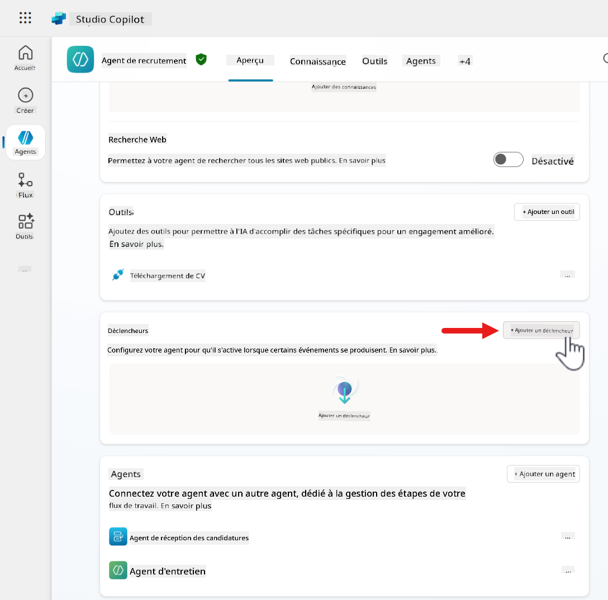

1. Une liste de déclencheurs apparaîtra. Sélectionnez **Lorsqu'un nouvel email arrive (V3)** et cliquez sur **Suivant**.

       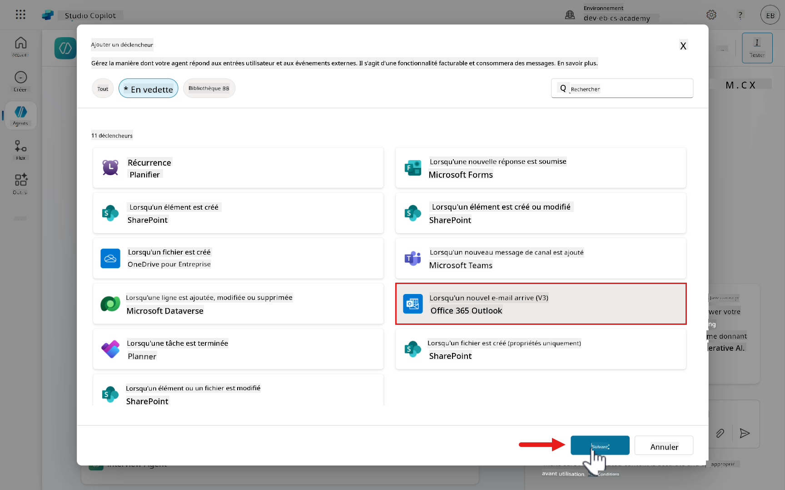

1. Vous verrez maintenant le **Nom du déclencheur** et les références de connexion **Connexion** pour les applications listées.

       Renommez le nom du déclencheur comme suit :
    
       ```text
       Lorsqu'un nouvel email arrive d'un candidat
       ```

       Assurez-vous de voir une coche verte à côté de chaque référence de connexion des applications listées. Si vous ne voyez pas de coche verte, connectez-vous via les ellipses (...) et sélectionnez **+ Nouvelle référence de connexion** pour créer une nouvelle référence de connexion.

       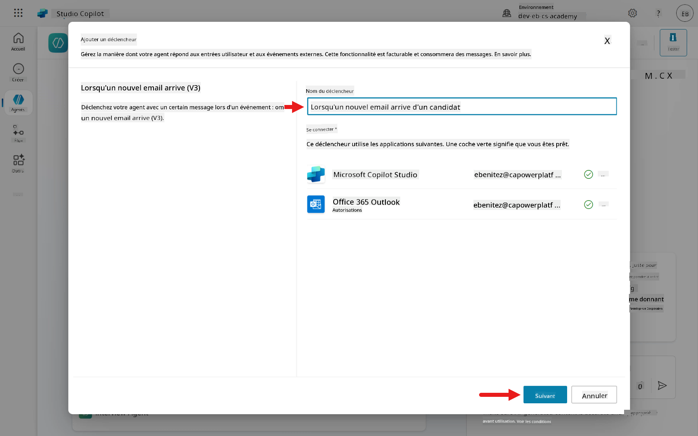

1. La dernière étape consiste à définir les propriétés d'entrée du déclencheur. Mettez à jour les propriétés suivantes comme suit :

     | Propriété | Comment configurer | Détails |
     |----------|--------------------|---------|
     | **Inclure les pièces jointes (Optionnel)** | Menu déroulant | Oui |
     | **Filtre de sujet (Optionnel)** | Taper/Entrer au clavier | Application |
     | **Uniquement avec pièces jointes (Optionnel)** | Menu déroulant | Oui |

       Cliquez sur **Créer un déclencheur**.

       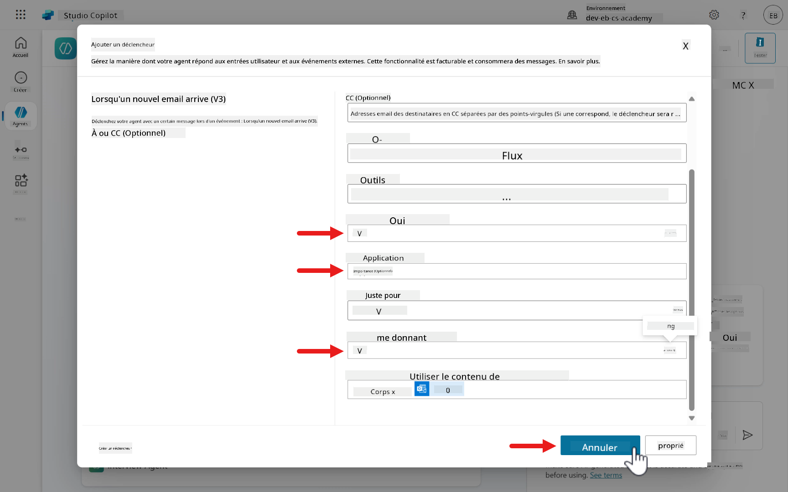

1. Une fois créé, un message de confirmation apparaîtra indiquant que le déclencheur a été ajouté à l'agent. Cliquez sur **Fermer** et le déclencheur sera listé dans la section **Déclencheurs**.
Nous allons maintenant mettre à jour le déclencheur d'événement pour ajouter davantage de capacités d'automatisation. Sélectionnez les **trois points (...)** à côté du déclencheur et choisissez **Modifier dans Power Automate**.

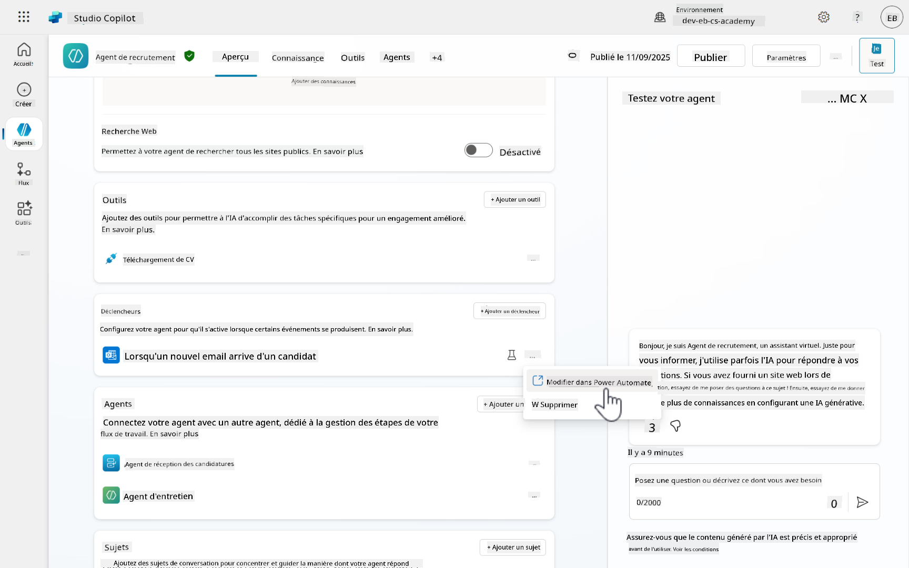

1. Le déclencheur se chargera ensuite sous forme de flux dans le portail de création Power Automate. Ce que vous voyez est le concepteur de flux dans le portail de création Power Automate. C'est ici que nous pouvons ajouter une logique et des actions supplémentaires pour une automatisation accrue. Le déclencheur apparaîtra en haut, suivi de **Envoie une invite au copilote spécifié pour traitement** comme dernière action du flux.

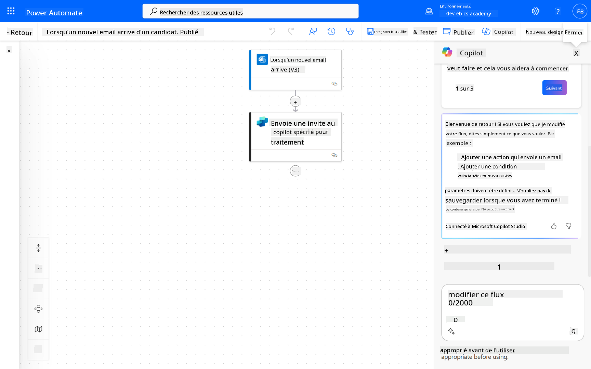

1. Par défaut, le déclencheur **Lorsqu'un nouvel e-mail arrive** dans Power Automate peut traiter plusieurs e-mails ensemble si plusieurs arrivent en même temps, exécutant le flux une seule fois pour le lot.

Pour garantir que le flux s'exécute séparément pour chaque e-mail, activez le paramètre **Split On** dans les paramètres du déclencheur et sélectionnez `@triggerOutputs()?['body/value']` dans le champ de tableau déroulant.

Avec **Split On** activé et le champ de tableau défini sur `@triggerOutputs()?['body/value']`, le flux s'exécutera individuellement pour chaque message, même si plusieurs arrivent simultanément.

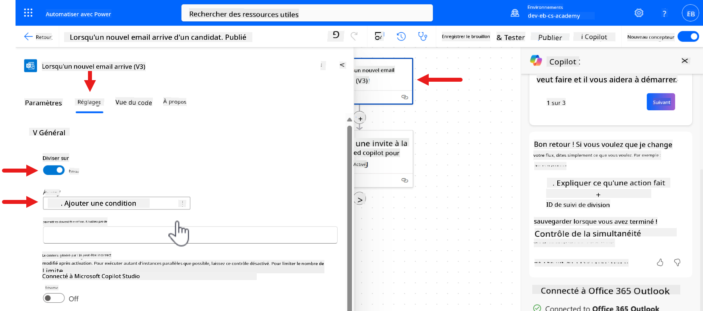

1. Ajoutons ensuite une logique pour vérifier le type de fichier de la pièce jointe. Nous voulons uniquement télécharger les pièces jointes au format .PDF et non les images (qui pourraient provenir des signatures d'e-mails). Sélectionnez l'icône **+** sous le déclencheur et choisissez **Contrôle** dans la section **Outils intégrés**.

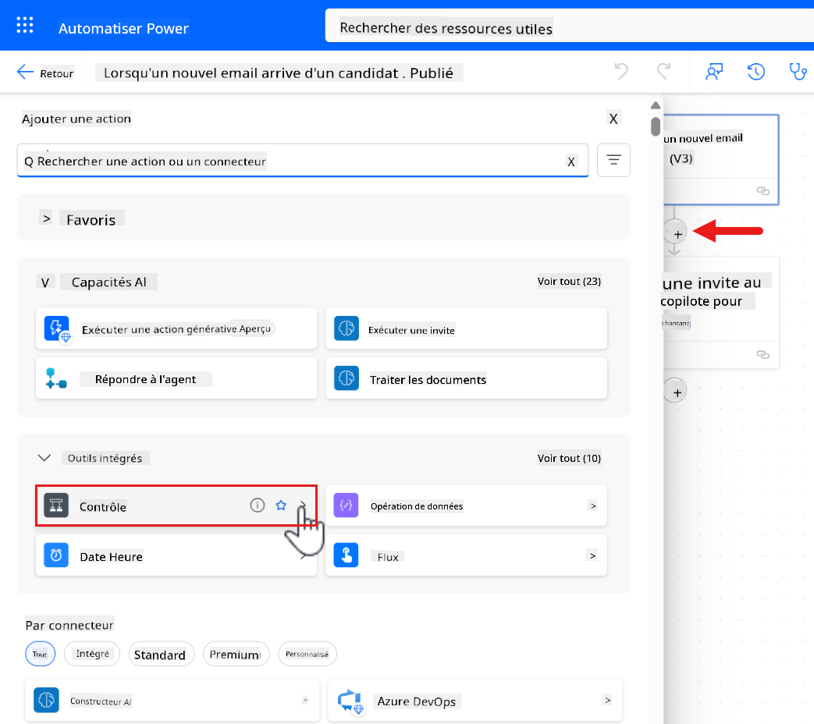

1. Sélectionnez l'action **Condition**.

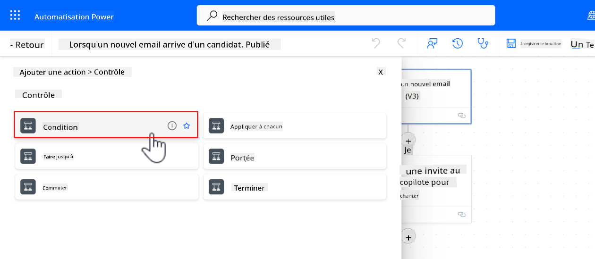

1. Configurez maintenant la condition pour vérifier si le type de fichier de la pièce jointe est .PDF. Dans le champ **Choisir une valeur**, sélectionnez l'**icône éclair** ou l'**icône fx** à droite.

1. Dans le champ **Recherche**, tapez ce qui suit :

```text
content type
```

1. Ensuite, sélectionnez le paramètre **Attachments Content-Type** du déclencheur.

1. Sélectionnez ensuite **Ajouter** pour ajouter l'entrée de contenu dynamique dans le paramètre **Id** de l'action.

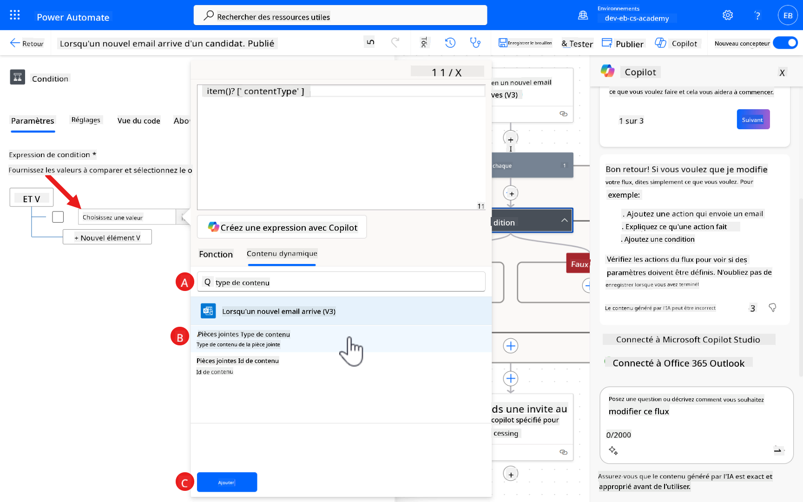

1. Faisons une pause ici un instant, vous avez probablement remarqué que l'action **Pour chaque** est apparue automatiquement.

Sélectionnez l'action **Pour chaque**. Cette action représente une boucle à travers chaque pièce jointe dans l'e-mail, puisque le paramètre **Attachments Content-Type** du déclencheur est lié à chaque pièce jointe.

En coulisses, c'est un tableau, et c'est pourquoi l'action **Pour chaque** a été automatiquement ajoutée lorsque nous avons sélectionné le paramètre **Attachments Content-Type** dans l'action **Condition**.

Pour en savoir plus à ce sujet, développez le bloc d'apprentissage supplémentaire suivant.

??? info "Apprentissage supplémentaire : L'action Pour chaque apparaît automatiquement"

🤔 **Pourquoi "Appliquer à chaque" ou "Pour chaque" apparaît automatiquement ?**

Lorsque vous sélectionnez un paramètre (contenu dynamique) qui représente une liste ou un tableau d'éléments - par exemple, une liste de pièces jointes, d'e-mails ou de lignes - Power Automate reconnaît que vous pourriez vouloir traiter chaque élément individuellement.

Pour vous aider à le faire, Power Automate ajoute automatiquement une boucle **“Appliquer à chaque”** (ou **Pour chaque**) autour de votre action. Cela garantit que votre action s'exécutera une fois pour chaque élément de la liste, plutôt que d'essayer de traiter toute la liste en une seule fois (ce qui pourrait provoquer des erreurs).

🦋 **Exemple**

- Si vous sélectionnez "Attachments" d'une action précédente (qui est un tableau), et essayez de l'utiliser dans une action qui attend un fichier unique, Power Automate enveloppe votre action dans une boucle **"Appliquer à chaque"** (ou **Pour chaque**). 
- Ainsi, votre action s'exécutera pour **chaque pièce jointe** - une à la fois.

💡 **Points clés**

- **Automatique :** La boucle apparaît automatiquement pour vous aider à traiter chaque élément dans une collection.
- **Évite les erreurs :** Sans la boucle, votre action pourrait échouer car elle ne peut pas gérer plusieurs éléments à la fois.
- **Indicateur visuel :** C'est une manière visuelle de montrer que votre flux répétera l'action pour chaque élément de la liste.

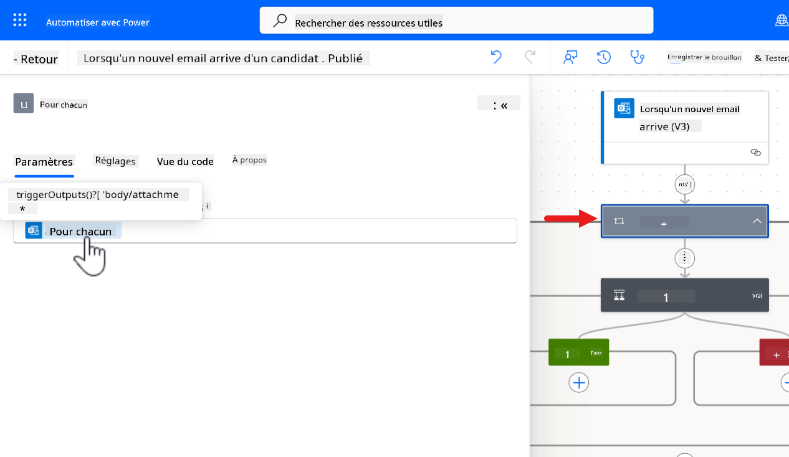

1. Ensuite, dans l'autre champ **Choisir une valeur**, tapez ce qui suit :

```text
application/pdf
```

Cela garantira que pour chaque pièce jointe, le format d'extension de fichier sera vérifié pour être .PDF.

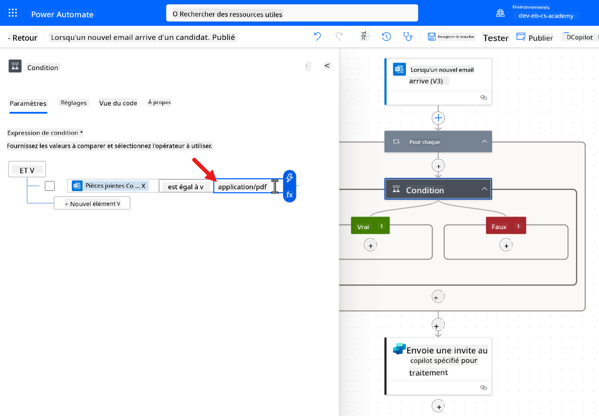

1. Nous allons maintenant configurer le chemin **True** pour extraire le fichier de l'e-mail et le télécharger dans la table **Resume** de Dataverse.

Ajoutez une nouvelle action ci-dessous dans le chemin **True** et recherchez `html to text`. Sélectionnez l'action **Html to text**.

Pour en savoir plus sur l'action **Html to text**, développez le bloc d'apprentissage supplémentaire suivant.

??? info "Apprentissage supplémentaire : Action Html to text"

🤔 **Qu'est-ce que l'action "HTML to text" ?**

L'action **HTML to text** dans Power Automate est utilisée pour convertir du contenu formaté en HTML en texte brut. Cela est particulièrement utile lorsque vous recevez des données (comme des e-mails, du contenu web ou des réponses API) contenant des balises HTML, et que vous souhaitez extraire uniquement le texte lisible sans aucun formatage ou code.

⚙️ **Comment cela fonctionne ?**

- **Entrée :** Vous fournissez une chaîne de contenu HTML (par exemple, le corps d'un e-mail).
- **Sortie :** L'action supprime toutes les balises HTML et renvoie uniquement le texte brut.

👍🏻 **Quand l'utiliser ?**

- Lorsque vous souhaitez extraire du texte lisible à partir d'e-mails, de pages web ou de réponses API contenant du HTML.
- Avant d'envoyer du contenu à des systèmes qui ne prennent pas en charge le format HTML (comme les SMS, les messages Teams ou les bases de données).
- Pour nettoyer les données en vue d'un traitement ou d'une analyse ultérieure.

🔭 **Où le trouver ?**

- Dans Power Automate pour les flux d'agent, recherchez l'action appelée `HTML to text`. Elle se trouve sous le connecteur **Opérations de données**.

💡 **Points clés**

- Elle supprime toutes les balises HTML et ne laisse que le texte.
- Elle n'interprète ni n'exécute les scripts/styles - elle se contente de supprimer les balises.
- Utile pour le nettoyage des données et la préparation du contenu pour des sorties en texte brut.

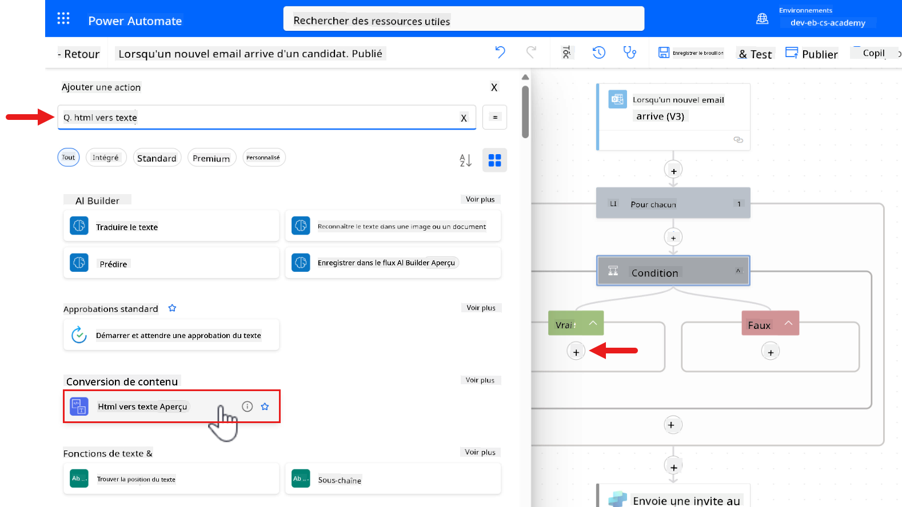

1. Ensuite, nous devons créer une nouvelle référence de connexion pour l'action **Html to text** en sélectionnant **Ajouter nouveau**.

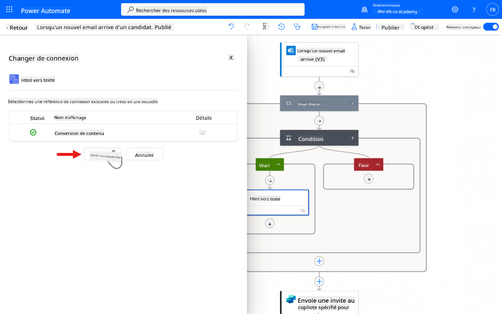

1. L'action peut maintenant être configurée. Ajoutons le paramètre **Body** du déclencheur. Dans le champ **Contenu**, sélectionnez l'**icône éclair** ou l'**icône fx** à droite.

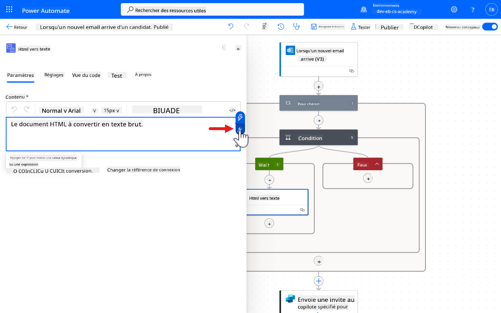

1. Dans l'onglet **Contenu dynamique**, recherchez `body` et sélectionnez le paramètre **Body**, puis cliquez sur **Ajouter**.

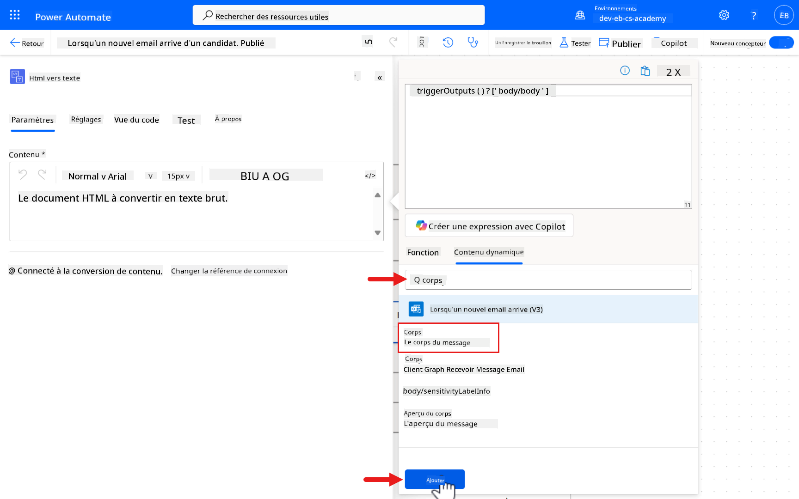

1. Nous avons terminé de configurer cette action, alors sortons de l'action en sélectionnant les deux chevrons («) pointant vers la gauche pour réduire le panneau.

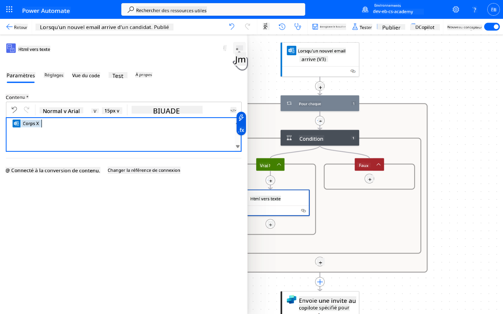

1. Ajoutons une nouvelle action en sélectionnant l'**icône +** sous l'action **Html to text**, ce qui chargera le panneau pour ajouter des actions. Sélectionnez le connecteur **Microsoft Dataverse**.

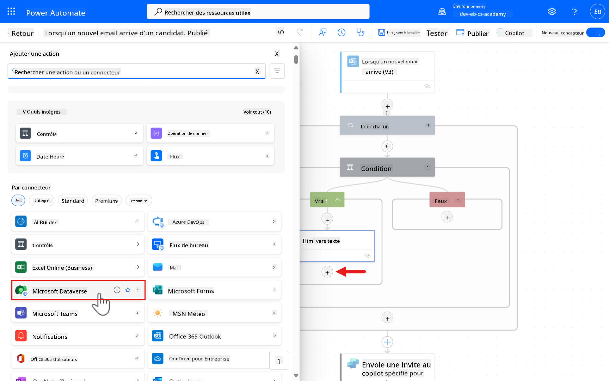

1. Sélectionnez l'action **Ajouter une nouvelle ligne**.

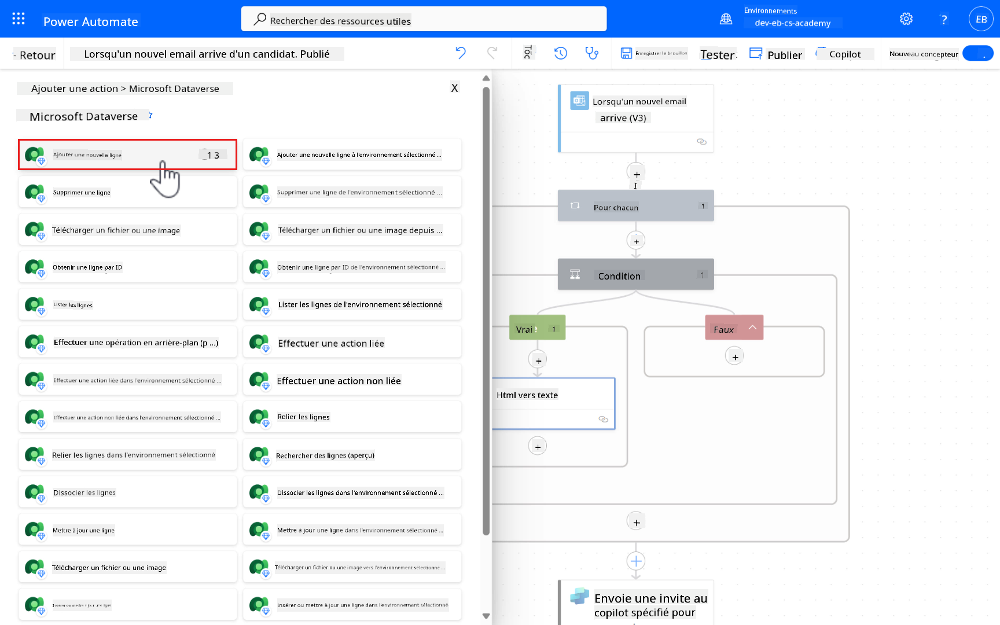

1. Renommez l'action en sélectionnant les **trois points (...)**, copiez et collez le texte suivant comme nom :

```text
Ajouter une nouvelle ligne de CV
```

Pour le paramètre **Nom de la table**, recherchez `res` et sélectionnez la table **Resumes**.

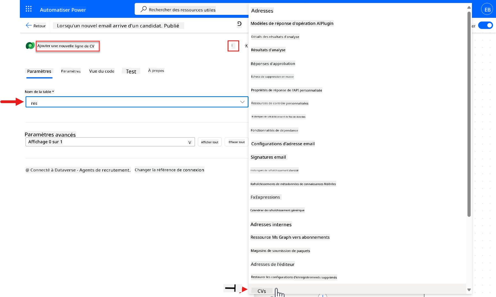

1. Sélectionnez ensuite le champ **Titre du CV** et cliquez sur l'**icône éclair** ou l'**icône fx** à droite.

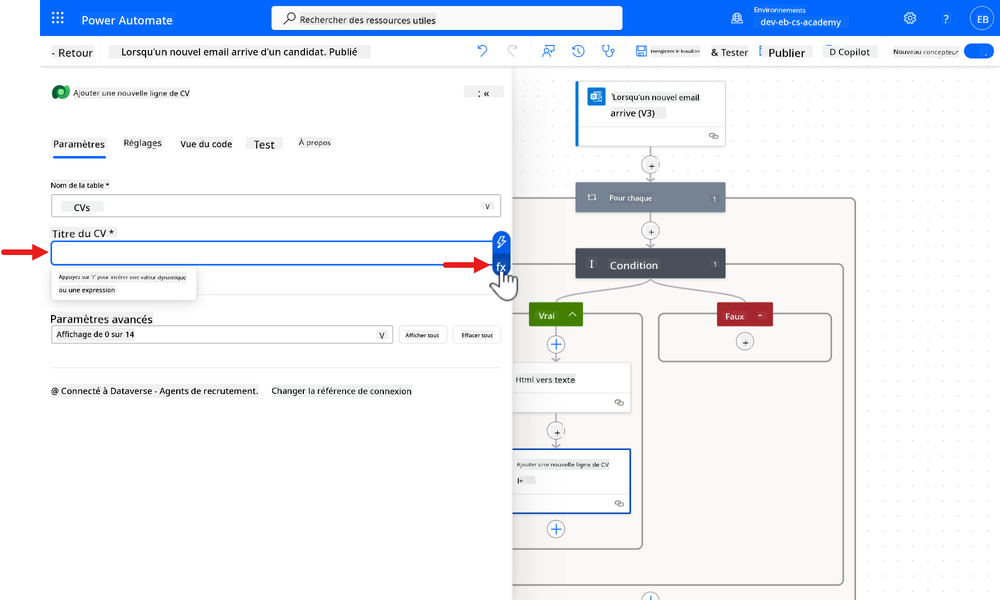

1. Dans l'onglet **Fonction**, entrez l'expression suivante qui utilise la fonction `item()`.

```text
item()?['name']
```

Pour en savoir plus sur la fonction `item()`, développez le bloc d'apprentissage supplémentaire suivant.

??? info "Apprentissage supplémentaire : Fonction `item()`"

🤔 **Qu'est-ce que la fonction `item()` ?**

- Lorsque vous utilisez une action **Appliquer à chaque**, Power Automate parcourt chaque élément dans une collection (tableau).
- Elle est le plus souvent utilisée dans des actions comme **Appliquer à chaque** (ou **Pour chaque**), **Sélectionner**, ou **Filtrer un tableau**.

⚙️ **Comment cela fonctionne ?**

- `item()` est une fonction qui renvoie l'élément actuel en cours de traitement dans une boucle ou une opération de tableau.
- À l'intérieur de cette boucle, `item()` fait référence à l'_élément actuel_ en cours de traitement.

📌 **Où l'utiliser ?**

- **Appliquer à chaque :** pour accéder aux propriétés de l'élément actuel.
- **Sélectionner :** pour transformer chaque élément dans un tableau.
- **Filtrer un tableau :** pour référencer l'élément actuel évalué.

🦋 **Exemple**

- Expression dans une boucle :
       -  `item()?['Email']`
- Cela récupère la propriété `Email` de l'élément actuel.

💡 **Points clés**

- `item()` est _sensible au contexte_ : il fait toujours référence à l'élément actuel dans la boucle ou l'opération de tableau dans laquelle vous vous trouvez.
- Si vous imbriquez des boucles, vous pouvez utiliser `items('NomDeLaBoucle')` pour référencer des éléments dans une boucle spécifique.

Sélectionnez **Ajouter** pour ajouter l'expression au paramètre **Titre du CV**.

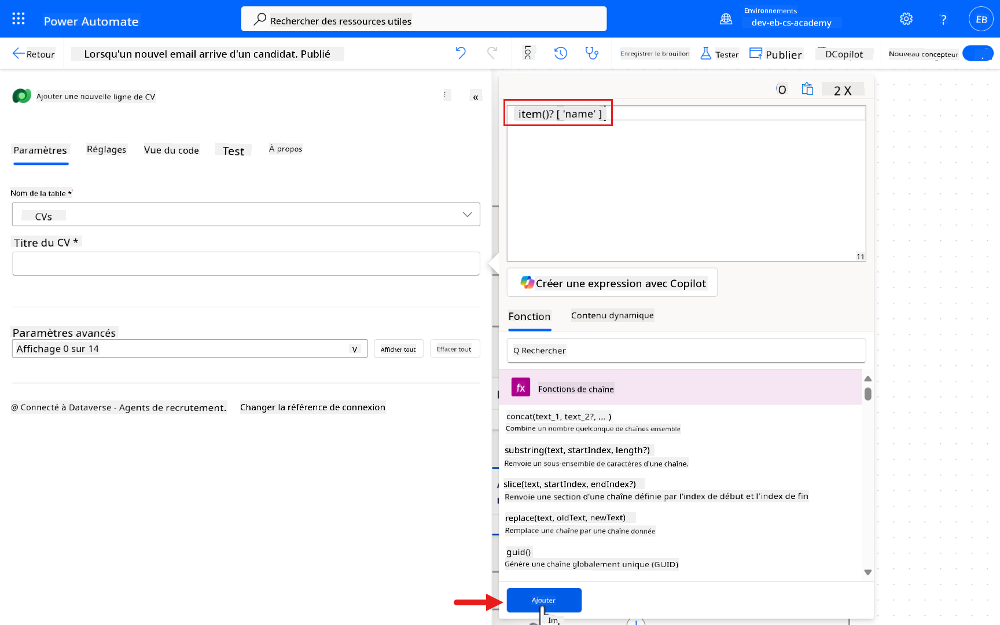

1. Nous devons encore configurer plusieurs paramètres. Sélectionnez **Afficher tout** et dans le champ **Lettre de motivation**, cliquez sur l'**icône éclair** ou l'**icône fx** à droite.

Dans l'onglet **Fonction**, entrez l'expression suivante qui utilise la même expression dans la [mission précédente](../02-multi-agent/README.md).

```text
if(greater(length(body('Html_to_text')), 2000), substring(body('Html_to_text'), 0, 2000), body('Html_to_text'))
```

Cette expression vérifie si le _texte_ de l'action **Html to text** dépasse 2000 caractères, et si c'est le cas, renvoie uniquement les 2000 premiers caractères ; sinon, elle renvoie le texte complet.

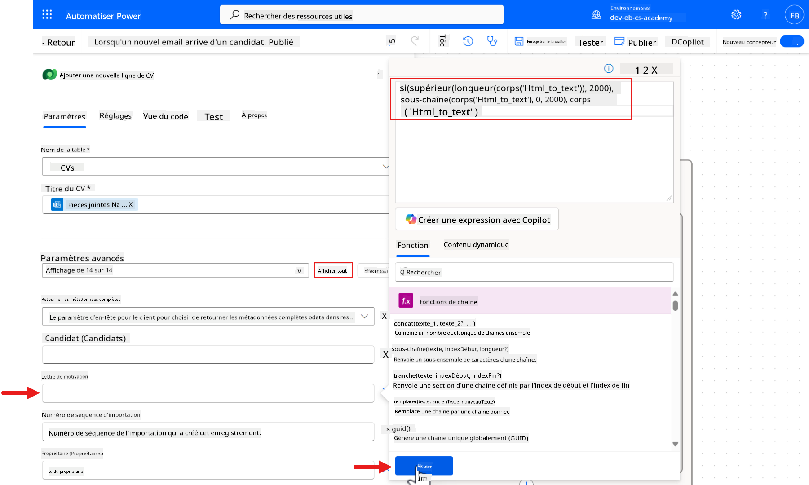

1. L'expression sera maintenant ajoutée au champ **Lettre de motivation**.

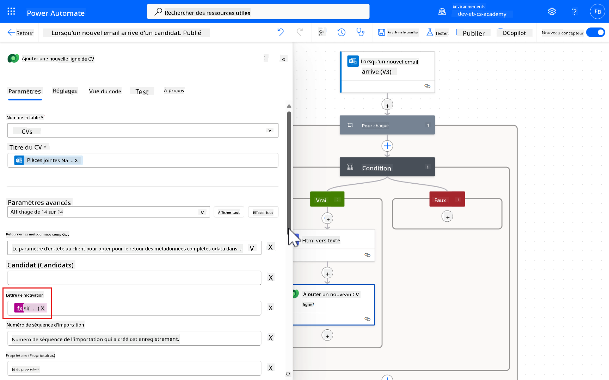

1. Pour le champ **Adresse e-mail source**, recherchez `from` et sélectionnez le paramètre **From** du déclencheur, car cela contient la valeur de l'adresse e-mail.


1. Pour le champ **Date de téléchargement**, cliquez sur l'**icône éclair** ou l'**icône fx** à droite. Dans l'onglet **Fonction**, entrez l'expression suivante qui utilise la fonction `utcNow()`.

```text
utcNow()
```

Pour en savoir plus sur la fonction `utcNow`, développez le bloc d'apprentissage supplémentaire suivant.

??? info "Apprentissage supplémentaire : Fonction `utcNow`"

🤔 **Qu'est-ce que la fonction `utcNow()` ?**

- La fonction utcNow() dans Power Automate renvoie la date et l'heure actuelles en Temps Universel Coordonné (UTC) dans un format ISO 8601, comme : `2025-09-23T04:32:14Z`

🦋 **Exemple**

- Expression :
       -  `concat('Rapport généré le ', utcNow())`
- Résultat :
       - Rapport généré le `2025-09-23T04:32:14Z`

💡 **Points clés**
- **Aucun argument (paramètres d'entrée) requis :** il fournit toujours l'horodatage UTC actuel.
   - **Cas d'utilisation**
       - Ajouter des horodatages aux journaux ou aux noms de fichiers
       - Comparer l'heure actuelle avec d'autres dates
       - Planification ou conditions basées sur le temps

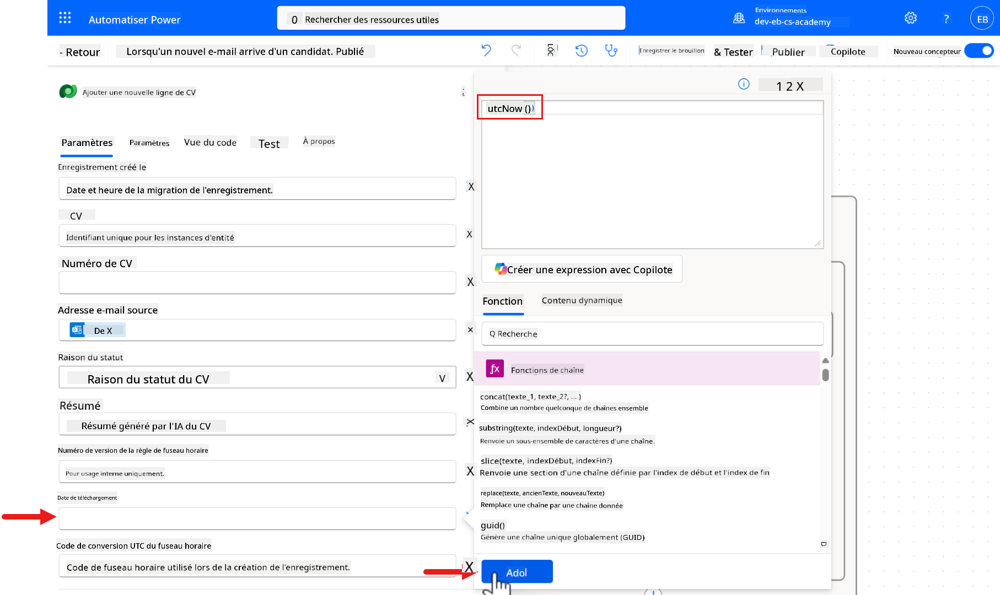

1. Nous avons maintenant terminé la configuration de l'action **Ajouter une nouvelle ligne de CV**, alors quittons le panneau en le réduisant.

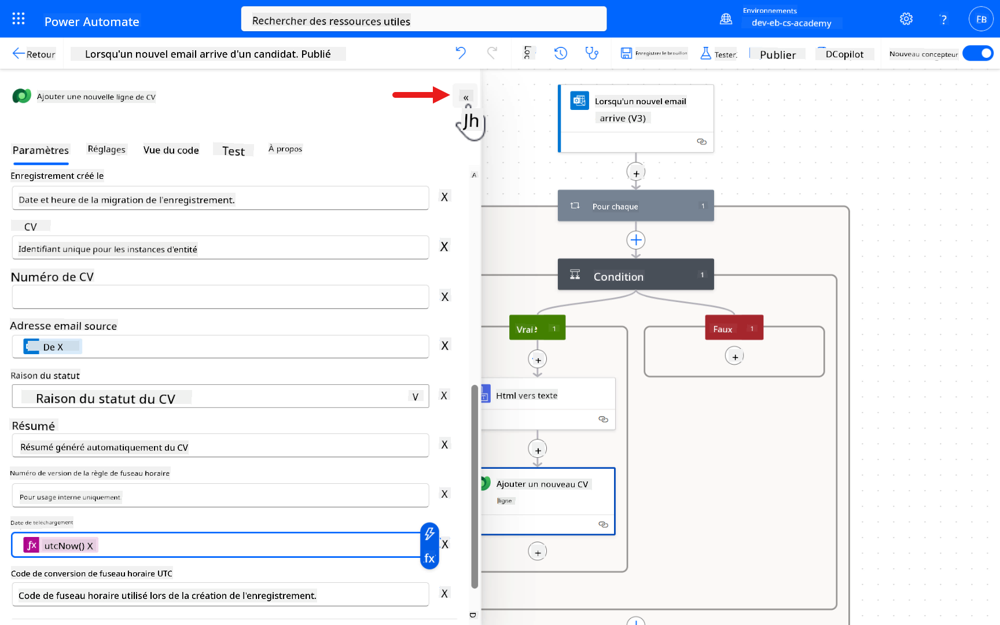

1. Nous allons ajouter une nouvelle action en sélectionnant l'**icône +** sous l'action **Ajouter une nouvelle ligne de CV**, ce qui chargera le panneau pour ajouter des actions. Sélectionnez à nouveau le connecteur **Microsoft Dataverse**.

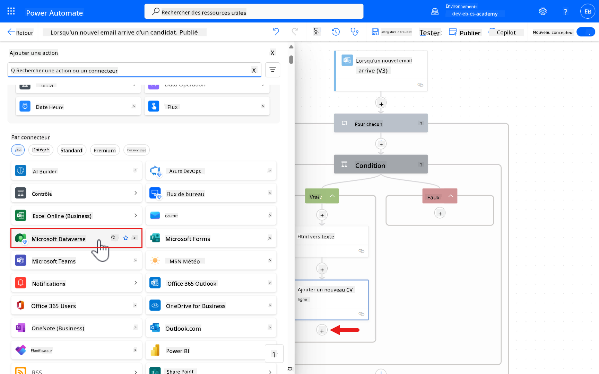

1. Sélectionnez l'action **Télécharger un fichier ou une image**.

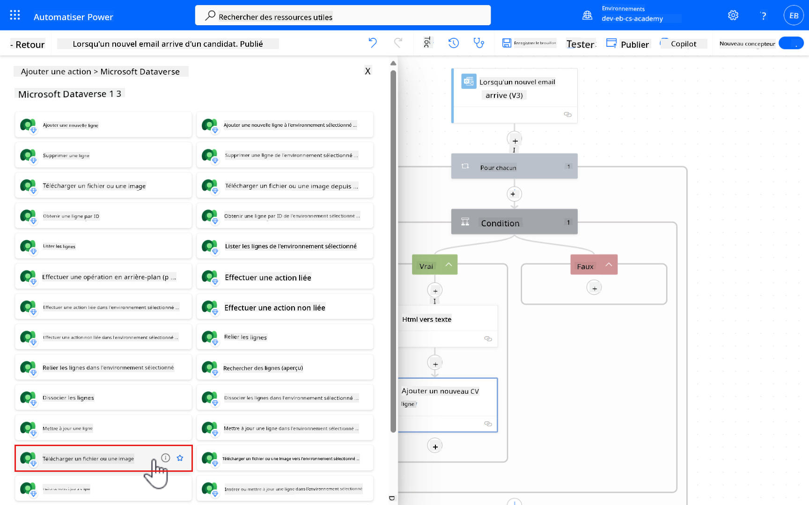

1. Renommez l'action en sélectionnant les **trois points (...),** copiez et collez le texte suivant comme nom :

```text
Upload Resume File
```

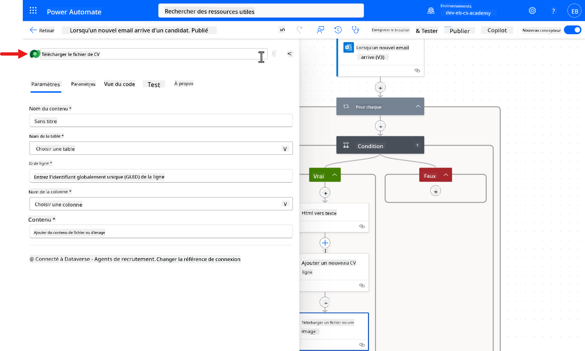

1. Sélectionnez ensuite le champ **Nom du contenu** et cliquez sur l'**icône éclair** ou l'**icône fx** à droite.

Dans l'**onglet Fonction**, entrez l'expression suivante qui utilise la fonction `item ()`. Cela récupère la propriété `name` de l'élément actuel (le fichier joint).

```text
item()?['name']
```

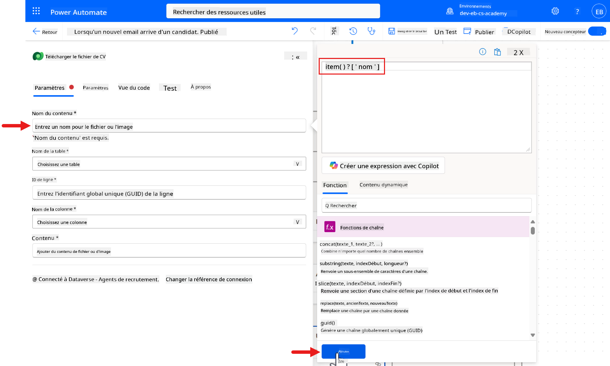

1. Pour le paramètre **Nom de la table**, recherchez `res` et sélectionnez la table **Resumes**.

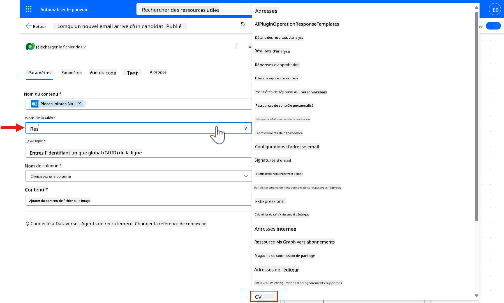

1. Sélectionnez ensuite le champ **ID de ligne** et cliquez sur l'**icône éclair** ou l'**icône fx** à droite.

Recherchez `ID` et sélectionnez le paramètre **Resume** de l'action Dataverse _Ajouter une nouvelle ligne_, car il contient la valeur ID de la ligne où télécharger le fichier PDF.

Sélectionnez **Ajouter**.

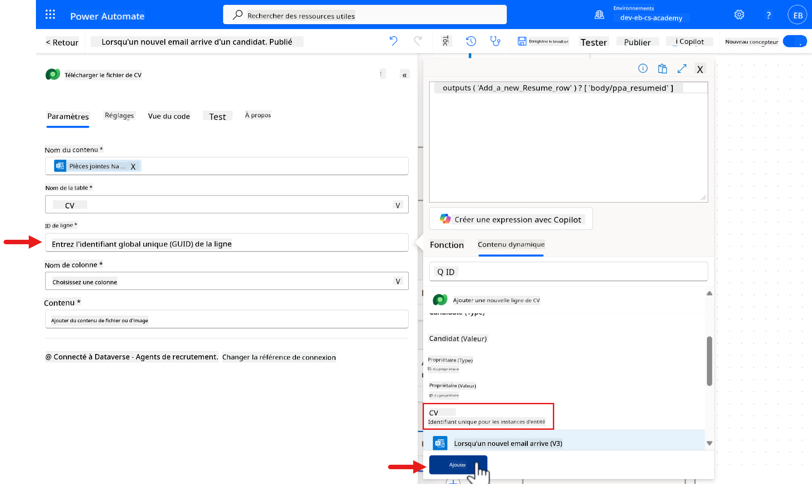

1. Sélectionnez le champ **Nom de la colonne** et choisissez l'option **Resume PDF**.

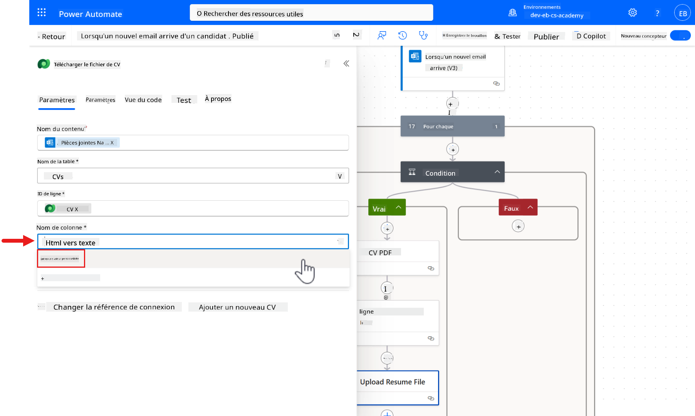

1. Sélectionnez le champ **Contenu** et cliquez sur l'**icône éclair** ou l'**icône fx** à droite.

Dans l'**onglet Fonction**, entrez l'expression suivante qui utilise la fonction `item ()`. Cela récupère la propriété `contentBytes` de l'élément actuel (le fichier joint). `contentBytes` fait référence aux données binaires brutes d'un fichier ou d'une pièce jointe, encodées en chaîne Base64.

```text
item()?['contentBytes']
```

1. Nous avons terminé la configuration de cette action, alors quittons l'action en sélectionnant les deux chevrons («) pointant vers la gauche pour réduire le panneau.


1. Ensuite, sélectionnez l'action **Envoie une invite au copilote spécifié pour traitement**, puis faites glisser et déposez cette action sous l'action **Télécharger le fichier de CV** dans le chemin _True_ de la condition.

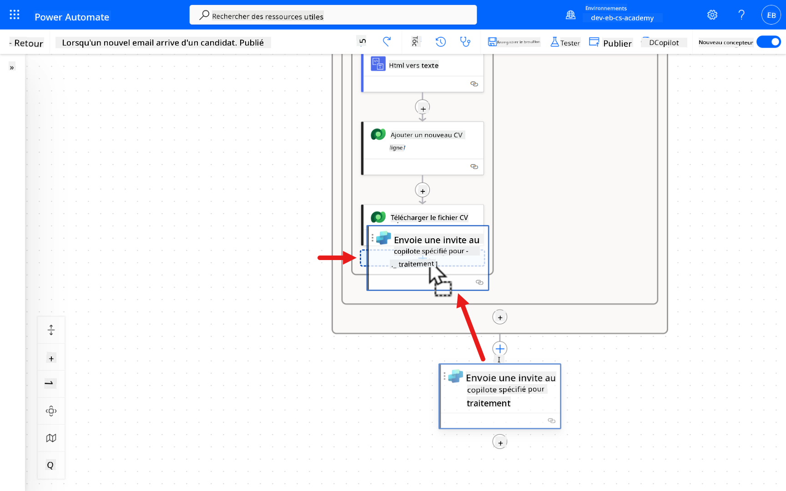

1. Sélectionnez l'action **Envoie une invite au copilote spécifié pour traitement** pour la configurer.

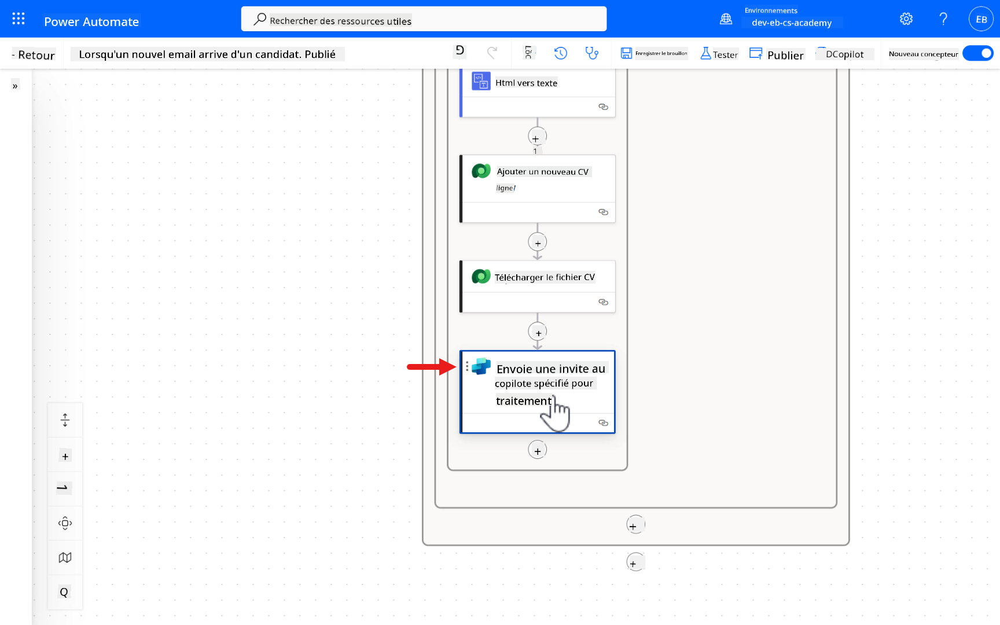

1. Dans le champ **Corps/message**, sélectionnez tout le contenu du champ et effacez/supprimez-le.

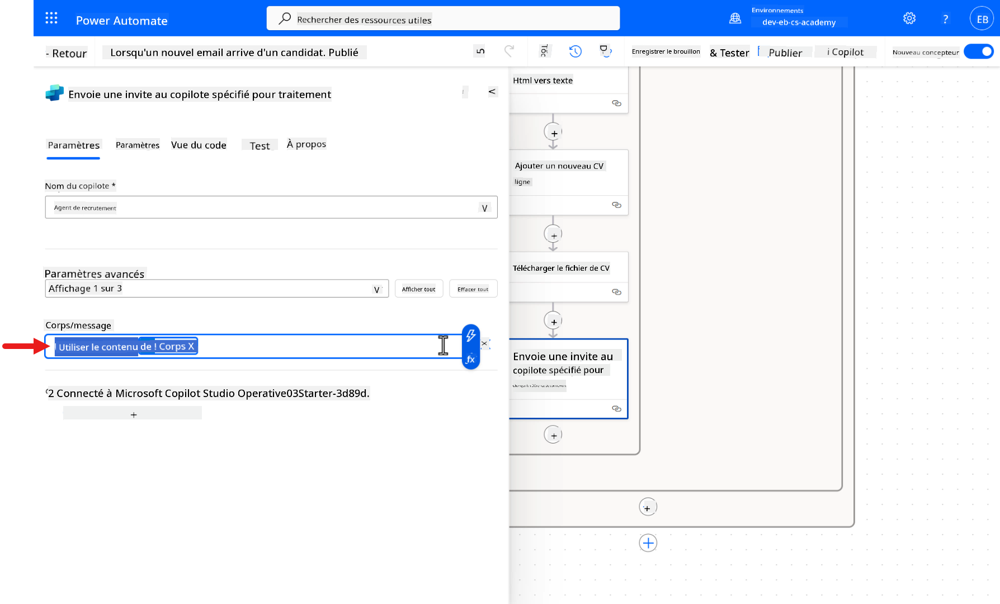

1. Copiez et collez le texte suivant dans le champ **Corps/message** et mettez en surbrillance le `RESUME ID PLACEHOLDER`.

```text
Send [ResumeId (text)] = "RESUME ID PLACEHOLDER" and [ResumeTitle (text_1)] = "RESUME TITLE PLACEHOLDER" and [ResumeNumber (text_2)]= "RESUME NUMBER PLACEHOLDER" to the Tool "Notify Teams Applicant channel" in the child agent "Application Intake Agent"
```

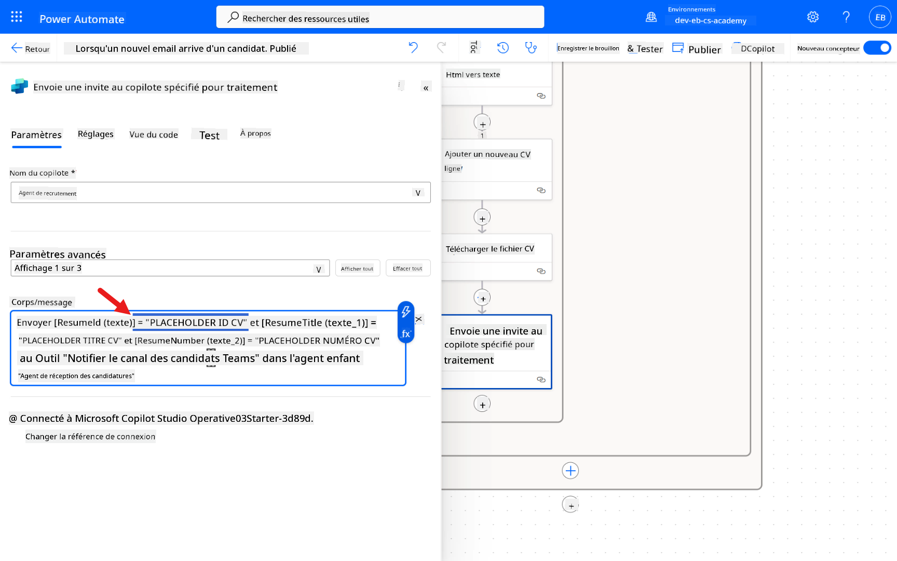

1. Sélectionnez l'**icône éclair** ou l'**icône fx** à droite.

Recherchez `resume` et sélectionnez le paramètre **Resume** de l'action _Ajouter une nouvelle ligne Dataverse_, car il contient la valeur `ID` de la ligne de CV créée.

Sélectionnez **Ajouter**.

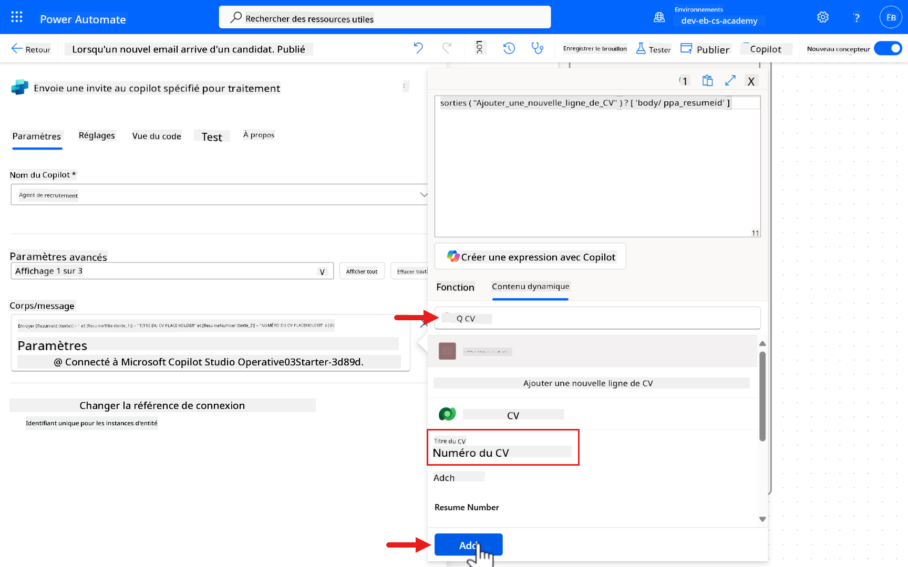

1. Mettez en surbrillance le `RESUME TITLE PLACEHOLDER`. Sélectionnez l'**icône éclair** ou l'**icône fx** à droite.

Recherchez `title` et sélectionnez le paramètre **Titre du CV** de l'action _Ajouter une nouvelle ligne Dataverse_, car il contient la valeur `titre du CV` de la ligne de CV créée.

Sélectionnez **Ajouter**.

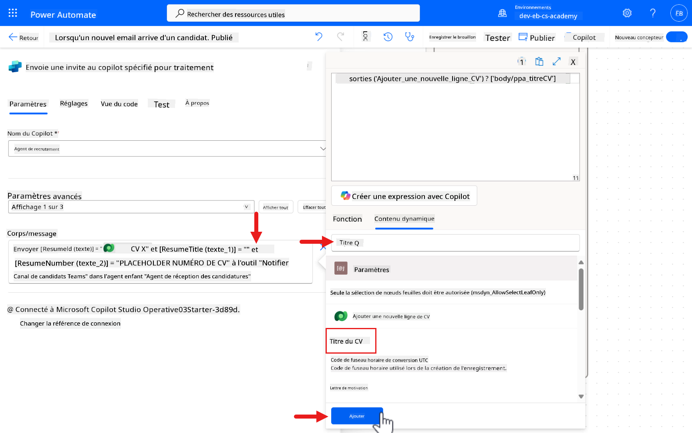

1. Mettez en surbrillance le `RESUME NUMBER PLACEHOLDER`. Sélectionnez l'**icône éclair** ou l'**icône fx** à droite.

Recherchez `resume number` et sélectionnez le paramètre **Numéro de CV** de l'action _Ajouter une nouvelle ligne Dataverse_, car il contient la valeur `Numéro de CV` de la ligne de CV créée.

Sélectionnez **Ajouter**.

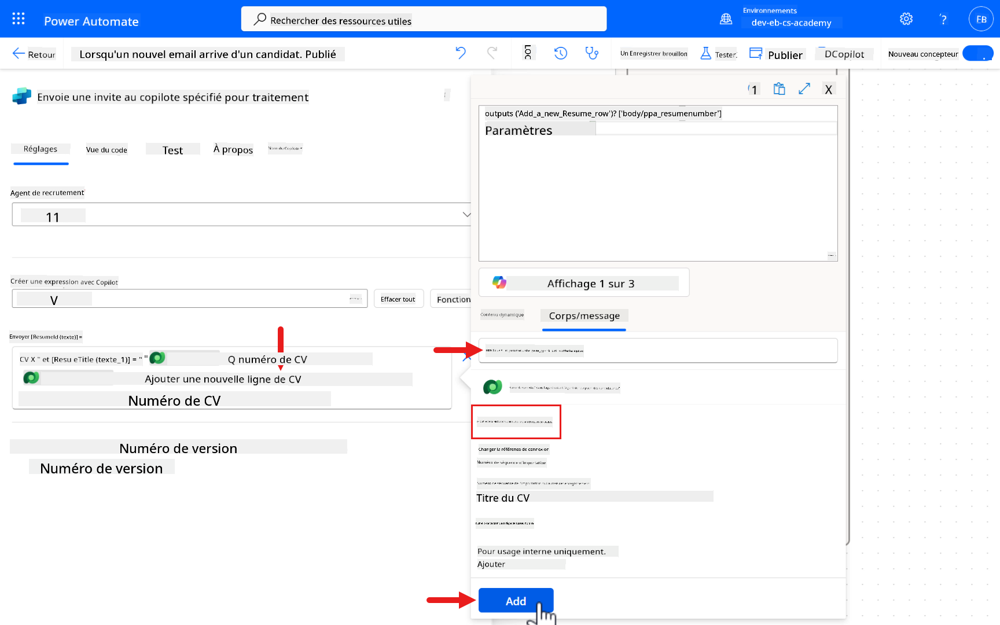

1. Nous avons terminé la configuration de cette action et de notre flux d'agent 🙌🏻 Vous faites un excellent travail ! Maintenant, enregistrons notre flux de déclenchement d'événement en sélectionnant **Enregistrer le brouillon**.

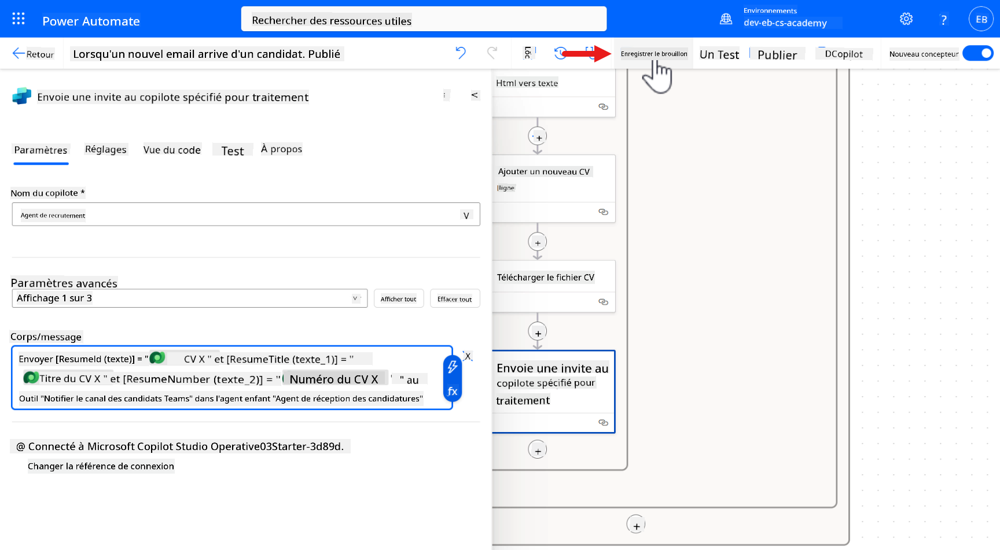

1. Nous devons maintenant modifier les détails du flux d'agent, sélectionnez **Retour**.

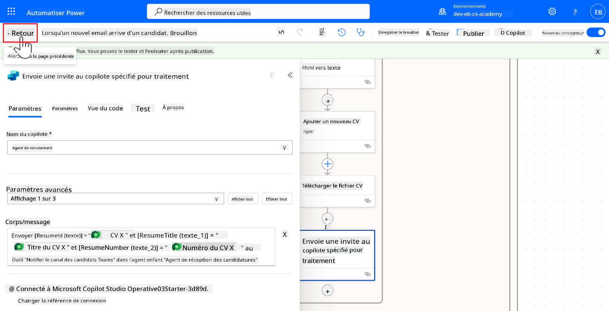

1. Sélectionnez **Modifier** dans la section **Détails** et mettez à jour le **Plan** avec l'option **Copilot Studio**.

Sélectionnez **Enregistrer**.

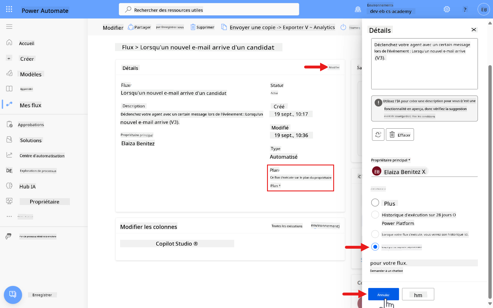

1. Une fenêtre modale apparaîtra pour vous demander de confirmer le passage au plan Copilot Studio. Sélectionnez **Confirmer**.

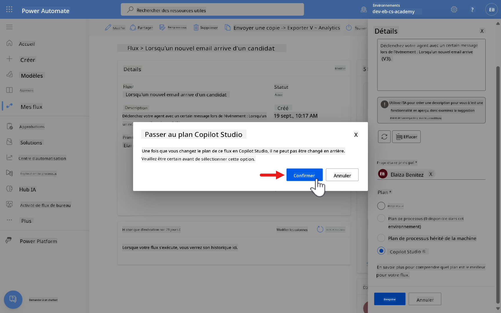

1. Le plan est maintenant mis à jour vers **Copilot Studio**. Sélectionnez **Modifier** car nous devons publier le flux de déclenchement d'événement pour notre agent.

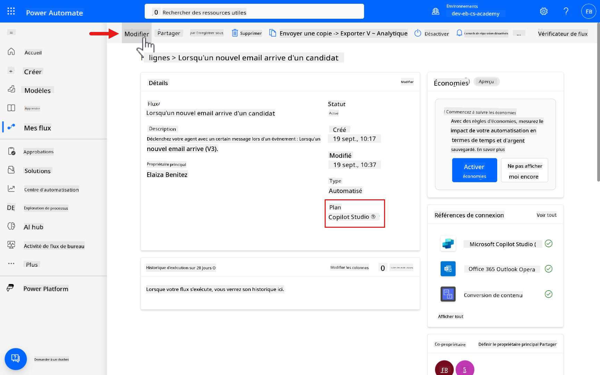

1. Sélectionnez **Publier**.

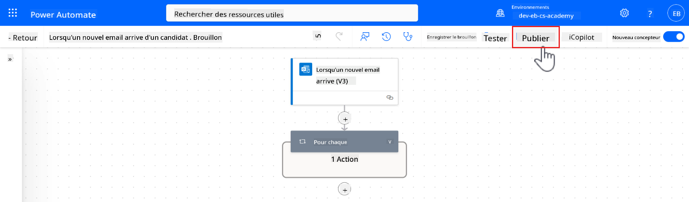

Hourra ! Le flux de déclenchement d'événement est maintenant publié 😃

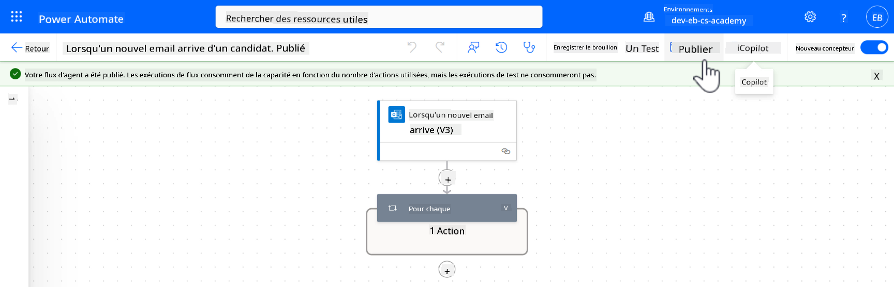

Passons à la création d'un nouveau flux d'agent qui sera invoqué par l'agent enfant **Intake Application Agent**.

### Lab 3.2 - Notifier un canal Teams en utilisant une carte adaptative

Nous allons maintenant créer un nouveau flux d'agent pour l'agent enfant **Intake Application Agent** qui utilise les valeurs transmises par le déclencheur d'événement, pour publier une carte adaptative dans un canal Teams. Cette carte adaptative alertera l'équipe de recrutement RH concernant le PDF qui a été automatiquement téléchargé afin qu'ils puissent l'examiner.

Commençons !

1. Dans l'**Agent de recrutement**, sélectionnez l'onglet **Agents** et choisissez l'**Agent Intake Application**.

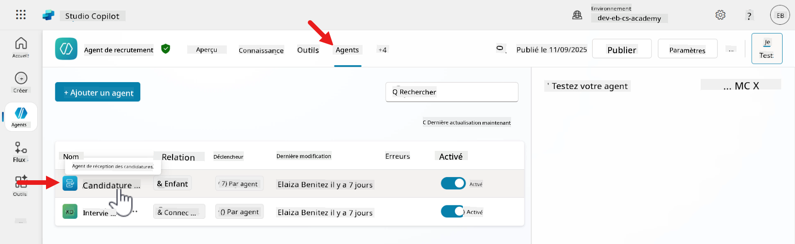

1. Faites défiler jusqu'à **Outils** et sélectionnez **+ Ajouter**.

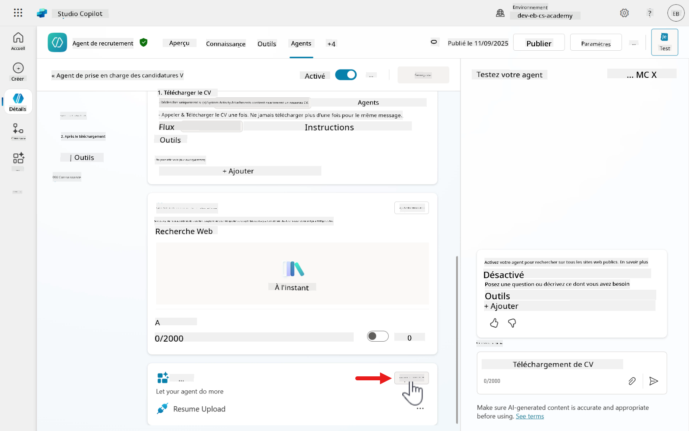

1. La fenêtre modale **Ajouter un outil** apparaîtra. Sélectionnez **+ Nouvel outil**.

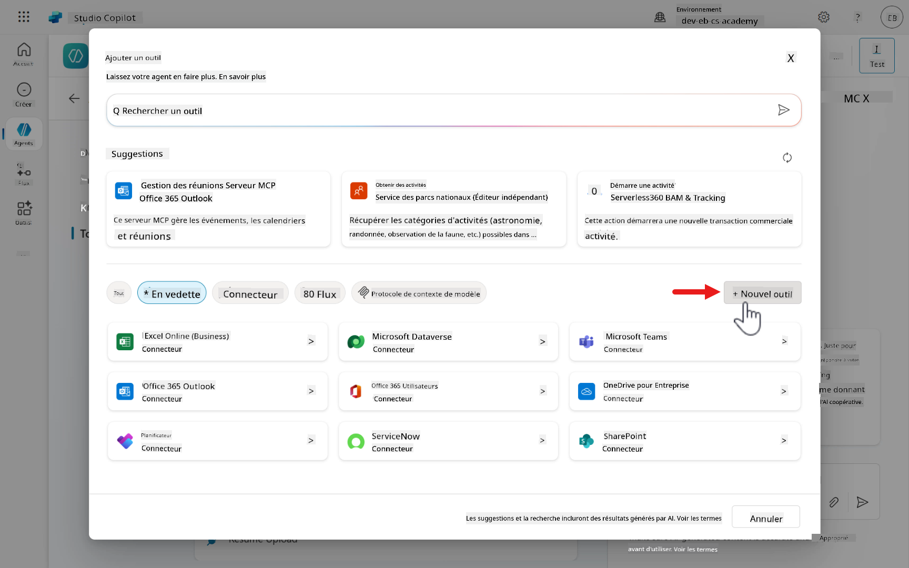

1. Sélectionnez **Flux d'agent**.


1. Le **designer de flux d'agent** se chargera ensuite. Dans le déclencheur **Quand un agent appelle le flux**, sélectionnez **+ Ajouter une entrée**.


1. Sélectionnez **Texte** comme type d'entrée utilisateur.


1. Dans le champ de texte d'entrée, copiez et collez le texte suivant comme nom de paramètre d'entrée.

```text
ResumeId
```


1. Répétez les mêmes étapes pour ajouter une deuxième entrée texte. Copiez et collez le texte suivant comme nom de paramètre d'entrée.

```text
ResumeTitle
```


1. Répétez les mêmes étapes pour ajouter une troisième entrée texte. Copiez et collez le texte suivant comme nom de paramètre d'entrée.

```text
ResumeNumber
```


1. Vous vous souvenez de [Recruit](../../recruit/08-add-adaptive-card/README.md#81-create-a-new-topic-with-an-adaptive-card-for-user-to-submit-their-request) où nous avons ajouté une carte adaptative dans un sujet pour notre agent ? Cette fois, nous allons ajouter une carte adaptative dans un flux d'agent. Nous allons maintenant ajouter une autre action à notre flux d'agent qui publiera une carte adaptative dans un canal Teams.

Sélectionnez l'**icône +** sous le déclencheur.


1. Sélectionnez l'action **Publier une carte dans une conversation ou un canal**.


1. Une référence de connexion à Microsoft Teams doit être créée avec votre compte utilisateur connecté. Sélectionnez **Se connecter**.


1. Sélectionnez votre compte utilisateur, puis cliquez sur **Autoriser l'accès**.


1. Pour les paramètres d'entrée suivants :

| Paramètre | Comment configurer | Détails |
|----------|--------------------|---------|
| **Publier en tant que** | Menu déroulant | Sélectionnez l'option `Bot de flux` |
| **Publier dans** | Menu déroulant | Sélectionnez l'option `Canal` |
| **Équipe** | Menu déroulant | Sélectionnez une équipe disponible dans votre environnement à laquelle vous avez accès pour réaliser cet exercice |
| **Canal** | Menu déroulant | Sélectionnez un canal disponible dans votre environnement à laquelle vous avez accès pour réaliser cet exercice |


1. Ensuite, nous allons configurer le champ **Carte adaptative**. Sélectionnez le champ **Carte adaptative**.


1. Ouvrez le fichier JSON [Resume Table Updated](../../../../../docs/operative-preview/03-automate-triggers/assets/3.2_ResumeTableUpdated.json), copiez son contenu intégral et collez-le dans le champ Carte adaptative.


1. Comme nous l'avons fait dans [Recruit](../../recruit/08-add-adaptive-card/README.md#81-create-a-new-topic-with-an-adaptive-card-for-user-to-submit-their-request), nous allons remplacer les valeurs existantes dans la charge utile JSON par des valeurs réelles ou du contenu dynamique.

Tout d'abord, mettons à jour l'URL pour la propriété `url` dans la propriété `selectAction`. Cette URL sera remplacée par l'URL de la vue système Resumes dans l'application modèle **Hiring Hub**. Cela permettra au recruteur de sélectionner l'action et d'être dirigé vers la vue système Resumes dans l'application modèle.

Mettez en surbrillance la valeur actuelle de l'URL et supprimez-la.


1. Dans l'application modèle **Hiring Hub**, accédez à la vue système **Resumes** en utilisant le menu latéral gauche et copiez l'URL. Ensuite, revenez au flux d'agent et collez l'URL copiée dans la propriété **url** de la propriété `selectAction`.


1. Vous devriez voir ce qui suit, où les détails de votre environnement de l'application pilotée par modèle **Hiring Hub** sont surlignés en jaune.

     | Paramètre | Valeur | Explication |
     |----------|------------|---------|
     | **URI de l'organisation** | GUID | L'URL de l'organisation de l'environnement Dataverse/Dynamics 365 |
     | **appid** | GUID | Pour ouvrir une application pilotée par modèle spécifique, le paramètre de requête appid ou appname est utilisé. Dans ce cas, appid est utilisé |
     | **viewid** | GUID | Le paramètre de requête qui est l'identifiant de la vue |

       

1. Ensuite, nous allons ajouter des valeurs de contenu dynamique pour plusieurs propriétés. Commençons par le texte qui affichera la référence du numéro de CV de la ligne créée automatiquement par le déclencheur d'événement.

      Sélectionnez l'icône **panneau** pour charger le panneau d'action.

       

1. Faites défiler jusqu'à la ligne où vous voyez la propriété `text` pour `RESUME NUMBER PLACEHOLDER`. Surlignez la valeur du placeholder et supprimez-la.

       

1. Cliquez entre les guillemets et sélectionnez l'icône **éclair** ou l'icône **fx** à droite.

      Dans l'onglet **Contenu dynamique**, sélectionnez le paramètre **ResumeNumber** et cliquez sur **Ajouter**.

       

1. Le paramètre **ResumeNumber** sera maintenant ajouté comme contenu dynamique à la propriété `text`.

       

1. Nous allons répéter les mêmes étapes pour le `RESUME NAME PLACEHOLDER`. Faites défiler jusqu'à la ligne où vous voyez la propriété `text` pour `RESUME NAME PLACEHOLDER`. Surlignez la valeur du placeholder et supprimez-la.

       

1. Cliquez entre les guillemets et sélectionnez l'icône **éclair** ou l'icône **fx** à droite.

      Dans l'onglet **Contenu dynamique**, sélectionnez le paramètre **ResumeTitle** et cliquez sur **Ajouter**.

       

1. Le paramètre **ResumeTitle** sera maintenant ajouté comme contenu dynamique à la propriété `text`.

       

1. Nous allons répéter les mêmes étapes pour la valeur **Date limite** qui représente la date à laquelle un recruteur doit examiner le CV. Faites défiler jusqu'à la ligne où vous voyez la propriété `text` pour `May 21, 2023`.

       

1. Supprimez cette valeur de placeholder de date et cliquez entre les guillemets.

       

1. Sélectionnez l'icône **éclair** ou **fx** à droite et dans l'onglet **Fonction**, entrez l'expression suivante et cliquez sur **Ajouter**.

       ```text
       addDays(utcNow(), 3, 'MMM dd, yyyy')
       ```

      Cette expression utilise deux fonctions.

     | Fonction | Explication |
     |----------|------------|
     | **addDays** | Ajoute un nombre spécifié de jours à une date donnée et retourne la date résultante au format chaîne |
     | **utcNow** | Retourne la date et l'heure actuelles au format UTC (temps universel coordonné) sous forme de chaîne. |

      Pour la valeur utcNow, nous formatons la date pour qu'elle soit mois et jour, suivis de l'année.

       

      L'expression sera maintenant ajoutée à la propriété `text`.

       

1. Enfin, nous allons mettre à jour l'URL pour la propriété `url` dans la propriété `actions` array en bas de la charge utile JSON. Cette URL de placeholder actuelle sera remplacée par l'URL de la ligne du CV dans l'application pilotée par modèle **Hiring Hub**. Cela permettra au recruteur de sélectionner l'action `Action.OpenURL` de la carte adaptative et d'être dirigé vers le CV dans l'application pilotée par modèle.

       

1. Dans l'application pilotée par modèle **Hiring Hub**, ouvrez une ligne dans la vue système **Resumes** en utilisant le menu latéral gauche. La ligne du CV se chargera sous forme de formulaire dans l'application pilotée par modèle.

      Copiez l'URL de la ligne du CV.

    ??? info "Comment revenir à l'application pilotée par modèle **Hiring Hub** si vous l'avez quittée/fermée"

        1. Accédez à [https://make.powerapps.com](https://make.powerapps.com) et assurez-vous d'être dans l'environnement de développement que vous utilisez pour ces exercices de laboratoire, sinon changez-le.
        
        

        1. Sélectionnez **Apps** dans le panneau de menu latéral gauche et pour l'application pilotée par modèle **Hiring Hub**, sélectionnez l'icône **Play** pour la charger dans votre navigateur.
        
        

       

1. Ensuite, revenez au flux de l'agent, surlignez la valeur actuelle de l'URL de placeholder et supprimez-la.

       

1. Ensuite, collez l'URL copiée dans la propriété **url** au sein de la propriété `url`.

       

1. Vous devriez voir ce qui suit. Supprimez la valeur id `GUID` à la fin. Nous allons remplacer ce contenu dynamique - le paramètre **ResumeId**.

       

1. Sélectionnez l'icône **éclair** ou **fx** à droite.

      Dans l'onglet **Contenu dynamique**, sélectionnez le paramètre **ResumeId** et cliquez sur **Ajouter**.

       

1. Le **ResumeId** sera ajouté comme contenu dynamique. Ce qui suit, surligné en jaune, sont les détails de votre environnement de l'application pilotée par modèle **Hiring Hub**.

     | Paramètre | Valeur | Explication |
     |----------|------------|---------|
     | **URI de l'organisation** | GUID | L'URL de l'organisation de l'environnement Dataverse/Dynamics 365 |
     | **appid** | GUID | Pour ouvrir une application pilotée par modèle spécifique, le paramètre de requête appid ou appname est utilisé. Dans ce cas, appid est utilisé |
     | **id** | GUID | Le paramètre de requête qui est l'identifiant de la ligne du CV |

       

1. Nous avons terminé la configuration de l'action **Post card in a chat or channel** 👏🏻 Quittez le panneau de configuration de l'action en sélectionnant l'icône **x**.

       

1. Enfin, nous allons configurer la dernière action, **Répondre à l'agent**, en envoyant un texte à l'agent pour terminer le traitement.

      Dans l'action **Répondre à l'agent**, sélectionnez **+Ajouter une sortie**.

       

1. Sélectionnez **Texte** comme type de sortie.

       

1. Entrez ce qui suit comme nom de la sortie.

       

1. Entrez ce qui suit comme valeur pour la sortie.

       ```text
       Terminé
       ```

       

1. Nous avons maintenant terminé la configuration du flux de l'agent. Sélectionnez **Enregistrer le brouillon** pour enregistrer le flux de l'agent. Un message de confirmation apparaîtra une fois enregistré.

       

1. Avant de publier le flux de l'agent, nous devons mettre à jour les détails du flux de l'agent. Sélectionnez l'onglet **Aperçu** et cliquez sur **Modifier**.

      Dans le champ du nom du flux, entrez ce qui suit.

       ```text
       Notifier le canal des candidats Teams
       ```      

      Ensuite, sélectionnez l'icône **Actualiser** pour mettre à jour la description du flux de l'agent en utilisant l'IA.

      Puis sélectionnez **Enregistrer** pour enregistrer les détails mis à jour du flux de l'agent.

       

1. Revenez à l'onglet **Designer** et sélectionnez **Publier** pour publier le flux de l'agent. Un message de confirmation apparaîtra une fois enregistré.

       

1. Le flux de l'agent doit maintenant être ajouté comme outil dans l'**Agent de réception des candidatures**. Revenez à l'**Agent de recrutement** et sélectionnez l'onglet **Agents**, puis sélectionnez l'**Agent de réception des candidatures**.

       

1. Dans la section **Détails** de l'agent, nous allons mettre à jour le champ **Description**. Copiez ce qui suit et collez-le à la fin du texte de description.

       ```text
       et également notifier le canal des candidats Teams
       ```

       

1. Ensuite, nous allons ajouter le flux de l'agent comme outil. Faites défiler vers le bas et sélectionnez **+ Ajouter**.

       

1. Sélectionnez le flux de l'agent créé précédemment, **Notifier le canal des candidats Teams**.

       

1. Sélectionnez ensuite **Ajouter et configurer**.

       

1. Dans la section **Entrées** du flux de l'agent, les trois entrées que nous avons configurées précédemment dans le flux de l'agent sont visibles. Par défaut, la configuration **Remplir en utilisant** est définie sur **Remplir dynamiquement avec l'IA**. Nous garderons ce paramètre tel quel, car l'invite du déclencheur d'événement (dans la dernière action, **Envoie une invite au copilote spécifié pour traitement** - cela correspond aux étapes 38-44 de **Lab 3.1 - Automatiser le téléchargement des CV dans Dataverse reçus par email**) contiendra les valeurs des paramètres que l'IA extraira.

       

1. Maintenant que l'outil a été ajouté à l'**Agent de réception des candidatures**, les instructions de l'agent doivent être mises à jour. Sélectionnez l'icône **flèche arrière** pour revenir à la liste des agents.

       

1. Sélectionnez l'**Agent de réception des candidatures** dans l'onglet **Agents** de l'**Agent de recrutement**.

       

1. Dans le champ **Instructions**, entrez une nouvelle ligne après les instructions `2.Post-Upload`. Copiez et collez les instructions suivantes.

       ```text
       Processus pour le téléchargement de CV par email
       1. Lorsque vous recevez un message, **Envoyez [ResumeId (texte)] = "1680265f-5793-f011-b41b-7c1e525be9f7" et [ResumeTitle (texte_1)] = "TAYLOR TESTPERSON (FICTIF).pdf" et [ResumeNumber (texte_2)] = "R01026" à l'outil "Notifier le canal des candidats Teams"** dans l'agent enfant "Agent de réception des candidatures", appelez [PLACEHOLDER FLUX D'AGENT]
       ```

       

1. Surlignez le texte `[PLACEHOLDER FLUX D'AGENT`.

       

1. Entrez le caractère barre oblique, `/`, et sélectionnez l'outil **Notifier le canal des candidats Teams**.

       
1. Le flux de l'agent sera désormais déclenché par l'**Agent de réception des candidatures** conformément aux instructions, après la dernière action (**Envoie une invite au copilote spécifié pour traitement**) dans le déclencheur d'événement qui renvoie l'invite contenant les valeurs des paramètres à l'agent.

      Sélectionnez **Enregistrer** pour sauvegarder les instructions mises à jour pour l'**Agent de réception des candidatures**.

       

1. Les instructions seront mises à jour une fois que l'agent aura été enregistré.

       

1. Nous devons maintenant **Publier** l'**Agent de recrutement**. Sélectionnez **Publier** en haut à droite, et dans la fenêtre modale _Publier cet agent_ qui apparaît, sélectionnez **Publier**.

       

1. Une fois publié, un message de confirmation apparaîtra indiquant que l'agent a été publié.

       

Nous pouvons maintenant tester l'agent !

### Lab 3.3 - Tester le déclencheur d'événement

1. Pour exécuter le déclencheur d'événement, un email doit être envoyé avec un fichier PDF de CV en pièce jointe. Dans Outlook, rédigez un nouveau message.

     | Composant de l'email | Détails |
     |----------|------------|
     | **Destinataire** | Utilisez votre compte utilisateur connecté comme valeur |
     | **Pièce jointe** | Téléchargez le fichier [TAYLOR TESTPERSON (FICTIF)](../../../../../docs/operative-preview/test-data/resumes/TAYLOR%20TESTPERSON%20(FICTITIOUS).pdf) |
     | **Corps du message** | Copiez et collez le texte suivant comme corps de l'email |

       ```text
       Cher Responsable du recrutement,

       Je vous écris pour exprimer mon intérêt pour le poste d'Ingénieur Senior Power Platform au sein de votre organisation. Avec plus de neuf ans d'expérience dans la livraison de solutions sécurisées et évolutives sur les plateformes cloud de Microsoft, je suis convaincu de pouvoir contribuer efficacement à votre équipe.

       Dans mon rôle le plus récent en tant qu'Ingénieur Principal Power Platform, j'ai développé un pipeline automatisé de traitement des CV, réduisant le tri manuel et améliorant la recherche. J'ai livré des applications de gestion des cas RH, introduit des flux sensibles aux solutions et mis en œuvre des vérifications PR pour améliorer les délais de déploiement. Mon expertise inclut Power Apps, Power Automate, Power Pages, Dataverse, ainsi qu'une gamme de services Microsoft 365, et l'intégration avec les API Graph/REST et les Fonctions Azure.

       Auparavant, j'ai développé des approbations Teams avec des cartes adaptatives, réduisant les délais d'approbation au même jour, et créé des cadres robustes de gestion des erreurs. Mon parcours inclut également la migration de workflows hérités vers Power Automate et la création de portails en libre-service adoptés par des centaines d'employés.

       Je suis titulaire d'un B.Sc. en Informatique et certifié en tant que Développeur Power Platform (PL-400) et Architecte de solutions (PL-600). Je suis également passionné par le mentorat et j'ai fait du bénévolat auprès de groupes de créateurs locaux.

       Veuillez trouver mon CV en pièce jointe pour votre considération. Je serais ravi de discuter de la manière dont mes compétences et mon expérience correspondent à vos besoins.

       Merci pour votre temps et votre considération.

       Cordialement,
       Taylor Testperson
       ```

       **Envoyez** l'email une fois rédigé.

       

1. Dans le portail Power Automate Maker pour le flux de déclencheur d'événement, sélectionnez l'icône **Actualiser** pour voir l'exécution du flux qui a réussi pour l'email envoyé.

       

1. Retournez dans Copilot Studio dans l'**Agent de recrutement** et sélectionnez l'onglet **Activité**.

       

1. L'onglet **Activité** se chargera et affichera toutes les activités de l'**Agent de recrutement**. Il y aura une activité avec la valeur de nom **Automatisé** qui a un statut **Terminé**. Cette activité représente le déclencheur d'événement et le flux de l'agent qui a été invoqué.

       

1. Sélectionnez l'activité, puis sélectionnez le déclencheur d'événement dans la carte d'activité. Dans le panneau de droite, remarquez comment les paramètres d'entrée dans l'invite contiennent les valeurs des paramètres `Resume Id`, `Resume Title` et `Resume Number` de la ligne **Dataverse** qui a été créée. Cela provient des valeurs de contenu dynamique configurées précédemment dans les étapes 18 - 27 de **Lab 3.1 - Automatiser le téléchargement des CV dans Dataverse reçus par email**.

       

1. Retournez à l'application pilotée par modèle **Hiring Hub** et dans la vue système des **CV**, sélectionnez **Actualiser** pour actualiser la vue. La ligne nouvellement créée pour le CV envoyé par email sera maintenant listée, car elle a été créée via le déclencheur d'événement.

       

1. Retournez à Copilot Studio et sélectionnez le flux d'agent **Notifier le canal des candidats Teams** dans l'**Agent de réception des candidatures** dans la carte d'activité. Dans le panneau de droite, remarquez comment les entrées contiennent des valeurs de la ligne Dataverse. Cela provient de l'invite envoyée par la dernière action (**Envoie une invite au copilote spécifié pour traitement**) dans le déclencheur d'événement qui contient les valeurs des paramètres de la ligne Dataverse nouvellement créée. C'est ainsi que nous pouvons transmettre les valeurs des paramètres des déclencheurs d'événements aux flux d'agents.

       

1. Enfin, examinons la carte adaptative publiée dans le canal de **Microsoft Teams**. Dans le canal, nous verrons la carte adaptative qui affiche les informations sur la ligne de CV nouvellement créée dans Dataverse. Passez la souris sur le lien hypertexte au début de la carte adaptative, remarquez comment l'URL est l'URL de la vue système des CV que nous avons configurée précédemment dans le JSON (étapes 15 - 19 de **Lab 3.2 - Notifier un canal Teams à l'aide d'une carte adaptative**) de la charge utile de la carte adaptative.

       

1. Sélectionnez le lien hypertexte, et vous serez dirigé vers la vue système des CV dans l'application pilotée par modèle **Hiring Hub** sur votre navigateur.

       

1. Retournez à la carte adaptative publiée dans le canal de Microsoft Teams. Cette fois, passez la souris sur **Voir le CV**, qui est l'action `Action.OpenURL` de la carte adaptative. Remarquez comment l'URL est celle de la ligne de CV que nous avons configurée précédemment dans le JSON (étapes 30 - 36 de **Lab 3.2 - Notifier un canal Teams à l'aide d'une carte adaptative**) de la charge utile de la carte adaptative.

       

1. Sélectionnez l'action, et vous serez dirigé vers le formulaire de la ligne de CV dans l'application pilotée par modèle **Hiring Hub** sur votre navigateur.

       

## ✅ Mission accomplie

Félicitations ! 👏🏻 Excellent travail, Opérateur.

✅ Déclencheur d'événement : vous avez créé un déclencheur d'événement qui transmet les valeurs des paramètres Dataverse à un flux d'agent.  
✅ Création d'un flux d'agent : consomme les valeurs des paramètres Dataverse pour publier une carte adaptative dans un canal de Microsoft Teams afin d'alerter l'équipe de recrutement RH.  
✅ Instructions mises à jour pour l'agent enfant : pour invoquer le flux une fois que le déclencheur d'événement est terminé.  

Cela permet à l'**Agent de recrutement** de fonctionner de manière autonome chaque fois que des CV sont reçus en pièces jointes d'email et de notifier l'équipe de recrutement RH pour une revue manuelle.

Ceci marque la fin de **Lab 03 - Automatisation des emails de candidature des candidats**, sélectionnez le lien ci-dessous pour passer à la leçon suivante.

⏭️ [Passer à la leçon **Rédaction des instructions de l'agent**](../04-agent-instructions/README.md)

## 📚 Ressources tactiques

📖 [Rendre votre agent autonome dans Copilot Studio](https://learn.microsoft.com/training/modules/autonomous-agents-online-workshop/?WT.mc_id=power-188561-ebenitez)  

📖 [Ajouter un déclencheur d'événement](https://learn.microsoft.com/microsoft-copilot-studio/authoring-trigger-event?WT.mc_id=power-188561-ebenitez)  

📖 [Utiliser des flux d'agents avec votre agent](https://learn.microsoft.com/microsoft-copilot-studio/advanced-flow?WT.mc_id=power-188561-ebenitez)  

📖 [Introduction aux déclencheurs Power Automate](https://learn.microsoft.com/power-automate/triggers-introduction?WT.mc_id=power-188561-ebenitez)  

📖 [Utilisation des flux Power Automate avec des agents](https://learn.microsoft.com/microsoft-copilot-studio/advanced-flow-create?WT.mc_id=power-188561-ebenitez)  

📖 [Prévention des pertes de données pour Copilot Studio](https://learn.microsoft.com/microsoft-copilot-studio/admin-data-loss-prevention?WT.mc_id=power-188561-ebenitez)  

---

**Avertissement** :  
Ce document a été traduit à l'aide du service de traduction automatique [Co-op Translator](https://github.com/Azure/co-op-translator). Bien que nous nous efforcions d'assurer l'exactitude, veuillez noter que les traductions automatisées peuvent contenir des erreurs ou des inexactitudes. Le document original dans sa langue d'origine doit être considéré comme la source faisant autorité. Pour des informations critiques, il est recommandé de recourir à une traduction humaine professionnelle. Nous ne sommes pas responsables des malentendus ou des interprétations erronées résultant de l'utilisation de cette traduction.