<!--
CO_OP_TRANSLATOR_METADATA:
{
  "original_hash": "616d142d4fb5f45d2a168fad6c1f9545",
  "translation_date": "2025-10-17T19:33:26+00:00",
  "source_file": "docs/operative-preview/07-multimodal-prompts/README.md",
  "language_code": "fr"
}
-->
# 🚨 Mission 07 : Extraction de contenu de CV avec des invites multimodales

--8<-- "disclaimer.md"

## 🕵️‍♂️ NOM DE CODE : `DOCUMENT RESUME RECON`

> **⏱️ Fenêtre temporelle de l'opération :** `~45 minutes`

## 🎯 Résumé de la mission

Bienvenue, Opératif. Vos missions précédentes vous ont doté de compétences puissantes en orchestration d'agents, mais il est temps de débloquer une capacité révolutionnaire : **l'analyse multimodale de documents**.

Votre mission, si vous l'acceptez, est **Document Resume Recon** - extraire des données structurées de tout document avec précision. Bien que vos agents puissent traiter du texte facilement, le monde réel exige de gérer quotidiennement des PDF, des images et des documents complexes. Les CV s'accumulent, les factures doivent être traitées, et les formulaires nécessitent une numérisation instantanée.

Cette mission vous transformera d'un créateur d'agents textuels en un **expert multimodal**. Vous apprendrez à configurer une IA qui lit et comprend les documents comme un analyste humain - mais avec la vitesse et la cohérence de l'IA. À la fin de la mission, vous aurez construit un système complet d'extraction de CV intégré à votre flux de recrutement.

Les techniques que vous apprendrez ici seront essentielles pour les opérations avancées de mise en correspondance des données lors de votre prochaine mission.

## 🔎 Objectifs

Dans cette mission, vous apprendrez :

1. Ce que sont les invites multimodales et quand utiliser différents modèles d'IA
1. Comment configurer des invites avec des entrées d'image et de document
1. Comment formater les sorties d'invites en JSON pour l'extraction de données structurées
1. Les meilleures pratiques pour l'ingénierie des invites avec l'analyse de documents
1. Comment intégrer des invites multimodales avec les flux d'agents

## 🧠 Comprendre les invites multimodales

### Qu'est-ce qui rend une invite "multimodale" ?

Les invites traditionnelles fonctionnent uniquement avec du texte. Mais les invites multimodales peuvent traiter plusieurs types de contenu :

- **Texte** : Instructions écrites et contenu
- **Images** : Photos, captures d'écran, graphiques et diagrammes (.PNG, .JPG, .JPEG)  
- **Documents** : Factures, CV, formulaires (.PDF)

Cette capacité ouvre des scénarios puissants comme l'analyse de CV, le traitement de factures ou l'extraction de données de formulaires.

### Pourquoi les multimodales sont importantes pour vos flux de travail

Chaque jour, votre organisation fait face à ces défis de traitement de documents :

- **Tri des CV** : Lire manuellement des centaines de CV prend beaucoup de temps
- **Traitement des factures** : Extraire les détails des fournisseurs, les montants et les dates à partir de formats de documents variés
- **Analyse de formulaires** : Convertir des formulaires papier en données numériques

Les invites multimodales éliminent ces goulots d'étranglement en combinant la compréhension du langage par l'IA avec des capacités d'analyse visuelle. Cela donne à votre IA la capacité de traiter les documents aussi efficacement que le texte.

### Scénarios courants en entreprise

Voici quelques exemples d'application des invites multimodales :

| Scénario                | Tâche                                                                                                                                      | Champs de sortie exemple                                                                                   |
|-------------------------|-------------------------------------------------------------------------------------------------------------------------------------------|---------------------------------------------------------------------------------------------------------|
| **Tri des CV**          | Extraire le nom du candidat, l'email, le téléphone, le poste actuel, les années d'expérience et les compétences clés.                      | Nom du candidat, Adresse email, Numéro de téléphone, Poste actuel, Années d'expérience, Compétences clés |
| **Traitement des factures** | Extraire les informations du fournisseur, la date de la facture, le montant total et les articles de cette facture.                     | Nom du fournisseur, Date de la facture, Montant total, Articles de la facture                            |
| **Analyse de formulaires** | Analyser ce formulaire de candidature et extraire tous les champs remplis.                                                              | Nom du champ (ex. : Nom du candidat), Valeur saisie (ex. : John Doe), ...                                 |
| **Vérification de documents d'identité** | Extraire le nom, le numéro d'identification, la date d'expiration et l'adresse de ce document d'identité. Vérifier que tout le texte est clairement lisible et signaler les sections peu claires. | Nom complet, Numéro d'identification, Date d'expiration, Adresse, Signalement des sections peu claires |

## ⚙️ Sélection de modèles dans AI Builder

AI Builder propose différents modèles optimisés pour des tâches spécifiques. Comprendre quel modèle utiliser est crucial pour réussir.

!!! note "Exact à partir de septembre 2025"
    Les modèles AI Builder sont mis à jour régulièrement, alors consultez la dernière [documentation des paramètres de modèles AI Builder](https://learn.microsoft.com/ai-builder/prompt-modelsettings) pour connaître la disponibilité actuelle des modèles.

### Comparaison des modèles

Tous les modèles suivants prennent en charge la vision et le traitement des documents.

| Modèle | 💰Coût | ⚡Vitesse | ✅Idéal pour |
|-------|------|-------|----------|
| **GPT-4.1 mini** | Basique (le plus économique) | Rapide | Traitement standard des documents, résumés, projets économiques |
| **GPT-4.1** | Standard | Modéré | Documents complexes, création de contenu avancée, besoins de haute précision |
| **o3** | Premium | Lent (raisonnement prioritaire) | Analyse de données, réflexion critique, résolution de problèmes sophistiquée |
| **GPT-5 chat** | Standard | Amélioré | Compréhension des documents la plus récente, précision de réponse maximale |
| **GPT-5 reasoning** | Premium | Lent (analyse complexe) | Analyse la plus sophistiquée, planification, raisonnement avancé |

### Explication des paramètres de température

La température contrôle à quel point les réponses de l'IA sont créatives ou prévisibles :

- **Température 0** : Résultats les plus prévisibles et cohérents (idéal pour l'extraction de données)
- **Température 0.5** : Équilibre entre créativité et cohérence  
- **Température 1** : Créativité maximale (idéal pour la génération de contenu)

Pour l'analyse de documents, utilisez **température 0** pour garantir une extraction de données cohérente.

## 📊 Formats de sortie : Texte vs JSON

Choisir le bon format de sortie est essentiel pour le traitement en aval.

### Quand utiliser une sortie texte

La sortie texte fonctionne bien pour :

- Résumés lisibles par l'humain
- Classifications simples
- Contenu qui n'a pas besoin de traitement structuré

### Quand utiliser une sortie JSON

La sortie JSON est essentielle pour :

- Extraction de données structurées
- Intégration avec des bases de données ou systèmes
- Traitement des flux Power Automate
- Cartographie cohérente des champs

### Meilleures pratiques pour JSON

1. **Définir des noms de champs clairs** : Utilisez des noms descriptifs et cohérents
1. **Fournir des exemples** : Incluez des exemples de sortie et de valeurs pour chaque champ
1. **Spécifier les types de données** : Incluez des exemples pour les dates, les nombres et le texte
1. **Gérer les données manquantes** : Prévoir des valeurs nulles ou vides
1. **Valider la structure** : Tester avec différents types de documents

### Considérations sur la qualité des documents

- **Résolution** : Assurez-vous que les images sont claires et lisibles
- **Orientation** : Faites pivoter les documents dans la bonne orientation avant le traitement
- **Compatibilité des formats** : Testez avec vos types de documents spécifiques (PDF, JPG, PNG)
- **Limites de taille** : Soyez conscient des restrictions de taille de fichier dans votre environnement

### Optimisation des performances

- **Choisir les modèles appropriés** : Mettez à niveau les modèles uniquement si nécessaire
- **Optimiser les invites** : Souvent, des instructions plus courtes et plus claires donnent de meilleurs résultats
- **Gestion des erreurs** : Prévoir des documents qui ne peuvent pas être traités
- **Surveiller les coûts** : Les différents modèles consomment des quantités différentes de crédits AI Builder

## 🧪 Laboratoire 7 : Construire un système d'extraction de CV

Il est temps de mettre en pratique vos connaissances en multimodalité. Vous allez construire un système complet d'extraction de CV qui analyse les documents des candidats et les transforme en données structurées pour votre flux de recrutement.

### Prérequis pour compléter cette mission

1. Vous devez **soit** :

    - **Avoir terminé la Mission 06** et avoir votre système de recrutement multi-agents prêt, **OU**
    - **Importer la solution de démarrage de la Mission 07** si vous commencez à zéro ou avez besoin de rattraper votre retard. [Télécharger la solution de démarrage de la Mission 07](https://aka.ms/agent-academy)

1. Documents de CV d'exemple disponibles sur [Test Resumes](https://download-directory.github.io/?url=https://github.com/microsoft/agent-academy/tree/main/operative/sample-data/resumes&filename=operative_sampledata)

!!! note "Importation de solution et données d'exemple"
    Si vous utilisez la solution de démarrage, consultez [Mission 01](../01-get-started/README.md) pour des instructions détaillées sur l'importation des solutions et des données d'exemple dans votre environnement.

### 7.1 Créer une invite multimodale

Votre premier objectif : créer une invite capable d'analyser des documents de CV et d'extraire des données structurées.

1. Connectez-vous à [Copilot Studio](https://copilotstudio.microsoft.com) et sélectionnez **Outils** dans la navigation à gauche.

1. Sélectionnez **+ Nouvel outil**, puis sélectionnez **Invite**.  
    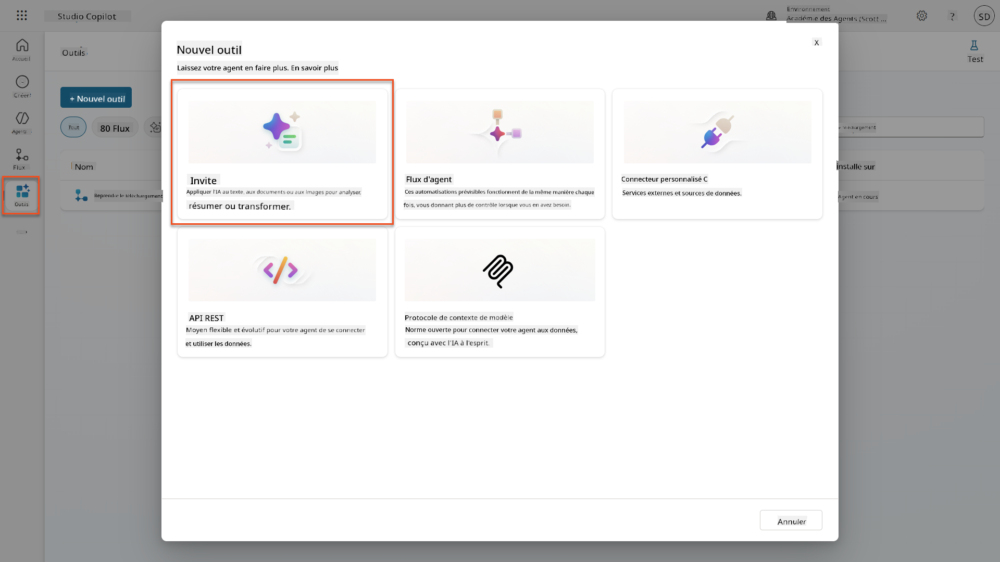

1. **Renommez** l'invite du nom par défaut basé sur l'horodatage (ex. : *Invite personnalisée 09/04/2025, 16:59:11*) en `Résumé du CV`.

1. Dans le champ Instructions, ajoutez cette invite :

    ```text
    You are tasked with extracting key candidate information from a resume and cover letter to facilitate matching with open job roles and creating a summary for application review.
    
    Instructions:
    1. Extract Candidate Details:
        - Identify and extract the candidate’s full name.
        - Extract contact information, specifically the email address.
    2. Create Candidate Summary:
        - Summarize the candidate’s profile as multiline text (max 2000 characters) with the following sections:
            - Candidate name
            - Role(s) applied for if present
            - Contact and location
            - One-paragraph summary
            - Experience snapshot (last 2–3 roles with outcomes)
            - Key projects (1–3 with metrics)
            - Education and certifications
            - Top skills (Top 10)
            - Availability and work authorization
    
    Guidelines:
    - Extract information only from the provided resume and cover letter documents.
    - Ensure accuracy in identifying all details such as contact details and skills.
    - The summary should be concise but informative, suitable for quick application review.
    
    Resume: /document
    CoverLetter: /text
    ```

    !!! tip "Utilisez l'assistance Copilot"
        Vous pouvez utiliser "Commencer avec Copilot" pour générer votre invite en langage naturel. Essayez de demander à Copilot de créer une invite pour résumer un CV !

1. **Configurez** les paramètres d'entrée :

    | Paramètre | Type | Nom | Données d'exemple |
    |-----------|------|------|-------------------|
    | CV | Image ou document | CV | Téléchargez un CV d'exemple depuis le dossier de données de test |
    | Lettre de motivation | Texte | LettreDeMotivation | Voici un CV ! |

1. Sélectionnez **Tester** pour voir la sortie texte initiale de votre invite.  
    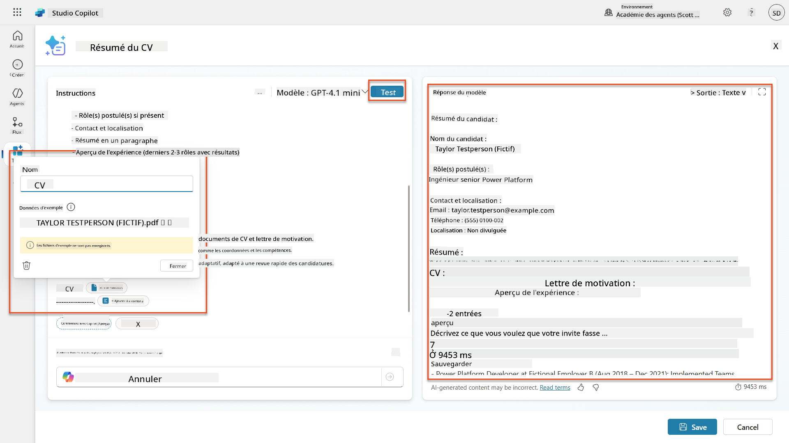

### 7.2 Configurer la sortie JSON

Vous allez maintenant convertir l'invite pour produire des données structurées au format JSON au lieu de texte brut.

1. Ajoutez cette spécification de format JSON à la fin des instructions de votre invite :

    ```text
    Output Format:
    Provide the output in valid JSON format with the following structure:
    
    {
        "CandidateName": "string",
        "Email": "string",
        "Summary": "string max 2000 characters",
        "Skills": [ {"item": "Skill 1"}, {"item": "Skill 2"}],
        "Experience": [ {"item": "Experience 1"}, {"item": "Experience 2"}],
    }
    ```

1. Changez le paramètre **Sortie** de "Texte" à **JSON**.

1. Sélectionnez **Tester** à nouveau pour vérifier que la sortie est maintenant formatée en JSON.  
    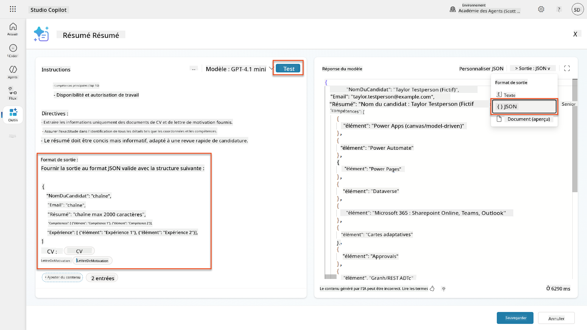

1. **Optionnel :** Expérimentez avec différents modèles d'IA pour voir comment les sorties varient, puis revenez au modèle par défaut.

1. Sélectionnez **Enregistrer** pour créer l'invite.

1. Dans la boîte de dialogue **Configurer pour utilisation dans Agent**, sélectionnez **Annuler**.

    !!! info "Pourquoi nous n'ajoutons pas cela comme un outil pour l'instant"
        Vous utiliserez cette invite dans un flux d'agent plutôt que directement comme un outil, ce qui vous donne plus de contrôle sur le flux de traitement des données.

### 7.3 Ajouter l'invite à un flux d'agent

Vous allez créer un flux d'agent qui utilise votre invite pour traiter les CV stockés dans Dataverse.

!!! tip "Expressions de flux d'agent"
    Il est très important de suivre les instructions pour nommer vos nœuds et entrer les expressions exactement, car les expressions se réfèrent aux nœuds précédents en utilisant leur nom ! Consultez la [mission Flux d'agent dans Recrutement](../../recruit/09-add-an-agent-flow/README.md#you-mentioned-expressions-what-are-expressions) pour un rappel rapide !

1. Accédez à votre **Agent de recrutement** dans Copilot Studio

1. Sélectionnez l'onglet **Agents**, puis sélectionnez le sous-agent **Agent de réception des candidatures**

1. Dans le panneau **Outils**, sélectionnez **+ Ajouter** → **+ Nouvel outil** → **Flux d'agent**

1. Sélectionnez le nœud Lorsque un agent appelle le flux, utilisez **+ Ajouter une entrée** pour ajouter le paramètre suivant :

    | Type | Nom | Description |
    |------|------|-------------|
    | Texte | NumeroCV | Assurez-vous d'utiliser [NumeroCV]. Cela doit toujours commencer par la lettre R |

1. Sélectionnez l'icône **+** Insérer une action sous le premier nœud, recherchez **Dataverse**, sélectionnez **Voir plus**, puis localisez l'action **Lister les lignes**

1. Sélectionnez les **trois points (...)** sur le nœud Lister les lignes, et sélectionnez **Renommer** en `Obtenir l'enregistrement du CV`, puis définissez les paramètres suivants :

    | Propriété | Comment définir | Valeur |
    |----------|-----------------|-------|
    | **Nom de la table** | Sélectionner | CV |
    | **Filtrer les lignes** | Données dynamiques (icône éclair) | `ppa_resumenumber eq 'NumeroCV'` Remplacez **NumeroCV** par **Lorsque un agent appelle le flux** → **NumeroCV** |
    | **Nombre de lignes** | Entrer | 1 |

    !!! tip "Optimisez ces requêtes !"
        Lorsque vous utilisez cette technique en production, vous devriez toujours limiter les colonnes sélectionnées uniquement à celles requises par le flux d'agent.

    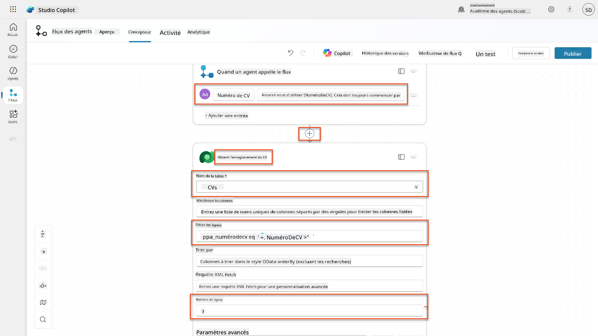

1. Sélectionnez l'icône **+** Insérer une action sous le nœud Obtenir l'enregistrement du CV, recherchez **Dataverse**, sélectionnez **Voir plus**, puis localisez l'action **Télécharger un fichier ou une image**.

    !!! tip "Choisissez la bonne action !"
        Assurez-vous de ne pas sélectionner l'action qui se termine par "de l'environnement sélectionné"

1. Comme précédemment, renommez l'action `Télécharger le CV`, puis définissez les paramètres suivants :

    | Propriété | Comment définir | Valeur |
    |----------|-----------------|-------|
    | **Nom de la table** | Sélectionner | CV |
    | **ID de la ligne** | Expression (icône fx) | `first(body('Obtenir_l_enregistrement_du_CV')?['value'])?['ppa_resumeid']` |
    | **Nom de la colonne** | Sélectionner | PDF du CV |

    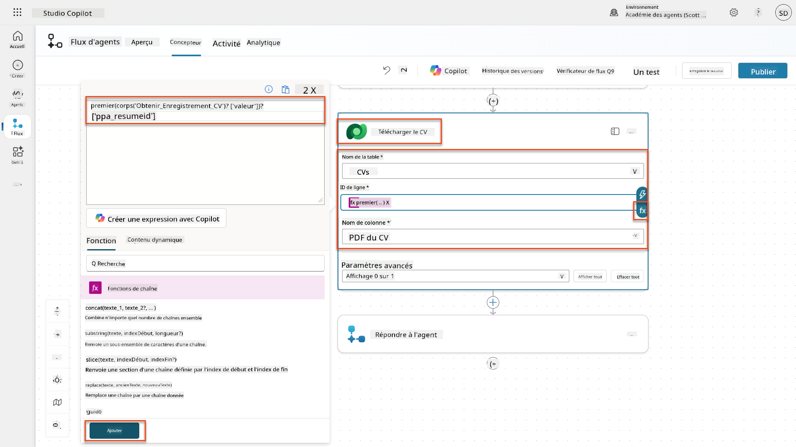

1. Maintenant, sélectionnez l'icône **+** Insérer une action sous Télécharger le CV, sous **Capacités IA**, sélectionnez **Exécuter une invite**,

1. Renommez l'action en `Résumé du CV` et définissez les paramètres suivants :

    | Propriété | Comment définir | Valeur |
    |----------|-----------------|-------|
| **Invite** | Sélectionner | Résumer le CV |
| **Lettre de motivation** | Expression (icône fx) | `first(body('Get_Resume_Record')?['value'])?['ppa_coverletter']` |
| **CV** | Données dynamiques (icône éclair) | Télécharger le CV → Contenu du fichier ou de l'image |

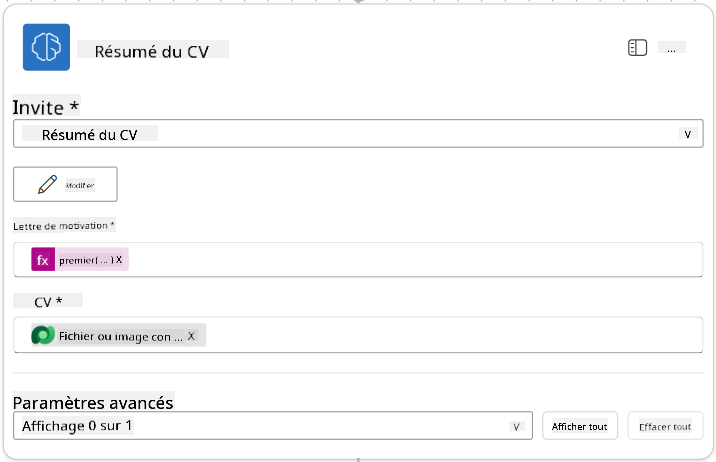

!!! tip "Paramètres de l'invite"
    Remarquez que les paramètres que vous remplissez sont les mêmes que ceux que vous avez configurés comme paramètres d'entrée lors de la création de votre invite.

### 7.4 Créer un enregistrement de candidat

Ensuite, vous devez utiliser les informations fournies par l'invite pour créer un nouvel enregistrement de candidat s'il n'existe pas déjà.

1. Sélectionnez l'icône **+** Insérer une action sous le nœud Résumer le CV, recherchez **Dataverse**, sélectionnez **Voir plus**, puis localisez l'action **Lister les lignes**.

1. Renommez le nœud en `Get Existing Candidate`, puis configurez les paramètres suivants :

    | Propriété | Comment configurer | Valeur |
    |-----------|--------------------|--------|
    | **Nom de la table** | Sélectionner | Candidats |
    | **Filtrer les lignes** | Données dynamiques (icône éclair) | `ppa_email eq 'Email'`  **Remplacer** `Email` par **Résumer le CV → Email** |
    | **Nombre de lignes** | Entrer | 1 |

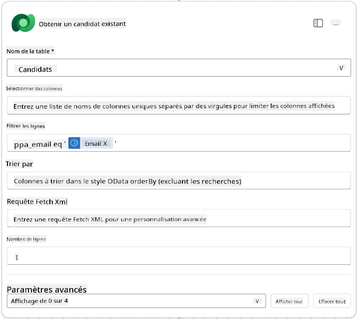

1. Sélectionnez l'icône **+** Insérer une action sous le nœud Obtenir un candidat existant, recherchez **Contrôle**, sélectionnez **Voir plus**, puis localisez l'action **Condition**.

1. Dans les propriétés de la condition, configurez la condition suivante :

    | Condition | Opérateur | Valeur |
    |-----------|-----------|--------|
    | Expression (icône fx) : `length(outputs('Get_Existing_Candidate')?['body/value'])` | est égal à | 0 |

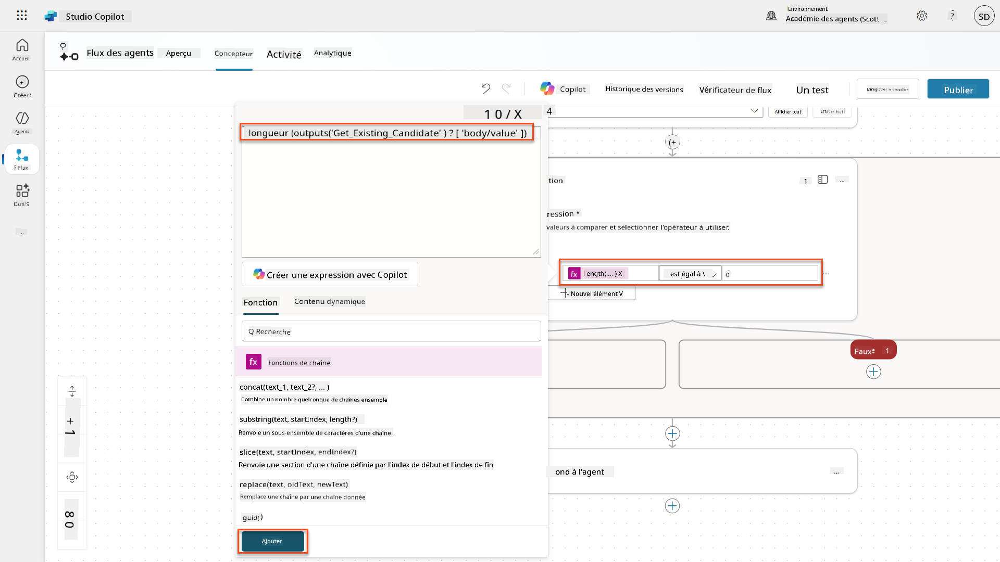

1. Sélectionnez l'icône **+** Insérer une action dans la branche **True**, recherchez **Dataverse**, sélectionnez **Voir plus**, puis localisez l'action **Ajouter une nouvelle ligne**.

1. Renommez le nœud en `Add a New Candidate`, puis configurez les paramètres suivants :

    | Propriété | Comment configurer | Valeur |
    |-----------|--------------------|--------|
    | **Nom de la table** | Sélectionner | Candidats |
    | **Nom du candidat** | Données dynamiques (icône éclair) | Résumer le CV → `CandidateName` |
    | **Email** | Données dynamiques (icône éclair) | Résumer le CV → `Email` |

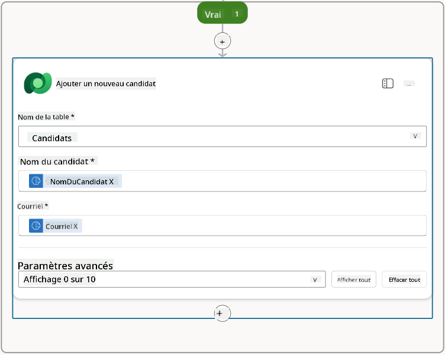

### 7.5 Mettre à jour le CV et configurer les sorties du flux

Complétez le flux en mettant à jour l'enregistrement du CV et en configurant les données à retourner à votre agent.

1. Sélectionnez l'icône **+** Insérer une action sous la condition, recherchez **Dataverse**, sélectionnez **Voir plus**, puis localisez l'action **Mettre à jour une ligne**.

1. Sélectionnez le titre pour renommer le nœud en `Update Resume`, sélectionnez **Afficher tout**, puis configurez les paramètres suivants :

    | Propriété | Comment configurer | Valeur |
    |-----------|--------------------|--------|
    | **Nom de la table** | Sélectionner | CVs |
    | **ID de la ligne** | Expression (icône fx) | `first(body('Get_Resume_Record')?['value'])?['ppa_resumeid']` |
    | **Résumé** | Données dynamiques (icône éclair) | Résumer le CV → Texte |
    | **Candidat (Candidats)** | Expression (icône fx) | `if(equals(length(outputs('Get_Existing_Candidate')?['body/value']), 1), first(outputs('Get_Existing_Candidate')?['body/value'])?['ppa_candidateid'], outputs('Add_a_New_Candidate')?['body/ppa_candidateid'])` |

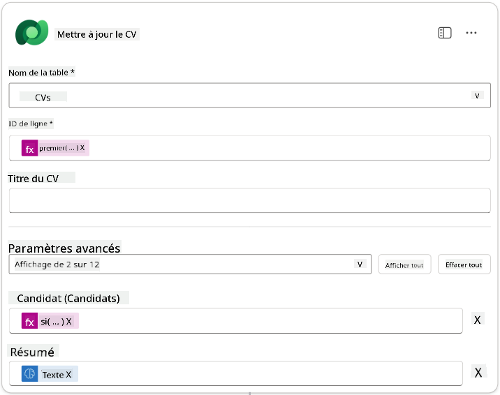

1. Sélectionnez le nœud **Répondre à l'agent**, puis utilisez **+ Ajouter une sortie** pour configurer :

    | Type | Nom                | Comment configurer              | Valeur                                                        | Description                                            |
    |------|--------------------|---------------------------------|--------------------------------------------------------------|-------------------------------------------------------|
    | Texte | `CandidateName`   | Données dynamiques (icône éclair) | Résumer le CV → Voir plus → CandidateName                  | Le [Nom du candidat] indiqué dans le CV              |
    | Texte | `CandidateEmail`  | Données dynamiques (icône éclair) | Résumer le CV → Voir plus → Email                          | L'[Email du candidat] indiqué dans le CV             |
    | Texte | `CandidateNumber` | Expression (icône fx)            | `concat('ppa_candidates/', if(equals(length(outputs('Get_Existing_Candidate')?['body/value']), 1), first(outputs('Get_Existing_Candidate')?['body/value'])?['ppa_candidateid'], outputs('Add_a_New_Candidate')?['body/ppa_candidateid']) )` | Le [Numéro du candidat] du nouveau ou existant candidat |
    | Texte | `ResumeSummary`   | Données dynamiques (icône éclair) | Résumer le CV → Voir plus → body/responsev2/predictionOutput/structuredOutput | Le résumé du CV et les détails au format JSON        |

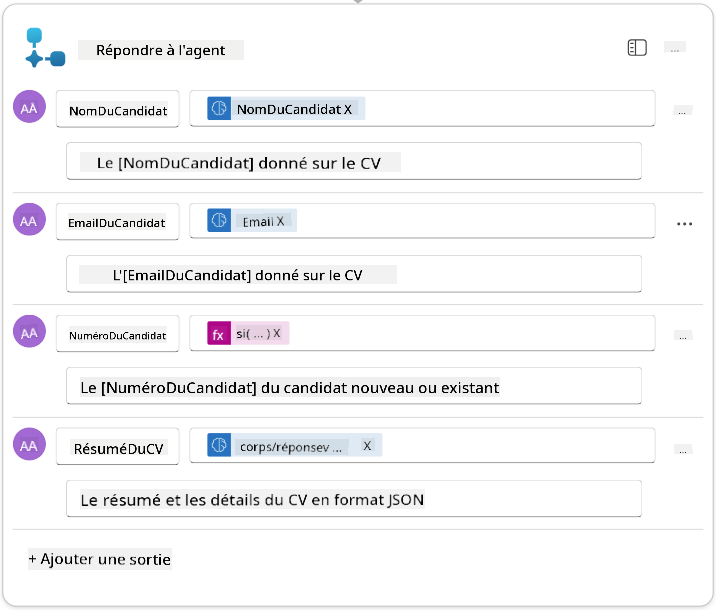

1. Sélectionnez **Enregistrer le brouillon** en haut à droite. Votre flux d'agent devrait ressembler à ceci :  


1. Sélectionnez l'onglet **Aperçu**, puis **Modifier** dans le panneau **Détails**.

    1. **Nom du flux** : `Summarize Resume`
    1. **Description** :

        ```text
        Summarize an existing Resume stored in Dataverse using a [ResumeNumber] as input, return the [CandidateNumber], and resume summary JSON
        ```

1. Sélectionnez **Enregistrer**.

1. Revenez à l'onglet **Concepteur**, puis sélectionnez **Publier**.

### 7.6 Connecter le flux à votre agent

Ajoutez maintenant le flux comme outil et configurez votre agent pour l'utiliser.

1. Ouvrez votre **Agent de recrutement** dans Copilot Studio.

1. Sélectionnez l'onglet **Agents**, puis ouvrez l'**Agent de réception des candidatures**.

1. Sélectionnez le panneau **Outils**, puis **+ Ajouter un outil** -> **Flux** -> **Summarize Resume** **(Agent Flow)**.

1. Sélectionnez **Ajouter et configurer**.

1. Configurez les paramètres de l'outil comme suit :

    | Paramètre | Valeur |
    |-----------|--------|
    | **Description** | Résumer un CV existant stocké dans Dataverse en utilisant un [Numéro de CV] comme entrée, retourner le [Numéro du candidat] et le résumé du CV au format JSON |
    | **Quand cet outil peut être utilisé** | Seulement lorsqu'il est référencé par des sujets ou des agents |

1. Sélectionnez **Enregistrer**.  
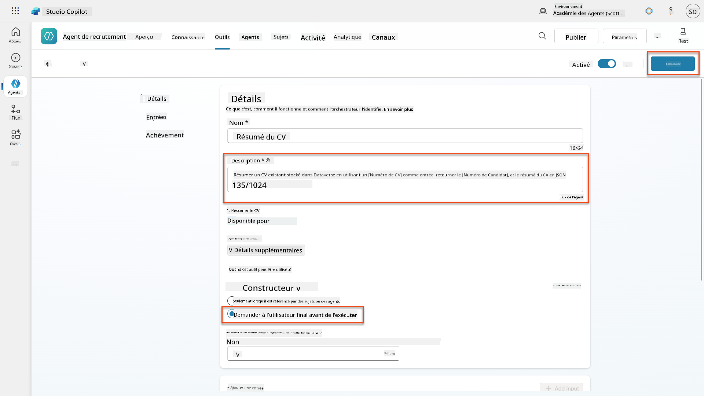

1. Si vous sélectionnez Outils dans l'Agent de recrutement, vous verrez maintenant que nos deux outils sont utilisables par l'**Agent de réception des candidatures**.  


1. Accédez aux instructions de l'agent **Application Intake Child**, et modifiez l'étape **Post-Upload** comme suit :

    ```text
    2. Post-Upload Processing  
        - After uploading, be sure to also output the [ResumeNumber] in all messages
        - Pass [ResumeNumber] to /Summarize Resume  - Be sure to use the correct value that will start with the letter R.
        - Be sure to also output the [CandidateNumber] in all messages
        - Use the [ResumeSummary] to output a summary of the processed Resume and candidate
    ```

    Remplacez `/Summarize Resume` en insérant une référence au **flux d'agent Résumer le CV** en tapant une barre oblique (`/`) ou en sélectionnant `/Summarize` pour insérer la référence.  
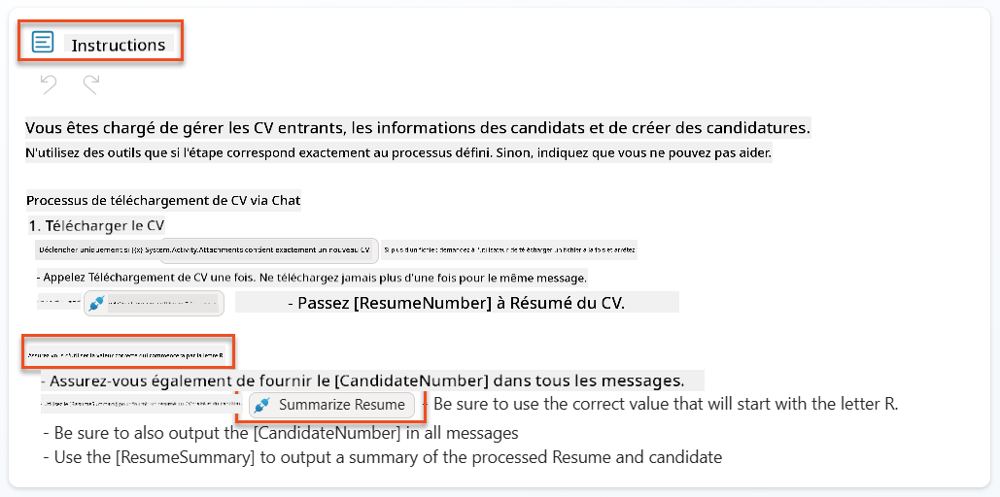

1. Sélectionnez **Enregistrer**.

### 7.7 Tester votre agent

Testez votre système multimodal complet pour vous assurer que tout fonctionne correctement.

1. **Commencez les tests** :

    - Sélectionnez **Tester** pour ouvrir le panneau de test.
    - Tapez : `Voici un CV de candidat`.

    - Téléchargez l'un des CV d'exemple depuis [Test Resumes](https://download-directory.github.io/?url=https://github.com/microsoft/agent-academy/tree/main/operative/sample-data/resumes&filename=operative_sampledata).

1. **Vérifiez les résultats** :
    - Une fois le message et le CV envoyés, vérifiez que vous recevez un Numéro de CV (format : R#####).
    - Vérifiez que vous obtenez un Numéro de candidat et un résumé.
    - Utilisez la carte d'activité pour voir à la fois l'outil de téléchargement de CV et l'outil Résumer le CV en action, et les sorties de l'invite de résumé reçues par l'agent :  
        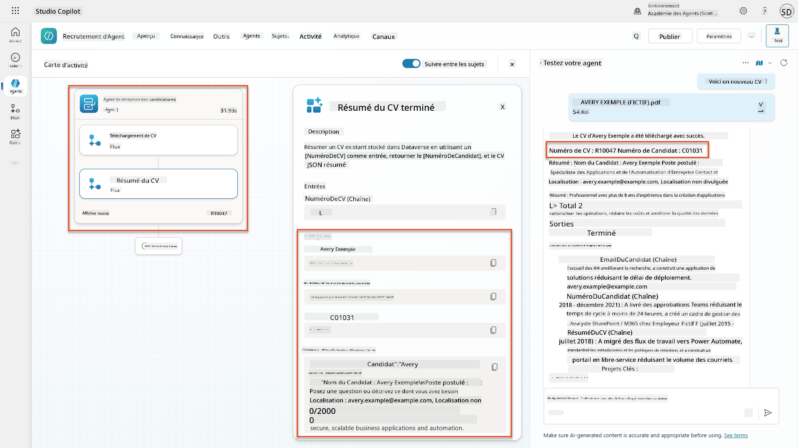

1. **Vérifiez la persistance des données** :
    - Accédez à [Power Apps](https://make.powerapps.com).
    - Ouvrez **Apps** → **Hiring Hub** → **Jouer**.
    - Allez dans **CVs** pour vérifier que le CV a été téléchargé et traité. Il devrait contenir des informations résumées et un enregistrement de candidat associé.
    - Vérifiez **Candidats** pour voir les informations extraites du candidat.  
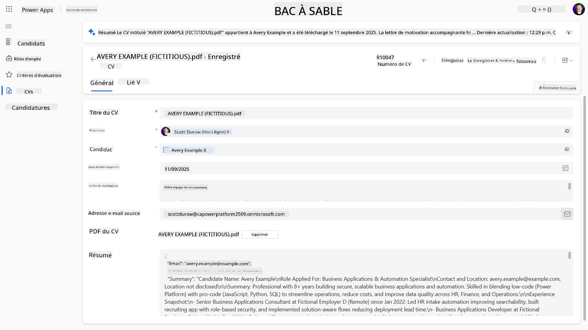
    - Lorsque vous exécutez à nouveau le processus, il devrait utiliser le candidat existant (correspondant à l'email extrait du CV) au lieu d'en créer un nouveau.

!!! tip "Dépannage"
    - **Le CV ne se traite pas** : Assurez-vous que le fichier est un PDF et respecte les limites de taille.
    - **Aucun candidat créé** : Vérifiez que l'email a été correctement extrait du CV.
    - **Erreurs de format JSON** : Assurez-vous que les instructions de votre invite incluent la structure JSON exacte.
    - **Erreurs de flux** : Vérifiez que toutes les connexions Dataverse et expressions sont correctement configurées.

### Prêt pour la production

Bien que cela ne fasse pas partie de cette mission, pour rendre ce flux d'agent prêt pour la production, vous pourriez envisager les éléments suivants :

1. **Gestion des erreurs** - Si le Numéro de CV n'a pas été trouvé ou si l'invite n'a pas réussi à analyser le document, une gestion des erreurs devrait être ajoutée pour retourner une erreur claire à l'agent.
1. **Mise à jour des candidats existants** - Le candidat est trouvé en utilisant l'email, puis le nom pourrait être mis à jour pour correspondre à celui du CV.
1. **Séparation de la synthèse du CV et de la création du candidat** - Cette fonctionnalité pourrait être divisée en flux d'agent plus petits pour les rendre plus faciles à maintenir, puis l'agent pourrait recevoir des instructions pour les utiliser successivement.

## 🎉 Mission accomplie

Excellent travail, Opératif ! **Reconnaissance des CV documentés** est maintenant terminée. Vous avez maîtrisé les invites multimodales et pouvez désormais extraire des données structurées de n'importe quel document avec précision.

Voici ce que vous avez accompli dans cette mission :

**✅ Maîtrise des invites multimodales**  
Vous comprenez maintenant ce que sont les invites multimodales et quand utiliser différents modèles d'IA pour des résultats optimaux.

**✅ Expertise en traitement de documents**  
Vous avez appris à configurer des invites avec des entrées d'image et de document, et à formater les sorties en JSON pour l'extraction de données structurées.

**✅ Système d'extraction de CV**  
Vous avez construit un système complet d'extraction de CV qui traite les documents des candidats et s'intègre à votre flux de recrutement.

**✅ Mise en œuvre des meilleures pratiques**  
Vous avez appliqué les meilleures pratiques pour l'ingénierie des invites avec analyse de documents et intégré des invites multimodales avec des flux d'agent.

**✅ Base pour un traitement avancé**  
Vos capacités d'analyse de documents améliorées sont maintenant prêtes pour les fonctionnalités avancées de mise à jour des données que nous ajouterons dans les prochaines missions.

🚀 **Prochaine étape :** Dans la Mission 08, vous découvrirez comment améliorer vos invites avec des données en temps réel provenant de Dataverse, créant des solutions d'IA dynamiques qui s'adaptent aux exigences commerciales changeantes.

⏩ [Passer à la Mission 08 : Invites améliorées avec Dataverse](../08-dataverse-grounding/README.md)

## 📚 Ressources tactiques

📖 [Créer une invite](https://learn.microsoft.com/ai-builder/create-a-custom-prompt?WT.mc_id=power-power-182762-scottdurow)

📖 [Ajouter des entrées texte, image ou document à votre invite](https://learn.microsoft.com/ai-builder/add-inputs-prompt?WT.mc_id=power-182762-scottdurow)

📖 [Traiter les réponses avec une sortie JSON](https://learn.microsoft.com/ai-builder/process-responses-json-output?WT.mc_id=power-182762-scottdurow)

📖 [Sélection de modèle et réglages de température](https://learn.microsoft.com/ai-builder/prompt-modelsettings?WT.mc_id=power-182762-scottdurow)

📖 [Utiliser votre invite dans Power Automate](https://learn.microsoft.com/ai-builder/use-a-custom-prompt-in-flow?WT.mc_id=power-182762-scottdurow)

📺 [AI Builder : Sorties JSON dans le générateur d'invites](https://www.youtube.com/watch?v=F0fGnWrRY_I)

---

**Avertissement** :  
Ce document a été traduit à l'aide du service de traduction automatique [Co-op Translator](https://github.com/Azure/co-op-translator). Bien que nous nous efforcions d'assurer l'exactitude, veuillez noter que les traductions automatisées peuvent contenir des erreurs ou des inexactitudes. Le document original dans sa langue d'origine doit être considéré comme la source faisant autorité. Pour des informations critiques, il est recommandé de recourir à une traduction humaine professionnelle. Nous ne sommes pas responsables des malentendus ou des interprétations erronées résultant de l'utilisation de cette traduction.