<!--
CO_OP_TRANSLATOR_METADATA:
{
  "original_hash": "750f3ea8a94930439ebd8a10871b1d73",
  "translation_date": "2025-10-17T19:18:22+00:00",
  "source_file": "docs/operative-preview/08-dataverse-grounding/README.md",
  "language_code": "fr"
}
-->
# 🚨 Mission 08 : Amélioration des invites avec ancrage Dataverse

--8<-- "disclaimer.md"

## 🕵️‍♂️ NOM DE CODE : `OPÉRATION CONTRÔLE D'ANCRAGE`

> **⏱️ Durée de l'opération :** `~60 minutes`

## 🎯 Résumé de la mission

Bienvenue de retour, Opératif. Votre système de recrutement multi-agents est opérationnel, mais une amélioration critique est nécessaire pour **l'ancrage des données** - vos modèles d'IA ont besoin d'un accès en temps réel aux données structurées de votre organisation pour prendre des décisions intelligentes.

Actuellement, votre invite Résumé des CV fonctionne avec des connaissances statiques. Mais que se passerait-il si elle pouvait accéder dynamiquement à votre base de données des postes à pourvoir pour fournir des correspondances précises et à jour ? Et si elle comprenait vos critères d'évaluation sans que vous ayez à les coder en dur ?

Dans cette mission, vous allez améliorer votre invite personnalisée avec **l'ancrage Dataverse** - en connectant vos invites directement à des sources de données en temps réel. Cela transforme vos agents de simples répondants statiques en systèmes dynamiques, basés sur les données, qui s'adaptent aux besoins changeants de l'entreprise.

Votre mission : intégrer des données en temps réel sur les postes à pourvoir et les critères d'évaluation dans votre flux d'analyse de CV, créant ainsi un système auto-mis à jour qui reste en phase avec les exigences de recrutement de votre organisation.

## 🔎 Objectifs

Dans cette mission, vous apprendrez :

1. Comment **l'ancrage Dataverse** améliore les invites personnalisées
1. Quand utiliser l'ancrage des données par rapport aux instructions statiques
1. Concevoir des invites qui intègrent dynamiquement des données en temps réel
1. Améliorer le flux Résumé des CV avec la correspondance des postes à pourvoir

## 🧠 Comprendre l'ancrage Dataverse pour les invites

**L'ancrage Dataverse** permet à vos invites personnalisées d'accéder à des données en temps réel provenant de vos tables Dataverse lors du traitement des demandes. Au lieu d'instructions statiques, vos invites peuvent intégrer des informations en temps réel pour prendre des décisions éclairées.

### Pourquoi l'ancrage Dataverse est important

Les invites traditionnelles fonctionnent avec des instructions fixes :

```text
Match this candidate to these job roles: Developer, Manager, Analyst
```

Avec l'ancrage Dataverse, votre invite accède aux données actuelles :

```text
Match this candidate to available job roles from the Job Roles table, 
considering current evaluation criteria and requirements
```

Cette approche offre plusieurs avantages clés :

- **Mises à jour dynamiques :** Les postes et critères changent sans modifications des invites
- **Cohérence :** Tous les agents utilisent les mêmes sources de données actuelles
- **Évolutivité :** Les nouveaux postes et critères sont automatiquement disponibles
- **Précision :** Les données en temps réel garantissent que les décisions reflètent les besoins actuels

### Comment fonctionne l'ancrage Dataverse

Lorsque vous activez l'ancrage Dataverse pour une invite personnalisée :

1. **Sélection des données :** Choisissez les tables et colonnes spécifiques de Dataverse à inclure. Vous pouvez également sélectionner des tables liées que le système filtrera en fonction des enregistrements parent récupérés.
1. **Injection de contexte :** L'invite inclut automatiquement les données récupérées dans le contexte de l'invite
1. **Filtrage intelligent :** Le système inclut uniquement les données pertinentes pour la demande actuelle si vous fournissez un filtrage.
1. **Sortie structurée :** Votre invite peut référencer les données récupérées et raisonner sur les enregistrements pour créer la sortie.

### Du statique au dynamique : l'avantage de l'ancrage

Examinons votre flux actuel Résumé des CV de la Mission 07 et voyons comment l'ancrage Dataverse le transforme en intelligence dynamique.

**Approche statique actuelle :**
Votre invite existante inclut des critères d'évaluation codés en dur et une logique de correspondance prédéterminée. Cette approche fonctionne mais nécessite des mises à jour manuelles chaque fois que vous ajoutez de nouveaux postes, modifiez les critères d'évaluation ou changez les priorités de l'entreprise.

**Transformation avec l'ancrage Dataverse :**
En ajoutant l'ancrage Dataverse, votre flux Résumé des CV :

- **Accède aux postes actuels** de votre table Postes à pourvoir
- **Utilise des critères d'évaluation en temps réel** au lieu de descriptions statiques  
- **Fournit des correspondances précises** basées sur les exigences actuelles

## 🎯 Pourquoi des invites dédiées vs des conversations d'agents

Dans la Mission 02, vous avez vu comment l'Agent d'Entretien pouvait associer des candidats à des postes, mais nécessitait des invites complexes de l'utilisateur comme :

```text
Upload this resume, then show me open job roles,
each with a description of the evaluation criteria, 
then use this to match the resume to at least one suitable
job role even if not a perfect match.
```

Bien que cela ait fonctionné, les invites dédiées avec l'ancrage Dataverse offrent des avantages significatifs pour des tâches spécifiques :

### Principaux avantages des invites dédiées

| Aspect | Conversations d'agents | Invites dédiées |
|--------|-------------------------|-----------------|
| **Cohérence** | Les résultats varient selon les compétences de l'utilisateur à rédiger des invites | Traitement standardisé à chaque fois |
| **Spécialisation** | Le raisonnement général peut manquer de nuances métier | Conçu spécifiquement avec une logique métier optimisée |
| **Automatisation** | Nécessite une interaction et une interprétation humaines | Se déclenche automatiquement avec une sortie JSON structurée |

## 🧪 Laboratoire 8 : Ajouter l'ancrage Dataverse aux invites

Il est temps d'améliorer vos capacités d'analyse de CV ! Vous allez enrichir le flux existant Résumé des CV avec une correspondance dynamique des postes à pourvoir.

### Prérequis pour compléter cette mission

1. Vous aurez besoin **soit** :

    - **D'avoir complété la Mission 07** et d'avoir votre système d'analyse de CV prêt, **OU**
    - **D'importer la solution de démarrage de la Mission 08** si vous commencez à zéro ou avez besoin de rattraper. [Télécharger la solution de démarrage de la Mission 08](https://aka.ms/agent-academy)

1. Des exemples de documents de CV provenant de [test Resumes](https://download-directory.github.io/?url=https://github.com/microsoft/agent-academy/tree/main/operative/sample-data/resumes&filename=operative_sampledata)

!!! note "Importation de la solution et des données d'exemple"
    Si vous utilisez la solution de démarrage, consultez [Mission 01](../01-get-started/README.md) pour des instructions détaillées sur la façon d'importer des solutions et des données d'exemple dans votre environnement.

### 8.1 Ajouter l'ancrage Dataverse à votre invite

Vous allez vous appuyer sur l'invite Résumé des CV que vous avez créée dans la Mission 07. Actuellement, elle se contente de résumer le CV, mais maintenant vous allez l'ancrer avec les postes tels qu'ils existent actuellement dans Dataverse, en les gardant toujours à jour.

Tout d'abord, examinons les tables Dataverse que vous allez utiliser pour l'ancrage :

1. **Accédez** à [Power Apps](https://make.powerapps.com) et sélectionnez votre environnement en utilisant le **sélecteur d'environnement** en haut à droite de la barre de navigation.

1. Sélectionnez **Tables** et localisez la table **Postes à pourvoir**

1. Passez en revue les colonnes clés que vous utiliserez pour l'ancrage :

    | Colonne | Utilité |
    |---------|---------|
    | **Numéro de poste** | Identifiant unique pour la correspondance des postes |
    | **Intitulé du poste** | Nom affiché pour le poste |
    | **Description** | Exigences détaillées du poste |

1. De même, examinez les autres tables comme la table **Critères d'évaluation**.

### 8.2 Ajouter les données d'ancrage Dataverse à votre invite

1. **Accédez** à Copilot Studio, et sélectionnez votre environnement en utilisant le **sélecteur d'environnement** en haut à droite de la barre de navigation.

1. Sélectionnez **Outils** dans la navigation à gauche.

1. Choisissez **Invite** et localisez votre invite **Résumé des CV** de la Mission 07.  
    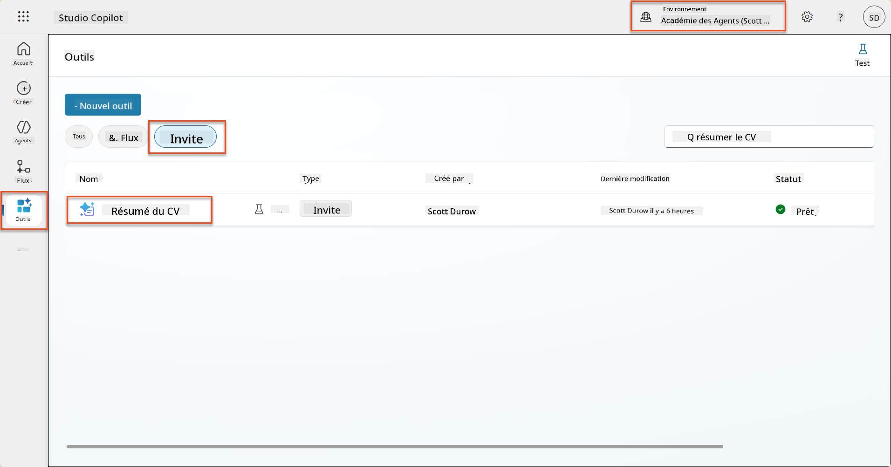

1. Sélectionnez **Modifier** pour modifier l'invite, et remplacez-la par la version améliorée ci-dessous :

    !!! important
        Assurez-vous que les paramètres Résumé et Lettre de motivation restent intacts en tant que paramètres.

    ```text
    You are tasked with extracting key candidate information from a resume and cover letter to facilitate matching with open job roles and creating a summary for application review.
    
    ### Instructions:
    1. **Extract Candidate Details:**
       - Identify and extract the candidate's full name.
       - Extract contact information, specifically the email address.
    
    2. **Analyze Resume and Cover Letter:**
       - Review the resume content to identify relevant skills, experience, and qualifications.
       - Review the cover letter to understand the candidate's motivation and suitability for the roles.
    
    3. **Match Against Open Job Roles:**
       - Compare the extracted candidate information with the requirements and descriptions of the provided open job roles.
       - Use the job descriptions to assess potential fit.
       - Identify all roles that align with the candidate's cover letter and profile. You don't need to assess perfect suitability.
       - Provide reasoning for each match based on the specific job requirements.
    
    4. **Create Candidate Summary:**
       - Summarize the candidate's profile as multiline text with the following sections:
          - Candidate name
          - Role(s) applied for if present
          - Contact and location
          - One-paragraph summary
          - Top skills (8–10)
          - Experience snapshot (last 2–3 roles with outcomes)
          - Key projects (1–3 with metrics)
          - Education and certifications
          - Availability and work authorization
    
    ### Output Format
    
    Provide the output in valid JSON format with the following structure:
    
    {
      "CandidateName": "string",
      "Email": "string",
      "MatchedRoles": [
        {
          "JobRoleNumber": "ppa_jobrolenumber from grounded data",
          "RoleName": "ppa_jobtitle from grounded data",
          "Reasoning": "Detailed explanation based on job requirements"
        }
      ],
      "Summary": "string"
    }
    
    ### Guidelines
    
    - Extract information only from the provided resume and cover letter documents.
    - Ensure accuracy in identifying contact details.
    - Use the available job role data for matching decisions.
    - The summary should be concise but informative, suitable for quick application review.
    - If no suitable matches are found, indicate an empty list for MatchedRoles and explain briefly in the summary.
    
    ### Input Data
    Open Job Roles (ppa_jobrolenumber, ppa_jobtitle): /Job Role 
    Resume: {Resume}
    Cover Letter: {CoverLetter}
    ```

1. Dans l'éditeur d'invite, remplacez `/Poste à pourvoir` en sélectionnant **+ Ajouter du contenu**, en sélectionnant **Dataverse** → **Poste à pourvoir** et sélectionnez les colonnes suivantes, puis sélectionnez **Ajouter** :

    1. **Numéro de poste**

    1. **Intitulé du poste**

    1. **Description**

    !!! tip
        Vous pouvez taper le nom de la table pour effectuer une recherche.

1. Dans la boîte de dialogue **Poste à pourvoir**, sélectionnez l'attribut **Filtrer**, sélectionnez **Statut**, puis tapez **Actif** comme valeur de **Filtre**.  
    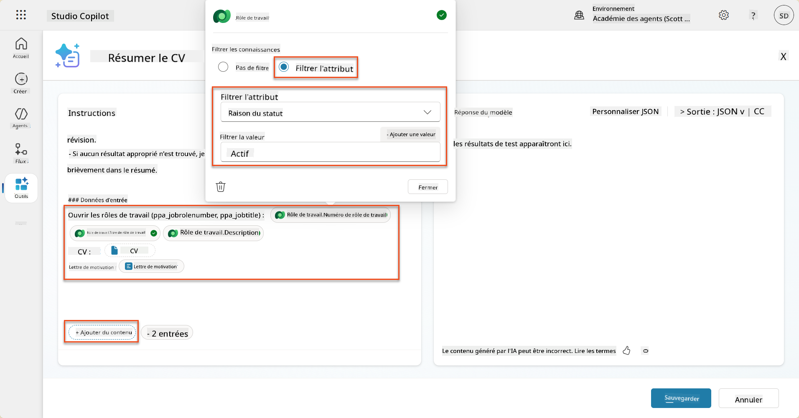

    !!! tip
        Vous pouvez utiliser **Ajouter une valeur** ici pour ajouter un paramètre d'entrée également - par exemple, si vous aviez une invite pour résumer un enregistrement existant, vous pourriez fournir le Numéro de CV comme paramètre pour filtrer.

1. Ensuite, vous ajouterez la table Dataverse liée **Critères d'évaluation**, en sélectionnant à nouveau **+ Ajouter du contenu**, en trouvant **Postes à pourvoir**, et au lieu de sélectionner les colonnes sur Poste à pourvoir, développez **Poste à pourvoir (Critères d'évaluation)** et sélectionnez les colonnes suivantes, puis sélectionnez **Ajouter** :

    1. **Nom du critère**

    1. **Description**  
        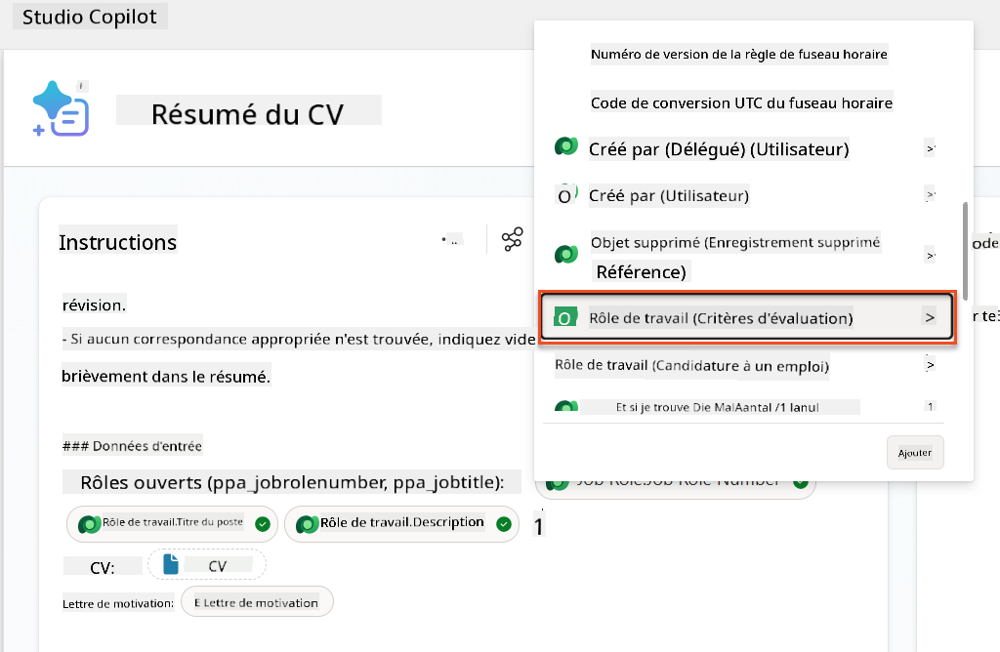

        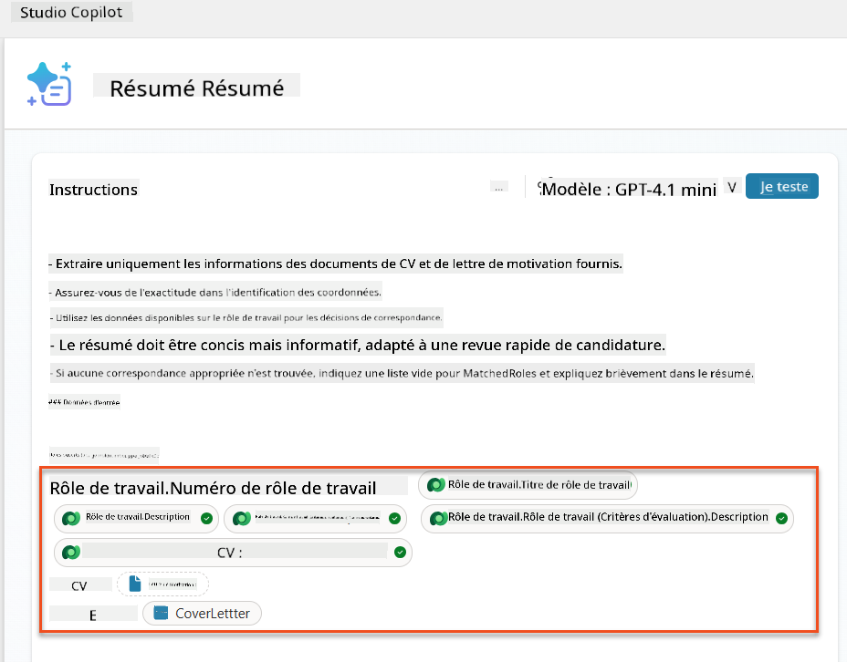

    !!! tip
        Il est important de sélectionner les Critères d'évaluation liés en sélectionnant d'abord le Poste à pourvoir, puis en naviguant dans le menu vers Poste à pourvoir (Critères d'évaluation). Cela garantira que seuls les enregistrements liés au Poste à pourvoir seront chargés.

1. Sélectionnez **Paramètres**, et ajustez la **Récupération des enregistrements** à 1000 - cela permettra d'inclure le maximum de Postes à pourvoir et de Critères d'évaluation dans votre invite.  
    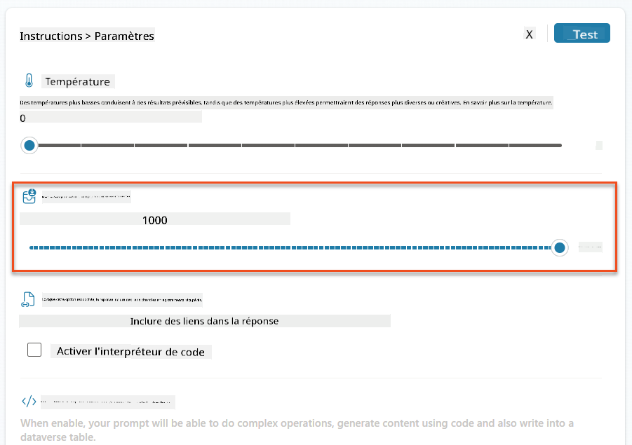

### 8.3 Tester l'invite améliorée

1. Sélectionnez le paramètre **CV**, et téléchargez un CV d'exemple que vous avez utilisé dans la Mission 07.
1. Sélectionnez **Tester**.
1. Une fois le test terminé, remarquez que la sortie JSON inclut maintenant les **Postes correspondants**.
1. Sélectionnez l'onglet **Connaissances utilisées**, pour voir les données Dataverse qui ont fusionné avec votre invite avant l'exécution.
1. **Enregistrez** votre invite mise à jour. Le système inclura désormais automatiquement ces données Dataverse avec votre invite lorsque le flux Agent Résumé des CV existant l'appellera.  
    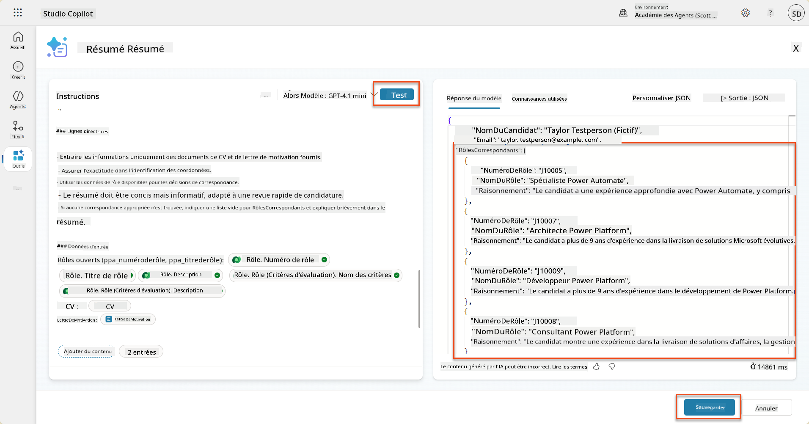

### 8.4 Ajouter un flux d'agent pour les candidatures

Pour permettre à notre Agent de réception des candidatures de créer des Postes à pourvoir basés sur les postes suggérés, nous devons créer un flux d'agent. L'agent appellera cet outil pour chacun des postes suggérés qui intéressent le candidat.

!!! tip "Expressions de flux d'agent"
    Il est très important de suivre les instructions pour nommer vos nœuds et entrer les expressions exactement, car les expressions se réfèrent aux nœuds précédents en utilisant leur nom ! Consultez la [mission Flux d'agent dans Recruter](../../recruit/09-add-an-agent-flow/README.md#you-mentioned-expressions-what-are-expressions) pour un rappel rapide !

1. À l'intérieur de **l'Agent de recrutement**, sélectionnez l'onglet **Agents**, et ouvrez l'agent enfant **Agent de réception des candidatures**.

1. À l'intérieur du panneau **Outils**, sélectionnez **+ Ajouter** → **+ Nouvel outil** → **Flux d'agent**

1. Sélectionnez le nœud **Quand un agent appelle le flux**, utilisez **+ Ajouter une entrée** pour ajouter le paramètre suivant :

    | Type | Nom              | Description                                                  |
    | ---- | ---------------- | ------------------------------------------------------------ |
    | Texte | `NuméroCV`      | Assurez-vous d'utiliser uniquement le [NuméroCV] - il DOIT commencer par la lettre R |
    | Texte | `NuméroPoste`   | Assurez-vous d'utiliser uniquement le [NuméroPoste] - il DOIT commencer par la lettre J |

    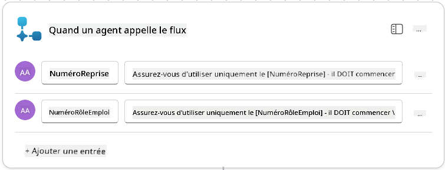

1. Sélectionnez l'icône **+** Insérer une action sous le premier nœud, recherchez **Dataverse**, sélectionnez **Voir plus**, puis localisez l'action **Lister les lignes**.

1. **Renommez** le nœud en `Obtenir CV`, puis définissez les paramètres suivants :

    | Propriété        | Comment définir               | Valeur                                                        |
    | ---------------- | ----------------------------- | ------------------------------------------------------------- |
    | **Nom de la table** | Sélectionner                 | CVs                                                           |
    | **Filtrer les lignes** | Données dynamiques (icône éclair) | `ppa_resumenumber eq 'NuméroCV'` Sélectionnez et remplacez **NuméroCV** par **Quand un agent appelle le flux** → **NuméroCV** |
    | **Nombre de lignes** | Entrer                      | 1                                                             |

    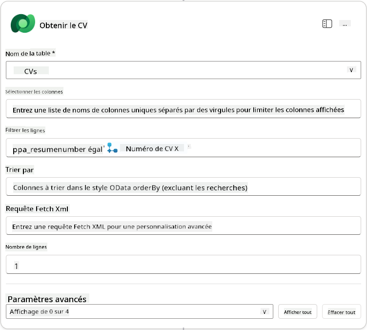

1. Maintenant, sélectionnez l'icône **+** Insérer une action sous **Obtenir CV**, recherchez **Dataverse**, sélectionnez **Voir plus**, puis localisez l'action **Lister les lignes**.

1. **Renommez** le nœud en `Obtenir Poste`, puis définissez les paramètres suivants :

    | Propriété        | Comment définir               | Valeur                                                        |
    | ---------------- | ----------------------------- | ------------------------------------------------------------- |
    | **Nom de la table** | Sélectionner                 | Postes à pourvoir                                             |
    | **Filtrer les lignes** | Données dynamiques (icône éclair) | `ppa_jobrolenumber eq 'NuméroPoste'` Sélectionnez et remplacez **NuméroPoste** par **Quand un agent appelle le flux** → **NuméroPoste** |
    | **Nombre de lignes** | Entrer                      | 1                                                             |

    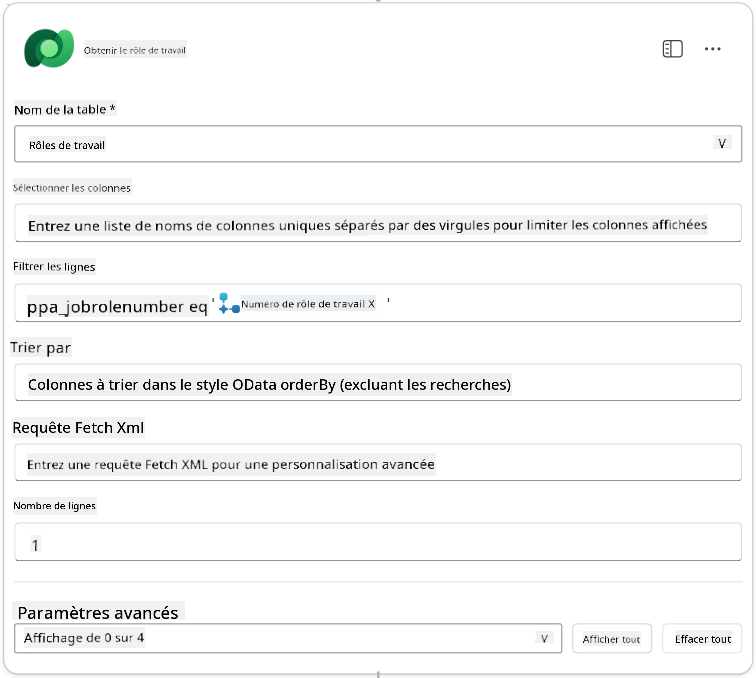

1. Maintenant, sélectionnez l'icône **+** Insérer une action sous Obtenir Poste, recherchez **Dataverse**, sélectionnez **Voir plus**, puis localisez l'action **Ajouter une nouvelle ligne**.

1. **Renommez** le nœud en `Ajouter Candidature`, puis définissez les paramètres suivants :

    | Propriété                           | Comment définir       | Valeur                                                        |
    | ---------------------------------- | -------------------- | ------------------------------------------------------------ |
    | **Nom de la table**                 | Sélectionner          | Candidatures                                                  |
    | **Candidat (Candidats)**            | Expression (icône fx) | `concat('ppa_candidates/',first(outputs('Obtenir_CV')?['body/value'])?['_ppa_candidate_value'])` |
| **Rôle (Rôles)**                        | Expression (icône fx) | `concat('ppa_jobroles/',first(outputs('Get_Job_Role')?['body/value'])?['ppa_jobroleid'])` |
| **CV (CVs)**                            | Expression (icône fx) | `concat('ppa_resumes/', first(outputs('Get_Resume')?['body/value'])?['ppa_resumeid'])` |
| **Date de candidature** (utiliser **Afficher tout**) | Expression (icône fx) | `utcNow()`                                                   |

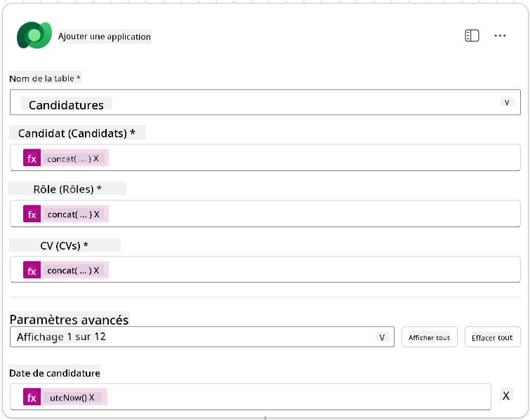

1. Sélectionnez le **Nœud Répondre à l'agent**, puis sélectionnez **+ Ajouter une sortie**

     | Propriété        | Comment configurer             | Détails                                         |
     | ----------------- | ------------------------------ | ----------------------------------------------- |
     | **Type**         | Sélectionner                   | `Texte`                                         |
     | **Nom**          | Saisir                         | `ApplicationNumber`                             |
     | **Valeur**       | Données dynamiques (icône éclair) | *Ajouter une candidature → Voir plus → Numéro de candidature* |
     | **Description**  | Saisir                         | `Le [ApplicationNumber] de la candidature créée` |

     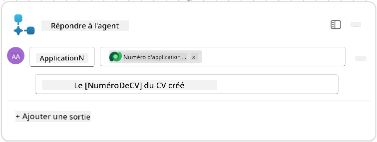

1. Sélectionnez **Enregistrer le brouillon** en haut à droite.

1. Sélectionnez l'onglet **Aperçu**, puis **Modifier** dans le panneau **Détails**.

      - **Nom du flux** : `Créer une candidature`
      - **Description** : `Crée une nouvelle candidature à partir de [ResumeNumber] et [JobRoleNumber]`
      - **Enregistrer**

1. Revenez à l'onglet **Concepteur**, puis sélectionnez **Publier**.

### 8.5 Ajouter Créer une candidature à l'agent

Vous allez maintenant connecter le flux publié à votre agent de gestion des candidatures.

1. Retournez à l'**Agent de recrutement** et sélectionnez l'onglet **Agents**. Ouvrez l'**Agent de gestion des candidatures**, puis localisez le panneau **Outils**.

1. Sélectionnez **+ Ajouter**

1. Sélectionnez le filtre **Flux**, recherchez `Créer une candidature`. Sélectionnez le flux **Créer une candidature**, puis **Ajouter et configurer**.

1. Configurez les paramètres suivants :

    | Paramètre                                           | Valeur                                                        |
    | --------------------------------------------------- | ------------------------------------------------------------ |
    | **Description**                                     | `Crée une nouvelle candidature à partir de [ResumeNumber] et [JobRoleNumber]` |
    | **Détails supplémentaires → Quand cet outil peut être utilisé** | `Uniquement lorsqu'il est référencé par des sujets ou des agents` |

1. Sélectionnez **Enregistrer**  
    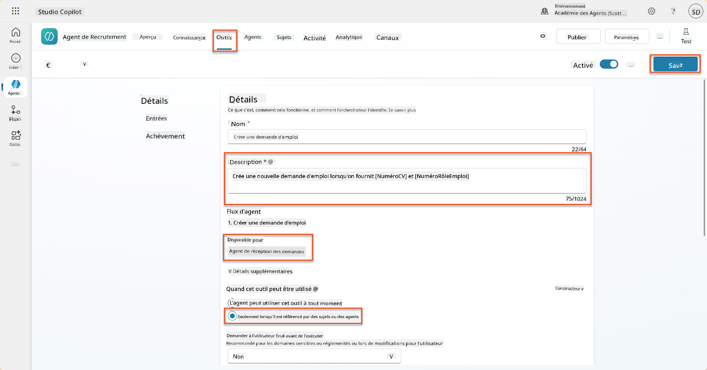

### 8.6 Définir les instructions de l'agent

Pour créer des candidatures, vous devez indiquer à l'agent quand utiliser le nouvel outil. Dans ce cas, vous demanderez à l'utilisateur de confirmer les rôles suggérés auxquels postuler, et vous instruirez l'agent d'exécuter l'outil pour chaque rôle.

1. Revenez à l'**Agent de gestion des candidatures**, puis localisez le panneau **Instructions**.

1. Dans le champ **Instructions**, **ajoutez** les directives suivantes claires pour votre agent enfant **à la fin des instructions existantes** :

    ```text
    3. Post Resume Upload
       - Respond with a formatted bullet list of [SuggestedJobRoles] the candidate could apply for.  
       - Use the format: [JobRoleNumber] - [RoleDescription]
       - Ask the user to confirm which Job Roles to create applications for the candidate.
       - When the user has confirmed a set of [JobRoleNumber]s, move to the next step.
    
    4. Post Upload - Application Creation
        - After the user confirms which [SuggestedJobRoles] for a specific [ResumeNumber]:
        E.g. "Apply [ResumeNumber] for the Job Roles [JobRoleNumber], [JobRoleNumber], [JobRoleNumber]
        E.g. "apply to all suggested job roles" - this implies use all the [JobRoleNumbers] 
         - Loop over each [JobRoleNumber] and send with [ResumeNumber] to /Create Job Application   
         - Summarize the Job Applications Created
    
    Strict Rules (that must never be broken)
    You must always follow these rules and never break them:
    1. The only valid identifiers are:
      - ResumeNumber (ppa_resumenumber)→ format R#####
      - CandidateNumber (ppa_candidatenumber)→ format C#####
      - ApplicationNumber (ppa_applicationnumber)→ format A#####
      - JobRoleNumber (ppa_jobrolenumber)→ format J#####
    2. Never guess or invent these values.
    3. Always extract identifiers from the current context (conversation, data, or system output). 
    ```

1. Lorsque les instructions incluent une barre oblique (/), sélectionnez le texte suivant la barre oblique et sélectionnez l'outil **Créer une candidature**.

1. Sélectionnez **Enregistrer**  
    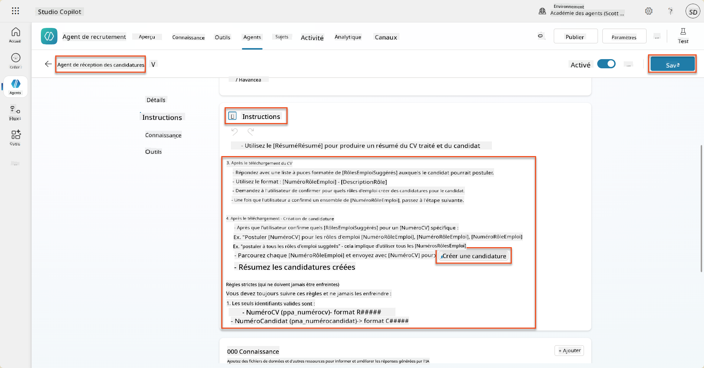

!!! tip "Itération sur plusieurs éléments dans l'orchestration générative"
    Ces instructions utilisent la capacité de l'orchestration générative à itérer sur plusieurs lignes pour prendre des décisions sur les étapes et outils à utiliser. Les rôles correspondants seront automatiquement lus et l'agent de gestion des candidatures s'exécutera pour chaque ligne. Bienvenue dans le monde magique de l'orchestration générative !

### 8.7 Testez votre agent

1. Ouvrez votre **Agent de recrutement** dans Copilot Studio.

1. **Téléchargez** un exemple de CV dans le chat, et tapez :

    ```text
    This is a new resume for the Power Platform Developer Role.
    ```

1. Remarquez comment l'agent fournit une liste de rôles suggérés - chacun avec un numéro de rôle.  
    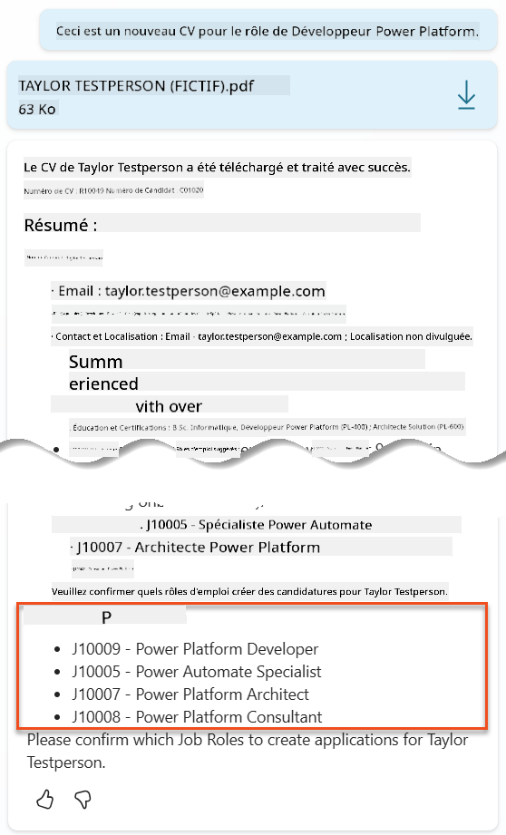

1. Vous pouvez ensuite indiquer lesquels de ces rôles vous souhaitez que le CV soit ajouté en tant que candidature.
    **Exemples :**

    ```text
    "Apply for all of those job roles"
    "Apply for the J10009 Power Platform Developer role"
    "Apply for the Developer and Architect roles"
    ```

    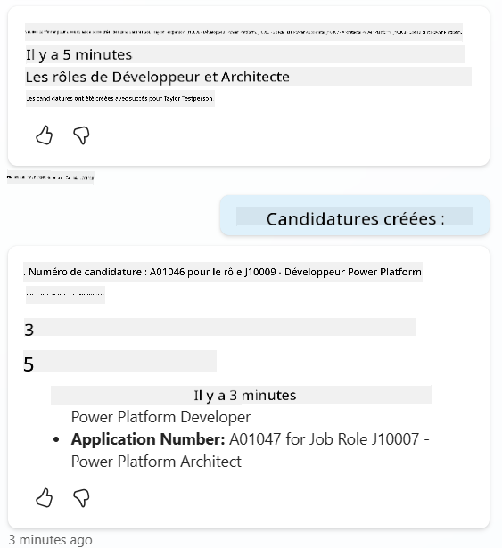

1. L'**outil Créer une candidature** sera ensuite exécuté pour chaque rôle que vous avez spécifié. Dans la carte d'activité, vous verrez l'outil Créer une candidature s'exécuter pour chacun des rôles que vous avez demandé de créer une candidature :  
    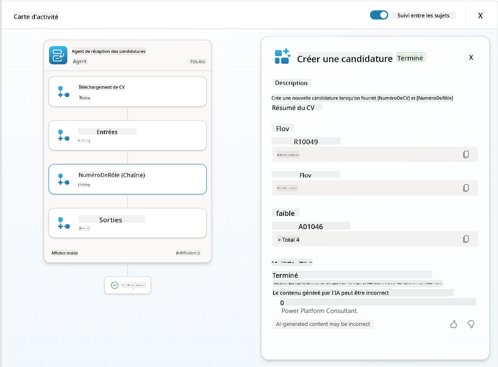

## 🎉 Mission accomplie

Excellent travail, Opératif ! **Opération Grounding Control** est maintenant terminée. Vous avez réussi à améliorer vos capacités d'IA avec des données dynamiques, créant un système de recrutement véritablement intelligent.

Voici ce que vous avez accompli dans cette mission :

**✅ Maîtrise de l'ancrage Dataverse**  
Vous comprenez maintenant comment connecter des invites personnalisées à des sources de données en direct pour une intelligence dynamique.

**✅ Analyse améliorée des CV**  
Votre flux Résumer le CV accède désormais à des données de rôles en temps réel et à des critères d'évaluation pour un appariement précis.

**✅ Prise de décision basée sur les données**  
Vos agents de recrutement peuvent désormais s'adapter automatiquement aux exigences changeantes des postes sans mises à jour manuelles des invites.

**✅ Création de candidatures**  
Votre système amélioré peut désormais créer des candidatures et est prêt pour une orchestration de flux de travail plus complexe.

🚀 **Prochaine étape :** Dans votre prochaine mission, vous apprendrez à implémenter des capacités de raisonnement approfondi qui aident vos agents à prendre des décisions complexes et à fournir des explications détaillées pour leurs recommandations.

⏩ [Passer à la mission 09 : Raisonnement approfondi](../09-deep-reasoning/README.md)

## 📚 Ressources tactiques

📖 [Utiliser vos propres données dans une invite](https://learn.microsoft.com/ai-builder/use-your-own-prompt-data?WT.mc_id=power-182762-scottdurow)

📖 [Créer une invite personnalisée](https://learn.microsoft.com/ai-builder/create-a-custom-prompt?WT.mc_id=power-182762-scottdurow)

📖 [Travailler avec Dataverse dans Copilot Studio](https://learn.microsoft.com/microsoft-copilot-studio/knowledge-add-dataverse?WT.mc_id=power-182762-scottdurow)

📖 [Vue d'ensemble des invites personnalisées AI Builder](https://learn.microsoft.com/ai-builder/prompts-overview?WT.mc_id=power-182762-scottdurow)

📖 [Documentation Power Platform AI Builder](https://learn.microsoft.com/ai-builder/?WT.mc_id=power-182762-scottdurow)

📖 [Formation : Créer des invites AI Builder en utilisant vos propres données Dataverse](https://learn.microsoft.com/training/modules/ai-builder-grounded-prompts/?WT.mc_id=power-182762-scottdurow)

---

**Avertissement** :  
Ce document a été traduit à l'aide du service de traduction automatique [Co-op Translator](https://github.com/Azure/co-op-translator). Bien que nous nous efforcions d'assurer l'exactitude, veuillez noter que les traductions automatisées peuvent contenir des erreurs ou des inexactitudes. Le document original dans sa langue d'origine doit être considéré comme la source faisant autorité. Pour des informations critiques, il est recommandé de recourir à une traduction humaine professionnelle. Nous ne sommes pas responsables des malentendus ou des interprétations erronées résultant de l'utilisation de cette traduction.