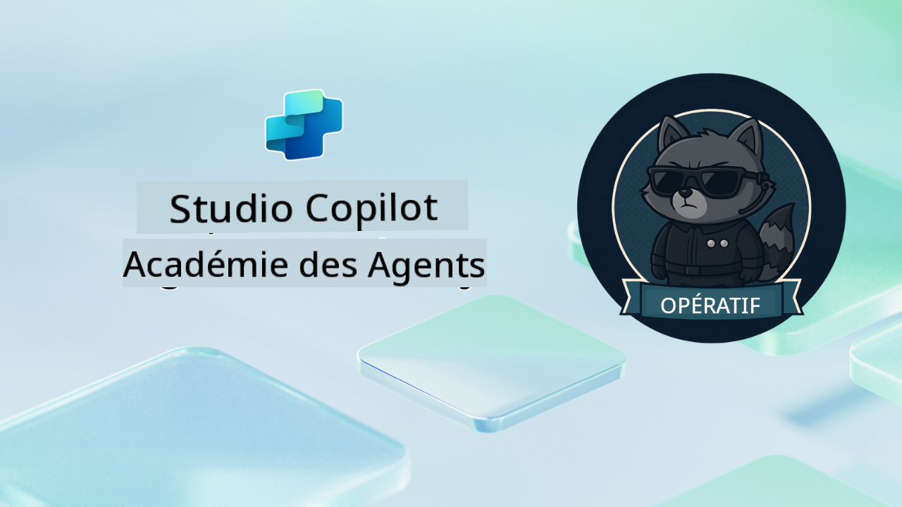

<!--
CO_OP_TRANSLATOR_METADATA:
{
  "original_hash": "24fcbe9a57d3439e05f8866e550c0a84",
  "translation_date": "2025-10-17T19:17:11+00:00",
  "source_file": "docs/operative-preview/README.md",
  "language_code": "fr"
}
-->
# Bienvenue, Opératif

**Bienvenue, Opératif.**  
Votre mission avancée—si vous l'acceptez—est de maîtriser l'art de construire des **systèmes multi-agents de niveau entreprise** en utilisant **Microsoft Copilot Studio**.

Cette formation intensive vous emmène au-delà de la création d'agents de base vers le monde sophistiqué de l'**orchestration multi-agents** : de l'automatisation des recrutements à la sécurité de l'IA, vous apprendrez à construire, coordonner et déployer des écosystèmes d'agents intelligents à travers des scénarios réels d'entreprise.

--8<-- "disclaimer.md"

---

## 🎯 Objectif de la Mission

En complétant le programme Agent Academy Operative, vous serez capable de :

- Concevoir et mettre en œuvre des **systèmes multi-agents** pour des scénarios d'affaires complexes
- Maîtriser les modèles d'**orchestration et de collaboration des agents**
- Implémenter la **sécurité de l'IA et la modération de contenu** dans des systèmes en production
- Construire des **prompts multi-modaux** pour le traitement et l'analyse de documents
- Déployer des **agents prêts pour l'entreprise** avec une gouvernance et des tests appropriés

---

## 🧪 Prérequis

Pour accomplir toutes les missions, vous aurez besoin de :

- Avoir complété la formation **Agent Academy Recruit**
- Un environnement Microsoft Power Platform avec une licence **Copilot Studio**
- Accès à **Microsoft Dataverse**
- Des permissions administratives pour créer des solutions et des agents

---

## 🧬 Pour Qui Est Ce Programme

Ce cours avancé est idéal pour :

- Les **architectes de solutions** concevant des systèmes d'IA pour l'entreprise
- Les **développeurs** construisant des solutions d'agents prêtes pour la production
- Les **professionnels IT** mettant en œuvre la gouvernance et la sécurité de l'IA
- Les **analystes métier** créant des flux de travail d'automatisation complexes
- Toute personne prête à **passer au niveau supérieur** en passant des agents de base aux systèmes d'entreprise

---

## 🧭 Aperçu du Programme

Cette académie est structurée comme une série progressive d'opérations sur le terrain—chaque mission s'appuie sur la précédente pour créer un système complet d'automatisation des recrutements.

| Mission | Titre | Briefing de l'Opération |
|---------|-------|-------------------------|
| `01` | 🚨 [Commencez avec l'Agent de Recrutement](./01-get-started/README.md) | Déployez l'infrastructure de base et créez votre agent orchestrateur central |
| `02` | 🎭 [Rendez votre agent prêt pour le multi-agent avec des agents connectés](./02-multi-agent/README.md) | Transformez un agent unique en un système multi-agents coordonné |
| `03` | ⚡ [Automatisez votre agent avec des Déclencheurs](./03-automate-triggers/README.md) | Implémentez des comportements autonomes d'agents avec des déclencheurs basés sur des événements |
| `04` | 📝 [Rédaction des Instructions pour l'Agent](./04-agent-instructions/README.md) | Maîtrisez la communication précise et le contrôle du comportement des agents |
| `05` | 💬 [Personnalisation des Réponses de l'Agent](./05-agent-responses/README.md) | Personnalisez les réponses des agents pour un impact et un engagement maximum |
| `06` | 🛡️ [Essentiels de la Modération de Contenu et de la Sécurité de l'IA](./06-ai-safety/README.md) | Implémentez des mesures de sécurité et de conformité de niveau entreprise |
| `07` | 🎨 [Extraction de Contenus de CV avec des Prompts Multi-Modaux](./07-multimodal-prompts/README.md) | Traitez des documents et des images avec des capacités avancées d'IA |
| `08` | 🗄️ [Prompts - Ancrage dans Dataverse](./08-dataverse-grounding/README.md) | Ancrez les agents dans les données d'entreprise pour des réponses précises |
| `09` | 🧠 [Application d'un Raisonnement Approfondi pour Évaluer l'Adéquation des Candidats et Préparer les Entretiens](./09-deep-reasoning/README.md) | Implémentez un raisonnement sophistiqué d'IA pour des décisions complexes |
| `10` | 📄 [Génération de Documents d'Entretien Spécifiques aux Candidats avec des Prompts](./10-generate-documents/README.md) | Créez des documents dynamiques basés sur l'analyse de l'agent |
| `11` | 📊 [Obtenez des Retours Utilisateurs avec des Cartes Adaptatives](./11-obtain-user-feedback/README.md) | Collectez et traitez les retours utilisateurs pour une amélioration continue |
| `12` | 🌐 [Publiez Vos Agents sur un Site Démo pour les Tests des Parties Prenantes](./12-demo-website/README.md) | Déployez une solution complète pour la démonstration et les tests des parties prenantes |

!!! note
    ✅ Compléter ce programme vous permet d'obtenir le badge **Operative**.  
    🔓 **Commander** sera débloqué dans les phases futures.

<!-- markdownlint-disable-next-line MD033 -->

---

**Avertissement** :  
Ce document a été traduit à l'aide du service de traduction automatique [Co-op Translator](https://github.com/Azure/co-op-translator). Bien que nous nous efforcions d'assurer l'exactitude, veuillez noter que les traductions automatisées peuvent contenir des erreurs ou des inexactitudes. Le document original dans sa langue d'origine doit être considéré comme la source faisant autorité. Pour des informations critiques, il est recommandé de recourir à une traduction humaine professionnelle. Nous ne sommes pas responsables des malentendus ou des interprétations erronées résultant de l'utilisation de cette traduction.