<!--
CO_OP_TRANSLATOR_METADATA:
{
  "original_hash": "d9cd8cd1a4fbd8915171a2ed972cc322",
  "translation_date": "2025-10-17T19:00:07+00:00",
  "source_file": "docs/recruit/00-course-setup/README.md",
  "language_code": "fr"
}
-->
# 🚨 Mission 00 : Configuration du cours

## 🕵️‍♂️ NOM DE CODE : `OPÉRATION PRÊT AU DÉPLOIEMENT`

> **⏱️ Durée de l'opération :** `~30 minutes`  

## 🎯 Résumé de la mission

Bienvenue dans la première mission de votre formation en tant qu'agent Copilot Studio.  
Avant de pouvoir commencer à créer votre premier agent IA, vous devez établir votre **environnement de développement prêt pour le terrain**.

Ce briefing décrit les systèmes, les identifiants d'accès et les étapes de configuration nécessaires pour opérer avec succès dans l'écosystème Microsoft 365.

## 🔎 Objectifs

Votre mission inclut :

1. Obtenir un compte Microsoft 365  
1. Accéder à Microsoft Copilot Studio  
1. (Optionnel) Obtenir une licence Microsoft 365 Copilot pour la publication en production  
1. Créer un environnement de développement comme environnement Copilot Studio pour construire  
1. Créer un site SharePoint qui servira de source de données dans les missions ultérieures  

---

## 🔍 Prérequis

Avant de commencer, assurez-vous d'avoir :

1. Une **adresse e-mail professionnelle ou scolaire** (les adresses personnelles @outlook.com, @gmail.com, etc., ne sont pas prises en charge).  
1. Accès à Internet et un navigateur moderne (Edge, Chrome ou Firefox recommandé).  
1. Une connaissance de base de Microsoft 365 (par exemple, se connecter aux applications Office ou Teams).  
1. (Optionnel) Une carte de crédit ou un moyen de paiement si vous prévoyez d'acheter des licences payantes.  

---

## Étape 1 : Obtenir un compte Microsoft 365

Copilot Studio se trouve dans Microsoft 365, vous avez donc besoin d'un compte Microsoft 365 pour y accéder. Vous pouvez utiliser un compte existant si vous en avez un ou suivre ces étapes pour obtenir une licence appropriée :

1. **Obtenez un abonnement Microsoft 365 Business payant**  
   1. Accédez à la [page des plans et tarifs Microsoft 365 Business](https://www.microsoft.com/microsoft-365/business/microsoft-365-plans-and-pricing)  
   1. L'option la moins chère pour commencer est le plan Microsoft 365 Business Basic. Sélectionnez `Essayer gratuitement` et suivez le formulaire guidé pour remplir les détails de votre abonnement, votre compte et vos informations de paiement.  
   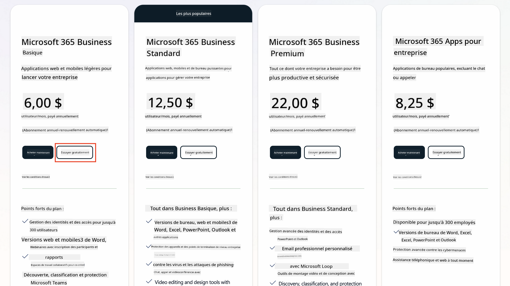  
   1. Une fois que vous avez votre nouveau compte, connectez-vous.  

    !!! Tip  
        Si vous prévoyez de publier des agents dans Microsoft 365 Copilot Chat ou de vous connecter à des données organisationnelles (SharePoint, OneDrive, Dataverse), une licence Microsoft 365 Copilot est requise. Il s'agit d'une licence complémentaire que vous pouvez découvrir [sur le site de licences](https://www.microsoft.com/microsoft-365/copilot#plans).  

---

## Étape 2 : Démarrer un essai de Copilot Studio

Une fois que vous avez votre tenant Microsoft 365, vous devez accéder à Copilot Studio. Vous pouvez obtenir un essai gratuit de 30 jours en suivant ces étapes :

1. Accédez à [aka.ms/TryCopilotStudio](https://aka.ms/TryCopilotStudio).  
1. Entrez l'adresse e-mail du nouveau compte que vous avez configuré à l'étape précédente et sélectionnez `Suivant`.  
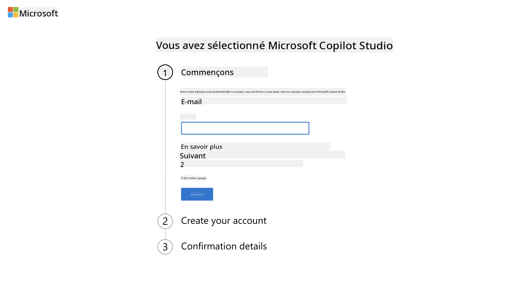  
1. Votre compte devrait être reconnu. Sélectionnez `Se connecter`.  
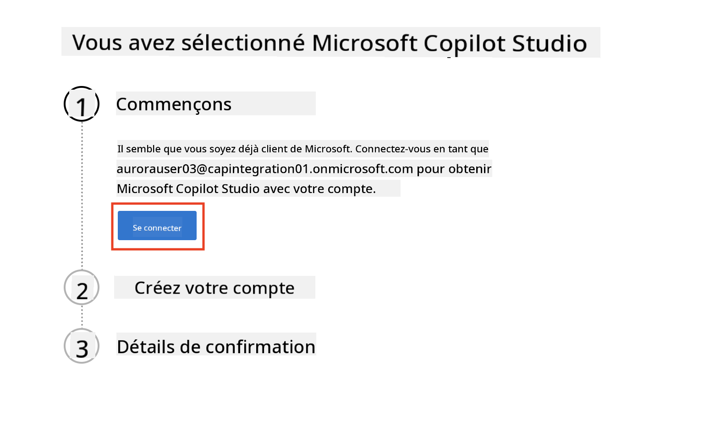  
1. Sélectionnez `Démarrer l'essai gratuit`.  
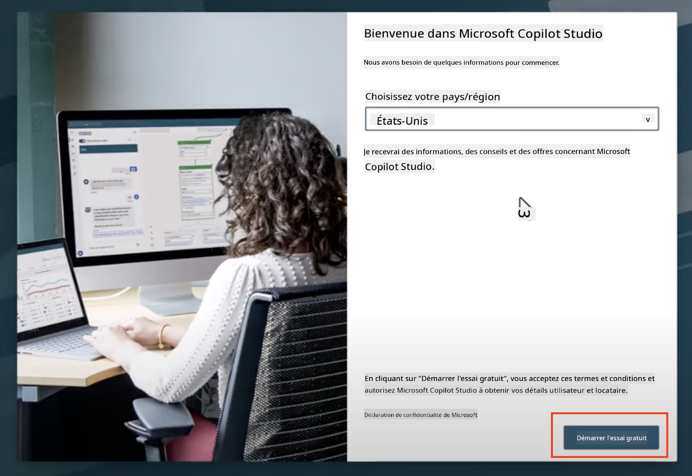  

!!! info "Notes sur l'essai"  
     1. L'essai gratuit offre **toutes les fonctionnalités de Copilot Studio**.  
     1. Vous recevrez des notifications par e-mail concernant l'expiration de votre essai. Vous pouvez prolonger l'essai par incréments de 30 jours (jusqu'à 90 jours de fonctionnement de l'agent).  
     1. Si l'administrateur de votre tenant a désactivé l'inscription en libre-service, vous verrez une erreur—contactez votre administrateur Microsoft 365 pour la réactiver.  

---

## Étape 3 : Créer un nouvel environnement de développement

### Inscrivez-vous au plan développeur Power Apps

En utilisant le même tenant Microsoft 365 de l'étape 1, inscrivez-vous au plan développeur Power Apps pour créer un environnement de développement gratuit afin de construire et tester avec Copilot Studio.

1. Inscrivez-vous sur le [site du plan développeur Power Apps](https://aka.ms/PowerAppsDevPlan).  

    - Entrez votre adresse e-mail  
    - Cochez la case  
    - Sélectionnez **Démarrer gratuitement**  

    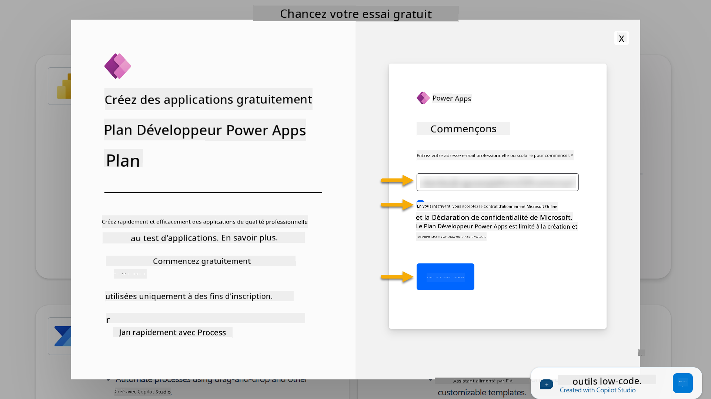  

1. Après l'inscription au plan développeur, vous serez redirigé vers [Power Apps](https://make.powerapps.com/). L'environnement utilise votre nom, par exemple **Environnement d'Adele Vance**. S'il existe déjà un environnement avec ce nom, le nouvel environnement développeur sera nommé **Environnement d'Adele Vance (1)**.  

    Utilisez cet environnement développeur dans Copilot Studio pour compléter les laboratoires.  

!!! Note  
    Si vous utilisez un compte Microsoft 365 existant et n'en avez pas créé un à l'étape 1, par exemple - en utilisant votre propre compte dans votre organisation de travail, votre administrateur informatique (ou l'équipe équivalente) qui gère votre tenant/environnements pourrait avoir désactivé le processus d'inscription. Dans ce cas, veuillez contacter votre administrateur ou créer un tenant de test comme indiqué à l'étape 1.  

---

## Étape 4 : Créer un nouveau site SharePoint

Un nouveau site SharePoint doit être créé et sera utilisé dans [Leçon 06 - Créer un agent personnalisé en utilisant l'expérience de création conversationnelle avec Copilot et en l'ancrant avec vos données](../06-create-agent-from-conversation/README.md#62-add-an-internal-knowledge-source-using-a-sharepoint-site).  

1. Sélectionnez l'icône en forme de gaufre en haut à gauche de Microsoft Copilot Studio pour afficher le menu. Sélectionnez SharePoint dans le menu.  

    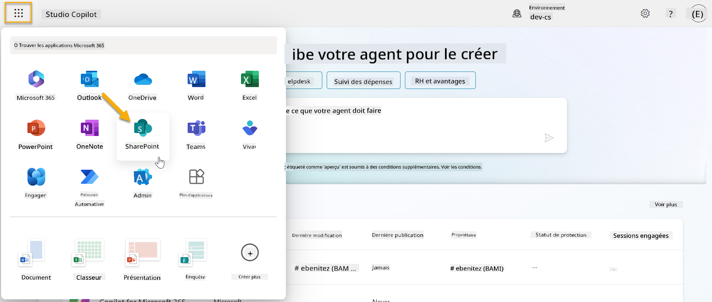  

1. SharePoint se chargera. Sélectionnez **+ Créer un site** pour créer un nouveau site SharePoint.  

    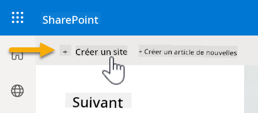  

1. Une boîte de dialogue apparaîtra pour vous guider dans la création d'un nouveau site SharePoint. Sélectionnez **Site d'équipe**.  

    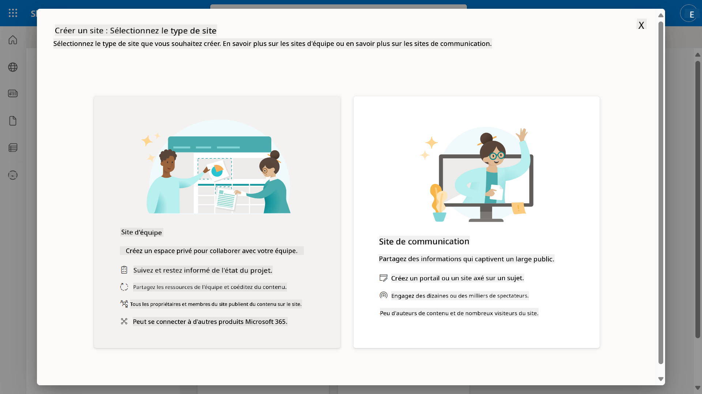  

1. À l'étape suivante, une liste de modèles Microsoft se chargera par défaut. Faites défiler vers le bas et sélectionnez le modèle **Service d'assistance informatique**.  

    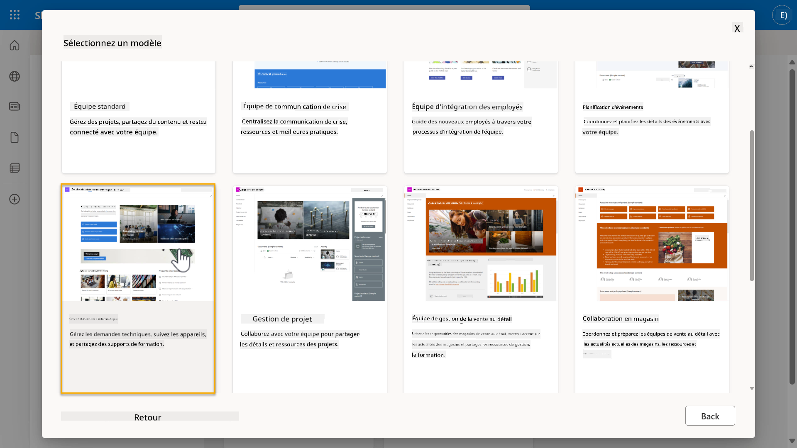  

1. Sélectionnez **Utiliser le modèle** pour créer un nouveau site SharePoint en utilisant le modèle service d'assistance informatique.  

    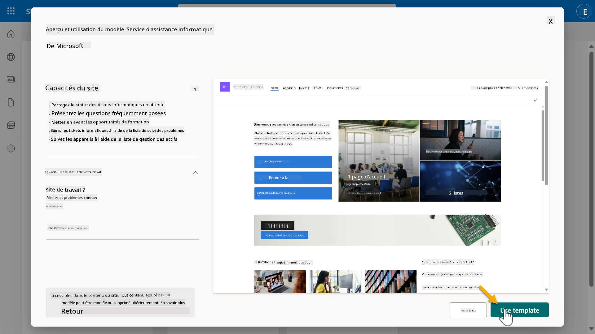  

1. Entrez les informations pour votre site. Voici un exemple :  

    | Champ | Valeur |
    | --- | --- |
    | Nom du site | Contoso IT |
    | Description du site | Copilot Studio pour débutants |
    | Adresse du site | ContosoIT |

    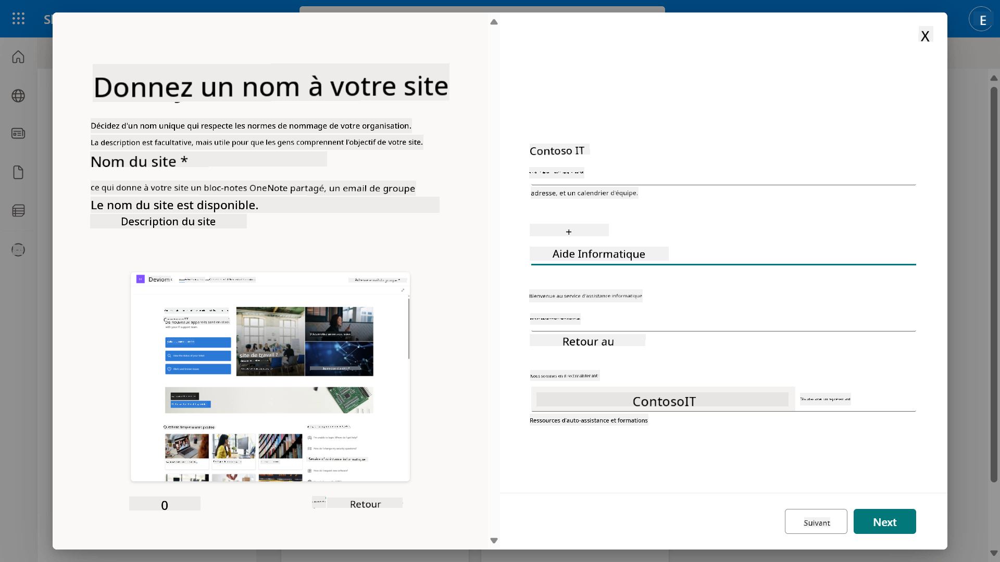  

1. À l'étape finale, une langue peut être sélectionnée pour le site SharePoint. Par défaut, ce sera **Anglais**. Laissez la langue sur **Anglais** et sélectionnez **Créer un site**.  

    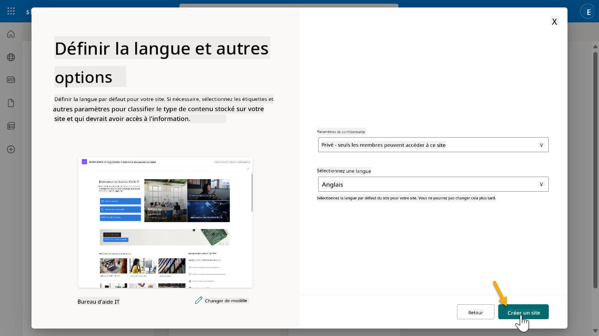  

1. Le site SharePoint sera provisionné pendant quelques secondes. Pendant ce temps, vous pouvez choisir d'ajouter d'autres utilisateurs à votre site en entrant leur adresse e-mail dans le champ **Ajouter des membres**. Une fois terminé, sélectionnez **Terminer**.  

    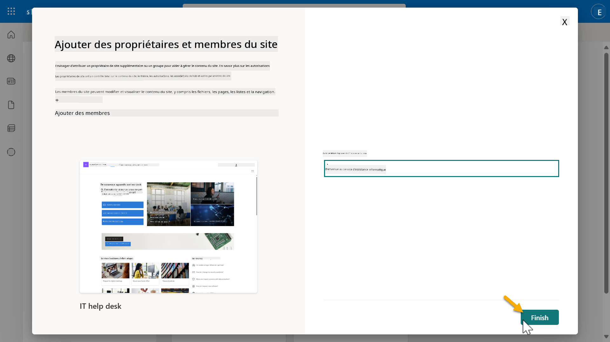  

1. La page d'accueil du site SharePoint se chargera ensuite. **Copiez** l'URL du site SharePoint.  

1. Ce modèle fournit des pages avec des données d'exemple sur diverses politiques informatiques et deux listes d'exemple (Tickets et Appareils).  

### Utiliser la liste SharePoint des appareils

Nous utiliserons la liste **Appareils** dans [Mission 07 - Ajouter un nouveau sujet avec déclencheur et nœuds](../07-add-new-topic-with-trigger/README.md#73-add-a-tool-using-a-connector).  

### Ajouter une nouvelle colonne

Faites défiler jusqu'à l'extrémité droite de la liste et sélectionnez le bouton **+ Ajouter une colonne**. Choisissez le type **hyperlien**, entrez **Image** comme nom de colonne, et sélectionnez ajouter.  

### Créer des données d'exemple dans la liste SharePoint des appareils

Vous devez vous assurer de remplir cette liste avec au moins 4 éléments de données d'exemple et ajouter une colonne supplémentaire à cette liste.  

Lors de l'ajout de données d'exemple, assurez-vous que les champs suivants sont remplis :  

- Photo de l'appareil - utilisez les images du [dossier d'images des appareils](https://github.com/microsoft/agent-academy/tree/main/docs/recruit/00-course-setup/images/device-images)  
- Titre  
- Statut  
- Fabricant  
- Modèle  
- Type d'actif  
- Couleur  
- Numéro de série  
- Date d'achat  
- Prix d'achat  
- Numéro de commande  
- Image - utilisez les liens suivants  

|Appareil  |URL  |
|---------|---------|
|Surface Laptop 13     | [https://raw.githubusercontent.com/microsoft/agent-academy/refs/heads/main/docs/recruit/00-course-setup/images/device-images/Surface-Laptop-13.png](https://raw.githubusercontent.com/microsoft/agent-academy/refs/heads/main/docs/recruit/00-course-setup/images/device-images/Surface-Laptop-13.png)        |
|Surface Laptop 15     | [https://raw.githubusercontent.com/microsoft/agent-academy/refs/heads/main/docs/recruit/00-course-setup/images/device-images/Surface-Laptop-15.png](https://raw.githubusercontent.com/microsoft/agent-academy/refs/heads/main/docs/recruit/00-course-setup/images/device-images/Surface-Laptop-15.png)        |
|Surface Pro    | [https://raw.githubusercontent.com/microsoft/agent-academy/refs/heads/main/docs/recruit/00-course-setup/images/device-images/Surface-Pro-12.png](https://raw.githubusercontent.com/microsoft/agent-academy/refs/heads/main/docs/recruit/00-course-setup/images/device-images/Surface-Pro-12.png)        |
|Surface Studio    | [https://raw.githubusercontent.com/microsoft/agent-academy/refs/heads/main/docs/recruit/00-course-setup/images/device-images/Surface-Studio.png](https://raw.githubusercontent.com/microsoft/agent-academy/refs/heads/main/docs/recruit/00-course-setup/images/device-images/Surface-Studio.png)        |

---

## ✅ Mission accomplie

Vous avez réussi à :

- Configurer un environnement de développement Microsoft 365  
- Activer votre essai Copilot Studio  
- Créer un site SharePoint pour ancrer les agents  
- Remplir la liste des appareils pour une utilisation dans les missions futures  

Vous êtes officiellement prêt à commencer votre **formation d'agent niveau recrue** dans [Leçon 01](../01-introduction-to-agents/README.md).  

<!-- markdownlint-disable-next-line MD033 -->

---

**Avertissement** :  
Ce document a été traduit à l'aide du service de traduction automatique [Co-op Translator](https://github.com/Azure/co-op-translator). Bien que nous nous efforcions d'assurer l'exactitude, veuillez noter que les traductions automatisées peuvent contenir des erreurs ou des inexactitudes. Le document original dans sa langue d'origine doit être considéré comme la source faisant autorité. Pour des informations critiques, il est recommandé de recourir à une traduction humaine professionnelle. Nous ne sommes pas responsables des malentendus ou des interprétations erronées résultant de l'utilisation de cette traduction.