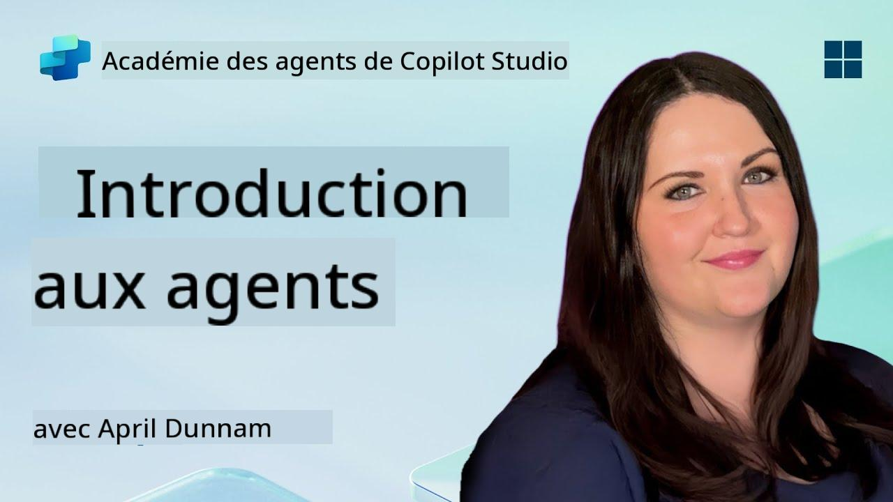

<!--
CO_OP_TRANSLATOR_METADATA:
{
  "original_hash": "d6706e107678264168d77b2e107710b1",
  "translation_date": "2025-10-17T19:13:30+00:00",
  "source_file": "docs/recruit/01-introduction-to-agents/README.md",
  "language_code": "fr"
}
-->
# 🚨 Mission 01 : Introduction aux agents

## 🕵️‍♂️ NOM DE CODE : `OPÉRATION DÉCODAGE AGENT IA`

> **⏱️ Durée de l'opération :** `~30 minutes – uniquement des informations, pas de travail sur le terrain requis`

🎥 **Regardez la vidéo explicative**

## 🎯 Résumé de la mission

Bienvenue, recrue. Avant de plonger dans la création d'agents, vous devez bien comprendre les concepts d'IA qui les alimentent. Cette mission vous fournira des connaissances de base sur l'IA conversationnelle, les modèles de langage étendus (LLMs), la génération augmentée par récupération (RAG) et les types d'agents que vous pouvez créer dans Copilot Studio.

## 🔎 Objectifs

Dans cette mission, vous apprendrez :

1. Ce qu'est l'IA conversationnelle et pourquoi elle est importante  
1. Comment les modèles de langage étendus (LLMs) alimentent les expériences de chat  
1. Ce que la génération augmentée par récupération (RAG) apporte  
1. La différence entre les agents conversationnels et les agents autonomes  
1. Comment les agents dans Copilot Studio exploitent ces concepts  

Plongeons dans le sujet !

---

## Qu'est-ce que l'IA conversationnelle ?

L'IA conversationnelle désigne tout système capable de comprendre, traiter et répondre au langage humain – qu'il s'agisse de texte ou de parole – d'une manière naturelle. Pensez aux chatbots dans les centres d'assistance ou aux assistants personnels virtuels dans vos applications préférées. En coulisses, la plupart des IA conversationnelles modernes reposent sur des modèles de langage étendus (LLMs), que nous aborderons ensuite.

### Pourquoi c'est important

- **Expérience utilisateur :** Les interfaces conversationnelles sont souvent plus intuitives que de naviguer dans des menus.  
- **Évolutivité :** Un agent peut gérer des dizaines ou des centaines de conversations simultanées.  
- **Efficacité :** Au lieu de créer des scripts basés sur des règles, les agents alimentés par des LLM s'adaptent instantanément aux entrées des utilisateurs.  
- **Extensibilité :** Avec un bon design, les agents peuvent accéder à des bases de connaissances, se connecter à des API ou agir comme des "collaborateurs numériques" dans les flux de travail d'entreprise.

---

## Modèles de langage étendus (LLMs) 101

Au cœur de la plupart des systèmes d'IA conversationnelle se trouvent les **modèles de langage étendus** – des réseaux neuronaux entraînés sur des corpus de texte massifs. Ils apprennent les modèles statistiques du langage pour générer des phrases cohérentes, répondre à des questions ou même proposer des idées. Points clés à comprendre :

1. **Données d'entraînement :** Les LLMs ingèrent des téraoctets de texte (pages web, livres, articles). Cette "connaissance du monde" leur permet de répondre sur de nombreux sujets.  
1. **Tokenisation :** Le texte est divisé en unités plus petites appelées tokens (mots, sous-mots ou caractères). Le modèle prédit un token à la fois.  
1. **Fenêtre de contexte :** Chaque LLM a une limite sur le nombre de tokens qu'il peut "voir" en même temps. Au-delà de cette limite, les tokens précédents sont tronqués.  
1. **Incitation (Prompting) :** Vous interagissez avec un LLM en lui envoyant une incitation. Plus votre incitation est précise, plus la réponse sera pertinente.  
1. **Zero-shot vs. Fine-tuning :** Zero-shot signifie utiliser un LLM tel quel (juste ses poids bruts). Fine-tuning signifie ajuster le modèle avec des données spécifiques au domaine pour qu'il réponde plus précisément à vos besoins.

!!! Tip "Astuce Pro"
    Une analogie courante est que le LLM est comme un "autocompléteur super-intelligent". Il ne comprend pas vraiment le sens comme un cerveau humain, mais il est extrêmement doué pour prédire le prochain mot (ou phrase) dans une séquence.

---

## Génération augmentée par récupération (RAG)

Lorsque les LLMs se basent uniquement sur des données d'entraînement statiques, ils peuvent halluciner ou devenir obsolètes. La RAG résout ce problème en permettant au modèle de "consulter" des informations fraîches avant de composer une réponse. En résumé, la RAG fonctionne ainsi :

1. **Requête utilisateur :** Un utilisateur pose une question (par exemple, "Quelles sont les dernières nouvelles sur les résultats trimestriels de Contoso ?").  
1. **Étape de récupération :** Le système interroge une source de connaissances (documents, bases de données internes, bibliothèques SharePoint, etc.) pour trouver des passages pertinents.  
1. **Augmentation :** Les passages récupérés sont ajoutés ou placés avant l'incitation du LLM.  
1. **Génération :** Le LLM ingère à la fois la question de l'utilisateur et le contexte récupéré, puis génère une réponse basée sur des données actualisées.  

Avec la RAG, votre agent peut consulter des wikis internes d'entreprise, des API de plugins ou rechercher dans une base de connaissances FAQ – et fournir des réponses qui ne sont pas limitées aux paramètres statiques du modèle.

---

## Agents conversationnels vs. agents autonomes

Dans le contexte de Copilot Studio, le terme **agent** peut désigner plusieurs types d'assistants IA. Il est utile de distinguer :

**Agents conversationnels :**

- Se concentrent principalement sur le dialogue à deux sens.  
- Conservent le contexte sur plusieurs tours de conversation.  
- Généralement orchestrés via des flux ou des déclencheurs prédéfinis (par exemple, "Si l'utilisateur dit X, répondre avec Y").  
- Idéal pour le support client, les FAQ, les interactions guidées, la planification ou les questions simples.  
  - Exemples :  
    - Un chatbot Teams qui répond aux questions sur les politiques RH.  
    - Un bot Power Virtual Agents sur une page SharePoint pour guider les utilisateurs à travers un formulaire.  

**Agents autonomes :**

- Vont au-delà du simple dialogue ; ils peuvent **agir** au nom de l'utilisateur.  
- Utilisent des boucles de raisonnement LLM (penser "planifier → agir → observer → replanifier") pour accomplir des tâches.  
- Se connectent à des outils ou API externes (par exemple, appeler un flux Power Automate, envoyer des invitations de calendrier, manipuler des données dans Dataverse).  
- Fonctionnent sans incitations humaines constantes – une fois déclenchés, ils peuvent gérer des processus multi-étapes de manière autonome.  
  - Exemples :  
    - Un agent qui génère un itinéraire de voyage, réserve des vols et envoie des confirmations par email.  
    - Un agent "Résumé de réunion" qui rejoint un appel Teams, le transcrit en temps réel et rédige un résumé exécutif dans OneNote.  

!!! Info "Différence clé"
    Les agents conversationnels attendent les entrées des utilisateurs et se limitent au dialogue. Les agents autonomes planifient et exécutent de manière proactive une séquence d'étapes en utilisant un accès étendu aux outils.

---

## Agents dans Copilot Studio

**Copilot Studio** unifie les scénarios conversationnels et autonomes sous un même cadre. Voici comment Copilot Studio vous aide à créer des agents :

1. **Concepteur visuel d'agents :** Une interface low-code pour définir les incitations, la mémoire et les outils pour les flux de chat et d'action.  
1. **Configurations LLM :** Choisissez parmi divers modèles OpenAI ou GPT de niveau entreprise de Microsoft pour répondre à vos besoins en termes de performance et de coût.  
1. **Connecteurs de récupération :** Intégrations préconstruites pour SharePoint, OneDrive, Azure Cognitive Search et Dataverse, permettant la RAG dès le départ.  
1. **Outils et fonctions personnalisés :** Définissez des actions HTTP personnalisées ou des flux Power Automate que votre agent peut invoquer de manière autonome.  
1. **Support multimodal :** Au-delà du texte, les agents Copilot Studio peuvent ingérer des images, des fichiers ou des données structurées pour enrichir le contexte.  
1. **Publication et distribution :** Une fois votre agent prêt, vous pouvez le publier sur Microsoft 365 Copilot (pour que les utilisateurs l'invoquent dans Teams, SharePoint, Outlook, etc.) ou l'intégrer comme widget de chat autonome sur une page web.

---

## 🎉 Mission accomplie

Vous avez maintenant terminé votre introduction aux agents et aux concepts fondamentaux de l'IA. Vous comprenez :

1. **LLMs = Le "cerveau" de votre agent**  
   - Responsable de la compréhension et de la génération du langage.  
   - Plus de tokens = contexte plus riche, mais aussi coût par appel plus élevé.  

1. **RAG = Intégration de connaissances en temps réel**  
   - Comble le fossé entre un LLM statique et des sources de données en constante évolution.  
   - Récupère et injecte des documents ou des enregistrements pertinents dans l'incitation du LLM.  

1. **Agents conversationnels vs. autonomes**  
   - **Conversationnels :** Se concentrent sur le flux de dialogue et la conservation du contexte (par exemple, "Mémoire de session").  
   - **Autonomes :** Ajoutent des "blocs d'action" permettant à l'agent d'appeler des outils ou services externes.

---
Ensuite, vous explorerez les [fondamentaux de Copilot Studio](../02-copilot-studio-fundamentals/README.md) !

Restez vigilant, recrue - votre voyage dans l'IA ne fait que commencer !

## 📚 Ressources tactiques

🔗 [Page d'accueil de la documentation Copilot Studio](https://learn.microsoft.com/microsoft-copilot-studio/)

---

<!-- markdownlint-disable-next-line MD033 -->

---

**Avertissement** :  
Ce document a été traduit à l'aide du service de traduction automatique [Co-op Translator](https://github.com/Azure/co-op-translator). Bien que nous nous efforcions d'assurer l'exactitude, veuillez noter que les traductions automatisées peuvent contenir des erreurs ou des inexactitudes. Le document original dans sa langue d'origine doit être considéré comme la source faisant autorité. Pour des informations critiques, il est recommandé de recourir à une traduction humaine professionnelle. Nous ne sommes pas responsables des malentendus ou des interprétations erronées résultant de l'utilisation de cette traduction.