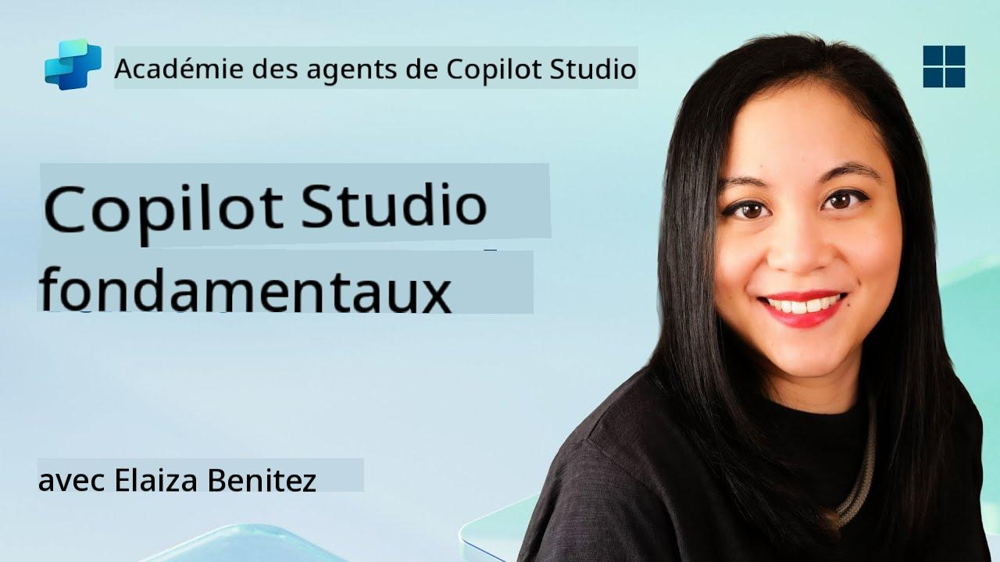
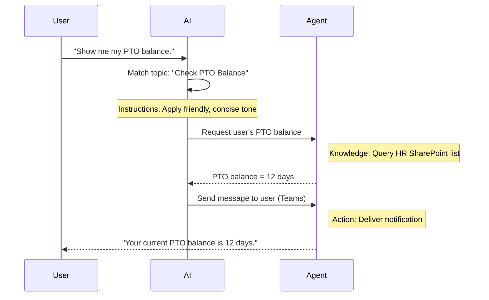

<!--
CO_OP_TRANSLATOR_METADATA:
{
  "original_hash": "90a3c5122f5687bbc8cc819990f175d4",
  "translation_date": "2025-10-17T19:14:27+00:00",
  "source_file": "docs/recruit/02-copilot-studio-fundamentals/README.md",
  "language_code": "fr"
}
-->
# 🚨 Mission 02 : Fondamentaux de Copilot Studio

## 🕵️‍♂️ NOM DE CODE : `OPÉRATION PROTOCOLE DE BASE`

> **⏱️ Durée de l'opération :** `~30 minutes – uniquement des informations, pas de travail sur le terrain requis`  

🎥 **Regardez la vidéo explicative**

[](https://www.youtube.com/watch?v=x4OCwDRGeLE "Regardez la vidéo explicative sur YouTube")

## 🎯 Résumé de la mission

Bienvenue, recrue. Cette mission vous fournira les bases nécessaires pour comprendre le fonctionnement de Copilot Studio et comment créer des agents intelligents qui apportent une réelle valeur ajoutée aux entreprises.

Avant de créer votre premier agent, vous devez comprendre les quatre composants clés qui constituent chaque agent IA personnalisé : Connaissances, Outils, Sujets et Instructions. Vous apprendrez également comment ces éléments interagissent dans l'orchestrateur de Copilot Studio.

## 🔎 Objectifs

Dans cette mission, vous allez :

- **Découvrir ce qu'est Copilot Studio**
- **Comprendre quand et pourquoi utiliser des agents**
- **Explorer les quatre blocs de construction des agents**
      - **Connaissances**
      - **Outils**
      - **Sujets**
      - **Instructions**
- **Comprendre comment ces composants fonctionnent ensemble** pour créer un agent intelligent et automatisé

---

## Qu'est-ce qu'un agent dans Copilot Studio ?

Un **agent** est un assistant IA spécialisé que vous concevez pour gérer des tâches ou des requêtes spécifiques. Contrairement à un chatbot généraliste, votre agent :

- **Connaît les données spécifiques à votre entreprise** (politiques, documents, bases de données)  
- **Effectue des tâches concrètes** (envoi de messages, création d'événements dans le calendrier, mise à jour de dossiers)  
- **Conserve le contexte conversationnel** pour pouvoir répondre aux questions de suivi  

Grâce à la nature low-code de Copilot Studio, vous pouvez glisser-déposer des composants préconçus, sans avoir besoin de compétences approfondies en programmation. Une fois votre agent créé, les utilisateurs peuvent l'utiliser dans Teams, Slack ou même sur une page web personnalisée pour obtenir des réponses ou déclencher des workflows automatiquement.

---

## Quand et pourquoi utiliser Copilot Studio

Bien que Microsoft 365 Copilot offre une assistance IA générale dans les applications Office, vous aurez besoin d'un agent personnalisé lorsque :

### Vous avez besoin de connaissances spécifiques à un domaine

- Copilot standard pourrait ne pas connaître les procédures internes ou les données de votre entreprise. Un agent peut interroger vos sites SharePoint, bases de données ou sources personnalisées pour fournir des réponses précises et à jour.  

### Vous souhaitez automatiser des workflows en plusieurs étapes

- Par exemple : "Lorsqu'une personne soumet une dépense, envoyez-la pour approbation, mettez à jour le suivi financier et informez le manager." Un agent personnalisé peut gérer chaque étape, déclenchée par une seule commande ou événement.  

### Vous avez besoin d'une expérience contextuelle intégrée à un outil  

- Imaginez un agent d'intégration des nouveaux employés dans Teams qui guide le personnel RH à travers chaque politique, envoie les formulaires nécessaires et planifie les réunions d'orientation—directement dans votre plateforme de collaboration existante.  

---

## Les quatre blocs de construction d'un agent

Chaque agent de Copilot Studio est construit à partir de quatre composants essentiels :

1. **Connaissances**  
1. **Outils (Actions)**  
1. **Sujets**  
1. **Instructions**

Ci-dessous, nous définissons chaque bloc de construction et montrons comment ils fonctionnent ensemble pour créer un agent efficace.

### 1. Connaissances

**Connaissances** représente les données et le contexte que votre agent utilise pour répondre avec précision. Cela comprend deux parties :

#### Instructions personnalisées et contexte

- Vous rédigez une brève description de l'objectif et du ton de l'agent. Par exemple :  

    ```text
    You are an IT support agent. You help employees troubleshoot common software issues, provide troubleshooting steps, and escalate urgent tickets.
    ```

- Pendant une conversation, l'agent se souvient des échanges précédents afin de pouvoir se référer à ce qui a déjà été discuté (par exemple, si l'utilisateur dit d'abord "Mon imprimante est hors ligne", puis demande plus tard "Avez-vous vérifié le niveau d'encre ?", l'agent se souvient du contexte de l'imprimante).

#### Sources de connaissances (Données de référence)

- Vous connectez votre agent à plusieurs sources de données—bibliothèques SharePoint, sites de documentation, wikis ou autres bases de données.  
- Lorsqu'un utilisateur pose une question, l'agent extrait des extraits pertinents de ces sources afin que les réponses soient **fondées** sur les politiques, manuels de produits ou toute information propriétaire de votre organisation.  
- Vous pouvez même obliger l'agent à répondre uniquement avec des informations provenant de ces sources, évitant ainsi qu'il ne devine ou "hallucine" des réponses.

!!! example
    Un agent "Assistant Politique" pourrait se connecter à votre site SharePoint RH. Si un utilisateur demande, "Quel est notre taux d'accumulation de congés ?", l'agent récupère le texte exact du document de politique RH plutôt que de s'appuyer sur une réponse générique de l'IA.

---

### 2. Outils (Actions)

**Outils (Actions)** définissent ce que l'agent peut faire au-delà de la conversation. Chaque action est une tâche que l'agent exécute de manière programmée, comme :

- Envoyer un email ou un message Teams  
- Créer ou mettre à jour un événement dans le calendrier  
- Ajouter ou modifier un enregistrement dans une base de données (par exemple, une liste SharePoint ou une table Dataverse)  
- Appeler un flux Power Automate ou une API REST  

#### Fonctionnement des actions

- **Définir les entrées et sorties**  
      - Par exemple, une action "Envoyer un email" pourrait nécessiter :  
        - `AdresseEmailDestinataire`  
        - `ObjetEmail`  
        - `CorpsEmail`  

- **Combiner les actions dans des workflows**  
      - Souvent, répondre à une demande utilisateur implique plusieurs étapes.  
      - Vous pouvez séquencer les actions pour que :  
             1. L'agent récupère des données d'une liste SharePoint.  
             2. Il génère un résumé à l'aide du LLM.  
             3. Il envoie un message Teams avec ce résumé.  

- **Connecter à des systèmes externes**  
      - Si vous devez mettre à jour un CRM ou appeler une API interne, créez une action personnalisée pour cela.  
      - Copilot Studio peut s'intégrer à la Power Platform ou à tout point de terminaison basé sur HTTP.

!!! example "Un agent "Assistant Dépenses" pourrait :"  
    1. Écouter une demande "Soumettre une dépense".  
    2. Récupérer les détails de la dépense de l'utilisateur via un formulaire.  
    3. Utiliser une action "Ajouter à la liste SharePoint" pour stocker les données.  
    4. Déclencher une action "Envoyer un email" pour informer l'approbateur.  

---

### 3. Sujets

**Sujets** définissent les déclencheurs conversationnels ou points d'entrée pour votre agent. Chaque sujet correspond à une fonctionnalité ou une catégorie de question.

#### Déclencheurs conversationnels  

- Un sujet pourrait être "Soumettre un ticket IT", "Vérifier le solde des congés" ou "Créer un rapport de ventes".  
- En coulisses, Copilot Studio utilise **l'orchestration générative** : au lieu de s'appuyer sur des mots-clés exacts, l'IA interprète l'intention de l'utilisateur et choisit le bon sujet en fonction d'une brève description que vous fournissez.  

#### Descriptions des sujets  

- Dans chaque sujet, vous rédigez une description claire et concise de ce que couvre ce sujet.

!!! example "Exemple de description de sujet"
    Ce sujet aide les utilisateurs à soumettre un ticket de support IT en collectant les détails du problème, la priorité et les informations de contact.

- L'IA utilise cette description pour décider quand activer ce sujet, même si la formulation de l'utilisateur ne correspond pas exactement.

#### Associer les sujets aux actions  

- Chaque sujet est connecté à une ou plusieurs actions ou étapes de récupération de données.  
- Lorsque l'IA choisit un sujet, elle guide la conversation à travers la séquence que vous avez définie (poser des questions de suivi, appeler des actions, retourner des résultats).

!!! example
    Si un utilisateur dit, "J'ai besoin d'aide pour configurer mon nouvel ordinateur portable", l'IA pourrait associer cette intention au sujet "Soumettre un ticket IT". L'agent demande alors le modèle de l'ordinateur portable, les détails de l'utilisateur, et enregistre automatiquement un ticket dans le système d'assistance.

---

### 4. Instructions

**Instructions** (parfois appelées "Prompts" ou "Messages système") guident le ton, le style et les limites du LLM. Elles définissent comment l'agent répond dans chaque situation.

#### Rôle et personnalité  

- Vous indiquez à l'IA qui elle est (par exemple, "Vous êtes un agent de service client pour Contoso Retail").  
- Cela définit le ton—amical, concis, formel ou décontracté—selon votre cas d'utilisation.

#### Directives de réponse  

- Spécifiez les règles que l'agent doit suivre, telles que :  
      - "Toujours résumer les informations de politique sous forme de puces."  
      - "Si vous ne connaissez pas la réponse, dites ‘Je suis désolé, je n'ai pas cette information.’"  
      - "Ne jamais inclure de données confidentielles hors contexte."

#### Règles de mémoire et de contexte

- Vous pouvez indiquer à l'agent combien de tours de conversation il doit mémoriser.  
- Par exemple : "Souvenez-vous des détails des demandes de cet utilisateur pour jusqu'à trois questions de suivi."

!!! example "Dans un agent "Conseiller en avantages", vous pourriez inclure :"
    "Référez-vous toujours au dernier manuel RH pour répondre aux questions. Si on vous demande les dates limites d'inscription, fournissez les dates spécifiques de la politique. Limitez les réponses à 150 mots."

---

## Comment les quatre blocs de construction fonctionnent ensemble

Lorsque vous assemblez **Connaissances**, **Outils**, **Sujets** et **Instructions**, l'orchestrateur IA de Copilot Studio crée un agent qui :

1. **Écoute un sujet pertinent** (guidé par vos descriptions de sujet).  
1. **Applique les instructions** pour définir son ton, décider quand poser des questions de suivi et appliquer les règles.  
1. **Utilise les sources de connaissances** pour fonder ses réponses sur les données de votre organisation.  
1. **Appelle les outils (actions)** si nécessaire pour effectuer des tâches—envoyer des messages, mettre à jour des dossiers ou invoquer des API.  

En coulisses, l'orchestrateur utilise une approche de **planification générative** : il décide des étapes à suivre, dans quel ordre, pour répondre à une demande utilisateur. Si une action échoue (par exemple, un email ne peut pas être envoyé), l'agent suit vos directives de gestion des exceptions (poser une question de clarification ou signaler l'erreur). Comme le LLM s'adapte au contexte de la conversation, l'agent peut conserver la mémoire sur plusieurs échanges et intégrer de nouvelles informations au fur et à mesure que la conversation évolue.

**Exemple de flux visuel :**  
<!--
1. **Utilisateur :** "Montrez-moi mon solde de congés."
1. **IA (Sujets) :** Associe au sujet "Vérifier le solde des congés".  
1. **IA (Instructions) :** Utilise un ton amical et concis.  
1. **Agent (Connaissances) :** Interroge la liste SharePoint RH pour le solde de l'utilisateur.  
1. **Agent (Actions) :** Récupère la valeur et envoie un message Teams :  
   > "Votre solde actuel de congés est de 12 jours."  
-->



---

## 🎉 Mission accomplie

Vous avez terminé avec succès votre briefing sur les fondamentaux. Vous avez maintenant appris les quatre blocs essentiels de tout agent dans Copilot Studio :

1. **Connaissances** – Où l'agent recherche des informations factuelles et conserve la mémoire de la conversation.  
1. **Outils** – Les tâches que l'agent peut effectuer pour automatiser des actions.  
1. **Sujets** – Comment l'agent reconnaît l'intention de l'utilisateur et décide quel workflow exécuter.  
1. **Instructions** – Les règles, le ton et les limites qui guident chaque réponse.

Avec ces composants en place, vous pouvez créer un agent de base qui répond aux questions et exécute des workflows simples. Dans la prochaine leçon, nous vous guiderons étape par étape pour créer un agent "Service Desk"—depuis la connexion de votre première source de connaissances jusqu'à la définition d'un sujet et la configuration d'une action.

À suivre : Vous allez créer votre [premier agent déclaratif pour M365 Copilot](../03-create-a-declarative-agent-for-M365Copilot/README.md).

<!-- markdownlint-disable-next-line MD033 -->


---

**Avertissement** :  
Ce document a été traduit à l'aide du service de traduction automatique [Co-op Translator](https://github.com/Azure/co-op-translator). Bien que nous nous efforcions d'assurer l'exactitude, veuillez noter que les traductions automatisées peuvent contenir des erreurs ou des inexactitudes. Le document original dans sa langue d'origine doit être considéré comme la source faisant autorité. Pour des informations critiques, il est recommandé de recourir à une traduction humaine professionnelle. Nous ne sommes pas responsables des malentendus ou des interprétations erronées résultant de l'utilisation de cette traduction.