<!--
CO_OP_TRANSLATOR_METADATA:
{
  "original_hash": "0c51aabca81d6256990caf4c015e6195",
  "translation_date": "2025-10-17T19:07:00+00:00",
  "source_file": "docs/recruit/04-creating-a-solution/README.md",
  "language_code": "fr"
}
-->
# 🚨 Mission 04 : Créer une solution pour votre agent

## 🕵️‍♂️ NOM DE CODE : `OPÉRATION CTRL-ALT-PACKAGE`

> **⏱️ Durée de l'opération :** `~45 minutes`

🎥 **Regardez la vidéo explicative**

[](https://www.youtube.com/watch?v=1iATbkgfcpU "Regardez la vidéo explicative sur YouTube")

## 🎯 Résumé de la mission

Créateur d'agent, bienvenue dans votre prochaine opération tactique. Dans cette mission, vous apprendrez à assembler une Solution - le véhicule officiel de déploiement pour votre agent IT Helpdesk construit avec Microsoft Copilot Studio. Pensez à cela comme à la création d'une mallette numérique qui contient votre agent et ses artefacts.

Chaque agent a besoin d'un domicile bien structuré. C'est ce que fournit une solution Power Platform - ordre, portabilité et préparation pour la production.

Préparons-nous.

## 🔎 Objectifs

Dans cette mission, vous apprendrez :

1. À comprendre ce que sont les solutions Power Platform et leur rôle dans le développement d'agents
1. À découvrir les avantages d'utiliser des solutions pour organiser et déployer des agents
1. À explorer les éditeurs de solutions et leur importance dans la gestion des composants
1. À comprendre le cycle de vie des solutions Power Platform, du développement à la production
1. À créer votre propre éditeur de solution et une solution personnalisée pour votre agent IT Helpdesk

## 🕵🏻‍♀️ Une solution ? Qu'est-ce que c'est ?

Dans Microsoft Power Platform, les solutions sont comme des conteneurs ou des packages qui regroupent toutes les parties de vos applications ou agents - cela peut inclure des tables, des formulaires, des flux et des logiques personnalisées. Les solutions sont essentielles pour la gestion du cycle de vie des applications (ALM), elles vous permettent de gérer votre application et vos agents depuis l'idée jusqu'au développement, aux tests, au déploiement et aux mises à jour.

Dans Copilot Studio, chaque agent que vous créez est stocké dans une solution Power Platform. Par défaut, les agents sont créés dans la solution par défaut, sauf si vous créez une nouvelle solution personnalisée pour y créer votre agent. C'est ce que nous allons apprendre 🤓 dans cette leçon et dans le laboratoire pratique.

Traditionnellement, les solutions étaient créées dans le **portail de création Power Apps** - une interface web où vous pouvez construire et personnaliser des applications, Dataverse, des flux, explorer des composants IA et plus encore.

   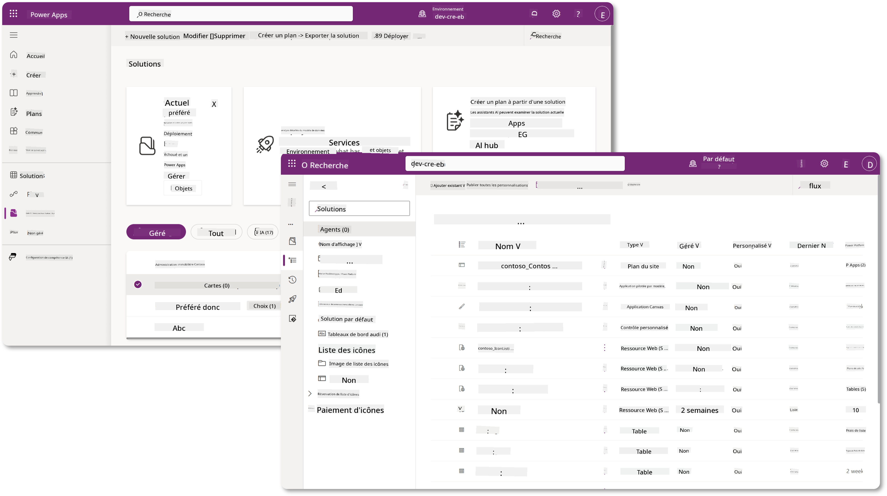

Dans Copilot Studio, il existe désormais l'**Explorateur de solutions** où vous pouvez gérer vos solutions directement. Vous n'avez plus besoin de passer au portail de création Power Apps pour gérer vos solutions, cela peut être fait directement dans Copilot Studio 🪄

Cela signifie que vous pouvez effectuer les tâches habituelles liées aux solutions :

- **Créer une solution** - les solutions personnalisées permettent aux agents d'être exportés et importés entre les environnements.
- **Définir votre solution préférée** - choisissez la solution dans laquelle les agents, applications, etc. seront créés par défaut.
- **Ajouter ou supprimer des composants** - votre agent peut référencer d'autres composants tels que des variables d'environnement ou des flux cloud. Ces composants doivent donc être inclus dans la solution.
- **Exporter des solutions** - pour déplacer des solutions vers un autre environnement cible.
- **Importer des solutions** - importer des solutions créées ailleurs, y compris la mise à niveau ou la mise à jour des solutions.
- **Créer et gérer des pipelines de solutions** - automatiser le déploiement des solutions entre les environnements.
- **Intégration Git** - permet aux développeurs de connecter des solutions à des dépôts Git pour le contrôle de version, la collaboration et l'ALM. Destiné à être utilisé uniquement dans des environnements de développement.

   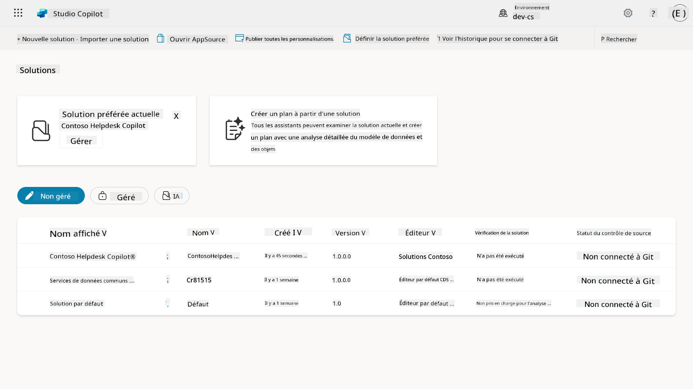

Il existe deux types de solutions :

- **Solutions non gérées** - utilisées pendant le développement. Vous pouvez les modifier et les personnaliser librement.
- **Solutions gérées** - utilisées lorsque vous êtes prêt à déployer votre application pour des tests ou en production. Elles sont verrouillées pour éviter les modifications accidentelles.

## 🤔 Pourquoi _devrais-je_ utiliser une solution pour mon agent ?

Pensez aux solutions comme à une _boîte à outils_. Lorsque vous devez réparer ou construire quelque chose (un agent) dans un autre endroit (environnement), vous rassemblez tous les outils nécessaires (composants) et les mettez dans votre boîte à outils (Solution). Vous pouvez ensuite transporter cette boîte à outils vers le nouvel endroit (environnement) et utiliser les outils (composants) pour accomplir votre travail, ou ajouter de nouveaux outils (composants) pour personnaliser votre agent ou projet en cours de construction.

!!! quote "Elaiza, votre sympathique défenseure du cloud, intervient ici 🙋🏻‍♀️ pour partager quelques mots :"
    Nous avons un dicton en Nouvelle-Zélande, "Soyez un Kiwi ordonné !" qui est un appel à l'action pour les Néo-Zélandais 🥝 afin de prendre soin de leur environnement en jetant correctement les déchets et en gardant les espaces publics propres. Nous pouvons utiliser le même contexte pour les agents en gardant tout ce qui concerne votre agent organisé et portable, ce qui vous aidera à maintenir un environnement ordonné.

Il est bon de créer un agent dans une solution dédiée dans votre environnement source (développeur). Voici pourquoi les solutions sont précieuses :

🧩 **Développement organisé**

- Vous gardez votre agent séparé de la solution par défaut qui contient tout dans l'environnement. Tous les composants de votre agent sont au même endroit 🎯

- Tout ce dont vous avez besoin pour votre agent est dans une solution, ce qui facilite l'exportation et l'importation vers un environnement cible 👉🏻 c'est une bonne pratique pour l'ALM.

🧩 **Déploiement sécurisé**

- Vous pouvez exporter votre application ou agent en tant que solution gérée et la déployer dans d'autres environnements cibles (comme les tests ou la production) sans risquer des modifications accidentelles.

🧩 **Contrôle de version**

- Vous pouvez créer des correctifs (réparations ciblées), des mises à jour (modifications plus complètes) ou des mises à niveau (remplacement d'une solution - généralement des changements majeurs et l'introduction de nouvelles fonctionnalités).

- Cela vous aide à déployer des modifications de manière contrôlée.

🧩 **Gestion des dépendances**

- Les solutions suivent les parties qui dépendent des autres. Cela vous empêche de casser des choses lorsque vous apportez des modifications.

🧩 **Collaboration en équipe**

- Les développeurs et les créateurs peuvent travailler ensemble en utilisant des solutions non gérées en développement, puis transmettre une solution gérée pour le déploiement.

## 🪪 Comprendre les éditeurs de solutions

Un éditeur de solution dans Power Platform est comme une étiquette ou une marque qui identifie qui a créé ou possède une solution. C'est une petite mais importante partie de la gestion de vos applications, agents et personnalisations de flux, surtout lorsque vous travaillez en équipe ou entre différents environnements.

Lorsque vous créez une solution, vous devez choisir un éditeur. Cet éditeur définit :

- Un préfixe qui est ajouté à tous les composants personnalisés (comme les tables, champs et flux).

- Un nom et des informations de contact pour l'organisation ou la personne qui possède la solution.

### 🤔 Pourquoi est-ce important ?

1. **Identification facile** - le préfixe (Exemple - `new_` ou `abc_`) vous aide à identifier rapidement quels composants appartiennent à quelle solution ou équipe.

1. **Évite les conflits** - si deux équipes créent une colonne appelée statut, leurs préfixes (`teamA_status`, `teamB_status`) empêchent les collisions de noms.

1. **Soutient l'ALM** - lors du déplacement des solutions entre les environnements (Dev → Test → Prod), l'éditeur aide à suivre la propriété et à maintenir la cohérence.

### ✨ Exemple

Disons que vous créez un éditeur appelé Contoso Solutions avec le préfixe `cts_`.

Si vous ajoutez une colonne personnalisée appelée _Priorité_, elle sera stockée sous le nom `cts_Priority` dans la solution.

Quiconque rencontre la colonne au niveau de la solution, peu importe l'environnement dans lequel il se trouve, peut facilement l'identifier comme une colonne associée à Contoso Solutions.

## 🧭 Cycle de vie des solutions Power Platform

Maintenant que vous comprenez l'objectif d'une solution, apprenons le cycle de vie.

**1. Créer une solution dans l'environnement de développement** - commencez par créer une nouvelle solution dans votre environnement de développement.

**2. Ajouter des composants** - ajoutez des applications, des flux, des tables et d'autres éléments à votre solution.

**3. Exporter en tant que solution gérée** - préparez votre solution pour le déploiement en l'exportant en tant que solution gérée.

**4. Importer dans l'environnement de test** - testez votre solution dans un environnement de test séparé pour vous assurer que tout fonctionne comme prévu.

**5. Importer dans l'environnement de production** - déployez la solution testée dans votre environnement de production en direct.

**6. Appliquer des correctifs, mises à jour ou mises à niveau** - apportez des améliorations ou des corrections en utilisant des correctifs, des mises à jour ou des mises à niveau. 🔁 Répétez le cycle !

### ✨ Exemple

Imaginez que vous construisez un agent IT Helpdesk pour aider les employés avec des problèmes tels que des problèmes de périphériques, des dépannages réseau, des configurations d'imprimantes et plus encore.

- Vous commencez dans un environnement de développement en utilisant une solution non gérée.

- Une fois qu'il est prêt, vous l'exportez en tant que solution gérée et l'importez dans un environnement cible tel qu'un environnement de test système ou de test d'acceptation utilisateur (UAT).

- Après les tests, vous le déplacez vers l'environnement de production - tout cela sans toucher à la version originale de développement.

## 🧪 Laboratoire 04 : Créer une nouvelle solution

Nous allons maintenant apprendre

- [4.1 Comment créer un éditeur de solution](../../../../../docs/recruit/04-creating-a-solution)
- [4.2 Comment créer une solution](../../../../../docs/recruit/04-creating-a-solution)

Nous allons suivre l'exemple précédent, où nous allons créer une solution dans l'environnement dédié Copilot Studio pour construire notre agent IT Helpdesk.

Commençons !

### Prérequis

#### Rôle de sécurité

Dans Copilot Studio, ce que vous _pouvez faire_ dans l'explorateur de solutions dépend de votre rôle de sécurité utilisateur.
Si vous n'avez pas la permission de gérer les solutions dans le centre d'administration Power Apps, vous ne pourrez pas effectuer ces tâches dans Copilot Studio non plus.

Pour vous assurer que tout fonctionne correctement, vérifiez que vous avez les bons rôles de sécurité et permissions. Ou si vous ne gérez pas les environnements dans votre organisation, demandez à votre administrateur IT (ou l'équipe équivalente) qui gère votre tenant/environnements.

Les rôles de sécurité suivants permettent aux utilisateurs de créer une solution dans leur environnement.

| Rôle de sécurité    | Description |
| ---------- | ---------- |
| Créateur d'environnement | Fournit les permissions nécessaires pour créer, personnaliser et gérer des ressources dans un environnement spécifique, y compris les solutions  |
| Personnalisateur système  | Permissions plus larges que le Créateur d'environnement, y compris la capacité de personnaliser l'environnement et de gérer les rôles de sécurité |
| Administrateur système   | Niveau de permissions le plus élevé et peut gérer tous les aspects de l'environnement, y compris la création et l'attribution de rôles de sécurité     |

#### Environnement de développement

Assurez-vous de passer à votre environnement de développement dédié, consultez [Leçon 00 - Configuration du cours - Étape 3 : Créer un nouvel environnement de développement](../00-course-setup/README.md#step-3-create-new-developer-environment).

1. En haut à droite, sélectionnez l'icône **Roue dentée** et passez de l'environnement par défaut à votre environnement, par exemple **Environnement d'Adele Vance**.

    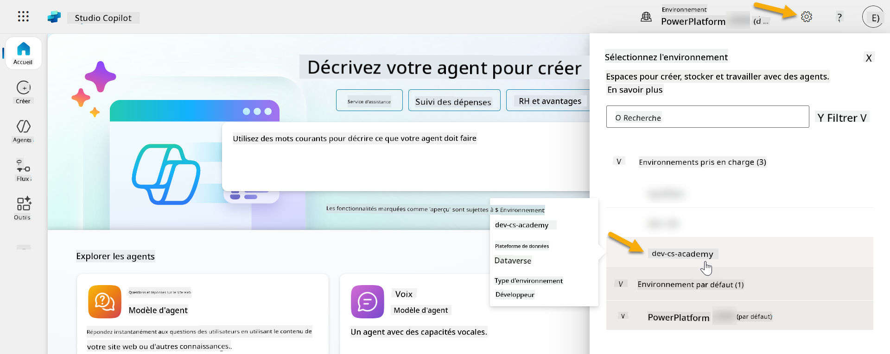

### 4.1 Créer un éditeur de solution

1. En utilisant le même environnement Copilot Studio utilisé dans la leçon précédente, sélectionnez l'**icône de points de suspension (. . .)** dans le menu de gauche dans Copilot Studio. Sélectionnez **Solutions** sous l'en-tête **Explorer**.

    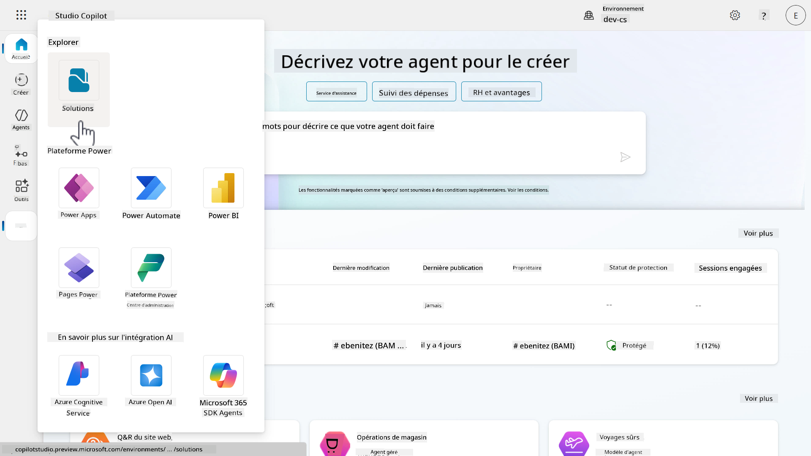

1. L'**Explorateur de solutions** dans Copilot Studio se chargera. Sélectionnez **+ Nouvelle solution**

    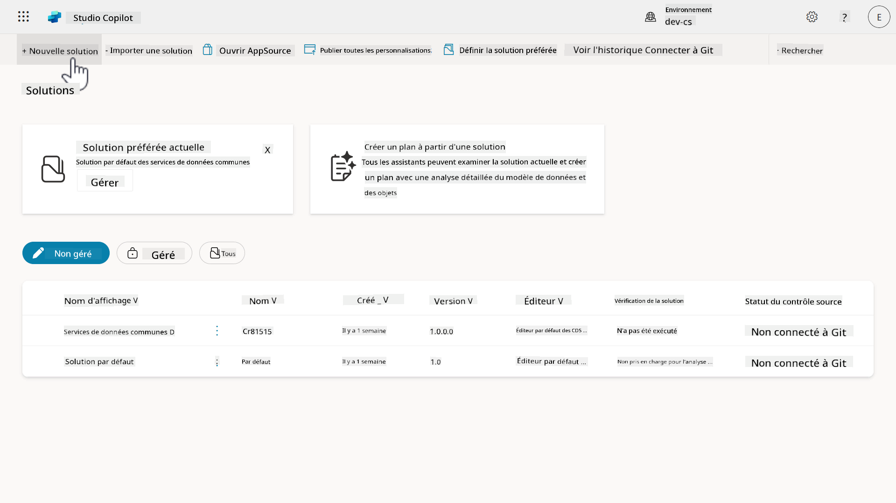

1. Le volet **Nouvelle solution** apparaîtra où nous pouvons définir les détails de notre solution. Tout d'abord, nous devons créer un nouvel éditeur. Sélectionnez **+ Nouvel éditeur**.

    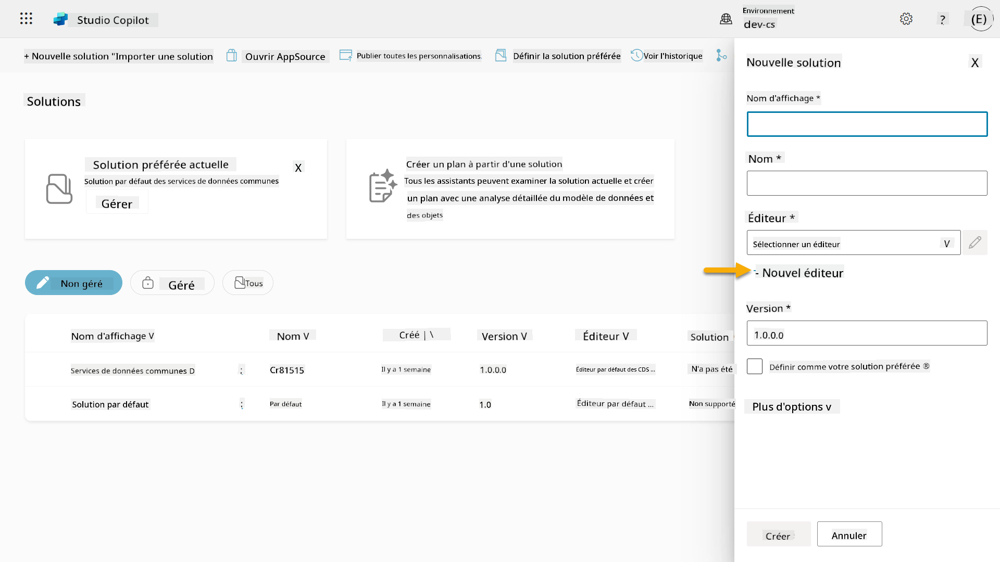  

1. L'onglet **Propriétés** du volet **Nouvel éditeur** apparaîtra avec des champs obligatoires et non obligatoires à remplir dans l'onglet **Propriétés**. C'est ici que nous pouvons définir les détails de l'éditeur qui sera utilisé comme étiquette ou marque identifiant qui a créé ou possède la solution.

    | Propriété    | Description | Obligatoire |
    | ---------- | ---------- | :----------: |
    | Nom d'affichage | Nom d'affichage pour l'éditeur | Oui   |
    | Nom  | Le nom unique et le nom de schéma pour l'éditeur  | Oui    |
    | Description   | Décrit l'objectif de la solution    | Non     |
    | Préfixe    | Préfixe de l'éditeur qui sera appliqué aux composants nouvellement créés   | Oui      |
    | Préfixe de valeur de choix   | Génère un numéro basé sur le préfixe de l'éditeur. Ce numéro est utilisé lorsque vous ajoutez des options aux choix et fournit un indicateur de la solution utilisée pour ajouter l'option.   | Oui      |

    Copiez et collez ce qui suit comme **Nom d'affichage**,

    ```text
    Contoso Solutions
    ```

    Copiez et collez ce qui suit comme **Nom**,

    ```text
    ContosoSolutions
    ```

    Copiez et collez ce qui suit comme **Description**,

    ```text
    Copilot Studio Agent Academy
    ```

    Copiez et collez ce qui suit pour le **Préfixe**,

    ```text
    cts
    ```

    Par défaut, le préfixe de **Valeur de choix** affichera une valeur entière. Mettez à jour cette valeur entière au millier le plus proche. Par exemple, dans ma capture d'écran ci-dessous, elle était initialement `77074`. Mettez à jour cela de `77074` à `77000`.

    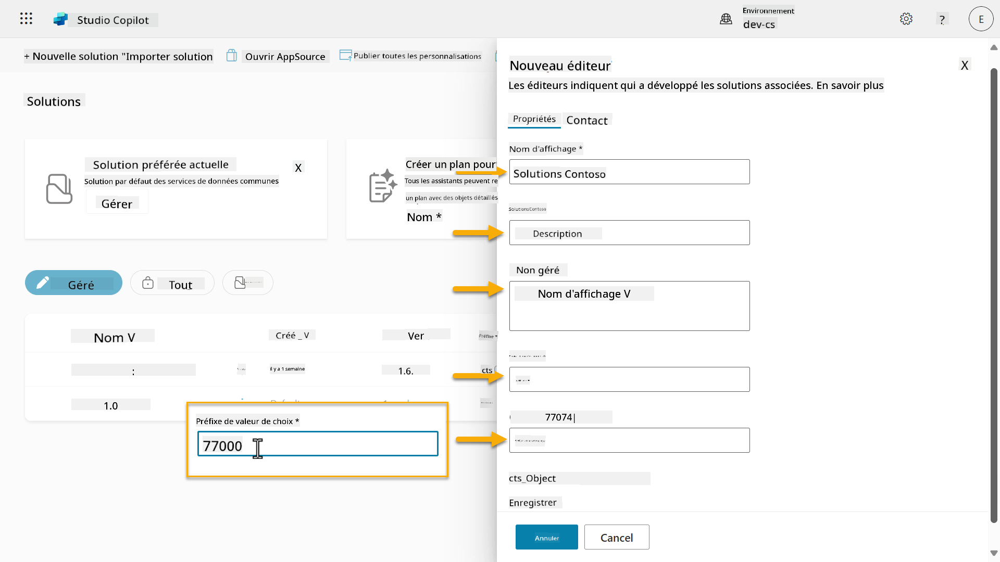  

1. Si vous souhaitez fournir les coordonnées pour la Solution, sélectionnez l'onglet **Contact** et remplissez les colonnes affichées.

    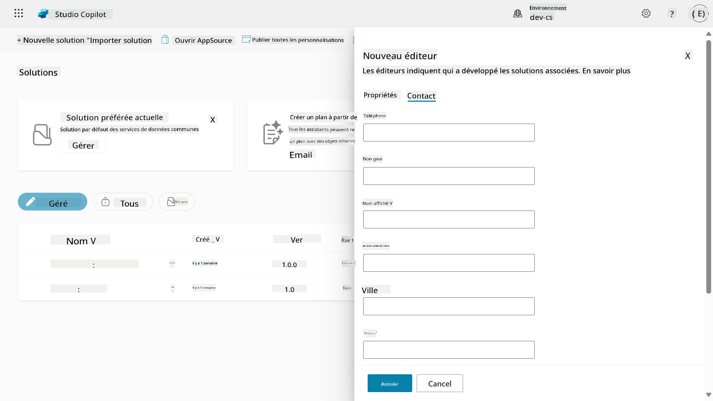

1. Sélectionnez l'onglet **Propriétés** et cliquez sur **Enregistrer** pour créer l'éditeur.

    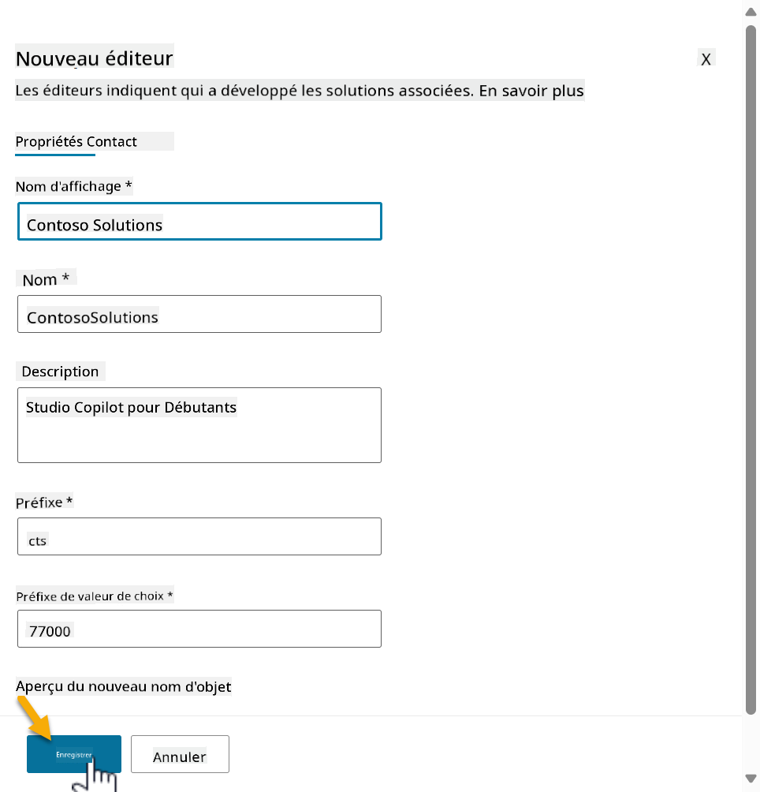
1. Le volet **Nouveau éditeur** se fermera et vous serez ramené au volet **Nouvelle solution** avec l'Éditeur nouvellement créé sélectionné.

    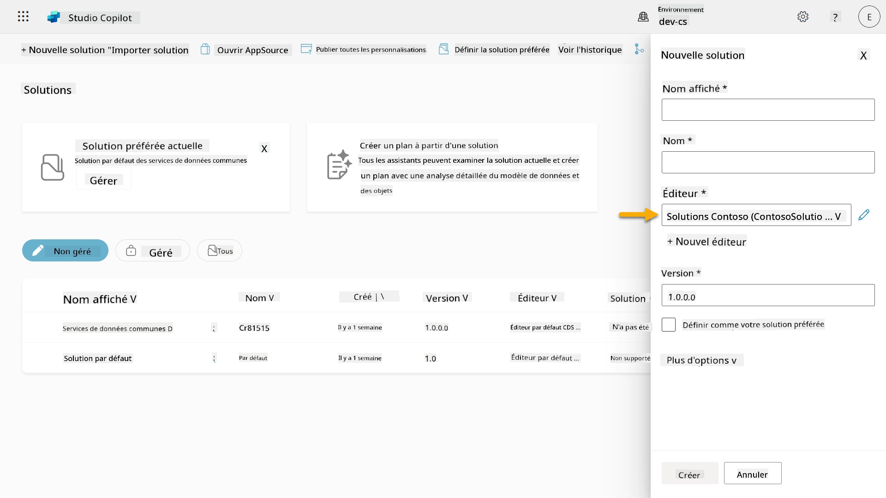  

Bravo, vous avez maintenant créé un Éditeur de Solution ! 🙌🏻 Nous allons maintenant apprendre à créer une nouvelle solution personnalisée.

### 4.2 Créer une nouvelle Solution

1. Maintenant que nous avons créé nos solutions, nous pouvons compléter le reste du formulaire dans le volet **Nouvelle solution**.

    Copiez et collez ce qui suit comme **Nom d'affichage**,

    ```text
    Contoso Helpdesk Agent
    ```

    Copiez et collez ce qui suit comme **Nom**,

    ```text
    ContosoHelpdeskAgent
    ```

    Étant donné que nous créons une nouvelle solution, le [**Numéro de version**](https://learn.microsoft.com/power-apps/maker/data-platform/update-solutions#understanding-version-numbers-for-updates/?WT.mc_id=power-172615-ebenitez) par défaut sera `1.0.0.0`.

    Cochez la case **Définir comme votre solution préférée**.

    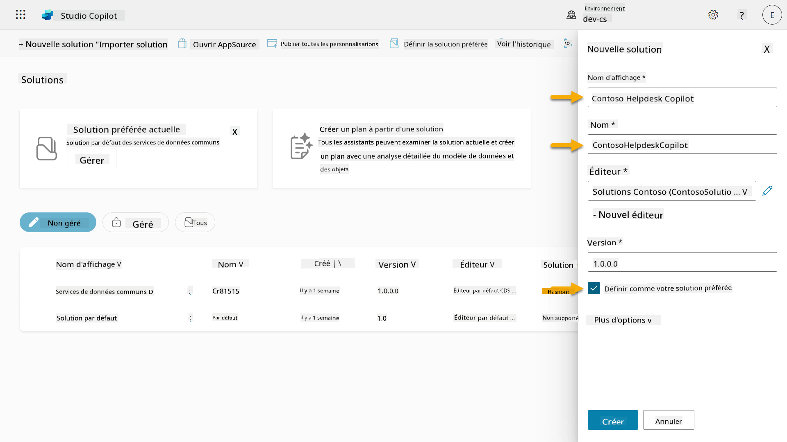  

1. Développez les **Options supplémentaires** pour voir les détails supplémentaires qui peuvent être fournis dans une solution.

    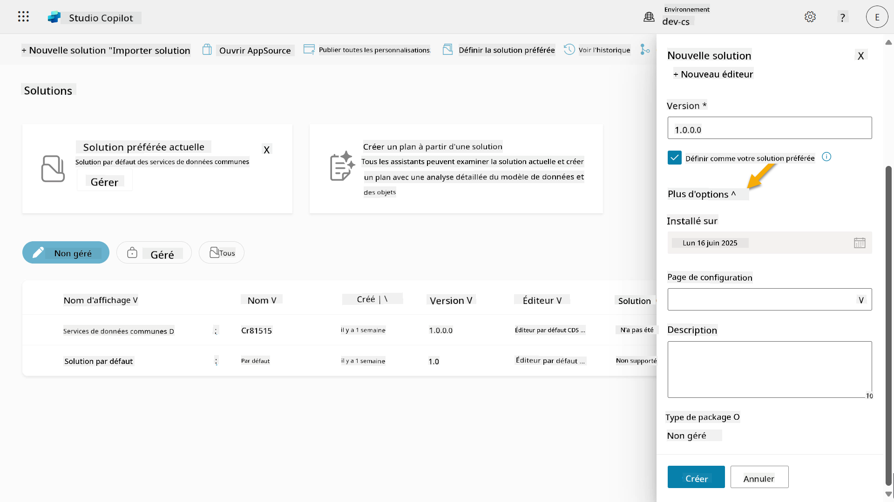

1. Vous verrez les éléments suivants :

    - **Installé le** - la date à laquelle la Solution a été installée.

    - **Page de configuration** - les développeurs configurent une ressource web HTML pour aider les utilisateurs à interagir avec leur application, agent ou outil où elle apparaîtra comme une page web dans la section Informations avec des instructions ou des boutons. Elle est principalement utilisée par les entreprises ou les développeurs qui créent et partagent des solutions avec d'autres.

    - **Description** - décrit la solution ou donne une description générale de la page de configuration.

    Nous laisserons ces champs vides pour cet exercice.

    Sélectionnez **Créer**.

    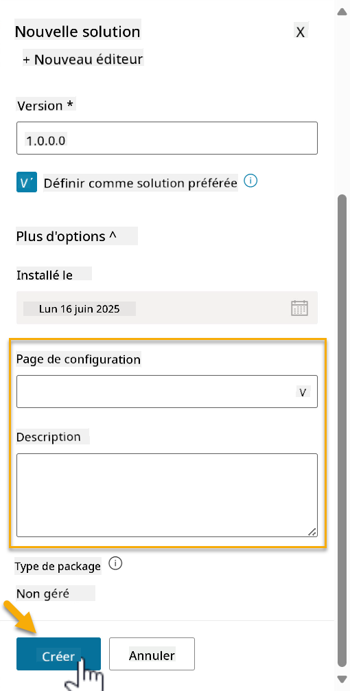

1. La solution pour Contoso Helpdesk Agent a maintenant été créée. Il n'y aura aucun composant jusqu'à ce que nous créions un agent dans Copilot Studio.

    Sélectionnez l'icône **flèche retour** pour revenir à l'Explorateur de solutions.

    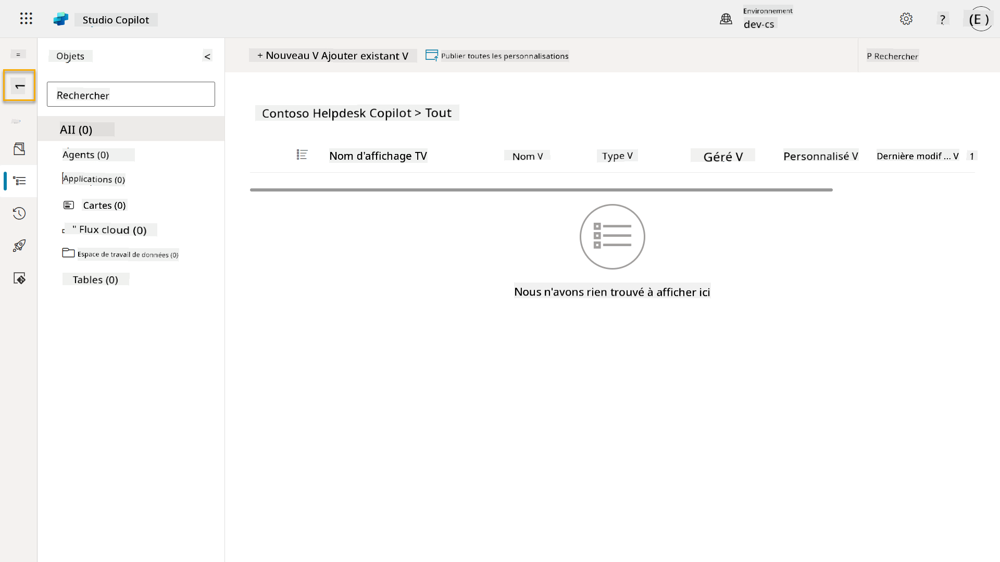

1. Remarquez comment Contoso Helpdesk Agent s'affiche maintenant comme la **Solution préférée actuelle** puisque nous avons coché la case **Définir comme votre solution préférée** plus tôt.

    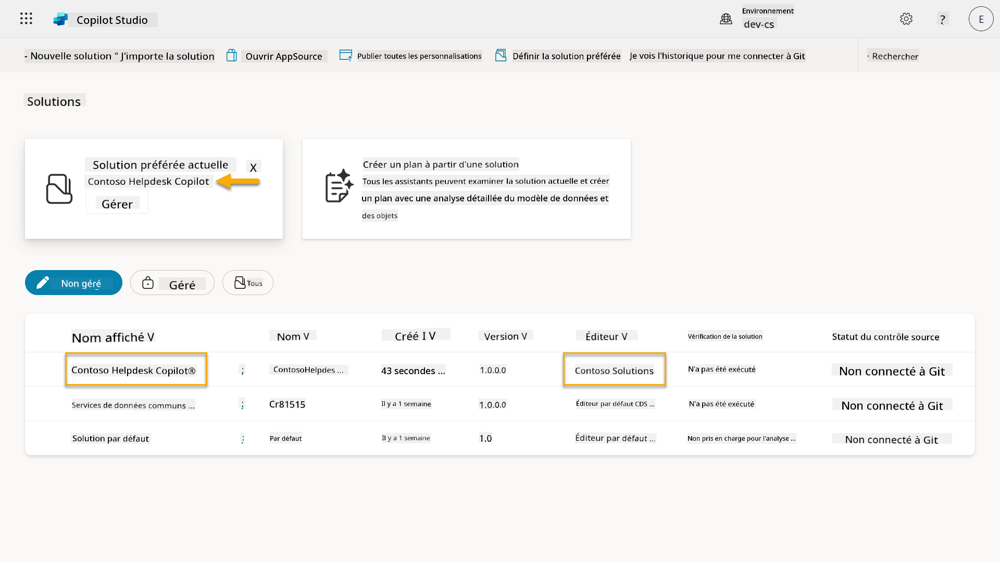

## ✅ Mission accomplie

Félicitations ! 👏🏻 Vous avez créé un Éditeur et l'avez utilisé dans votre nouvelle Solution pour construire votre agent !

Bien joué, créateur d'agents. Une empreinte numérique bien organisée est la première étape vers une opérabilité à grande échelle. Vous avez maintenant les outils et l'état d'esprit pour un développement d'agents durable et prêt pour l'entreprise.

Ceci marque la fin de **Lab 04 - Création d'une Solution**, sélectionnez le lien ci-dessous pour passer à la leçon suivante. La solution créée dans ce laboratoire sera utilisée dans le laboratoire de la prochaine leçon.

⏭️ [Passer à la leçon **Commencer rapidement avec des agents préconstruits**](../05-using-prebuilt-agents/README.md)

## 📚 Ressources tactiques

🔗 [Créer une solution](https://learn.microsoft.com/power-apps/maker/data-platform/create-solution/?WT.mc_id=power-172615-ebenitez)

🔗 [Créer et gérer des solutions dans Copilot Studio](https://learn.microsoft.com/microsoft-copilot-studio/authoring-solutions-overview/?WT.mc_id=power-172615-ebenitez)

🔗 [Partager des agents avec d'autres utilisateurs](https://learn.microsoft.com/microsoft-copilot-studio/admin-share-bots/?WT.mc_id=power-172615-ebenitez)

🔗 [Résumé des ressources disponibles pour les rôles de sécurité prédéfinis](https://learn.microsoft.com/power-platform/admin/database-security#summary-of-resources-available-to-predefined-security-roles/?WT.mc_id=power-172615-ebenitez)

🔗 [Mettre à niveau ou mettre à jour une solution](https://learn.microsoft.com/power-apps/maker/data-platform/update-solutions/?WT.mc_id=power-172615-ebenitez)

🔗 [Vue d'ensemble des pipelines dans Power Platform](https://learn.microsoft.com/power-platform/alm/pipelines/?WT.mc_id=power-172615-ebenitez)

🔗 [Vue d'ensemble de l'intégration Git dans Power Platform](https://learn.microsoft.com/power-platform/alm/git-integration/overview/?WT.mc_id=power-172615-ebenitez)

<!-- markdownlint-disable-next-line MD033 -->


---

**Avertissement** :  
Ce document a été traduit à l'aide du service de traduction automatique [Co-op Translator](https://github.com/Azure/co-op-translator). Bien que nous nous efforcions d'assurer l'exactitude, veuillez noter que les traductions automatisées peuvent contenir des erreurs ou des inexactitudes. Le document original dans sa langue d'origine doit être considéré comme la source faisant autorité. Pour des informations critiques, il est recommandé de faire appel à une traduction humaine professionnelle. Nous ne sommes pas responsables des malentendus ou des interprétations erronées résultant de l'utilisation de cette traduction.