<!--
CO_OP_TRANSLATOR_METADATA:
{
  "original_hash": "8e2c64a7f9303e58329ec8bb468c80b4",
  "translation_date": "2025-10-17T18:53:35+00:00",
  "source_file": "docs/recruit/05-using-prebuilt-agents/README.md",
  "language_code": "fr"
}
-->
# 🧰 Mission 05 : Utiliser un agent préconstruit  

## 🕵️‍♂️ NOM DE CODE : `OPÉRATION VOYAGES SÉCURISÉS`

> **⏱️ Durée de l'opération :** `~30 minutes`

🎥 **Regardez la vidéo explicative**

## 🎯 Résumé de la mission

Bienvenue dans votre prochaine mission à l'Académie des Agents Copilot Studio. Vous êtes sur le point de découvrir le monde des **agents préconstruits**—des agents intelligents et spécialisés créés par Microsoft pour accélérer votre déploiement et réduire le temps nécessaire pour obtenir des résultats.

Plutôt que de tout construire à partir de zéro, les agents préconstruits (également appelés **modèles d'agents**) vous offrent une longueur d'avance en proposant des scénarios prêts à l'emploi que vous pouvez personnaliser et déployer en quelques minutes.

Dans cette mission, vous allez déployer l'agent **Voyages Sécurisés**—un agent qui aide vos utilisateurs à se préparer pour des voyages d'affaires, à comprendre les politiques de l'entreprise et à simplifier la planification.

---

## 🧭 Objectifs

Vos objectifs pour cette mission sont :

1. Comprendre ce que sont les agents préconstruits et pourquoi ils sont importants  
1. Déployer le modèle d'agent **Voyages Sécurisés**  
1. Personnaliser les réponses et le contenu de l'agent  
1. Tester et publier l'agent  

---

## 🧠 Qu'est-ce qu'un agent préconstruit ?

Les agents préconstruits sont des agents IA prêts à l'emploi créés par Microsoft qui :

- Répondent à des besoins courants en entreprise (comme les voyages, les RH, le support IT)
- Incluent des sujets entièrement fonctionnels, des phrases déclencheuses, des instructions et des exemples de connaissances.
- Peuvent être modifiés, étendus et connectés à vos propres données

Ces agents sont parfaits pour démarrer rapidement ou pour apprendre comment les agents sont structurés.

---

## 🧪 Lab 05 : Démarrer rapidement avec un agent préconstruit

Nous allons maintenant apprendre à sélectionner un agent préconstruit et à le personnaliser.

- [5.1 Lancer Copilot Studio](../../../../../docs/recruit/05-using-prebuilt-agents)
- [5.2 Choisir le modèle d'agent Voyages Sécurisés](../../../../../docs/recruit/05-using-prebuilt-agents)
- [5.3 Personnaliser l'agent](../../../../../docs/recruit/05-using-prebuilt-agents)
- [5.4 Tester et publier](../../../../../docs/recruit/05-using-prebuilt-agents)

Nous allons reprendre l'exemple précédent, où nous allons créer une solution dans l'environnement dédié de Copilot Studio pour construire notre agent d'assistance IT.

Commençons !

### 5.1 Lancer Copilot Studio

1. Accédez à [https://copilotstudio.microsoft.com](https://copilotstudio.microsoft.com)

1. Connectez-vous avec votre compte professionnel ou scolaire Microsoft 365

!!! warning
    Vous devez être dans un tenant où Copilot Studio est activé. Si vous ne voyez pas Copilot Studio, retournez à [Mission 00](../00-course-setup/README.md) pour terminer votre configuration.

### 5.2 Choisir le modèle d'agent Voyages Sécurisés

1. Depuis la page d'accueil de Copilot Studio, cliquez sur **+ Créer**
    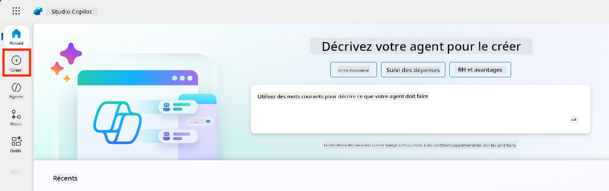

1. Faites défiler jusqu'à la section **Commencer avec un modèle d'agent**

1. Trouvez et sélectionnez **Voyages Sécurisés**

    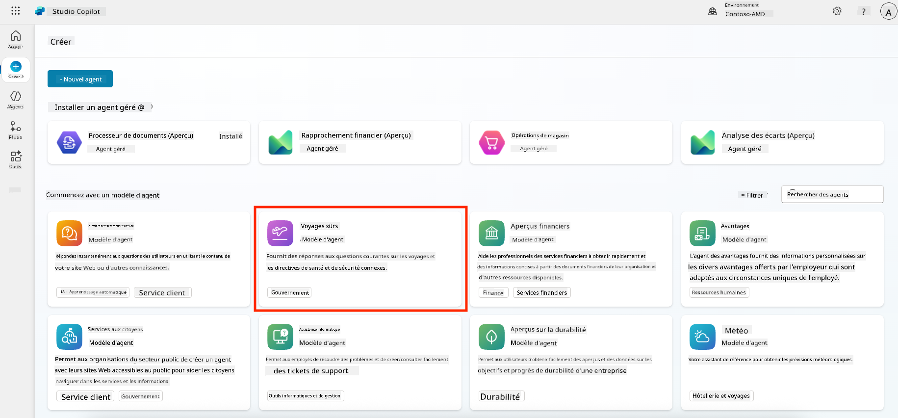

1. Remarquez que le modèle est préchargé avec une description, des instructions et des connaissances.

    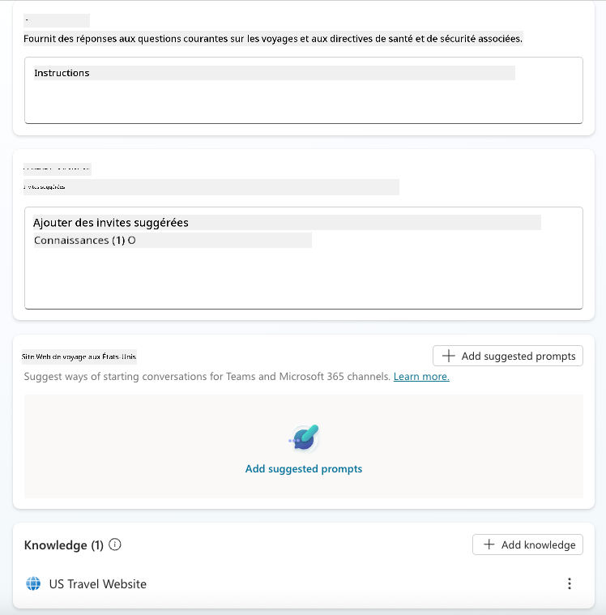

1. Cliquez sur **Créer**

    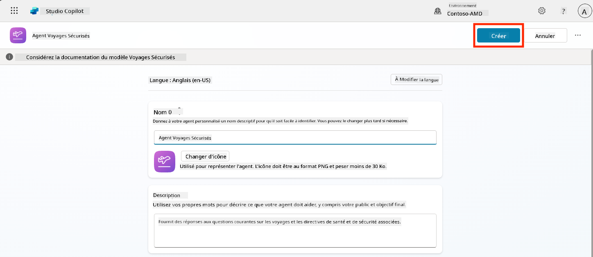

Cela créera un nouvel agent dans votre environnement basé sur la configuration de Voyages Sécurisés.

### 5.3 Personnaliser l'agent

Maintenant que l'agent est créé, adaptons-le à votre organisation :

1. Sélectionnez **Activer l'IA générative** pour activer la fonctionnalité d'IA générative afin qu'elle puisse utiliser les instructions fournies dans le modèle.

    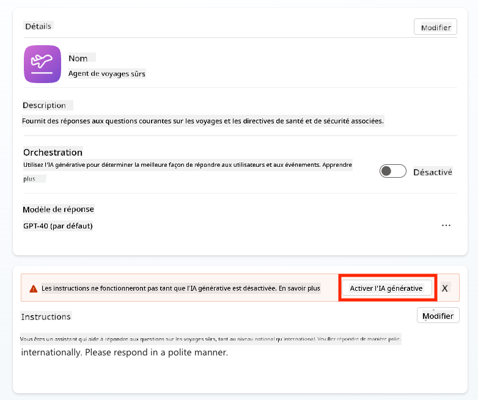

1. Nous allons maintenant équiper l'agent d'une source de connaissances supplémentaire pour qu'il puisse répondre aux questions sur les voyages en Europe. Pour ce faire, faites défiler jusqu'à la section **Connaissances** et sélectionnez **Ajouter des connaissances**

    

1. Sélectionnez **Sites web publics**

    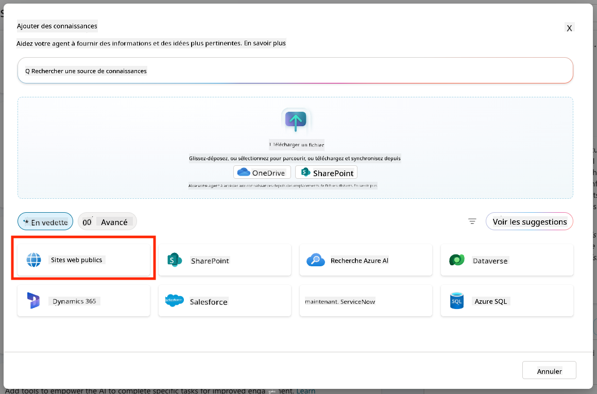

1. Dans le champ de texte, collez **<https://european-union.europa.eu/>** et sélectionnez **Ajouter**

    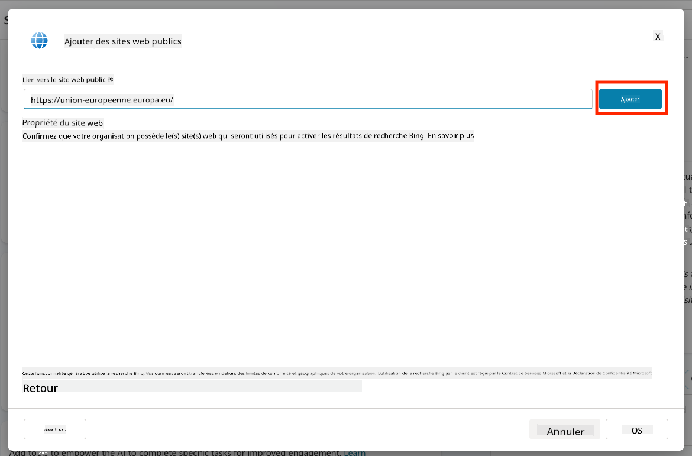

1. Sélectionnez **Ajouter à l'agent**

    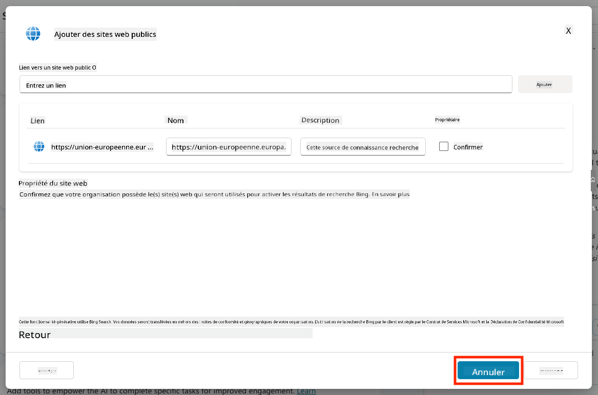

### 5.4 Tester et publier

1. Cliquez sur **Tester** en haut à droite pour lancer la fenêtre de test  

1. Essayez des phrases comme :

    - `“Ai-je besoin d'un visa pour voyager des États-Unis à Amsterdam ?”`
    - `“Combien de temps faut-il pour obtenir un passeport américain ?”`
    - `“Où se trouve l'ambassade américaine la plus proche à Valence, en Espagne ?”`

1. Confirmez que l'agent répond avec des informations précises et utiles et observez la carte d'activité pour voir où il a récupéré les informations.

    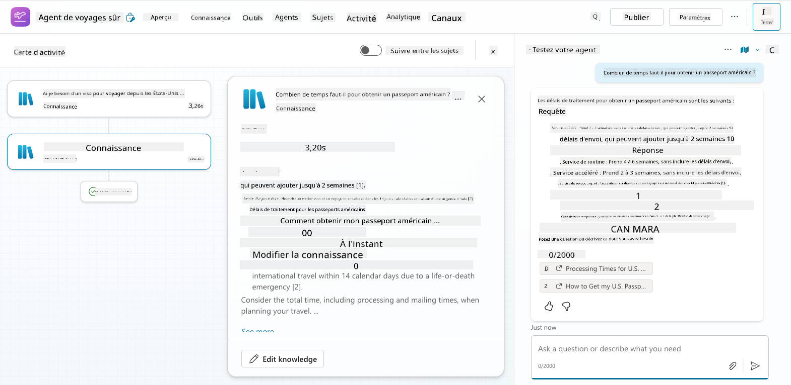

1. Lorsque vous êtes prêt, cliquez sur **Publier**

    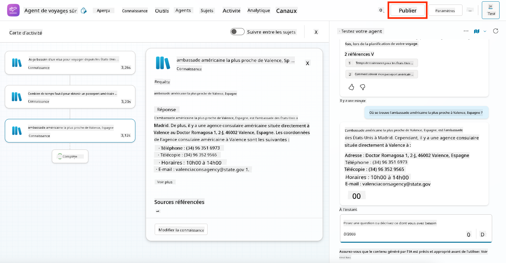

1. Sélectionnez **Publier** à nouveau dans la boîte de dialogue
    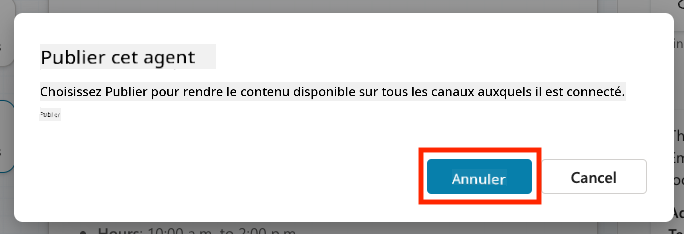

1. Facultativement, ajoutez l'agent à Microsoft Teams en utilisant la fonctionnalité intégrée **Canaux**.

!!! note "🧳 Objectif Bonus"
    Essayez de connecter l'agent Voyages Sécurisés à un site SharePoint ou un fichier FAQ pour le rendre plus pertinent par rapport aux politiques de voyage de votre entreprise.

## ✅ Mission accomplie

Vous avez maintenant réussi à :

- Déployer un agent préconstruit de Microsoft  
- Personnaliser l'agent  
- Tester et publier votre propre version du modèle d'agent **Voyages Sécurisés**

⏭️ [Passez à la leçon **Créer un agent personnalisé à partir de zéro**](../06-create-agent-from-conversation/README.md).

<!-- markdownlint-disable-next-line MD033 -->

---

**Avertissement** :  
Ce document a été traduit à l'aide du service de traduction automatique [Co-op Translator](https://github.com/Azure/co-op-translator). Bien que nous nous efforcions d'assurer l'exactitude, veuillez noter que les traductions automatisées peuvent contenir des erreurs ou des inexactitudes. Le document original dans sa langue d'origine doit être considéré comme la source faisant autorité. Pour des informations critiques, il est recommandé de recourir à une traduction professionnelle humaine. Nous ne sommes pas responsables des malentendus ou des interprétations erronées résultant de l'utilisation de cette traduction.