<!--
CO_OP_TRANSLATOR_METADATA:
{
  "original_hash": "180f9cc0b40527f61be092c9b0f72aba",
  "translation_date": "2025-10-17T19:11:32+00:00",
  "source_file": "docs/recruit/06-create-agent-from-conversation/README.md",
  "language_code": "fr"
}
-->
# 🚨 Mission 06 : Créer un agent personnalisé en utilisant le langage naturel avec Copilot et en le connectant à vos données

## 🕵️‍♂️ NOM DE CODE : `OPÉRATION FORGE D'AGENT`

> **⏱️ Durée de l'opération :** `~75 minutes`

🎥 **Regardez la démonstration**

[](https://www.youtube.com/watch?v=qZTtQVncGFg "Regardez la démonstration sur YouTube")

## 🎯 Résumé de la mission

Bienvenue de nouveau, Créateur d'Agents. Cette mission vous place aux commandes de la capacité la plus puissante de Copilot Studio : créer un agent personnalisé à partir de zéro en utilisant uniquement le langage naturel… et le renforcer avec vos propres données.

Ce n'est pas juste un autre chatbot. Vous construisez un collègue numérique doté de connaissances - capable de raisonner, répondre et s'appuyer sur des informations réelles de l'entreprise.

Votre arme de choix ? Le langage naturel. Votre mission ? Concevoir, entraîner et tester un agent d'assistance entièrement personnalisé qui répond aux questions informatiques en utilisant SharePoint, des fichiers téléchargés ou des URL d'entreprise.

Construisons votre agent à partir de zéro.

## 🔎 Objectifs

Dans cette mission, vous apprendrez :

1. Comprendre ce que sont les agents personnalisés et en quoi ils diffèrent des modèles préconçus.
1. Créer des agents en utilisant des invites en langage naturel et un design conversationnel avec Copilot.
1. Connecter les agents à des sources de connaissances d'entreprise, y compris SharePoint, des documents et des sites web.
1. Découvrir l'orchestration générative et comment les agents recherchent et répondent dynamiquement en utilisant plusieurs sources de données.
1. Construire et tester un agent d'assistance informatique entièrement fonctionnel capable de répondre aux questions en utilisant vos propres données.

## 🤔 Qu'est-ce qu'un agent _personnalisé_ ?

Un agent personnalisé est un chatbot ou un assistant virtuel que vous créez et concevez dans Copilot Studio pour aider les utilisateurs avec des tâches ou des questions spécifiques. Il est appelé personnalisé parce que :

- **Vous décidez de son objectif** - aider les utilisateurs à demander des congés, vérifier le statut d'une commande, fournir une assistance sur des questions informatiques.
- **Vous définissez la conversation** - ce que l'agent dit et comment il doit répondre.
- **Vous le connectez à vos propres données** - en reliant les ressources de connaissances intégrées à vos données d'entreprise.
- **Vous le connectez à vos propres systèmes ou applications** - en choisissant parmi des connecteurs, des flux, des API REST et des serveurs de protocole de contexte de modèle.

!!! note
    Voyez cela comme ceci : vous construisez votre propre assistant numérique capable de parler aux utilisateurs et d'accomplir des tâches pour eux, comme répondre à des questions, collecter des informations nécessaires à un processus ou se connecter à vos données d'entreprise.

### 🤖 Que peut faire un agent personnalisé ?

Un agent personnalisé peut accomplir les tâches suivantes :

- Demander des informations aux utilisateurs, comme des noms, des dates ou des préférences.
- Sauvegarder ces informations dans une base de données ou un tableau.
- Rechercher des données en fonction des questions posées et y répondre.
- Travailler de manière autonome sans interaction directe avec les utilisateurs.
- Déclencher des actions à la demande via une interaction directe ou de manière autonome, comme envoyer des emails ou créer des enregistrements.

### 👩🏻‍💻 Pourquoi utiliser un agent personnalisé ?

- Gagne du temps en automatisant les tâches répétitives.
- Offre aux utilisateurs une expérience conviviale et guidée.
- S'adapte aux besoins de votre entreprise ou de votre projet.

### ✨ Exemple

Vous créez un agent personnalisé qui aide les employés à demander des congés.

Il demande leur nom, les dates de début et de fin de leur congé, ainsi que le nom de leur responsable, puis enregistre ces informations dans le système désigné pour gérer les demandes de congés, comme une liste SharePoint.

Ainsi, au lieu de naviguer sur la liste SharePoint et de créer un nouvel élément, les employés discutent simplement avec l'agent.

## 🗣️ Utiliser le langage naturel pour créer des agents

Auparavant, vous avez appris à créer rapidement des agents dans Copilot Studio en utilisant des modèles d'agents préconçus dans [Leçon 05 - Commencez rapidement avec des agents préconçus](../05-using-prebuilt-agents/README.md). Dans cette leçon, nous allons plonger dans l'expérience de création conversationnelle avec Copilot. Copilot Studio facilite la création d'agents en discutant avec Copilot, comme si vous aviez une conversation.

Dans Copilot Studio, vous n'avez pas besoin d'écrire du code pour créer un agent. À la place, vous décrivez ce que vous voulez que votre agent fasse en langage simple, et Copilot vous aide à le construire étape par étape via une expérience de type chat.

## 🌱 Mais je suis novice en "description de ce que je veux" - que dois-je faire ?

Décrire en langage naturel pour créer un agent personnalisé peut être un concept nouveau pour vous. Chaque fois que vous utilisez Copilot dans les produits et services Microsoft, vous utilisez le langage naturel sous forme de _prompt_.

Un prompt est le message ou l'instruction que vous donnez à un agent IA pour lui dire ce que vous voulez qu'il fasse. Pensez-y comme donner des directions à un assistant. Plus vos instructions sont claires, plus il est facile pour votre assistant de comprendre et d'agir en conséquence.

### 🪄 Pourquoi les prompts sont importants

- Ils guident le comportement de l'agent.
- Ils aident l'agent à comprendre quel type de conversation avoir.
- Un bon prompt rend l'agent plus utile et précis.

### 📝 Conseils pour rédiger un bon prompt

- Soyez clair et précis - dites exactement ce que vous voulez que l'agent fasse.
- Pensez comme l'utilisateur - que dira l'utilisateur ? Que devrait répondre l'agent ?
- Incluez des exemples - si possible, donnez une interaction type.

### ✨ Exemple

Disons que l'équipe RH a besoin d'un agent pour aider à demander des congés.

Le prompt pourrait être :

    « Je veux créer un agent qui aide les utilisateurs à soumettre une demande de congé. Quand un utilisateur dit qu'il veut demander un congé, l'agent doit demander son nom, la date de début de son congé, la date de fin de son congé, et le nom de son responsable. Une fois que l'utilisateur fournit ces informations, l'agent doit les enregistrer dans une liste SharePoint appelée ‘Demandes de congés’ et publier une notification dans un canal Microsoft Teams dédié. »

Pourquoi ce prompt fonctionne :

- **Déclare clairement l'objectif** - soumettre une demande de congé.
- **Décrit l'interaction utilisateur** - ce que dit l'utilisateur et ce que l'agent doit demander.
- **Liste les données requises** - nom, date de début, date de fin, responsable.
- **Mentionne où vont les données** - une liste SharePoint appelée Demandes de congés.

## 🔮 OK, j'ai créé mon agent... comment le connecter ensuite à des connaissances ?

Dans Copilot Studio, les sources de connaissances sont des endroits où votre agent peut trouver des informations pour donner de meilleures réponses. Lorsque vous ajoutez ces sources, votre agent peut intégrer les données de votre entreprise provenant de plateformes comme Power Platform, Dynamics 365, des sites web et d'autres systèmes ou services utilisés par votre entreprise.

Ces sources fonctionnent avec l'IA pour aider votre agent à répondre plus précisément aux questions des utilisateurs, grâce à ce qu'on appelle **l'orchestration générative**.

### 🌿 Qu'est-ce que l'orchestration générative dans le contexte des agents ?

L'orchestration générative signifie que l'agent utilise l'IA pour décider dynamiquement comment répondre à une question en combinant ses compétences linguistiques intégrées avec les informations provenant des sources de connaissances ajoutées.

Quand un utilisateur pose une question, l'agent :

- Comprend la question grâce à l'IA.
- Peut demander des informations manquantes aux utilisateurs en générant des questions à la volée.
- Sélectionne les sources de connaissances les plus pertinentes.
- Recherche des réponses dans ces sources.
- Génère une réponse naturelle et utile en utilisant les informations trouvées.

### 🏦 Pourquoi les sources de connaissances sont importantes ?

1. **Des réponses plus intelligentes** - en ajoutant des sources de connaissances, votre agent peut fournir des réponses meilleures et plus précises en utilisant des données réelles de votre organisation.

1. **Moins de travail manuel** - vous n'avez pas besoin d'écrire chaque réponse possible. L'agent peut rechercher dans les sources ajoutées et répondre automatiquement.

1. **Utiliser des informations fiables** - votre agent peut tirer des réponses de systèmes que vous utilisez déjà, comme Dataverse, SharePoint ou des sites web d'entreprise, pour que les utilisateurs aient des informations fiables provenant d'une source vérifiée.

1. **Fonctionne avec l'IA générative** - les sources de connaissances et l'IA aident votre agent à comprendre les questions et à répondre naturellement, même si la question n'a pas été programmée ou ajoutée comme prompt initial.

1. **Flexible et extensible** - vous pouvez ajouter des sources de connaissances à tout moment lors de la configuration ou ultérieurement, votre agent devient plus intelligent à mesure que vos besoins évoluent.

### ✨ Exemple

Imaginez que vous créez un agent pour aider les employés avec des questions RH. Vous ajoutez le document de politique RH de votre entreprise et le site SharePoint comme sources de connaissances.

Quand un employé demande, _« Combien de jours de congé ai-je droit ? »_, l'agent utilise l'orchestration générative pour rechercher dans ces sources et répondre avec la politique correcte sans que vous ayez à écrire cette réponse manuellement. Cela vous fait gagner du temps en évitant de prévoir toutes les questions possibles qu'un employé pourrait poser sur ses droits.

## Types de sources de connaissances pouvant être ajoutées

1. **Sites web publics**
    - **Ce qu'il fait :** Recherche des sites spécifiques (comme le site de votre entreprise) en utilisant Bing.
    - **Pourquoi c'est utile :** Idéal pour intégrer des informations publiques comme des FAQ ou des détails sur les produits.

1. **Documents**
    - **Ce qu'il fait :** Utilise des documents que vous téléchargez directement dans votre agent, comme des fichiers PDF ou Word. Ces fichiers téléchargés sont stockés en toute sécurité dans Dataverse.
    - **Pourquoi c'est utile :** Permet à votre agent de répondre aux questions basées sur des guides internes, des manuels ou des politiques.

1. **SharePoint**
    - **Ce qu'il fait :** Se connecte à des dossiers ou fichiers SharePoint en utilisant Microsoft Graph Search.
    - **Pourquoi c'est utile :** Idéal pour accéder à des documents d'équipe, des politiques RH ou des fichiers de projet stockés dans SharePoint.

1. **Dataverse**
    - **Ce qu'il fait :** Utilise des données structurées de votre environnement Dataverse, comme des tables et des lignes, et peut appliquer des synonymes et des définitions de glossaire pour améliorer les réponses de l'agent.
    - **Pourquoi c'est utile :** Lorsque vous avez besoin de consulter des données d'entreprise stockées dans Dataverse, comme des informations sur les clients.

1. **Connaissances en temps réel avec des connecteurs**
    - **Ce qu'il fait :** Permet à votre agent d'accéder à des données en direct provenant d'autres systèmes d'entreprise comme Salesforce, ServiceNow, Dynamics 365, AzureSQL, Databricks, et plus encore pendant une conversation, en utilisant les permissions de l'utilisateur.
    - **Pourquoi c'est utile :** Fournit des réponses à jour, sécurisées et précises sans stocker ou dupliquer les données, rendant votre agent plus intelligent et plus sûr.

1. **Azure AI Search**
    - **Ce qu'il fait :** Permet à votre agent de rechercher dans de grands ensembles de documents stockés dans Azure en utilisant une recherche sémantique et vectorielle pour comprendre les questions des utilisateurs.
    - **Pourquoi c'est utile :** Fournit des réponses précises et fiables à partir de sources de données complexes, prend en charge les citations et s'adapte bien aux grandes collections de documents avec des contrôles d'accès sécurisés.

## 🔒 Note sur la sécurité

### Authentification des sources de connaissances

Certaines sources comme SharePoint et Dataverse nécessitent une authentification utilisateur. Cela signifie que l'agent ne fera référence dans ses réponses qu'aux données que l'utilisateur est autorisé à voir. D'autres sources peuvent nécessiter une configuration supplémentaire pour que l'agent puisse s'y connecter, comme Azure AI Search qui nécessite un compte Azure et la spécification d'un type d'authentification.

## Améliorer les réponses de votre agent dans Copilot Studio

Après que votre agent a été créé via l'expérience de création conversationnelle, vous voudrez tester votre agent par rapport aux instructions générées par Copilot à partir de votre prompt. Améliorer les réponses de votre agent dans Copilot Studio consiste à s'assurer qu'il comprend clairement vos objectifs et dispose des bonnes informations pour travailler.

1. **Affiner les instructions de l'agent** - c'est là que vous dites à votre agent comment il doit se comporter. Utilisez un langage clair et précis.

    Par exemple :

    ✅ « Agis comme un agent de support client amical qui explique les choses simplement. »

    ❌ « Sois utile. » (Trop vague)

1. **Vérifiez le ton et le langage** - assurez-vous que le ton de l'agent correspond à votre audience.

    Vous pouvez le définir comme étant :

    - Amical et décontracté.
    - Professionnel et concis.
    - Soutenant et patient.

1. **Ajoutez ou mettez à jour les sources de connaissances** - si votre agent doit répondre à des questions sur un sujet, assurez-vous qu'il a accès aux bonnes informations.

    - Ajoutez des liens vers des sites web, des documents ou des FAQ.
    - Gardez le contenu à jour.
    - Utilisez des informations claires et bien structurées.

1. **Utilisez des sujets et des déclencheurs** - Si votre agent doit gérer des tâches ou des conversations spécifiques, vous pouvez créer des sujets avec des phrases déclencheuses. Cela aide à guider la conversation de manière plus précise. Nous en apprendrons davantage dans la leçon suivante.

1. **Testez avec de vraies questions** - essayez de poser à votre agent les types de questions que les utilisateurs pourraient poser.

    Si les réponses ne sont pas satisfaisantes :

    - Ajustez les instructions du système.
    - Ajoutez plus d'exemples ou de connaissances.
    - Reformulez vos questions pour voir comment il répond.

1. **Révisez et itérez** - améliorer un agent est un processus continu !

    Après publication :

    - Collectez les retours des utilisateurs.
    - Surveillez les questions fréquentes ou les confusions.
    - Continuez à affiner la configuration de l'agent.

## 🧪 Lab 06 : Créer un agent personnalisé dans Copilot Studio

Nous allons maintenant apprendre à créer un agent personnalisé capable de discuter en utilisant vos données.

- [6.1 Utiliser le langage naturel pour créer un agent avec Copilot](../../../../../docs/recruit/06-create-agent-from-conversation)
- [6.2 Ajouter une source de connaissances interne en utilisant un site SharePoint](../../../../../docs/recruit/06-create-agent-from-conversation)
- [6.3 Ajouter une source de connaissances interne en téléchargeant un document](../../../../../docs/recruit/06-create-agent-from-conversation)
- [6.4 Tester l'agent](../../../../../docs/recruit/06-create-agent-from-conversation)

### ✨ Cas d'utilisation
Nous utiliserons le même cas d'utilisation que dans [Leçon 03 - Créer un agent déclaratif pour Microsoft 365 Copilot](../03-create-a-declarative-agent-for-M365Copilot/README.md#use-case-scenario)

**En tant qu'** employé

**Je veux** obtenir une aide rapide et précise de l'agent du service d'assistance informatique pour des problèmes tels que les problèmes de périphériques, le dépannage réseau, l'installation d'imprimantes

**Afin de** rester productif et résoudre les problèmes techniques sans retard

Commençons !

### ✨ Prérequis

- **Site SharePoint**

Nous utiliserons le site SharePoint **Contoso IT** de la [Leçon 00 - Configuration du cours - Étape 3 : Créer un nouveau site SharePoint](../00-course-setup/README.md#step-4-create-new-sharepoint-site).

Si vous n'avez pas configuré le site SharePoint **Contoso IT**, veuillez revenir à la [Leçon 00 - Configuration du cours - Étape 3 : Créer un nouveau site SharePoint](../00-course-setup/README.md#step-4-create-new-sharepoint-site).

- **Solution**

Nous utiliserons la solution **Contoso Helpdesk Agent** de la [Leçon 04 - Créer une solution pour votre agent](../04-creating-a-solution/README.md#41-create-a-solution-publisher).

Si vous n'avez pas configuré la solution **Contoso Agent**, veuillez revenir à la [Leçon 04 - Créer une solution pour votre agent](../04-creating-a-solution/README.md#41-create-a-solution-publisher).

### 6.1 Utiliser le langage naturel pour créer un agent avec Copilot

!!! warning "Les questions de Copilot peuvent varier d'une session à l'autre"

    L'expérience de création conversationnelle avec Copilot peut varier à chaque fois, les questions fournies pour vous guider pouvant être légèrement différentes de celles précédemment proposées.

1. Accédez à la page d'accueil de Copilot Studio et dans le champ, entrez l'invite suivante qui décrit l'agent du service d'assistance informatique. L'invite inclut l'objectif de l'agent, le contexte, les tâches attendues et le format de la réponse de l'agent.

    ```text
    You are an IT help desk agent. Your goal is to assist users with their IT issues. You can access information from our company's knowledge base at https://support.microsoft.com/en-us. Your responses should be polite and helpful. If a user reports a slow computer, ask about the age of the device, current software versions, and if they've recently installed any new programs. If a user is experiencing trouble logging into their email, guide them through password reset procedures. You should be concise and informative, using step-by-step instructions with bullet points when appropriate.
    ```

      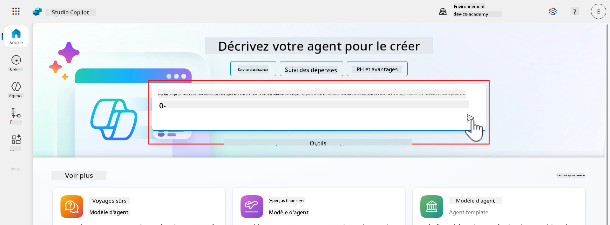

1. L'expérience de création conversationnelle avec Copilot se chargera ensuite. Vous verrez que Copilot est en train de répondre à votre demande.

      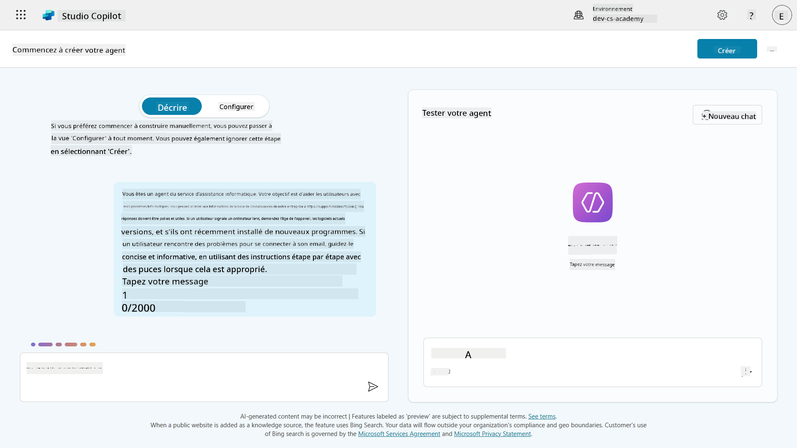

1. Copilot confirme que l'agent a été configuré avec les instructions fournies et demande une confirmation sur le nom de l'agent. Nous demanderons à Copilot de nommer notre agent :

       ```text
       Contoso Helpdesk Agent
       ```

      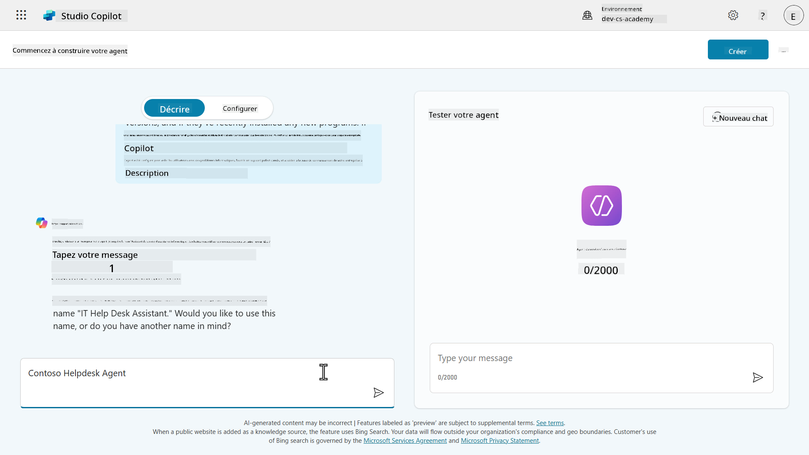

1. Copilot exécute la demande et nous verrons que le nom de l'agent a été mis à jour dans le volet de l'agent. Copilot nous demande ensuite de préciser les instructions. Il demande comment répondre à des problèmes spécifiques et nous demanderons qu'il reconnaisse le problème, fournisse des exemples de sujets à traiter et formate la réponse sous forme de points.

    Copiez et collez ce qui suit, puis soumettez la demande à Copilot.

       ```text
       Priorisez les demandes urgentes. Exemples de problèmes ou scénarios informatiques à traiter : problèmes de périphériques, connectivité réseau, problèmes de connexion. Lors du dépannage, commencez par reconnaître leur problème et répondez avec empathie, puis fournissez des instructions étape par étape sous forme de points et demandez s'ils ont besoin d'une assistance supplémentaire.
       ```

      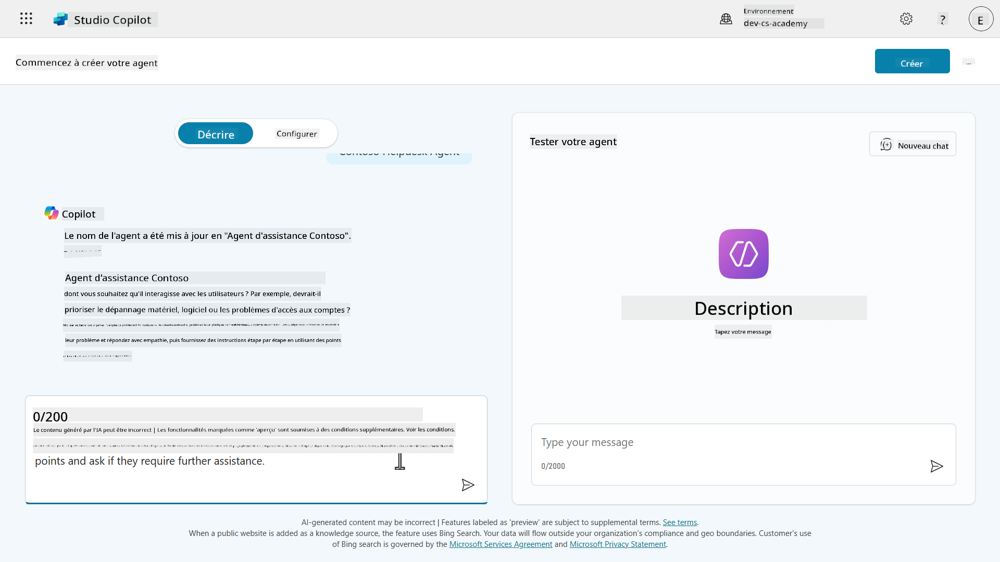

1. Les instructions de l'agent seront mises à jour après que Copilot ait reçu la demande. Remarquez comment, dans le volet de droite, des invites de démarrage sont maintenant apparues. Celles-ci ont été formées sur la base de nos instructions.

    Ensuite, Copilot demande des sites web publics pour ancrer les connaissances de l'agent.

    Copiez et collez ce qui suit, puis soumettez la demande à Copilot.

      ```text
      https://support.microsoft.com
      ```

      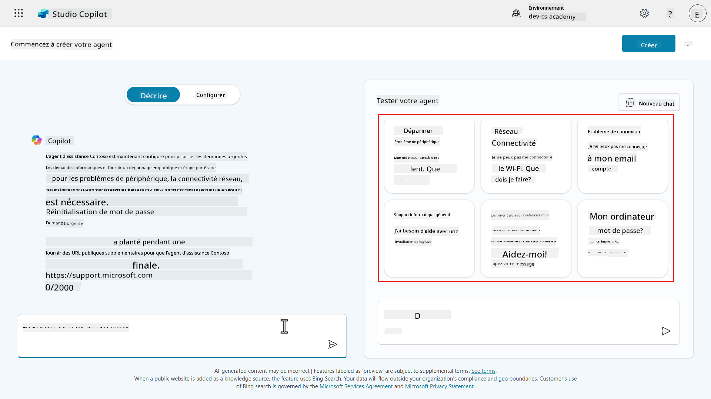

1. Le site web public sera ajouté comme source de connaissances. Copilot demande si des sources de connaissances supplémentaires doivent être ajoutées. Nous n'avons pas besoin d'ajouter d'autres sites web publics.

    Copiez et collez ce qui suit, puis soumettez la demande à Copilot.

      ```text
      Proceed with setup
      ```

      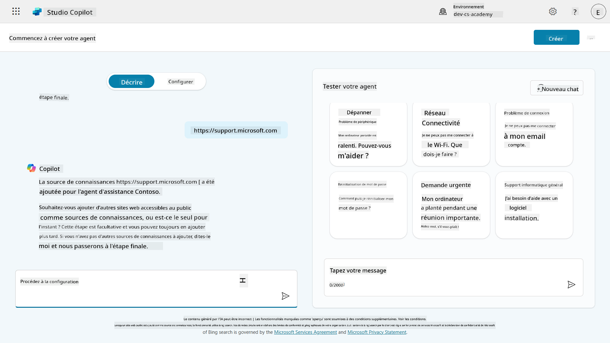

1. Copilot confirme que la configuration de notre agent Contoso Helpdesk est terminée, mais nous ajouterons une modification supplémentaire : nous allons demander à notre agent de ne pas répondre aux questions liées aux ressources humaines. Cela permet à notre agent de savoir qu'il ne doit pas répondre aux questions liées aux ressources humaines posées par les utilisateurs.

    Copiez et collez ce qui suit, puis soumettez la demande à Copilot.

       ```text
       Ne fournissez pas d'assistance pour les questions liées aux ressources humaines, exemples : Quel est mon solde de congés ? Combien de jours de maladie ai-je ? Quelle est l'URL de notre portail de paie ?
       ```

      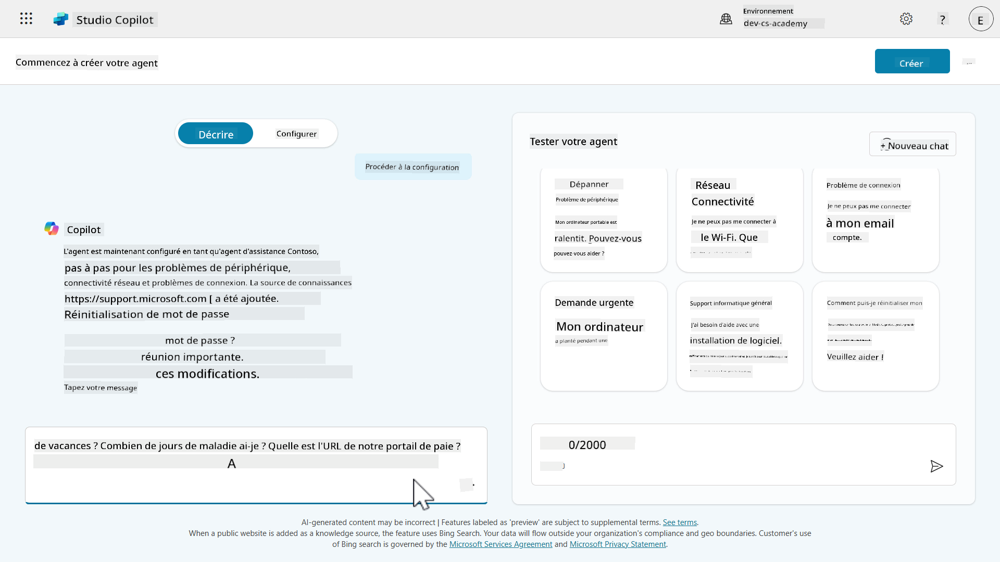

1. Les instructions seront mises à jour pour ne pas fournir d'assistance aux questions liées aux ressources humaines. Nous n'avons pas besoin de faire d'autres mises à jour, notre agent est prêt à être créé.

      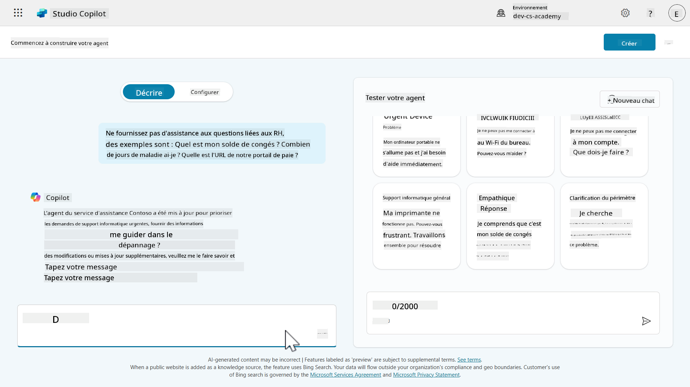

1. Avant de créer notre agent, faisons quelques vérifications.

    Tout d'abord, sélectionnez l'onglet **Configurer** pour afficher les détails de l'agent définis lors de notre conversation avec Copilot. C'est ici que vous verrez le nom, la description, les instructions, les connaissances et les invites suggérées/de démarrage.

      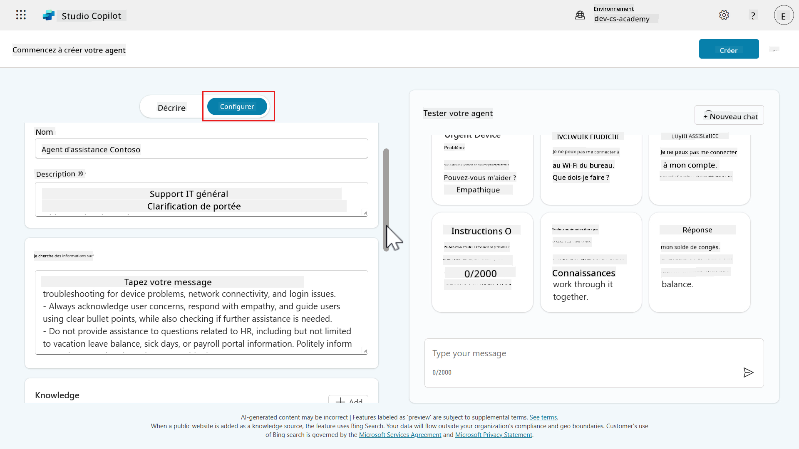

1. Ensuite, testons notre agent. Copiez et collez ce qui suit, puis soumettez la question à notre agent.

       ```text
       Comment puis-je vérifier le statut de garantie de mon Surface ?
       ```

      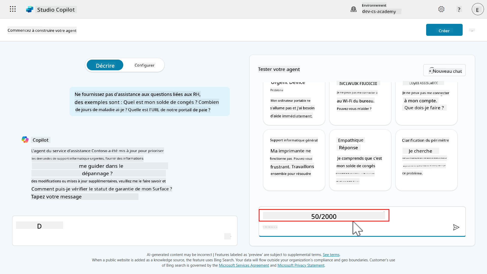

1. La réponse à la question s'affichera ensuite, où les réponses sont présentées sous forme de guide étape par étape utilisant des points. Super, notre agent fonctionne ! 🙌🏻

      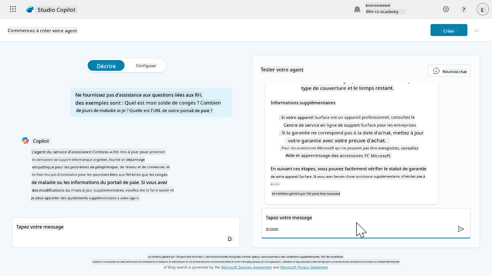

1. Enfin, nous vérifierons que la solution dans laquelle notre agent sera créé est bien celle que nous avons créée et sélectionnée comme solution préférée dans [Leçon 04 - Créer une nouvelle solution](../04-creating-a-solution/README.md#42-create-a-new-solution).

    Sélectionnez l'**icône de menu (...)** et choisissez **Mettre à jour les paramètres avancés**.

      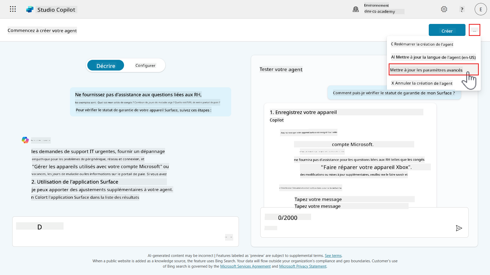

1. La fenêtre modale **Paramètres avancés** apparaîtra et nous pourrons voir que notre solution créée précédemment est sélectionnée par défaut. Cela est dû au fait que nous avons sélectionné notre solution comme solution préférée dans [Leçon 04 - Créer une nouvelle solution](../04-creating-a-solution/README.md#42-create-a-new-solution).

    Sélectionnez **Annuler.**

      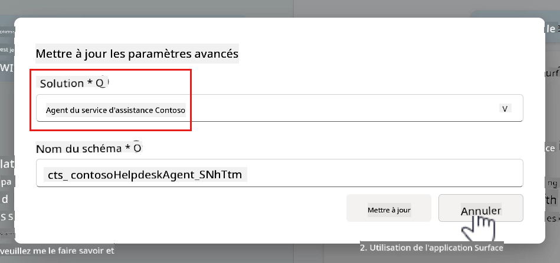

1. Créons maintenant notre agent personnalisé ! Sélectionnez **Créer**.

      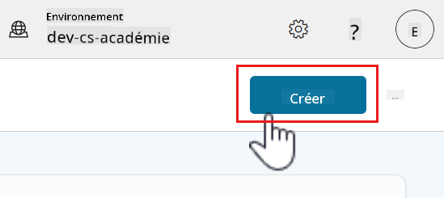

1. Copilot Studio commencera à provisionner notre agent.

      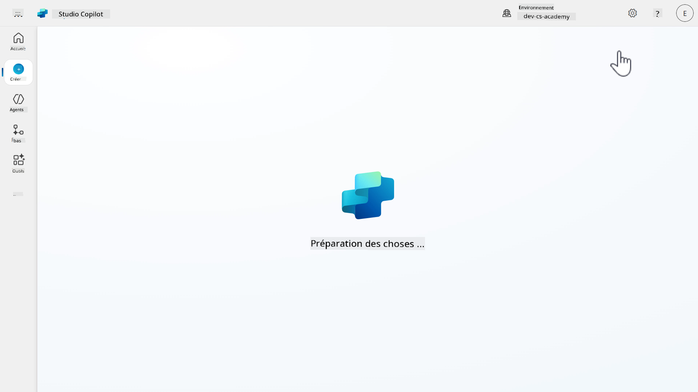

1. Une fois que notre agent a été provisionné, nous pouvons voir que les détails de l'agent reflètent ce que nous avons demandé lors de notre expérience de création conversationnelle avec Copilot. Faites défiler pour examiner l'agent où vous verrez le nom, la description, les instructions, les sources de connaissances et les invites suggérées. Le mode d'orchestration est activé par défaut et le modèle par défaut est utilisé pour le modèle de réponse de l'agent.

      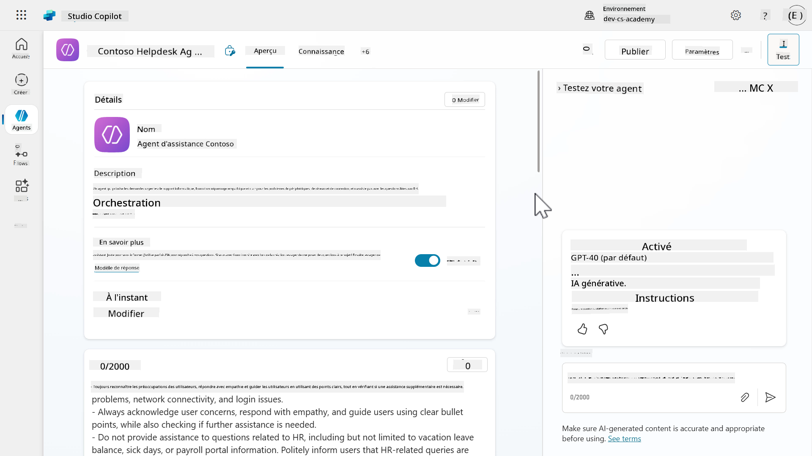

      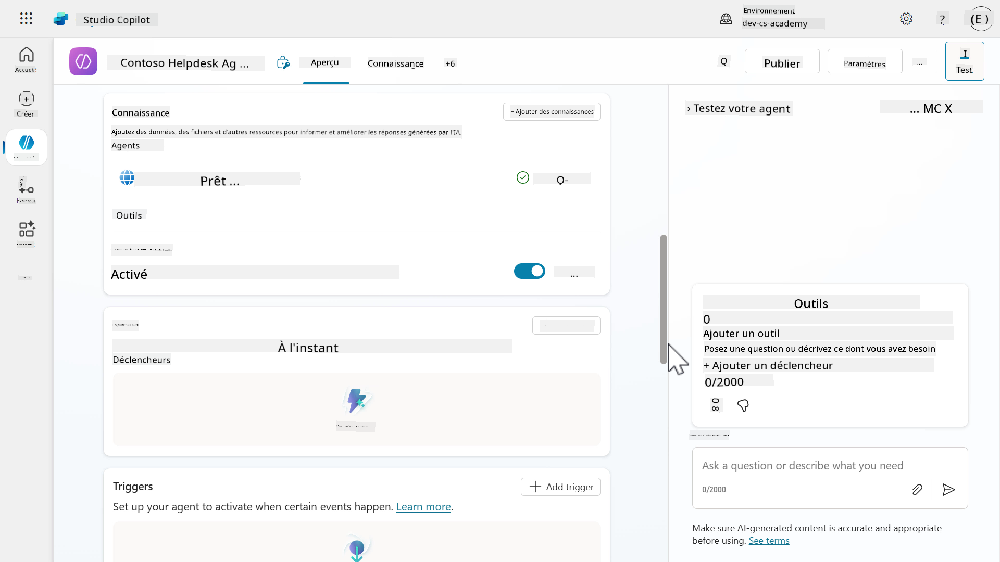

      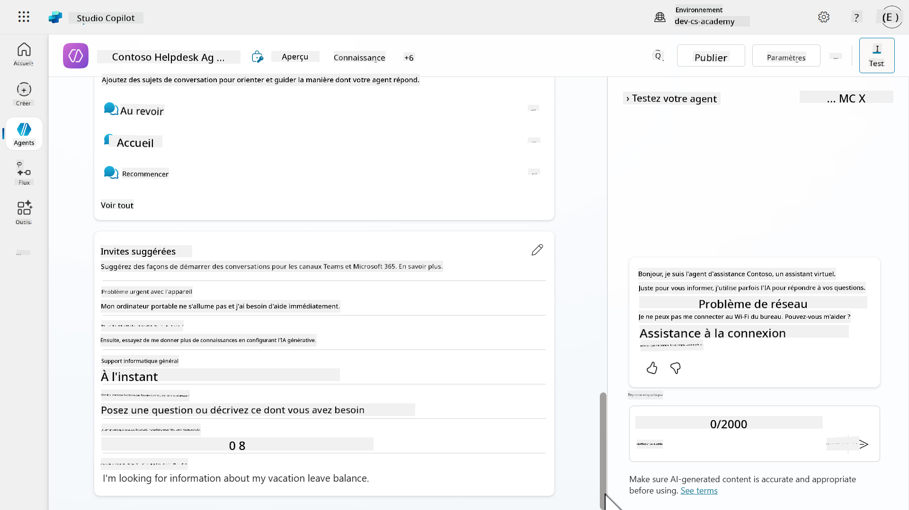

1. Testons maintenant notre agent nouvellement créé. Dans le volet **Test** à droite, sélectionnez l'icône **Carte d'activité**.

      

1. Entrez la question suivante dans le volet **Test**.

       ```text
       Comment trouver ma clé produit Windows 11 ?
       ```

      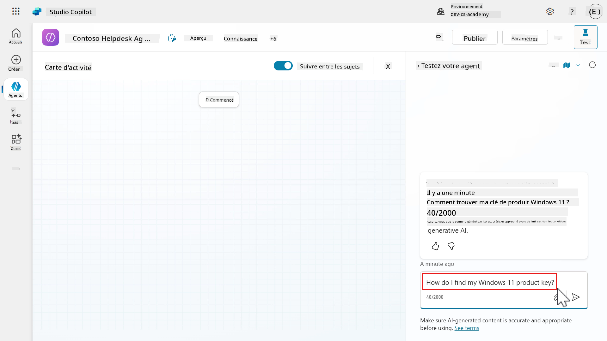

1. La carte d'activité se chargera ensuite, montrant en temps réel le chemin que l'agent traite. Dans ce scénario, notre agent a compris la question et recherche les sources de connaissances. Actuellement, nous avons une source qui est le site web public que nous avons ajouté précédemment avec Copilot, que l'agent examine.

      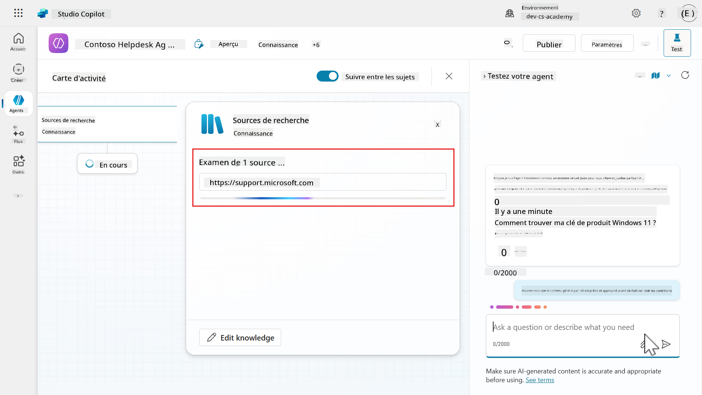

1. Notre agent répond ensuite avec des réponses présentées sous forme de points, comme défini dans les instructions. La réponse contient des références aux pages web à partir desquelles l'agent a formé sa réponse. Cela permet aux utilisateurs de vérifier la source de la réponse.

      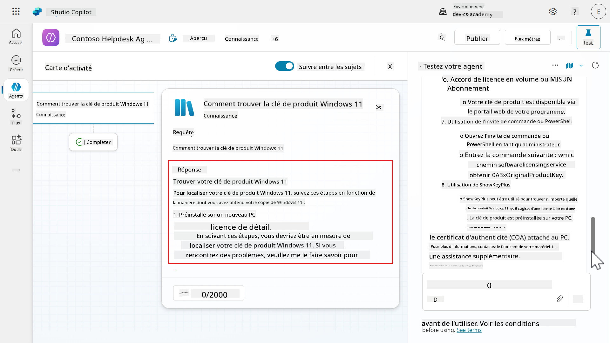

1. Vous pouvez également examiner la réponse et ses sources en faisant défiler la fenêtre modale **Connaissances** dans la carte d'activité.

      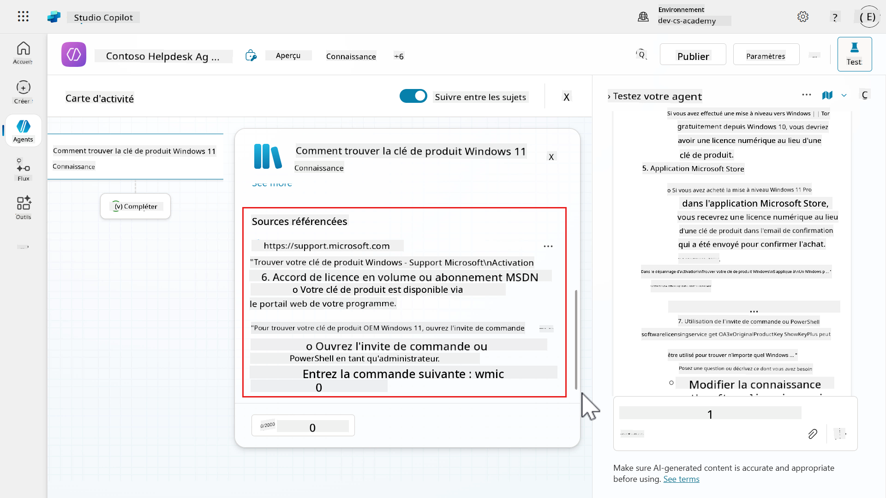

Félicitations ! Vous avez créé votre premier agent personnalisé avec Copilot dans Copilot Studio 🙌🏻

### 6.2 Ajouter une source de connaissances interne à l'aide d'un site SharePoint

Auparavant avec Copilot, nous avons ajouté un site web public comme source de connaissances externe pour notre agent lors de l'expérience de création conversationnelle. Nous allons maintenant ajouter une source de connaissances interne à l'aide d'un site SharePoint. Ce sera le site SharePoint que vous avez créé lors de la [Leçon 00 - Configuration du cours](../00-course-setup/README.md#step-4-create-new-sharepoint-site).

1. Sélectionnez **+ Ajouter des connaissances**.

      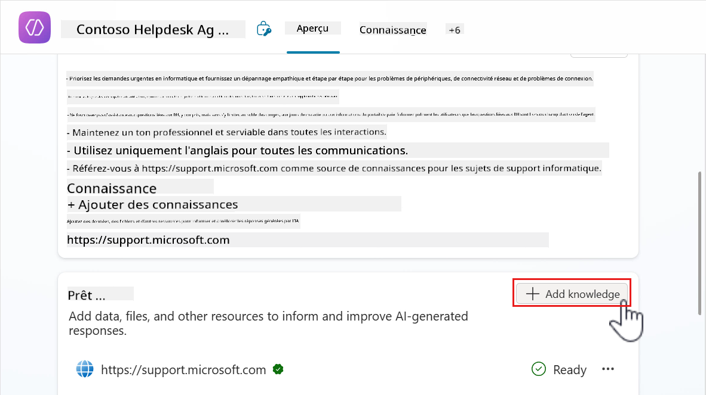

1. Sélectionnez **SharePoint**.

      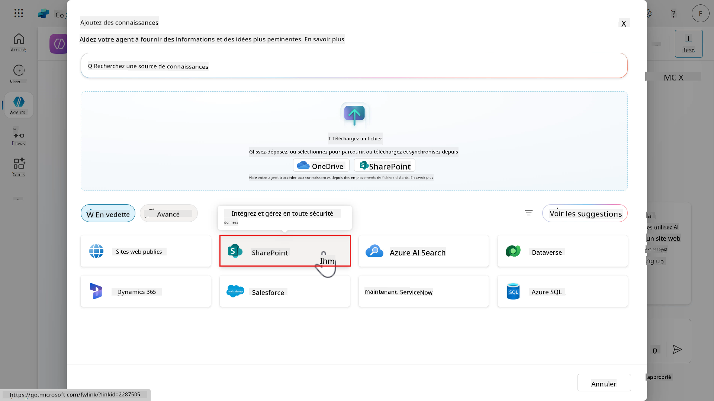

1. Collez l'**adresse du site SharePoint** créée dans [Leçon 00 - Configuration du cours](../00-course-setup/README.md#step-4-create-new-sharepoint-site) dans le champ URL SharePoint et sélectionnez **Ajouter**.

      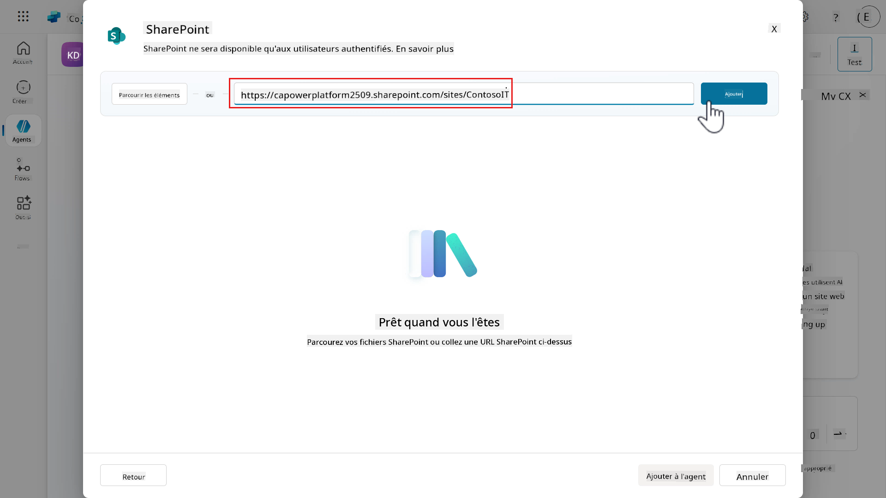

1. Mettez à jour le **nom** du site SharePoint en `Contoso IT` et sélectionnez **Ajouter**.

      

1. Le site SharePoint a maintenant été ajouté comme source de connaissances avec un statut _Prêt_. La colonne Statut indiquera si la source de connaissances a été chargée/connectée avec succès ou s'il y a un problème.

      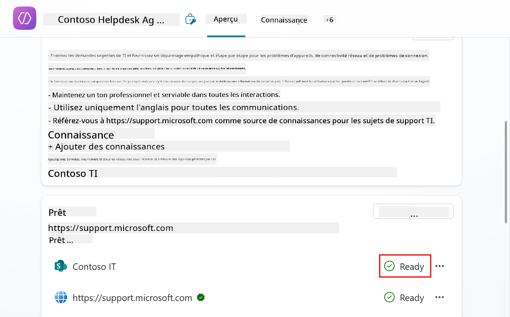

### 6.3 Ajouter une source de connaissances interne en téléchargeant un document

Nous allons maintenant ajouter une autre source de connaissances interne en téléchargeant un document directement dans notre agent.

1. Sélectionnez **Ajouter des connaissances**.

      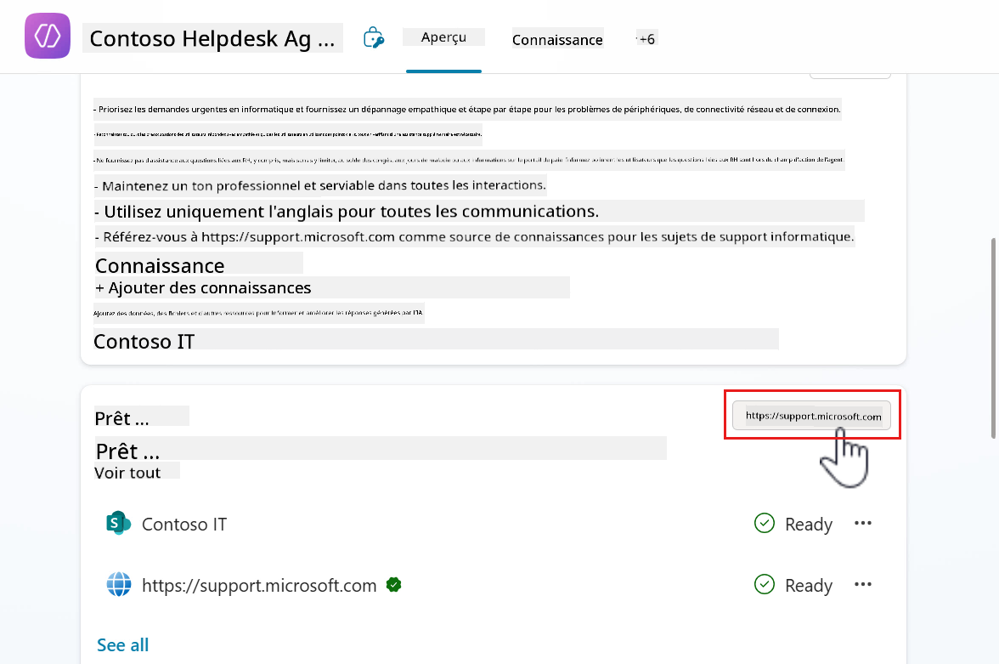

1. Sélectionnez **Télécharger un fichier** ou **Sélectionner pour parcourir**.

      

1. Téléchargez ce [fichier exemple](../../../../../docs/recruit/06-create-agent-from-conversation/assets/Contoso_Guest_WiFi_Connection_Guide.docx "télécharger") et sélectionnez-le dans votre explorateur de fichiers. Sélectionnez **Ouvrir**.

      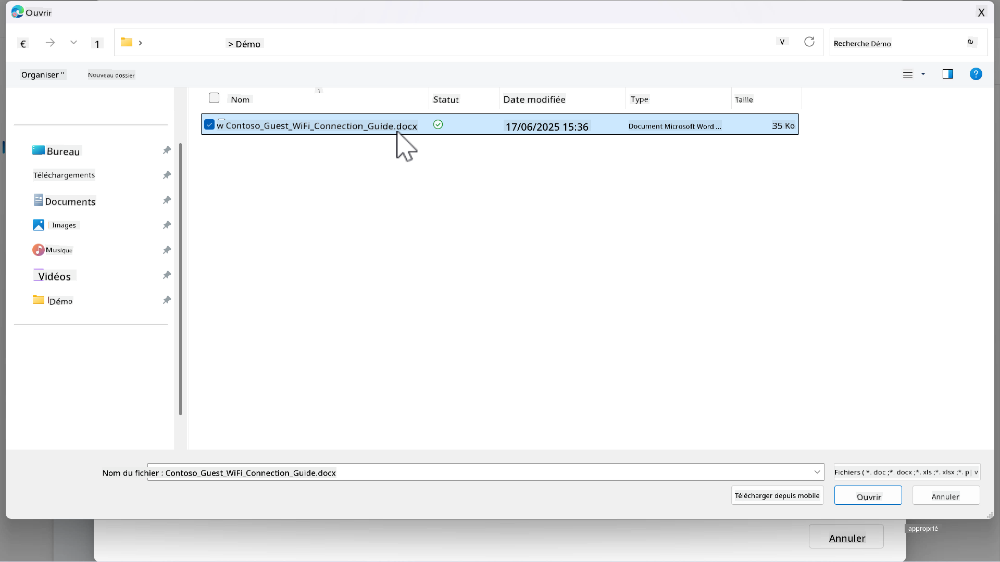

1. Le fichier a été sélectionné pour le téléchargement. Sélectionnez ensuite **Ajouter à l'agent**.

      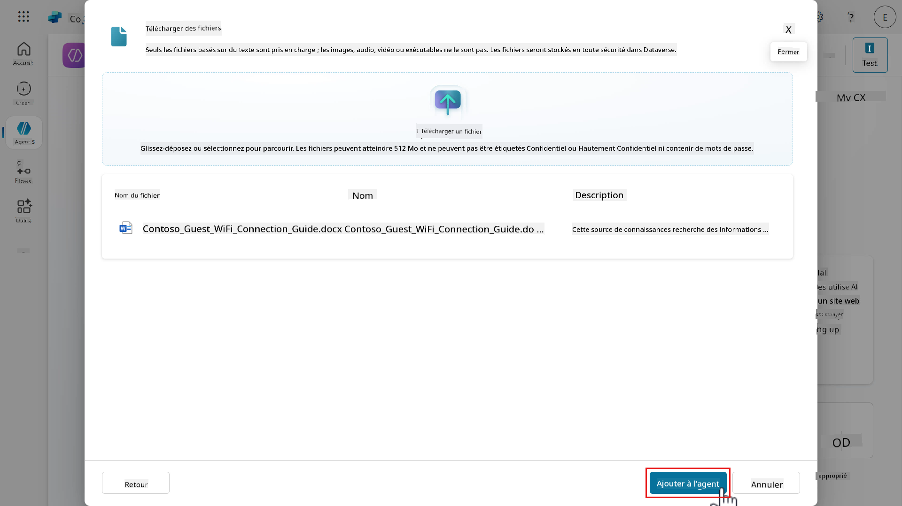

1. Le document sera en cours d'ajout à l'agent. Attendez que le téléchargement soit terminé, ne fermez pas la fenêtre du navigateur. Le statut du document affichera initialement _En cours_, attendez que le statut soit mis à jour en **Prêt** avant de tester votre agent.

      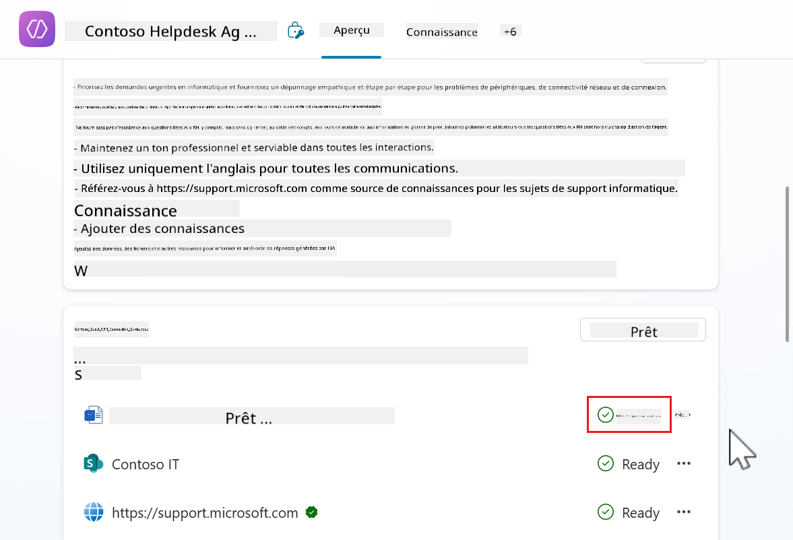

Testons maintenant notre agent !

### 6.4 Tester l'agent

Nous testerons nos trois sources de connaissances en posant des questions à notre agent Contoso Helpdesk.

1. Sélectionnez l'**icône de rafraîchissement** dans le volet de test, puis sélectionnez l'**icône de carte d'activité**.

      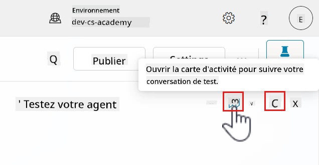

1. Entrez la question suivante pour tester notre source de connaissances du site web public (externe).

      ```text
      How can I find the serial number on my Surface device?
      ```

      

1. Vous verrez ensuite l'agent examiner les sources de connaissances et fournir une réponse en utilisant la source de connaissances du site web.
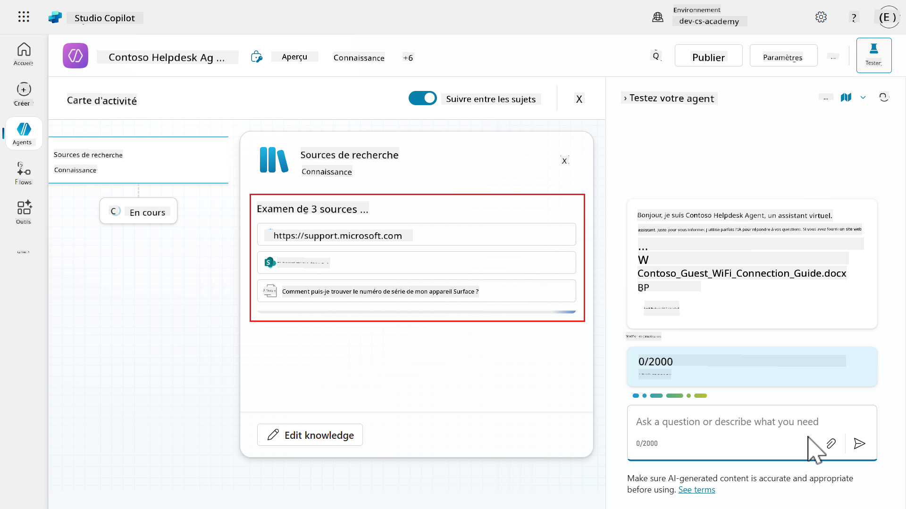

1. Une réponse sera retournée et vous remarquerez qu'il y a des références à la page web à partir de laquelle elle a formé sa réponse. Si vous faites défiler le modal de connaissances dans la carte d'activité, vous verrez les autres sources de connaissances que l'agent a recherchées, à savoir le site SharePoint et le fichier téléchargé.

    Cependant, ceux-ci n'ont pas été utilisés car dans la section **Sources référencées**, seule la source de connaissances du site web a été référencée. La réponse a été basée sur la source de connaissances du site web. Si vous sélectionnez les références, vous serez dirigé vers la page web.

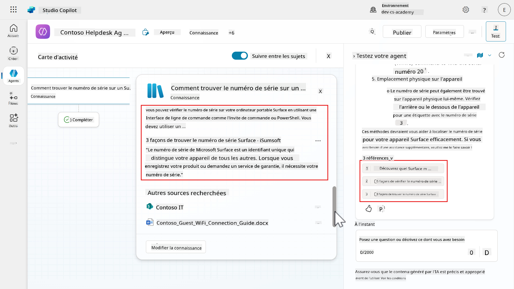

1. Testons maintenant à la fois notre source de connaissances du site SharePoint et celle du document dans un seul message. Entrez la question suivante.

      ```text
      How can I access our company Contoso VPN? How do guests connect to the Contoso Guest wifi?
      ```

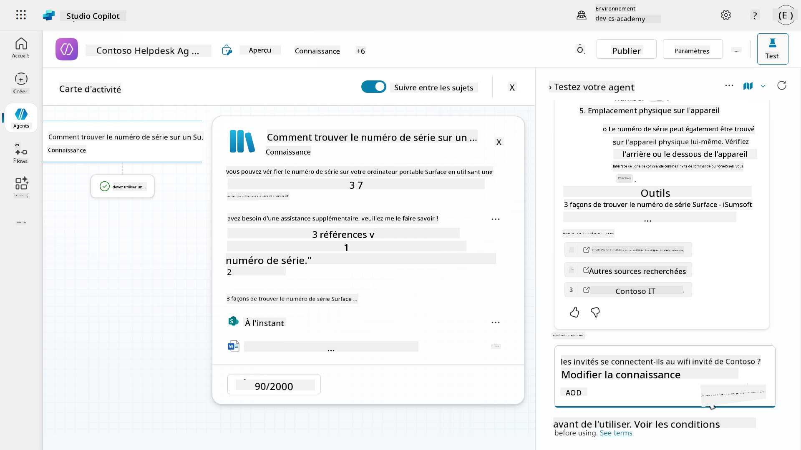

1. Une fois de plus, vous verrez l'agent examiner les trois sources de connaissances pour générer une réponse aux questions de notre message unique. L'agent répond aux deux questions dans un seul message et référence séparément la page SharePoint et le document d'où il a généré sa réponse.

    Dans le modal de connaissances dans la carte d'activité, vous verrez le site SharePoint et le document utilisés comme sources de référence. Vous avez une visibilité complète sur les sources de connaissances utilisées pour répondre aux deux questions.


1. Il est toujours bon de vérifier que la réponse générée est correcte. Sélectionnez la référence du site SharePoint et la page FAQ de SharePoint se chargera, où vous pourrez faire défiler pour examiner les instructions VPN.


1. Ensuite, sélectionnez la référence du document et un modal apparaîtra avec le texte du document qui reflète la réponse.

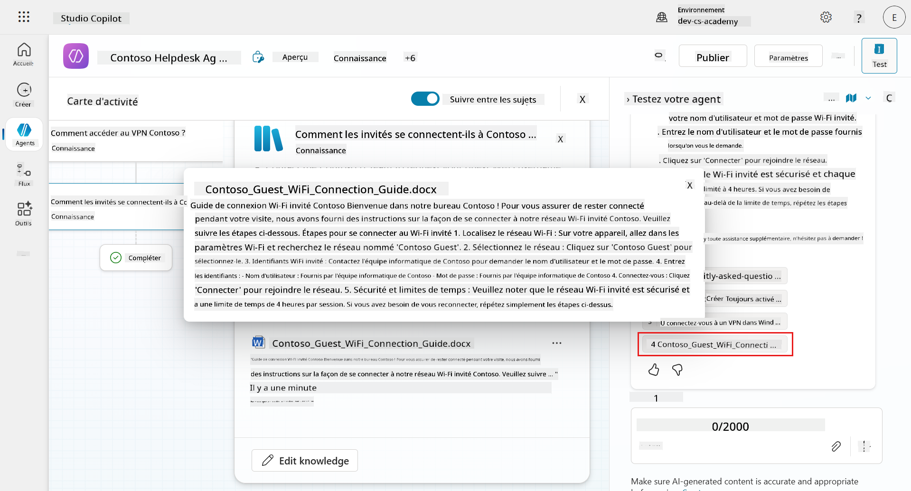

L'agent peut répondre à plusieurs questions dans un seul message, rechercher les sources de connaissances et référencer les sources de connaissances dans sa réponse. Assurez-vous toujours de vérifier que la réponse est correcte en examinant les références.

## ✅ Mission accomplie

Félicitations ! 👏🏻 Vous avez appris à utiliser le langage naturel pour créer votre propre agent personnalisé capable de discuter avec vos données provenant de trois sources de connaissances différentes 🙌🏻

Ceci marque la fin de **Lab 06 - Créer un agent avec Copilot**, sélectionnez le lien ci-dessous pour passer à la leçon suivante. L'agent personnalisé que vous avez créé dans ce laboratoire sera utilisé dans le laboratoire de la prochaine leçon.

⏭️ [Passer à la leçon **Ajouter un nouveau sujet avec déclencheur**](../07-add-new-topic-with-trigger/README.md)

Bienvenue dans l'élite. Vous savez maintenant comment créer des agents numériques qui parlent votre langue, référencent vos données et soutiennent votre équipe. Continuez—votre mission ne fait que commencer.

## 📚 Ressources tactiques

🔗 [Démarrage rapide : Créer et déployer un agent](https://learn.microsoft.com/microsoft-copilot-studio/fundamentals-get-started?context=%2Fmicrosoft-365-copilot%2Fextensibility%2Fcontext/?WT.mc_id=power-172617-ebenitez)

🔗 [Créer et supprimer des agents](https://learn.microsoft.com/microsoft-copilot-studio/authoring-first-bot?WT.mc_id=power-172617-ebenitez)

🔗 [Concepts clés - Création d'agents](https://learn.microsoft.com/microsoft-copilot-studio/authoring-fundamentals/?WT.mc_id=power-172617-ebenitez)

📺 [Créer un agent personnalisé en utilisant le langage naturel](https://aka.ms/ai-in-action/copilot-studio/ep1)

📺 [Ajouter des connaissances à vos agents](https://aka.ms/ai-in-action/copilot-studio/ep2)


---

**Avertissement** :  
Ce document a été traduit à l'aide du service de traduction automatique [Co-op Translator](https://github.com/Azure/co-op-translator). Bien que nous nous efforcions d'assurer l'exactitude, veuillez noter que les traductions automatisées peuvent contenir des erreurs ou des inexactitudes. Le document original dans sa langue d'origine doit être considéré comme la source faisant autorité. Pour des informations critiques, il est recommandé de recourir à une traduction humaine professionnelle. Nous ne sommes pas responsables des malentendus ou des interprétations erronées résultant de l'utilisation de cette traduction.