<!--
CO_OP_TRANSLATOR_METADATA:
{
  "original_hash": "cc4afa4a5a11c9d03896decfbcbd4060",
  "translation_date": "2025-10-17T19:01:54+00:00",
  "source_file": "docs/recruit/09-add-an-agent-flow/README.md",
  "language_code": "fr"
}
-->
# 🚨 Mission 09 : Ajouter un flux d'agent à votre sujet pour l'automatisation

## 🕵️‍♂️ NOM DE CODE : `OPÉRATION PUISSANCE AUTOMATISATION`

> **⏱️ Durée de l'opération :** `~30 minutes`  

🎥 **Regardez la démonstration**

[](https://www.youtube.com/watch?v=vtLZJT3eBXg "Regardez la démonstration sur YouTube")

## 🎯 Résumé de la mission

Votre agent peut désormais converser avec les utilisateurs et fournir des informations, mais pour atteindre une véritable excellence opérationnelle, il doit être capable d'agir. Cette mission transformera votre agent conversationnel en une machine d'automatisation en lui ajoutant des flux d'agent.

À la fin de cette mission, vous aurez créé une automatisation complète de demande d'appareil qui capture les données utilisateur via une carte adaptative, récupère des informations depuis SharePoint, envoie des notifications aux managers par email et fournit un retour d'information fluide aux utilisateurs - le tout orchestré par votre agent grâce à une automatisation intelligente des flux de travail.

## 🔎 Objectifs

Dans cette mission, vous apprendrez :

1. Comprendre ce que sont les flux d'agent et en quoi ils diffèrent des flux cloud Power Automate pour l'automatisation.
1. Découvrir les fonctionnalités clés qui rendent les flux d'agent puissants, notamment les actions IA et la rédaction en langage naturel.
1. Explorer le concepteur de flux d'agent et apprendre à utiliser des expressions pour gérer des données dynamiques.
1. Créer une automatisation complète de demande d'appareil qui intègre des données SharePoint et des notifications par email.

## 🤔 Qu'est-ce qu'un flux d'agent ?

Les flux d'agent sont un moyen puissant d'automatiser des tâches répétitives et d'intégrer vos applications et services. Pensez-y comme des workflows structurés, étape par étape, que votre agent peut exécuter pour automatiser des tâches ou se connecter à d'autres applications et services. Ce sont comme des mini-workflows qui aident votre agent à effectuer des actions telles que l'envoi de notifications, la mise à jour de dossiers ou la réponse à des événements.

Contrairement aux agents autonomes qui utilisent l'IA pour prendre des décisions à la volée, les flux d'agent sont des **workflows déterministes** - ce qui signifie qu'ils suivent toujours le même chemin, garantissant des résultats cohérents et fiables.

En termes simples :

- Ils aident votre agent à _agir_, pas seulement à _parler_ aux utilisateurs.
- Ils sont réutilisables dans différents sujets et agents, et peuvent être déclenchés par des messages utilisateur, des événements ou d'autres applications et services.

## 🙋🏽 Oui, mais en quoi est-ce différent des flux cloud Power Automate ?

Les flux d'agent et les flux cloud Power Automate permettent tous deux d'automatiser des tâches. Ils sont conçus pour des objectifs différents et fonctionnent de manière distincte.

### 🤖 Flux d'agent dans Copilot Studio

**À quoi ils servent :**

- Conçus pour les agents conversationnels et autonomes (via des instructions d'agent) dans Copilot Studio.
- Axés sur une automatisation intelligente, pilotée par l'IA, qui interagit avec les systèmes d'entreprise.

**Pourquoi ils sont utiles :**

- Faciles à créer et gérer directement dans Copilot Studio.
- Idéaux pour automatiser des tâches qui se produisent _pendant la conversation_ avec les utilisateurs, comme soumettre une demande de congé.
- Pas besoin de licence Power Automate séparée, la facturation est basée sur l'utilisation dans Copilot Studio. Cela peut économiser du temps et des coûts pour les équipes d'entreprise.

**Limitations :**

- Vous ne pouvez pas les partager, les copier ou leur attribuer des co-propriétaires.
- Les flux d'agent sont uniquement visibles et utilisables dans Copilot Studio.
- Actuellement, les déclencheurs d'événements pour les agents peuvent être modifiés dans le portail de création Power Automate.

### ☁️ Flux cloud Power Automate

**À quoi ils servent :**

- Conçus pour une automatisation générale entre de nombreuses applications et services.
- Peuvent fonctionner de manière indépendante ou en complément des flux d'agent.

**Pourquoi ils sont utiles :**

- Proposent une large gamme de connecteurs.
- Idéaux pour automatiser des processus en dehors des agents.
- Peuvent être partagés, réutilisés et gérés entre équipes.

**Exigences :**

- Vous avez besoin d'une licence Power Automate pour les utiliser.

### 📗 Résumé

| Utilisez ceci | Lorsque vous voulez |
| :- | :- |
| Flux d'agent | Automatiser des tâches à l'intérieur d'un agent, utiliser l'IA et tout garder dans Copilot Studio |  
| Flux cloud Power Automate | Automatiser entre applications et services, ou créer des workflows en dehors des agents |

## 👍🏻 Pourquoi utiliser les flux d'agent

Les flux d'agent suivent toujours un chemin fixe - ils font la même chose à chaque fois avec les mêmes données d'entrée.

Cela les rend :

- **Fiables** - vous pouvez être sûr qu'ils se comporteront de la même manière à chaque fois.
- **Prévisibles** - vous savez quel résultat attendre lorsque le flux s'exécute.
- **Basés sur des règles** - ils suivent les étapes que vous définissez.

Autres avantages :

- **Automatisation** - permet à votre agent de gérer des tâches répétitives comme soumettre des formulaires ou envoyer des notifications.
- **Connectés** - connectez-vous à plus de 1400 connecteurs comme ServiceNow, SharePoint, Salesforce. Sinon, vous pouvez créer votre propre connecteur personnalisé.
- **Étroitement intégrés** - les flux d'agent font partie de la logique de l'agent, ils sont déclenchés directement par des messages utilisateur ou des actions dans la conversation.
- **Évolutifs** - réutilisez les flux entre plusieurs agents ou scénarios.
- **Sans code ou avec peu de code** - vous pouvez créer des flux en utilisant un langage naturel ou un concepteur visuel.
- **Plateforme tout-en-un** - vous pouvez concevoir, tester et déployer des flux d'agent en un seul endroit - Copilot Studio. Pas besoin de passer d'une plateforme à une autre.

## 🏄🏻‍♂️ Comment les flux d'agent améliorent-ils votre agent ?

Les flux d'agent étendent les capacités de votre agent au-delà de la simple "discussion" avec les utilisateurs. Ils lui permettent d'agir et d'interagir avec les systèmes.

Imaginons que vous travaillez dans un service financier et que vous recevez de nombreuses factures de fournisseurs. Normalement, quelqu'un doit lire chaque facture, extraire les informations importantes - le montant, la date, l'expéditeur - et vérifier si tout correspond à vos dossiers. Ensuite, il faut l'envoyer à la bonne personne pour approbation. Cela prend du temps et demande des efforts.

Avec les flux d'agent dans Copilot Studio, vous pouvez automatiser ce processus. Dès que la facture arrive, l'agent :

1. Lit le document en utilisant le traitement intelligent des documents pour trouver les informations clés.
1. Vérifie les détails par rapport aux données de votre entreprise pour s'assurer que tout est correct.
1. L'envoie pour approbation à la bonne personne.

Cela permet de gagner du temps, de réduire les erreurs et de rendre le processus beaucoup plus fluide.

### Pensez-y de cette façon

- **Agents** : les décideurs intelligents
- **Flux d'agent** : les exécutants fiables

### Pourquoi c'est important

- Vous obtenez le meilleur des deux mondes : une automatisation fiable et une IA flexible.
- Il est facile de créer et de mettre à jour les flux au fur et à mesure que les besoins de votre entreprise évoluent.
- Vous pouvez étendre l'automatisation à plusieurs équipes.

## 🔌 Fonctionnalités clés qui rendent les flux d'agent puissants

1. **Rédaction en langage naturel**
    - Vous pouvez décrire ce que vous voulez que le flux fasse en langage simple.
    - Copilot comprend votre intention et construit le flux pour vous.
    - Pas besoin d'écrire du code - expliquez simplement votre idée.

1. **Actions IA**

    Utilisez l'IA pour :

    - Lire et comprendre des documents ou des images.
    - Résumer un contenu long en réponses courtes et utiles.
    - Faire des recommandations ou des décisions intelligentes.

1. **Actions génératives**
    - Permettent au flux de s'adapter en temps réel.
    - L'agent peut planifier et ajuster les étapes en fonction des informations changeantes.

1. **Actions d'intégration**
    - Connectez votre flux à d'autres outils comme Outlook, Microsoft Teams, ServiceNow, SharePoint et autres applications et services, via plus de 1400 connecteurs intégrés ou votre propre connecteur personnalisé.
    - Cela aide votre agent à travailler avec les applications que votre équipe utilise déjà.

1. **Intervention humaine**
    - Ajoutez des étapes d'approbation où une personne doit examiner ou confirmer quelque chose.
    - [Approvals avancés](https://learn.microsoft.com/microsoft-copilot-studio/flows-advanced-approvals?WT.mc_id=power-172621-ebenitez) prend en charge les rappels, la délégation et les approbations en plusieurs étapes.

## ⚙️ Comment fonctionnent-ils ?

1. **Déclencheur**

    Un événement démarre le flux - comme un utilisateur posant une question, invoquant le flux depuis un sujet, une heure programmée ou un événement se produisant dans un autre système.

1. **Actions**

    Ce sont les étapes que l'agent suit ensuite - envoyer un email, appeler une API, mettre à jour un ticket dans ServiceNow.

## 🧶 Comment créer un flux d'agent

1. **Langage naturel** : décrivez ce que vous voulez que l'agent fasse, et Copilot le construit pour vous.
1. **Canvas du concepteur** : glissez-déposez des actions, des conditions et des boucles dans le concepteur de flux d'agent pour créer votre flux.

## 🎨 Qu'est-ce que le concepteur de flux d'agent ?

C'est un outil visuel dans Copilot Studio qui vous aide à créer, éditer et gérer des flux d'agent qui fournissent des instructions étape par étape que votre agent suit pour accomplir des tâches. Il est conçu pour être simple à utiliser, même si vous débutez avec les flux d'agent.

### Fonctionnalités clés du concepteur de flux d'agent

1. **Canvas visuel**
    - Vous pouvez voir tout votre flux présenté comme un diagramme.
    - Zoomez facilement, ajustez la vue ou utilisez une mini-carte pour naviguer dans de grands flux.

1. **Ajouter et supprimer des actions**
    - Cliquez sur le bouton _plus (+)_ pour ajouter une nouvelle action comme envoyer un message ou mettre à jour un élément dans une liste SharePoint.
    - Vous pouvez rechercher des actions parmi les connecteurs et les configurer via leurs paramètres.
    - Pour supprimer une action, cliquez sur les _trois points (⋮)_ et sélectionnez _Supprimer_.

1. **Vérifier les paramètres**
    - Cliquez sur une action pour voir ou modifier ses paramètres.
    - Vous pouvez entrer des valeurs manuellement ou utiliser des _expressions_ pour les rendre dynamiques.

1. **Historique des versions**
    - Chaque fois que vous enregistrez votre flux, une version est enregistrée.
    - Vous pouvez revenir en arrière et consulter ou restaurer une version précédente si nécessaire.

1. **Vérification des erreurs**
    - Le _Vérificateur de flux_ met en évidence les erreurs.
    - Toutes les erreurs doivent être résolues avant de publier votre flux.

1. **Publication et test**
    - Une fois votre flux sans erreur, publiez-le pour le rendre actif.
    - Utilisez la fonction _Test_ pour exécuter votre flux manuellement ou automatiquement, et vérifier s'il fonctionne comme prévu.

### Pourquoi utiliser le concepteur de flux d'agent ?

- **Visuel et intuitif** - vous pouvez créer des flux en glissant et en cliquant.
- **Sécurisé pour expérimenter** - l'historique des versions vous permet d'annuler des modifications.
- **Tests intégrés** - vous aide à vous assurer que tout fonctionne avant de le mettre en ligne.

## 🔤 Vous avez mentionné _expressions_ - qu'est-ce que c'est ?

Les expressions sont de petites formules ou commandes qui aident votre flux d'agent à travailler avec des données. Vous les utilisez pour calculer des valeurs, formater du texte, prendre des décisions ou extraire des informations spécifiques des entrées.

### Pourquoi utiliser des expressions ?

Les expressions vous permettent de :

- **Personnaliser la gestion des données** - combiner des noms, formater des dates.
- **Prendre des décisions** - si une valeur est supérieure à 10, faire quelque chose.
- **Transformer des données** - changer du texte en minuscules, extraire une partie d'une chaîne.
- **Automatiser la logique** - sans écrire de code complet.

### À quoi ressemblent les expressions ?

Les expressions utilisent des fonctions. Je vais emprunter une explication de ce que sont les fonctions à l'ancien MVP Microsoft, Jerry Weinstock.

!!! citation
    Les fonctions sont une logique intégrée pour transformer vos données, soit par des opérations simples, soit par des opérations complexes dans votre expression.

Les fonctions vous permettent de créer des expressions sans avoir besoin d'écrire du code.

La façon dont je les décris, c'est qu'une fonction dans les flux d'agent est similaire aux fonctions Excel. Vous pouvez effectuer une opération sur des données pour les transformer en un résultat souhaité. Lorsque vous construisez votre formule dans Excel, vous sélectionnez votre valeur d'entrée à partir des cellules d'un tableau ou d'une plage, puis appliquez des fonctions pour manipuler la sortie des données. Un exemple est l'utilisation de la fonction `COUNT` pour calculer le nombre de cellules contenant des chiffres dans une plage.

Dans les flux d'agent, au lieu de référencer des données à partir de cellules dans un tableau, vous référencez les sorties de données du déclencheur ou des actions lors de la création de vos expressions. Pour continuer avec l'exemple précédent, utilisez la fonction `length` pour récupérer le nombre d'éléments retournés par l'action du connecteur _Obtenir des éléments_ de SharePoint.

### Pourquoi les fonctions sont-elles importantes ?

L'utilisation des fonctions rend vos flux d'agent :

- **Plus intelligents** - ils peuvent réagir à différents entrées ou conditions.
- **Flexibles** - vous pouvez personnaliser la gestion des données.
- **Efficaces** - vous évitez les étapes manuelles en automatisant la logique.

### Fonctions les plus utiles

Voici quelques fonctions courantes utilisées dans les flux d'agent. Pour la liste complète des fonctions, consultez le [guide de référence](https://learn.microsoft.com/azure/logic-apps/workflow-definition-language-functions-reference?WT.mc_id=power-172621-ebenitez).

#### 🔡 Texte

- `concat()` - Joint deux ou plusieurs morceaux de texte.
      - Exemple : `concat('Bonjour ', firstName)` → “Bonjour Jean”

- `toLower()` / `toUpper()` - Change le texte en minuscules ou majuscules.
      - Utile pour standardiser les entrées.

- `substring()` - Extrait une partie d'une chaîne.
      - Exemple : Obtenir les 3 premières lettres d'un nom.

- `trim()` - Supprime les espaces au début et à la fin du texte.

#### 🔢 Mathématiques et nombres

- `add()`, `sub()`, `mul()`, `div()` - Opérations mathématiques de base.
      - Exemple : `add(5, 3)` - le résultat est 8

#### 📅 Date et heure

- `utcNow()` - Obtient la date et l'heure actuelles en UTC.
      - Idéal pour les horodatages.

- `addDays()`, `addHours()` - Ajoute du temps à une date.
- Exemple : `addDays(utcNow(), 7)` produit une date 7 jours après aujourd'hui.

- `formatDateTime()` - Formate une date en une chaîne lisible.
      - Exemple : Lundi, 7 juillet 2025

#### ✅ Logique

- `if()` - Exécute une valeur si vrai, une autre si faux.
      - Exemple : `if(score > 50, 'Réussi', 'Échoué')`

- `equals()` - Vérifie si deux valeurs sont identiques.

- `and()`, `or()`, `not()` - Combine plusieurs conditions.

#### 🪣 Autres fonctions utiles

- `coalesce()` - Renvoie la première valeur non vide.
      - Utile pour des valeurs de secours ou par défaut.

- `guid()` - Génère un identifiant unique.
      - Utile pour le suivi ou la journalisation.

- `length()` - Compte le nombre de caractères ou d'éléments dans une chaîne ou un tableau.

## ⭐ Bonnes pratiques

Voici quelques bonnes pratiques pour créer des flux d'agents dans Copilot Studio.

1. **Commencez simplement et développez progressivement**

    - Débutez avec une tâche simple et claire, comme envoyer un message.
    - Ajoutez des étapes supplémentaires après avoir testé les bases de votre automatisation.

1. **Utilisez des noms d'actions clairs et descriptifs**

    - Nommez chaque étape clairement pour que vous et votre équipe compreniez ce qu'elle fait.
    - Exemple : au lieu du nom par défaut "Mettre à jour l'élément" pour l'action du connecteur SharePoint, renommez-le selon ce qu'il met à jour, comme "Mettre à jour le statut du dispositif."

1. **Vérifiez les erreurs avant de publier**

    - Utilisez le **vérificateur de flux** pour identifier et corriger les problèmes.
    - Vous ne pouvez pas publier des flux s'il y a des erreurs, alors essayez de les résoudre dès qu'elles surviennent.

1. **Testez votre flux minutieusement**

    - Ce n'est pas parce qu'il est sauvegardé et publié qu'il fonctionne comme prévu.
    - Utilisez la fonction _Test_ pour exécuter votre flux manuellement ou automatiquement, et vérifiez les résultats.

1. **Utilisez l'historique des versions**

    - Sauvegardez votre flux fréquemment pour pouvoir revenir à des versions antérieures si nécessaire.
    - Vous pouvez consulter et restaurer des versions précédentes via le panneau _Historique des versions_.

1. **Utilisez judicieusement les paramètres et expressions**

    - Lors de la configuration des actions, utilisez des paramètres pour rendre votre flux dynamique.
    - Vous pouvez entrer des valeurs manuellement ou utiliser des expressions pour les calculer, ou les combiner avec des valeurs provenant d'actions en amont en utilisant le sélecteur de _contenu dynamique_.

1. **Supprimez les actions inutilisées**

    - Si vous ajoutez une action et décidez ensuite qu'elle n'est pas nécessaire, supprimez-la pour garder votre flux propre.

## 🧪 Lab 09 - Ajouter un flux d'agent pour l'automatisation et améliorer les capacités des sujets

Nous allons maintenant apprendre à améliorer notre sujet avec des cartes adaptatives et en utilisant des fonctionnalités avancées des sujets et des nœuds.

- [9.1 Créer un flux d'agent](../../../../../docs/recruit/09-add-an-agent-flow)
- [9.2 Ajouter un flux d'agent au sujet](../../../../../docs/recruit/09-add-an-agent-flow)
- [9.3 Mettre à jour le sujet Demande de dispositif avec plusieurs nœuds pour une meilleure expérience utilisateur](../../../../../docs/recruit/09-add-an-agent-flow)
- [9.4 Tester l'agent avec plusieurs scénarios](../../../../../docs/recruit/09-add-an-agent-flow)

### ✨ Cas d'utilisation

**En tant que** responsable d'employés

**Je veux** recevoir des demandes de dispositifs

**Afin de** pouvoir examiner le dispositif demandé par l'employé.

Commençons !

### Prérequis

1. **Liste SharePoint**

    Nous utiliserons la liste SharePoint **Dispositifs** de [Leçon 00 - Configuration du cours - Étape 3 : Créer un nouveau site SharePoint](../00-course-setup/README.md#step-4-create-new-sharepoint-site).

    Si vous n'avez pas configuré la liste SharePoint **Dispositifs**, veuillez revenir à [Leçon 00 - Configuration du cours - Étape 3 : Créer un nouveau site SharePoint](../00-course-setup/README.md#step-4-create-new-sharepoint-site).

1. **Agent du service d'assistance Contoso**

    Nous utiliserons le même agent créé précédemment dans [Leçon 06 - Créer un agent personnalisé en utilisant le langage naturel avec Copilot et en le reliant à vos données](../06-create-agent-from-conversation/README.md).

### 9.1 Créer un flux d'agent

Dans cet exercice, nous allons créer un flux d'agent qui récupère l'élément SharePoint du dispositif sélectionné et envoie un email à un responsable avec les détails du dispositif.

1. Dans le sujet **Demande de dispositif**, faites défiler jusqu'au nœud **Demander avec une carte adaptative** et ajoutez un nouveau nœud. Sélectionnez **Ajouter un outil** et dans l'onglet **Outils de base** du volet volant, sélectionnez **Nouveau flux d'agent**.

    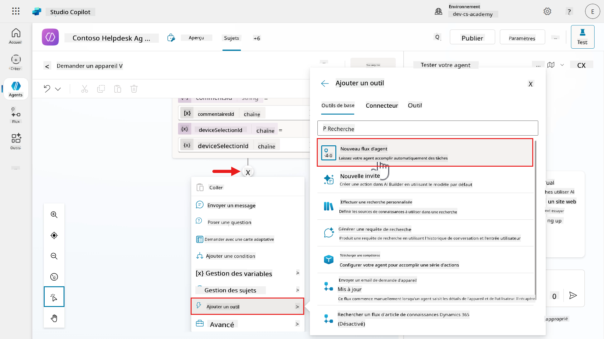

1. Le **Designer** des flux d'agent se chargera avec un déclencheur et une action.

    - **Déclencheur** - Lorsqu'un agent appelle le flux
        - Cela déclenchera un flux à partir d'un agent Copilot Studio.

    - **Action** - Répondre à l'agent
        - Cela envoie une réponse qui peut contenir des valeurs de sortie à l'agent Copilot Studio.

    Sélectionnez le déclencheur.

    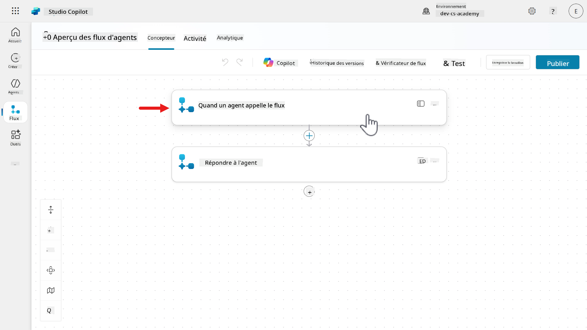

1. Ensuite, nous allons ajouter plusieurs entrées pour le flux d'agent.

    - `DeviceSharePointId` - cela stockera la valeur, ID, de l'élément SharePoint. Cette valeur ID est une sortie du nœud Demander avec une carte adaptative où l'utilisateur a sélectionné le dispositif.

    - `User` - ce sera le nom de l'utilisateur qui proviendra d'une variable système de l'agent.

    - `AdditionalComments` - ce sera le commentaire saisi par l'utilisateur, qui est une sortie du nœud Demander avec une carte adaptative.

    Nous allons d'abord ajouter le `DeviceSharePointId` comme entrée pour notre déclencheur. Sélectionnez **+ Ajouter une entrée**.

    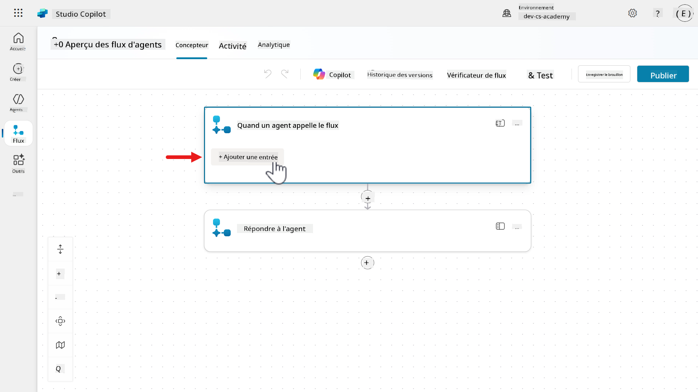

1. Pour le type d'entrée utilisateur, sélectionnez **Texte**.

    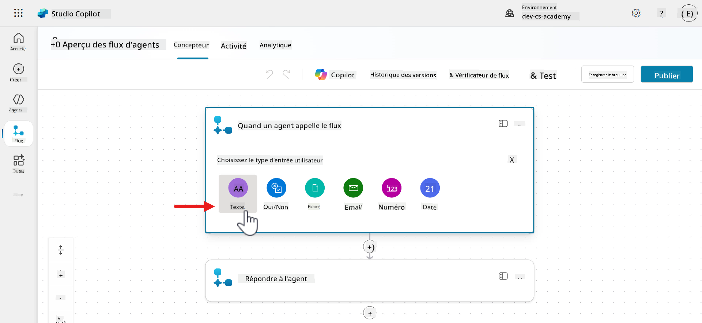

1. Pour le nom de l'entrée, saisissez ce qui suit.

    ```text
    DeviceSharePointId
    ```

    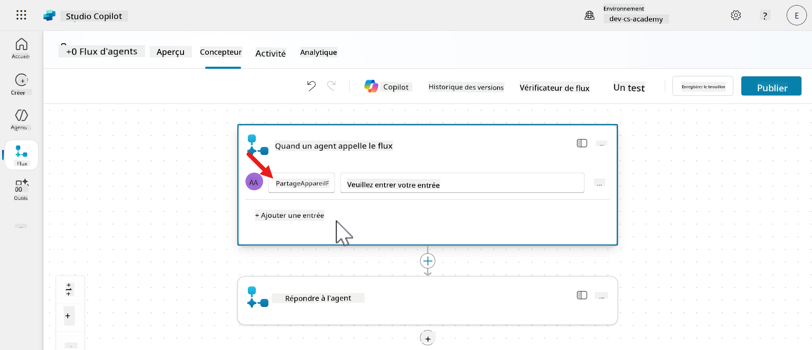

1. Nous allons maintenant ajouter la deuxième entrée, `User`. Répétez les mêmes étapes, sélectionnez **+ Ajouter une entrée** et sélectionnez **Texte**.

    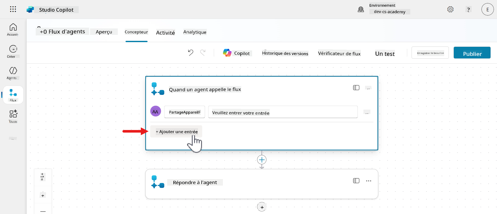

1. Pour le nom de l'entrée, saisissez ce qui suit.

    ```text
    User
    ```

    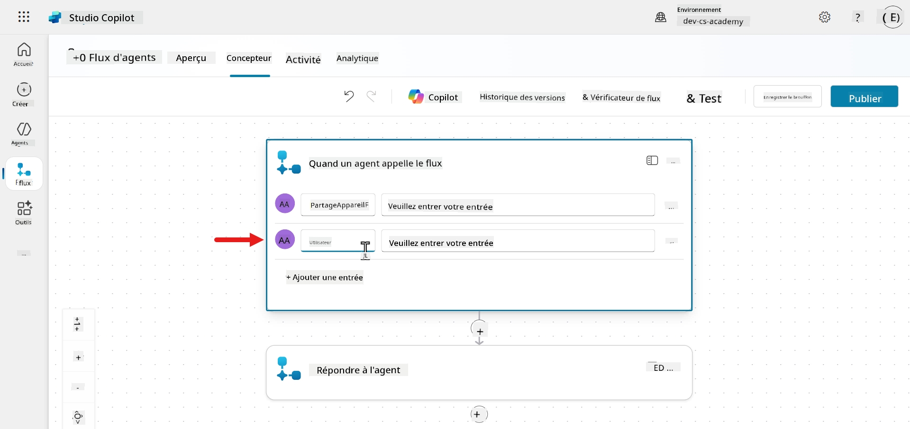

1. Nous allons maintenant ajouter la troisième entrée, `AdditionalComments`. Répétez les mêmes étapes, sélectionnez **+ Ajouter une entrée** et sélectionnez **Texte**.

    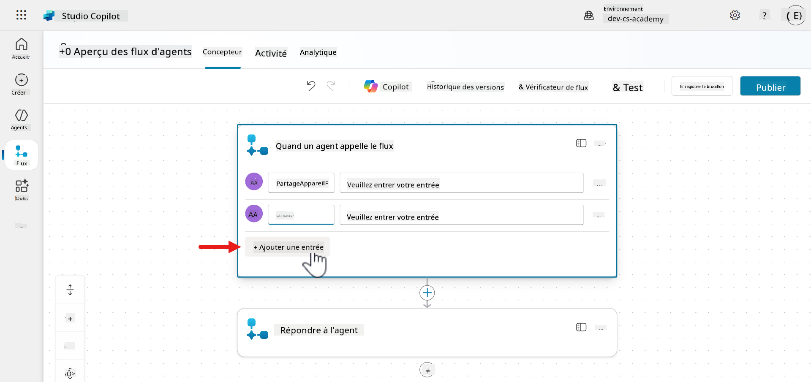

1. Pour le nom de l'entrée, saisissez ce qui suit.

    ```text
    AdditionalComments
    ```

    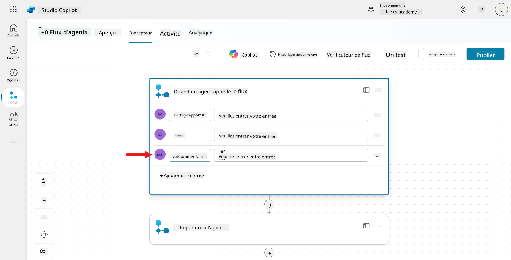

1. Pour l'entrée `AdditionalComments`, nous allons la mettre à jour pour la rendre facultative. Sélectionnez l'**icône de points de suspension (...)** et choisissez **Rendre le champ facultatif**.

    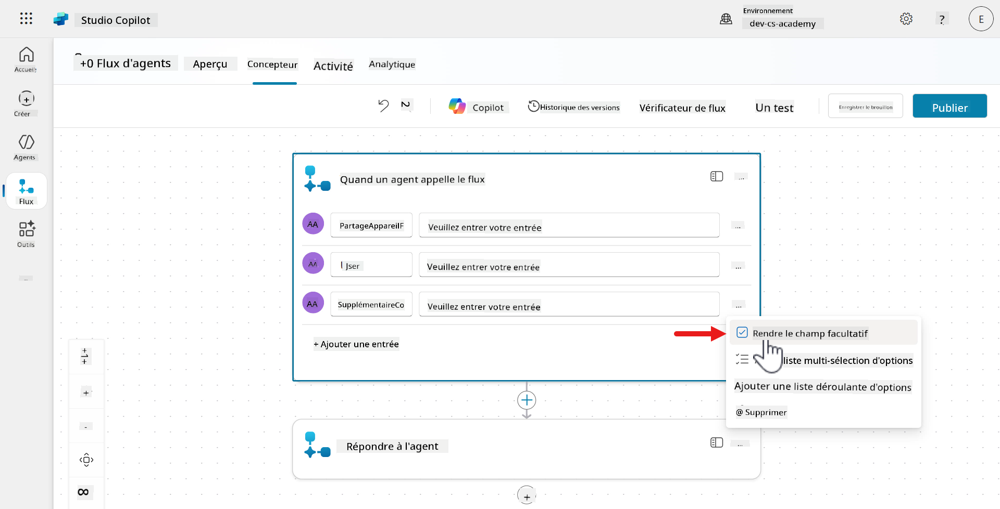

1. Excellent travail ! Le déclencheur est maintenant configuré, continuons. Sélectionnez l'**icône plus +** sous le déclencheur pour insérer une nouvelle action.

    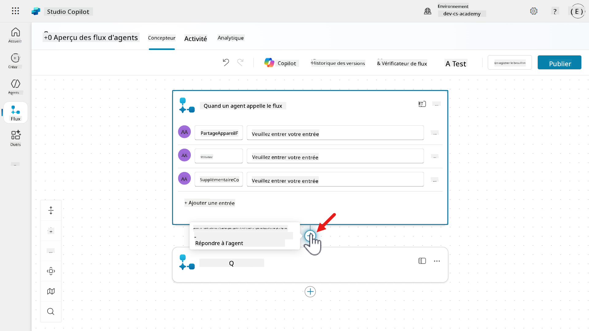

1. Le **volet Actions** apparaîtra où vous pouvez voir des actions provenant de plus de 1400 connecteurs intégrés à Microsoft et à des services tiers. Dans le **champ de recherche**, saisissez ce qui suit,

    ```text
    Get item
    ```

    Une liste d'actions s'affichera dans les résultats de recherche. Sélectionnez l'action **Obtenir un élément** du connecteur **SharePoint**.

    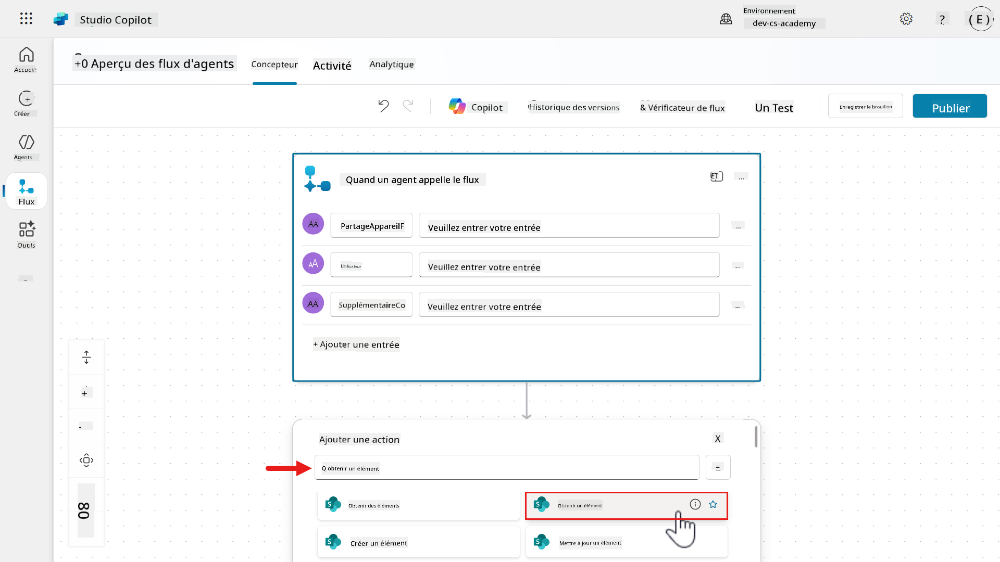

1. Nous pouvons maintenant commencer à configurer l'action **Obtenir un élément**.

    Sélectionnez l'**icône de points de suspension (...)** dans l'action **Obtenir un élément**.

    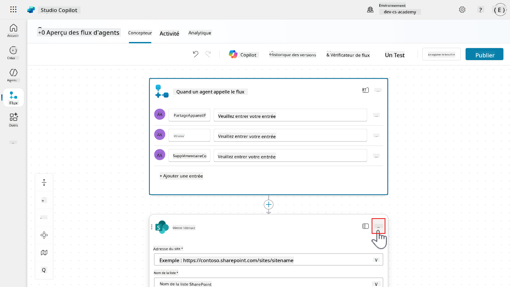

1. Sélectionnez **Renommer**.

    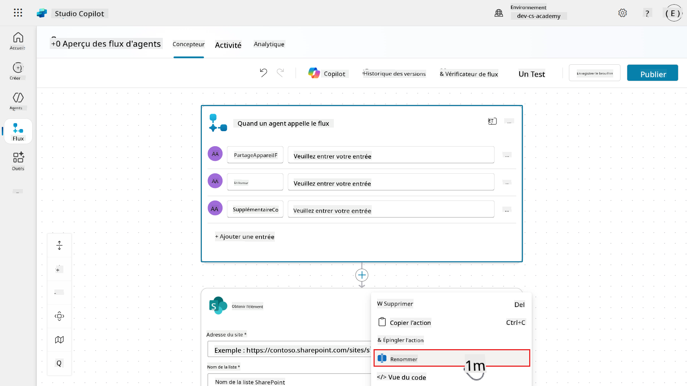

1. Renommez l'action en,

    ```text
    Get Device
    ```

    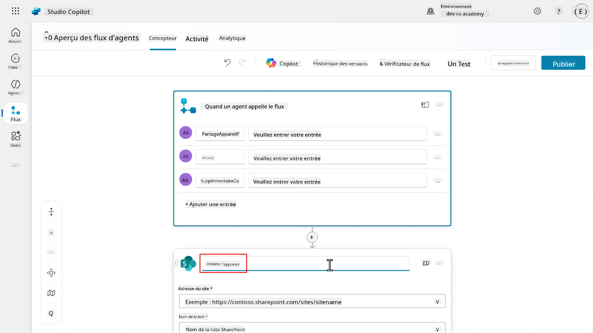

1. Dans le champ **Adresse du site**, sélectionnez l'**Adresse du site** du site SharePoint Contoso IT créé dans [Leçon 00 - Configuration du cours - Étape 3 : Créer un nouveau site SharePoint](../00-course-setup/README.md#step-4-create-new-sharepoint-site).

    Dans le champ **Nom de la liste**, sélectionnez la liste SharePoint **Dispositifs**.

    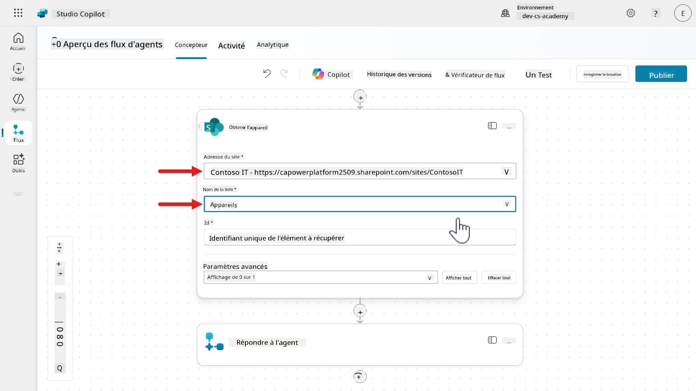

1. Dans le champ **Id**, sélectionnez l'**icône d'éclair** ou l'**icône fx** à droite.

    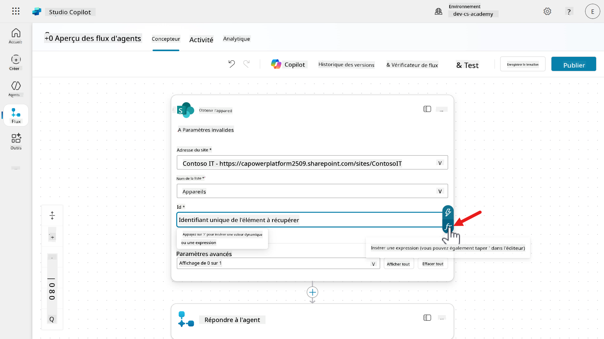

1. Dans l'onglet **Contenu dynamique** du volet volant, saisissez ce qui suit,

    ```text
    sharepoint
    ```

    Les résultats de recherche afficheront les paramètres d'entrée correspondant à la valeur recherchée. Sélectionnez le paramètre **DeviceSharePointId** du déclencheur.

    Ensuite, sélectionnez **Ajouter** pour ajouter l'entrée de contenu dynamique dans le paramètre **Id** de l'action.

    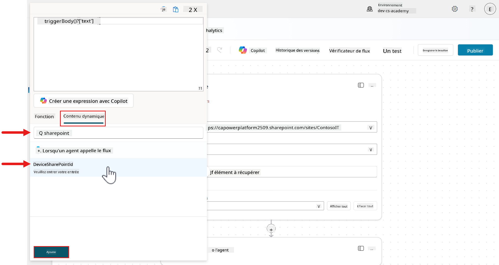

1. L'entrée de contenu dynamique du déclencheur est maintenant référencée dans le paramètre **Id** de l'action. Nous allons mettre à jour l'un des paramètres avancés ensuite. Sélectionnez **Afficher tout** pour voir les paramètres avancés.

    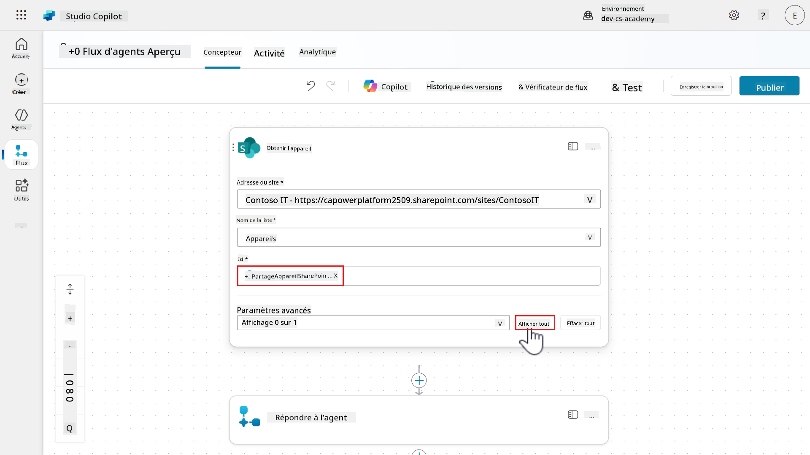

1. Le paramètre **Limiter les colonnes par vue** sera affiché et par défaut il est défini sur **Utiliser toutes les colonnes (Ne pas limiter)**. Nous allons mettre à jour cette valeur pour une vue afin de limiter les colonnes retournées dans la réponse de l'action. Sélectionnez le paramètre **Limiter les colonnes par vue** pour voir la liste des vues.

    

1. Sélectionnez la vue **Tous les éléments**.

    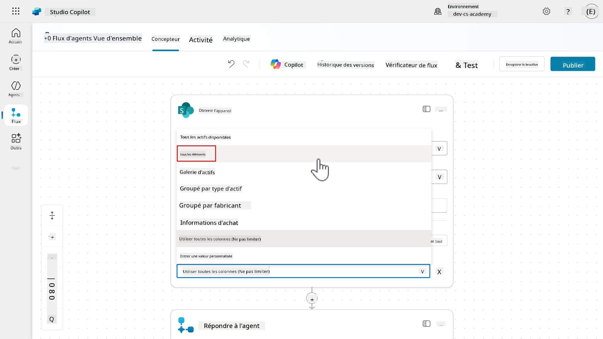

1. Sélectionnez l'**icône plus +** sous l'action _Obtenir le dispositif_ pour insérer une nouvelle action.

    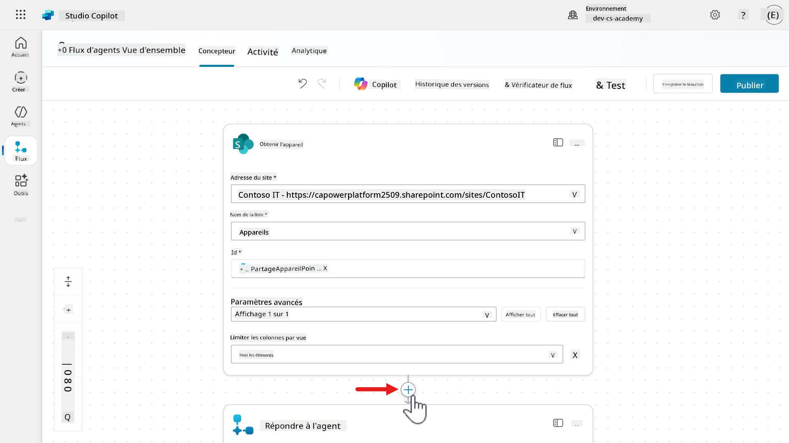

1. Dans le champ de recherche, saisissez ce qui suit,

    ```text
    send an email
    ```

    Une liste d'actions s'affichera dans les résultats de recherche. Sélectionnez l'action **Envoyer un email (V2)** du connecteur **Office 365 Outlook**.

    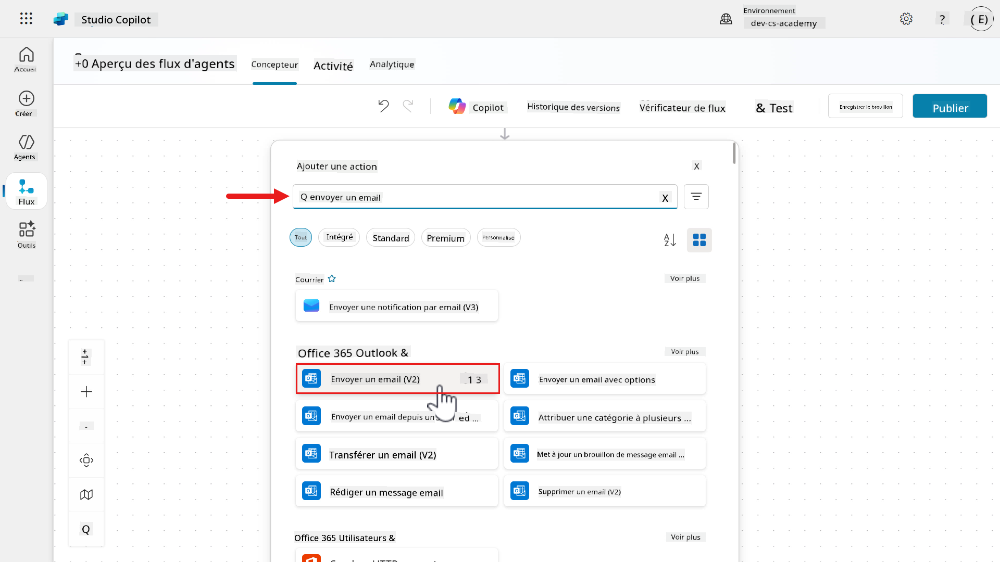

1. Nous devons ensuite créer une connexion pour l'action du connecteur. Sélectionnez **Se connecter**.

    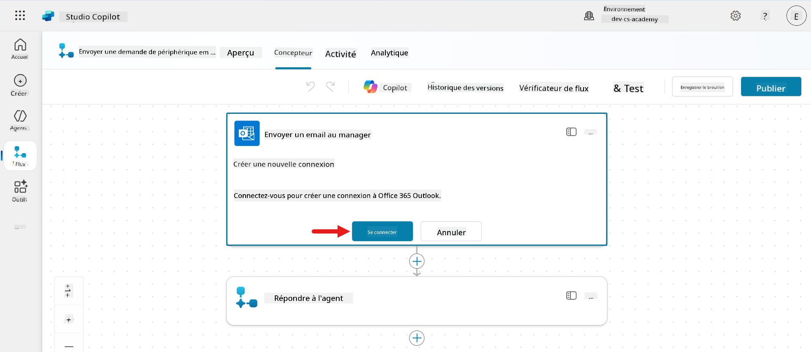

1. Sélectionnez votre compte utilisateur connecté.

    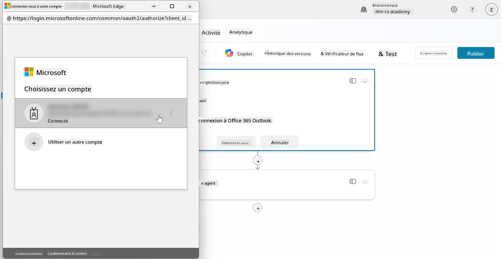

1. Sélectionnez **Autoriser l'accès**. Une connexion a maintenant été créée.

    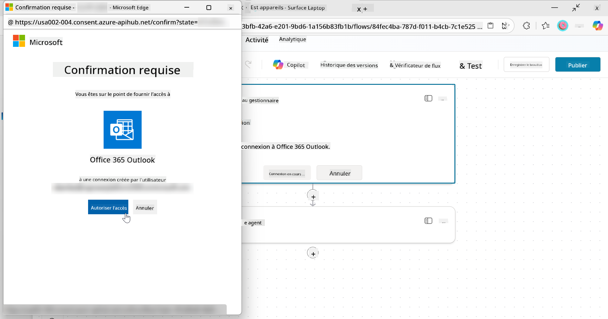

1. Renommez l'action en ce qui suit,

    ```text
    Send an email to manager
    ```

    Définissons ensuite les paramètres d'entrée de notre action.

    Pour le paramètre d'entrée **À**, sélectionnez vous-même. Normalement, ce serait votre responsable ou nous utiliserions une autre action qui récupère votre responsable en fonction de votre profil Entra ID, mais pour les besoins de cette leçon, sélectionnez vous-même.

    Pour le paramètre d'entrée **Objet**, saisissez ce qui suit,

    ```text
    Request type: new device
    ```

    Pour le paramètre d'entrée **Corps**, saisissez ce qui suit,

    ```text
    Hi,

    New device requested from

    Manufacturer:
    Model:
    Link to item in SharePoint
    Additional comments from:

    This is an automated email from Contoso Helpdesk Copilot
    ```

    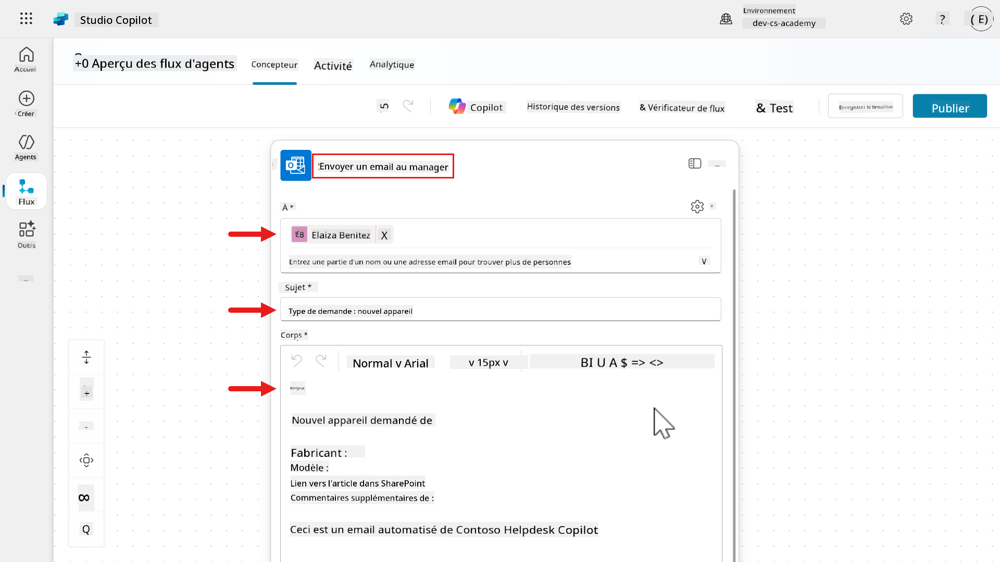

1. Ensuite, nous allons mettre à jour le paramètre d'entrée **Corps** avec des références aux entrées de contenu dynamique du **déclencheur** ou de l'action **Obtenir un élément**. Ajoutez un espace après la deuxième ligne car nous insérerons le nom de l'utilisateur à partir de l'entrée du déclencheur, **User**.

    Sélectionnez l'**icône d'éclair** ou l'**icône fx** à droite.

    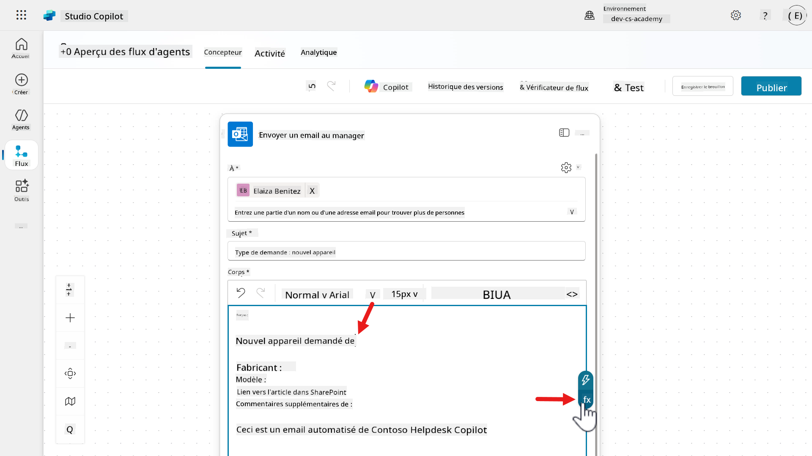

1. Dans l'onglet **Contenu dynamique** du volet volant, sélectionnez l'entrée **User** du déclencheur.

    Sélectionnez **Ajouter** pour ajouter l'entrée de contenu dynamique **User** dans le paramètre **Corps** de l'action.

    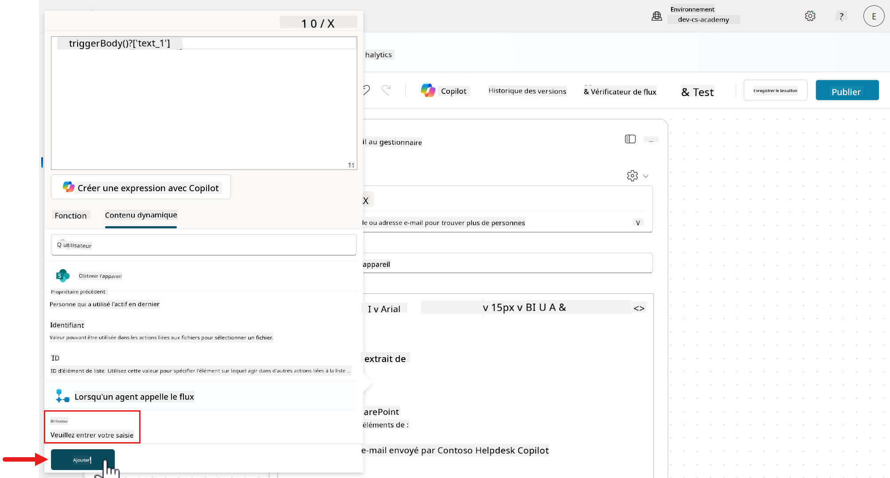
1. L'entrée de contenu dynamique provenant du déclencheur est maintenant référencée dans le paramètre **Body** de l'action. Nous allons répéter la même chose pour les lignes restantes dans le corps du message email.

    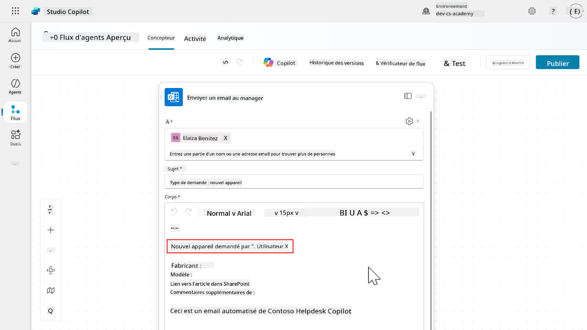

1. Cliquez dans l'espace à côté de `Manufacturer:`. Sélectionnez l'icône **éclair** ou **fx** à droite.

    Dans l'onglet **Contenu dynamique** du volet volant, entrez ce qui suit dans le champ de recherche,

    ```text
    manufacturer
    ```

    Sélectionnez l'entrée **Manufacturer value** du déclencheur et cliquez sur **Ajouter**.

    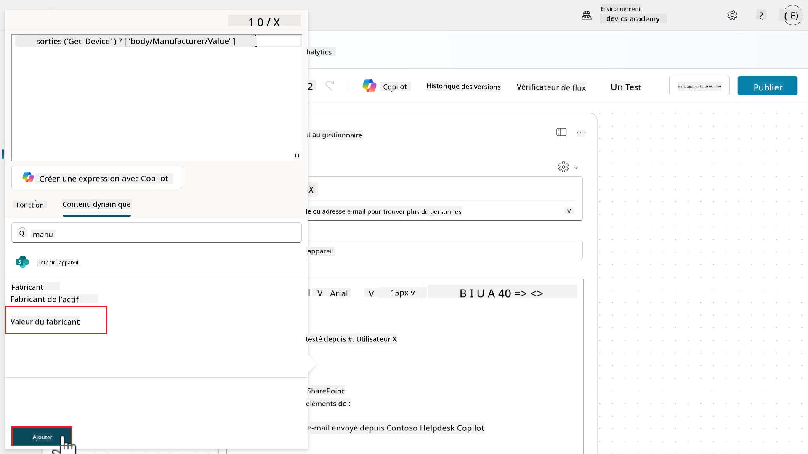

1. Cliquez dans l'espace à côté de `Model:`. Sélectionnez l'icône **éclair** ou **fx** à droite.

    Dans l'onglet **Contenu dynamique** du volet volant, entrez ce qui suit dans le champ de recherche,

    ```text
    model
    ```

    Sélectionnez l'entrée **Model** de l'action **Get item** et cliquez sur **Ajouter**.

    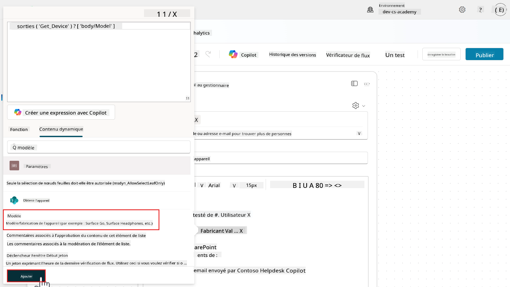

1. Pour le texte `Link to item in SharePoint`, nous allons le transformer en hyperlien dans le corps du message email. Cliquez au début de la ligne et sélectionnez l'icône **éclair** ou **fx** à droite.

    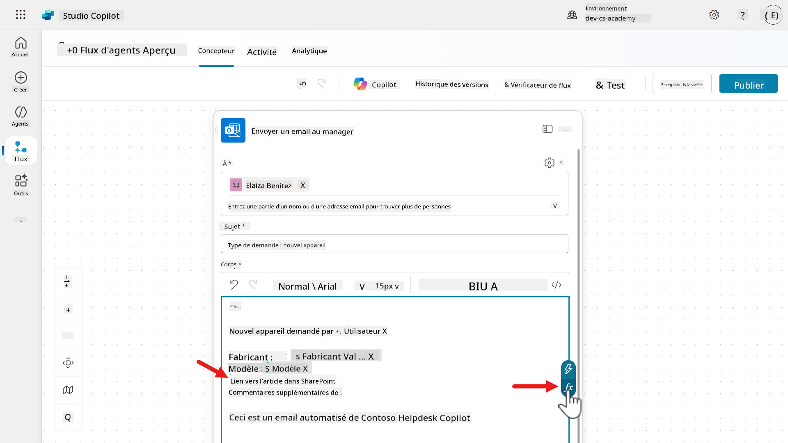

1. Cliquez après la balise HTML d'ancre et sélectionnez l'icône **éclair** ou **fx** à droite.

    Dans l'onglet **Contenu dynamique** du volet volant, entrez ce qui suit dans le champ de recherche,

    ```text
    link to item
    ```

    Sélectionnez l'entrée **Link to item** de l'action **Get item** et cliquez sur **Ajouter**.

    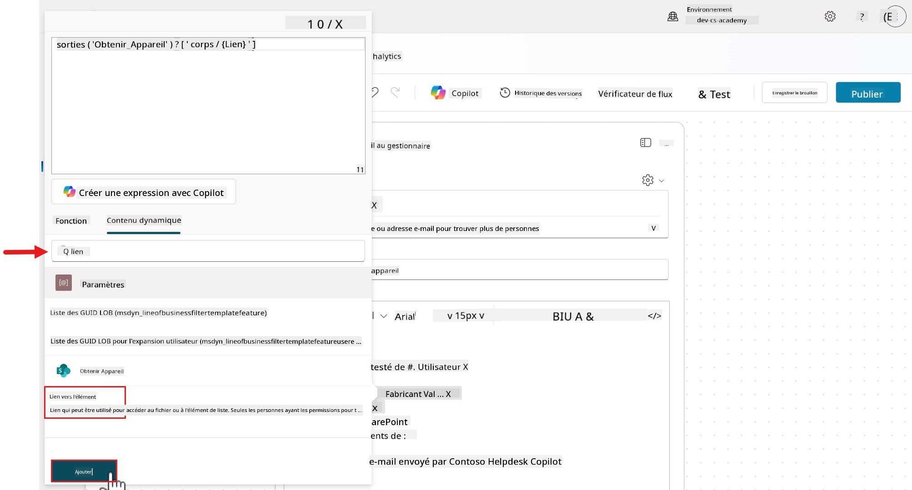

1. Nous devons passer à l'éditeur HTML en sélectionnant l'icône **&lt;/&gt;**.

    

1. L'éditeur HTML est maintenant activé. Cliquez avant le texte `Link to item in SharePoint`, ajoutez une balise HTML d'ancre pour créer un hyperlien. Copiez et collez ce qui suit.

    ```text
    <a href="
    ```

    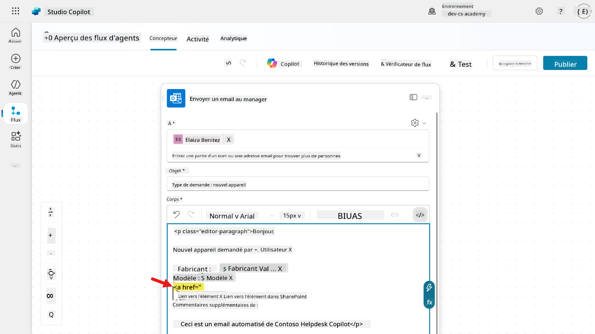

1. L'entrée de contenu dynamique **Link to item** est maintenant référencée dans le paramètre **Body**. Cliquez après l'entrée **Link to item**, copiez et collez ce qui suit.

    ```text
    ">
    ```

    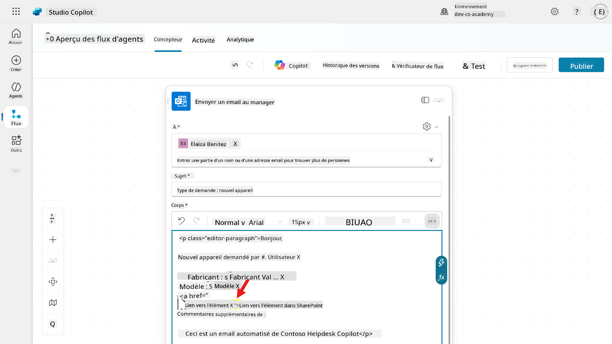

1. Cliquez après le texte `Link to item in SharePoint`, fermez la balise HTML d'ancre. Copiez et collez ce qui suit.

    ```text
    </a>
    ```

    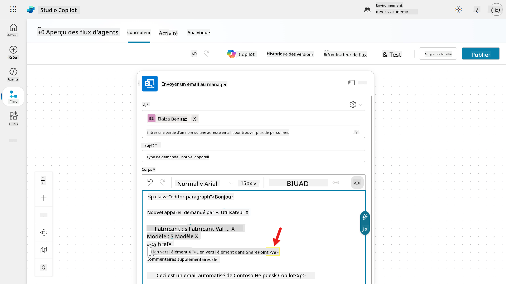

1. Sélectionnez l'icône **&lt;/&gt;** pour basculer la vue du code.

    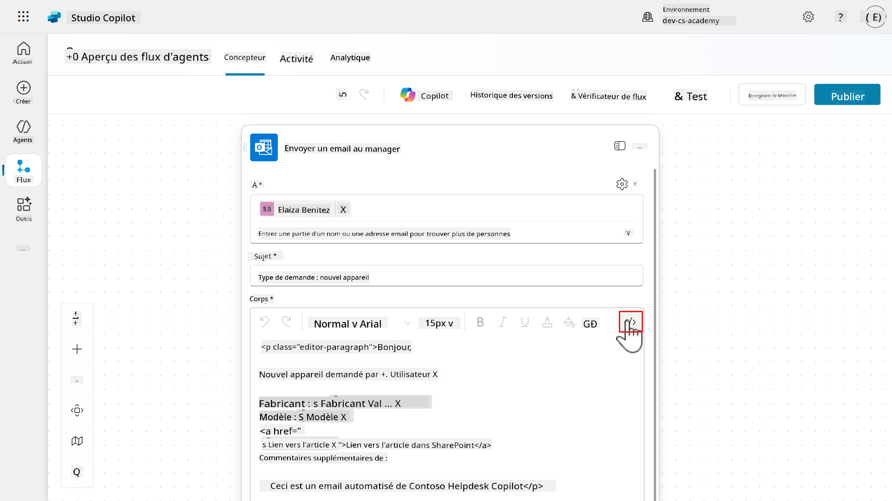

1. Puis re-sélectionnez l'icône **&lt;/&gt;** pour basculer à nouveau la vue du code.

    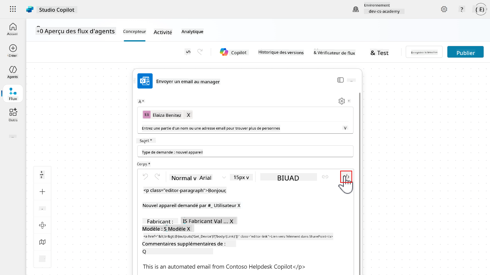

1. Remarquez qu'il y a plusieurs caractères supplémentaires `&lt;br&gt;`. Supprimez ces caractères.

    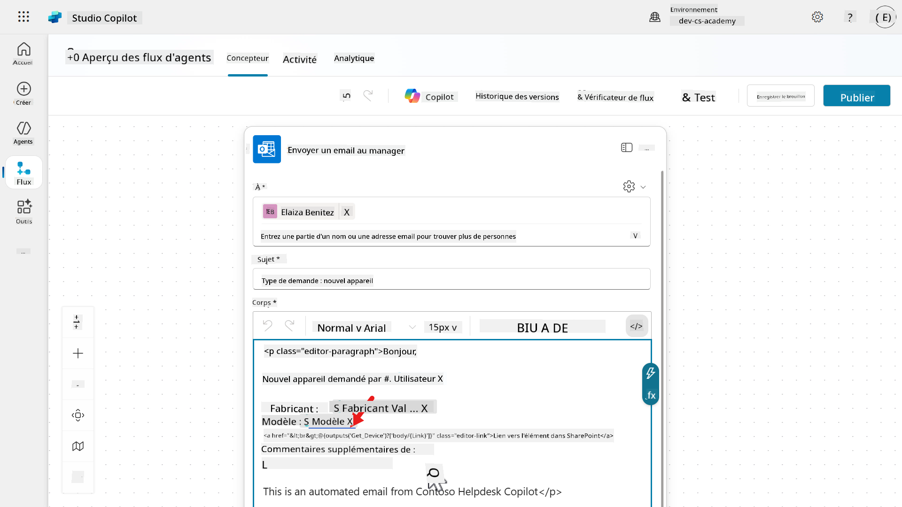

1. Nous avons maintenant terminé d'ajouter un hyperlien au corps de notre message email 😎 Sélectionnez l'icône **&lt;/&gt;** pour basculer la vue du code.

    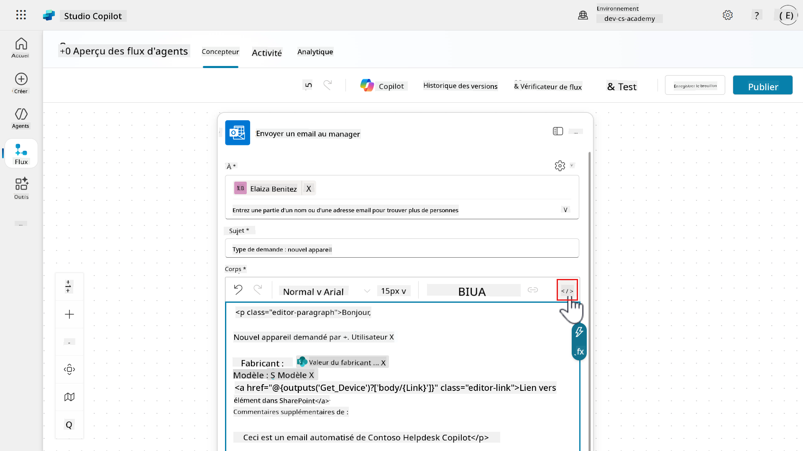

1. Cliquez après le texte `Additional comments from` avant le caractère deux-points et sélectionnez l'icône **éclair** ou **fx** à droite.

    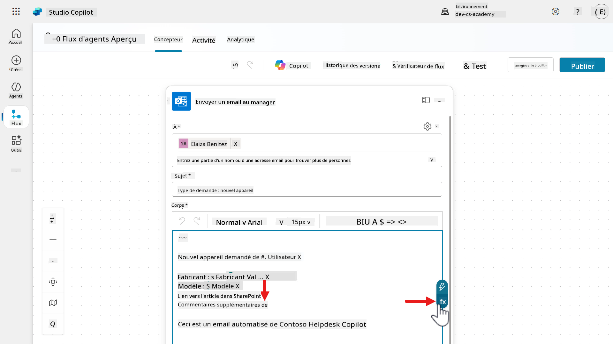

1. Dans l'onglet **Contenu dynamique** du volet volant, entrez ce qui suit dans le champ de recherche,

    ```text
    user
    ```

    Sélectionnez le paramètre **User** du déclencheur et cliquez sur **Ajouter**.

    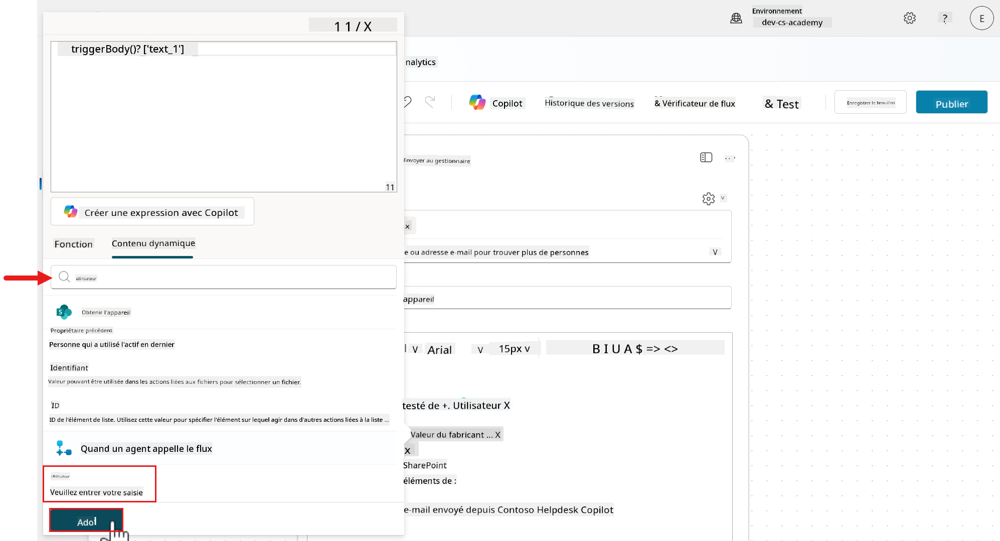

1. Nous allons maintenant insérer une expression qui affichera la valeur des commentaires supplémentaires si fournie par l'utilisateur dans le nœud **Ask an adaptive card**, sinon affichera "None" si l'utilisateur ne fournit aucun commentaire.

    Cliquez après les deux-points et sélectionnez l'icône **éclair** ou **fx** à droite.

    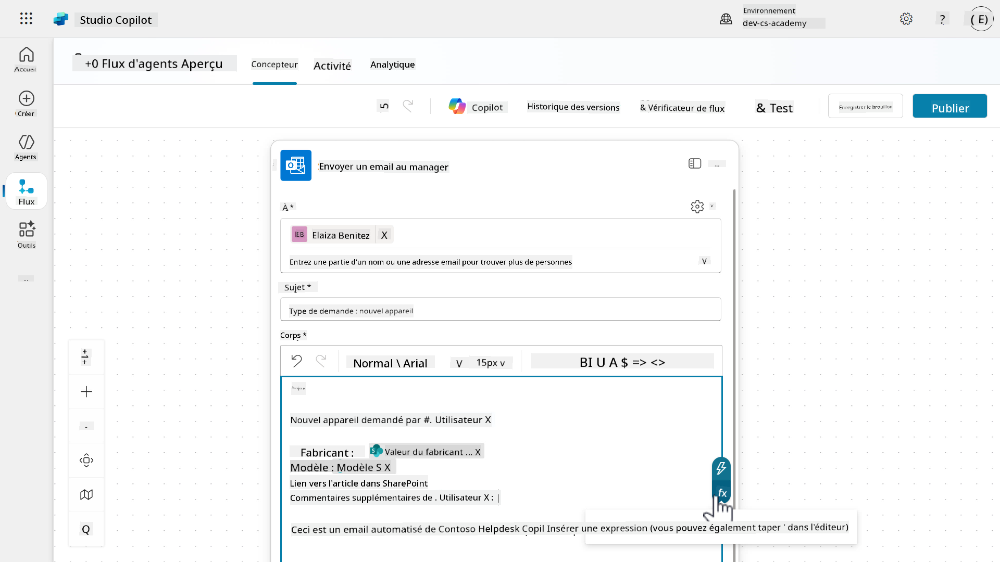

1. Dans l'onglet **Fonction** du volet volant et dans le champ d'expression au-dessus, entrez ce qui suit,

    ```text
    if(empty())
    ```

    Cette expression utilise la fonction `if` pour une déclaration conditionnelle.

    La fonction suivante utilisée est `empty` qui vérifie si une valeur existe ou non dans un paramètre de chaîne. Le paramètre de chaîne à référencer est la valeur du paramètre d'entrée `AdditionalComments` du déclencheur.

    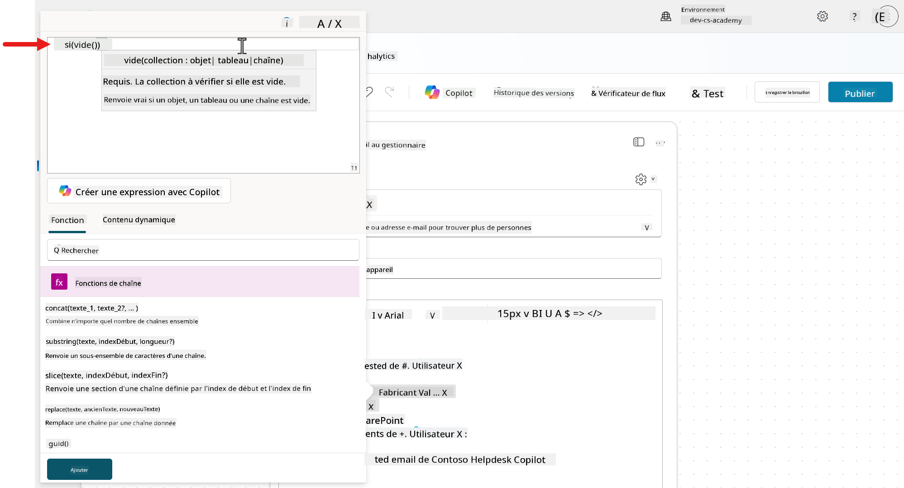

1. Ensuite, cliquez **à l'intérieur des parenthèses** après la fonction `empty`. Nous allons insérer le paramètre d'entrée `AdditionalComments` du déclencheur.

    Sélectionnez l'onglet **Contenu dynamique**. Entrez ce qui suit dans le champ de recherche,

    ```text
    Additional
    ```

    Faites défiler le volet et sélectionnez l'entrée **AdditionalComments** du déclencheur. Le paramètre sera maintenant ajouté comme paramètre de chaîne dans l'expression.

    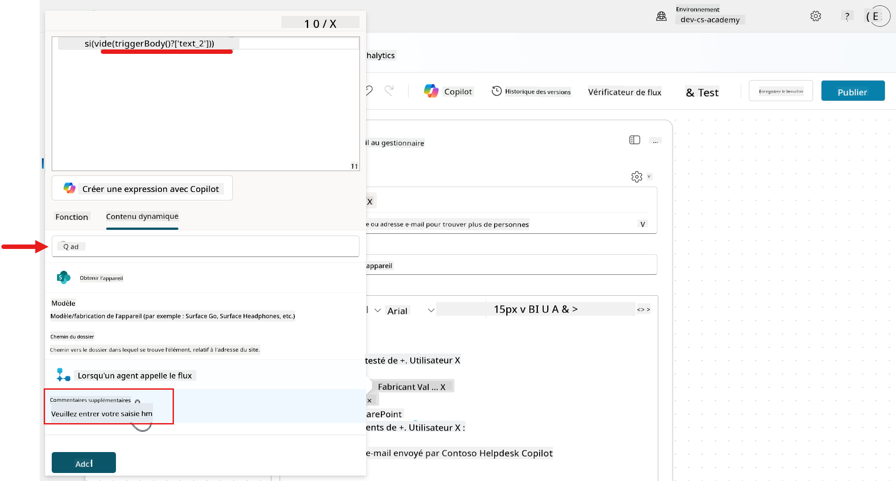

1. Ensuite, nous allons définir la logique **_true_**, où si le paramètre de chaîne `AdditionalComments` est vide, nous voulons afficher une chaîne (texte) de `None`.

    Après la parenthèse qui englobe le paramètre de chaîne, entrez ce qui suit,

    ```text
    , 'None',
    ```

    

1. Enfin, nous allons définir la logique **_false_**, où si le paramètre de chaîne `AdditionalComments` n'est pas vide, nous voulons afficher la valeur du paramètre d'entrée **AdditionalComments** de notre déclencheur.

    > Rappel : cette valeur proviendra du champ Additional Comments de la carte adaptative dans le nœud **Ask with adaptive card** du sujet **Request device**.

    Après la virgule après notre logique **_true_**, sélectionnez l'onglet **Contenu dynamique**. Entrez ce qui suit dans le champ de recherche,

    ```text
    Additional
    ```

    Faites défiler le volet et sélectionnez l'entrée **AdditionalComments** du déclencheur. Le paramètre sera maintenant ajouté comme paramètre de chaîne dans l'expression.

    Ajoutez-le maintenant à notre paramètre **Body** en sélectionnant **Ajouter**.

    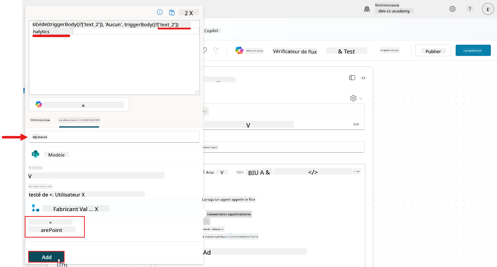

1. Excellent, notre expression est complète ! L'expression a maintenant été ajoutée au paramètre **Body**. Enfin, formatez la dernière ligne en italique.

    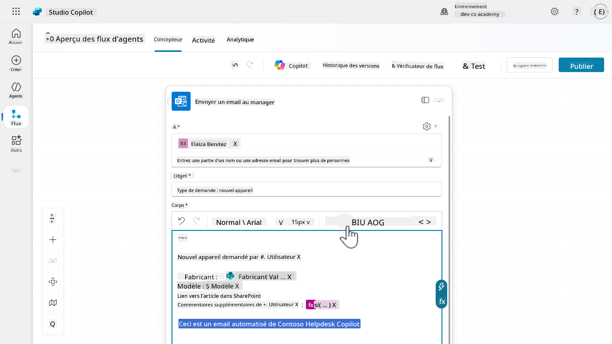

1. Nous allons maintenant mettre à jour l'action **Respond to the agent** pour envoyer la valeur du paramètre **Model value** de l'action **Get item** à l'agent.

    Maintenez le bouton gauche de votre souris enfoncé et déplacez-vous vers le haut dans le concepteur pour afficher l'action **Respond to the agent**.

    Sélectionnez l'action **Respond to the agent** et choisissez **Texte** comme type de sortie.

    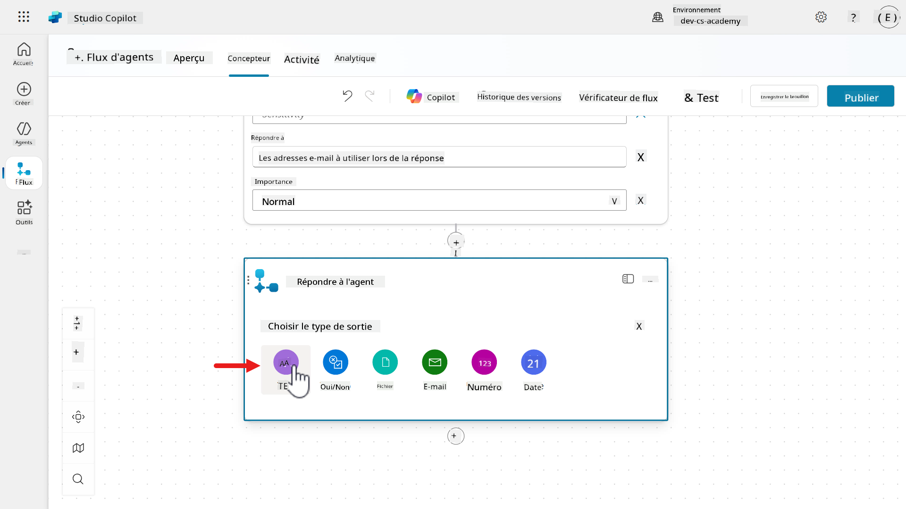

1. Entrez ce qui suit comme nom de la sortie.

    ```text
    ModelValue
    ```

    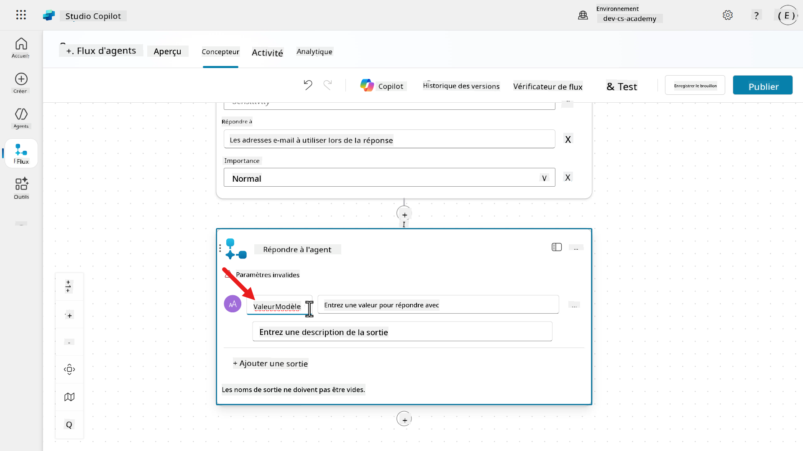

1. Sélectionnez le champ de valeur et cliquez sur l'icône **éclair** ou **fx** à droite.

    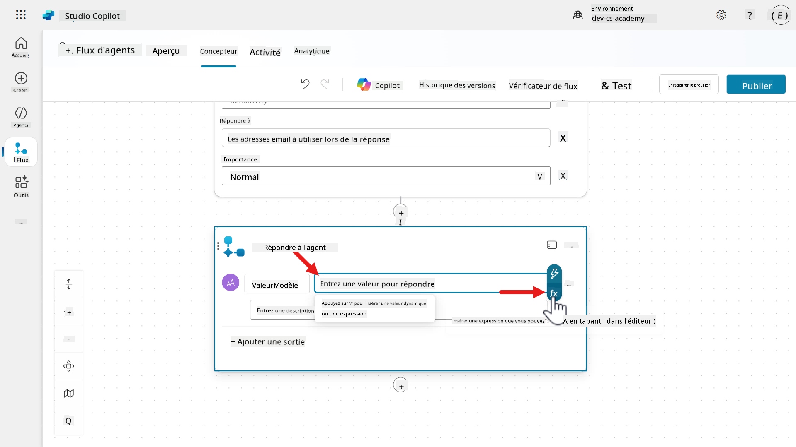

1. Dans l'onglet **Contenu dynamique** du volet volant, entrez ce qui suit dans le champ de recherche,

    ```text
    model
    ```

    Sélectionnez le paramètre **Model** de l'action **Get item** et cliquez sur **Ajouter**.

    

1. Le paramètre **Model** est maintenant la valeur de la sortie texte. Sélectionnez **Enregistrer le brouillon** pour sauvegarder notre flux d'agent.

    Nous avons maintenant terminé notre flux d'agent 👏🏻

    

1. Faisons une dernière mise à jour de notre flux d'agent avant de le publier. Sélectionnez l'onglet **Aperçu** et cliquez sur **Modifier**.

    

1. Pour le **Nom du flux**, copiez et collez ce qui suit.

    ```text
    Send device request email
    ```

    Pour la **Description**, sélectionnez l'icône de **rafraîchissement** pour utiliser l'IA afin de générer automatiquement une description basée sur le déclencheur et les actions du flux d'agent.

    Cliquez sur **Enregistrer** pour sauvegarder le nom et la description mis à jour du flux d'agent.

    

1. Sélectionnez l'onglet **Concepteur** et cliquez sur **Publier** pour publier le flux d'agent afin qu'il puisse être ajouté comme nœud dans le sujet **Request device**.

    

1. Un message de confirmation apparaîtra bientôt pour confirmer que le flux d'agent est publié.

    

### 9.2 Ajouter le flux d'agent au sujet

Ajoutons maintenant le flux d'agent au sujet **Request device**.

1. Sélectionnez **Agents** dans le menu de gauche et choisissez l'agent **Contoso Helpdesk Agent**.

    

1. Sélectionnez l'onglet **Sujets**.

    

1. Choisissez le sujet **Request device**.

    

1. Faites défiler jusqu'au nœud **Ask with adaptive card** et ajoutez un nouveau nœud.

    Cliquez sur **Ajouter un outil** et dans l'onglet **Outils de base** du volet volant, sélectionnez le flux d'agent **Send device request email** que nous avons récemment créé et publié.

    

1. Pour les entrées de déclencheur de notre flux d'agent, nous devons sélectionner les sorties de variables du nœud **Ask with adaptive card**.

    Cliquez sur l'icône **trois points (...)** pour l'entrée **DeviceSharePointId**.

    

1. Sélectionnez la variable **deviceSelectionId**, qui est l'une des sorties définies dans le nœud **Ask with adaptive card**.

    

1. Ensuite, cliquez sur l'icône **trois points (...)** pour l'entrée **User**.

    

1. Sélectionnez l'onglet **Système** dans le volet volant des variables et choisissez **User.DisplayName**. Cette variable stocke le nom affiché de l'utilisateur interne interagissant avec l'agent.

    

1. Ensuite, cliquez sur l'icône **plus grand que** pour **Entrées avancées** afin d'étendre et voir l'entrée **AdditionalComments**.

    

1. Cliquez sur l'icône **trois points (...)** pour l'entrée AdditionalComments.

    

1. Sélectionnez l'onglet **Formule** et l'icône d'extension dans le volet volant des variables, car nous allons utiliser une expression Power Fx.

    

1. Semblable à l'expression dans le flux d'agent qui effectue une vérification conditionnelle en utilisant la fonction _if_, mais cette fois
    - en utilisant les fonctions Power Fx,
    - et en insérant soit aucune valeur, soit la valeur de la variable de sortie `commentsId` du nœud **Ask with adaptive card**.

    Entrez les fonctions suivantes dans le champ Power Fx,

    ```text
    If(IsBlank())
    ```

Cette expression utilise la fonction `If` pour une instruction conditionnelle if-else.

La fonction suivante utilisée est `IsBlank`, qui vérifie si une valeur existe ou non dans un paramètre de chaîne. Le paramètre de chaîne à référencer est la variable de sortie `commentsId` du nœud **Demander avec carte adaptative**.


1. Ensuite, cliquez **à l'intérieur des crochets** après la fonction `IsBlank`. Nous allons insérer la variable de sortie `commentsId` du nœud **Demander avec carte adaptative**.

   Entrez ce qui suit à l'intérieur des crochets,

    ```text
    Topic.commentsId
    ```

   Et ajoutez une virgule après le crochet.

   

1. Ensuite, nous allons définir la logique :

   - lorsque **_true_** - si le paramètre de chaîne `Topic.commentsId` est vide, alors nous ne voulons insérer aucune valeur.
   - lorsque **_false_** - si le paramètre de chaîne `Topic.commentsId` n'est pas vide, alors insérez la valeur de la variable commentsId.

   Après le crochet qui ferme le paramètre de chaîne, entrez ce qui suit,

    ```text
    "", Topic.commentsId)
    ```

   L'expression Power Fx devrait être la suivante,

    ```text
    If(IsBlank(Topic.commentsId), "", Topic.commentsId)
    ```

   Excellent travail, notre expression est complète ! 🙌🏻 Maintenant, sélectionnez **Insérer** pour définir le paramètre d'entrée du flux de l'agent à l'expression Power Fx.

   

1. **Enregistrez** le sujet.

### 9.3 Mettre à jour le sujet Demande d'appareil avec plusieurs nœuds pour une meilleure expérience utilisateur

Nous allons ajouter deux nœuds supplémentaires :

- **Envoyer un message** - cela servira de message de confirmation qui fait référence à l'appareil sélectionné et indique que leur demande a été soumise.

- **Gestion des sujets** - pour clôturer la conversation, nous redirigerons vers le nœud **Fin de conversation**.

Commençons !

1. Sélectionnez l'**icône plus +** sous le nœud de flux de l'agent et sélectionnez le nœud **Envoyer un message**.

   

1. Entrez ce qui suit dans le champ de message,

    ```text
    Thanks
    ```

   Ensuite, sélectionnez **Insérer une variable** car nous allons référencer le nom de l'utilisateur.

   

1. Sélectionnez l'onglet **Système** et recherchez `User` dans le champ de recherche. Sélectionnez la variable **User.DisplayName**.

   

1. Entrez ce qui suit dans le champ de message,

    ```text
    . Your selected device,
    ```

   Ensuite, sélectionnez **Insérer une variable** et cette fois dans l'onglet **Personnalisé**, sélectionnez la variable **ModelValue**.

   Ensuite, entrez ce qui suit pour compléter le message.

    ```text
    , has been submitted and will be reviewed by your manager.
    ```

   Le message devrait ressembler à ceci.

   

1. Enfin, sélectionnez l'**icône plus +** sous le nœud **Envoyer un message** et sélectionnez **Gestion des sujets**, suivi de **Aller à un autre sujet** et sélectionnez **Fin de conversation**.

   

1. **Enregistrez** le sujet.

   

### 9.4 Tester l'agent avec plusieurs scénarios

Excellent travail !!! 😁 Nous pouvons maintenant tester notre agent.

#### 9.4.1 Demander un appareil et entrer un commentaire dans la carte adaptative

1. **Actualisez** le volet de test, sélectionnez l'icône **carte d'activité** et entrez ce qui suit comme message à l'agent.

    ```text
    I need a laptop
    ```

   

1. L'agent déclenche le sujet **Appareils disponibles** et répond avec la liste des appareils disponibles. Nous entrerons ce qui suit comme réponse à la question de savoir si nous souhaitons demander un appareil.

    ```text
    Yes
    ```

   

1. Remarquez comment l'agent a invoqué le sujet **Demande d'appareil** conformément aux instructions de l'agent et que la carte adaptative est maintenant affichée dans le message de l'agent.

   Sélectionnez l'appareil **Surface Laptop 15** et ajoutez ce qui suit comme commentaire.

    ```text
    I need 16GB of RAM please
    ```

   

1. Faites défiler jusqu'à ce que vous voyiez le bouton **Soumettre la demande** et sélectionnez-le pour soumettre la carte adaptative à l'agent.

   

1. Sélectionnez **Autoriser** pour que l'agent utilise vos identifiants pour l'authentification de connexion des deux actions de connecteur.

   

1. L'agent affichera ensuite le message de confirmation qui inclut le modèle sélectionné, suivi d'une redirection vers le sujet **Fin de conversation**. Super !

   

1. Sélectionnez **Oui** pour vérifier le reste du sujet **Fin de conversation**.

   

1. Ensuite, évaluez l'expérience en sélectionnant l'une des étoiles dans la carte d'évaluation.

   L'agent passera ensuite au dernier nœud **Question** dans le sujet **Fin de conversation**. Sélectionnez **Non**.

   

1. Le sujet se terminera alors par un message final affiché dans le volet de test.

   

1. Vérifiez votre boîte de réception de votre compte email pour examiner l'email envoyé au responsable par le flux de l'agent. Vous pouvez voir les détails de l'appareil sélectionné et la note entrée dans la carte adaptative.

   

1. Cliquez sur le lien hypertexte et le navigateur devrait charger l'élément SharePoint de l'appareil. Super !

   

#### 9.4.2 Demander un appareil et ne pas entrer de commentaire dans la carte adaptative

Testons maintenant le scénario où aucun commentaire n'est entré.

1. Répétez les mêmes étapes :

   - **Actualisez** le volet de test et sélectionnez l'icône **carte d'activité**
   - Entrez le message, `J'ai besoin d'un ordinateur portable`
   - Répondez par `Oui` à la question de demander un appareil

   

1. Cette fois, sélectionnez **Surface Laptop 13** comme appareil et n'entrez aucun commentaire.

   

1. **Soumettez** la demande en sélectionnant le bouton **Soumettre la demande**.

   

1. Cette fois, l'email reçu dans votre boîte de réception affichera **Aucun** comme commentaire.

   

#### 9.4.3 Ne pas demander d'appareil

Testons le dernier scénario qui consiste à ne pas demander d'appareil, et le sujet **Au revoir** devrait être invoqué conformément aux instructions de l'agent.

1. Répétez les mêmes étapes :

   - **Actualisez** le volet de test et sélectionnez l'icône **carte d'activité**
   - Entrez le message, `J'ai besoin d'un ordinateur portable`
   - Cette fois, répondez par `Non` à la question de demander un appareil

   

1. L'agent a invoqué le sujet **Au revoir** et la question définie dans le sujet est posée.

   

## ✅ Mission accomplie

Félicitations ! 👏🏻 Vous avez appris à construire votre flux d'agent et à l'ajouter à notre sujet existant **Demande d'appareil**, ainsi qu'à rediriger l'agent vers un autre sujet.

C'est la fin de **Lab 09 - Ajouter un flux d'agent pour l'automatisation et améliorer les capacités des sujets**, sélectionnez le lien ci-dessous pour passer à la leçon suivante. Nous développerons le cas d'utilisation de ce laboratoire dans la leçon suivante.

⏭️ [Passer à la leçon **Ajouter des déclencheurs d'événements - Activer les capacités autonomes de l'agent**](../10-add-event-triggers/README.md)

## 📚 Ressources tactiques

🔗 [Présentation des flux d'agent : Transformer l'automatisation avec des workflows axés sur l'IA](https://www.microsoft.com/microsoft-copilot/blog/copilot-studio/introducing-agent-flows-transforming-automation-with-ai-first-workflows/)

🔗 [Vue d'ensemble des flux d'agent](https://learn.microsoft.com/microsoft-copilot-studio/flows-overview?WT.mc_id=power-172621-ebenitez)

🔗 [Utiliser les flux d'agent avec votre agent](https://learn.microsoft.com/microsoft-copilot-studio/advanced-flow?WT.mc_id=power-172621-ebenitez)

🔗 [Liste des fonctions dans le guide de référence](https://learn.microsoft.com/azure/logic-apps/workflow-definition-language-functions-reference?WT.mc_id=power-172621-ebenitez)

📺 [Flux d'agent dans Copilot Studio](https://www.youtube.com/watch?v=VJTKyk3Pr7s)

<!-- markdownlint-disable-next-line MD033 -->


---

**Avertissement** :  
Ce document a été traduit à l'aide du service de traduction automatique [Co-op Translator](https://github.com/Azure/co-op-translator). Bien que nous nous efforcions d'assurer l'exactitude, veuillez noter que les traductions automatisées peuvent contenir des erreurs ou des inexactitudes. Le document original dans sa langue d'origine doit être considéré comme la source faisant autorité. Pour des informations critiques, il est recommandé de recourir à une traduction humaine professionnelle. Nous ne sommes pas responsables des malentendus ou des interprétations erronées résultant de l'utilisation de cette traduction.