<!--
CO_OP_TRANSLATOR_METADATA:
{
  "original_hash": "cd99a76bcb7372ac2771b6ae178b023d",
  "translation_date": "2025-10-17T19:15:46+00:00",
  "source_file": "docs/recruit/10-add-event-triggers/README.md",
  "language_code": "fr"
}
-->
# 🚨 Mission 10 : Ajouter des déclencheurs d'événements - Activer les capacités d'agents autonomes

## 🕵️‍♂️ NOM DE CODE : `OPÉRATION ROUTINE FANTÔME`

> **⏱️ Durée de l'opération :** `~45 minutes`

🎥 **Regardez la démonstration**

[](https://www.youtube.com/watch?v=ZgwHL8PQ1nY "Regardez la démonstration sur YouTube")

## 🎯 Résumé de la mission

Il est temps de transformer votre agent d'un simple assistant conversationnel en un opérateur autonome. Votre mission est de permettre à votre agent d'agir sans être sollicité - en répondant aux signaux provenant de votre domaine numérique avec précision et rapidité.

Avec les déclencheurs d'événements, vous apprendrez à entraîner votre agent à surveiller des systèmes externes comme SharePoint, Teams et Outlook, et à exécuter des actions intelligentes dès qu'un signal est reçu. Cette opération transforme votre agent en un atout opérationnel complet - silencieux, rapide et toujours vigilant.

Réussir cette mission signifie créer des agents qui initient de la valeur - et ne se contentent pas de répondre.

## 🔎 Objectifs

📖 Cette leçon couvrira :

- Comprendre les déclencheurs d'événements et comment ils permettent un comportement autonome des agents
- Apprendre la différence entre les déclencheurs d'événements et les déclencheurs de sujets, y compris les workflows de déclenchement et les charges utiles
- Explorer des scénarios courants de déclencheurs d'événements
- Comprendre les considérations d'authentification, de sécurité et de publication pour les agents basés sur des événements
- Construire un agent d'assistance informatique autonome qui répond aux événements SharePoint et envoie des accusés de réception par email

## 🤔 Qu'est-ce qu'un déclencheur d'événement ?

Un **déclencheur d'événement** est un mécanisme qui permet à votre agent d'agir de manière autonome en réponse à des événements externes, sans nécessiter d'entrée directe de l'utilisateur. Pensez-y comme si votre agent "surveillait" des événements spécifiques et prenait automatiquement des mesures lorsque ces événements se produisent.

Contrairement aux déclencheurs de sujets, qui nécessitent que les utilisateurs saisissent quelque chose pour activer une conversation, les déclencheurs d'événements s'activent en fonction des événements se produisant dans vos systèmes connectés. Par exemple :

- Lorsqu'un nouveau fichier est créé dans SharePoint ou OneDrive for Business
- Lorsqu'un enregistrement est créé dans Dataverse
- Lorsqu'une tâche est terminée dans Planner
- Lorsqu'une nouvelle réponse à un formulaire Microsoft est soumise
- Lorsqu'un nouveau message Microsoft Teams est ajouté
- Basé sur un calendrier récurrent (comme des rappels quotidiens)  
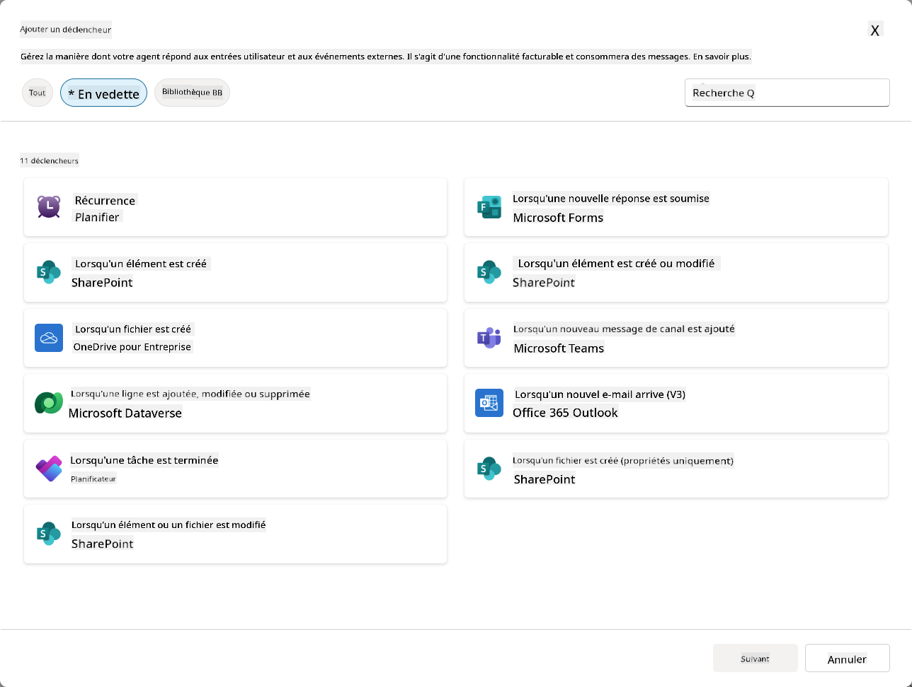

### Pourquoi les déclencheurs d'événements sont importants pour les agents autonomes

Les déclencheurs d'événements transforment votre agent d'un assistant réactif en un assistant proactif et autonome :

1. **Opération autonome** - votre agent peut fonctionner 24h/24 et 7j/7 sans intervention humaine, en répondant aux événements dès qu'ils se produisent.
    - *Exemple :* Accueillir automatiquement les nouveaux membres de l'équipe lorsqu'ils sont ajoutés à une équipe.

1. **Réactivité en temps réel** - au lieu d'attendre que les utilisateurs posent des questions, votre agent répond immédiatement aux événements pertinents.
    - *Exemple :* Alerter l'équipe informatique lorsqu'un document SharePoint est modifié.

1. **Automatisation des workflows** - enchaîner plusieurs actions basées sur un seul événement déclencheur.
    - *Exemple :* Lorsqu'un nouveau ticket de support est créé, créer une tâche, notifier le responsable et mettre à jour le tableau de suivi.

1. **Processus cohérents** - garantir que les étapes importantes ne sont jamais oubliées en automatisant les réponses aux événements clés.
    - *Exemple :* Chaque nouvel employé reçoit automatiquement des documents d'intégration et des demandes d'accès.

1. **Actions basées sur les données** - utiliser les informations de l'événement déclencheur pour prendre des décisions intelligentes et effectuer des actions appropriées.
    - *Exemple :* Rediriger les tickets urgents vers le personnel senior en fonction du niveau de priorité dans la charge utile du déclencheur.

## ⚙️ Comment fonctionnent les déclencheurs d'événements ?

Les déclencheurs d'événements fonctionnent via un workflow en trois étapes qui permet à votre agent de répondre de manière autonome aux événements externes :

### Le workflow de déclenchement

1. **Détection d'événement** - Un événement spécifique se produit dans un système connecté (SharePoint, Teams, Outlook, etc.)
1. **Activation du déclencheur** - Le déclencheur d'événement détecte cet événement et envoie une charge utile à votre agent via un flux cloud Power Automate.
1. **Réponse de l'agent** - Votre agent reçoit la charge utile et exécute les instructions que vous avez définies.

### Déclencheurs d'événements vs déclencheurs de sujets

Comprendre la différence entre ces deux types de déclencheurs est essentiel :

| **Déclencheurs d'événements** | **Déclencheurs de sujets** |
|-------------------------------|----------------------------|
| Activés par des événements de systèmes externes | Activés par des entrées ou phrases utilisateur |
| Permettent un comportement autonome des agents | Permettent des réponses conversationnelles |
| Utilisent l'authentification du créateur | Option pour l'authentification de l'utilisateur |
| Fonctionnent sans interaction utilisateur | Nécessitent que l'utilisateur démarre la conversation |
| Exemples : Fichier créé, email reçu | Exemple : "Quel temps fait-il ?" |

## 📦 Comprendre les charges utiles des déclencheurs

Lorsqu'un événement se produit, le déclencheur envoie une **charge utile** à votre agent contenant des informations sur l'événement et des instructions sur la manière de répondre.

### Charges utiles par défaut vs personnalisées

Chaque type de déclencheur est accompagné d'une structure de charge utile par défaut, mais vous pouvez la personnaliser :

**Charge utile par défaut** - Utilise le format standard comme `Utiliser le contenu de {Body}`

- Contient des informations de base sur l'événement
- Utilise des instructions de traitement génériques
- Idéal pour des scénarios simples

**Charge utile personnalisée** - Ajoutez des instructions spécifiques et un formatage des données

- Incluez des directives détaillées pour votre agent
- Spécifiez exactement quelles données utiliser et comment
- Mieux adapté aux workflows complexes

### Instructions pour l'agent vs instructions spécifiques à la charge utile

Vous avez deux endroits pour guider le comportement de votre agent avec des déclencheurs d'événements :

**Instructions pour l'agent** (Globales)

- Directives générales qui s'appliquent à tous les déclencheurs
- Exemple : "Lors du traitement des tickets, vérifiez toujours les doublons en premier"
- Idéal pour les modèles de comportement généraux

**Instructions spécifiques à la charge utile** (Spécifiques au déclencheur)

- Directives spécifiques pour des types de déclencheurs individuels  
- Exemple : "Pour cette mise à jour SharePoint, envoyez un résumé au canal du projet"
- Idéal pour les agents complexes avec plusieurs déclencheurs

💡 **Astuce pro** : Évitez les instructions contradictoires entre ces deux niveaux, car cela peut entraîner des comportements inattendus.

## 🎯 Scénarios courants de déclencheurs d'événements

Voici des exemples pratiques de la manière dont les déclencheurs d'événements peuvent améliorer votre agent :

### Agent d'assistance informatique

- **Déclencheur** : Nouvel élément de liste SharePoint (ticket de support)
- **Action** : Catégoriser automatiquement, attribuer une priorité et notifier les membres de l'équipe appropriés

### Agent d'intégration des employés

- **Déclencheur** : Nouvel utilisateur ajouté à Dataverse
- **Action** : Envoyer un message de bienvenue, créer des tâches d'intégration et provisionner l'accès

### Agent de gestion de projet

- **Déclencheur** : Tâche terminée dans Planner
- **Action** : Mettre à jour le tableau de bord du projet, notifier les parties prenantes et vérifier les obstacles

### Agent de gestion des documents

- **Déclencheur** : Fichier téléchargé dans un dossier spécifique de SharePoint
- **Action** : Extraire les métadonnées, appliquer des balises et notifier les propriétaires du document

### Agent assistant de réunion

- **Déclencheur** : Événement de calendrier créé
- **Action** : Envoyer des rappels et un ordre du jour avant la réunion, réserver des ressources

## ⚠️ Considérations sur la publication et l'authentification

Avant que votre agent puisse utiliser des déclencheurs d'événements en production, vous devez comprendre les implications en matière d'authentification et de sécurité.

### Authentification du créateur

Les déclencheurs d'événements utilisent les **identifiants du créateur de l'agent** pour toute authentification :

- Votre agent accède aux systèmes en utilisant vos permissions
- Les utilisateurs peuvent potentiellement accéder aux données via vos identifiants
- Toutes les actions sont effectuées "en votre nom" même lorsque les utilisateurs interagissent avec l'agent

### Bonnes pratiques de protection des données

Pour maintenir la sécurité lors de la publication d'agents avec des déclencheurs d'événements :

1. **Évaluer l'accès aux données** - Examinez quels systèmes et données vos déclencheurs peuvent accéder
1. **Tester minutieusement** - Comprenez quelles informations les déclencheurs incluent dans les charges utiles
1. **Limiter la portée des déclencheurs** - Utilisez des paramètres spécifiques pour limiter les événements qui activent les déclencheurs
1. **Examiner les données des charges utiles** - Assurez-vous que les déclencheurs ne divulguent pas d'informations sensibles
1. **Surveiller l'utilisation** - Suivez l'activité des déclencheurs et la consommation des ressources

## ⚠️ Dépannage et limitations

Gardez ces considérations importantes à l'esprit lorsque vous travaillez avec des déclencheurs d'événements :

### Impacts sur les quotas et la facturation

- Chaque activation de déclencheur compte dans votre consommation de messages
- Les déclencheurs fréquents (comme les récurrences toutes les minutes) peuvent rapidement consommer le quota
- Surveillez l'utilisation pour éviter les limitations

### Exigences techniques

- Disponible uniquement pour les agents avec orchestration générative activée
- Nécessite que le partage de flux cloud solution-aware soit activé dans votre environnement

### Prévention des pertes de données (DLP)

- Les politiques DLP de votre organisation déterminent quels déclencheurs sont disponibles
- Les administrateurs peuvent bloquer complètement les déclencheurs d'événements
- Contactez votre administrateur si les déclencheurs attendus ne sont pas disponibles

## 🧪 Laboratoire 10 - Ajouter des déclencheurs d'événements pour un comportement autonome des agents

### 🎯 Cas d'utilisation

Vous allez améliorer votre agent d'assistance informatique pour qu'il réponde automatiquement aux nouvelles demandes de support. Lorsqu'une personne crée un nouvel élément dans votre liste de tickets de support SharePoint, votre agent :

1. Se déclenche automatiquement lorsque le ticket SharePoint est créé
1. Fournit les détails du ticket et les instructions sur les étapes que vous souhaitez qu'il exécute
1. Accuse automatiquement réception du ticket au soumissionnaire via un email généré par l'IA

Ce laboratoire démontre comment les déclencheurs d'événements permettent un comportement véritablement autonome des agents.

### Prérequis

Avant de commencer ce laboratoire, assurez-vous d'avoir :

- ✅ Terminé les laboratoires précédents (en particulier les laboratoires 6-8 pour l'agent d'assistance informatique)
- ✅ Accès au site SharePoint avec la liste des tickets de support informatique
- ✅ Environnement Copilot Studio avec les déclencheurs d'événements activés
- ✅ Votre agent a l'orchestration générative activée
- ✅ Les permissions appropriées dans SharePoint et votre environnement Copilot Studio

### 10.1 Activer l'IA générative et créer un déclencheur de création d'élément SharePoint

1. Ouvrez votre **agent d'assistance informatique** dans **Copilot Studio**

1. Tout d'abord, assurez-vous que **l'IA générative** est activée pour votre agent :
   - Accédez à l'onglet **Aperçu**
   - Sous la section Orchestration, activez **Orchestration générative** sur **Activé** si ce n'est pas déjà fait  
     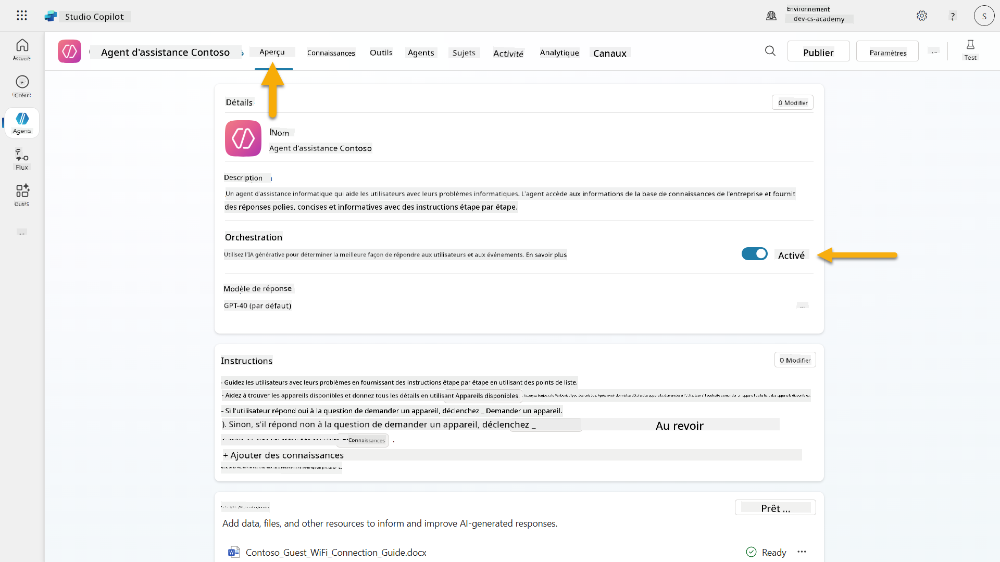

1. Accédez à l'onglet **Aperçu** et localisez la section **Déclencheurs**

1. Cliquez sur **+ Ajouter un déclencheur** pour ouvrir la bibliothèque de déclencheurs  
    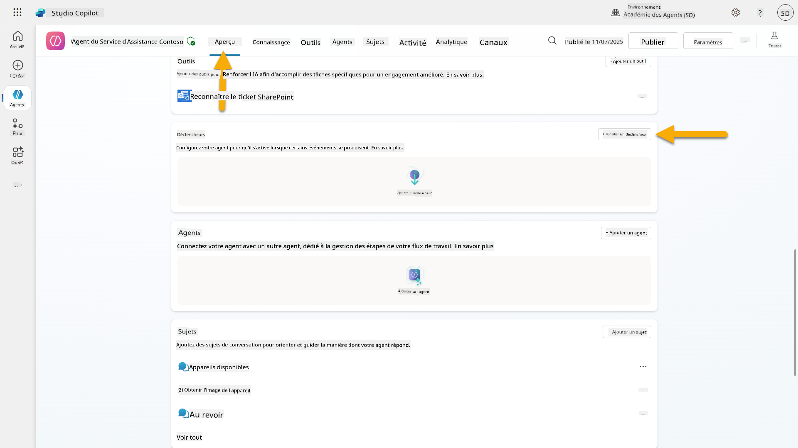

1. Recherchez et sélectionnez **Lorsqu'un élément est créé** (SharePoint)  
    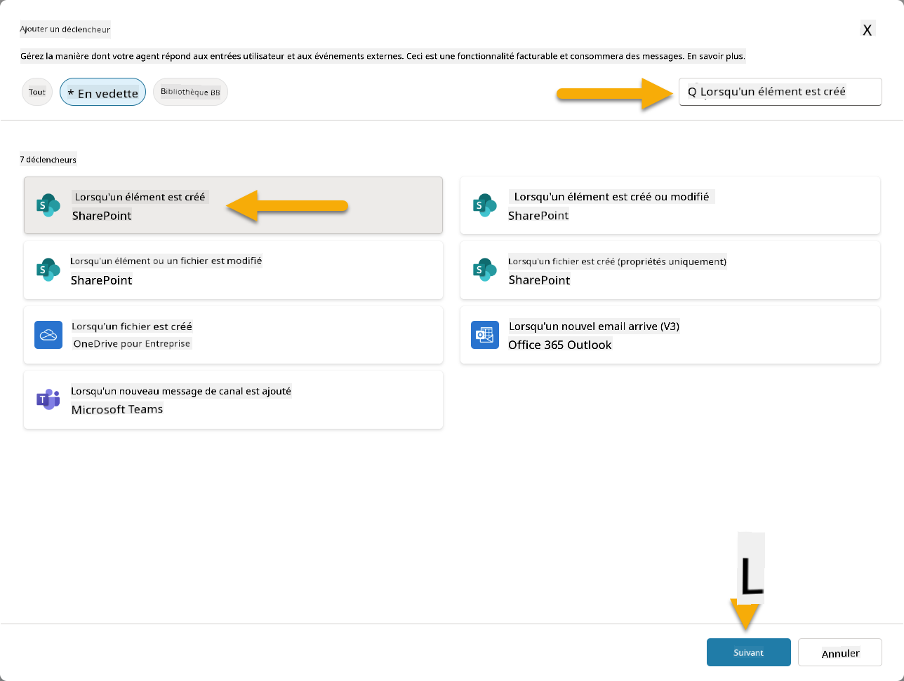

1. Configurez le nom du déclencheur et les connexions :

   - **Nom du déclencheur :** Nouveau ticket de support créé dans SharePoint

1. Attendez que les connexions se configurent, puis sélectionnez **Suivant** pour continuer.  
   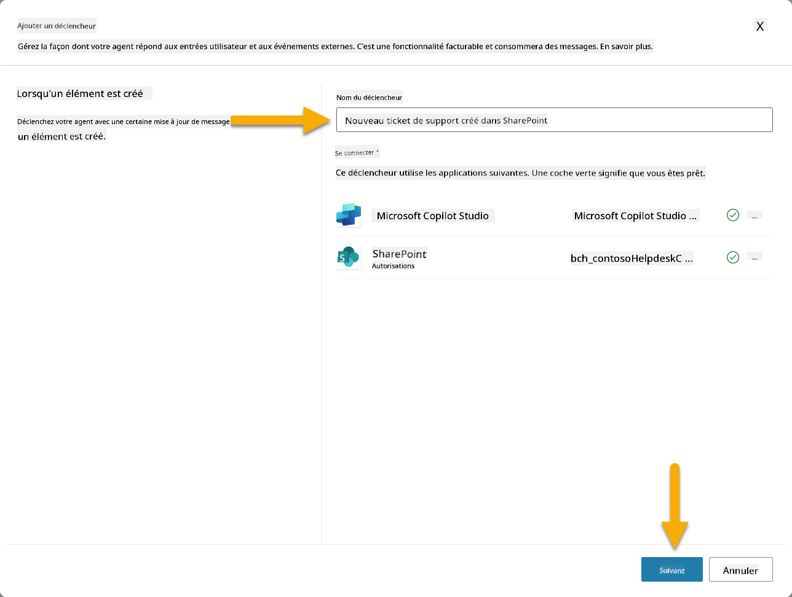

1. Configurez les paramètres du déclencheur :

   - **Adresse du site** : Sélectionnez votre site SharePoint "Contoso IT"

   - **Nom de la liste** : Choisissez votre liste "Tickets"

   - **Instructions supplémentaires à l'agent lorsqu'il est invoqué par le déclencheur :**

     ```text
     New Support Ticket Created in SharePoint: {Body}
     
     Use the 'Acknowledge SharePoint Ticket' tool to generate the email body automatically and respond.
     
     IMPORTANT: Do not wait for any user input. Work completely autonomously.
     ```

     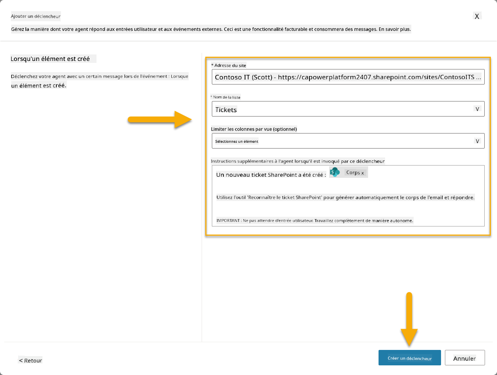

1. Sélectionnez **Créer un déclencheur** pour terminer la création du déclencheur. Un flux cloud Power Automate est automatiquement créé pour déclencher l'agent de manière autonome.

1. Sélectionnez **Fermer**.

### 10.2 Modifier le déclencheur

1. Dans la section **Déclencheurs** de l'onglet **Aperçu**, sélectionnez le menu **...** sur le déclencheur **Nouveau ticket de support créé dans SharePoint**

1. Sélectionnez **Modifier dans Power Automate**  
   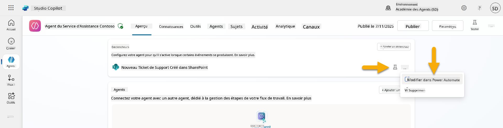

1. Sélectionnez le nœud **Envoie une invite au copilot spécifié pour traitement**

1. Dans le champ **Corps/message**, supprimez le contenu du corps, **appuyez sur la touche barre oblique** (/) et sélectionnez **Insérer une expression**  
   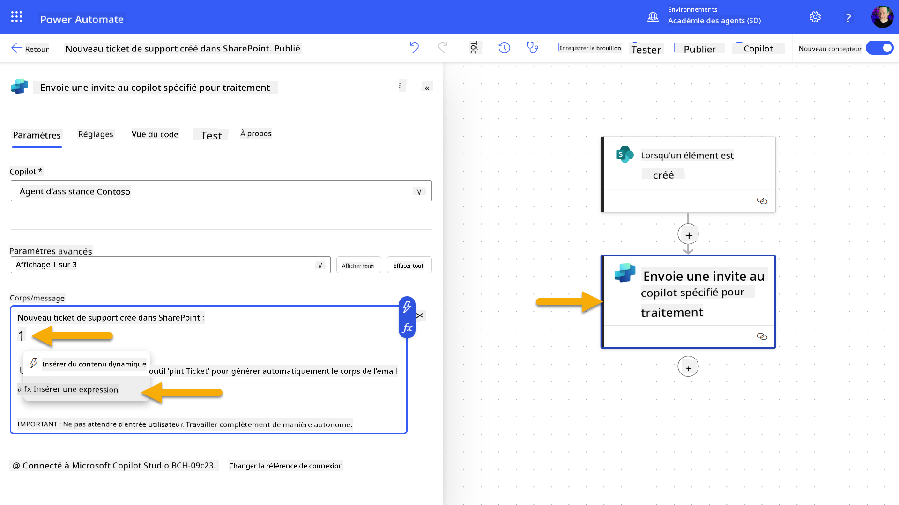

1. Entrez l'expression suivante pour fournir à l'agent des détails spécifiques sur le ticket :

    ```text
    concat('Submitted By Name: ', first(triggerOutputs()?['body/value'])?['Author/DisplayName'], '\nSubmitted By Email: ', first(triggerOutputs()?['body/value'])?['Author/Email'], '\nTitle: ', first(triggerOutputs()?['body/value'])?['Title'], '\nIssue Description: ', first(triggerOutputs()?['body/value'])?['Description'], '\nPriority: ', first(triggerOutputs()?['body/value'])?['Priority/Value'],'\nTicket ID : ', first(triggerOutputs()?['body/value'])?['ID'])
    ```

1. Sélectionnez **Ajouter**  
   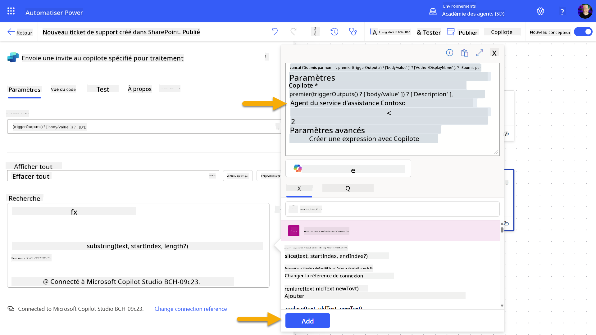

1. Sélectionnez **Publier** dans la barre d'outils en haut à droite.

### 10.3 Créer un outil pour l'accusé de réception par email

1. **Retournez** à votre agent dans Copilot Studio

1. Accédez à l'onglet **Outils** de votre agent

1. Cliquez sur **+ Ajouter un outil** et sélectionnez **Connecteur**

1. Recherchez et sélectionnez le connecteur **Envoyer un email (V2)**  
    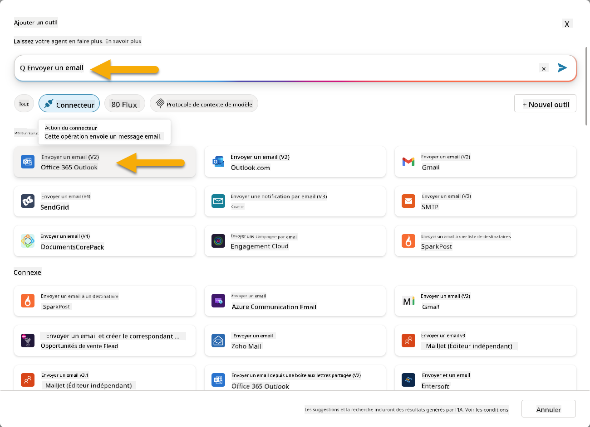

1. Attendez que la connexion se configure, puis sélectionnez **Ajouter et configurer**

1. Configurez les paramètres de l'outil :

   - **Nom** : Accuser réception du ticket SharePoint
   - **Description** : Cet outil envoie un email d'accusé de réception indiquant qu'un ticket a été reçu.

1. Sélectionnez **Personnaliser** à côté des paramètres d'entrée et configurez comme suit :

    **À** :

    - **Description** : L'adresse email de la personne soumettant le ticket SharePoint
    - **Identifier comme** : Email

    **Corps** :

    - **Description** : Un accusé de réception indiquant que le ticket a été reçu, et que nous visons à répondre sous 3 jours ouvrables.

    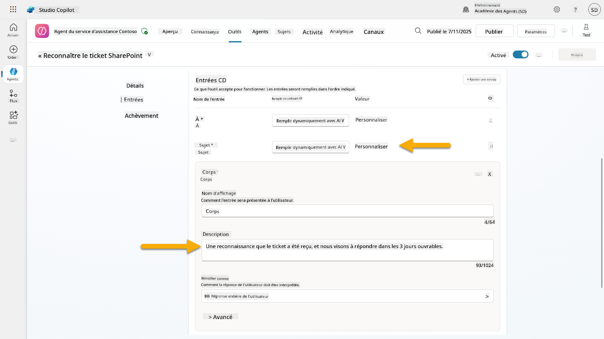

1. Sélectionnez **Enregistrer**

### 10.4 Tester le déclencheur

1. Dans votre **Agent d'assistance**, sélectionnez l'onglet **Aperçu**
1. Cliquez sur l'icône **Tester le déclencheur** à côté du déclencheur **Nouveau ticket de support créé dans SharePoint**. Cela ouvrira la fenêtre **Tester votre déclencheur**.
1. Ouvrez un nouvel onglet de navigateur et accédez à votre **liste de tickets de support IT SharePoint**.
1. Cliquez sur **+ Ajouter un nouvel élément** pour créer un ticket de test :
   - **Titre** : "Impossible de se connecter au VPN"
   - **Description** : "Impossible de se connecter au réseau WIFI de l'entreprise après une mise à jour récente"
   - **Priorité** : "Normale"

1. **Enregistrez** l'élément SharePoint  
    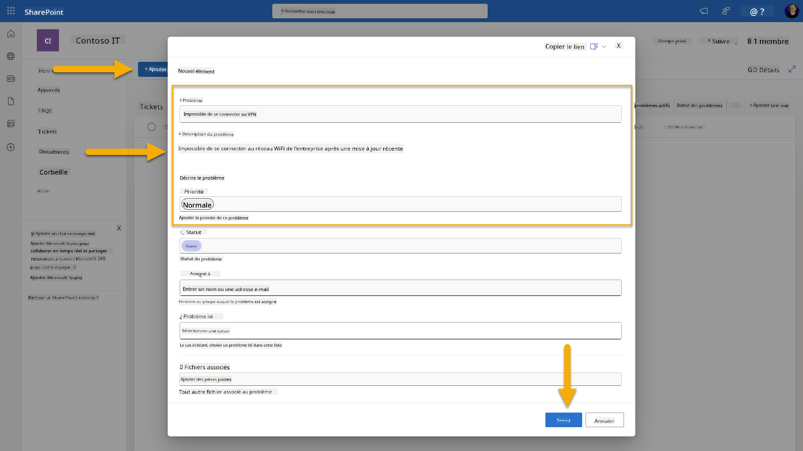
1. Retournez à **Copilot Studio** et surveillez le panneau **Tester votre déclencheur** pour l'activation du déclencheur. Utilisez l'icône **Actualiser** pour charger l'événement de déclenchement, cela peut prendre quelques minutes.  
    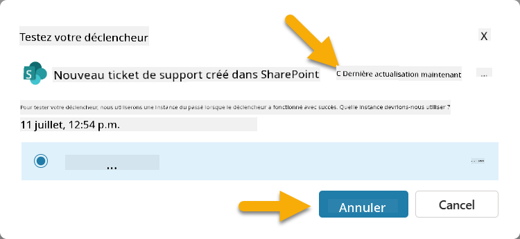
1. Une fois le déclencheur affiché, sélectionnez **Commencer les tests**.
1. Sélectionnez l'**icône Carte d'activité** en haut du panneau **Tester votre agent**.
1. Vérifiez que votre agent :
   - A reçu la charge utile du déclencheur
   - A utilisé l'outil "Accuser réception du ticket SharePoint"  
     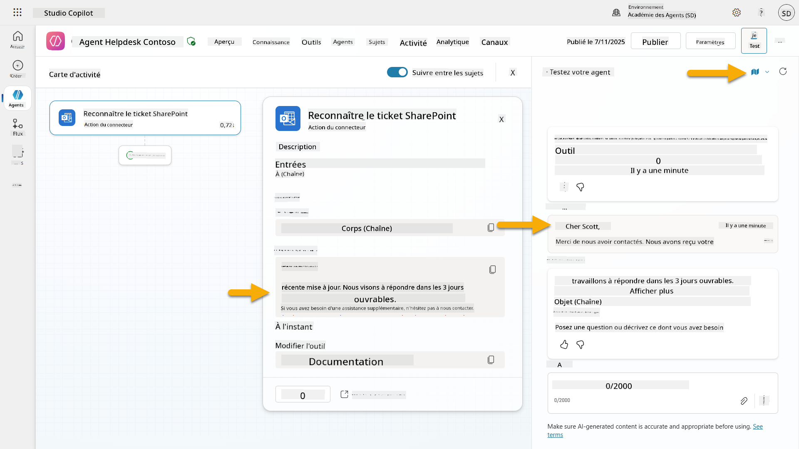
1. Vérifiez la boîte de réception de l'expéditeur pour confirmer que l'email d'accusé de réception a été envoyé  
    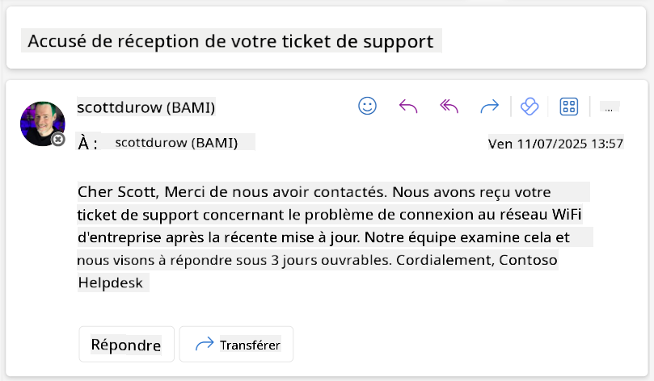
1. Consultez l'onglet **Activité** dans Copilot Studio pour voir l'exécution complète du déclencheur et de l'outil.

## ✅ Mission accomplie

🎉 **Félicitations !** Vous avez réussi à mettre en œuvre des déclencheurs d'événements avec des outils connecteurs permettant à votre agent de fonctionner de manière autonome, en envoyant automatiquement des accusés de réception par email et en traitant les tickets de support sans intervention utilisateur. Une fois votre agent publié, il agira de manière autonome en votre nom.

🚀 **Prochaine étape** : Dans notre prochaine leçon, vous apprendrez à [publier votre agent](../11-publish-your-agent/README.md) sur Microsoft Teams et Microsoft 365 Copilot, le rendant accessible à toute votre organisation !

⏭️ [Passer à la leçon **Publier votre agent**](../11-publish-your-agent/README.md)

## 📚 Ressources tactiques

Prêt à approfondir les déclencheurs d'événements et les agents autonomes ? Consultez ces ressources :

- **Microsoft Learn** : [Rendre votre agent autonome dans Copilot Studio](https://learn.microsoft.com/training/modules/autonomous-agents-online-workshop/?WT.mc_id=power-177340-scottdurow)
- **Documentation** : [Ajouter un déclencheur d'événement](https://learn.microsoft.com/microsoft-copilot-studio/authoring-trigger-event?WT.mc_id=power-177340-scottdurow)
- **Bonnes pratiques** : [Introduction aux déclencheurs Power Automate](https://learn.microsoft.com/power-automate/triggers-introduction?WT.mc_id=power-177340-scottdurow)
- **Scénarios avancés** : [Utiliser des flux Power Automate avec des agents](https://learn.microsoft.com/microsoft-copilot-studio/advanced-flow-create?WT.mc_id=power-177340-scottdurow)
- **Sécurité** : [Prévention des pertes de données pour Copilot Studio](https://learn.microsoft.com/microsoft-copilot-studio/admin-data-loss-prevention?WT.mc_id=power-177340-scottdurow)

<!-- markdownlint-disable-next-line MD033 -->


---

**Avertissement** :  
Ce document a été traduit à l'aide du service de traduction automatique [Co-op Translator](https://github.com/Azure/co-op-translator). Bien que nous nous efforcions d'assurer l'exactitude, veuillez noter que les traductions automatisées peuvent contenir des erreurs ou des inexactitudes. Le document original dans sa langue d'origine doit être considéré comme la source faisant autorité. Pour des informations critiques, il est recommandé de recourir à une traduction humaine professionnelle. Nous ne sommes pas responsables des malentendus ou des interprétations erronées résultant de l'utilisation de cette traduction.