<!--
CO_OP_TRANSLATOR_METADATA:
{
  "original_hash": "9dceeba2eae2bb73e328602a060eddab",
  "translation_date": "2025-10-17T19:05:28+00:00",
  "source_file": "docs/recruit/11-publish-your-agent/README.md",
  "language_code": "fr"
}
-->
# 🚨 Mission 11 : Publiez votre agent

## 🕵️‍♂️ NOM DE CODE : `OPÉRATION PUBLIER PUBLIER PUBLIER`

> **⏱️ Durée de l'opération :** `~30 minutes`  

🎥 **Regardez la démonstration**

[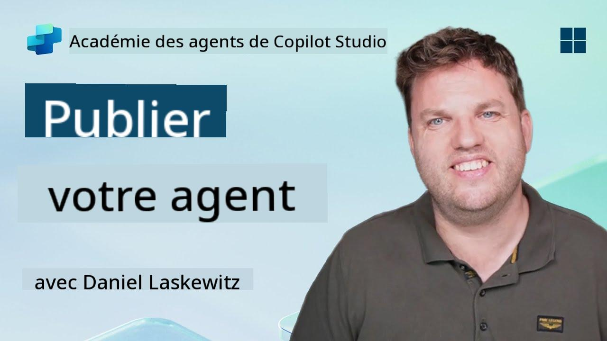](https://www.youtube.com/watch?v=eVZmljhYlSI "Regardez la démonstration sur YouTube")

## 🎯 Mission

Après avoir terminé une série de modules exigeants, Agent Maker, vous êtes maintenant prêt pour l'étape la plus cruciale : publier votre agent. Il est temps de rendre votre création accessible aux utilisateurs de Microsoft Teams et Microsoft 365 Copilot.

Votre agent, équipé d'une mission claire, d'outils puissants et de sources de connaissances clés, est prêt à servir. Grâce à Microsoft Copilot Studio, vous déployez votre agent pour qu'il commence à assister les utilisateurs réels, là où ils travaillent.

Lançons votre agent en action.

## 🔎 Objectifs

📖 Cette leçon couvre :

1. Pourquoi il est important de publier votre agent
1. Ce qui se passe lorsque vous publiez votre agent
1. Comment ajouter un canal (Microsoft Teams & Microsoft 365 Copilot)
1. Comment ajouter l'agent dans Microsoft Teams
1. Comment rendre l'agent accessible dans Microsoft Teams pour toute votre organisation

## 🚀 Publier un agent

Chaque fois que vous travaillez sur un agent dans Copilot Studio, vous pouvez le mettre à jour en ajoutant des connaissances ou des outils. Une fois que vous êtes satisfait des modifications et que vous les avez testées minutieusement, vous êtes prêt à le publier. La publication garantit que les dernières mises à jour sont en ligne. Si vous mettez à jour votre agent avec de nouveaux outils et que vous n'appuyez pas sur le bouton de publication, ces mises à jour ne seront pas encore disponibles pour les utilisateurs finaux.

Assurez-vous toujours d'appuyer sur le bouton de publication lorsque vous souhaitez mettre à disposition les mises à jour pour les utilisateurs de votre agent. Votre agent peut avoir des canaux ajoutés, et lorsque vous appuyez sur publier, les mises à jour sont disponibles pour tous les canaux que vous avez ajoutés à l'agent.

## ⚙️ Configurer les canaux

Les canaux déterminent où vos utilisateurs peuvent accéder et interagir avec votre agent. Après avoir publié votre agent, vous pouvez le rendre disponible sur plusieurs canaux. Chaque canal peut afficher le contenu de votre agent différemment.

Vous pouvez ajouter votre agent aux canaux suivants :

- **Microsoft Teams et Microsoft 365 Copilot** - Rendez votre agent accessible dans les discussions et réunions Teams, ainsi que dans les expériences Microsoft 365 Copilot ([En savoir plus](https://learn.microsoft.com/microsoft-copilot-studio/publication-add-bot-to-microsoft-teams))
- **Site de démonstration** - Testez votre agent sur un site de démonstration fourni par Copilot Studio ([En savoir plus](https://learn.microsoft.com/microsoft-copilot-studio/publication-connect-bot-to-web-channels))
- **Site personnalisé** - Intégrez directement votre agent dans votre propre site web ([En savoir plus](https://learn.microsoft.com/microsoft-copilot-studio/publication-connect-bot-to-web-channels))
- **Application mobile** - Intégrez votre agent dans une application mobile personnalisée ([En savoir plus](https://learn.microsoft.com/microsoft-copilot-studio/publication-connect-bot-to-custom-application))
- **SharePoint** - Ajoutez votre agent aux sites SharePoint pour une assistance sur les documents et les sites ([En savoir plus](https://learn.microsoft.com/microsoft-copilot-studio/publication-add-bot-to-sharepoint))
- **Facebook Messenger** - Connectez-vous avec les utilisateurs via la plateforme de messagerie de Facebook ([En savoir plus](https://learn.microsoft.com/microsoft-copilot-studio/publication-add-bot-to-facebook))
- **Power Pages** - Intégrez votre agent dans les sites Power Pages ([En savoir plus](https://learn.microsoft.com/microsoft-copilot-studio/publication-add-bot-to-power-pages))
- **Canaux Azure Bot Service** - Accédez à des canaux supplémentaires tels que Slack, Telegram, Twilio SMS, et plus encore ([En savoir plus](https://learn.microsoft.com/microsoft-copilot-studio/publication-connect-bot-to-azure-bot-service-channels))

Pour ajouter un canal, accédez à l'onglet **Canaux** de votre agent et sélectionnez le canal que vous souhaitez configurer. Chaque canal a des exigences spécifiques de configuration et peut nécessiter une authentification ou des étapes de configuration supplémentaires.

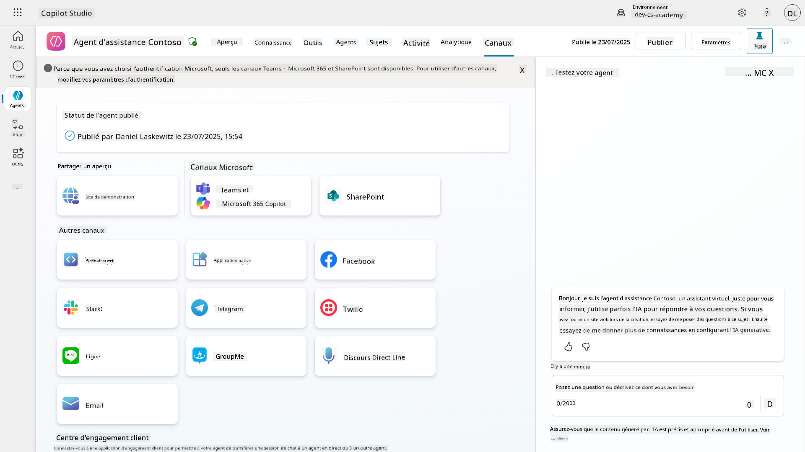

## 📺 Expériences des canaux

Les différents canaux offrent des expériences utilisateur différentes. Lorsque vous créez un agent pour plusieurs canaux, assurez-vous d'être conscient des différences propres à chaque canal. Il est toujours judicieux de tester votre agent sur plusieurs canaux pour vérifier qu'il fonctionne comme prévu.

| Expérience                        | Site web      | Teams et Microsoft 365 Copilot         | Facebook                 | Dynamics Omnichannel pour le service client                 |
| --------------------------------- | ------------- | --------------------------------------- | ------------------------ | ----------------------------------------------------------- |
| [Enquête de satisfaction client][1] | Carte adaptative | Texte uniquement                        | Texte uniquement         | Texte uniquement                                             |
| [Options à choix multiples][1]    | Pris en charge | [Pris en charge jusqu'à six (comme carte héro)][4] | [Pris en charge jusqu'à 13][6] | [Partiellement pris en charge][8]                           |
| [Markdown][2]                     | Pris en charge | [Partiellement pris en charge][5]       | [Partiellement pris en charge][7] | [Partiellement pris en charge][9]                           |
| [Message de bienvenue][1]         | Pris en charge | Pris en charge                          | Non pris en charge       | Pris en charge pour [Chat][10]. Non pris en charge pour les autres canaux. |
| [Did-You-Mean][3]                 | Pris en charge | Pris en charge                          | Pris en charge           | Pris en charge pour [Microsoft Teams][11], [Chat][10], Facebook, et les canaux texte uniquement (service de messages courts (SMS) via [TeleSign][12] et [Twilio][13], [WhatsApp][14], [WeChat][15], et [Twitter][16]). Les actions suggérées sont présentées sous forme de liste texte uniquement ; les utilisateurs doivent retaper une option pour répondre. |

[1]: https://learn.microsoft.com/microsoft-copilot-studio/authoring-create-edit-topics
[2]: https://daringfireball.net/projects/markdown/
[3]: https://learn.microsoft.com/microsoft-copilot-studio/advanced-ai-features
[4]: https://learn.microsoft.com/microsoftteams/platform/concepts/cards/cards-reference#hero-card
[5]: https://learn.microsoft.com/microsoftteams/platform/bots/how-to/format-your-bot-messages#text-only-messages
[6]: https://developers.facebook.com/docs/messenger-platform/send-messages/quick-replies/
[7]: https://www.facebook.com/help/147348452522644?helpref=related
[8]: https://learn.microsoft.com/dynamics365/customer-service/asynchronous-channels#suggested-actions-support
[9]: https://learn.microsoft.com/dynamics365/customer-service/asynchronous-channels#preview-support-for-formatted-messages
[10]: https://learn.microsoft.com/dynamics365/customer-service/set-up-chat-widget
[11]: https://learn.microsoft.com/dynamics365/customer-service/configure-microsoft-teams
[12]: https://learn.microsoft.com/dynamics365/customer-service/configure-sms-channel
[13]: https://learn.microsoft.com/dynamics365/customer-service/configure-sms-channel-twilio
[14]: https://learn.microsoft.com/dynamics365/customer-service/configure-whatsapp-channel
[15]: https://learn.microsoft.com/dynamics365/customer-service/configure-wechat-channel
[16]: https://learn.microsoft.com/dynamics365/customer-service/configure-twitter-channel

> [!NOTE]
> Voici quelques exemples où vous pouvez utiliser une logique différente selon les canaux. Un exemple peut être trouvé dans le dépôt Power Platform Snippets :
>
> Henry Jammes a partagé un exemple montrant comment afficher une carte adaptative différente lorsque le canal est Microsoft Teams. ([Lien vers l'exemple](https://github.com/pnp/powerplatform-snippets/blob/main/copilot-studio/multiple-topics-matched-topic/source/multiple-topics-matched.yaml#L40))

## 🧪 Lab 11 : Publiez votre agent sur Teams et Microsoft 365 Copilot

### 🎯 Cas d'utilisation

Votre agent d'assistance informatique Contoso est maintenant entièrement configuré avec des capacités puissantes : il peut accéder aux sources de connaissances SharePoint, créer des tickets de support, envoyer des notifications proactives et répondre intelligemment aux requêtes des utilisateurs. Cependant, toutes ces fonctionnalités sont actuellement disponibles uniquement dans l'environnement de développement où vous les avez créées.

**Le défi :** Les utilisateurs finaux ne peuvent pas bénéficier des capacités de votre agent tant qu'il n'est pas correctement publié et rendu accessible via les canaux où ils travaillent réellement.

**La solution :** Publier votre agent garantit que la dernière version, avec toutes vos mises à jour récentes, nouveaux sujets, sources de connaissances améliorées et flux configurés, est accessible aux utilisateurs réels. Sans publication, les utilisateurs interagiraient avec une version plus ancienne de votre agent, qui pourrait manquer de fonctionnalités essentielles.

Ajouter le canal Teams et Microsoft 365 Copilot est tout aussi crucial car :

- **Intégration Teams** : Les employés de votre organisation passent la majeure partie de leur journée sur Microsoft Teams pour collaborer, participer à des réunions et communiquer. En ajoutant votre agent à Teams, les utilisateurs peuvent obtenir un support informatique sans quitter leur environnement de travail principal.

- **Microsoft 365 Copilot** : Les utilisateurs peuvent accéder à votre agent d'assistance informatique spécialisé directement dans leur expérience Microsoft 365 Copilot, ce qui le rend parfaitement intégré à leur flux de travail quotidien dans les applications Office.

- **Accès centralisé** : Au lieu de se souvenir de sites web ou d'applications distincts, les utilisateurs peuvent accéder au support informatique via les plateformes qu'ils utilisent déjà, réduisant les frictions et augmentant l'adoption.

Cette mission transforme votre travail de développement en une solution prête pour la production qui apporte une réelle valeur aux utilisateurs finaux de votre organisation.

### Prérequis

Avant de commencer ce lab, assurez-vous d'avoir :

- ✅ Terminé les labs précédents et configuré entièrement l'agent d'assistance Contoso
- ✅ Testé votre agent et confirmé qu'il est prêt pour une utilisation en production
- ✅ Les permissions nécessaires dans votre environnement Copilot Studio pour publier des agents
- ✅ Accès à Microsoft Teams dans votre organisation

### 11.1 Publiez votre agent

Maintenant que tout notre travail sur l'agent est terminé, nous devons nous assurer que tout notre travail est accessible aux utilisateurs finaux qui vont utiliser notre agent. Pour garantir que le contenu est disponible pour tous les utilisateurs, nous devons publier notre agent.

1. Accédez à l'agent d'assistance Contoso dans Copilot Studio (via le [portail Copilot Studio maker](https://copilotstudio.microsoft.com))

    Dans Copilot Studio, il est facile de publier votre agent. Vous pouvez simplement sélectionner le bouton de publication en haut de l'aperçu de l'agent.

    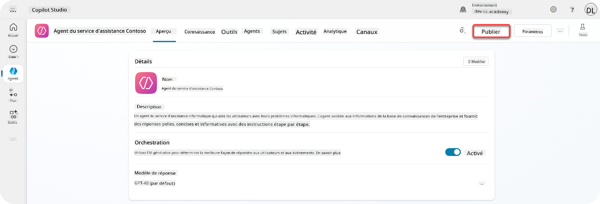

1. Sélectionnez le bouton **Publier** dans votre agent

    Cela ouvre une fenêtre contextuelle de publication - pour confirmer que vous souhaitez vraiment publier votre agent.

    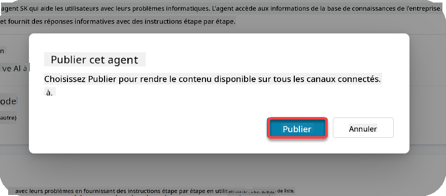

1. Sélectionnez **Publier** pour confirmer la publication de votre agent

    Un message indique que votre agent est en cours de publication. Vous n'avez pas besoin de garder cette fenêtre ouverte. Vous serez informé lorsque l'agent sera publié.

    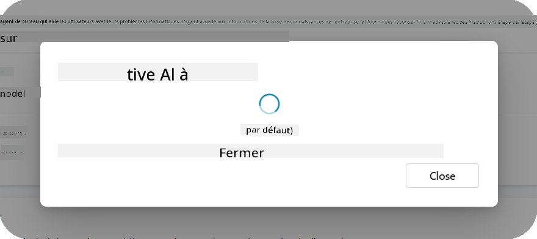

    Une fois la publication terminée, une notification apparaît en haut de la page de l'agent.

    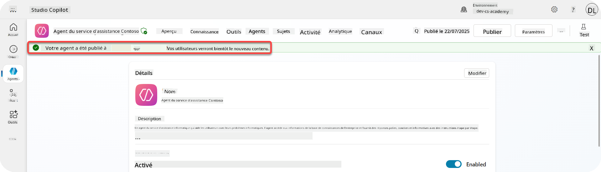

Mais - nous avons seulement publié l'agent, nous ne l'avons pas encore ajouté à un canal, alors corrigeons cela maintenant !

### 11.2 Ajoutez le canal Teams et Microsoft 365 Copilot

1. Pour ajouter le canal Teams et Microsoft 365 Copilot à notre agent, nous devons sélectionner **Canal** dans la navigation supérieure de l'agent

    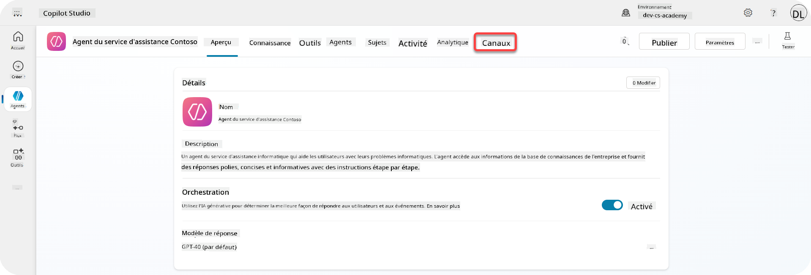

    Ici, nous pouvons voir tous les canaux que nous pouvons ajouter à cet agent.

1. Sélectionnez **Teams et Microsoft 365**

    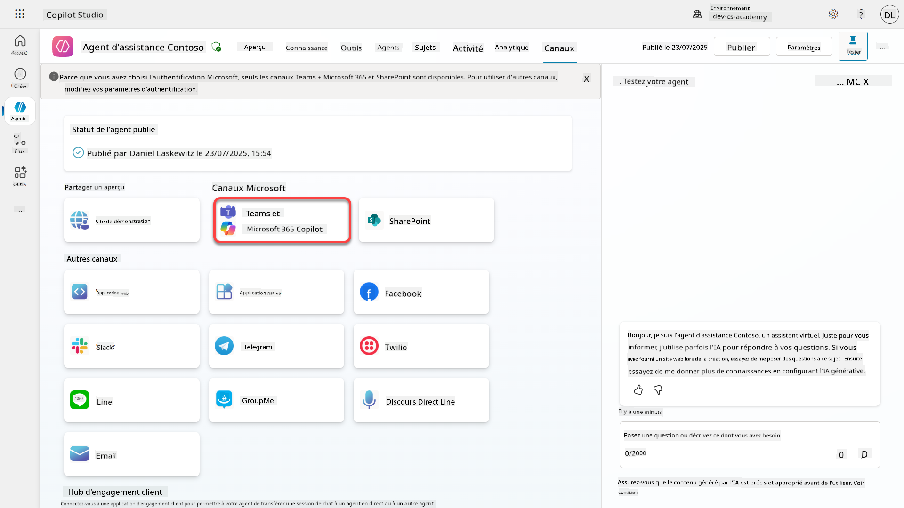

1. Sélectionnez **Ajouter un canal** pour compléter l'assistant et ajouter le canal à l'agent

    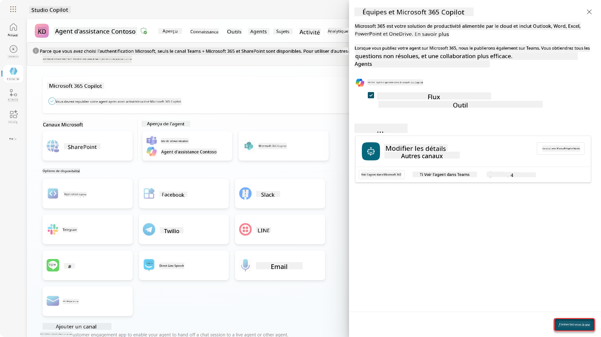

    Cela prendra un peu de temps avant que le canal soit ajouté. Une fois ajouté, une notification verte apparaîtra en haut de la barre latérale.

    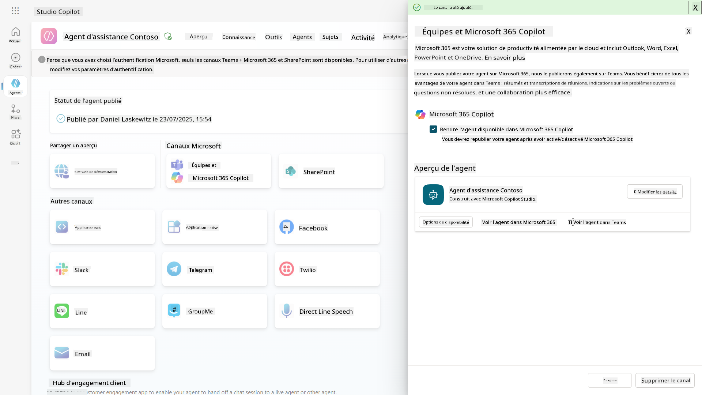

1. Sélectionnez **Voir l'agent dans Teams** pour ouvrir un nouvel onglet

    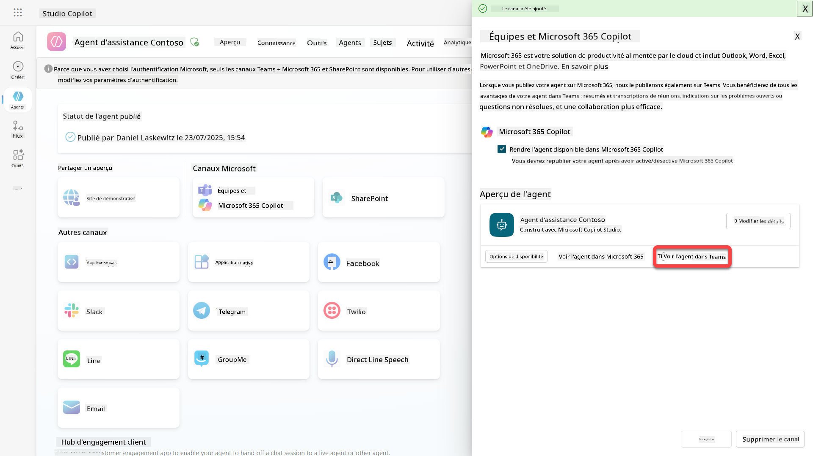

1. Sélectionnez **Ajouter** pour ajouter l'agent d'assistance Contoso à Teams

    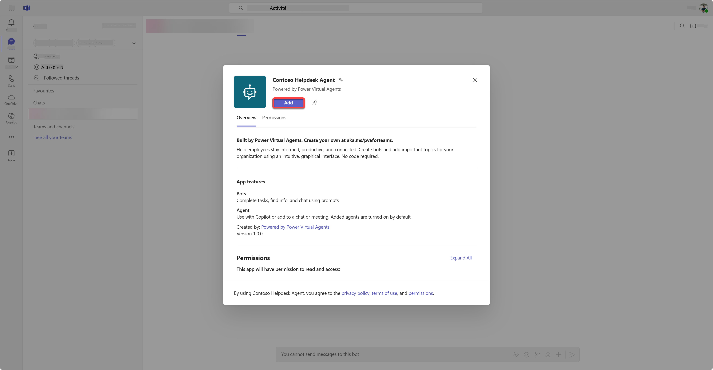

    Cela prendra un peu de temps. Ensuite, l'écran suivant devrait s'afficher :

    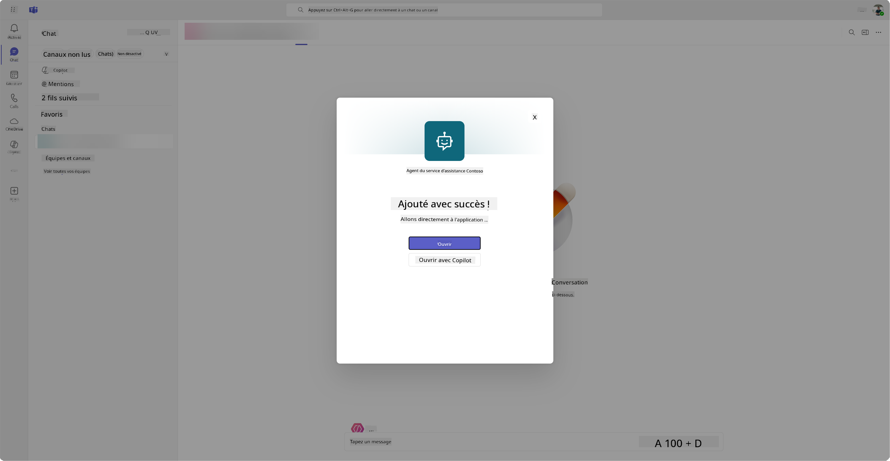

1. Sélectionnez **Ouvrir** pour ouvrir l'agent dans Teams

    Cela ouvrira l'agent dans Teams en tant qu'application Teams

    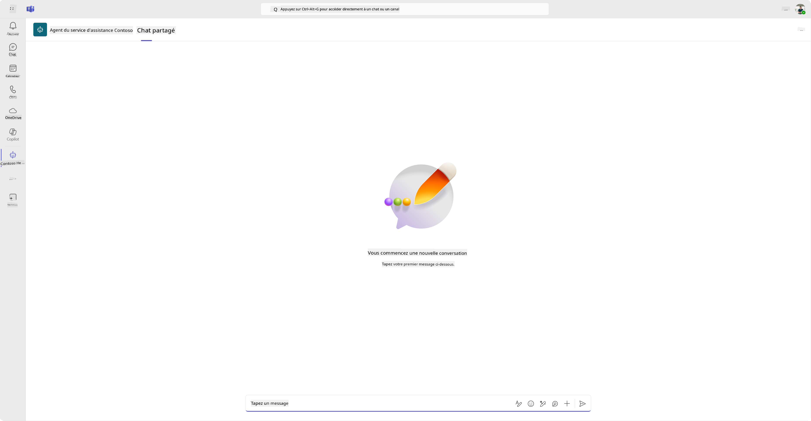

Maintenant, nous avons publié l'agent pour qu'il fonctionne dans Microsoft Teams, mais vous pourriez vouloir le rendre accessible à davantage de personnes.

### 11.3 Rendez l'agent accessible à tous les utilisateurs du tenant

1. Fermez l'onglet du navigateur où l'agent d'assistance Contoso est ouvert

    Cela devrait vous ramener à Copilot Studio où le panneau latéral Teams et Microsoft 365 Copilot est toujours ouvert. Nous avons seulement ouvert l'agent dans Teams pour l'instant, mais nous pouvons faire beaucoup plus ici. Nous pouvons modifier les détails de l'agent, le déployer à davantage d'utilisateurs, et plus encore.

1. Sélectionnez **Modifier les détails**

    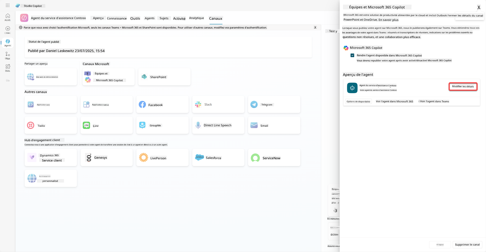
Cela ouvrira un volet où nous pouvons modifier plusieurs détails et paramètres de l'agent. Nous pouvons changer des informations de base comme l'icône, la couleur de fond de l'icône et les descriptions. Nous pouvons également modifier les paramètres de Teams (par exemple, permettre à un utilisateur d'ajouter l'agent à une équipe ou autoriser l'utilisation de cet agent dans les discussions de groupe et de réunion) ici. En sélectionnant *plus*, vous pouvez également modifier les détails du développeur comme le nom du développeur, le site web, la déclaration de confidentialité et les conditions d'utilisation.

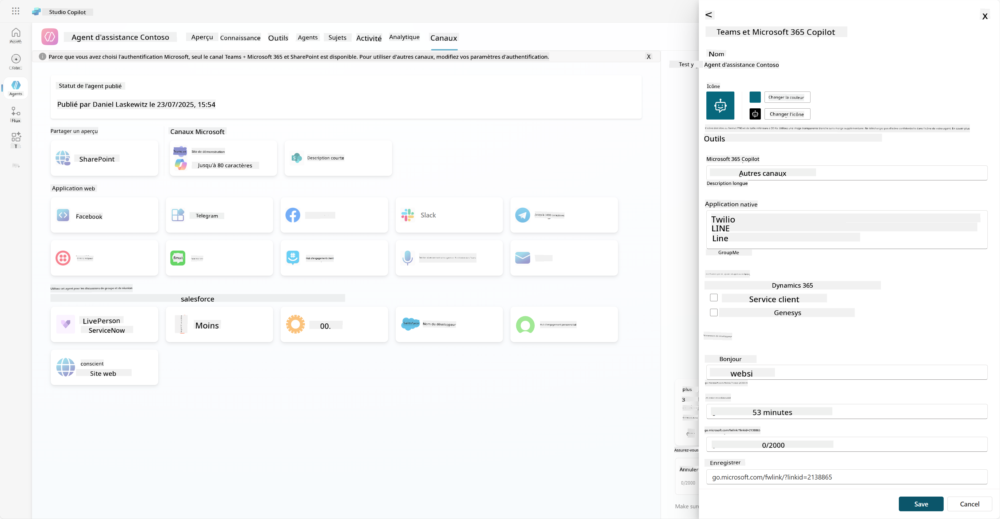

1. Sélectionnez **Annuler** pour fermer le volet de modification des détails.

1. Sélectionnez **Options de disponibilité**.

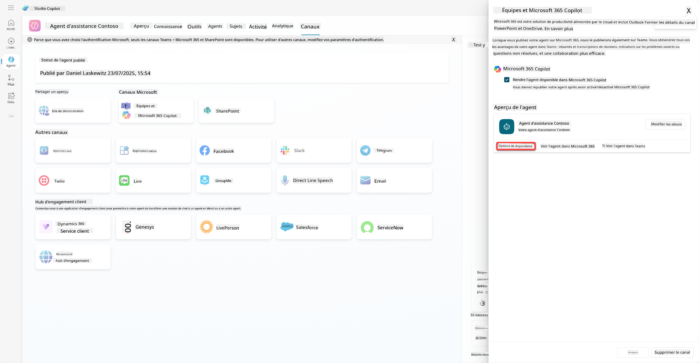

Cela ouvrira le volet des options de disponibilité, où vous pouvez copier un lien à envoyer aux utilisateurs pour qu'ils utilisent cet agent (attention, vous devez également partager l'agent avec l'utilisateur) et vous pouvez télécharger un fichier pour ajouter votre agent au Microsoft Teams ou au Microsoft 365 Store. Pour afficher l'agent dans le store, vous avez d'autres options : vous pouvez le montrer à vos coéquipiers et utilisateurs partagés (pour l'afficher dans la section *Créé avec Power Platform*) ou vous pouvez le montrer à tout le monde dans votre organisation (cela nécessite l'approbation de l'administrateur).

1. Sélectionnez **Afficher à tout le monde dans mon organisation**.

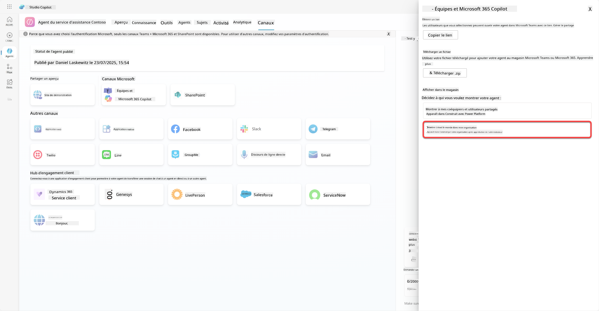

1. Sélectionnez **Soumettre pour approbation de l'administrateur**.

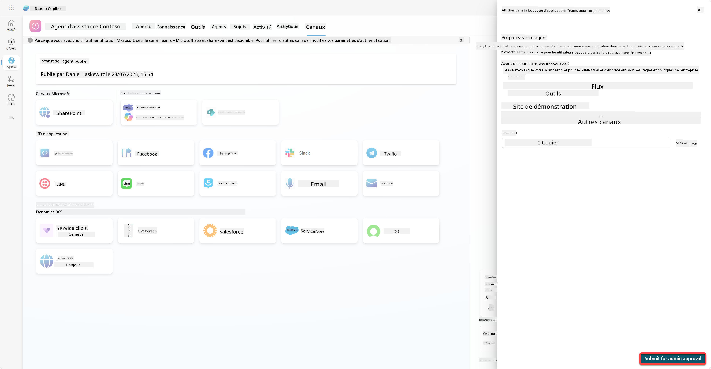

Maintenant, votre administrateur doit approuver la soumission de votre agent. Il peut le faire en accédant au Centre d'administration Teams et en recherchant l'agent Contoso Helpdesk dans les applications. Dans la capture d'écran, vous pouvez voir ce que l'administrateur verrait dans le Centre d'administration Teams.

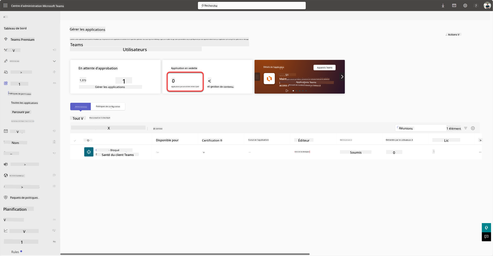

L'administrateur doit sélectionner l'agent Contoso Helpdesk et choisir *Publier* pour publier l'agent Contoso Helpdesk pour tout le monde.

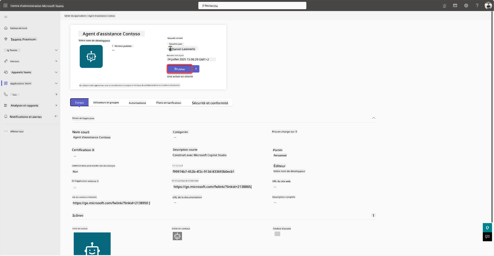

Une fois que l'administrateur a publié la soumission de l'agent, vous pourrez actualiser Copilot Studio et vous devriez voir la bannière *disponible dans le store d'applications* dans les options de disponibilité.

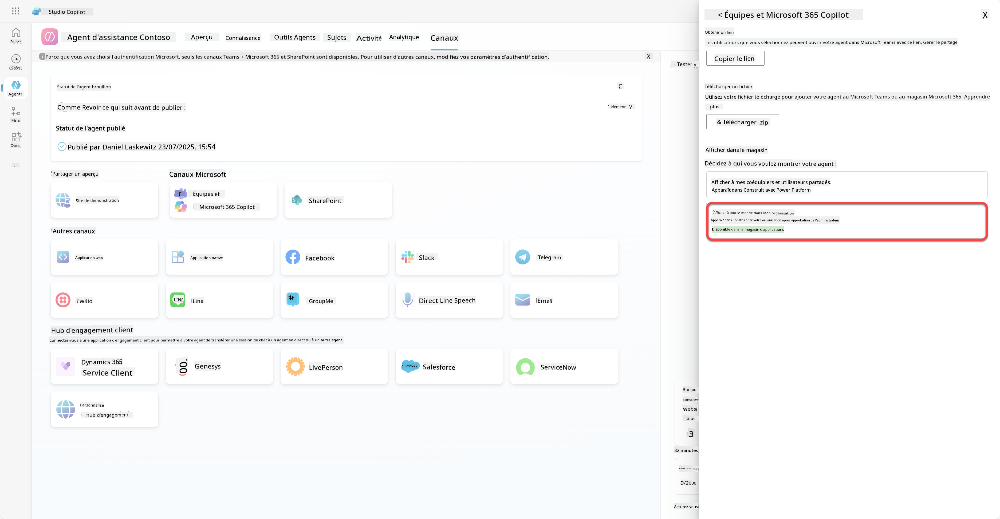

Il y a encore plus de possibilités ici. Votre administrateur peut modifier la politique de configuration globale et installer automatiquement l'agent Contoso Helpdesk pour tout le monde dans le tenant. En plus de cela, vous pouvez épingler l'agent Contoso Helpdesk dans la barre latérale gauche afin que tout le monde y ait facilement accès.

## ✅ Mission accomplie

🎉 **Félicitations !** Vous avez publié avec succès votre agent et l'avez ajouté à Teams et Microsoft 365 Copilot ! La prochaine étape est la dernière mission du cours : Comprendre les licences.

⏭️ [Passer à la leçon **Comprendre les licences**](../12-understanding-licensing/README.md)

## 📚 Ressources tactiques

🔗 [Documentation sur les canaux de publication](https://learn.microsoft.com/microsoft-copilot-studio/publication-fundamentals-publish-channels)

---

**Avertissement** :  
Ce document a été traduit à l'aide du service de traduction automatique [Co-op Translator](https://github.com/Azure/co-op-translator). Bien que nous nous efforcions d'assurer l'exactitude, veuillez noter que les traductions automatisées peuvent contenir des erreurs ou des inexactitudes. Le document original dans sa langue d'origine doit être considéré comme la source faisant autorité. Pour des informations critiques, il est recommandé de recourir à une traduction professionnelle humaine. Nous ne sommes pas responsables des malentendus ou des interprétations erronées résultant de l'utilisation de cette traduction.