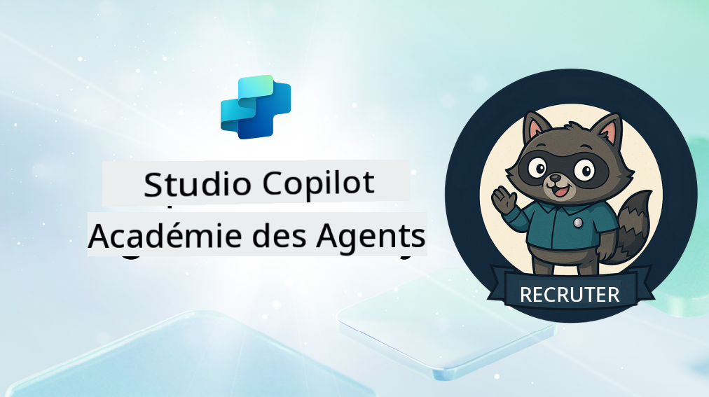

<!--
CO_OP_TRANSLATOR_METADATA:
{
  "original_hash": "8b5ecad9d5d073ea3f4c2b844e80f2e5",
  "translation_date": "2025-10-17T18:53:03+00:00",
  "source_file": "docs/recruit/README.md",
  "language_code": "fr"
}
-->
# Bienvenue, Recrue

**Bienvenue, Recrue.**  
Votre mission, si vous l'acceptez, est de maîtriser l'art de créer des agents avec **Microsoft Copilot Studio**.

Cette formation pratique est votre porte d'entrée dans le **monde des agents** : des invites contextualisées aux Adaptive Cards et aux flux d'agents, vous apprendrez à concevoir, développer et déployer des agents intelligents en utilisant des outils et des cas d'utilisation concrets.

---

## 🎯 Objectif de la Mission

En complétant l'Académie des Agents, vous serez capable de :

- Comprendre ce que sont les agents dans le contexte de Microsoft Copilot Studio
- Explorer comment les modèles de langage étendus (LLMs), la génération augmentée par récupération (RAG) et l'orchestration se combinent dans un agent
- Créer des agents **déclaratifs** et **personnalisés**
- Améliorer les agents avec des **Sujets**, des **Adaptive Cards** et des **Flux d'Agents**
- Déployer des agents sur **Microsoft Teams** et **Microsoft 365 Copilot**

---

## 🧪 Prérequis

Pour accomplir toutes les missions, vous aurez besoin de :

- Un tenant développeur Microsoft 365 (avec SharePoint activé)
- Accès à **Microsoft Copilot Studio** (version d'essai ou sous licence)
- Optionnel : Connaissances de base sur SharePoint, Power Platform ou Power Fx

---

## 🧬 À qui s'adresse ce cours

Ce cours est idéal pour :

- Les créateurs et développeurs explorant **Copilot Studio**
- Les professionnels IT développant des extensions pour **Microsoft 365 Copilot**
- Les passionnés de Power Platform souhaitant **se perfectionner** avec des agents intelligents
- Toute personne préférant apprendre en **pratiquant**

---

## 🧭 Aperçu du Programme

Cette académie est divisée en leçons progressives, chacune conçue comme une mission sur le terrain pour améliorer vos compétences en création d'agents.

| Leçon | Titre | Briefing de Mission |
|-------|-------|---------------------|
| `00` | 🧰 [Configuration du Cours](./00-course-setup/README.md) | Configurez votre environnement de développement, version d'essai de Copilot Studio et site SharePoint |
| `01` | 🧠 [Introduction aux Agents](./01-introduction-to-agents/README.md) | Comprendre les concepts de l'IA conversationnelle, les LLMs, et les agents autonomes vs déclaratifs |
| `02` | 🛠️ [Fondamentaux de Copilot Studio](./02-copilot-studio-fundamentals/README.md) | Apprenez les bases : connaissances, compétences, autonomie |
| `03` | 👩‍💻 [Créer un Agent Déclaratif](./03-create-a-declarative-agent-for-M365Copilot/README.md) | Ajoutez votre propre agent au Microsoft 365 Copilot, basé sur une invite |
| `04` | 🧩 [Créer une Solution](./04-creating-a-solution/README.md) | Emballez votre agent dans une solution réutilisable pour la gestion des environnements |
| `05` | 🚀 [Commencer avec des Agents Préconstruits](./05-using-prebuilt-agents/README.md) | Utilisez et personnalisez un agent modèle pour accélérer la configuration |
| `06` | ✍️ [Créer un Agent Personnalisé](./06-create-agent-from-conversation/README.md) | Créez un nouveau Copilot basé sur des sources de connaissances |
| `07` | 🧠 [Ajouter un Sujet avec des Déclencheurs](./07-add-new-topic-with-trigger/README.md) | Utilisez des Sujets pour définir des chemins de questions/réponses personnalisés |
| `08` | 🪪 [Améliorer avec des Adaptive Cards](./08-add-adaptive-card/README.md) | Créez une Adaptive Card en utilisant Power Fx et SharePoint |
| `09` | 🔁 [Automatiser avec des Flux d'Agents](./09-add-an-agent-flow/README.md) | Utilisez les entrées des Adaptive Cards pour déclencher des flux en arrière-plan |
| `10` | 🧭 [Ajouter des Déclencheurs d'Événements](./10-add-event-triggers/README.md) | Permettez à votre agent d'agir de manière autonome en utilisant une logique basée sur des événements |
| `11` | 📢 [Publier votre Agent](./11-publish-your-agent/README.md) | Déployez votre agent sur Microsoft Teams et Microsoft 365 Copilot |
| `12` | 🪪 [Comprendre les Licences](./12-understanding-licensing/README.md) | Apprenez comment fonctionnent les licences et la facturation avec Copilot Studio |
| `13` | 🚨 [Obtenir votre Badge de Recrue](./course-completion-badges-recruit/README.md) | Réclamez votre badge et marquez votre réussite ! |

!!! note
    ✅ Compléter ce programme vous permet de gagner le badge **Recrue**.  
    🔓 Les niveaux **Opérateur** et **Commandant** seront débloqués dans les phases futures.

<!-- markdownlint-disable-next-line MD033 -->

---

**Avertissement** :  
Ce document a été traduit à l'aide du service de traduction automatique [Co-op Translator](https://github.com/Azure/co-op-translator). Bien que nous nous efforcions d'assurer l'exactitude, veuillez noter que les traductions automatisées peuvent contenir des erreurs ou des inexactitudes. Le document original dans sa langue d'origine doit être considéré comme la source faisant autorité. Pour des informations critiques, il est recommandé de recourir à une traduction humaine professionnelle. Nous ne sommes pas responsables des malentendus ou des interprétations erronées résultant de l'utilisation de cette traduction.