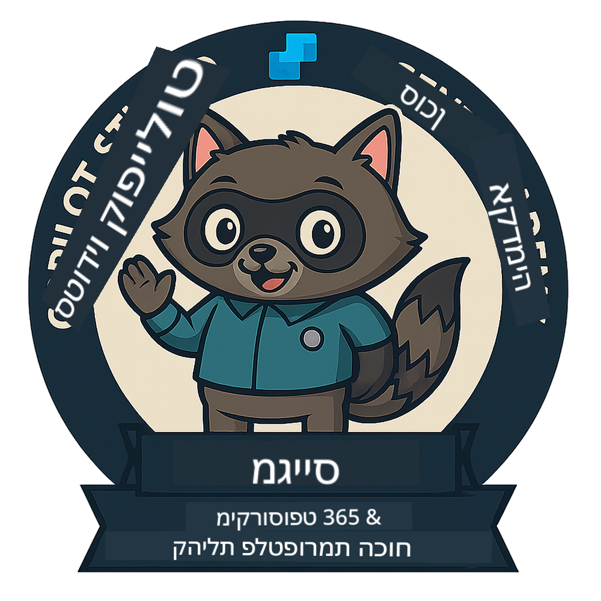

<!--
CO_OP_TRANSLATOR_METADATA:
{
  "original_hash": "15e57e059ce7689d602d7853187235cd",
  "translation_date": "2025-10-17T01:13:44+00:00",
  "source_file": "docs/index.md",
  "language_code": "he"
}
-->
---
hide:
- navigation
---

# אקדמיית סוכני Copilot Studio

**ברוכים הבאים לאקדמיית סוכני Copilot Studio.**  

המשימה שלכם—אם תבחרו לקבל אותה—היא לשלוט באמנות בניית סוכנים באמצעות **Microsoft Copilot Studio**.

ההכשרה המעשית הזו היא נקודת הכניסה שלכם אל **עולם הסוכנים**: החל מהנחיות מבוססות ועד ל- Adaptive Cards וזרימות סוכנים, תלמדו כיצד לבנות, להרחיב ולפרוס סוכנים חכמים באמצעות כלים ומקרי שימוש אמיתיים.

---

## 🏅 התקדמות בדרגות

**אקדמיית סוכני Copilot Studio** היא תוכנית הכשרה רב-שלבית שנועדה לפתח את הכישורים שלכם בשלוש דרגות סוכן. כל רמה כוללת תג ואחריות הולכת וגוברת:

| דרגה             | רמה | חזותי |
|------------------|:-----:|--------|
| 🟢 **מתגייס**  [🚀 התחילו כאן](https://aka.ms/agent-academy-recruit){ .md-button .md-button--primary }     | •     | { width="300" }     |
| 🔵 **מבצעי** (בקרוב)   | ••    | { width="300" } |
| 🟡 **מפקד** (בקרוב)    | •••   | { width="300" } |

כל רמה מתבססת על הקודמת. סיימו את משימת המתגייס שלכם, והישארו מעודכנים כדי להתקדם בדרגות הסוכן שלכם.

---

## 🎒 קורסים נוספים

בדקו את הקורסים הבאים כדי להמשיך ללמוד על AI וסוכנים:

- [Microsoft Copilot Studio <3 MCP Lab](https://aka.ms/mcsmcplab)
- [מחנה מפתחים של Copilot](https://microsoft.github.io/copilot-camp/)
- [סוכני AI למתחילים](https://microsoft.github.io/ai-agents-for-beginners/)
- [פרוטוקול הקשר מודל (MCP) למתחילים](https://github.com/microsoft/mcp-for-beginners)

---

## 🚑 בעיות

אנחנו מעריכים מאוד את המשוב שלכם! אנא השתמשו ב-[רשימת הבעיות](https://github.com/microsoft/agent-academy/issues) כדי לשתף את ההערות והבעיות שלכם. תודה!

---

## 📜 קוד התנהגות

הפרויקט הזה אימץ את [קוד ההתנהגות של קוד פתוח של Microsoft](https://opensource.microsoft.com/codeofconduct/).

!!! info "משאבים:"

    - [קוד ההתנהגות של קוד פתוח של Microsoft](https://opensource.microsoft.com/codeofconduct/)
    - [שאלות נפוצות על קוד ההתנהגות של Microsoft](https://opensource.microsoft.com/codeofconduct/faq/)
    - צרו קשר עם [opencode@microsoft.com](mailto:opencode@microsoft.com) לשאלות או חששות

---

[⭐️ כוכבו את הריפו שלנו](https://github.com/microsoft/agent-academy){ .md-button .md-button--primary }

<!-- markdownlint-disable-next-line MD033 -->

---

**כתב ויתור**:  
מסמך זה תורגם באמצעות שירות תרגום AI [Co-op Translator](https://github.com/Azure/co-op-translator). בעוד שאנו שואפים לדיוק, יש להיות מודעים לכך שתרגומים אוטומטיים עשויים להכיל שגיאות או אי דיוקים. המסמך המקורי בשפתו המקורית צריך להיחשב כמקור סמכותי. עבור מידע קריטי, מומלץ להשתמש בתרגום מקצועי אנושי. איננו אחראים לאי הבנות או לפרשנויות שגויות הנובעות משימוש בתרגום זה.